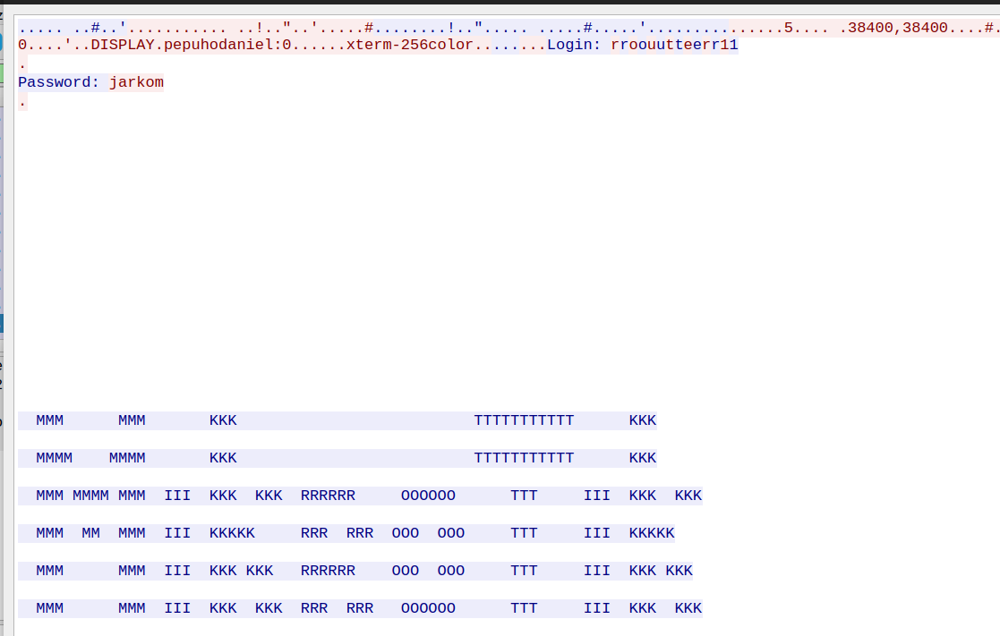

# Crimping dan Wireshark

## Daftar Isi
+ 0.[Basic Command Line Tools untuk Koneksi pada Jaringan](#0-basic-command-line-tools-untuk-koneksi-pada-jaringan)
    + [telnet](#01-telnet)
    + [nc](#02-netcat-nc)
    + [ping](#03-ping)
    + [ssh](#04-ssh-secure-shell)
+ 1.[Konsep IP dan Port]()
    + Konsep IP
    + Alokasi Port
+ 2.[Wire Crimping](#1-wire-crimping)
     + 2.1 [Peralatan yang dibutuhkan](#11-peralatan-yang-dibutuhkan)
     + 2.2 [Jenis-jenis Konfigurasi Kabel UTP](#12-konfigurasi-kabel)
     + 2.3 [Langkah-langkah](#13-langkah---langkah)
+ 3.[Wireshark](#2-wireshark)
	+ 3.1 [Instalasi](#21-instalasi)
	+ 3.2 [Filters](#22-filters)
	+ 3.3 [Export data hasil packet capture](#23-export-data-hasil-paket-capture)
	+ 3.4 [Penggunaan Wireshark pada FTP Server](#24-penggunaan-wireshark-pada-ftp-server)

## 0. Basic Command Line Tools untuk Koneksi pada Jaringan

### 0.1 Telnet

Telnet (Telecommunication Network) adalah sebuah protokol jaringan yang digunakan pada Internet atau LAN (Local Area Network) untuk menyediakan fasilitas komunikasi berbasis teks dan interaksi dua arah dengan menggunakan koneksi terminal virtual.

Protokol ini bisa mengakses komputer dari jarak jauh. Dengan Telnet Anda bisa mengakses file hingga data dari komputer tersebut ke komputer Anda.

Fungsi utama dari telnet adalah mengakses komputer (host/server) dari jarak jauh (remote login). Jadi secara ringkas Telnet berfungsi untuk menghubungkan dua komputer atau lebih dengan tujuan untuk mengelola komputer tujuan.Telnet adalah program yang memungkinkan komputer kita menjadi terminal dari komputer lain di Internet.

Telnet sendiri sangan rentan disisi sekuritas, tampak seperti gambar di password kita dapat melihat kredensial sebuah router.


### 0.2 SSH (Secure Shell)

SSH merupakan sebuah protokol administrasi remote yang memperbolehkan pengguna untuk mengakses dan mengontrol server mereka dalam jaringan secara aman. Mulai dari menjalankan sebuah program, membuat folder, menghapus file, membuat file, transfer file, hingga menjalankan atau menghentikan sebuah services. Singkatnya, SSH memungkinkan pengguna untuk mengelola servernya dengan leluasa meskipun dari jarak jauh.

Cara kerja protokol SSH adalah dengan menerapkan model client-server. Koneksi yang terjadi adalah SSH client (komputer yang digunakan pengguna) melakukan koneksi ke SSH server (server remote yang dituju).

SSH saat ini versi terbarunya yaitu [SSH v2](https://www.synopsys.com/software-integrity/security-testing/fuzz-testing/defensics/protocols/ssh2-server.html). SSH bisa dikatan lebih secure dibandingan Telnet.

Cara melakukan koneksi dengan SSH adalah sebagai berikut:
```
ssh username@host or
ssh username@host -p 2224
```

### 0.3 Netcat (nc)

Netcat (atau nc) adalah utilitas baris perintah yang membaca dan menulis data melalui koneksi jaringan, menggunakan protokol TCP atau UDP. Perintah ini adalah salah satu alat yang paling kuat dalam jaringan dan persenjataan administrator sistem dan dianggap sebagai alat multi fungsi.

Sintaks dari netcat sendiri adalah sebagai berikut:
```
nc [options] host port
```
Secara default, Netcat akan mencoba untuk memulai koneksi TCP ke host dan port yang ditentukan. Jika Anda ingin membuat koneksi UDP, gunakan opsi -u.

### 0.4 Ping

Ping merupakan singkatan dari Packet Internet Network Groper. Secara sederhana, ping adalah perintah untuk mengecek status dan keberadaan host dalam sebuah jaringan internet.

Prinsip utama ping adalah seperti penggunaan sonar untuk mengukur kedalaman laut. Jadi, sebuah sinyal dikirimkan ke dasar, lalu lamanya waktu kembali ke atas menjadi dasar perhitungannya.


source: [https://www.niagahoster.co.id/blog/apa-itu-ping/](https://www.niagahoster.co.id/blog/apa-itu-ping/)

Berikut merupakan cara melakukan ping:


Dengan perintah di atas, Anda akan mendapatkan informasi sebagai berikut:
+ Reply adalah balasan dari host yang diikuti oleh informasi alamat IP. Perintah default di atas, idealnya akan memberikan empat balasan (reply). Namun, bisa saja muncul Request Timed Out (RTO) yang artinya tidak ada balasan sesuai waktu tunggu dari ping tersebut.
+ Bytes adalah jumlah data yang dikirimkan. Untuk Windows, umumnya adalah 32 bytes.
+ Time adalah lamanya waktu respon dari host, yang dihitung dengan satuan ms, atau millisecond. Waktu ping yang bagus adalah di bawah 100ms, terutama kalau penggunaannya untuk game online yang menuntut ping yang rendah.
+ TTL (Time To Live) merupakan durasi sebuah paket data dapat berada di jaringan, yang dicatat dalam hitungan detik. Umumnya, TTL diatur pada kisaran ideal 64 detik.


## 1. Konsep IP dan Port

### 1.1 Konsep IP

IP adalah singkatan dari Internet Protocol, atau dalam bahasa Indonesia berarti Protokol Internet. Jadi, IP address atau internet protocol address adalah alamat protokol internet (alamat IP) yang mengidentifikasi segala perangkat yang terhubung ke jaringan, baik jaringan internet pada umumnya maupun lokal.

Jenis-jenis alamat IP:
#### a. IPv4

Pv4 adalah alamat IP yang paling umum digunakan, dengan panjang 32-bit dan empat bagian (oktet) yang dipisahkan oleh titik. Nilai setiap oktet berkisar dari 0 – 255. Kepanjangan IPv4 yaitu Internet Protocol version 4.

Dengan kemungkinan ini, bisa disimpulkan bahwa saat ini ada sekitar 4,3 miliar alamat IPv4 yang berbeda di seluruh dunia.

Contoh IPv4 adalah seperti berikut:

+ 169.89.131.246
+ 192.0. 2.146
+ 01.102.103.104

Karena merupakan yang paling banyak digunakan, saat ini hampir semua sistem pasti bisa menangani routing IPv4 tanpa masalah. Selain itu, alamat IPv4 mendukung mayoritas topologi jaringan karena prefiksnya yang sederhana. Data dalam address packet IPv4 juga dienkripsi dengan baik untuk memastikan komunikasi yang aman antar jaringan.

#### b. IPv6

IPv6 adalah versi IP address yang lebih baru dari IPv4, dimaksudkan untuk menggantikan IPv4 karena variasi IPv4 yang kini mulai terbatas.

Kalau IPv4 memiliki panjang 32 bit, panjang IPv6 mencapai 128 bit. Artinya, ada sekitar 340 undecillion (angka di belakang digit pertamanya ada 66!) alamat IPv6 yang berbeda.

IPv6 ditulis dalam rangkaian digit heksadesimal 16 bit dan huruf, dipisahkan oleh titik dua. Jadi, pada jenis IP address ini, Anda akan menjumpai huruf dari A sampai F.

Berikut adalah contoh IPv6:

+ 2001:3FFE:9D38:FE75:A95A:1C48:50DF:6AB8
+ 2001:0db8:85a3:0000:0000:8a2e:0370:7334
+ 2001:db8:3333:4444:CCCC:DDDD:EEEE:FFFF
Dengan IPv6, routing akan menjadi lebih efisien karena memungkinkan penyedia layanan internet meminimalkan ukuran tabel routing. IPv6 juga menggunakan Internet Protocol Security (IPsec), jadi Anda tidak perlu cemas dengan autentikasi, kerahasiaan, dan integritas data.

Terlebih lagi, IPv6 tidak memiliki IP checksum sehingga pemrosesan packet menjadi lebih efisien, dan mendukung multicast. Hasilnya, transmisi data pun bisa dikirim ke beberapa tujuan sekaligus sehingga akan menghemat bandwidth jaringan.

### 1.2 Alokasi Port

Port adalah mekanisme yang memungkinkan komputer terhubung dengan beberapa sesi koneksi dengan komputer dan program lainnya dalam jaringan. Setiap port dikaitkan dengan proses atau layanan tertentu. Port akan mengidentifikasi aplikasi dan service yang menggunakan koneksi di dalam protokol TCP/IP. Jadi, port memungkinkan komputer dapat membedakan antara berbagai jenis trafik, misalnya email yang masuk ke port yang berbeda dari halaman web.

Untuk meningkatkan kompatibilitas, port sudah memiliki sistem standardisasi di semua perangkat yang terhubung ke jaringan. Setiap port memiliki identitas dalam bentuk angka 16-bit (dua byte) yang disebut sebagai Port Number.

**Logical Port**
Logical port adalah jalur yang digunakan oleh aplikasi untuk menghubungkan dengan komputer lain melalui jaringan TCP/IP. Salah satu contohnya adalah mengkoneksikan komputer dengan internet. Port ini berperan penting dalam jaringan komputer.

Dilihat dari penomorannya, logical port terbagi menjadi tiga jenis. Ada jenis port yang terdaftar di Internet Assigned Numbers Authority (IANA), dan ada yang tidak, berikut pembagiannya:

+ Well-known port: berkisar dari 0 – 1023. Ini merupakan port yang dikenali atau port sistem. Port ini selalu merepresentasikan layanan jaringan yang sama dan ditetapkan oleh IANA.
+ Registered port: berkisar dari 1024 – 49151. Port ini diketahui dan terdaftar di IANA tetapi tidak dialokasikan secara permanen, sehingga dapat menggunakan port number yang sama.
+ Dynamically assigned port: berkisar dari 49152 – 65535. Port ini ditetapkan oleh sistem operasi atau aplikasi yang digunakan untuk melayani request dari pengguna sesuai dengan kebutuhan.

Berikut ini beberapa contoh logical port yang sering digunakan beserta fungsinya:
+ Port 20 & 21 (FTP), adalah protokol yang berguna dalam mentransfer data di dalam suatu jaringan.
+ Port 22 (SSH), berfungsi mengirimkan data melalui jaringan dalam bentuk terenkripsi. Dapat digunakan untuk menjalankan fungsi atau tugas yang bisa diakses dari jarak jauh, misalnya menghubungkan ke host atau server.
+ Port 23 (TELNET), port untuk menghubungkan komputer dan server jarak jauh. Fungsinya mirip dengan SSH, hanya saja port 23 TELNET tidak menggunakan enkripsi pada koneksinya.
+ Port 25 (SMTP), berfungsi memastikan pengiriman email melalui jaringan dikomunikasikan dengan aman antara sesama SMTP server.
+ Port 53 (DNS), berfungsi sebagai penerjemah alamat IP pada setiap host.
+ Port 67 & 68 (DHCP), atau Dynamic Host Configuration Protocol berfungsi untuk menetapkan informasi terkait alamat IP.
+ Port 80 (HTTP/ Web Server), memungkinkan browser terhubung ke halaman web.
+ Port 443 (HTTPS),  berguna untuk menghubungkan klien ke internet, namun dengan fitur keamanan tambahan yang tidak dimiliki port HTTP 80. Port 443 mengenkripsi paket jaringan sebelum mentransfernya.
+ Port 143 (IMAP), Internet Message Access Protocol atau IMAP adalah protokol untuk mengakses email dari server.

## 2. Wire Crimping
Dalam jaringan komputer, terjadi komunikasi antara satu perangkat dengan perangkat lainnya. Komunikasi itu tentu membutuhkan suatu media. Walaupun sudah ada teknologi komunikasi nirkabel, peran kabel dalam jaringan masih penting dan belum tergantikan. Oleh karena itu dalam modul kali ini, kita akan belajar cara melakukan _crimping_ pada salah satu jenis kabel jaringan yang bernama kabel UTP (_Unshielded Twisted Pair_).

### 2.1 Peralatan yang dibutuhkan
Untuk melakukan _wire crimping_ kita membutuhkan peralatan di bawah ini:
#### a. Kabel UTP


Bahan utama dari proses ini.
#### b. RJ45


RJ45 adalah konektor yang akan menghubungkan kabel UTP dengan perangkat.
#### c. Tang Crimping


Tang ini digunakan untuk memasangkan kabel pada RJ45.
#### d. LAN Tester


Seperti namanya, alat ini digunakan untuk memeriksa apakah kabel yang kita buat berfungsi dengan baik atau tidak.
### 1.2 Konfigurasi Kabel
Ada beberapa macam konfigurasi kabel. Dari urutan warnanya yang sesuai standar internasional dapat dibagi menjadi __T568A__ dan __T568B__.


Sedangkan dari pemasangannya dibagi menjadi
#### b. __Kabel Straight-Through__
  Jenis pengkabelan ini digunakan untuk menyambungkan dua tipe perangkat berbeda yang tersambung ke jaringan, yakni perangkat DTE (data terminal equipment) ke DCE (data circuit-terminating equipment) atau sebaliknya. Perangkat DTE adalah perangkat yang melakukan generate data digital dan bertindak sebagai source dan destination untuk data digital, contohnya adalah komputer, mikrokomputer, terminal, printer. DCE adalah perangkat yang menerima dan mengkonversi data ke link telekomunikasi yang sesuai, umumnya DCE adalah perangkat jaringan seperti router, switch, modem.


  Aturan pemasangannya adalah bahwa tiap ujung kabel harus memiliki urutan warna yang sama. Misal ujung yang satu menggunakan susunan warna berdasarkan aturan T568A maka begitu juga ujung lainnya.

#### b. __Kabel Crossover__
Berkebalikan dengan kabel Straight-through, pengkabelan ini digunakan untuk menyambungkan dua tipe perangkat yang sama yang tersambung ke jaringan, yakni perangkat DTE ke DTE atau DCE ke DCE. Misalnya antara komputer dengan komputer, router dengan router, router dengan switch, komputer dengan printer.

  

  Aturan pemasangannya pun berbeda dengan kabel jenis straight-trough, kabel jenis Crossover memiliki urutan warna yang berbeda dikedua ujungnya. Tapi, perbedaan warna ini tidak boleh sembarangan, karena kedua ujung ini juga memiliki aturan urutan warna. Pada kabel jenis Crossover standar, jika salah satu ujung Pin memiliki susunan warna berdasarkan aturan T568A, maka ujung Pin yang lain harus memiliki urutan warna berdasarkan standar T568B.

### 2.3 Langkah - Langkah
1. Siapkan keperluan crimping (kabel UTP, RJ45, tang crimping, LAN tester)
2. Kupas pelindung kabel UTP
3. Urutkan kabel sesuai konfigurasi yang diinginkan (Straight/Cross/yang lainnya).
4. Potong ujung kabel untuk meratakannya.
5. Masukkan ujung kabel tersebut ke RJ45 dan pastikan menyentuh ujung RJ45.
6. Gunakan tang crimping untuk mengunci kabel UTP dalam RJ45 (pastikan ujung kabel masih menempel dengan ujung RJ45 saat penguncian dilakukan)
7. Terakhir, gunakan LAN tester untuk memastikan kabel yang anda buat bekerja dengan baik.

### Video crimping Straight

[](https://youtu.be/NL0F8bP8k7I)

## 3. Wireshark
Wireshark adalah sebuah aplikasi penganalisa paket jaringan. Penganalisa paket jaringan akan mencoba menangkap paket jaringan dan mencoba untuk menampilkan data paket sedetail mungkin.
Sebuah jaringan komputer dibangun dengan tujuan mengirimkan atau menerima data antara satu end-point dengan end-point lainnya. Data dikirim dalam bentuk paket-paket. Struktur sebuah paket terdiri dari :

***1. Header***
Bagian header berisi alamat dan data lainnya yang dibawa oleh paket. Struktur dari header meliputi :

| Intruksi | Keterangan |
|--  |---|
| Panjang paket | Beberapa jaringan sudah memiliki panjang paket yang baku (*fixed-length*), sementara yang lain bergantung pada header untuk memuat informasi ini |
| Sinkronisasi | Beberapa bit yang membantu paket mencocokkan jaringan yang dimaksud |
| Nomor paket | Menunjukkan urutan dari total paket yang ada |
| Protokol | Pada jaringan yang membawa lebih dari satu macam informasi, protokol ini menunjukkan jenis paket yang ditransmiskan: e-mail, halaman web, atau yang lain |
| Alamat tujuan | Ke mana paket dikirimkan |
| Alamat asal | Dari mana paket dikirimkan |

***2. Payload***
Payload juga disebut sebagai ***body*** dari paket. Pada bagian inilah data yang akan dikirimkan lewat paket berada

***3. Trailer***
trailer, kadang-kadang disebut ***footer***, biasanya memuat sepasang bit yang memberi sinyal pada perangkat penerima bahwa paket sudah mencapai ujungnya. trailer juga bisa memuat semacam *error checking*.

### 3.1 Instalasi
Instalasi untuk OS WIndows atau macOS bisa mengunduh installer pada [ laman ini](https://www.wireshark.org/download.html). Untuk OS linux dapat melihat tutorialnya [di sini](https://linuxtechlab.com/install-wireshark-linux-centosubuntu/).
Setelah melakukan instalasi , jalankan Wireshark sebagai **administrator** (WIndows) atau **root** (linux)
Berikut tampilan awalnya :


### 3.2 Filters
Dalam Wireshark terdapat 2 jenis filter yaitu ***Capture Filter*** dan ***Display Filter***

#### 3.2.1 Capture Filter


 - Definisi : Memilah paket yang akan ditangkap (captured). Paket yang tidak memenuhi kriteria dibiarkan lewat tanpa ditangkap
 - Sintaks filter dapat terdiri dari 1 atau lebih **primitive**. primitive sendiri biasanya terdiri dari sebuah **id** (bilangan atau nama) yang didahului oleh 1 atau lebih jenis qualifier. Perlu diingat bahwa dalam 1 primitive tidak boleh ada 2 atau lebih qualifier sejenis
 - Jenis qualifier :

| Qualifier | Keterangan | Contoh |
|--|--|--|
| type | Menentukan jenis id atau nama yang menjadi nilai filter | host, net, port, portrange |
| dir | Menentukan direction atau arah dari id | src, dst, dan lain-lain |
| proto | Menentukan protokol dari id | tcp, udp, dan lain-lain |

 - Sintaks filter dapat memuat operator, tanda kurung, negasi ( `!` / `not` ), dan kongjungsi ( `&&` / `and` atau `||` / `or` ). Kongjungsi digunakan untuk menghubungkan 2 primitive dalam satu sintaks
 - Contoh sintaks capture filter :

| Filter expression / Primitive(s) | Keterangan |
|--|--|
| `host 10.151.36.1` | Menangkap semua paket yang spesifik menuju ke atau berasal dari alamat 10.151.36.1 |
| `src host 10.151.36.1` | Menangkap semua paket yang spesifik berasal dari alamat 10.151.36.1 |
| `net 192.168.0.0/24` atau `net 192.168.0.0 mask 255.255.255.0` | Menangkap semua paket yang berasal dari atau menuju ke subnet 192.168.0.0/24 |
| `dst net 192.168.0.0/24` | Menangkap semua paket yang menuju ke subnet 192.168.0.0/24 |
| `udp port 80` | Menangkap semua paket dengan protokol UDP yang menuju ke atau berasal dari port 80 |
| `tcp src port 22 or host 10.151.36.30` | Menangkap semua paket dengan protokol TCP yang berasal dari port 22 atau semua paket yang berasal dari atau menuju ke alamat 10.151.36.30 |

 - Contoh capture filter `host 10.151.36.1`


#### 3.2.2 Display Filter

 - Definisi : Memilah paket yang akan ditampilkan dari kumpulan paket yang sudah ditangkap
 - Secara umum sintaks display filter terdiri dari `[protokol] [field] [comparison operator] [value]`. Berikut ini daftar ***comparison operator*** yang tersedia :

| English | Comparison Operator (C-like) | Indonesia |
|---|---|---|
| equal | == | Sama dengan |
| inequality | != | Tidak sama dengan |
| greater than | > | Lebih besar dari |
| less than | < | Lebih kecil dari |
| greater than or equal than | >= | Lebih besar dari atau sama dengan |
| less than or equal to | <= | Lebih kecil dari atau sama dengan |
| contains |  | Protokol atau field mengandung nilai tertentu |
| matches | ~ | Protokol atau field cocok dengan *regular expression* |
| bitwise_and | & | Membandingkan nilai bit sebuah field |

 - Pada display filter bisa menggabungkan 2 filter expression dengan ***logical operator***

| Logical Operator | Keterangan |
|---|---|
| `and` atau `&&` | logical AND |
| `or` | logical OR |
| `xor` atau `^^` | logical XOR |
| `not` atau `!` | logical NOT |
| `[...]` | substring operator |
| `in` | membership operator |

 - Contoh penggunaan display filter :

| Filter expression | Keterangan |
|---|---|
| `tcp.port == 443` | Menampilkan semua paket dengan protokol TCP yang menuju ke atau berasal dari port 443 |
| `ip.src == 192.168.0.1 or ip.dst == 192.168.0.1` | Menampilkan semua paket yang berasal dari alamat 192.168.0.1 atau menuju ke alamat 192.168.0.1 |
| `http.request.uri constains "login"` | Menampilkan semua paket dengan protokol HTTP yang URI nya mengandung string "login" |

 - Contoh display filter `tcp.port == 80`, berikut hasilnya :


### 3.3 Export data hasil paket capture

 1. Setelah memiliki packet, pilih pada menu bar File -> Export Objects -> (protokol yang diinginkan). Pada contoh ini dipilih protokol HTTP

 2. Pilih paket yang akan di-export. Pada contoh ini dipilih paket yang memuat gambar dari situs tertentu tertentu. lalu klik Save dan berikan nama file, path, beserta ekstensinya jika diperlukan.

 3. File berhasil di-export


### 3.4 Penggunaan Wireshark pada FTP Server
Jalankan aplikasi wireshark sebelum *connect* ke server FTP yang dituju.
#### 3.4.1 Connect ke Server
##### a. Windows
Untuk pengguna windows kita akan menggunakan bantuan **FileZilla**. Untuk percobaan di server, di sini menggunakan Filezilla Server dan untuk client menggunakan Filezilla Client. Nantinya server dan clientnya bisa komputer yang sama atau berbeda (asal terhubung ke jaringan komputer).

###### Pembuatan Server FTP di Filezilla Server
1. Buka Filezilla Server (bisa melalui aplikasi Filezilla Server desktop atau XAMPP dengan start module Filezilla dan klik tombol Admin). Jika muncul pop up "Connect to Server" langsung saja klik Ok. Muncul tampilan berikut.


2. Klik menu Edit->Users. Di kolom Users paling kanan, tambahkan user baru dengan cara klik Add dan isikan nama user FTP nya. Berikut hasil setelah menambah user (di sini ditambah user "coba"). Jika ingin menggunakan password, centang "Password" dan masukkan password yang diinginkan.


3. Setelah user terbuat, berikutnya masuk ke setting shared folder untuk menentukan folder yang akan dishare atau diremote dengan FTP. Pada kolom Users, pilih user, dan pada kolom Shared folders, klik tombol "Add" untuk menambah direktori. Berikutnya bisa diatur akses yang akan dimiliki oleh user tersebut terhadap shared folder yang dipilih pada kotak-kotak centang pada kolom Files dan Directories.


Server untuk FTP berhasil dibuat.

#### 3.4.2 Koneksi dari Client

##### a. Menggunakan Filezilla client
Buka FileZilla dan masukkan *Host*, *Username*, *Password*, dan *Port* dari server yang akan disambungkan. Bila sudah yakin, klik *Quickconnect* untuk menyambungkan.


##### b. Menggunakan command Linux
`$ ftp [Host ip]`
Masukkan username dan password, kemudian jalankan seperti CLI

Saat hasil capture dari Wireshark dilihat, akan muncul data di bawah ini:


| Perintah | Keterangan |
|---|---|
| USER | Username yang digunakan untuk login ke FTP server |
| PWD | Password yang digunakan untuk login ke FTP server |)

#### 3.4.3 Upload File
##### a. Menggunakan Filezilla client
Untuk FileZilla drag file dari Local site lalu drop di Remote site

| Perintah | Keterangan |
|---|---|
| STOR | Meng-upload file ke FTP server |

##### b. Menggunakan command Linux
Command upload untuk linux
```
$ put [full path file]
```

Saat hasil capture dilihat akan muncul data dibawah ini :


#### 3.4.4 Download File
##### a. Menggunakan Filezilla client
Untuk Filezilla drag file dari Remote site ke Local site

| Perintah | Keterangan |
|---|---|
| RETR | Men-download suatu file dari FTP server |

##### b. Menggunakan command Linux
Command download untuk linux
```
$ get [nama file]
```

Saat hasil capture dilihat akan muncul data dibawah ini :


## Latihan
1. Apakah perbedaan capture filter dan display filter pada wireshark berdasarkan paket yang ditangkap?
2. Apa perbedaan filter `ip.dst` dengan `ip.dst_host`
3. Lakukan `ping` pada `1.1.1.1` (server dns cloudflare), terapkan display filter yang menampilkan paket-paket yang bersangkutan, lalu carilah apa protokol yang digunakan!
4. Buka halaman `http://example.com/index.html` dan dapatkan source file `index.html` nya mengunakan wireshark!


## Referensi
+ https://nyengnyeng.com/macam-macam-kabel-jaringan-komputer/
+ http://haidirhmc.blogspot.com/2011/12/urutan-warna-kabel-lan-atau-kabel-t568a.html
+ https://www.nesabamedia.com/pengertian-dan-fungsi-kabel-utp/
+ https://www.berguruit.com/2017/09/cara-crimping-kabel-lan-rj45-yang-baik.html
+ https://www.wireshark.org/docs/wsug_html_chunked/ChapterIntroduction.html
+ https://www.wireshark.org/docs/wsug_html_chunked/ChCapCaptureFilterSection.html
+ https://www.wireshark.org/docs/wsug_html_chunked/ChWorkBuildDisplayFilterSection.html
+ https://computer.howstuffworks.com/question5251.htm]
+ https://www.comparitech.com/net-admin/difference-between-straight-through-crossover-rollover-cables/
+ https://www.indowebsite.co.id/kb/cara-mengaktifkan-ftp-pada-localhost-atau-xammp/
