# Crimping dan Wireshark

## Daftar Isi
+ 1.[Wire Crimping](#1-wire-crimping)
     + 1.1 [Peralatan yang dibutuhkan](#11-peralatan-yang-dibutuhkan)
     + 1.2 [Jenis-jenis Konfigurasi Kabel UTP](#12-konfigurasi-kabel)
     + 1.3 [Langkah-langkah](#13-langkah---langkah)
+ 2.[Wireshark](#2-wireshark)
	+ 2.1 [Instalasi](#21-instalasi)
	+ 2.2 [Filters](#22-filters)
	+ 2.3 [Export data hasil packet capture](#23-export-data-hasil-paket-capture)
	+ 2.4 [Penggunaan Wireshark pada FTP Server](#24-penggunaan-wireshark-pada-ftp-server)

## 1. Wire Crimping
Dalam jaringan komputer, terjadi komunikasi antara satu perangkat dengan perangkat lainnya. Komunikasi itu tentu membutuhkan suatu media. Walaupun sudah ada teknologi komunikasi nirkabel, peran kabel dalam jaringan masih penting dan belum tergantikan. Oleh karena itu dalam modul kali ini, kita akan belajar cara melakukan _crimping_ pada salah satu jenis kabel jaringan yang bernama kabel UTP (_Unshielded Twisted Pair_).

### 1.1 Peralatan yang dibutuhkan
Untuk melakukan _wire crimping_ kita membutuhkan peralatan di bawah ini:
#### a. Kabel UTP
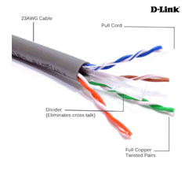

Bahan utama dari proses ini.
#### b. RJ45
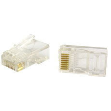

RJ45 adalah konektor yang akan menghubungkan kabel UTP dengan perangkat.
#### c. Tang Crimping


Tang ini digunakan untuk memasangkan kabel pada RJ45.
#### d. LAN Tester
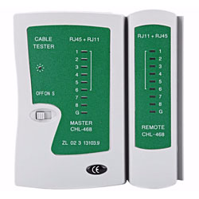

Seperti namanya, alat ini digunakan untuk memeriksa apakah kabel yang kita buat berfungsi dengan baik atau tidak.
### 1.2 Konfigurasi Kabel
Ada beberapa macam konfigurasi kabel. Dari urutan warnanya yang sesuai standar internasional dapat dibagi menjadi __T568A__ dan __T568B__.

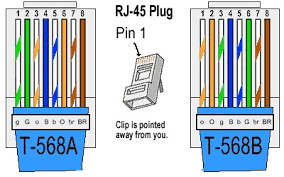

Sedangkan dari pemasangannya dibagi menjadi
#### b. __Kabel Straight-Through__
  Jenis pengkabelan ini digunakan untuk menyambungkan dua tipe perangkat berbeda yang tersambung ke jaringan, yakni perangkat DTE (data terminal equipment) ke DCE (data circuit-terminating equipment) atau sebaliknya. Perangkat DTE adalah perangkat yang melakukan generate data digital dan bertindak sebagai source dan destination untuk data digital, contohnya adalah komputer, mikrokomputer, terminal, printer. DCE adalah perangkat yang menerima dan mengkonversi data ke link telekomunikasi yang sesuai, umumnya DCE adalah perangkat jaringan seperti router, switch, modem.
  
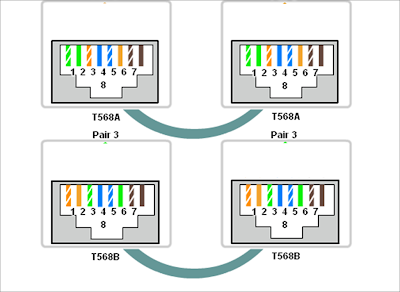
  
  Aturan pemasangannya adalah bahwa tiap ujung kabel harus memiliki urutan warna yang sama. Misal ujung yang satu menggunakan susunan warna berdasarkan aturan T568A maka begitu juga ujung lainnya.

#### b. __Kabel Crossover__
Berkebalikan dengan kabel Straight-through, pengkabelan ini digunakan untuk menyambungkan dua tipe perangkat yang sama yang tersambung ke jaringan, yakni perangkat DTE ke DTE atau DCE ke DCE. Misalnya antara komputer dengan komputer, router dengan router, router dengan switch, komputer dengan printer.
  
  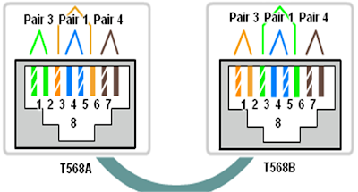
  
  Aturan pemasangannya pun berbeda dengan kabel jenis straight-trough, kabel jenis Crossover memiliki urutan warna yang berbeda dikedua ujungnya. Tapi, perbedaan warna ini tidak boleh sembarangan, karena kedua ujung ini juga memiliki aturan urutan warna. Pada kabel jenis Crossover standar, jika salah satu ujung Pin memiliki susunan warna berdasarkan aturan T568A, maka ujung Pin yang lain harus memiliki urutan warna berdasarkan standar T568B.

### 1.3 Langkah - Langkah
1. Siapkan keperluan crimping (kabel UTP, RJ45, tang crimping, LAN tester)
2. Kupas pelindung kabel UTP
3. Urutkan kabel sesuai konfigurasi yang diinginkan (Straight/Cross/yang lainnya).
4. Potong ujung kabel untuk meratakannya.
5. Masukkan ujung kabel tersebut ke RJ45 dan pastikan menyentuh ujung RJ45.
6. Gunakan tang crimping untuk mengunci kabel UTP dalam RJ45 (pastikan ujung kabel masih menempel dengan ujung RJ45 saat penguncian dilakukan)
7. Terakhir, gunakan LAN tester untuk memastikan kabel yang anda buat bekerja dengan baik.

## 2. Wireshark
Wireshark adalah sebuah aplikasi penganalisa paket jaringan. Penganalisa paket jaringan akan mencoba menangkap paket jaringan dan mencoba untuk menampilkan data paket sedetail mungkin. 
Sebuah jaringan komputer dibangun dengan tujuan mengirimkan atau menerima data antara satu end-point dengan end-point lainnya. Data dikirim dalam bentuk paket-paket. Struktur sebuah paket terdiri dari :

***1. Header***
Bagian header berisi alamat dan data lainnya yang dibawa oleh paket. Struktur dari header meliputi :

| Intruksi | Keterangan |  
|--  |---|
| Panjang paket | Beberapa jaringan sudah memiliki panjang paket yang baku (*fixed-length*), sementara yang lain bergantung pada header untuk memuat informasi ini |  
| Sinkronisasi | Beberapa bit yang membantu paket mencocokkan jaringan yang dimaksud |  
| Nomor paket | Menunjukkan urutan dari total paket yang ada |
| Protokol | Pada jaringan yang membawa lebih dari satu macam informasi, protokol ini menunjukkan jenis paket yang ditransmiskan: e-mail, halaman web, atau yang lain |  
| Alamat tujuan | Ke mana paket dikirimkan |  
| Alamat asal | Dari mana paket dikirimkan |  

***2. Payload***
Payload juga disebut sebagai ***body*** dari paket. Pada bagian inilah data yang akan dikirimkan lewat paket berada

***3. Trailer***
trailer, kadang-kadang disebut ***footer***, biasanya memuat sepasang bit yang memberi sinyal pada perangkat penerima bahwa paket sudah mencapai ujungnya. trailer juga bisa memuat semacam *error checking*.

### 2.1 Instalasi
Instalasi untuk OS WIndows atau macOS bisa mengunduh installer pada [ laman ini](https://www.wireshark.org/download.html). Untuk OS linux dapat melihat tutorialnya [di sini](https://linuxtechlab.com/install-wireshark-linux-centosubuntu/).
Setelah melakukan instalasi , jalankan Wireshark sebagai **administrator** (WIndows) atau **root** (linux)
Berikut tampilan awalnya :
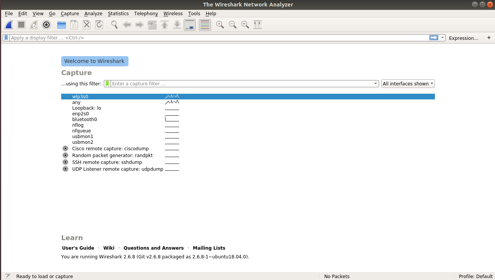

### 2.2 Filters
Dalam Wireshark terdapat 2 jenis filter yaitu ***Capture Filter*** dan ***Display Filter***

#### 2.2.1 Capture Filter
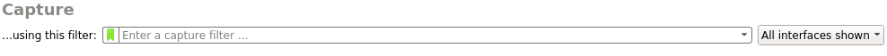

 - Definisi : Memilah paket yang akan ditangkap (captured). Paket yang tidak memenuhi kriteria dibiarkan lewat tanpa ditangkap
 - Sintaks filter dapat terdiri dari 1 atau lebih **primitive**. primitive sendiri biasanya terdiri dari sebuah **id** (bilangan atau nama) yang didahului oleh 1 atau lebih jenis qualifier. Perlu diingat bahwa dalam 1 primitive tidak boleh ada 2 atau lebih qualifier sejenis
 - Jenis qualifier :

| Qualifier | Keterangan | Contoh |
|--|--|--|
| type | Menentukan jenis id atau nama yang menjadi nilai filter | host, net, port, portrange |
| dir | Menentukan direction atau arah dari id | src, dst, dan lain-lain |
| proto | Menentukan protokol dari id | tcp, udp, dan lain-lain |

 - Sintaks filter dapat memuat operator, tanda kurung, negasi ( `!` / `not` ), dan kongjungsi ( `&&` / `and` atau `||` / `or` ). Kongjungsi digunakan untuk menghubungkan 2 primitive dalam satu sintaks
 - Contoh sintaks capture filter :

| Filter expression / Primitive(s) | Keterangan |
|--|--|
| `host 10.151.36.1` | Menangkap semua paket yang spesifik menuju ke atau berasal dari alamat 10.151.36.1 |
| `src host 10.151.36.1` | Menangkap semua paket yang spesifik berasal dari alamat 10.151.36.1 |
| `net 192.168.0.0/24` atau `net 192.168.0.0 mask 255.255.255.0` | Menangkap semua paket yang berasal dari atau menuju ke subnet 192.168.0.0/24 |
| `dst net 192.168.0.0/24` | Menangkap semua paket yang menuju ke subnet 192.168.0.0/24 |
| `udp port 80` | Menangkap semua paket dengan protokol UDP yang menuju ke atau berasal dari port 80 |
| `tcp src port 22 or host 10.151.36.30` | Menangkap semua paket dengan protokol TCP yang berasal dari port 22 atau semua paket yang berasal dari atau menuju ke alamat 10.151.36.30 |

 - Contoh capture filter `host 10.151.36.1`
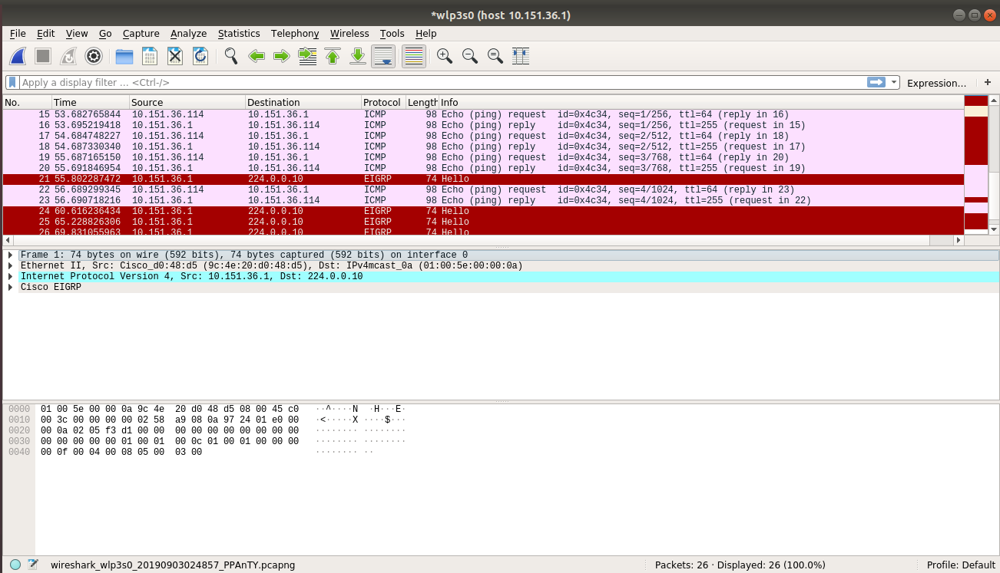

#### 2.2.2 Display Filter
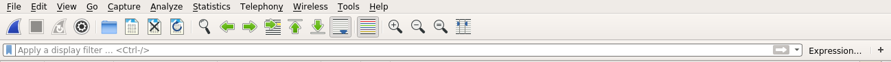
 - Definisi : Memilah paket yang akan ditampilkan dari kumpulan paket yang sudah ditangkap
 - Secara umum sintaks display filter terdiri dari `[protokol] [field] [comparison operator] [value]`. Berikut ini daftar ***comparison operator*** yang tersedia : 

| English | Comparison Operator (C-like) | Indonesia |
|---|---|---|
| equal | == | Sama dengan |
| inequality | != | Tidak sama dengan |
| greater than | > | Lebih besar dari |
| less than | < | Lebih kecil dari |
| greater than or equal than | >= | Lebih besar dari atau sama dengan |
| less than or equal to | <= | Lebih kecil dari atau sama dengan |
| contains |  | Protokol atau field mengandung nilai tertentu |
| matches | ~ | Protokol atau field cocok dengan *regular expression* |
| bitwise_and | & | Membandingkan nilai bit sebuah field |

 - Pada display filter bisa menggabungkan 2 filter expression dengan ***logical operator***

| Logical Operator | Keterangan |
|---|---|
| `and` atau `&&` | logical AND |
| `or` | logical OR |
| `xor` atau `^^` | logical XOR |
| `not` atau `!` | logical NOT |
| `[...]` | substring operator |
| `in` | membership operator |

 - Contoh penggunaan display filter :

| Filter expression | Keterangan |
|---|---|
| `tcp.port == 443` | Menampilkan semua paket dengan protokol TCP yang menuju ke atau berasal dari port 443 |
| `ip.src == 192.168.0.1 or ip.dst == 192.168.0.1` | Menampilkan semua paket yang berasal dari alamat 192.168.0.1 atau menuju ke alamat 192.168.0.1 |
| `http.request.uri constains "login"` | Menampilkan semua paket dengan protokol HTTP yang URI nya mengandung string "login" |

 - Contoh display filter `tcp.port == 80`, berikut hasilnya :
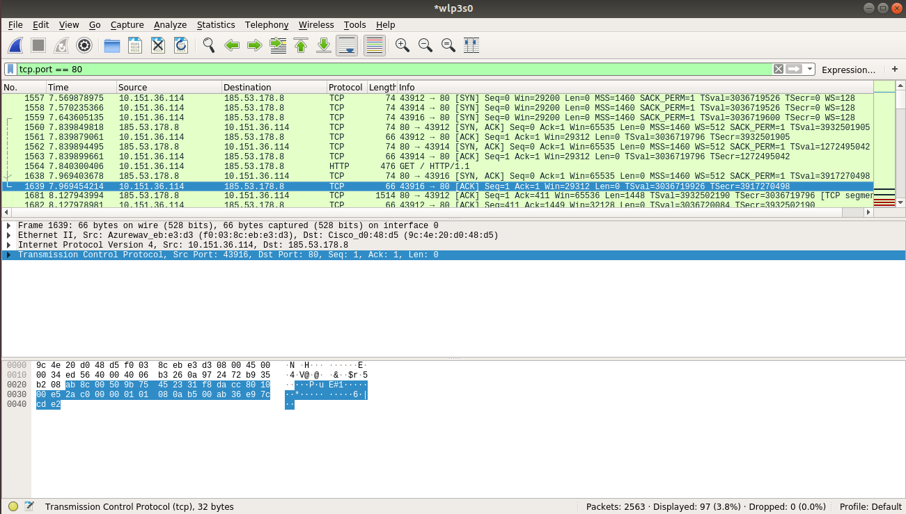

### 2.3 Export data hasil paket capture

 1. Setelah memiliki packet, pilih pada menu bar File -> Export Objects -> (protokol yang diinginkan). Pada contoh ini dipilih protokol HTTP
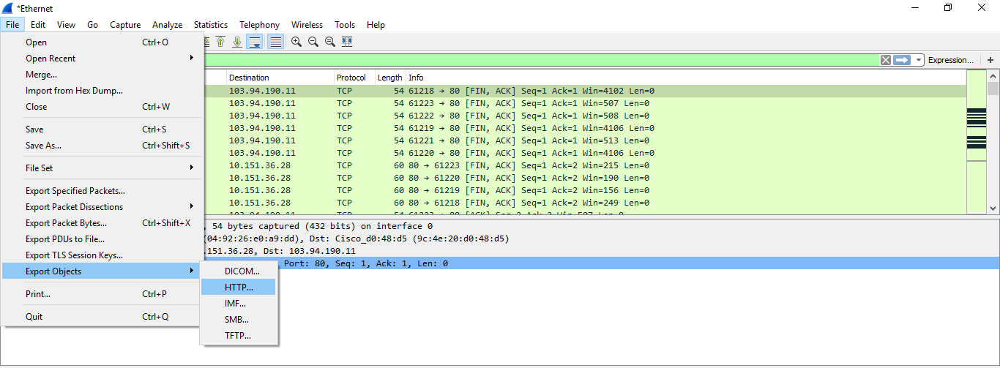
 2. Pilih paket yang akan di-export. Pada contoh ini dipilih paket yang memuat gambar dari situs tertentu tertentu. lalu klik Save dan berikan nama file, path, beserta ekstensinya jika diperlukan.

 3. File berhasil di-export
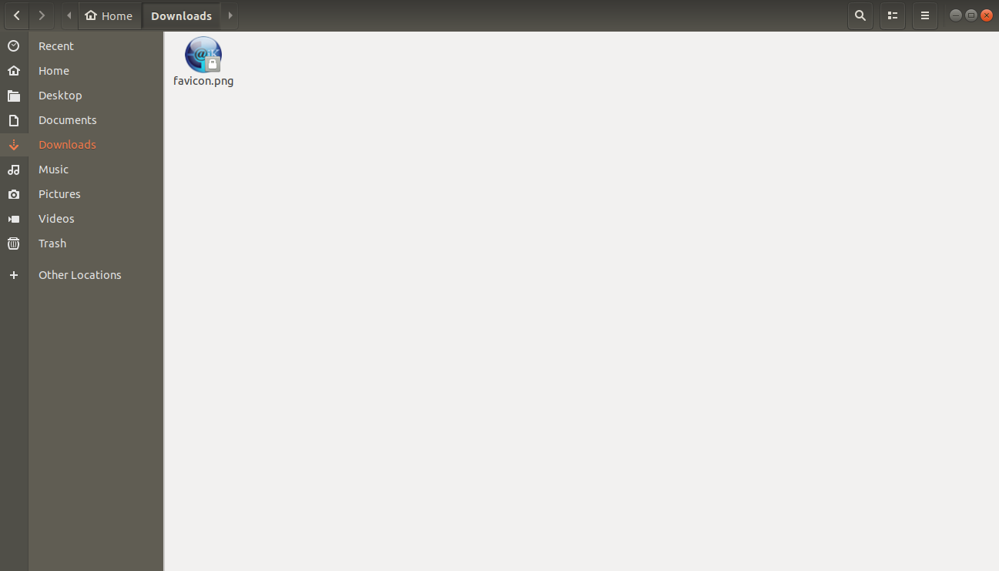

### 2.4 Penggunaan Wireshark pada FTP Server
Jalankan aplikasi wireshark sebelum *connect* ke server FTP yang dituju.
#### 2.4.1 Connect ke Server
##### a. Windows
Untuk pengguna windows kita akan menggunakan bantuan **FileZilla**. Untuk percobaan di server, di sini menggunakan Filezilla Server dan untuk client menggunakan Filezilla Client. Nantinya server dan clientnya bisa komputer yang sama atau berbeda (asal terhubung ke jaringan komputer). 

###### Pembuatan Server FTP di Filezilla Server
1. Buka Filezilla Server (bisa melalui aplikasi Filezilla Server desktop atau XAMPP dengan start module Filezilla dan klik tombol Admin). Jika muncul pop up "Connect to Server" langsung saja klik Ok. Muncul tampilan berikut.

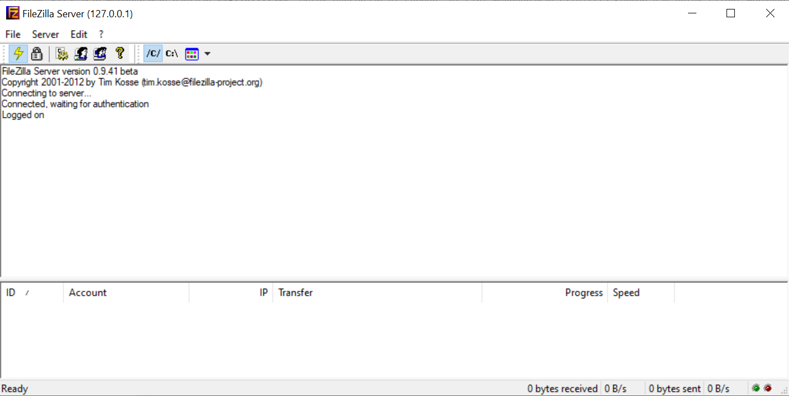

2. Klik menu Edit->Users. Di kolom Users paling kanan, tambahkan user baru dengan cara klik Add dan isikan nama user FTP nya. Berikut hasil setelah menambah user (di sini ditambah user "coba"). Jika ingin menggunakan password, centang "Password" dan masukkan password yang diinginkan.

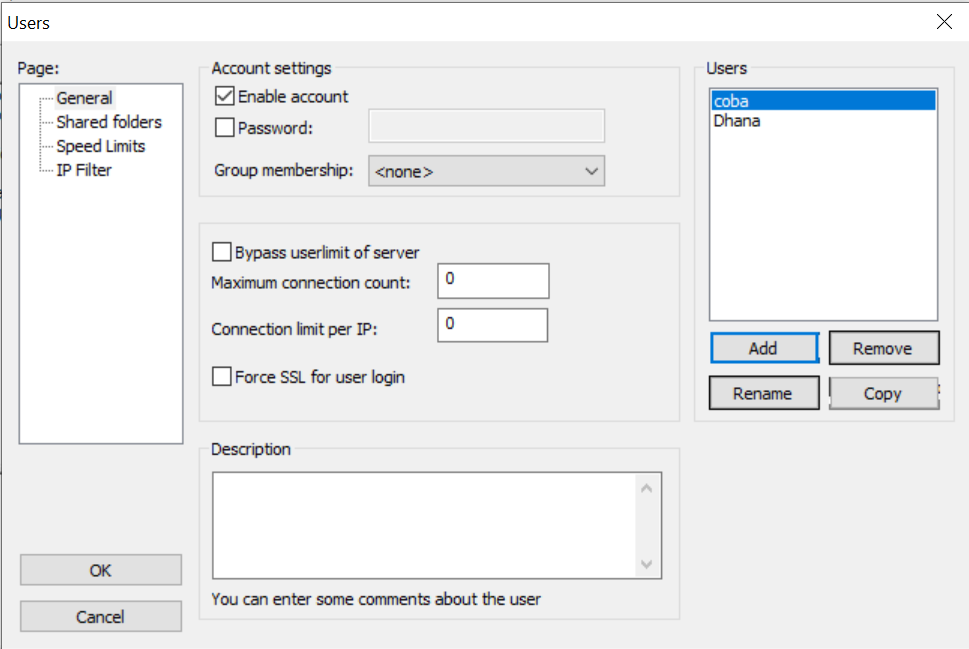

3. Setelah user terbuat, berikutnya masuk ke setting shared folder untuk menentukan folder yang akan dishare atau diremote dengan FTP. Pada kolom Users, pilih user, dan pada kolom Shared folders, klik tombol "Add" untuk menambah direktori. Berikutnya bisa diatur akses yang akan dimiliki oleh user tersebut terhadap shared folder yang dipilih pada kotak-kotak centang pada kolom Files dan Directories.

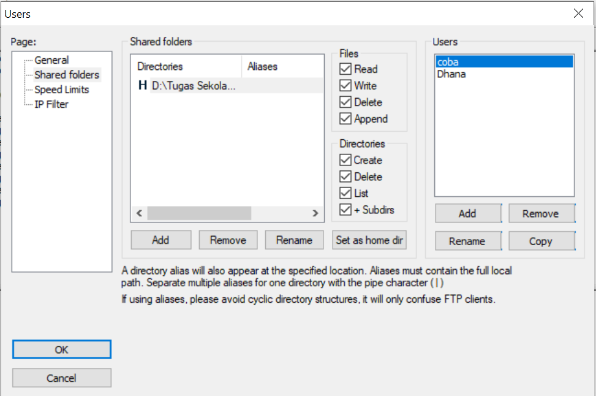

Server untuk FTP berhasil dibuat.

#### 2.4.2 Koneksi dari Client

##### a. Menggunakan Filezilla client
Buka FileZilla dan masukkan *Host*, *Username*, *Password*, dan *Port* dari server yang akan disambungkan. Bila sudah yakin, klik *Quickconnect* untuk menyambungkan.

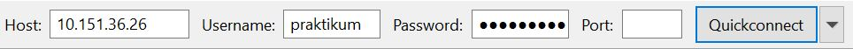

##### b. Menggunakan command Linux
`$ ftp [Host ip]`
Masukkan username dan password, kemudian jalankan seperti CLI

Saat hasil capture dari Wireshark dilihat, akan muncul data di bawah ini:

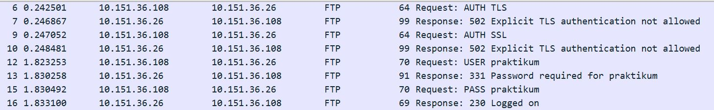

| Perintah | Keterangan |
|---|---|
| USER | Username yang digunakan untuk login ke FTP server |
| PWD | Password yang digunakan untuk login ke FTP server |)

#### 2.4.3 Upload File
##### a. Menggunakan Filezilla client
Untuk FileZilla drag file dari Local site lalu drop di Remote site

| Perintah | Keterangan |
|---|---|
| STOR | Meng-upload file ke FTP server |

##### b. Menggunakan command Linux
Command upload untuk linux
```
$ put [full path file]
```

Saat hasil capture dilihat akan muncul data dibawah ini :

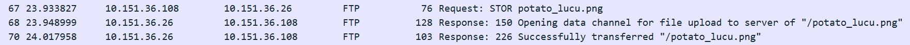

#### 2.4.4 Download File
##### a. Menggunakan Filezilla client
Untuk Filezilla drag file dari Remote site ke Local site

| Perintah | Keterangan |
|---|---|
| RETR | Men-download suatu file dari FTP server |

##### b. Menggunakan command Linux
Command download untuk linux
```
$ get [nama file]
```

Saat hasil capture dilihat akan muncul data dibawah ini :

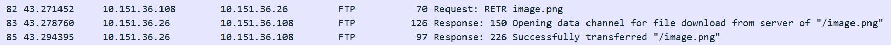

## Latihan
1. Ketika mengakses suatu halaman web, berapakah port yang dituju oleh suatu paket?
2. Apa sajakah perbedaan ketika mengakses halaman utama website if.its.ac.id dan monta.if.its.ac.id? Jelaskan jawaban anda.
3. Ada berapa jumlah paket yang dikirimkan oleh web server ketika mengunduh file? Mengapa terjadi yang seperti itu?
4. Dari hasil analisa paket, apa perbedaan ketika menggunakan persistent connection dan non-persistent connection?
5. Apa perbedaan ketika autentikasi menggunakan method basic dengan digest?
6. Apa perbedaan ketika mengakses halaman web biasa dengan ketika proses login terjadi?
7. Apa saja yang selalu dikirimkan browser ke web server?Export data hasil paket capture

## Referensi
+ https://nyengnyeng.com/macam-macam-kabel-jaringan-komputer/
+ http://haidirhmc.blogspot.com/2011/12/urutan-warna-kabel-lan-atau-kabel-t568a.html
+ https://www.nesabamedia.com/pengertian-dan-fungsi-kabel-utp/
+ https://www.berguruit.com/2017/09/cara-crimping-kabel-lan-rj45-yang-baik.html
+ https://www.wireshark.org/docs/wsug_html_chunked/ChapterIntroduction.html
+ https://www.wireshark.org/docs/wsug_html_chunked/ChCapCaptureFilterSection.html
+ https://www.wireshark.org/docs/wsug_html_chunked/ChWorkBuildDisplayFilterSection.html
+ https://computer.howstuffworks.com/question5251.htm]
+ https://www.comparitech.com/net-admin/difference-between-straight-through-crossover-rollover-cables/
+ https://www.indowebsite.co.id/kb/cara-mengaktifkan-ftp-pada-localhost-atau-xammp/
