# Crimping dan Wireshark

## Daftar Isi
+ 0. [Basic Command Line Tools untuk Koneksi pada Jaringan](#0-basic-command-line-tools-untuk-koneksi-pada-jaringan)
  + [telnet](#01-telnet)
  + [ssh](#02-ssh-secure-shell)
  + [nc](#03-netcat-nc)
  + [ping](#04-ping)
+ 1. [Konsep IP dan Port](#1-konsep-ip-dan-port)
  + [Konsep IP](#11-konsep-ip)
  + [Alokasi Port](#12-alokasi-port)
+ 2. [Topologi Jaringan Dasar](#2-topologi-jaringan-dasar)
  + [2.1 Bagaimana node terhubung?](#21-bagaimana-node-terhubung)
    + [2.1.1 Melalui console](#211-melalui-console)
    + [2.1.2 Melalui "edit network config"](#212-melalui-edit-network-config)
  + [2.2 Bagaimana mengetahui kapasitas transfer antar nodes?](#22-bagaimana-mengetahui-kapasitas-transfer-antar-nodes)
    + [2.2.1 Menggunakan iperf3](#221-menggunakan-iperf3)
  + [2.3 Menghubungkan Banyak Node Menggunakan Bridge](#23-menghubungkan-banyak-node-menggunakan-bridge)
    + [2.3.1 Konfigurasi Dasar Bridge](#231-konfigurasi-dasar-bridge)
  + [2.4 Simulasi Jaringan](#24-simulasi-jaringan)
    + [2.4.1 Simulasi Packet Loss](#241-simulasi-packet-loss)
    + [2.4.2 Simulasi Pembatasan Throughput](#242-simulasi-pembatasan-throughput)
  + [2.5 Beralih dari Bridge ke Switch](#25-beralih-dari-bridge-ke-switch)
    + [2.5.1 Topologi Sederhana Switch](#251-topologi-sederhana-switch)
    + [2.5.2 Simulasi Meneruskan Paket pada Switch](#252-simulasi-meneruskan-paket-pada-switch)
  + [2.6 Konfigurasi IP Otomatis dengan DHCP](#26-konfigurasi-ip-otomatis-dengan-dhcp)
    + [2.6.1 Konfigurasi DHCP Server (udhcpd)](#261-konfigurasi-dhcp-server-udhcpd)
    + [2.6.2 Konfigurasi DHCP client](#262-konfigurasi-dhcp-client)
    + [2.6.3 Konfigurasi DHCP client manual](#263-konfigurasi-dhcp-client-manual)
+ 3. [Wire Crimping](#3-wire-crimping)
  + [3.1 Peralatan yang dibutuhkan](#31-peralatan-yang-dibutuhkan)
  + [3.2 Jenis-jenis Konfigurasi Kabel UTP](#32-konfigurasi-kabel)
  + [3.3 Langkah-Langkah](#33-langkah-langkah)
+ 4. [Wireshark](#4-wireshark)
  + [4.1 Instalasi](#41-instalasi)
  + [4.2 Filters](#42-filters)
  + [4.3 Export data hasil packet capture](#43-export-data-hasil-paket-capture)
  + [4.4 Penggunaan Wireshark pada FTP Server](#44-penggunaan-wireshark-pada-ftp-server)
+ 5. [Termshark](#5-termshark)
  + [5.1 Instalasi](#51-instalasi-termshark)
  + [5.2 Penggunaan](#52-penggunaan-termshark)

## 0. Basic Command Line Tools untuk Koneksi pada Jaringan

### 0.1 Telnet

Bayangkan Anda ingin memastikan bahwa sebuah situs web dapat diakses melalui port 80 (yang biasanya digunakan untuk HTTP). Dengan Telnet, Anda bisa mengetik perintah:

```
telnet google.com 80
```
Jika Telnet terhubung, artinya situs tersebut aktif dan port 80 terbuka, memungkinkan komunikasi. Ini adalah cara sederhana untuk memeriksa apakah suatu layanan di server (seperti web) dapat dijangkau dari komputer Anda.

#### Jadi, apa itu Telnet?

Telnet (Telecommunication Network) adalah protokol jaringan yang memungkinkan kita terhubung dan berinteraksi dengan komputer lain dari jarak jauh melalui jaringan, seperti internet atau LAN (Local Area Network). Dengan Telnet, kita bisa mengakses file dan data di komputer lain, seolah-olah kita sedang duduk langsung di depan komputer tersebut.

Fungsi utama Telnet adalah untuk login ke komputer lain (host/server) dari jarak jauh dan mengelolanya. Ini bisa sangat berguna, misalnya untuk administrasi sistem atau perbaikan jarak jauh.

Namun, Telnet memiliki kelemahan serius dalam hal keamanan. Informasi seperti nama pengguna dan password dikirim dalam bentuk teks biasa (unencrypted) seperti pada gambar di bawah, yang membuatnya mudah disadap oleh pihak lain di jaringan. Karena itu, penggunaan Telnet sudah mulai digantikan oleh protokol yang lebih aman seperti SSH.
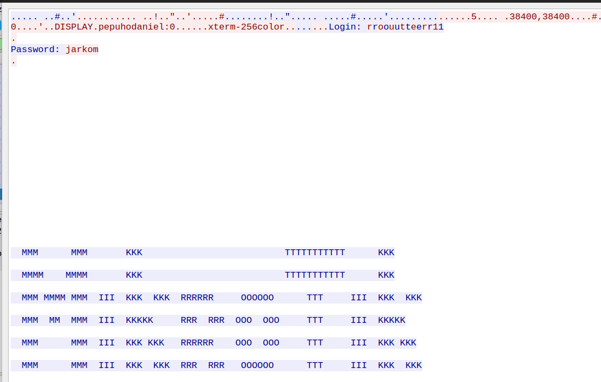

### 0.2 SSH (Secure Shell)

Bayangkan Anda seorang pengembang yang bekerja dari rumah dan perlu memperbarui kode di server perusahaan. Dengan SSH, Anda bisa masuk ke server dari komputer Anda di rumah, mengedit atau mengupload file kode, dan menjalankan program untuk memastikan semuanya bekerja dengan baik, seolah-olah Anda berada di depan server tersebut secara langsung.


#### Jadi, apa itu SSH?

SSH adalah sebuah protokol yang memungkinkan Anda mengakses dan mengelola komputer atau server dari jarak jauh dengan aman. Anda bisa melakukan berbagai tugas, seperti menjalankan program, membuat atau menghapus file, dan mentransfer file ke server lain. SSH memastikan bahwa semua data yang dikirim dan diterima terlindungi dengan enkripsi, sehingga lebih aman daripada metode lama seperti Telnet.

Cara kerja protokol SSH adalah dengan menerapkan model client-server. Koneksi yang terjadi adalah SSH client (komputer yang digunakan pengguna) melakukan koneksi ke SSH server (server remote yang dituju).

SSH saat ini versi terbarunya yaitu [SSH v2](https://www.synopsys.com/software-integrity/security-testing/fuzz-testing/defensics/protocols/ssh2-server.html). SSH bisa dikatan lebih secure dibandingan Telnet.

Cara melakukan koneksi dengan SSH adalah sebagai berikut:
```
ssh username@host or
ssh username@host -p 2224
```

### 0.3 Netcat (nc)

Bayangkan Anda ingin menguji apakah sebuah server dapat menerima data dari komputer Anda. Dengan Netcat, Anda bisa mengirim pesan ke server dan melihat apakah server merespons. Ini berguna untuk memeriksa koneksi jaringan atau debug aplikasi.

```
echo "Hello, Server!" | nc example.com 1234
```
Ini akan mengirimkan pesan "Hello, Server!" ke server di example.com pada port 1234.

#### Jadi, apa itu Netcat?

Netcat (atau nc) adalah utilitas baris perintah yang membaca dan menulis data melalui koneksi jaringan, menggunakan protokol TCP atau UDP. Perintah ini adalah salah satu alat yang paling kuat dalam jaringan dan persenjataan administrator sistem dan dianggap sebagai alat multi fungsi.

Sintaks dari netcat sendiri adalah sebagai berikut:
```
nc [options] host port
```
Secara default, Netcat akan mencoba untuk memulai koneksi TCP ke host dan port yang ditentukan. Jika Anda ingin membuat koneksi UDP, gunakan opsi -u.

### 0.4 Ping

Bayangkan Anda mengirimkan pesan singkat ke komputer atau server dan menunggu balasan. Jika balasan datang dengan cepat, berarti koneksi jaringan baik dan perangkat tersebut dapat dijangkau. Jika tidak ada balasan atau lambat, mungkin ada masalah dengan koneksi atau perangkat tersebut. Ping membantu Anda mengetahui apakah jaringan berfungsi dengan baik.

#### Jadi, apa itu Ping?

Ping merupakan singkatan dari Packet Internet Network Groper. Secara sederhana, ping adalah perintah untuk mengecek status dan keberadaan host dalam sebuah jaringan internet.

Prinsip utama ping adalah seperti penggunaan sonar untuk mengukur kedalaman laut. Jadi, sebuah sinyal dikirimkan ke dasar, lalu lamanya waktu kembali ke atas menjadi dasar perhitungannya.

Berikut merupakan cara melakukan ping:

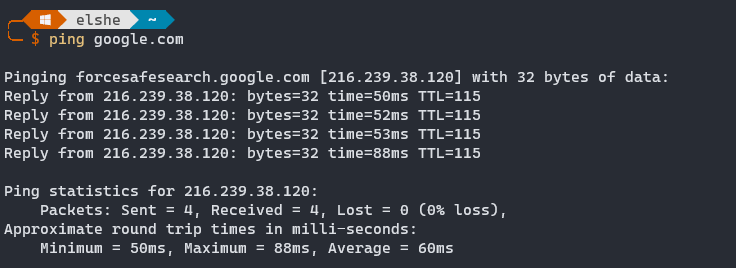

Dengan perintah di atas, Anda akan mendapatkan informasi sebagai berikut:
+ Reply adalah balasan dari host yang diikuti oleh informasi alamat IP. Perintah default di atas, idealnya akan memberikan empat balasan (reply). Namun, bisa saja muncul Request Timed Out (RTO) yang artinya tidak ada balasan sesuai waktu tunggu dari ping tersebut.
+ Bytes adalah jumlah data yang dikirimkan. Untuk Windows, umumnya adalah 32 bytes.
+ Time adalah lamanya waktu respon dari host, yang dihitung dengan satuan ms, atau millisecond. Waktu ping yang bagus adalah di bawah 100ms, terutama kalau penggunaannya untuk game online yang menuntut ping yang rendah.
+ TTL (Time To Live) merupakan durasi sebuah paket data dapat berada di jaringan, yang dicatat dalam hitungan detik. Umumnya, TTL diatur pada kisaran ideal 64 detik.


## 1. Konsep IP dan Port

### 1.1 Konsep IP

Apakah Anda pernah bertanya-tanya bagaimana internet tahu bahwa saat Anda mengetik google.com, Anda akan dibawa ke situs web Google dan bukan ke situs lain? Sebenarnya, internet tidak memahami nama google.com secara langsung. Sebaliknya, internet menggunakan alamat IP untuk mengetahui ke mana harus mengirimkan data. Misalnya, google.com sebenarnya terhubung ke alamat IP 8.8.8.8.

#### Apa itu IP?
Bayangkan Anda mempunyai tetangga, cara Anda membedakan rumah Anda dengan rumah tetangga adalah dengan menggunakan alamat. Alamat IP seperti alamat rumah. Setiap perangkat, seperti komputer atau ponsel, memiliki alamat rumahnya sendiri di jaringan. Saat Anda mengirimkan sesuatu, seperti surat atau data, Anda perlu alamat rumah penerima agar kiriman Anda sampai ke tempat yang benar. Begitu juga dengan alamat IP: saat Anda mengirim data melalui internet, alamat IP memastikan data tersebut sampai ke perangkat yang tepat.


IP adalah singkatan dari Internet Protocol, atau dalam bahasa Indonesia berarti Protokol Internet. Jadi, IP address atau internet protocol address adalah alamat protokol internet (alamat IP) yang mengidentifikasi segala perangkat yang terhubung ke jaringan, baik jaringan internet pada umumnya maupun lokal.

Jenis-jenis alamat IP:
#### a. IPv4

IPv4 adalah alamat IP yang paling umum digunakan, dengan panjang 32-bit dan empat bagian (oktet) yang dipisahkan oleh titik. Nilai setiap oktet berkisar dari 0 – 255. Kepanjangan IPv4 yaitu Internet Protocol version 4.

Dengan kemungkinan ini, bisa disimpulkan bahwa saat ini ada sekitar 4,3 miliar alamat IPv4 yang berbeda di seluruh dunia.

Contoh IPv4 adalah seperti berikut:

+ 169.89.131.246
+ 192.0. 2.146
+ 01.102.103.104

Karena merupakan yang paling banyak digunakan, saat ini hampir semua sistem pasti bisa menangani routing IPv4 tanpa masalah. Selain itu, alamat IPv4 mendukung mayoritas topologi jaringan karena prefiksnya yang sederhana. Data dalam address packet IPv4 juga dienkripsi dengan baik untuk memastikan komunikasi yang aman antar jaringan.

#### b. IPv6

IPv6 adalah versi IP address yang lebih baru dari IPv4, dimaksudkan untuk menggantikan IPv4 karena variasi IPv4 yang kini mulai terbatas.

Kalau IPv4 memiliki panjang 32 bit, panjang IPv6 mencapai 128 bit. Artinya, ada sekitar 340 undecillion (angka di belakang digit pertamanya ada 66!) alamat IPv6 yang berbeda.

IPv6 ditulis dalam rangkaian digit heksadesimal 16 bit dan huruf, dipisahkan oleh titik dua. Jadi, pada jenis IP address ini, Anda akan menjumpai huruf dari A sampai F.

Berikut adalah contoh IPv6:

+ 2001:3FFE:9D38:FE75:A95A:1C48:50DF:6AB8
+ 2001:0db8:85a3:0000:0000:8a2e:0370:7334
+ 2001:db8:3333:4444:CCCC:DDDD:EEEE:FFFF
Dengan IPv6, routing akan menjadi lebih efisien karena memungkinkan penyedia layanan internet meminimalkan ukuran tabel routing. IPv6 juga menggunakan Internet Protocol Security (IPsec), jadi Anda tidak perlu cemas dengan autentikasi, kerahasiaan, dan integritas data.

Terlebih lagi, IPv6 tidak memiliki IP checksum sehingga pemrosesan packet menjadi lebih efisien, dan mendukung multicast. Hasilnya, transmisi data pun bisa dikirim ke beberapa tujuan sekaligus sehingga akan menghemat bandwidth jaringan.

### 1.2 Alokasi Port

Saat Anda mengunjungi gedung, Anda memberi tahu nomor apartemen yang ingin Anda tuju agar resepsionis bisa mengarahkan Anda ke tempat yang tepat. Begitu juga dengan port dalam jaringan: saat Anda mengirimkan data, Anda perlu menyebutkan nomor port agar data sampai ke aplikasi atau layanan yang tepat di komputer atau server.


#### Jadi, apa itu Port?

Port adalah cara yang memungkinkan komputer untuk menangani beberapa koneksi dan program secara bersamaan di jaringan. Setiap port terhubung dengan aplikasi atau layanan tertentu. Misalnya, port membantu komputer membedakan antara email dan halaman web yang masuk, karena mereka menggunakan port yang berbeda.

Untuk meningkatkan kompatibilitas, port sudah memiliki sistem standardisasi di semua perangkat yang terhubung ke jaringan. Setiap port memiliki identitas dalam bentuk angka 16-bit (dua byte) yang disebut sebagai Port Number.

**Logical Port**

Logical port adalah jalur yang digunakan oleh aplikasi untuk menghubungkan dengan komputer lain melalui jaringan TCP/IP. Salah satu contohnya adalah mengkoneksikan komputer dengan internet. Port ini berperan penting dalam jaringan komputer.

Dilihat dari penomorannya, logical port terbagi menjadi tiga jenis. Ada jenis port yang terdaftar di Internet Assigned Numbers Authority (IANA), dan ada yang tidak, berikut pembagiannya:

+ Well-known port: berkisar dari 0 – 1023. Ini merupakan port yang dikenali atau port sistem. Port ini selalu merepresentasikan layanan jaringan yang sama dan ditetapkan oleh IANA.
+ Registered port: berkisar dari 1024 – 49151. Port ini diketahui dan terdaftar di IANA tetapi tidak dialokasikan secara permanen, sehingga dapat menggunakan port number yang sama.
+ Dynamically assigned port: berkisar dari 49152 – 65535. Port ini ditetapkan oleh sistem operasi atau aplikasi yang digunakan untuk melayani request dari pengguna sesuai dengan kebutuhan.

Berikut ini beberapa contoh logical port yang sering digunakan beserta fungsinya:
+ Port 20 & 21 (FTP), adalah protokol yang berguna dalam mentransfer data di dalam suatu jaringan.
+ Port 22 (SSH), berfungsi mengirimkan data melalui jaringan dalam bentuk terenkripsi. Dapat digunakan untuk menjalankan fungsi atau tugas yang bisa diakses dari jarak jauh, misalnya menghubungkan ke host atau server.
+ Port 23 (TELNET), port untuk menghubungkan komputer dan server jarak jauh. Fungsinya mirip dengan SSH, hanya saja port 23 TELNET tidak menggunakan enkripsi pada koneksinya.
+ Port 25 (SMTP), berfungsi memastikan pengiriman email melalui jaringan dikomunikasikan dengan aman antara sesama SMTP server.
+ Port 53 (DNS), berfungsi sebagai penerjemah alamat IP pada setiap host.
+ Port 67 & 68 (DHCP), atau Dynamic Host Configuration Protocol berfungsi untuk menetapkan informasi terkait alamat IP.
+ Port 80 (HTTP/ Web Server), memungkinkan browser terhubung ke halaman web.
+ Port 443 (HTTPS),  berguna untuk menghubungkan klien ke internet, namun dengan fitur keamanan tambahan yang tidak dimiliki port HTTP 80. Port 443 mengenkripsi paket jaringan sebelum mentransfernya.
+ Port 143 (IMAP), Internet Message Access Protocol atau IMAP adalah protokol untuk mengakses email dari server.

<br>

## 2. Topologi Jaringan Dasar

Topologi jaringan dasar merujuk pada struktur fisik maupun logis yang menentukan bagaimana node-node saling terhubung dan berkomunikasi. Kita akan mensimulasikan dan mempelajari langkah fundamental dalam membangun jaringan komputer, mulai dari koneksi langsung antar dua nodes (point-to-point), pengujian performa jaringan, penggunaan switch, hingga mengatur alokasi alamat IP secara otomatis.

### 2.1 Bagaimana node terhubung?

Pada dasarnya, node dalam jaringan dapat saling berkomunikasi jika memiliki alamat IP dan berada dalam segmen jaringan yang sama. Pada tahap awal ini, kita akan menghubungkan dua node secara langsung (Point-to-Point) dan mengonfigurasi IP Address secara statis agar keduanya dapat saling mengenali dan mengirim paket data.

#### 2.1.1 Melalui console

1. Buatlah project baru pada GNS3, tambahkan 2 buah node **netics-pc** dan hubungkan kedua node melalui link (menggunakan interface eth0 pada kedua node)

   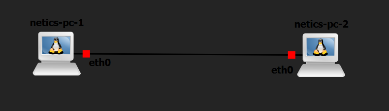

2. Start kedua node, buka console, lalu set IP address dan interface pada masing-masing node.

  Di netics-pc-1:
```
ip addr add 192.168.100.101/24 dev eth0
ip link set eth0 up
```

  Di netics-pc-2:
```
ip addr add 192.168.100.102/24 dev eth0
ip link set eth0 up
```

3. Konfirmasi IP address yang baru dengan menjalankan **ip -br addr**

   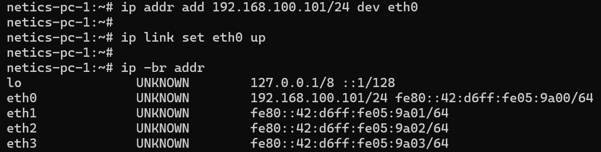
   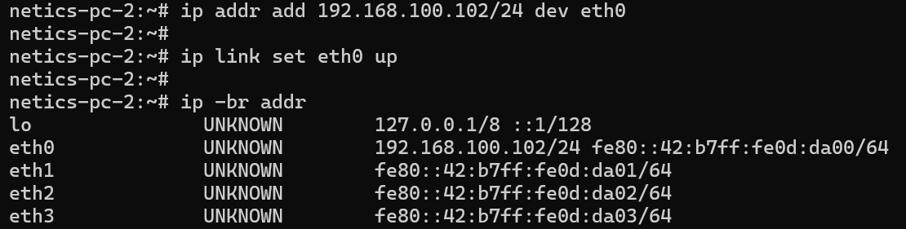

4. Verifikasi kedua node terhubung dengan ping salah satu node dari node lain

   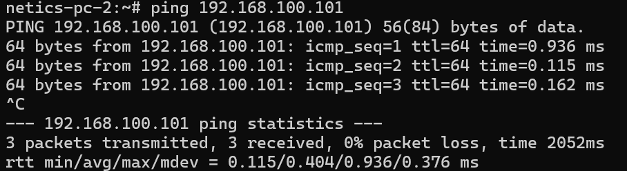
<br>

#### 2.1.2 Melalui "edit network config"

1. Klik kanan pada node -> **Configure** -> **Edit Network Configuration**. Lalu isi dengan konfigurasi berikut:

  Di **netics-pc-1**:
```
auto eth0
iface eth0 inet static
    address 192.168.100.101
    netmask 255.255.255.0
```

  Di **netics-pc-2**:
```
auto eth0
iface eth0 inet static
    address 192.168.100.102
    netmask 255.255.255.0
```

2. Setelah Anda klik Save, konfigurasi ini tidak akan langsung aktif. Anda harus merestart node tersebut (klik kanan -> Stop, lalu klik kanan -> Start) supaya node bisa membaca ulang file konfigurasinya saat proses booting.

<br>

### 2.2 Bagaimana mengetahui kapasitas transfer antar nodes?

Setelah node terhubung, kita akan mengukur seberapa besar kapasitas maksimal interface dan kecepatan transfer riil (throughput) di antara keduanya. Kita lakukan menggunakan utilitas **ethtool** untuk mengecek batas kapasitas node dan **iperf3** untuk menguji pengiriman beban traffic data secara aktual.

#### 2.2.1 Menggunakan **iperf3**

1. Untuk mengetahui kapasitas interface, gunakan command **ethtool [interface]**

   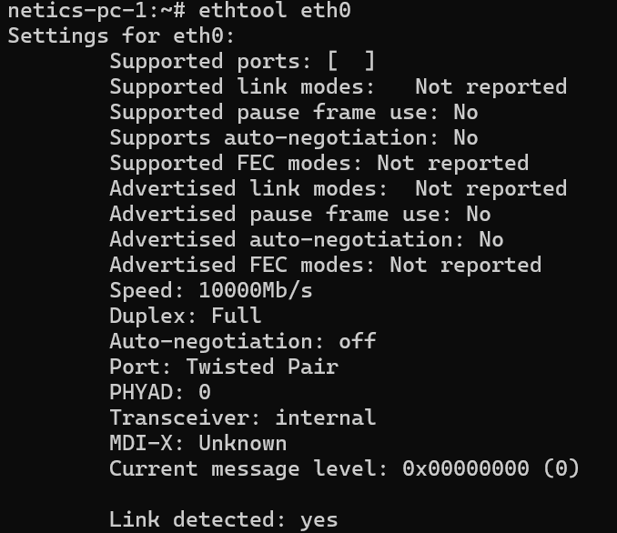

Output menunjukkan kecepatan maksimum sebesar 10 Gbps


2. Kita akan melakukan uji coba performa dengan **iperf3**

iperf3 adalah alat untuk pengukuran aktif bandwidth maksimum yang dapat dicapai pada jaringan IP.

Di **netics-pc-1**:
```
iperf3 -s
```

**-s** artinya menjalankan node dalam mode server. Node akan listening menunggu traffic data masuk dari node client

Di **netics-pc-2**:
```
iperf3 -c <ip-netics-pc-1> -u -b 10G
```
**-c** artinya menjalankan node dalam mode client untuk memulai tes ke arah server. **-u** untuk memerintahkan iPerf3 untuk menggunakan protokol UDP. **-b 10G** untuk menargetkan kecepatan pengiriman data sebesar 10 Gigabit/detik

Hasil pengujian:

   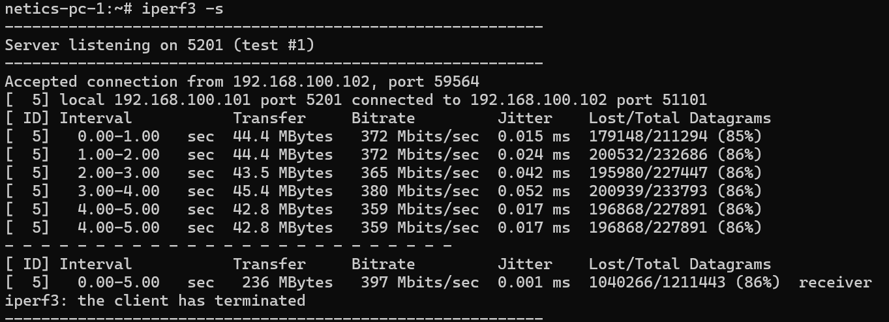

   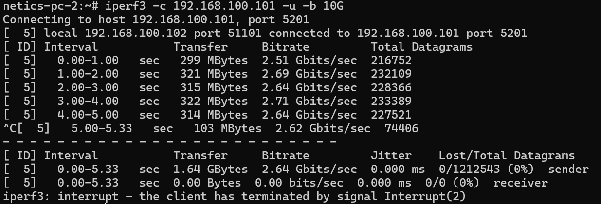

Berdasarkan gambar, iperf3 melaporkan bahwa traffic riil yang berhasil dibangkitkan oleh **netics-pc-2** (sender) mencapai rata-rata 2.64 Gbps, sementara **netics-pc-1** (receiver) hanya mampu menerima aliran data pada kecepatan rata-rata 397 Mbps dengan tingkat kehilangan data (packet loss) yang sangat tinggi, yakni sebesar 86%. Angka pencapaian ini berada jauh di bawah kapasitas nominal interface sebesar 10 Gbps. Hal ini secara jelas membuktikan bahwa kapasitas nominal suatu interface jaringan tidak selalu mencerminkan throughput aktualnya. Throughput riil dipengaruhi oleh banyak faktor, seperti kemampuan pemrosesan CPU pada node virtual, overhead protokol, serta beban kerja sistem yang menjalankan simulasi.

<br>

### 2.3 Menghubungkan Banyak Node Menggunakan Bridge

Sebelumnya, kita telah menghubungkan dua nodes secara langsung (Point-to-Point). Namun, bagaimana jika kita ingin menghubungkan tiga nodes atau lebih ke dalam satu jaringan yang sama? Kita tidak bisa lagi hanya menggunakan koneksi langsung. Kita membutuhkan **bridge**

#### 2.3.1 Konfigurasi Dasar Bridge

1. Tambahkan 1 node baru yang akan bertindak sebagai switch (misal kita beri nama **netics-pc-bridge**). Hubungkan **netics-pc-1** ke eth0 pada **netics-pc-bridge** dan **netics-pc-2** ke eth1 pada **netics-pc-bridge**

   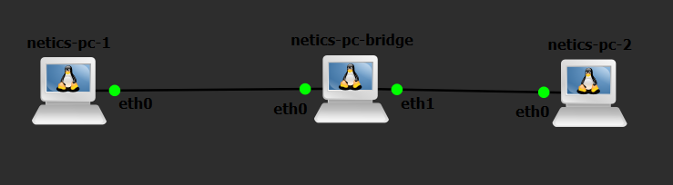

2. Lakukan pengujian koneksi dan pelacakan rute menggunakan perintah **mtr** dari **netics-pc-1** ke **netics-pc-2**

Di **netics-pc-1**:
```
mtr 192.168.100.102
```

  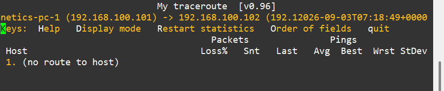

Pada tahap ini, pengujian akan gagal (No route to host). Belum ada reply karena **netics-pc-bridge** yang berada di tengah belum dikonfigurasi untuk meneruskan paket data.

3. Kita akan membuat konfigurasi bridge pada **netics-pc-bridge**. Buka console pada **netics-pc-bridge**, lalu jalankan command berikut untuk menjadikannya sebagai ethernet bridge

Di **netics-pc-bridge**:
```
ip -br addr                    # cek interface: terdapat eth0 dan eth1
brctl addbr br0
brctl addif br0 eth0
brctl addif br0 eth1
brctl show
ip link set br0 up
```

  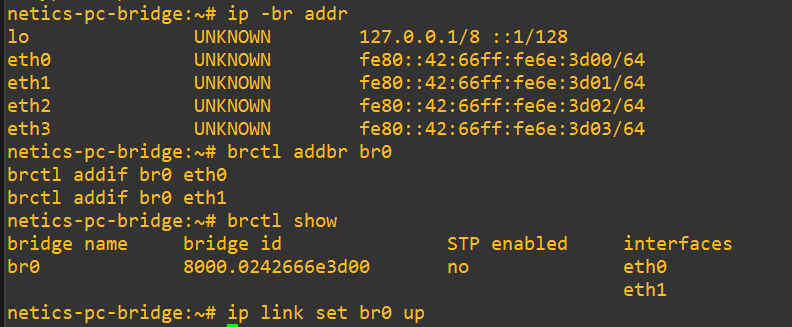

4. Jalankan ulang pengujian rute dari **netics-pc-1** ke **netics-pc-2** seperti pada langkah ke-2.

  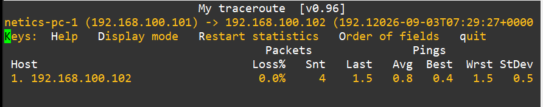

Koneksi kini berhasil karena antarmuka bridge pada **netics-pc-bridge** telah aktif dan berfungsi untuk meneruskan paket data antara kedua nodes.

<br>

### 2.4 Simulasi Jaringan
Dalam jaringan nyata, kondisi ideal tanpa hambatan jarang terjadi. Seringkali kita dihadapkan pada masalah seperti packet loss atau keterbatasan kapasitas jaringan (bandwidth). Untuk itu, kita akan mensimulasikan gangguan-gangguan ini tanpa harus menggunakan perangkat keras jaringan sungguhan.

#### 2.4.1 Simulasi Packet Loss

Pada percobaan ini, kita akan mensimulasikan situasi di mana 10% paket yang dikirim mengalami kehilangan atau kerusakan selama perjalanan.

1. Lakukan simulasi *packet loss* sebesar 10% pada kedua interface di **netics-pc-bridge**

Di **netics-pc-bridge**:
```
tc qdisc replace dev eth1 root netem loss 10%
tc qdisc replace dev eth0 root netem loss 10%
```

2. Lakukan pengujian menggunakan **mtr** dari **netics-pc-1** ke **netics-pc-2** untuk melihat efek dari packet loss.

**mtr** sebelum simulasi packet loss:

  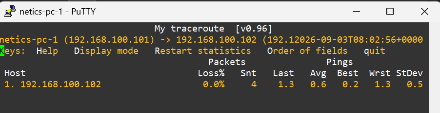

**mtr** setelah simulasi packet loss:

  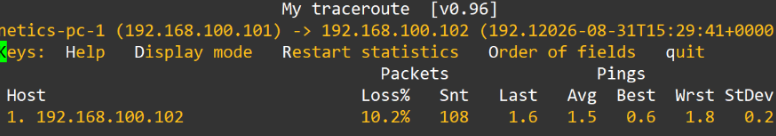

Hasil mtr menunjukkan peningkatan packet loss dari 0% menjadi 10.2% setelah percobaan packet loss diterapkan pada bridge.
<br>

#### 2.4.2 Simulasi Pembatasan Throughput

Pada percobaan ini, kita akan mensimulasikan situasi di mana bandwidth/kapasitas jaringan dibatasi. Pembatasan dilakukan di sisi bridge karena node ini berada di jalur yang dilalui seluruh traffic antara sender dan receiver. Hal ini mensimulasikan kondisi nyata, di mana pembatasan bandwidth biasanya diterapkan pada node penghubung seperti switch atau router, bukan pada masing-masing node.

1. Jalankan iperf3 -s di netics-pc-1, lalu iperf3 client dengan target speed 100 Mbps di netics-pc-2.

Di netics-pc-1:
```
iperf3 -s
```

Di netics-pc-2:
```
iperf3 -c 192.168.100.101 -u -b 100M
```

2. Lakukan pembatasan kecepatan (bitrate) menjadi 50 Mbps pada kedua interface di **netics-pc-3**

Di netics-pc-3:
```
tc qdisc replace dev eth0 root tbf rate 50mbit burst 64k limit 64k
tc qdisc replace dev eth1 root tbf rate 50mbit burst 64k limit 64k
```

Untuk mereset limitasi gunakan:
```
tc qdisc del dev eth0 root
tc qdisc del dev eth1 root
```

3. Perhatikan hasil pengujian traffic data untuk melihat efek dari pembatasan throughput.

**netics-pc-2 (client):**

  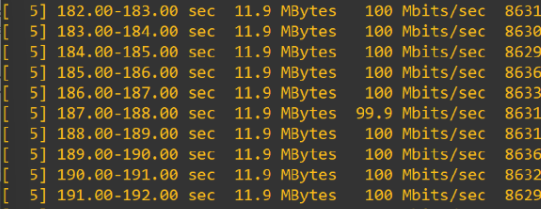

**netics-pc-1 (server):**

  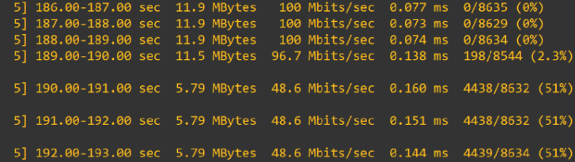

Meskipun client terus mengirimkan data dengan kecepatan 100 Mbps, kecepatan aktual yang diterima oleh server turun menjadi sekitar 48,6 Mbps. Hal ini membuktikan bahwa pembatasan bandwidth 50 Mbps berhasil, di mana jaringan secara otomatis mendrop paket data yang melebihi batas kapasitas.

<br>

### 2.5 Beralih dari Bridge ke Switch
Sebelumnya, kita menggunakan node **netics-pc** yang dikonfigurasi secara manual sebagai Bridge untuk menghubungkan beberapa node. Meskipun bridge dan switch sama-sama bekerja di Layer 2 (Data Link) dan meneruskan paket berdasarkan MAC Address, pada praktiknya kita lebih sering menggunakan Switch.

Mengapa menggunakan Switch daripada Bridge?
1. **Kapasitas Port**: Bridge biasanya hanya menghubungkan dua atau sedikit segmen jaringan, sedangkan Switch didesain memiliki port yang lebih banyak untuk menghubungkan banyak node sekaligus.
2. **Kinerja**: Switch fisik menggunakan perangkat keras khusus (ASIC) untuk memproses dan meneruskan paket data dengan sangat cepat, sementara konfigurasi bridge membebani kerja CPU.
3. **Kemudahan**: Dalam simulated environment (seperti GNS3) maupun dunia nyata, sebuah unmanaged switch bisa langsung digunakan tanpa perlu melakukan konfigurasi manual (seperti perintah brctl atau ip link yang panjang).

#### 2.5.1 Topologi Sederhana Switch
1. Buatlah topologi seperti berikut.

   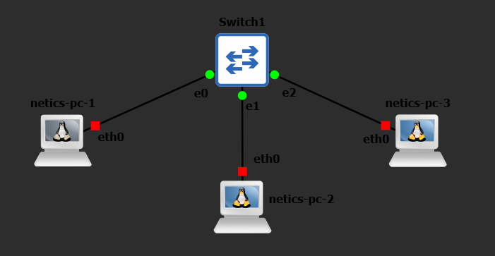

2. Konfigurasikan IP Address pada ketiga node dalam satu subnet yang sama melalui menu Edit Network Configuration.

Di **netics-pc-1**:
```
auto eth0
iface eth0 inet static
    address 192.168.100.101
    netmask 255.255.255.0
```

Di **netics-pc-2**:
```
auto eth0
iface eth0 inet static
    address 192.168.100.102
    netmask 255.255.255.0
```

Di **netics-pc-3**:
```
auto eth0
iface eth0 inet static
    address 192.168.100.103
    netmask 255.255.255.0
```
<br>

#### 2.5.2 Simulasi Meneruskan Paket pada Switch

Cara kerja Switch sangat pintar. Switch ini otomatis mengenali dan mencatat identitas (MAC Address) dari setiap node yang terhubung kepadanya, lalu menyimpannya ke dalam sebuah daftar memori bernama **MAC Address Table**

Untuk menyimulasikan bagaimana Switch meneruskan paket, lakukan pengujian berikut:

1. Buka console di **netics-pc-1** dan lakukan ping ke **netics-pc-3**.
```
ping -c 4 192.168.100.103
```

   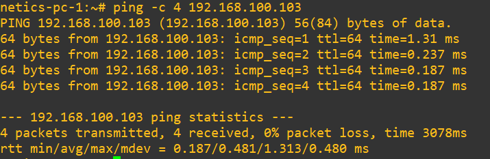

Saat ping pertama dikirim, Switch belum mengetahui lokasi tujuan. Oleh karena itu, switch melakukan broadcast (pesan ARP) ke semua port aktif. Begitu node target membalas, Switch langsung mencatat MAC Address beserta posisi portnya ke dalam **MAC Address Table**. Menggunakan informasi ini, pengiriman paket kedua dan seterusnya, switch tidak lagi melakukan broadcast ke semua node, melainkan langsung mengirim paket ke node tujuan saja.

<br>

### 2.6 Konfigurasi IP Otomatis dengan DHCP

Sejauh ini, kita selalu mengonfigurasi IP Address secara manual (Static IP). Dalam skala jaringan yang besar, cara ini tentu tidak efisien dan rentan terjadi tabrakan IP (IP conflict). Oleh karena itu, kita menggunakan DHCP (Dynamic Host Configuration Protocol) agar node (client) bisa mendapatkan konfigurasi jaringan secara otomatis dari server.

Mekanisme DHCP dalam memberikan IP dikenal dengan sebutan DORA:

- Discover: Client mengirim pesan broadcast ke seluruh jaringan untuk mencari DHCP server.
- Offer: DHCP server yang menerima permintaan akan menawarkan sebuah alamat IP dari pool (kumpulan IP yang tersedia).
- Request: Client secara resmi meminta IP yang ditawarkan tersebut.
- Acknowledge: Server mengonfirmasi dan memberikan hak sewa (lease) IP tersebut kepada client.

Kita akan menggunakan program yang umum digunakan untuk konfigurasi DHCP:

1. **udhcpd**: Sebagai DHCP Server (Pemberi IP).
2. **udhcpc**: Sebagai DHCP Client (Penerima/Peminta IP).

#### 2.6.1 Konfigurasi DHCP Server (udhcpd)

Kita akan memanfaatkan topologi Switch yang sama seperti **sub-bab 2.5** di atas. Jadikan **netics-pc-1** sebagai **DHCP Server**, sementara node lainnya akan menjadi **DHCP Client**.

   

1. Pastikan **netics-pc-1** sudah memiliki IP statis (misal: 192.168.100.101/24).
```
ip addr add 192.168.100.101/24 dev eth0
```

2. Buat file kosong yang akan digunakan oleh sistem sebagai tempat penyimpanan catatan peminjaman (lease) IP:
```
touch /etc/dhcpd.leases
```

3. Buat file konfigurasi DHCP ke file **/etc/dhcpd.conf**. Kita akan menggunakan alokasi IP dari **.150** hingga **.155**:
```
echo "start 192.168.100.150
end 192.168.100.155
interface eth0
max_leases 5
pidfile /etc/dhcpd.pid
lease_file /etc/dhcpd.leases
option subnet 255.255.255.0" > /etc/dhcpd.conf
```

4. Jalankan aplikasi DHCP server agar berjalan di layar utama (foreground):
```
udhcpd -f /etc/dhcpd.conf
```
<br>

#### 2.6.2 Konfigurasi DHCP client
Kita akan mengubah konfigurasi pada **netics-pc-2** dan **netics-pc-3** agar langsung meminta konfigurasi IP secara otomatis pada saat node menyala.

1. Klik kanan pada node -> Configure -> Edit Network Configuration dan uncomment bagian berikut:

Di **netics-pc-2**:
```
auto eth0
iface eth0 inet dhcp
    hostname netics-pc-2
```

Di **netics-pc-3**:
```
auto eth0
iface eth0 inet dhcp
    hostname netics-pc-3
```

Pastikan bahwa konfigurasi IP statisnya telah dicomment kembali agar kita bisa mendapat IP DHCP, bukan IP statis.

2. Save dan restart node tersebut agar sistem membaca konfigurasi baru saat booting. Client akan otomatis mendapat IP DHCP.

   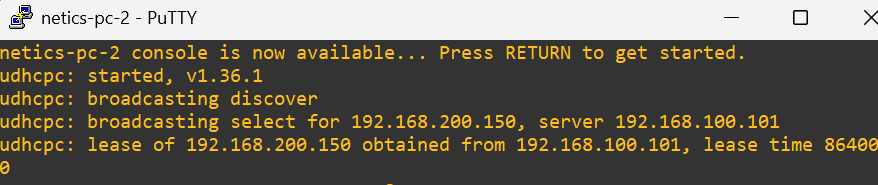
   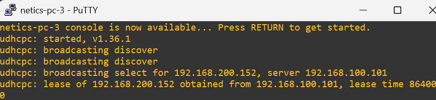
<br>

#### 2.6.3 Konfigurasi DHCP client manual
Skenario ini mensimulasikan kondisi ketika suatu node tidak diset untuk meminta IP secara otomatis saat startup (misalnya node yang baru dipasang). Kita akan meminta IP secara manual pada **netics-pc-2**.

1. Buka console **netics-pc-2**. Cek IP address yang ada saat ini (pastikan hanya ada link local, belum ada IP dari jaringan):
```
ip -br addr
```

2. Jalankan DHCP client secara manual untuk meminta IP address pada interface **eth0** dan biarkan prosesnya berjalan di background (-b):
```
udhcpc -i eth0 -b
```

   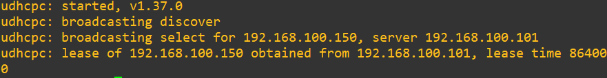

3. Setelah itu cek kembali IP client, seharusnya sudah mendapatkan IP dari DHCP.

<br>

## 3. Wire Crimping
Dalam jaringan komputer, terjadi komunikasi antara satu perangkat dengan perangkat lainnya. Komunikasi itu tentu membutuhkan suatu media. Walaupun sudah ada teknologi komunikasi nirkabel, peran kabel dalam jaringan masih penting dan belum tergantikan. Oleh karena itu dalam modul kali ini, kita akan belajar cara melakukan _crimping_ pada salah satu jenis kabel jaringan yang bernama kabel UTP (_Unshielded Twisted Pair_).

### 3.1 Peralatan yang dibutuhkan
Untuk melakukan _wire crimping_ kita membutuhkan peralatan di bawah ini:
#### a. Kabel UTP
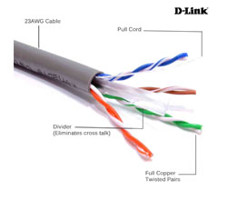

Bahan utama dari proses ini.
#### b. RJ45
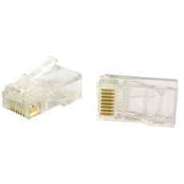

RJ45 adalah konektor yang akan menghubungkan kabel UTP dengan perangkat.
#### c. Tang Crimping


Tang ini digunakan untuk memasangkan kabel pada RJ45.
#### d. LAN Tester
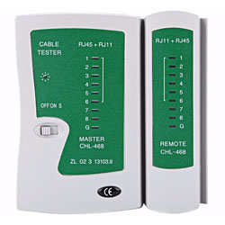

Seperti namanya, alat ini digunakan untuk memeriksa apakah kabel yang kita buat berfungsi dengan baik atau tidak.
### 3.2 Konfigurasi Kabel
Ada beberapa macam konfigurasi kabel. Dari urutan warnanya yang sesuai standar internasional dapat dibagi menjadi __T568A__ dan __T568B__.

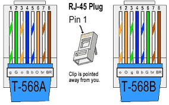

Sedangkan dari pemasangannya dibagi menjadi
#### a. __Kabel Straight-Through__
  Jenis pengkabelan ini digunakan untuk menyambungkan dua tipe perangkat berbeda yang tersambung ke jaringan, yakni perangkat DTE (data terminal equipment) ke DCE (data circuit-terminating equipment) atau sebaliknya. Perangkat DTE adalah perangkat yang melakukan generate data digital dan bertindak sebagai source dan destination untuk data digital, contohnya adalah komputer, mikrokomputer, terminal, printer. DCE adalah perangkat yang menerima dan mengkonversi data ke link telekomunikasi yang sesuai, umumnya DCE adalah perangkat jaringan seperti router, switch, modem.

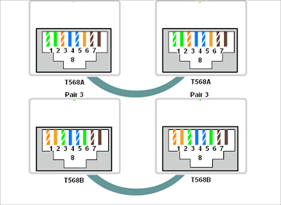

  Aturan pemasangannya adalah bahwa tiap ujung kabel harus memiliki urutan warna yang sama. Misal ujung yang satu menggunakan susunan warna berdasarkan aturan T568A maka begitu juga ujung lainnya.

#### b. __Kabel Crossover__
Berkebalikan dengan kabel Straight-through, pengkabelan ini digunakan untuk menyambungkan dua tipe perangkat yang sama yang tersambung ke jaringan, yakni perangkat DTE ke DTE atau DCE ke DCE. Misalnya antara komputer dengan komputer, router dengan router, router dengan switch, komputer dengan printer.

  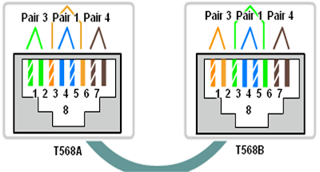

  Aturan pemasangannya pun berbeda dengan kabel jenis straight-trough, kabel jenis Crossover memiliki urutan warna yang berbeda dikedua ujungnya. Tapi, perbedaan warna ini tidak boleh sembarangan, karena kedua ujung ini juga memiliki aturan urutan warna. Pada kabel jenis Crossover standar, jika salah satu ujung Pin memiliki susunan warna berdasarkan aturan T568A, maka ujung Pin yang lain harus memiliki urutan warna berdasarkan standar T568B.

### 3.3 Langkah-Langkah
1. Siapkan keperluan crimping (kabel UTP, RJ45, tang crimping, LAN tester)
2. Kupas pelindung kabel UTP
3. Urutkan kabel sesuai konfigurasi yang diinginkan (Straight/Cross/yang lainnya).
4. Potong ujung kabel untuk meratakannya.
5. Masukkan ujung kabel tersebut ke RJ45 dan pastikan menyentuh ujung RJ45.
6. Gunakan tang crimping untuk mengunci kabel UTP dalam RJ45 (pastikan ujung kabel masih menempel dengan ujung RJ45 saat penguncian dilakukan)
7. Terakhir, gunakan LAN tester untuk memastikan kabel yang anda buat bekerja dengan baik.

### Video crimping Straight

[](https://youtu.be/NL0F8bP8k7I)

## 4. Wireshark
Wireshark adalah sebuah aplikasi penganalisa paket jaringan. Penganalisa paket jaringan akan mencoba menangkap paket jaringan dan mencoba untuk menampilkan data paket sedetail mungkin.
Sebuah jaringan komputer dibangun dengan tujuan mengirimkan atau menerima data antara satu end-point dengan end-point lainnya. Data dikirim dalam bentuk paket-paket. Struktur sebuah paket terdiri dari :

***1. Header***
Bagian header berisi alamat dan data lainnya yang dibawa oleh paket. Struktur dari header meliputi :

| Intruksi | Keterangan |
|--  |---|
| Panjang paket | Beberapa jaringan sudah memiliki panjang paket yang baku (*fixed-length*), sementara yang lain bergantung pada header untuk memuat informasi ini |
| Sinkronisasi | Beberapa bit yang membantu paket mencocokkan jaringan yang dimaksud |
| Nomor paket | Menunjukkan urutan dari total paket yang ada |
| Protokol | Pada jaringan yang membawa lebih dari satu macam informasi, protokol ini menunjukkan jenis paket yang ditransmiskan: e-mail, halaman web, atau yang lain |
| Alamat tujuan | Ke mana paket dikirimkan |
| Alamat asal | Dari mana paket dikirimkan |

***2. Payload***
Payload juga disebut sebagai ***body*** dari paket. Pada bagian inilah data yang akan dikirimkan lewat paket berada

***3. Trailer***
trailer, kadang-kadang disebut ***footer***, biasanya memuat sepasang bit yang memberi sinyal pada perangkat penerima bahwa paket sudah mencapai ujungnya. trailer juga bisa memuat semacam *error checking*.

### 4.1 Instalasi
Instalasi untuk OS WIndows atau macOS bisa mengunduh installer pada [ laman ini](https://www.wireshark.org/download.html). Untuk OS linux dapat melihat tutorialnya [di sini](https://linuxtechlab.com/install-wireshark-linux-centosubuntu/).
Setelah melakukan instalasi , jalankan Wireshark sebagai **administrator** (WIndows) atau **root** (linux)
Berikut tampilan awalnya :


### 4.2 Filters
Dalam Wireshark terdapat 2 jenis filter yaitu ***Capture Filter*** dan ***Display Filter***

#### 4.2.1 Capture Filter


 - Definisi : Memilah paket yang akan ditangkap (captured). Paket yang tidak memenuhi kriteria dibiarkan lewat tanpa ditangkap
 - Sintaks filter dapat terdiri dari 1 atau lebih **primitive**. primitive sendiri biasanya terdiri dari sebuah **id** (bilangan atau nama) yang didahului oleh 1 atau lebih jenis qualifier. Perlu diingat bahwa dalam 1 primitive tidak boleh ada 2 atau lebih qualifier sejenis
 - Jenis qualifier :

| Qualifier | Keterangan | Contoh |
|--|--|--|
| type | Menentukan jenis id atau nama yang menjadi nilai filter | host, net, port, portrange |
| dir | Menentukan direction atau arah dari id | src, dst, dan lain-lain |
| proto | Menentukan protokol dari id | tcp, udp, dan lain-lain |

 - Sintaks filter dapat memuat operator, tanda kurung, negasi ( `!` / `not` ), dan kongjungsi ( `&&` / `and` atau `||` / `or` ). Kongjungsi digunakan untuk menghubungkan 2 primitive dalam satu sintaks
 - Contoh sintaks capture filter :

| Filter expression / Primitive(s) | Keterangan |
|--|--|
| `host 10.151.36.1` | Menangkap semua paket yang spesifik menuju ke atau berasal dari alamat 10.151.36.1 |
| `src host 10.151.36.1` | Menangkap semua paket yang spesifik berasal dari alamat 10.151.36.1 |
| `net 192.168.0.0/24` atau `net 192.168.0.0 mask 255.255.255.0` | Menangkap semua paket yang berasal dari atau menuju ke subnet 192.168.0.0/24 |
| `dst net 192.168.0.0/24` | Menangkap semua paket yang menuju ke subnet 192.168.0.0/24 |
| `udp port 80` | Menangkap semua paket dengan protokol UDP yang menuju ke atau berasal dari port 80 |
| `tcp src port 22 or host 10.151.36.30` | Menangkap semua paket dengan protokol TCP yang berasal dari port 22 atau semua paket yang berasal dari atau menuju ke alamat 10.151.36.30 |

 - Contoh capture filter `host 10.151.36.1`


#### 4.2.2 Display Filter

 - Definisi : Memilah paket yang akan ditampilkan dari kumpulan paket yang sudah ditangkap
 - Secara umum sintaks display filter terdiri dari `[protokol] [field] [comparison operator] [value]`. Berikut ini daftar ***comparison operator*** yang tersedia :

| English | Comparison Operator (C-like) | Indonesia |
|---|---|---|
| equal | == | Sama dengan |
| inequality | != | Tidak sama dengan |
| greater than | > | Lebih besar dari |
| less than | < | Lebih kecil dari |
| greater than or equal than | >= | Lebih besar dari atau sama dengan |
| less than or equal to | <= | Lebih kecil dari atau sama dengan |
| contains |  | Protokol atau field mengandung nilai tertentu |
| matches | ~ | Protokol atau field cocok dengan *regular expression* |
| bitwise_and | & | Membandingkan nilai bit sebuah field |

 - Pada display filter bisa menggabungkan 2 filter expression dengan ***logical operator***

| Logical Operator | Keterangan |
|---|---|
| `and` atau `&&` | logical AND |
| `or` | logical OR |
| `xor` atau `^^` | logical XOR |
| `not` atau `!` | logical NOT |
| `[...]` | substring operator |
| `in` | membership operator |

 - Contoh penggunaan display filter :

| Filter expression | Keterangan |
|---|---|
| `tcp.port == 443` | Menampilkan semua paket dengan protokol TCP yang menuju ke atau berasal dari port 443 |
| `ip.src == 192.168.0.1 or ip.dst == 192.168.0.1` | Menampilkan semua paket yang berasal dari alamat 192.168.0.1 atau menuju ke alamat 192.168.0.1 |
| `http.request.uri constains "login"` | Menampilkan semua paket dengan protokol HTTP yang URI nya mengandung string "login" |

 - Contoh display filter `tcp.port == 80`, berikut hasilnya :


### 4.3 Export data hasil paket capture

 1. Setelah memiliki packet, pilih pada menu bar File -> Export Objects -> (protokol yang diinginkan). Pada contoh ini dipilih protokol HTTP

 2. Pilih paket yang akan di-export. Pada contoh ini dipilih paket yang memuat gambar dari situs tertentu tertentu. lalu klik Save dan berikan nama file, path, beserta ekstensinya jika diperlukan.
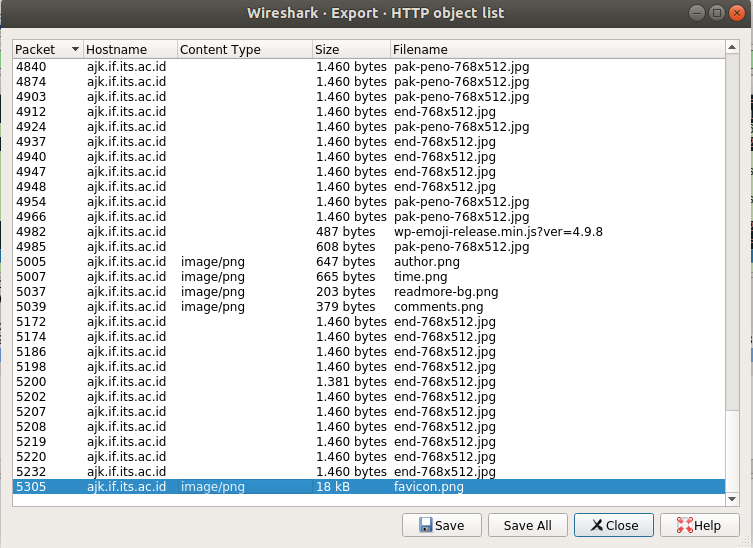
 3. File berhasil di-export
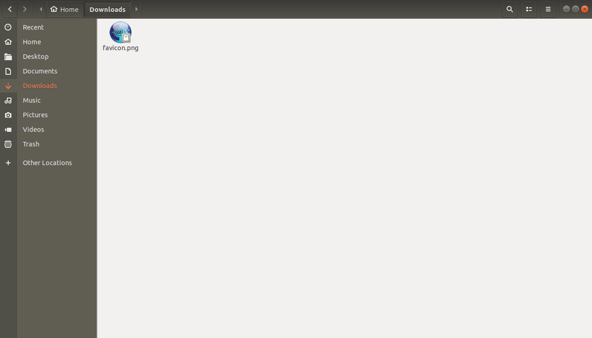

### 4.4 Penggunaan Wireshark pada FTP Server
Jalankan aplikasi wireshark sebelum *connect* ke server FTP yang dituju.
#### 4.4.1 Connect ke Server
##### a. Windows
Untuk pengguna windows kita akan menggunakan bantuan **FileZilla**. Untuk percobaan di server, di sini menggunakan Filezilla Server dan untuk client menggunakan Filezilla Client. Nantinya server dan clientnya bisa komputer yang sama atau berbeda (asal terhubung ke jaringan komputer).

###### Pembuatan Server FTP di Filezilla Server
1. Buka Filezilla Server (bisa melalui aplikasi Filezilla Server desktop atau XAMPP dengan start module Filezilla dan klik tombol Admin). Jika muncul pop up "Connect to Server" langsung saja klik Ok. Muncul tampilan berikut.


2. Klik menu Edit->Users. Di kolom Users paling kanan, tambahkan user baru dengan cara klik Add dan isikan nama user FTP nya. Berikut hasil setelah menambah user (di sini ditambah user "coba"). Jika ingin menggunakan password, centang "Password" dan masukkan password yang diinginkan.

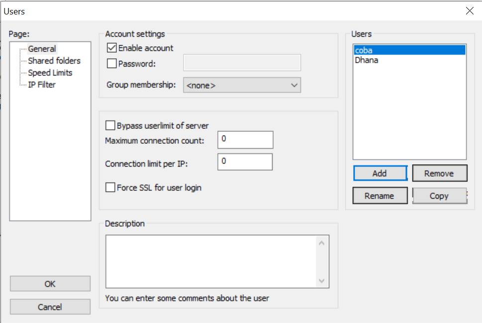

3. Setelah user terbuat, berikutnya masuk ke setting shared folder untuk menentukan folder yang akan dishare atau diremote dengan FTP. Pada kolom Users, pilih user, dan pada kolom Shared folders, klik tombol "Add" untuk menambah direktori. Berikutnya bisa diatur akses yang akan dimiliki oleh user tersebut terhadap shared folder yang dipilih pada kotak-kotak centang pada kolom Files dan Directories.

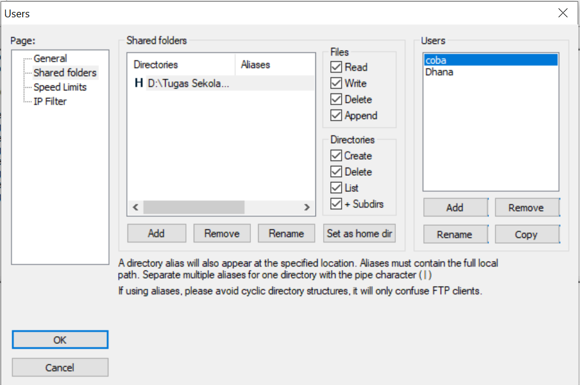

Server untuk FTP berhasil dibuat.

#### 4.4.2 Koneksi dari Client

##### a. Menggunakan Filezilla client
Buka FileZilla dan masukkan *Host*, *Username*, *Password*, dan *Port* dari server yang akan disambungkan. Bila sudah yakin, klik *Quickconnect* untuk menyambungkan.


##### b. Menggunakan command Linux
`$ ftp [Host ip]`
Masukkan username dan password, kemudian jalankan seperti CLI

Saat hasil capture dari Wireshark dilihat, akan muncul data di bawah ini:


| Perintah | Keterangan |
|---|---|
| USER | Username yang digunakan untuk login ke FTP server |
| PWD | Password yang digunakan untuk login ke FTP server |)

#### 4.4.3 Upload File
##### a. Menggunakan Filezilla client
Untuk FileZilla drag file dari Local site lalu drop di Remote site

| Perintah | Keterangan |
|---|---|
| STOR | Meng-upload file ke FTP server |

##### b. Menggunakan command Linux
Command upload untuk linux
```
$ put [full path file]
```

Saat hasil capture dilihat akan muncul data dibawah ini :


#### 4.4.4 Download File
##### a. Menggunakan Filezilla client
Untuk Filezilla drag file dari Remote site ke Local site

| Perintah | Keterangan |
|---|---|
| RETR | Men-download suatu file dari FTP server |

##### b. Menggunakan command Linux
Command download untuk linux
```
$ get [nama file]
```

Saat hasil capture dilihat akan muncul data dibawah ini :


## 5. Termshark
Jika sebelumnya kita sudah menggunakan Wireshark, sekarang kita akan menggunakan tools bernama **Termshark**. Pada dasarnya, Termshark merupakan wrapper dari tshark yang memungkinkan kita untuk menganalisis lalu lintas jaringan melalui terminal tanpa memerlukan GUI. Fitur-fitur pada Termshark mirip dengan Wireshark. Banyak command-command Wireshark yang juga bisa digunakan pada Termshark.

### 5.1 Instalasi Termshark
Termshark merupakan binary standalone yang dapat di download langsung pada GitHub [Termshark Releases](https://github.com/gcla/termshark/releases). Pada saat penulisan modul ini, versi paling terbaru dari Termshark merupakan versi *v2.4.0*, atau menggunakan package manager seperti `apt`:
```sh
sudo apt install termshark
```

### 5.2 Penggunaan Termshark
Untuk menggunakan Termshark, kita dapat menjalankan perintah berikut di terminal:
```sh
$ termshark
```
Maka akan muncul tampilan seperti berikut:

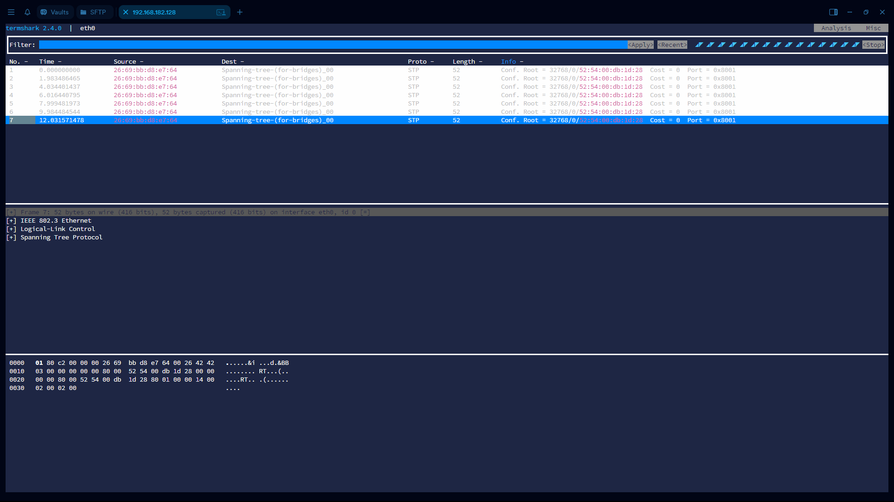

Secara default, Termshark akan melakukan packet capture pada interface eth0.

Termshark juga dapat melakukan packet capture pada interface lain dengan menggunakan opsi `-i` diikuti dengan nama interface yang diinginkan.
```sh
$ termshark -i [nama_interface]
```
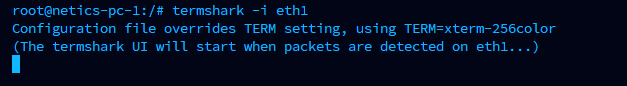

Termshark juga dapat melakukan inspeksi file pcap/pcapng dengan menggunakan opsi `-r` diikuti dengan nama file yang ingin dianalisis.
```sh
$ termshark -r [nama_file.pcap]
```
Kita juga dapat melakukan filtering packet seperti pada Wireshark, command-command yang digunakan sangat mirip dengan Wireshark. Kalian bisa refer command-command yang ada pada section [4.2 Filters](#42-filters) di atas.

Disini kita akan mencoba untuk melakukan request ke http://example.com dan hanya filter traffic http:

```sh
#!/bin/bash
while true; do
  curl -s http://example.com >/dev/null 2>&1
  sleep 10
done &
```
Jalankan script diatas lalu buka **Termshark** dan filter dengan `http`.

Maka akan terlihat traffic http ke http://example.com

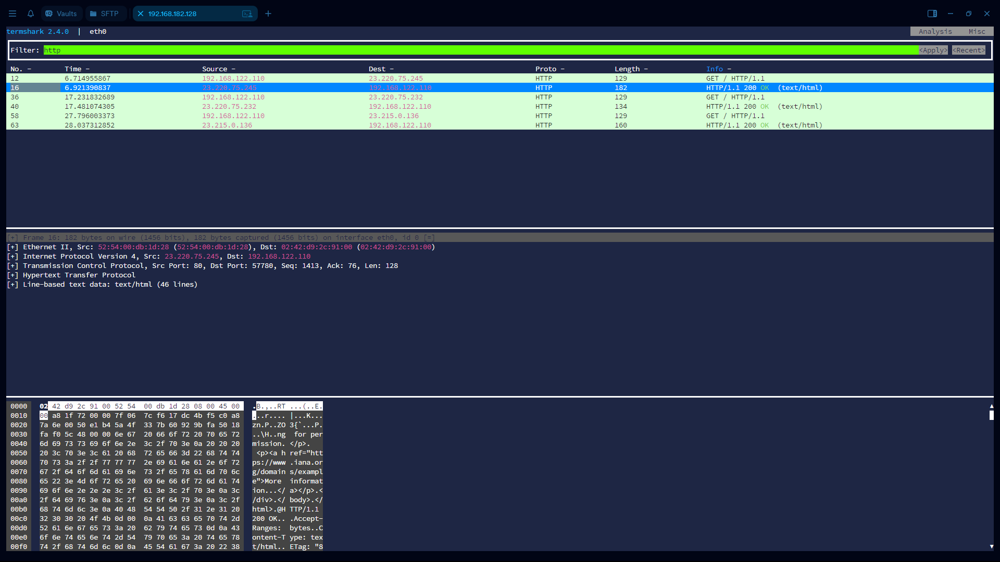

Untuk petunjuk penggunaan lebih lengkap, kita bisa merujuk ke [dokumentasi Termshark](https://github.com/gcla/termshark/blob/master/docs/UserGuide.md).

## Latihan
1. Apakah perbedaan capture filter dan display filter pada wireshark berdasarkan paket yang ditangkap?
2. Apa perbedaan filter `ip.dst` dengan `ip.dst_host`
3. Lakukan `ping` pada `1.1.1.1` (server dns cloudflare), terapkan display filter yang menampilkan paket-paket yang bersangkutan, lalu carilah apa protokol yang digunakan!
4. Buka halaman `http://example.com/index.html` dan dapatkan source file `index.html` nya mengunakan wireshark!


## Referensi
+ https://nyengnyeng.com/macam-macam-kabel-jaringan-komputer/
+ http://haidirhmc.blogspot.com/2011/12/urutan-warna-kabel-lan-atau-kabel-t568a.html
+ https://www.nesabamedia.com/pengertian-dan-fungsi-kabel-utp/
+ https://www.berguruit.com/2017/09/cara-crimping-kabel-lan-rj45-yang-baik.html
+ https://www.wireshark.org/docs/wsug_html_chunked/ChapterIntroduction.html
+ https://www.wireshark.org/docs/wsug_html_chunked/ChCapCaptureFilterSection.html
+ https://www.wireshark.org/docs/wsug_html_chunked/ChWorkBuildDisplayFilterSection.html
+ https://computer.howstuffworks.com/question5251.htm]
+ https://www.comparitech.com/net-admin/difference-between-straight-through-crossover-rollover-cables/
+ https://www.indowebsite.co.id/kb/cara-mengaktifkan-ftp-pada-localhost-atau-xammp/
+ https://github.com/gcla/termshark