# **2. Dynamic Host Configuration Protocol (DHCP)**

Materi pada modul ini memiliki _outline_ sebagai berikut.

## **Outline**

- [**2. Dynamic Host Configuration Protocol (DHCP)**](#2-dynamic-host-configuration-protocol-dhcp)
  - [**Outline**](#outline)
  - [**2.1 Konsep**](#21-konsep)
    - [**2.1.1 Pendahuluan**](#211-pendahuluan)
    - [**2.1.2 Apa itu DHCP?**](#212-apa-itu-dhcp)
    - [**2.1.3 Bootstrap Protocol dan Dynamic Host Configuration Protocol**](#213-bootstrap-protocol-dan-dynamic-host-configuration-protocol)
    - [**2.1.4 DHCP Message Header**](#214-dhcp-message-header)
    - [**2.1.5 Cara Kerja DHCP**](#215-cara-kerja-dhcp)
    - [**2.1.6 DHCP Relay**](#216-dhcp-relay)
      - [A. Konsep DHCP Relay](#a-konsep-dhcp-relay)
      - [B. Mengapa DHCP Relay diperlukan?](#b-mengapa-dhcp-relay-diperlukan)
    - [**2.7 DHCP Lease Time**](#27-dhcp-lease-time)
      - [A. Lease Time dalam DHCP](#a-lease-time-dalam-dhcp)
      - [B. Pentingnya Pengaturan Lease Time](#b-pentingnya-pengaturan-lease-time)
  - [**2.2 Implementasi**](#22-implementasi)
    - [**2.2.1 Instalasi ISC-DHCP-Server**](#221-instalasi-isc-dhcp-server)
    - [**2.2.2 Konfigurasi DHCP Server**](#222-konfigurasi-dhcp-server)
      - [A. Menentukan _Interface_ yang akan Diberi Layanan DHCP](#a-menentukan-interface-yang-akan-diberi-layanan-dhcp)
        - [A.1. Buka _File_ Konfigurasi _Interface_](#a1-buka-file-konfigurasi-interface)
        - [A.2. Tentukan _Interface_](#a2-tentukan-interface)
      - [B. Melakukan Konfigurasi pada `isc-dhcp-server`](#b-melakukan-konfigurasi-pada-isc-dhcp-server)
        - [B.1. Buka _File_ Konfigurasi DHCP](#b1-buka-file-konfigurasi-dhcp)
        - [B.2. Tambahkan _Script_ Konfigurasi](#b2-tambahkan-script-konfigurasi)
        - [A.3. Restart Service `isc-dhcp-server` Dengan Perintah](#a3-restart-service-isc-dhcp-server-dengan-perintah)
    - [**2.2.3 Konfigurasi DHCP Relay**](#223-konfigurasi-dhcp-relay)
      - [A. Melakukan Instalasi](#a-melakukan-instalasi)
      - [B. Melakukan Konfigurasi pada `isc-dhcp-relay`](#b-melakukan-konfigurasi-pada-isc-dhcp-relay)
      - [C. Melakukan Konfigurasi IP Forwarding](#c-melakukan-konfigurasi-ip-forwarding)
    - [**2.2.4 Konfigurasi DHCP Client**](#224-konfigurasi-dhcp-client)
      - [A. Mengonfigurasi _Client_](#a-mengonfigurasi-client)
        - [A.1. Periksa IP Alabasta dengan `ip a`](#a1-periksa-ip-alabasta-dengan-ip-a)
        - [A.2. Buka `/etc/network/interfaces` untuk Mengonfigurasi _Interface_ **Alabasta**](#a2-buka-etcnetworkinterfaces-untuk-mengonfigurasi-interface-alabasta)
        - [A.3. _Comment_ atau Hapus Konfigurasi yang Lama (Konfigurasi `IP Address` Statis)](#a3-comment-atau-hapus-konfigurasi-yang-lama-konfigurasi-ip-address-statis)
        - [A.4. Restart Alabasta](#a4-restart-alabasta)
      - [B. Testing](#b-testing)
      - [C. Lakukan kembali langkah - langkah di atas pada client Loguetown dan Water7](#c-lakukan-kembali-langkah---langkah-di-atas-pada-client-loguetown-dan-water7)
    - [**2.2.5 Leasing Times**](#225-leasing-times)
    - [**2.2.6 Fixed Address**](#226-fixed-address)
      - [A. Konfigurasi `DHCP Server` di _Router_ Foosha](#a-konfigurasi-dhcp-server-di-router-foosha)
        - [A.1. Buka File Konfigurasi `isc-dhcp-server`](#a1-buka-file-konfigurasi-isc-dhcp-server)
        - [A.2. Tambahkan _Script_ Berikut](#a2-tambahkan-script-berikut)
        - [A.3. _Restart_ _Service_ `isc-dhcp-server` pada **EniesLobby**](#a3-restart-service-isc-dhcp-server-pada-enieslobby)
      - [B. Konfigurasi `DHCP Client`](#b-konfigurasi-dhcp-client)
        - [B.1. Konfigurasi _Network Interface_ **Water7**](#b1-konfigurasi-network-interface-water7)
        - [B.2. Tambah konfigurasi berikut](#b2-tambah-konfigurasi-berikut)
      - [B.3. _Restart Node_ Water7](#b3-restart-node-water7)
      - [C. _Testing_](#c-testing)
    - [**2.2.7 Menguji Konfigurasi DHCP pada Topologi**](#227-menguji-konfigurasi-dhcp-pada-topologi)
  - [**Soal Latihan**](#soal-latihan)
  - [**Referensi**](#referensi)
- [**Love Sign dari Oniel 🙆‍♀️🙆‍♂️**](#love-sign-dari-oniel-️️)

</br>

## **2.1 Konsep**

Sebelum membahas lebih jauh, kita akan berkenalan pelan-pelan dengan DHCP. Kalian akan mempelajari konsep, cara kerja, dan implementasi DHCP. Selamat membaca!

### **2.1.1 Pendahuluan**

Pada topologi sederhana, kita bisa melakukan konfigurasi `IP Address`, `nameserver`, `gateway`, dan `subnetmask` pada _node_ secara manual/statis. Metode manual ini oke-oke saja saat diimplementasikan pada jaringan yang memiliki sedikit _host_. Tapi bagaimana jika jaringan tersebut memiliki banyak host? Jaringan WiFi umum misalnya. Apakah administrator jaringannya harus mengonfigurasi setiap _host_-nya satu per satu? Membayangkannya saja mengerikan, ya.

Di sinilah peran DHCP sangat dibutuhkan.

### **2.1.2 Apa itu DHCP?**

**Dynamic Host Configuration Protocol (DHCP)** adalah protokol berbasis arsitektur _client-server_ yang dipakai untuk memudahkan pengalokasian `IP Address` dalam satu jaringan. DHCP secara otomatis akan meminjamkan `IP Address` kepada _host_ yang memintanya.

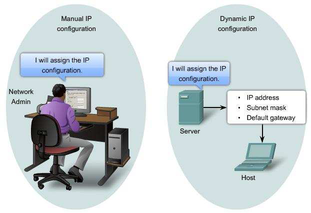

Tanpa DHCP, administrator jaringan harus memasukkan `IP Address` masing-masing komputer dalam suatu jaringan secara manual. Namun jika DHCP dipasang di jaringan, maka semua komputer yang tersambung ke jaringan akan mendapatkan `IP Address` secara otomatis dari `DHCP Server`.

### **2.1.3 Bootstrap Protocol dan Dynamic Host Configuration Protocol**

Selain DHCP, terdapat protokol lain yang juga memudahkan pengalokasian `IP Address` dalam suatu jaringan, yaitu `Bootstrap Protocol (BOOTP)`. Perbedaan `BOOTP` dan DHCP terletak pada proses konfigurasinya, sebagai berikut.

| BOOTP                                                                                                       | DHCP                                                                                                                                                     |
| ----------------------------------------------------------------------------------------------------------- | -------------------------------------------------------------------------------------------------------------------------------------------------------- |
| Administrator jaringan melakukan konfigurasi _mapping_ `MAC Address` _client_ dengan `IP Address` tertentu. | _Server_ akan melakukan peminjaman `IP Address` dan konfigurasi lainnya dalam rentang waktu tertentu. Protokol ini dibuat berdasarkan cara kerja `BOOTP` |

### **2.1.4 DHCP Message Header**

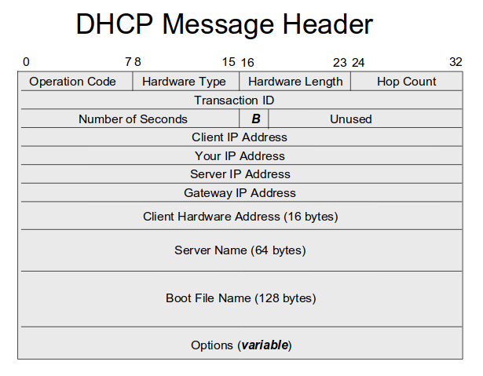

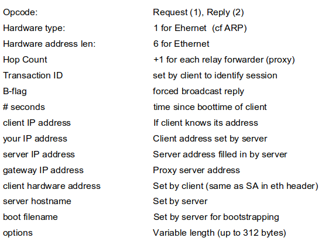

### **2.1.5 Cara Kerja DHCP**

DHCP bekerja dengan melibatkan dua pihak yakni **Server** dan **Client** sebagai berikut.

1. **DHCP Server** memberikan suatu layanan yang dapat memberikan `IP Address` dan parameter lainnya kepada semua _client_ yang memintanya.
2. **DHCP Client** adalah mesin _client_ yang menjalankan perangkat lunak _client_ yang memungkinkan mereka untuk dapat berkomunikasi dengan `DHCP Server`.
   `DHCP Server` umumnya memiliki sekumpulan `IP Address` yang didistribusikan yang disebut `DHCP Pool`. Setiap _client_ akan meminjamnya untuk rentan waktu yang ditentukan oleh DHCP sendiri (dalam konfigurasi, yang disebut dengan _leasing time_). Jika masa waktu habis, maka client akan meminta `IP Address` yang baru atau memperpanjangnya. Itulah sebabnya `IP Address` client menjadi dinamis.

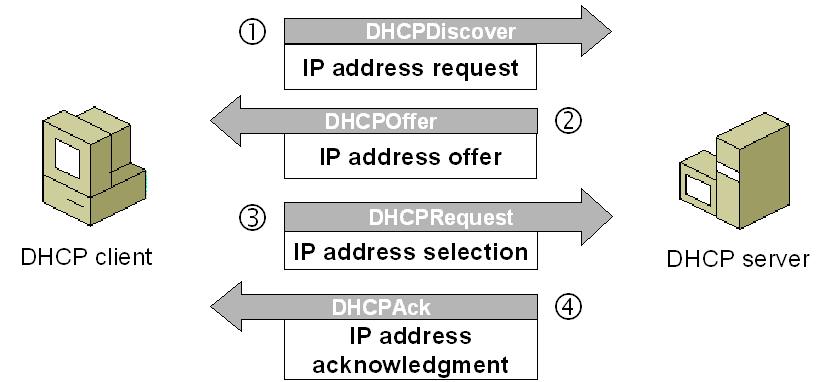

Terdapat 5 tahapan yang dilakukan dalam proses peminjaman `IP Address` pada DHCP, yaitu sebagai berikut.

1. **DHCPDISCOVER**: _Client_ menyebarkan request secara _broadcast_ untuk mencari `DHCP Server` yang aktif. `DHCP Server` menggunakan UDP port 67 untuk menerima broadcast dari client melalui port 68.
2. **DHCPOFFER**: `DHCP Server` menawarkan `IP Address` (dan konfigurasi lainnya apabila ada) kepada _client_. `IP Address` yang ditawarkan adalah salah satu alamat yang tersedia dalam `DHCP Pool` pada `DHCP Server` yang bersangkutan.
3. **DHCPREQUEST**: _Client_ menerima tawaran dan menyetujui peminjaman `IP Address` tersebut kepada `DHCP Server`.
4. **DHCPACK**: DHCP server menyetujui permintaan `IP Address` dari _client_ dengan mengirimkan paket `ACKnoledgment` berupa konfirmasi `IP Address` dan informasi lain. Kemudian, _client_ melakukan inisialisasi dengan mengikat (_binding_) `IP Address` tersebut dan _client_ dapat bekerja pada jaringan tersebut. `DHCP Server` akan mencatat peminjaman yang terjadi.
5. **DHCPRELEASE**: _Client_ menghentikan peminjaman `IP Address` (apabila waktu peminjaman habis atau menerima `DHCPNAK`).


Lebih lanjut, kalian dapat menonton atau melihat visualisasi kerja dari DHCP di berbagai sumber untuk menambah pemahaman. Salah satunya, adalah pada video berikut [https://youtu.be/S43CFcpOZSI](https://youtu.be/S43CFcpOZSI).

### **2.1.6 DHCP Relay**

Sebelumnya, telah disebutkan bahwa DHCP melibatkan dua pihak, yaitu `DHCP Server` dan `DHCP Client`. Pada bagian ini, dibahas satu pihak lain yang juga terlibat dalam proses peminjaman `IP Address`, yaitu `DHCP Relay`. Apa itu `DHCP Relay`?

#### A. Konsep DHCP Relay

`DHCP Relay` adalah perangkat jaringan (dengan skenario paling umum perangkat jaringan tersebut adalah `router`) yang berfungsi sebagai perantara atau penerus (_forwarder_) antara `DHCP Client` dan `DHCP Server` yang tidak berada dalam satu segmen jaringan yang sama. `DHCP Relay` menerima _request_ dari `DHCP Client` lalu meneruskannya ke `DHCP Server`. Begitu juga sebaliknya, `DHCP Relay` menerima _response_ dari `DHCP Server` lalu meneruskannya ke `DHCP Client`. Dengan adanya `DHCP Relay`, maka `DHCP Client` dan `DHCP Server` tidak perlu berada dalam satu segmen jaringan yang sama.

> Beberapa dari kalian saat membaca kalimat pertama dari penjelasan `DHCP Relay` mungkin akan berfikir bahwa `DHCP Relay` memiliki peran yang sama seperti switch. Nah, maka pemahaman itu adalah salah, ya!

Penempatan `DHCP Relay` dalam suatu jaringan bisa diilustrasikan seperti berikut.

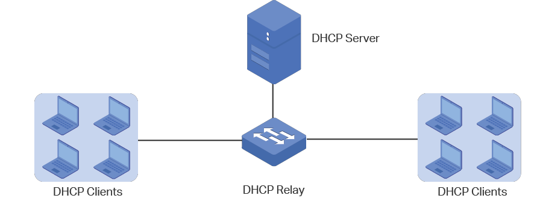

Sebagai _forwarder_, cara atau tahapan kerja DHCP dengan pelibatan `DHCP Relay` akan sama seperti yang telah dijelaskan sebelumnya, tetapi dengan beberapa penyesuaian. Singkatnya seperti berikut.

- `DHCP Relay` akan menerima `DHCPDISCOVER` dari `DHCP Client`, kemudian meneruskannya ke `DHCP Server`.
- `DHCP Server` akan mengirimkan `DHCPOFFER` kepada `DHCP Relay`, kemudian `DHCP Relay` akan meneruskannya ke `DHCP Client`.
- `DHCP Relay` juga akan meneruskan `DHCPREQUEST` dari `DHCP Client` ke `DHCP Server`, kemudian `DHCP Server` akan mengirimkan `DHCPACK` kepada `DHCP Relay`, dan `DHCP Relay` akan meneruskannya ke `DHCP Client`.
- `DHCP Relay` juga akan meneruskan `DHCPRELEASE` dari `DHCP Client` ke `DHCP Server`, kemudian `DHCP Server` akan mengirimkan `DHCPNAK` kepada `DHCP Relay`, dan `DHCP Relay` akan meneruskannya ke `DHCP Client`.

> Tentu kalian tidak asing dengan istilah tersebut? Ya, istilah tersebut mirip dengan proses _handshake_ pada protokol TCP!

#### B. Mengapa DHCP Relay diperlukan?

Ada beberapa alasan mengapa `DHCP Relay` diperlukan, yaitu sebagai berikut.

- Memungkinkan `DHCP Server` melayani `DHCP Client` yang berada di luar segmen jaringan lokal. Tanpa `DHCP Relay`, DHCP hanya dapat bekerja dalam satu segmen jaringan lokal.
- Menghemat `IP Address`. Dengan `DHCP Relay`, hanya dibutuhkan satu `DHCP Server` untuk melayani banyak segmen jaringan. Tanpa `DHCP Relay`, setiap segmen jaringan memerlukan `DHCP Server` masing-masing.
- Memudahkan manajemen jaringan. Administrator jaringan cukup melakukan konfigurasi dan manajemen pada satu `DHCP Server` saja, tidak perlu satu-satu.
- Meningkatkan keamanan jaringan dengan membatasi akses `DHCP Server` hanya dari `DHCP Relay`.

### **2.7 DHCP Lease Time**

`DHCP Lease Time` adalah waktu yang dialokasikan oleh `DHCP Server` ketika sebuah `IP Address` dipinjamkan kepada komputer _client_. Singkatnya, setelah waktu pinjam ini selesai, maka `IP Address` tersebut dapat dipinjam lagi oleh komputer _client_ yang sama atau komputer _client_ tersebut mendapatkan `IP Address` lain jika `IP Address` yang sebelumnya dipinjam, dipergunakan oleh komputer _client_ lain.

#### A. Lease Time dalam DHCP

`DHCP Lease Time` menentukan berapa lama _client_ DHCP dapat menggunakan `IP Address` yang dialokasikan oleh `DHCP Server`. Ada beberapa jenis _lease time_ dalam DHCP, sebagai berikut.

- Infinite Lease Time

  Sederhananya, _client_ mendapatkan hak untuk menggunakan `IP Address` tertentu selamanya atau hingga _lease_ dibatalkan secara manual oleh administrator. Biasanya, jenis _lease time_ ini diterapkan untuk _static_ `IP Address` _assignment_ pada perangkat seperti _server_, _router_, _switch_, _printer_, dan perangkat penting lain. Kelebihannya, _client_ akan selalu mendapatkan `IP Address` yang sama meskipun dilakukan _restart_ atau _reconnect_. Tetapi, akan berpotensi menimbulkan pemborosan `IP Address` jika `IP Address` yang telah dialokasikan tidak digunakan.

- Finite Lease Time

  Pada _lease time_ jenis ini, _client_ hanya bisa menggunakan `IP Address` selama periode waktu tertentu (jam, hari, minggu). Setelah _lease expired_, _client_ harus _request_ `IP Address` baru dari `DHCP server`. Umumnya, jenis _lease time_ ini digunakan untuk _client_ seperti komputer, laptop, dan _smartphone_. Kelebihannya, `IP Address` bisa didaur ulang, _client_ mendapat `IP Address` baru secara berkala. Tetapi, berpotensi adanya interupsi koneksi saat _renew lease_.

- Dynamic Lease Time

  `DHCP Server` secara otomatis menentukan lama _lease time_ berdasarkan _availability_ `IP Address` dan _request client_. Hal itu akhirnya mengakibatkan _lease time_ bisa sangat pendek hingga lama tergantung ketersediaan `IP Address`. Kelebihannya, tentu memberikan fleksibilitas pengelolaan `IP Address` bagi administrator.

#### B. Pentingnya Pengaturan Lease Time

Beberapa alasan mengapa pengaturan lease time DHCP itu penting adalah sebagai berikut.

- Memastikan ketersediaan `IP Address` dengan membatasi pemakaian per _client_ dalam jangka waktu tertentu saja.
- Mencegah _single_ _client_ mendominasi `IP Address` tertentu dalam jangka panjang, `IP Address` bisa digunakan _client_ lain setelah _expired_.
- Memberikan _client_ `IP Address` baru secara berkala dari _pool_ `IP Address` untuk alasan keamanan & performa.
- Memungkinkan `DHCP Server` menarik kembali (_reclaim_) `IP Address` yang tidak terpakai atau _inactive_ untuk kemudian didistribusikan ulang ke _client_ lain yang membutuhkan.
- Membantu administrator _troubleshooting_ masalah jaringan yang terkait dengan `IP Address` _client_.

</br>

## **2.2 Implementasi**

Setelah memahami konsep, lalu bagaimana implementasinya? Untuk implementasi, kita akan menggunakan topologi berikut


Pembagian IP Address untuk kasus ini adalah sebagai berikut:

```
eth1 Foosha: 10.40.1.1
Loguetown: 10.40.1.2
Alabasta: 10.40.1.3

eth2 Foosha: 10.40.2.1
EniesLobby: 10.40.2.2
Water7: 10.40.2.3
```

### **2.2.1 Instalasi ISC-DHCP-Server**

Pada topologi ini, kita akan menjadikan **EniesLobby** sebagai DHCP Server. Oleh sebab itu, kita harus meng-_install_ **isc-dhcp-server** di **EniesLobby** dengan melakukan langkah-langkah sebagai berikut.

1. Update _package lists_ di **EniesLobby** dengan perintah sebagai berikut.

```
apt-get update
```

2. _Install_ **isc-dhcp-server** di **EniesLobby**.

```
apt-get install isc-dhcp-server
```

3. Pastikan **isc-dhcp-server** telah ter-_install_ dengan perintah.

```
dhcpd --version
```

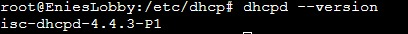

### **2.2.2 Konfigurasi DHCP Server**

Langkah-langkah yang harus dilakukan setelah instalasi adalah sebagai berikut.

#### A. Menentukan _Interface_ yang akan Diberi Layanan DHCP

##### A.1. Buka _File_ Konfigurasi _Interface_

Silakan edit _file_ konfigurasi `isc-dhcp-server` pada `/etc/default/isc-dhcp-server`.

##### A.2. Tentukan _Interface_

Coba perhatikan topologi yang telah kalian buat. Contoh dari topologi yang dibuat adalah `interface` dari **EniesLobby** yang menuju ke `switch` adalah `eth0`, maka kita akan memilih `interfacev4` `eth0` untuk diberikan layanan DHCP.

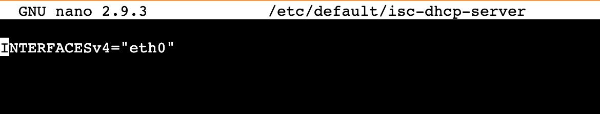

#### B. Melakukan Konfigurasi pada `isc-dhcp-server`

Ada banyak hal yang dapat dikonfigurasi, antara lain sebagai berikut.

- Range IP
- DNS Server
- Informasi Netmask
- Default Gateway
- dll.

##### B.1. Buka _File_ Konfigurasi DHCP

Edit _file_ konfigurasi `isc-dhcp-server` pada `/etc/dhcp/dhcpd.conf`.

##### B.2. Tambahkan _Script_ Konfigurasi

```conf
subnet 'NID' netmask 'Netmask' {
    range 'IP_Awal' 'IP_Akhir';
    option routers 'iP_Gateway';
    option broadcast-address 'IP_Broadcast';
    option domain-name-servers 'DNS_yang_diinginkan';
    default-lease-time 'Waktu';
    max-lease-time 'Waktu';
}
```

_Script_ tersebut mengatur parameter jaringan yang dapat didistribusikan oleh DHCP, seperti informasi `netmask`, `default gateway`, dan `DNS Server`. Berikut ini beberapa parameter jaringan dasar yang biasanya digunakan.

| **No** | **Parameter Jaringan**                             | **Keterangan**                                                                                                                                                                                                                                                                                                                                                                                                                                                                      |
| ------ | -------------------------------------------------- | ----------------------------------------------------------------------------------------------------------------------------------------------------------------------------------------------------------------------------------------------------------------------------------------------------------------------------------------------------------------------------------------------------------------------------------------------------------------------------------- |
| 1      | `subnet 'NID'`                                     | Network ID pada subnet interface. Sederhananya pada kasus pembelajaran praktikum kita, nilai NID merupakan 3 bytes dari IP interface tujuan (sesuai dengan langkah [A2](#a2-tentukan-interface)) **pada router** (dalam kasus ini adalah Foosha) dengan byte terakhirnya adalah 0. Sebagai contoh saja, jika interface yang kamu pilih adalah `eth0` dengan IP 10.40.0.1, maka NID subnetnya adalah 10.40.0.0. **NB: Cara menentukan NID yang proper akan dijelaskan pada modul 4** |
| 2      | `netmask 'Netmask`                                 | Netmask pada subnet. Dapat dilihat pada konfigurasi network router dengan cara: Ke topologi (GNS3) → klik kanan router → Configure → Edit Network Configuration → Lihat nilai netmask pada interface yang diinginkan                                                                                                                                                                                                                                                                |
| 3      | `range 'IP_Awal' 'IP_Akhir'`                       | Rentang `IP Address` yang akan didistribusikan dan digunakan secara dinamis                                                                                                                                                                                                                                                                                                                                                                                                         |
| 4      | `option routers 'Gateway'`                         | IP gateway dari router menuju client sesuai konfigurasi subnet                                                                                                                                                                                                                                                                                                                                                                                                                      |
| 5      | `option broadcast-address 'IP_Broadcast'`          | IP broadcast pada subnet                                                                                                                                                                                                                                                                                                                                                                                                                                                            |
| 6      | `option domain-name-servers 'DNS_yang_diinginkan'` | DNS yang ingin kita berikan pada client                                                                                                                                                                                                                                                                                                                                                                                                                                             |
| 7      | Lease time                                         | Waktu yang dialokasikan ketika sebuah IP dipinjamkan kepada komputer client. Setelah waktu pinjam ini selesai, maka IP tersebut dapat dipinjam lagi oleh komputer yang sama atau komputer tersebut mendapatkan `IP Address` lain jika `IP Address` yang sebelumnya dipinjam, dipergunakan oleh komputer lain                                                                                                                                                                        |
| 8      | `default-lease-time 'Waktu'`                       | Lama waktu DHCP server meminjamkan `IP Address` kepada client, dalam satuan detik. Default 600 detik                                                                                                                                                                                                                                                                                                                                                                                |
| 9      | `max-lease-time 'Waktu'`                           | Waktu maksimal yang di alokasikan untuk peminjaman IP oleh DHCP server ke client dalam satuan detik. Default 7200 detik                                                                                                                                                                                                                                                                                                                                                             |

Pada contoh berikut, kita akan menggunakan DNS 192.168.122.1. Maka konfigurasinya menjadi sebagai berikut:

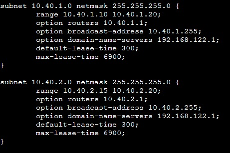

##### A.3. Restart Service `isc-dhcp-server` Dengan Perintah

```
service isc-dhcp-server restart
```

Jika terjadi **failed!**, maka service harus dihentikan dulu (_stop_), kemudian jalankan kembali (_start_). Untuk memastikan `isc-dhcp-server` berjalan, silakan gunakan perintah sebagai berikut.

```
service isc-dhcp-server status
```

Selamat 🎉, konfigurasi `DHCP Server` telah selesai!

---

### **2.2.3 Konfigurasi DHCP Relay**

Ketika DHCP Server berada pada subnet yang berbeda dengan DHCP client, maka kita akan membutuhkan `DHCP Relay`. Maka dari itu, langkah-langkah berikut harus dilakukan pada perangkat yang dijadikan sebagai `DHCP Relay` (umumnya pada _router_). Oleh karena itu, _router_ **Foosha** akan menjadi DHCP Relay. Langkah-langkah yang harus dilakukan adalah sebagai berikut.

#### A. Melakukan Instalasi

Lakukan beberapa instalasi sebelum melakukan konfigurasi pada **Foosha** yang dijadikan sebagai `DHCP Relay`. Instalasi yang dilakukan adalah sebagai berikut.

```
apt-get update
apt-get install isc-dhcp-relay -y
service isc-dhcp-relay start
```

#### B. Melakukan Konfigurasi pada `isc-dhcp-relay`

Pada `/etc/default/isc-dhcp-relay` lakukan konfigurasi berikut.

```
SERVERS="[IP Address dari DHCP Server]"
INTERFACES="eth1 eth2"
OPTIONS=
```

Isi dari `INTERFACES=` harus menyesuaikan jumlah _interface_ _output_ yang terhubung dengan _client_. Pada kasus ini, terdapat 2 _interface_ _output_ yang terhubung dengan _client_, yaitu `eth1` dan `eth2`.

Tidak lupa, `SERVERS=` berisi `IP Address` dari `DHCP Server` yang terhubung. Pada kasus ini, IP Address DHCP Server adalah IP dari node **EniesLobby**. Berapakah IP Address yang dimaksud?

#### C. Melakukan Konfigurasi IP Forwarding

Pada `/etc/sysctl.conf`.

```
net.ipv4.ip_forward=1
```

Konfigurasi tersebut digunakan untuk mengaktifkan `IP Forwarding`. Kemudian, _restart_ _service_ `isc-dhcp-relay`.

> Apa itu `IP Forwarding`? `IP Forwarding` adalah fitur yang memungkinkan _router_ untuk meneruskan paket dari suatu jaringan ke jaringan lainnya. _Router_ memiliki minimal dua _interface_ jaringan, misal _interface_ A terhubung ke jaringan A dan _interface_ B terhubung ke jaringan B. Ketika ada paket IP masuk dari jaringan A menuju ke jaringan B, maka _router_ akan meneruskan (_forward_) paket tersebut dari _interface_ A ke _interface_ B. Demikian pula sebaliknya.

```
service isc-dhcp-relay restart
```

Selamat 🎉, konfigurasi `DHCP Relay` telah selesai!

---

### **2.2.4 Konfigurasi DHCP Client**

Setelah mengonfigurasi _server_, kita juga perlu mengonfigurasi _interface_ _client_ supaya bisa mendapatkan layanan dari `DHCP Server`. Di dalam topologi ini, contoh _client_-nya adalah **Alabasta**, **Loguetown**, dan **Water7**.

#### A. Mengonfigurasi _Client_

##### A.1. Periksa IP Alabasta dengan `ip a`

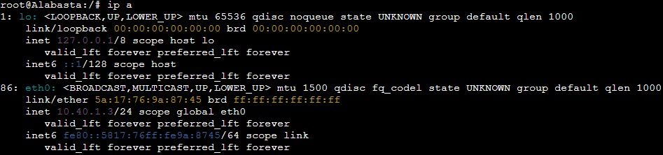

Dari konfigurasi sebelumnya, **Alabasta** telah diberikan `IP Address` statis 10.40.1.3.

##### A.2. Buka `/etc/network/interfaces` untuk Mengonfigurasi _Interface_ **Alabasta**

Silakan edit file `/etc/network/interfaces`.

##### A.3. _Comment_ atau Hapus Konfigurasi yang Lama (Konfigurasi `IP Address` Statis)

Lalu tambahkan konfigurasi berikut.

```
auto eth0
iface eth0 inet dhcp
```


**Keterangan**:

- **eth0** adalah _interface_ yang digunakan _client_.
- `iface eth0 inet dhcp`: memberikan konfigurasi DHCP pada _interface_ eth0, bukan konfigurasi statis.

##### A.4. Restart Alabasta

Untuk melakukan _restart_ Alabasta, silakan menuju `GNS3 → klik kanan Alabasta → klik Stop → klik kanan kembali Alabasta → klik Start`.

#### B. Testing

Cek kembali `IP Address` **Alabasta** dengan menjalankan `ip a`.

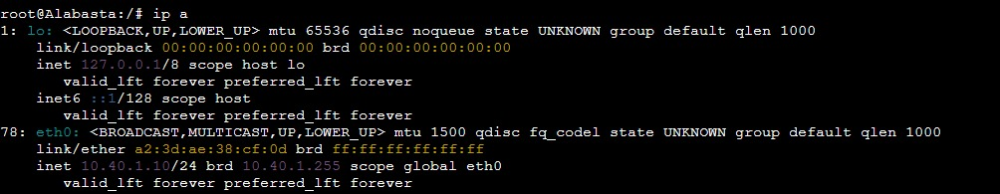

Periksa juga apakah **Alabasta** sudah mendapatkan `DNS Server` sesuai konfigurasi di `DHCP Server`. Periksa `/etc/resolv.conf` dengan menggunakan perintah sebagai berikut. Selain itu, kalian juga bisa melakukan pemeriksaan dengan melakukan ping kepada `google.com`

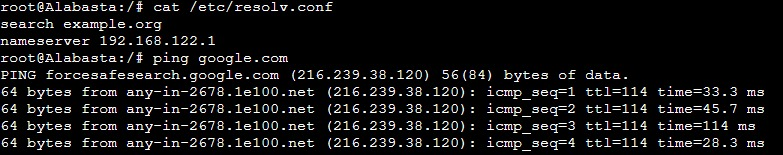

Bila `IP Address` dan nameserver **Alabasta** telah berubah sesuai dengan konfigurasi yang diberikan oleh DHCP dan berhasil melakukan ping ke `google.com`, maka selamat kalian telah berhasil! 🎉🎉

**Keterangan**:

- Jika IP **Alabasta** masih belum berubah, jangan panik. Silakan _restart_ kembali _node_ melalui halaman GNS3.
- Jika masih belum berubah juga, jangan buru-buru bertanya. Coba periksa lagi semua konfigurasi yang telah kalian lakukan, mungkin terdapat kesalahan penulisan.

#### C. Lakukan kembali langkah - langkah di atas pada client Loguetown dan Water7

- Client **Loguetown** dan **Water7**.


Setelah `IP Address` dipinjamkan ke sebuah client, maka `IP Address` tersebut tidak akan diberikan ke _client_ lain. Buktinya, tidak ada _client_ yang mendapatkan `IP Address` yang sama.

---

### **2.2.5 Leasing Times**

Lakukan konfigurasi pada DHCP, yaitu pada `/etc/dhcp/dhcpd.conf` untuk mengatur _leasing time_ pada masing-masing `subnet` yang terhubung. Pada topologi yang digunakan sekarang, `subnet` tersebut adalah `subnet` yang terhubung dengan **Alabasta**, **Loguetown**, dan **Water7**.

```

subnet 10.40.2.0 netmask 255.255.255.0 {
    range 10.40.2.15 10.40.2.20;
    option routers 10.40.2.1;
    option broadcast-address 10.40.2.255;
    option domain-name-servers 192.168.122.1;
    default-lease-time 300;
    max-lease-time 6900;

}
subnet 10.40.1.0 netmask 255.255.255.0 {
    range 10.40.1.10 10.40.1.20;
    option routers 10.40.1.1;
    option broadcast-address 10.40.1.255;
    option domain-name-servers 192.168.122.1;
    default-lease-time 600;
    max-lease-time 6900;
}
```

Pada konfigurasi tersebut, dilakukan _leasing_ pada subnet `10.40.1.0` dan `10.40.2.0`. Pengaturan lama waktu _leasing_ ditunjukkan pada tiga baris terakhir pada setiap pengaturan `subnet` dengan satuan ukuran _milisecond_. Selanjutnya, silahkan _restart_ `isc-dhcp-server` dengan perintah sebagai berikut.s

```
service isc-dhcp-server stop
service isc-dhcp-server start
```

### **2.2.6 Fixed Address**

Konfigurasi dapat dilakukan sebagai berikut.


> **Studi Kasus**:
>
> Ternyata kapal milik Franky yang diparkir di **Water7** selain menjadi _client_, juga akan digunakan sebagai _server_ suatu aplikasi jual beli kapal, sehingga akan menyulitkan jika `IP Address`nya berganti-ganti setiap **Water7** terhubung ke jaringan internet. Oleh karena itu, **Water7** membutuhkan `IP Address` yang tetap dan tidak berganti-ganti.

Masalah yang dihadapi oleh Franky adalah IP address dari Water7 yang berganti-ganti. Sehingga, requirementnya adalah `IP address` yang tetap. Oleh karena itu, solusi yang dapat ditawarkan adalah dengan fitur dari DHCP Server, yaitu layanan untuk "menyewakan" `IP Address` secara tetap pada suatu _host_, yakni **Fixed Address**. Dalam kasus ini, **Water7** akan mendapatkan `IP Address` tetap, yaitu `10.40.2.13`.

#### A. Konfigurasi `DHCP Server` di **EniesLobby**

##### A.1. Buka File Konfigurasi `isc-dhcp-server`

Buka dan edit file `/etc/dhcp/dhcpd.conf`.

##### A.2. Tambahkan _Script_ Berikut

```
host Water7 {
    hardware ethernet 'hwaddress_milik_Water7';
    fixed-address 10.40.2.13;
}
```

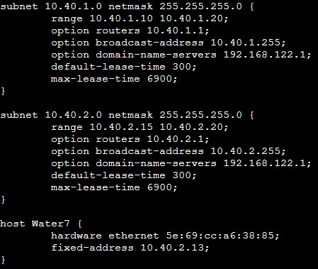

**Penjelasan**:

- Untuk mencari `hwaddress_milik_Water7` (_hardware_ _address_ milik Water7), kamu bisa mengeksekusi perintah `ip a` di Water7, kemudian lihat _interface_ yang berhubungan dengan `DHCP Relay`, dalam kasus ini adalah `eth0`, dan lihat pada bagian `link/ether`. Silakan _copy_ _address_ tersebut dan masukkan pada konfigurasi `isc-dhcp-server` di **EniesLobby**.

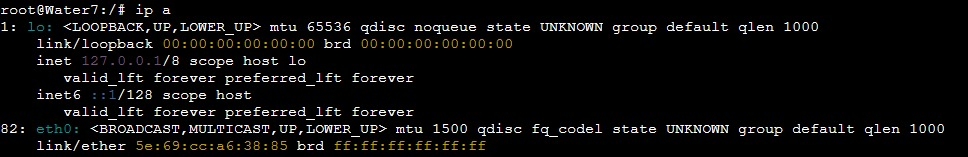

- **fixed-address** adalah `IP Address` yang "disewa" tetap oleh **Water7**

##### A.3. _Restart_ _Service_ `isc-dhcp-server` pada **EniesLobby**

#### B. Konfigurasi `DHCP Client`

##### B.1. Konfigurasi _Network Interface_ **Water7**

_Network interface_ dapat diakses pada `/etc/network/interfaces`.

##### B.2. Tambah konfigurasi berikut

```
hwaddress ether 'hwaddress_milik_Water7'
```

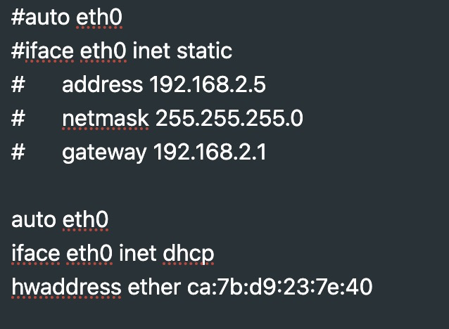

**Keterangan**:
_Hardware addresss_ perlu di-_setting_ juga di `/etc/network/interfaces` untuk mencegah bergantinya `hwaddress` saat _project_ GNS3 dimatikan atau di-_export_.

#### B.3. _Restart Node_ Water7

Silakan _restart_ _node_ Water7 di halaman GNS3.

#### C. _Testing_

Periksa IP **Water7** dengan melakukan `ip a`.

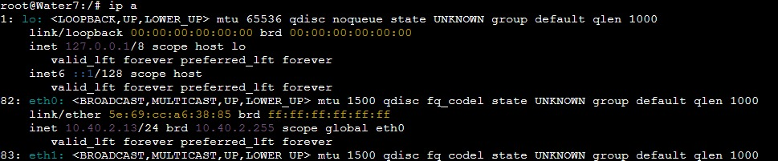

`IP Address` **Water7** telah berubah menjadi `10.40.2.13` sesuai dengan _Fixed_ _Address_ yang diberikan oleh `DHCP Server`. 👋👋👋

---

### **2.2.7 Menguji Konfigurasi DHCP pada Topologi**

Setelah melakukan berbagai konfigurasi di atas, kalian bisa memastikan apakah` DHCP Server` kalian berhasil dengan cara sebagai berikut.

1. Matikan semua _node_ melalui halaman GNS3.
2. Menyalakan kembali semua _node_.
3. Lakukan perintah `ip a` pada setiap _node_.

Jika _node client_ berganti `IP Address` sesuai dengan _range_ yang telah dikonfigurasi pada `DHCP Server` dan **Water7** tetap mendapatkan `IP Address` `10.40.2.13`, maka konfigurasi `DHCP Server` kalian berhasil.

## **Soal Latihan**

1. Buatlah konfigurasi DHCP agar Loguetown dan Alabasta mendapatkan `IP Address` dengan _range_ 10.40.1.69 - 10.40.1.70 dan 10.40.1.200 - 10.40.1.225 dengan syarat yaitu setiap 2 menit, `IP Address` pada _client_ berubah dan juga DNS diarahkan ke `DNS Server` kalian sendiri tetapi _client_ tetap bisa digunakan untuk mengakses internet.

## **Referensi**

- [https://www.isc.org/dhcp/](https://www.isc.org/dhcp/)
- [http://www.tcpipguide.com/free/t_DHCPGeneralOperationandClientFiniteStateMachine.htm](http://www.tcpipguide.com/free/t_DHCPGeneralOperationandClientFiniteStateMachine.htm)

# _Yeay, Tamat. Jempol dari Gracie 👍_


