# **2. Dynamic Host Configuration Protocol (DHCP)**

Materi pada modul ini memiliki _outline_ sebagai berikut.

## **Outline**

- [**2. Dynamic Host Configuration Protocol (DHCP)**](#2-dynamic-host-configuration-protocol-dhcp)
  - [**Outline**](#outline)
  - [**2.1 Konsep**](#21-konsep)
    - [**2.1.1 Pendahuluan**](#211-pendahuluan)
    - [**2.1.2 Apa itu DHCP?**](#212-apa-itu-dhcp)
    - [**2.1.3 Bootstrap Protocol dan Dynamic Host Configuration Protocol**](#213-bootstrap-protocol-dan-dynamic-host-configuration-protocol)
    - [**2.1.4 DHCP Message Header**](#214-dhcp-message-header)
    - [**2.1.5 Cara Kerja DHCP**](#215-cara-kerja-dhcp)
    - [**2.1.6 DHCP Relay**](#216-dhcp-relay)
      - [A. Konsep DHCP Relay](#a-konsep-dhcp-relay)
      - [B. Mengapa DHCP Relay diperlukan?](#b-mengapa-dhcp-relay-diperlukan)
    - [**2.7 DHCP Lease Time**](#27-dhcp-lease-time)
      - [A. Lease Time dalam DHCP](#a-lease-time-dalam-dhcp)
      - [B. Pentingnya Pengaturan Lease Time](#b-pentingnya-pengaturan-lease-time)
  - [**2.2 Implementasi**](#22-implementasi)
    - [**2.2.1 Instalasi ISC-DHCP-Server**](#221-instalasi-isc-dhcp-server)
    - [**2.2.2 Konfigurasi DHCP Server**](#222-konfigurasi-dhcp-server)
      - [A. Menentukan _Interface_ yang akan Diberi Layanan DHCP](#a-menentukan-interface-yang-akan-diberi-layanan-dhcp)
        - [A.1. Buka _File_ Konfigurasi _Interface_](#a1-buka-file-konfigurasi-interface)
        - [A.2. Tentukan _Interface_](#a2-tentukan-interface)
      - [B. Melakukan Konfigurasi pada `isc-dhcp-server`](#b-melakukan-konfigurasi-pada-isc-dhcp-server)
        - [B.1. Buka _File_ Konfigurasi DHCP](#b1-buka-file-konfigurasi-dhcp)
        - [B.2. Tambahkan _Script_ Konfigurasi](#b2-tambahkan-script-konfigurasi)
        - [A.3. Restart Service `isc-dhcp-server` Dengan Perintah](#a3-restart-service-isc-dhcp-server-dengan-perintah)
    - [**2.2.3 Konfigurasi DHCP Relay**](#223-konfigurasi-dhcp-relay)
      - [A. Melakukan Instalasi](#a-melakukan-instalasi)
      - [B. Melakukan Konfigurasi pada `isc-dhcp-relay`](#b-melakukan-konfigurasi-pada-isc-dhcp-relay)
      - [C. Melakukan Konfigurasi IP Forwarding](#c-melakukan-konfigurasi-ip-forwarding)
    - [**2.2.4 Konfigurasi DHCP Client**](#224-konfigurasi-dhcp-client)
      - [A. Mengonfigurasi _Client_](#a-mengonfigurasi-client)
        - [A.1. Periksa IP Alabasta dengan `ip a`](#a1-periksa-ip-alabasta-dengan-ip-a)
        - [A.2. Buka `/etc/network/interfaces` untuk Mengonfigurasi _Interface_ **Alabasta**](#a2-buka-etcnetworkinterfaces-untuk-mengonfigurasi-interface-alabasta)
        - [A.3. _Comment_ atau Hapus Konfigurasi yang Lama (Konfigurasi `IP Address` Statis)](#a3-comment-atau-hapus-konfigurasi-yang-lama-konfigurasi-ip-address-statis)
        - [A.4. Restart Alabasta](#a4-restart-alabasta)
      - [B. Testing](#b-testing)
      - [C. Lakukan kembali langkah - langkah di atas pada client Loguetown dan Water7](#c-lakukan-kembali-langkah---langkah-di-atas-pada-client-loguetown-dan-water7)
    - [**2.2.5 Leasing Times**](#225-leasing-times)
    - [**2.2.6 Fixed Address**](#226-fixed-address)
      - [A. Konfigurasi `DHCP Server` di _Router_ Foosha](#a-konfigurasi-dhcp-server-di-router-foosha)
        - [A.1. Buka File Konfigurasi `isc-dhcp-server`](#a1-buka-file-konfigurasi-isc-dhcp-server)
        - [A.2. Tambahkan _Script_ Berikut](#a2-tambahkan-script-berikut)
        - [A.3. _Restart_ _Service_ `isc-dhcp-server` pada **EniesLobby**](#a3-restart-service-isc-dhcp-server-pada-enieslobby)
      - [B. Konfigurasi `DHCP Client`](#b-konfigurasi-dhcp-client)
        - [B.1. Konfigurasi _Network Interface_ **Water7**](#b1-konfigurasi-network-interface-water7)
        - [B.2. Tambah konfigurasi berikut](#b2-tambah-konfigurasi-berikut)
      - [B.3. _Restart Node_ Water7](#b3-restart-node-water7)
      - [C. _Testing_](#c-testing)
    - [**2.2.7 Menguji Konfigurasi DHCP pada Topologi**](#227-menguji-konfigurasi-dhcp-pada-topologi)
  - [**Soal Latihan**](#soal-latihan)
  - [**Referensi**](#referensi)
- [**Love Sign dari Oniel 🙆‍♀️🙆‍♂️**](#love-sign-dari-oniel-️️)

</br>

## **2.1 Konsep**

Sebelum membahas lebih jauh, kita akan berkenalan pelan-pelan dengan DHCP. Kalian akan mempelajari konsep, cara kerja, dan implementasi DHCP. Selamat membaca!

### **2.1.1 Pendahuluan**

Pada topologi sederhana, kita bisa melakukan konfigurasi `IP Address`, `nameserver`, `gateway`, dan `subnetmask` pada _node_ secara manual/statis. Metode manual ini oke-oke saja saat diimplementasikan pada jaringan yang memiliki sedikit _host_. Tapi bagaimana jika jaringan tersebut memiliki banyak host? Jaringan WiFi umum misalnya. Apakah administrator jaringannya harus mengonfigurasi setiap _host_-nya satu per satu? Membayangkannya saja mengerikan, ya.

Di sinilah peran DHCP sangat dibutuhkan.

### **2.1.2 Apa itu DHCP?**

**Dynamic Host Configuration Protocol (DHCP)** adalah protokol berbasis arsitektur _client-server_ yang dipakai untuk memudahkan pengalokasian `IP Address` dalam satu jaringan. DHCP secara otomatis akan meminjamkan `IP Address` kepada _host_ yang memintanya.


Tanpa DHCP, administrator jaringan harus memasukkan `IP Address` masing-masing komputer dalam suatu jaringan secara manual. Namun jika DHCP dipasang di jaringan, maka semua komputer yang tersambung ke jaringan akan mendapatkan `IP Address` secara otomatis dari `DHCP Server`.

### **2.1.3 Bootstrap Protocol dan Dynamic Host Configuration Protocol**

Selain DHCP, terdapat protokol lain yang juga memudahkan pengalokasian `IP Address` dalam suatu jaringan, yaitu `Bootstrap Protocol (BOOTP)`. Perbedaan `BOOTP` dan DHCP terletak pada proses konfigurasinya, sebagai berikut.

| BOOTP                                                                                                       | DHCP                                                                                                                                                     |
| ----------------------------------------------------------------------------------------------------------- | -------------------------------------------------------------------------------------------------------------------------------------------------------- |
| Administrator jaringan melakukan konfigurasi _mapping_ `MAC Address` _client_ dengan `IP Address` tertentu. | _Server_ akan melakukan peminjaman `IP Address` dan konfigurasi lainnya dalam rentang waktu tertentu. Protokol ini dibuat berdasarkan cara kerja `BOOTP` |

### **2.1.4 DHCP Message Header**

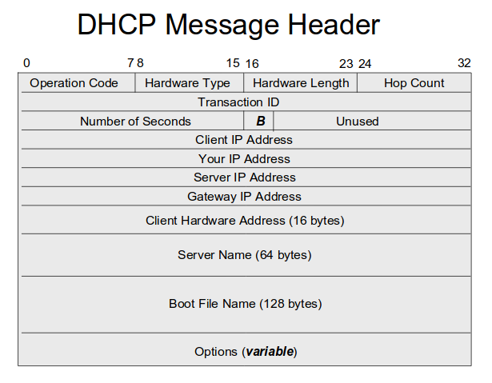

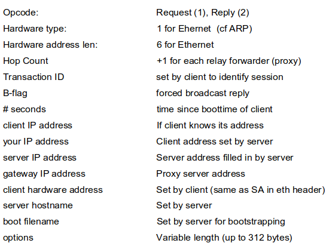

### **2.1.5 Cara Kerja DHCP**

DHCP bekerja dengan melibatkan dua pihak yakni **Server** dan **Client** sebagai berikut.

1. **DHCP Server** memberikan suatu layanan yang dapat memberikan `IP Address` dan parameter lainnya kepada semua _client_ yang memintanya.
2. **DHCP Client** adalah mesin _client_ yang menjalankan perangkat lunak _client_ yang memungkinkan mereka untuk dapat berkomunikasi dengan `DHCP Server`.
   `DHCP Server` umumnya memiliki sekumpulan `IP Address` yang didistribusikan yang disebut `DHCP Pool`. Setiap _client_ akan meminjamnya untuk rentan waktu yang ditentukan oleh DHCP sendiri (dalam konfigurasi, yang disebut dengan _leasing time_). Jika masa waktu habis, maka client akan meminta `IP Address` yang baru atau memperpanjangnya. Itulah sebabnya `IP Address` client menjadi dinamis.

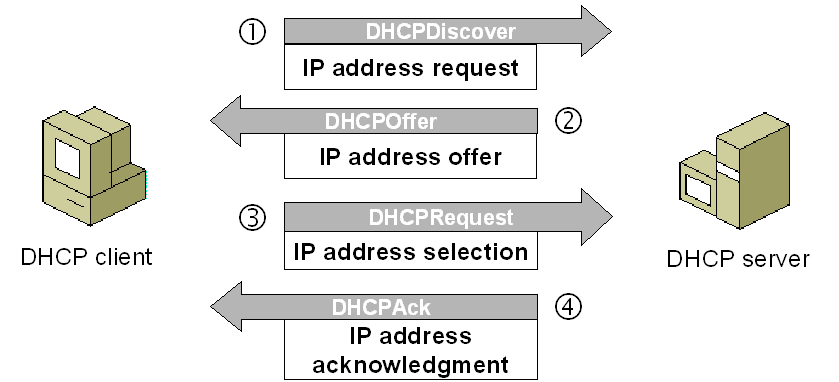

Terdapat 5 tahapan yang dilakukan dalam proses peminjaman `IP Address` pada DHCP, yaitu sebagai berikut.

1. **DHCPDISCOVER**: _Client_ menyebarkan request secara _broadcast_ untuk mencari `DHCP Server` yang aktif. `DHCP Server` menggunakan UDP port 67 untuk menerima broadcast dari client melalui port 68.
2. **DHCPOFFER**: `DHCP Server` menawarkan `IP Address` (dan konfigurasi lainnya apabila ada) kepada _client_. `IP Address` yang ditawarkan adalah salah satu alamat yang tersedia dalam `DHCP Pool` pada `DHCP Server` yang bersangkutan.
3. **DHCPREQUEST**: _Client_ menerima tawaran dan menyetujui peminjaman `IP Address` tersebut kepada `DHCP Server`.
4. **DHCPACK**: DHCP server menyetujui permintaan `IP Address` dari _client_ dengan mengirimkan paket `ACKnoledgment` berupa konfirmasi `IP Address` dan informasi lain. Kemudian, _client_ melakukan inisialisasi dengan mengikat (_binding_) `IP Address` tersebut dan _client_ dapat bekerja pada jaringan tersebut. `DHCP Server` akan mencatat peminjaman yang terjadi.
5. **DHCPRELEASE**: _Client_ menghentikan peminjaman `IP Address` (apabila waktu peminjaman habis atau menerima `DHCPNAK`).


Lebih lanjut, kalian dapat menonton atau melihat visualisasi kerja dari DHCP di berbagai sumber untuk menambah pemahaman. Salah satunya, adalah pada video berikut [https://youtu.be/S43CFcpOZSI](https://youtu.be/S43CFcpOZSI).

### **2.1.6 DHCP Relay**

Sebelumnya, telah disebutkan bahwa DHCP melibatkan dua pihak, yaitu `DHCP Server` dan `DHCP Client`. Pada bagian ini, dibahas satu pihak lain yang juga terlibat dalam proses peminjaman `IP Address`, yaitu `DHCP Relay`. Apa itu `DHCP Relay`?

#### A. Konsep DHCP Relay

`DHCP Relay` adalah perangkat jaringan (dengan skenario paling umum perangkat jaringan tersebut adalah `router`) yang berfungsi sebagai perantara atau penerus (_forwarder_) antara `DHCP Client` dan `DHCP Server` yang tidak berada dalam satu segmen jaringan yang sama. `DHCP Relay` menerima _request_ dari `DHCP Client` lalu meneruskannya ke `DHCP Server`. Begitu juga sebaliknya, `DHCP Relay` menerima _response_ dari `DHCP Server` lalu meneruskannya ke `DHCP Client`. Dengan adanya `DHCP Relay`, maka `DHCP Client` dan `DHCP Server` tidak perlu berada dalam satu segmen jaringan yang sama.

> Beberapa dari kalian saat membaca kalimat pertama dari penjelasan `DHCP Relay` mungkin akan berfikir bahwa `DHCP Relay` memiliki peran yang sama seperti switch. Nah, maka pemahaman itu adalah salah, ya!

Penempatan `DHCP Relay` dalam suatu jaringan bisa diilustrasikan seperti berikut.

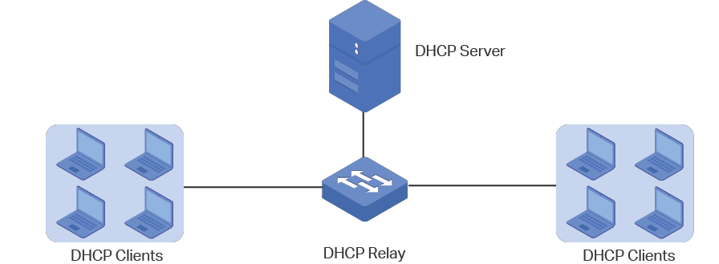

Sebagai _forwarder_, cara atau tahapan kerja DHCP dengan pelibatan `DHCP Relay` akan sama seperti yang telah dijelaskan sebelumnya, tetapi dengan beberapa penyesuaian. Singkatnya seperti berikut.

- `DHCP Relay` akan menerima `DHCPDISCOVER` dari `DHCP Client`, kemudian meneruskannya ke `DHCP Server`.
- `DHCP Server` akan mengirimkan `DHCPOFFER` kepada `DHCP Relay`, kemudian `DHCP Relay` akan meneruskannya ke `DHCP Client`.
- `DHCP Relay` juga akan meneruskan `DHCPREQUEST` dari `DHCP Client` ke `DHCP Server`, kemudian `DHCP Server` akan mengirimkan `DHCPACK` kepada `DHCP Relay`, dan `DHCP Relay` akan meneruskannya ke `DHCP Client`.
- `DHCP Relay` juga akan meneruskan `DHCPRELEASE` dari `DHCP Client` ke `DHCP Server`, kemudian `DHCP Server` akan mengirimkan `DHCPNAK` kepada `DHCP Relay`, dan `DHCP Relay` akan meneruskannya ke `DHCP Client`.

> Tentu kalian tidak asing dengan istilah tersebut? Ya, istilah tersebut mirip dengan proses _handshake_ pada protokol TCP!

#### B. Mengapa DHCP Relay diperlukan?

Ada beberapa alasan mengapa `DHCP Relay` diperlukan, yaitu sebagai berikut.

- Memungkinkan `DHCP Server` melayani `DHCP Client` yang berada di luar segmen jaringan lokal. Tanpa `DHCP Relay`, DHCP hanya dapat bekerja dalam satu segmen jaringan lokal.
- Menghemat `IP Address`. Dengan `DHCP Relay`, hanya dibutuhkan satu `DHCP Server` untuk melayani banyak segmen jaringan. Tanpa `DHCP Relay`, setiap segmen jaringan memerlukan `DHCP Server` masing-masing.
- Memudahkan manajemen jaringan. Administrator jaringan cukup melakukan konfigurasi dan manajemen pada satu `DHCP Server` saja, tidak perlu satu-satu.
- Meningkatkan keamanan jaringan dengan membatasi akses `DHCP Server` hanya dari `DHCP Relay`.

### **2.7 DHCP Lease Time**

`DHCP Lease Time` adalah waktu yang dialokasikan oleh `DHCP Server` ketika sebuah `IP Address` dipinjamkan kepada komputer _client_. Singkatnya, setelah waktu pinjam ini selesai, maka `IP Address` tersebut dapat dipinjam lagi oleh komputer _client_ yang sama atau komputer _client_ tersebut mendapatkan `IP Address` lain jika `IP Address` yang sebelumnya dipinjam, dipergunakan oleh komputer _client_ lain.

#### A. Lease Time dalam DHCP

`DHCP Lease Time` menentukan berapa lama _client_ DHCP dapat menggunakan `IP Address` yang dialokasikan oleh `DHCP Server`. Ada beberapa jenis _lease time_ dalam DHCP, sebagai berikut.

- Infinite Lease Time

  Sederhananya, _client_ mendapatkan hak untuk menggunakan `IP Address` tertentu selamanya atau hingga _lease_ dibatalkan secara manual oleh administrator. Biasanya, jenis _lease time_ ini diterapkan untuk _static_ `IP Address` _assignment_ pada perangkat seperti _server_, _router_, _switch_, _printer_, dan perangkat penting lain. Kelebihannya, _client_ akan selalu mendapatkan `IP Address` yang sama meskipun dilakukan _restart_ atau _reconnect_. Tetapi, akan berpotensi menimbulkan pemborosan `IP Address` jika `IP Address` yang telah dialokasikan tidak digunakan.

- Finite Lease Time

  Pada _lease time_ jenis ini, _client_ hanya bisa menggunakan `IP Address` selama periode waktu tertentu (jam, hari, minggu). Setelah _lease expired_, _client_ harus _request_ `IP Address` baru dari `DHCP server`. Umumnya, jenis _lease time_ ini digunakan untuk _client_ seperti komputer, laptop, dan _smartphone_. Kelebihannya, `IP Address` bisa didaur ulang, _client_ mendapat `IP Address` baru secara berkala. Tetapi, berpotensi adanya interupsi koneksi saat _renew lease_.

- Dynamic Lease Time

  `DHCP Server` secara otomatis menentukan lama _lease time_ berdasarkan _availability_ `IP Address` dan _request client_. Hal itu akhirnya mengakibatkan _lease time_ bisa sangat pendek hingga lama tergantung ketersediaan `IP Address`. Kelebihannya, tentu memberikan fleksibilitas pengelolaan `IP Address` bagi administrator.

#### B. Pentingnya Pengaturan Lease Time

Beberapa alasan mengapa pengaturan lease time DHCP itu penting adalah sebagai berikut.

- Memastikan ketersediaan `IP Address` dengan membatasi pemakaian per _client_ dalam jangka waktu tertentu saja.
- Mencegah _single_ _client_ mendominasi `IP Address` tertentu dalam jangka panjang, `IP Address` bisa digunakan _client_ lain setelah _expired_.
- Memberikan _client_ `IP Address` baru secara berkala dari _pool_ `IP Address` untuk alasan keamanan & performa.
- Memungkinkan `DHCP Server` menarik kembali (_reclaim_) `IP Address` yang tidak terpakai atau _inactive_ untuk kemudian didistribusikan ulang ke _client_ lain yang membutuhkan.
- Membantu administrator _troubleshooting_ masalah jaringan yang terkait dengan `IP Address` _client_.

</br>

## **2.2 Implementasi**

Setelah memahami konsep, lalu bagaimana implementasinya? Untuk implementasi, kita akan menggunakan topologi berikut

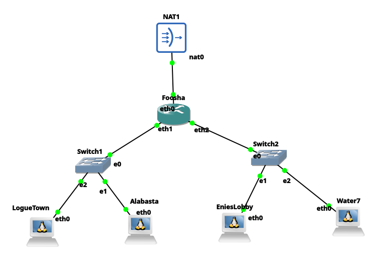

<!-- ``` -->
<!--                     NAT / internet -->
<!--                           | -->
<!--                         eth0 (DHCP dari NAT) -->
<!--                      +----------+ -->
<!--                      |  Foosha  |  router + DHCP relay -->
<!--                      +----------+ -->
<!--               eth1 10.40.1.1   eth2 10.40.2.1 -->
<!--                     |                | -->
<!--                 Switch 1          Switch 2 -->
<!--                 10.40.1.0/24      10.40.2.0/24 -->
<!--                  |       |         |         | -->
<!--             Loguetown Alabasta  EniesLobby  Water7 -->
<!--             (client)  (client)  (DHCP       (client) -->
<!--                                  server) -->
<!-- ``` -->
 
Pada kasus ini kita mengatur IP Address setiap node sebagai berikut:
 
```
Foosha eth0:  dari NAT cloud (192.168.122.x)
Foosha eth1:  10.40.1.1/24      (sisi Loguetown dan Alabasta)
Foosha eth2:  10.40.2.1/24      (sisi EniesLobby dan Water7)
 
EniesLobby:   10.40.2.2/24, gateway 10.40.2.1   (statis, DHCP Server)
Loguetown:    DHCP (pool 10.40.1.10 - 10.40.1.100)
Alabasta:     DHCP (pool 10.40.1.10 - 10.40.1.100)
Water7:       DHCP (pool 10.40.2.20 - 10.40.2.100, fixed address pada 2.2.6)
```
 
Perangkat lunak yang digunakan pada modul ini:
 
| Peran | Perangkat lunak | Node |
| ----- | --------------- | ---- |
| DHCP Server | `kea-dhcp4` (ISC Kea) | EniesLobby |
| DHCP Relay | `dhcp-helper` | Foosha |
| DHCP Client | `udhcpc` (bawaan busybox) | Loguetown, Alabasta, Water7 |
 
`kea-dhcp4` menggantikan `isc-dhcp-server` (`dhcpd`), dan `dhcp-helper` menggantikan `isc-dhcp-relay`. Kea hanya berfungsi sebagai DHCP Server dan tidak memiliki relay, sehingga relay dijalankan dengan program terpisah.
 
Node pada modul ini menggunakan Alpine Linux yang tidak memiliki `rc-service`. Oleh karena itu, program dijalankan langsung dari command line, dan saat boot dijalankan dari `/root/init.sh` (lihat [2.2.8](#228-menjaga-konfigurasi-setelah-restart)).

#### Konfigurasi awal

1. Konfigurasi network interface pada **Foosha**:
```
auto eth0
iface eth0 inet dhcp
 
auto eth1
iface eth1 inet static
    address 10.40.1.1
    netmask 255.255.255.0
 
auto eth2
iface eth2 inet static
    address 10.40.2.1
    netmask 255.255.255.0
```
 
2. Aktifkan routing dan NAT pada **Foosha** agar client dapat mengakses internet:
```sh
sysctl -w net.ipv4.ip_forward=1
iptables -t nat -A POSTROUTING -s 10.40.0.0/16 -o eth0 -j MASQUERADE
```
 
3. Konfigurasi `/etc/network/interfaces` pada **EniesLobby**. Gateway wajib diisi karena balasan untuk client di `10.40.1.0/24` harus kembali melalui Foosha:
```
auto lo
iface lo inet loopback
 
auto eth0
iface eth0 inet static
    address 10.40.2.2
    netmask 255.255.255.0
    gateway 10.40.2.1
```
 
Lalu atur DNS agar node dapat mengunduh paket:
 
```sh
echo "nameserver 8.8.8.8" > /etc/resolv.conf
```


### **2.2.1 Instalasi Kea-DHCP Server**

Pada topologi ini, kita akan menjadikan **EniesLobby** sebagai DHCP Server. Oleh sebab itu, kita harus meng-_install_ **isc-dhcp-server** di **EniesLobby** dengan melakukan langkah-langkah sebagai berikut.

1. Update _package lists_ di **EniesLobby** dengan perintah sebagai berikut.

```
apk update
```

2. _Install_ **isc-dhcp-server** di **EniesLobby**.

```
apk add kea-dhcp4
```

3. Pastikan **isc-dhcp-server** telah ter-_install_ dengan perintah.

```
kea-dhcp4 -V
```

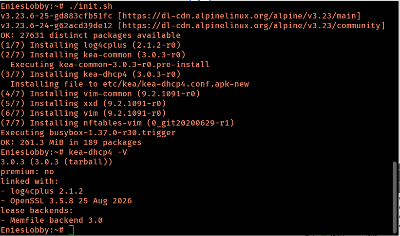

### **2.2.2 Konfigurasi DHCP Server**

Langkah-langkah yang harus dilakukan setelah instalasi adalah sebagai berikut.

#### A. Menentukan _Interface_ yang akan Diberi Layanan DHCP

##### A.1. Buka _File_ Konfigurasi _Interface_

Silakan edit _file_ konfigurasi di `/etc/kea/kea-dhcp4.conf`

```sh
nano /etc/kea/kea-dhcp4.conf
```

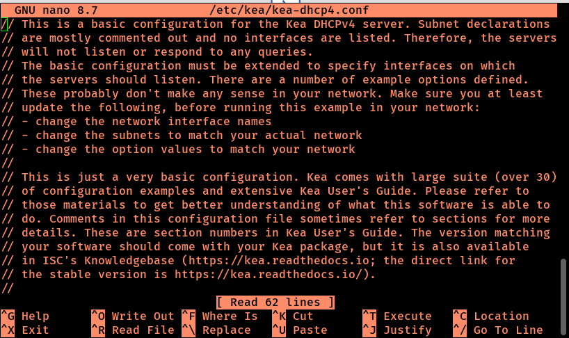

##### A.2. Tentukan _Interface_


Perhatikan topologi yang sudah dibuat. Interface pada **EniesLobby** yang mengarah ke switch adalah `eth0`, sehingga kita memilih interface `eth0` untuk diberi layanan DHCP. Pada Kea, hal ini diatur pada bagian `interfaces-config`:
 
```json
"interfaces-config": {
  "interfaces": ["eth0"]
}
```

#### B. Melakukan Konfigurasi pada `kea-dhcp4`

Ada banyak hal yang dapat dikonfigurasi, antara lain sebagai berikut.

- Range IP
- DNS Server
- Informasi Netmask
- Default Gateway
- dll.

##### B.1. Buka _File_ Konfigurasi DHCP

Konfigurasi dilakukan pada file yang sama, yaitu `/etc/kea/kea-dhcp4.conf`.

##### B.2. Tambahkan _Script_ Konfigurasi

Parameter pada `isc-dhcp-server` dipetakan ke Kea sebagai berikut:
 
| **No** | **ISC dhcpd** | **Kea (`kea-dhcp4.conf`)** | **Keterangan** |
| ------ | ------------- | -------------------------- | -------------- |
| 1 | `INTERFACES=` | `"interfaces-config": { "interfaces": ["eth0"] }` | Interface yang menerima permintaan DHCP. |
| 2 | `subnet 'NID' netmask 'Netmask'` | `"subnet": "NID/prefix"` | Network ID subnet dalam notasi CIDR, misalnya `10.40.1.0/24`. Kea memilih subnet berdasarkan alamat relay (atau interface) tempat permintaan datang. |
| 3 | `range 'Start_IP' 'End_IP'` | `"pools": [{ "pool": "Start_IP - End_IP" }]` | Rentang IP yang dibagikan secara dinamis. Boleh lebih dari satu pool. |
| 4 | `option routers 'IP_Gateway'` | `{ "name": "routers", "data": "IP_Gateway" }` | IP gateway yang diberikan ke client. |
| 5 | `option domain-name-servers 'DNS'` | `{ "name": "domain-name-servers", "data": "DNS" }` | DNS yang diberikan ke client. |
| 6 | `option broadcast-address` | (otomatis) | Kea menghitung alamat broadcast sendiri. |
| 7 | `default-lease-time 'Waktu'` | `"valid-lifetime": Waktu` | Lama peminjaman IP dalam detik. |
| 8 | `max-lease-time 'Waktu'` | `"max-valid-lifetime": Waktu` | Lama peminjaman maksimum dalam detik. |
| 9 | `host X { hardware ethernet ...; fixed-address ...; }` | `"reservations": [{ "hw-address": "...", "ip-address": "..." }]` | Fixed address untuk host tertentu (lihat 2.2.6). |
 
**Tentang NID:** NID adalah Network ID dari interface yang menghadap client, dengan bagian host bernilai 0. Contohnya, jika interface router untuk sebuah subnet memiliki IP `10.40.1.1/24`, maka subnet-nya adalah `10.40.1.0/24`. **NB: Cara menghitung NID yang benar akan dijelaskan pada modul 4.**
 
Pada contoh ini kita menggunakan `8.8.8.8` sebagai DNS. Ganti seluruh isi `/etc/kea/kea-dhcp4.conf` pada **EniesLobby** dengan konfigurasi berikut. Konfigurasi ini melayani dua subnet: `10.40.2.0/24` secara langsung (Water7 satu segmen dengan server), dan `10.40.1.0/24` melalui relay di Foosha.

```json
{
  "Dhcp4": {
    "interfaces-config": {
      "interfaces": ["eth0"]
    },
    "lease-database": {
      "type": "memfile",
      "persist": true,
      "name": "/var/lib/kea/kea-leases4.csv"
    },
    "valid-lifetime": 600,
    "max-valid-lifetime": 7200,
    "subnet4": [
      {
        "id": 1,
        "subnet": "10.40.1.0/24",
        "pools": [
          { "pool": "10.40.1.10 - 10.40.1.100" }
        ],
        "option-data": [
          { "name": "routers", "data": "10.40.1.1" },
          { "name": "domain-name-servers", "data": "192.168.122.1" }
        ]
      },
      {
        "id": 2,
        "subnet": "10.40.2.0/24",
        "pools": [
          { "pool": "10.40.2.20 - 10.40.2.100" }
        ],
        "option-data": [
          { "name": "routers", "data": "10.40.2.1" },
          { "name": "domain-name-servers", "data": "192.168.122.1" }
        ]
      }
    ]
  }
}
```

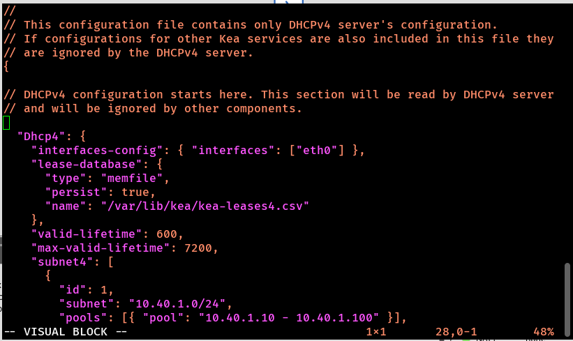

<!-- ```conf -->
<!-- subnet 'NID' netmask 'Netmask' { -->
<!--     range 'IP_Awal' 'IP_Akhir'; -->
<!--     option routers 'iP_Gateway'; -->
<!--     option broadcast-address 'IP_Broadcast'; -->
<!--     option domain-name-servers 'DNS_yang_diinginkan'; -->
<!--     default-lease-time 'Waktu'; -->
<!--     max-lease-time 'Waktu'; -->
<!-- } -->
<!-- ``` -->
<!---->
<!-- _Script_ tersebut mengatur parameter jaringan yang dapat didistribusikan oleh DHCP, seperti informasi `netmask`, `default gateway`, dan `DNS Server`. Berikut ini beberapa parameter jaringan dasar yang biasanya digunakan. -->
<!---->
<!-- | **No** | **Parameter Jaringan**                             | **Keterangan**                                                                                                                                                                                                                                                                                                                                                                                                                                                                      | -->
<!-- | ------ | -------------------------------------------------- | ----------------------------------------------------------------------------------------------------------------------------------------------------------------------------------------------------------------------------------------------------------------------------------------------------------------------------------------------------------------------------------------------------------------------------------------------------------------------------------- | -->
<!-- | 1      | `subnet 'NID'`                                     | Network ID pada subnet interface. Sederhananya pada kasus pembelajaran praktikum kita, nilai NID merupakan 3 bytes dari IP interface tujuan (sesuai dengan langkah [A2](#a2-tentukan-interface)) **pada router** (dalam kasus ini adalah Foosha) dengan byte terakhirnya adalah 0. Sebagai contoh saja, jika interface yang kamu pilih adalah `eth0` dengan IP 10.40.0.1, maka NID subnetnya adalah 10.40.0.0. **NB: Cara menentukan NID yang proper akan dijelaskan pada modul 4** | -->
<!-- | 2      | `netmask 'Netmask`                                 | Netmask pada subnet. Dapat dilihat pada konfigurasi network router dengan cara: Ke topologi (GNS3) → klik kanan router → Configure → Edit Network Configuration → Lihat nilai netmask pada interface yang diinginkan                                                                                                                                                                                                                                                                | -->
<!-- | 3      | `range 'IP_Awal' 'IP_Akhir'`                       | Rentang `IP Address` yang akan didistribusikan dan digunakan secara dinamis                                                                                                                                                                                                                                                                                                                                                                                                         | -->
<!-- | 4      | `option routers 'Gateway'`                         | IP gateway dari router menuju client sesuai konfigurasi subnet                                                                                                                                                                                                                                                                                                                                                                                                                      | -->
<!-- | 5      | `option broadcast-address 'IP_Broadcast'`          | IP broadcast pada subnet                                                                                                                                                                                                                                                                                                                                                                                                                                                            | -->
<!-- | 6      | `option domain-name-servers 'DNS_yang_diinginkan'` | DNS yang ingin kita berikan pada client                                                                                                                                                                                                                                                                                                                                                                                                                                             | -->
<!-- | 7      | Lease time                                         | Waktu yang dialokasikan ketika sebuah IP dipinjamkan kepada komputer client. Setelah waktu pinjam ini selesai, maka IP tersebut dapat dipinjam lagi oleh komputer yang sama atau komputer tersebut mendapatkan `IP Address` lain jika `IP Address` yang sebelumnya dipinjam, dipergunakan oleh komputer lain                                                                                                                                                                        | -->
<!-- | 8      | `default-lease-time 'Waktu'`                       | Lama waktu DHCP server meminjamkan `IP Address` kepada client, dalam satuan detik. Default 600 detik                                                                                                                                                                                                                                                                                                                                                                                | -->
<!-- | 9      | `max-lease-time 'Waktu'`                           | Waktu maksimal yang di alokasikan untuk peminjaman IP oleh DHCP server ke client dalam satuan detik. Default 7200 detik                                                                                                                                                                                                                                                                                                                                                             | -->
<!---->
<!-- Pada contoh berikut, kita akan menggunakan DNS 192.168.122.1. Maka konfigurasinya menjadi sebagai berikut: -->


##### A.3. Jalankan Service `kea-dhcp4` Dengan Perintah

Periksa dahulu apakah file konfigurasi tidak memiliki kesalahan:
 
```sh
kea-dhcp4 -t /etc/kea/kea-dhcp4.conf
```

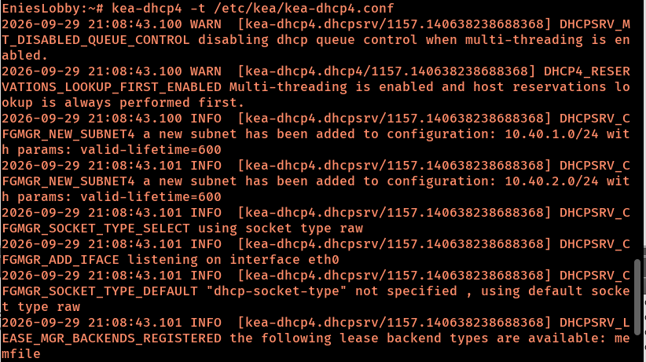
 
Keluaran yang benar menampilkan kedua subnet dan tidak memiliki baris `ERROR`. Baris `WARN` tentang multi-threading adalah hal yang normal. Seperti gambar diatas
 
Buat direktori yang dibutuhkan Kea, lalu jalankan. Untuk percobaan pertama, jalankan di *foreground* dengan mode debug agar kita dapat melihat setiap DISCOVER, OFFER, REQUEST, dan ACK:
 
```sh
mkdir -p /var/lib/kea /run/kea
kea-dhcp4 -d -c /etc/kea/kea-dhcp4.conf
```

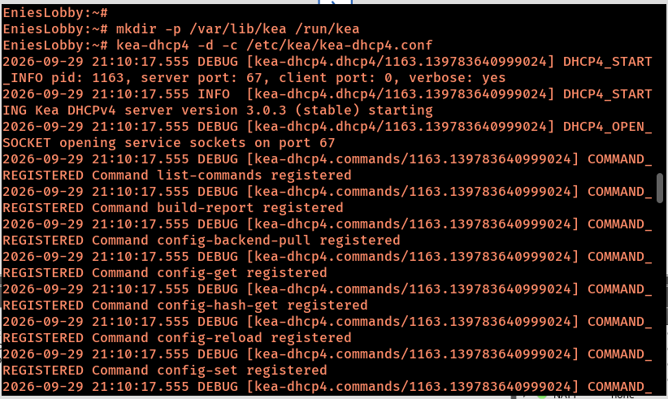
 
Tekan `Ctrl+C` untuk menghentikannya. Untuk menjalankannya di *background*:
 
```sh
kill $(pidof kea-dhcp4) 2>/dev/null
kea-dhcp4 -c /etc/kea/kea-dhcp4.conf > /root/kea.log 2>&1 &
```


### **2.2.3 Konfigurasi DHCP Relay**

Ketika DHCP Server berada pada subnet yang berbeda dengan DHCP client, maka kita akan membutuhkan `DHCP Relay`. Maka dari itu, langkah-langkah berikut harus dilakukan pada perangkat yang dijadikan sebagai `DHCP Relay` (umumnya pada _router_). Oleh karena itu, _router_ **Foosha** akan menjadi DHCP Relay. Langkah-langkah yang harus dilakukan adalah sebagai berikut.
Pada kasus ini, kita menggunakan router **Foosha** sebagai DHCP Relay. Ikuti langkah berikut:
 
#### A. Melakukan Instalasi
 
Pertama, kita perlu meng-install program relay pada **Foosha**.
 
```sh
apk update
apk add dhcp-helper
```
 
#### B. Melakukan Konfigurasi pada `dhcp-helper`
 
`dhcp-helper` dikonfigurasi lewat opsi command line. Jalankan pada **Foosha**:
 
```sh
dhcp-helper -n -s 10.40.2.2 -i eth1
```

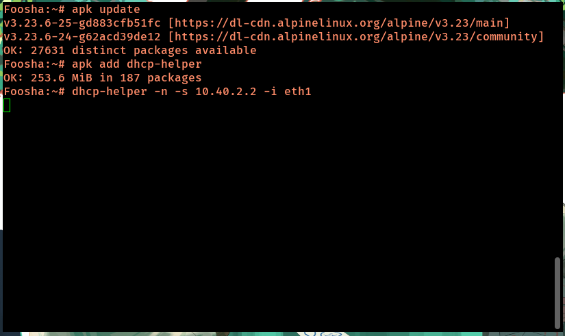

- `-s 10.40.2.2` adalah alamat IP DHCP Server. Pada kasus ini, yaitu alamat IP **EniesLobby**. Berapa alamat IP-nya?
- `-i eth1` adalah interface yang mendengarkan permintaan client. Nilainya harus sesuai dengan interface yang terhubung ke client. Pada kasus ini, **Foosha** memiliki interface `eth1` yang terhubung ke client Loguetown dan Alabasta. Jika ada lebih dari satu interface yang terhubung ke client, ulangi opsinya: `-i eth1 -i eth3`.
- `-n` membuat relay berjalan di *foreground* agar kita dapat melihat pesan error. Hapus opsi ini untuk menjalankannya sebagai daemon di *background*.
Water7 tidak perlu dilayani lewat relay karena berada satu segmen dengan DHCP Server.
 
> **Catatan:** setiap subnet client tambahan juga memerlukan blok `subnet4` yang sesuai pada konfigurasi Kea di server, yang mencakup alamat interface Foosha pada subnet tersebut.

#### C. Melakukan Konfigurasi IP Forwarding

Pastikan IP Forwarding aktif pada **Foosha**:
 
```sh
sysctl -w net.ipv4.ip_forward=1
```
 
Agar tetap aktif setelah restart, tambahkan juga baris berikut pada `/etc/sysctl.conf`:
 
```
net.ipv4.ip_forward=1
```

> Apa itu `IP Forwarding`? `IP Forwarding` adalah fitur yang memungkinkan _router_ untuk meneruskan paket dari suatu jaringan ke jaringan lainnya. _Router_ memiliki minimal dua _interface_ jaringan, misal _interface_ A terhubung ke jaringan A dan _interface_ B terhubung ke jaringan B. Ketika ada paket IP masuk dari jaringan A menuju ke jaringan B, maka _router_ akan meneruskan (_forward_) paket tersebut dari _interface_ A ke _interface_ B. Demikian pula sebaliknya.

Selamat 🎉, konfigurasi `DHCP Relay` telah selesai!

---

### **2.2.4 Konfigurasi DHCP Client**

Setelah mengonfigurasi _server_, kita juga perlu mengonfigurasi _interface_ _client_ supaya bisa mendapatkan layanan dari `DHCP Server`. Di dalam topologi ini, contoh _client_-nya adalah **Alabasta**, **Loguetown**, dan **Water7**.

#### A. Mengonfigurasi _Client_

##### A.1. Periksa IP Alabasta dengan `ip a`


Dari konfigurasi sebelumnya, **Alabasta** telah diberikan `IP Address` statis 10.40.1.3.

##### A.2 Matikan node Alabasta dan buka konfigurasi network dari GNS3 Desktop

_Comment_ atau hapus konfigurasi yang lama (konfigurasi `IP Address` statis)

Lalu tambahkan konfigurasi berikut.

```
auto eth0
iface eth0 inet dhcp
```

##### A.4. Start node Alabasta

Silahkan start lagi node Alabasta dan seharusnya saat membuka console dari Alabasta, akan terlihat secara otomatis DHCP IP Lease dari EniesLobby

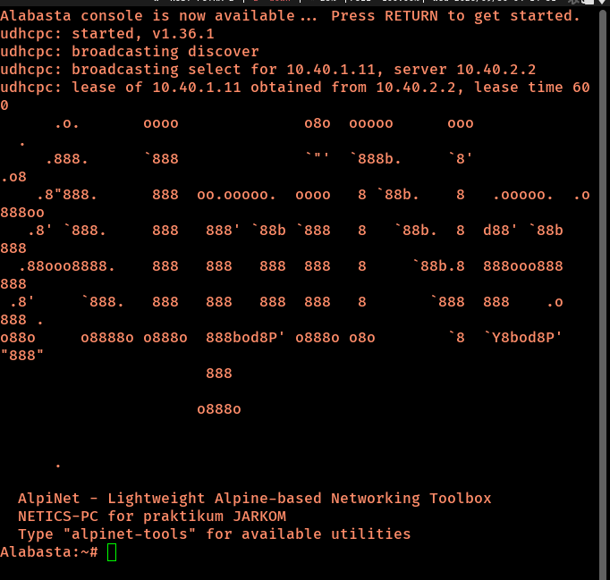

atau menggunakan command `udhcpc -i eth0`

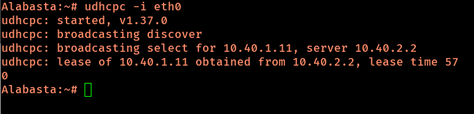

#### B. Testing

Cek kembali `IP Address` **Alabasta** dengan menjalankan `ip a`.

Periksa juga apakah **Alabasta** sudah mendapatkan `DNS Server` sesuai konfigurasi di `DHCP Server`. Periksa `/etc/resolv.conf` dengan menggunakan perintah sebagai berikut. Selain itu, kalian juga bisa melakukan pemeriksaan dengan melakukan ping kepada `google.com`

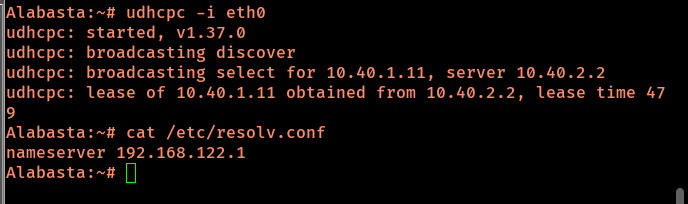

Bila `IP Address` dan nameserver **Alabasta** telah berubah sesuai dengan konfigurasi yang diberikan oleh DHCP dan berhasil melakukan ping ke `google.com`, maka selamat kalian telah berhasil! 🎉🎉

**Keterangan**:

- Jika IP **Alabasta** masih belum berubah, jangan panik. Silakan _restart_ kembali _node_ melalui halaman GNS3.
- Jika masih belum berubah juga, jangan buru-buru bertanya. Coba periksa lagi semua konfigurasi yang telah kalian lakukan, mungkin terdapat kesalahan penulisan.

#### C. Lakukan kembali langkah - langkah di atas pada client Loguetown dan Water7

- Client **Loguetown** dan **Water7**.

Setelah `IP Address` dipinjamkan ke sebuah client, maka `IP Address` tersebut tidak akan diberikan ke _client_ lain. Buktinya, tidak ada _client_ yang mendapatkan `IP Address` yang sama.

---

### **2.2.5 Leasing Times**

Pada bagian ini kita akan melihat sendiri bagaimana lease time bekerja. Kita akan memperpendek lease pada subnet `10.40.1.0/24` menjadi 2 menit.
 
#### A. Ubah lease time pada server
 
Pada **EniesLobby**, edit `/etc/kea/kea-dhcp4.conf` dan tambahkan `valid-lifetime` dan `max-valid-lifetime` pada blok subnet `10.40.1.0/24`. Pengaturan pada tingkat subnet menimpa pengaturan global:
 
```json
{
  "id": 1,
  "subnet": "10.40.1.0/24",
  "valid-lifetime": 120,
  "max-valid-lifetime": 600,
  "pools": [
    { "pool": "10.40.1.10 - 10.40.1.100" }
  ],
  "option-data": [
    { "name": "routers", "data": "10.40.1.1" },
    { "name": "domain-name-servers", "data": "192.168.122.1, 8.8.8.8, 8.8.4.4" }
  ]
}
```
 
- `valid-lifetime` adalah lease time default (dalam detik). Nilai ini dipakai jika client tidak meminta waktu tertentu.
- `max-valid-lifetime` adalah batas atas jika client meminta lease yang lebih lama.
Periksa dan restart Kea:
 
```sh
kea-dhcp4 -t /etc/kea/kea-dhcp4.conf
kill $(pidof kea-dhcp4) 2>/dev/null
kea-dhcp4 -c /etc/kea/kea-dhcp4.conf > /root/kea.log 2>&1 &
```
 
#### B. Amati pada client
 
Pada **Alabasta**, minta alamat IP dan perhatikan keluarannya:
 
```sh
udhcpc -i eth0 -f
```
 
Keluarannya menampilkan lease time yang diterima, misalnya `lease of 10.40.1.x obtained ... lease time 120`. Biarkan berjalan lebih dari satu menit. Pada separuh masa lease (sekitar 60 detik), `udhcpc` akan mengirim permintaan perpanjangan (*renew*) langsung ke server.
 
Pada **EniesLobby**, lihat catatan peminjaman:
 
```sh
cat /var/lib/kea/kea-leases4.csv
```
 
Kolom `expire` menunjukkan waktu (dalam format epoch) kapan lease habis, dan nilainya bertambah setiap kali client melakukan perpanjangan.
 
Kamu juga dapat memaksa perpanjangan atau melepas lease secara manual:
 
```sh
kill -USR1 $(pidof udhcpc)     # renew
kill -USR2 $(pidof udhcpc)     # release
```
 
Setelah selesai, kembalikan nilai lease time seperti semula (hapus dua baris di blok subnet, atau ubah ke `600` dan `7200`), lalu restart Kea.


### **2.2.6 Fixed Address**

Konfigurasi dapat dilakukan sebagai berikut.


> **Studi Kasus**:
>
> Ternyata kapal milik Franky yang diparkir di **Water7** selain menjadi _client_, juga akan digunakan sebagai _server_ suatu aplikasi jual beli kapal, sehingga akan menyulitkan jika `IP Address`nya berganti-ganti setiap **Water7** terhubung ke jaringan internet. Oleh karena itu, **Water7** membutuhkan `IP Address` yang tetap dan tidak berganti-ganti.

Masalah yang dihadapi oleh Franky adalah IP address dari Water7 yang berganti-ganti. Sehingga, requirementnya adalah `IP address` yang tetap. Oleh karena itu, solusi yang dapat ditawarkan adalah dengan fitur dari DHCP Server, yaitu layanan untuk "menyewakan" `IP Address` secara tetap pada suatu _host_, yakni **Fixed Address**. Dalam kasus ini, **Water7** akan mendapatkan `IP Address` tetap, yaitu `10.40.2.13`.

#### A. Konfigurasi `DHCP Server` di EniesLobby
 
##### A.1. Buka File Konfigurasi `kea-dhcp4`
 
Buka dan edit file `/etc/kea/kea-dhcp4.conf` pada **EniesLobby**.
 
Sebelumnya, cari tahu hardware address Water7. Jalankan `ip a` pada **Water7**, lihat interface yang terhubung ke switch (`eth0`), lalu salin nilai setelah `link/ether`.

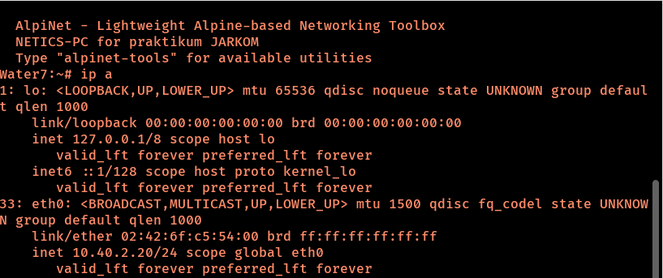
 
##### A.2. Tambahkan Script Berikut
 
Tambahkan daftar `reservations` pada subnet `10.40.2.0/24` (subnet dengan `id` 2):
 
```json
{
  "id": 2,
  "subnet": "10.40.2.0/24",
  "pools": [
    { "pool": "10.40.2.20 - 10.40.2.100" }
  ],
  "option-data": [
    { "name": "routers", "data": "10.40.2.1" },
    { "name": "domain-name-servers", "data": "192.168.122.1, 8.8.8.8, 8.8.4.4" }
  ],
  "reservations": [
    {
      "hw-address": "aa:bb:cc:dd:ee:ff",
      "ip-address": "10.40.2.13"
    }
  ]
}
```
 
Ganti `aa:bb:cc:dd:ee:ff` dengan hardware address Water7 yang sudah disalin.
 
**Penjelasan**:
 
- `hw-address` adalah MAC address interface Water7.
- `ip-address` adalah alamat IP yang selalu dipinjamkan kepada **Water7**.

##### A.3. Restart Service `kea-dhcp4` pada EniesLobby
 
```sh
kea-dhcp4 -t /etc/kea/kea-dhcp4.conf
kill $(pidof kea-dhcp4) 2>/dev/null
kea-dhcp4 -c /etc/kea/kea-dhcp4.conf > /root/kea.log 2>&1 &
```
 
#### B. Konfigurasi `DHCP Client`
 
##### B.1. Konfigurasi Network Interface Water7
 
Network interface dapat diakses pada konfigurasi network pada aplikasi GNS3 di node **Water7**.
 
##### B.2. Tambah konfigurasi berikut
 
```
auto eth0
iface eth0 inet dhcp
    hwaddress ether aa:bb:cc:dd:ee:ff
```
 
Gunakan MAC address yang sama dengan yang ada di reservation. Hardware address perlu di-*set* pada `/etc/network/interfaces` agar hwaddress tidak berubah ketika project GNS3 dimatikan atau di-export.
 
##### B.3. Restart Node Water7
 
Restart node Water7 dari halaman GNS3, atau jalankan:
 
```sh
kill -USR2 $(pidof udhcpc)
ifdown eth0; ifup eth0
```

atau

```
udhcpc -i eth0
```

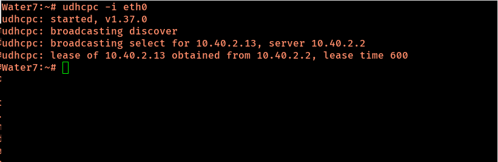
 
#### C. Testing
 
Periksa IP **Water7** dengan `ip a`.
 
```sh
ip a
```
 
IP **Water7** seharusnya sudah berubah menjadi **10.40.2.13**, sesuai fixed address yang diberikan oleh DHCP Server.

<!-- #### A. Konfigurasi `DHCP Server` di **EniesLobby** -->
<!---->
<!-- ##### A.1. Buka File Konfigurasi `isc-dhcp-server` -->
<!---->
<!-- Buka dan edit file `/etc/dhcp/dhcpd.conf`. -->
<!---->
<!-- ##### A.2. Tambahkan _Script_ Berikut -->
<!---->
<!-- ``` -->
<!-- host Water7 { -->
<!--     hardware ethernet 'hwaddress_milik_Water7'; -->
<!--     fixed-address 10.40.2.13; -->
<!-- } -->
<!-- ``` -->
<!---->
<!-- 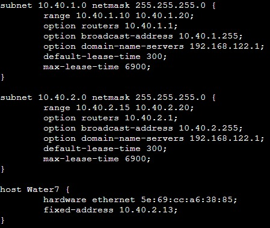 -->
<!---->
<!-- **Penjelasan**: -->
<!---->
<!-- - Untuk mencari `hwaddress_milik_Water7` (_hardware_ _address_ milik Water7), kamu bisa mengeksekusi perintah `ip a` di Water7, kemudian lihat _interface_ yang berhubungan dengan `DHCP Relay`, dalam kasus ini adalah `eth0`, dan lihat pada bagian `link/ether`. Silakan _copy_ _address_ tersebut dan masukkan pada konfigurasi `isc-dhcp-server` di **EniesLobby**. -->
<!---->
<!-- 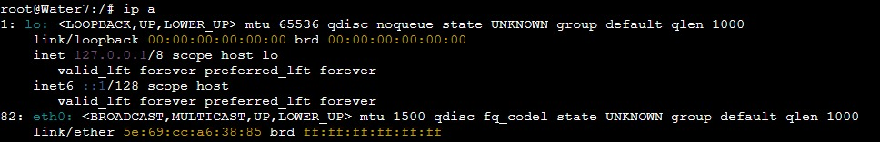 -->
<!---->
<!-- - **fixed-address** adalah `IP Address` yang "disewa" tetap oleh **Water7** -->
<!---->
<!-- ##### A.3. _Restart_ _Service_ `isc-dhcp-server` pada **EniesLobby** -->
<!---->
<!-- #### B. Konfigurasi `DHCP Client` -->
<!---->
<!-- ##### B.1. Konfigurasi _Network Interface_ **Water7** -->
<!---->
<!-- _Network interface_ dapat diakses pada `/etc/network/interfaces`. -->
<!---->
<!-- ##### B.2. Tambah konfigurasi berikut -->
<!---->
<!-- ``` -->
<!-- hwaddress ether 'hwaddress_milik_Water7' -->
<!-- ``` -->
<!---->
<!-- 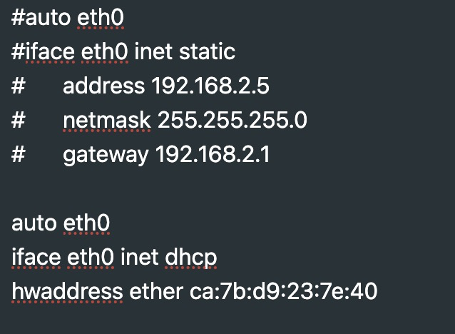 -->
<!---->
<!-- **Keterangan**: -->
<!-- _Hardware addresss_ perlu di-_setting_ juga di `/etc/network/interfaces` untuk mencegah bergantinya `hwaddress` saat _project_ GNS3 dimatikan atau di-_export_. -->
<!---->
<!-- #### B.3. _Restart Node_ Water7 -->
<!---->
<!-- Silakan _restart_ _node_ Water7 di halaman GNS3. -->
<!---->
<!-- #### C. _Testing_ -->
<!---->
<!-- Periksa IP **Water7** dengan melakukan `ip a`. -->
<!---->
<!-- 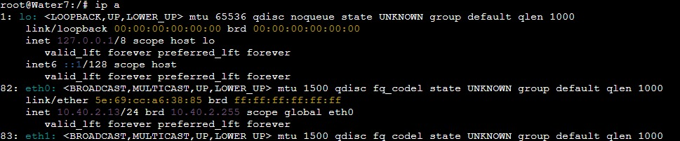 -->
<!---->
<!-- `IP Address` **Water7** telah berubah menjadi `10.40.2.13` sesuai dengan _Fixed_ _Address_ yang diberikan oleh `DHCP Server`. 👋👋👋 -->
<!---->
---


### **2.2.7 Menguji Konfigurasi DHCP pada Topologi**
 
Setelah melakukan banyak konfigurasi di atas, kamu dapat memastikan apakah DHCP Server berhasil dengan beberapa langkah berikut:
 
1. Matikan semua node melalui halaman GNS3
2. Nyalakan kembali semua node
3. Jalankan `ip a` pada setiap node
Jika semua IP node client berubah sesuai rentang yang dikonfigurasi pada DHCP Server (Loguetown dan Alabasta dari `10.40.1.10 - 10.40.1.100`) dan **Water7** tetap mendapat IP `10.40.2.13`, maka konfigurasi DHCP Server berhasil. Semua client juga seharusnya dapat melakukan `ping google.com`.
 
Untuk melihat lease yang tercatat di server, jalankan pada **EniesLobby**:
 
```sh
cat /var/lib/kea/kea-leases4.csv
```
 
### **2.2.8 Menjaga Konfigurasi Setelah Restart**
 
Pada appliance Alpine di GNS3, hanya `/etc`, `/etc/network`, dan `/root` yang bersifat persisten. Artinya file konfigurasi di atas tetap ada setelah restart, tetapi paket yang di-install dengan `apk add` akan hilang. Solusinya, simpan paket di `/root` selagi ada koneksi internet, lalu install ulang saat boot lewat script yang dipanggil dari `/root/init.sh`.
 
> Perintah di bawah mengasumsikan `/root/init.sh` dijalankan saat boot. Lihat isinya dengan `cat /root/init.sh` terlebih dahulu dan pastikan script tersebut tidak mengatur ulang konfigurasi jaringanmu. Tambahkan baris pemanggilan hanya satu kali.
 
#### A. EniesLobby (DHCP Server)
 
Buat `/root/boot.sh`:
 
```sh
cat > /root/boot.sh <<'EOF'
#!/bin/sh
exec >>/root/boot.log 2>&1
 
apk update
apk add kea-dhcp4
 
mkdir -p /var/lib/kea /run/kea
kill $(pidof kea-dhcp4) 2>/dev/null
kea-dhcp4 -t /etc/kea/kea-dhcp4.conf && \
  kea-dhcp4 -c /etc/kea/kea-dhcp4.conf >/root/kea.log 2>&1 &
EOF

chmod +x /root/boot.sh
echo 'sh /root/boot.sh &' >> /root/init.sh
```

Kamu juga bisa menaruh konfigurasi dari kea-dhcp4 di folder `/root` dan dengan memodifikasi script `init.sh` bisa melakukan copy dan paste file config nya ke direktori `/etc/kea/kea-dhcp4.conf`
 
#### B. Foosha (Router, NAT, Relay)
 
Buat `/root/boot.sh`:
 
```sh
cat > /root/boot.sh <<'EOF'
#!/bin/sh
exec >>/root/boot.log 2>&1

apk update
apk add dhcp-helper
 
sysctl -w net.ipv4.ip_forward=1
iptables -t nat -A POSTROUTING -s 10.40.0.0/16 -o eth0 -j MASQUERADE
 
kill $(pidof dhcp-helper) 2>/dev/null
dhcp-helper -s 10.40.2.2 -i eth1
EOF

chmod +x /root/boot.sh
echo 'sh /root/boot.sh &' >> /root/init.sh
```
 
#### C. Client
 
Client tidak memerlukan paket tambahan maupun script boot. `udhcpc` sudah ada di busybox, dan `/etc/network/interfaces` bersifat persisten sehingga `iface eth0 inet dhcp` diterapkan kembali setiap boot.
 
Setelah restart, baca `/root/boot.log` pada node untuk melihat apa yang dikerjakan script boot-nya.
 
### **2.2.9 Troubleshooting**
 
Jika client tidak mendapat alamat IP, cari tahu di mana permintaannya terhenti. Periksa dari sisi server terlebih dahulu.
 
1. **Uji server tanpa relay.** Pada **EniesLobby**, jalankan Kea di foreground (`kea-dhcp4 -d -c /etc/kea/kea-dhcp4.conf`), lalu jalankan `udhcpc -i eth0 -f -n` pada **Water7**. Water7 berada satu segmen dengan server, sehingga relay tidak terlibat.
   - Jika Water7 mendapat alamat IP, server berfungsi dan masalahnya ada di jalur relay.
   - Jika Kea tidak menampilkan DISCOVER, pastikan `eth0` EniesLobby benar-benar memiliki `10.40.2.2` (`ip a`) dan Water7 terhubung ke switch yang sama.
2. **Periksa relay.** Pada **Foosha**, periksa `ip a` (`eth1` harus memiliki `10.40.1.1`), `cat /proc/sys/net/ipv4/ip_forward` (harus `1`), dan `ps | grep dhcp-helper`. Jalankan relay di foreground (`-n`) untuk melihat pesan error.
3. **Amati paket.** Pada Foosha, jalankan `apk add tcpdump`, lalu jalankan perintah berikut saat client meminta alamat IP:
```sh
tcpdump -ni eth1 port 67 or port 68
tcpdump -ni eth2 port 67 or port 68
```
 
Kamu seharusnya melihat DISCOVER pada `eth1`, permintaan yang diteruskan ke `10.40.2.2` pada `eth2`, lalu OFFER kembali pada `eth2` dan kemudian pada `eth1`. Titik di mana jejaknya berhenti menunjukkan bagian mana yang bermasalah.
 
4. **Periksa kecocokan subnet.** Jika permintaan sampai ke Kea tetapi tidak dibalas, pastikan ada blok `subnet4` yang mencakup alamat Foosha pada interface yang menghadap client (`10.40.1.1` berada di dalam `10.40.1.0/24`).
5. **Periksa rute balik.** EniesLobby harus memiliki default route melalui `10.40.2.1` (`ip route`), jika tidak balasan untuk client yang melalui relay akan hilang.
6. **Jika `-i eth1` tidak membuat balasan sampai ke client**, coba jalankan relay dengan mengecualikan interface NAT: `dhcp-helper -n -s 10.40.2.2 -e eth0`. Dampaknya, permintaan Water7 di `eth2` juga ikut diteruskan ke server sehingga server bisa melihat permintaan ganda. Hal ini tidak berbahaya pada lab ini.
## Soal Latihan
 
1. Buatlah konfigurasi DHCP sehingga Loguetown dan Alabasta mendapatkan IP pada rentang `10.40.1.69 - 10.40.1.70` dan `10.40.1.200 - 10.40.1.225` dengan ketentuan sebagai berikut: setiap 2 menit, IP pada client berubah begitu juga dengan DNS-nya. Namun, client harus tetap dapat menggunakan internet setiap saat.
   *Petunjuk: satu subnet dapat memiliki lebih dari satu entri pada `pools`, dan lama lease diatur dengan `valid-lifetime` (dalam detik).*
## Referensi
 
- <https://kea.readthedocs.io/en/latest/arm/dhcp4-srv.html>
- <https://www.isc.org/kea/>
- <https://thekelleys.org.uk/dhcp-helper/>
- <https://busybox.net/downloads/BusyBox.html#udhcpc>
- <http://www.tcpipguide.com/free/t_DHCPGeneralOperationandClientFiniteStateMachine.htm>
# _Yeay, Tamat. Jempol dari NabilPolres 👍_
