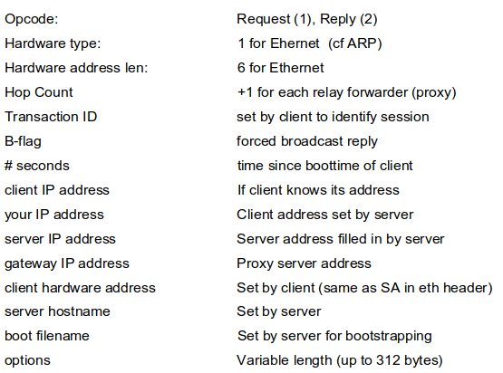
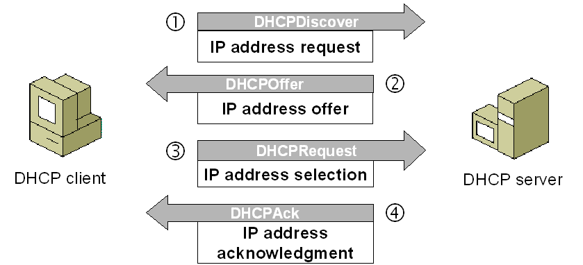
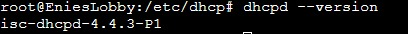
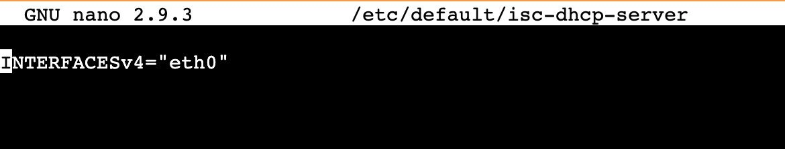
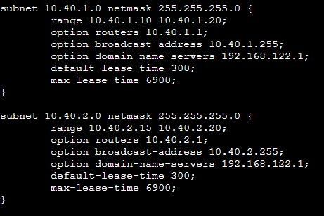
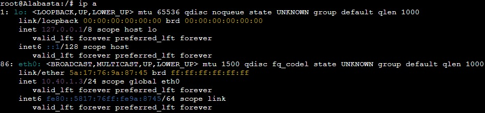
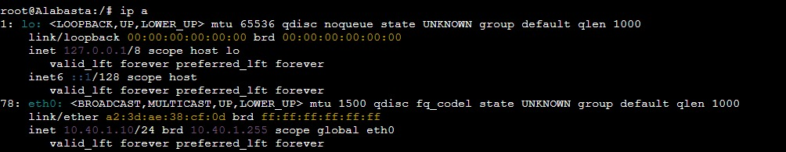
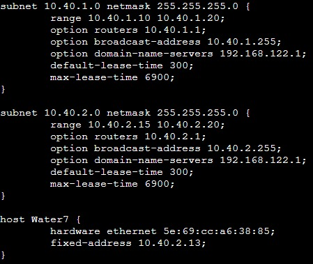
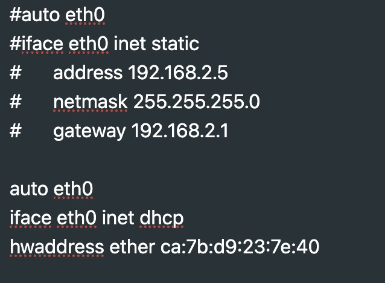
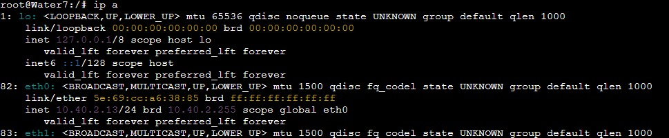

# **1. Dynamic Host Configuration Protocol (DHCP)**

## **Outline**

- [1. Dynamic Host Configuration Protocol (DHCP)](#1-dynamic-host-configuration-protocol-dhcp)
  - [Outline](#outline)
  - [1.1 Concept](#11-concept)
    - [1.1.1 Introduction](#111-introduction)
    - [1.1.2 What is DHCP?](#112-what-is-dhcp)
    - [1.1.3 Bootstrap Protocol and DHCP](#113-bootstrap-protocol-and-dhcp)
    - [1.1.4 DHCP Message Header](#114-dhcp-message-header)
    - [1.1.5 How DHCP works?](#115-how-dhcp-works)
  - [1.2 Implementation](#12-implementation)
    - [1.2.1 ISC-DHCP-Server Installation](#121-isc-dhcp-server-installation)
    - [1.2.2 DHCP Server Configuration](#122-dhcp-server-configuration)
    - [1.2.3 DHCP Client Configuration](#123-dhcp-client-configuration)
    - [1.2.4 Fixed Address](#124-fixed-address)
    - [1.2.5 Testing](#125-testing)
  - [Excercises](#excercises)
  - [References](#references)

## 1.1 Concept

### 1.1.1 Introduction

In previous modules, we already learned about how to configure IP, Nameserver, Gateway, and Subnet Mask in the node manually. All these manual methods are alright if implemented on a network that has a few hosts. What if the network has a lot of hosts connected? WiFi network is one of the example. Should the network administrator configure each host one by one? Just imagine the mess it would cause.

This is where DHCP comes in.

### 1.1.2 What is DHCP?

**Dynamic Host Configuration Protocol (DHCP)** is a _client-server_ architecture-based protocol that is used for allocating IP addresses in a network with ease. DHCP will automatically lend an IP address to the host that asks for it.


Without DHCP, the network administrator must enter an IP address to each computer in the network manually. If DHCP are installed in the network, all computers that are connected to the network will get an IP address automatically from the DHCP server.

### 1.1.3 Bootstrap Protocol and Dynamic Host Configuration Protocol

Beside DHCP, there is another protocol that also automatically assign an IP address in a network called Bootstrap Protocol (BOOTP). The differences between BOOTP and DHCP are in their configurations.

| BOOTP                                                                             | DHCP                                                                                                                                   |
| --------------------------------------------------------------------------------- | -------------------------------------------------------------------------------------------------------------------------------------- |
| Network administrator configures client's MAC Address mapping with a specific IP. | Server will borrow an IP Address and other configurations in a specific range of time. This protocol is made based on how BOOTP works. |

### 1.1.4 DHCP Message Header




### 1.1.5 How DHCP Works

DHCP works with two sides, the **Server** and the **Client**:

1. **DHCP Server** will gave a service that can give IP addresses and other parameters to all the client that asks for it.
2. **DHCP Client** is a client machine that runs a software that enables communications with the DHCP server.
   DHCP Server usually has a pool of IP adresses that is distributed, called the DHCP Pool. Every client will lend one in a specific range of time that is set from the DHCP itself (in a configuration). If the time is up, then the client will ask for a new IP address or renew the current one. That is the reason why the client's IP will be dynamic.



It would take 5 steps in an IP address lending process on DHCP:

1. **DHCPDISCOVER**: Client will broadcast a request to search for an active DHCP server. DHCP Server uses UDP port number 67 to receive the broadcast from client that are coming from port number 68.
2. **DHCPOFFER**: DHCP Server offers an IP Address (and other configurations if exist) to the client. The IP address that is offered to the client is taken from the DHCP Pool on the DHCP server.
3. **DHCPREQUEST**: Client receives an offer and accepted the IP Address lent from the DHCP Server.
4. **DHCPACK**: DHCP server accepted the IP address request with a package sent to the client called ACKnowledgement, consists of IP address confirmation and other informations. Client will then initialize and binds the lent IP Address and the client can now works on that network. DHCP Server will note the lend that happened.
5. **DHCPRELEASE**: Client stop the IP address lending (if the time is up or upon receiving DHCPNAK).


More info: [https://www.nada.kth.se/kurser/kth/2D1392/05/lectures/lecture_9.pdf](https://www.nada.kth.se/kurser/kth/2D1392/05/lectures/lecture_9.pdf)
Video: [https://youtu.be/S43CFcpOZSI](https://youtu.be/S43CFcpOZSI)

## 1.2 Implementation

After understanding the concepts, we are going to implement it using the following topology:


For this case, we will set the IP Addresses on each node as follows:

```
eth1 Foosha: 10.40.1.1
Loguetown: 10.40.1.2
Alabasta: 10.40.1.3

eth2 Foosha: 10.40.2.1
EniesLobby: 10.40.2.2
Water7: 10.40.2.3
```

### 1.2.1 ISC-DHCP-Server Installation

In the current topology, we will use **EniesLobby** as a DHCP Server. We then should _install_ **isc-dhcp-server** at **EniesLobby** with the following commands:

1. Update _package lists_ at node **EniesLobby** with

```
apt-get update
```

2. Install **isc-dhcp-server** at node **EniesLobby**

```
apt-get install isc-dhcp-server
```

3. Make sure **isc-dhcp-server** already installed correctly with

```
dhcpd --version
```



### 1.2.2 DHCP Server Configuration

Steps that are required to do after installation are:

#### A. Decides which interface that will be given the DHCP service

##### A.1. Open the interface configuration file

Edit the isc-dhcp-server configuration file at `/etc/default/isc-dhcp-server`

##### A.2. Choosing the Interface

Pay attention to the topology you made. Here's an example. The interface that are going to the switch from **EniesLobby** is `eth0`, so we will choose the `eth0` interface to be given the DHCP service.



#### B. isc-dhcp-server Configurations

There are several things that can be configured such as:

- IP Range
- DNS Server
- Netmask Information
- Default Gateway
- etc.

##### B.1. Open the DHCP configuration file with

Edit the isc-dhcp-server configuration file at `/etc/dhcp/dhcpd.conf`

##### B.2. Add below script

```conf
subnet 'NID' netmask 'Netmask' {
    range 'Start_IP' 'End_IP';
    option routers 'IP_Gateway';
    option broadcast-address 'Broadcast_IP';
    option domain-name-servers 'Wanted_DNS';
    default-lease-time 'Time';
    max-lease-time 'Time';
}
```

The script will configure several network parameters that can be distributed by the DHCP such as netmask information, default gateaway, and DNS server. Here are the basic parameters that is usually used:

| **No** | **Network Parameter**                     | **Info**                                                                                                                                                                                                                                                                                                                                                                                                               |
| ------ | ----------------------------------------- | ---------------------------------------------------------------------------------------------------------------------------------------------------------------------------------------------------------------------------------------------------------------------------------------------------------------------------------------------------------------------------------------------------------------------- |
| 1      | `subnet 'NID'`                            | Network ID on the subnet interface. Simply put, NID is the first 3 bytes from the destination's IP Interface (steps from [A2](#a2-choosing-the-interface)) **on the router** (Foosha in our case) with the last byte of 0. For example, if the interface that you chose is `eth0` with the IP 10.40.0.1, the NID of the subnet will be 10.40.0.0. **NB: The proper way to know the NID will be explained in module 4** |
| 2      | `netmask 'Netmask`                        | Netmask on the subnet. Can be seen on the router network configuration as follow: To the topology (GNS3) → right-click router → Configure → Edit Network Configuration → See the netmask value in the interface needed                                                                                                                                                                                                 |
| 3      | `range 'Start_IP' 'End_IP'`               | The range of IP that will be distributed and used dynamically                                                                                                                                                                                                                                                                                                                                                          |
| 4      | `option routers 'IP_Gateway'`             | IP gateway from the router to the client following the subnet configurations                                                                                                                                                                                                                                                                                                                                           |
| 5      | `option broadcast-address 'Broadcast_IP'` | Broadcast IP on the subnet                                                                                                                                                                                                                                                                                                                                                                                             |
| 6      | `option domain-name-servers 'Wanted_DNS'` | DNS that will be given to the client                                                                                                                                                                                                                                                                                                                                                                                   |
| 7      | Lease time                                | Time that will be allocated when an IP address will be lent to a client's computer. After the lending time finished, then that IP can be lent to the same computer or that computer will get another IP address if the previous IP address has been lent to another computer                                                                                                                                           |
| 8      | `default-lease-time 'Time'`               | Total time of the IP lending from the DHCP server to the client in second(s). Default 600 seconds                                                                                                                                                                                                                                                                                                                      |
| 9      | `max-lease-time 'Time'`                   | Maximum time that is allocated for an IP lending from DHCP server to the client in second(s). Default 7200 seconds                                                                                                                                                                                                                                                                                                     |

In this example, we will use 192.168.122.1 as our DNS. So the configuration will be:



##### A.3. Restart service `isc-dhcp-server` with

```
service isc-dhcp-server restart
```

If it shows **failed!**, the service must be stopped first (stop), then start again (start)

To make sure the isc-dhcp-server works, use below command

```
service isc-dhcp-server status
```

Congratulations! 🎉
The DHCP Server configurations is done!

---

### 1.2.3 DHCP Relay Configuration

When a DHCP server is located in a different subnet with DHCP clients, we will need a DHCP Relay. In order to set up them, we have to decide which nodes are going to be used as DHCP Relay (usually routers). In our case, we will use router **Foosha** as our DHCP Relay. Follow these steps:

#### A. Installation

First, we need to install a few things in **Foosha**.

```
apt-get update
apt-get install isc-dhcp-relay -y
service isc-dhcp-relay start
```

#### B. Set Up Configuration At `isc-dhcp-relay`

At `/etc/default/isc-dhcp-relay` perform the following configuration.

```
SERVERS="[IP Address of DHCP Server]"
INTERFACES="eth1 eth2"
OPTIONS=
```

The contents of `INTERFACES=` must match output interfaces that are connected to clients. In our case, **Foosha** has two interfaces connected to clients, those being `eth1` and `eth2`.

Lastly, `SERVERS=` is filled with the IP address of our DHCP Server. In our case, that means the IP address of **EniesLoby**. What is the IP address?

#### C. IP Forwarding Configuration

In `/etc/sysctl.conf`.

```
net.ipv4.ip_forward=1
```

The configuration above is used to enable `IP Forwarding`. Then, restart `isc-dhcp-relay` service.

> What is IP Forwarding? IP Forwarding is a feature that allows routers to forward packets from a network to another network. Routers have at least 2 interfaces, let's say interface A is connected to network A and interface B is connected to network B. Whenever there is a packet from network A enters the router with destination is network B, the router will _forward_ the packet from interface A to interface B and vice versa.

```
service isc-dhcp-relay restart
```

Congratulations 🎉, `DHCP Relay` configuration is complete!

---

### 1.2.4 DHCP Client Configuration

After configuring the server, we also need to configure the client interface to get the service from the DHCP Server. In the topology, the clients are **Alabasta**, **Loguetown**, and **Water7**.

#### A. Configuring Client

##### A.1. Check Alabasta's IP with `ip a`



From previous configuration, **Alabasta** has been given static IP of 10.40.1.3

##### A.2. Open `/etc/network/interfaces` to configure **Alabasta's** interface

Edit the file `/etc/network/interfaces`

##### A.3. Comment or delete the old configuration (Static IP configuration)

And add:

```
auto eth0
iface eth0 inet dhcp
```


**Additional Informations**:

- **eth0** is the interface that is used by the client
- `iface eth0 inet dhcp`: giving the DHCP configuration on the eth0 interface, not a static configuration

##### A.4. Restart Alabasta

To restart Alabasta, go to GNS3 → right-click on Alabasta → click Stop → right-click Alabasta → click Start.

#### B. Testing

Re-check the **Alabasta's** IP with `ip a`



Check also whether **Alabasta** already getting the DNS server provided from the DHCP Server configuration. Check `/etc/resolv.conf` with the following command. You can also check by pinging `google.com`.


If **Alabasta's** IP and nameserver already changed in sync with the given configurations from DHCP and can ping `google.com`, then congrats! 🎉🎉
You did it!

**Additional Information**:

- If **Alabasta's** IP hasn't changed, don't panic. Perform another restart on the node from the GNS3 page
- If it hasn't changed yet, do not rush to ask. Re-check all the configurations that have been done, perhaps there is a typo?

#### C. Do the above steps for Loguetown and Water7

- Client **Loguetown** and **Water7**


After IP is lent to a client, that IP cannot be given to another client. The proof is no client having the same IP.

---

### 1.2.4 Fixed Address


> **Study Case**:
>
> It turns out that Franky's ship that is parked on **Water7** other than being a client, also used to be a marketplace app for ships, so it will be a mess if the IP always changed everytime it connects to the network. Because of that, **Water7** needs a static IP that is not changed.

The problem faced by Franky is that the dynamic IP Address on Water7. The requirement is a static IP Address. The solution that can work is using a feature from the DHCP Server, a service to "rent" an IP address fixed-ly to a host, called **Fixed Address**. In this case, **Water7** will get a static IP of 10.40.1.13

#### A. DHCP Server configuration in router Foosha

##### A.1. Open isc-dhcp-server configuration file

Open and edit file `/etc/dhcp/dhcpd.conf`

##### A.2. Add below script

```
host Water7 {
    hardware ethernet 'hwaddress_of_Water7';
    fixed-address 10.40.0.13;
}
```



**Explanation**:

- To search for `Water7_hwaddress` (Water7's hardware address), you can run `ip a` on Water7, and look at the interface that is related to the router, in the case is `eth0`, and look at `link/ether`. Copy the address and include it on the isc-dhcp-server configuration EniesLobby.


- **fixed-address** is the IP address that is lent to **Water7**

##### A.3. Restart service `isc-dhcp-server` on **EniesLobby**

#### B. DHCP Client Configuration

##### B.1. **Water7** Network Interface Configuration

Network interface can be accessed at `/etc/network/interfaces`

##### B.2. Add below configuration

```
hwaddress ether 'hwaddress_milik_Water7'
```



**Keterangan**:
Hardware addresss need to be _set_ on `/etc/network/interfaces` to prevent the hwaddress change when the GNS project shut down or exported.

#### B.3. Restart node Water7

Restart the node Water7 on the GNS3 page

#### C. Testing

Check **Water7's** IP with `ip a`



**Water7's** IP has been changed to 10.40.0.13 as given from DHCP server's fixed address.

👋👋👋

---

### 1.2.5 Testing DHCP Configuration on the Topology

After doing many configurations above, you can make sure whether the DHCP Server is successful with several steps:

1. Shut down all node through the GNS3 page
2. Turn all node back on
3. Run `ip a` on every node

If all client node IP changed following the range that is configured on the DHCP Server and **Water7** still got the IP of 10.40.0.13, then your DHCP server configuration is successful.

## Excercises

1. Create a DHCP configuration so that Loguetown and Alabasta obtains IP within the range of 10.40.1.69 - 10.40.1.70 and 10.40.1.200 - 10.40.1.225 with the following requirements: Every 2 minutes, IP in clients change as well as the DNS. However, client must be able to use the internet at all times.

## References

- [https://www.isc.org/dhcp/](https://www.isc.org/dhcp/)
- [http://www.tcpipguide.com/free/t_DHCPGeneralOperationandClientFiniteStateMachine.htm](http://www.tcpipguide.com/free/t_DHCPGeneralOperationandClientFiniteStateMachine.htm)

# Foosha's Salute 🙆‍♀️🙆‍♂️


