# PENTING UNTUK DIBACA
1. Pastikan UML ARTICUNO dan MEWTWO Memory yang sebelumnya 96 diganti menjadi 256 pada file topologi.sh.
2. Jalankan **iptables** agar client PSYDUCK dan SNORLAX bisa terhubung ke internet
3. Sebelum mengakses internet pastikan sudah mengeksport proxy terlebih dahulu.
4. Jangan melakukan apapun sebelum asisten memberikan perintah.
5. Ikuti apa yang asisten arahkan.
6. Ketika poin 4 dan 5 tidak ditaati, risiko **tanggung sendiri!!!**

# 1. DNS (Domain Name System)
## 1.1 Teori
### 1.1.1 Pengertian
Domain Name System atau DNS adalah sebuah sistem yang menyimpan informasi tentang nama host ataupun nama domain di dalam jaringan komputer, misalkan: Internet. DNS Server berfungsi menerjemahkan nama domain menjadi alamat IP.
### 1.1.2 Cara Kerja

Client akan meminta alamat IP dari suatu domain ke DNS server. Jika pada DNS server data alamat IP dari DNS server tersebut ada maka akan di kembalikan alamat IP nya kembali menuju client. Jika DNS server tersebut tidak memiliki alamat IP dari domain tersebut maka dia akan bertanya kepada DNS server lain sampai alamat domain ditemukan.
### 1.1.3 Aplikasi DNS Server
Berkeley Internet Name Domain atau BIND adalah server DNS yang paling umum digunakan di Internet, khusunya pada sistem operasi bertipe Unix yang secara *de facto* merupakan standar. Untuk praktikum jarkom kita akan menggunakan aplikasi BIND sebagai DNS server.
### 1.1.4 List DNS Record
DNS Server membuat record (catatan) yang menyediakan informasi penting tentang sebuah domain atau host name, seperti IP address-nya. Beberapa jenis record yang sering digunakan adalah:

|Tipe|Deskripsi  |
|--|--|
| A | Memetakan nama domain ke alamat IP (IPv4) dari komputer hosting domain |
| AAAA | AAAA record  |
|  | mirip record A, tapi mengarahkan domain ke alamat IPV6 |
| CNAME | Alias dari satu nama ke nama lain: pencarian DNS akan dilanjutkan dengan mencoba lagi pencarian dengan nama baru |
| NS | Delegasikan zona DNS untuk meggunakan authoritative name server yang diberikan |
| PTR | Digunakan untuk Reverse DNS (Domain Name System) lookup |
| SOA | Mengacu server DNS yang menyediakan otorisasi informasi tentang sebuah domain internet |
| TXT | Mengijinkan administrator untuk memasukkan data acak ke dalam catatan DNS, catatan ini juga digunakan di spesifikasi Sender Policy Framework |

### 1.1.5 SOA (Start of Authority)
Adalah informasi yang dimiliki oleh suatu DNS zone.

| Nama | Deskripsi |
|--|--|
| Serial | Jumlah revisi dari file zona ini. Kenaikan nomor ini setiap kali file zone diubah sehingga perubahannya akan didistribusikan ke server DNS sekunder manapun |
| Refresh | Jumlah waktu dalam detik bahwa nameserver sekunder harus menunggu untuk memeriksa salinan baru dari zona DNS dari nameserver utama domain. Jika file zona telah berubah maka server DNS sekunder akan memperbarui salinan zona tersebut agar sesuai dengan zona server DNS utama |
| Retry | Jumlah waktu dalam detik bahwa nameserver utama domain (atau server) harus menunggu jika upaya refresh oleh nameserver sekunder gagal sebelum mencoba refresh zona domain dengan nameserver sekunder itu lagi |
| Expire | Jumlah waktu dalam hitungan detik bahwa nameserver sekunder (atau server) akan menahan zona sebelum tidak lagi mempunyai otoritas |
| Minimum | Jumlah waktu dalam hitungan detik bahwa catatan sumber daya domain valid. Ini juga dikenal sebagai TTL minimum, dan dapat diganti oleh TTL catatan sumber daya individu |
| TTL | (waktu untuk tinggal) - Jumlah detik nama domain di-chace secara lokal sebelum kadaluarsa dan kembali ke nameserver otoritatif untuk informasi terbaru |
## 1.2 Praktik
Topologi


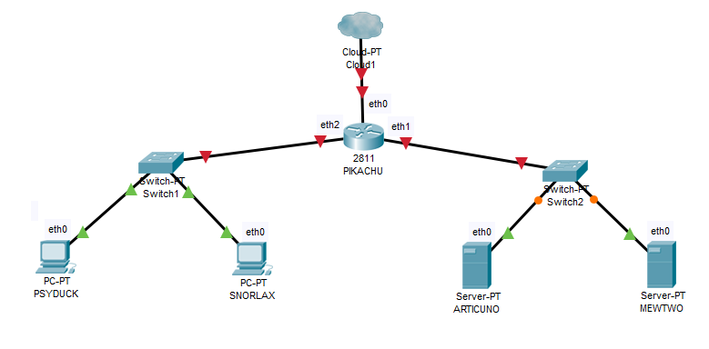


[Referensi](https://github.com/afrchmdi/Jarkom-Modul-Pengenalan-UML)
### 1.2.1 Instalasi bind

 - Buka *ARTICUNO* dan update package lists dengan menjalankan command: 
 `apt-get update`

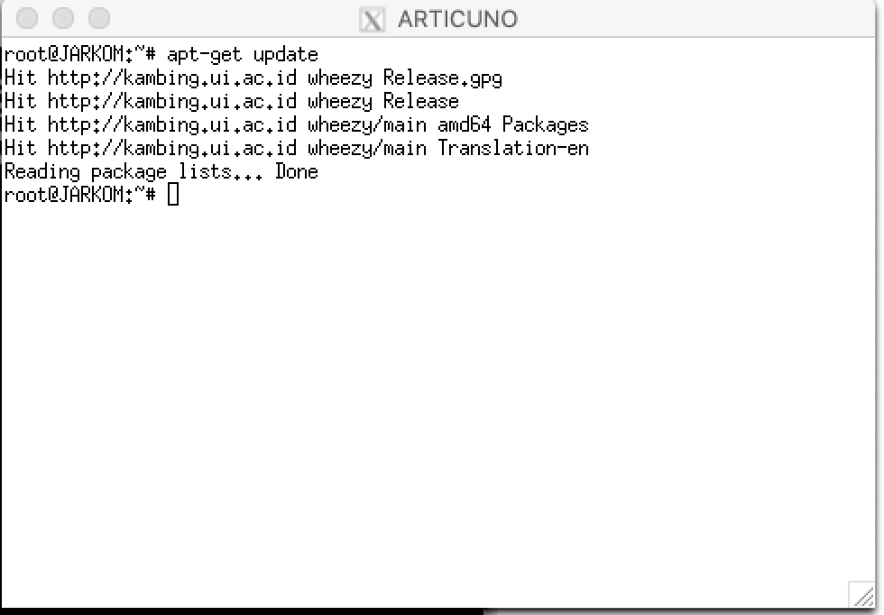

 - Setelah melakukan update silahkan install aplikasi bind9 pada *ARTICUNO* dengan perintah:
 `apt-get install bind9 -y`
 


### 1.2.2 Pembuatan Domain
Pada sesilab ini kita akan membuat domain **jarkomtc.com.**

 - Lakukan perintah pada *ARTICUNO*. Isikan seperti berikut:
`nano /etc/bind/named.conf.local`
 - Isikan konfigurasi domain **jarkomtc.com** sesuai dengan syntax berikut:
```
zone "jarkomtc.com"{
	type master;
	file "/etc/bind/jarkom/jarkomtc.com";
	};
```
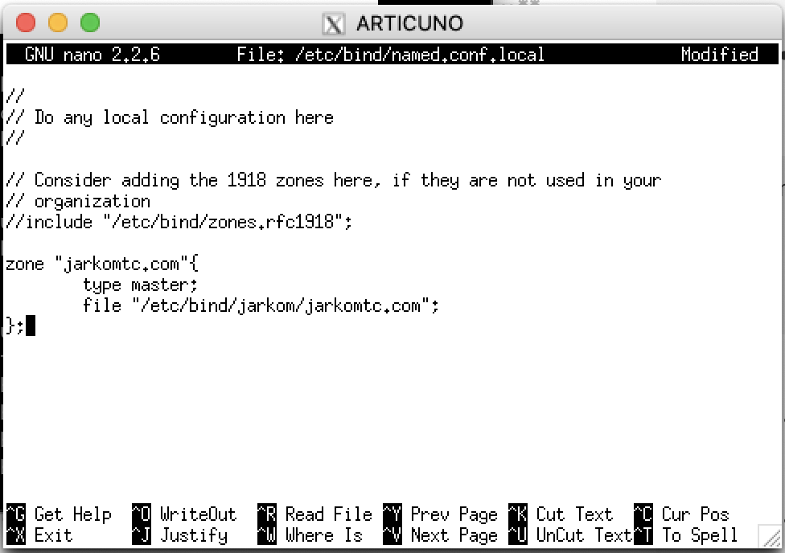

 - Buat folder **jarkom** di dalam **/etc/bind**
`mkdir /etc/bind/jarkom`

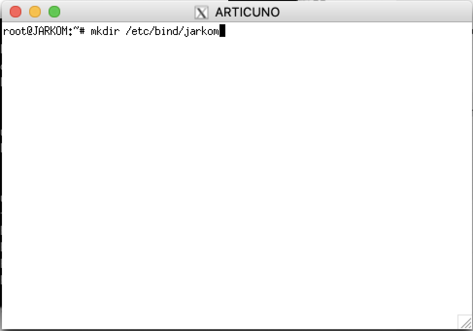

 - Copykan file **db.local** pada path **/etc/bind** ke dalam folder **jarkomtc.com** yang baru saja dibuat dan diubah namanya menjadi **jarkom**

`cp /etc/bind/db.local /etc/bind/jarkom/jarkomtc.com`

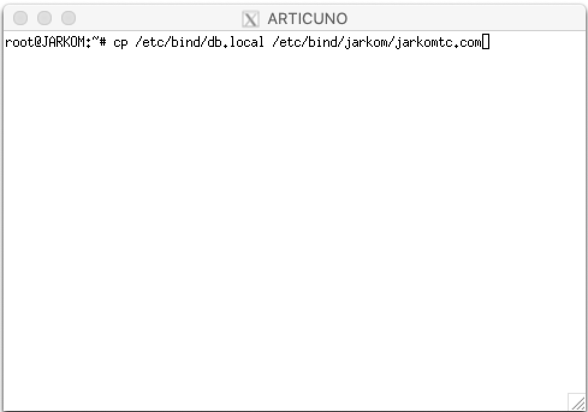

 - Kemudian buka **jarkomtc.com** dan edit seperti gambar berikut dengan IP *ARTICUNO* masing-masing kelompok:

`nano /etc/bind/jarkom/jarkomtc.com`

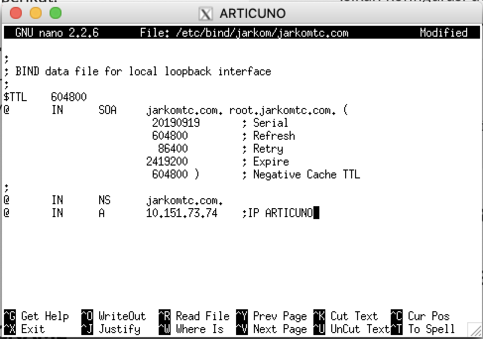

 - Restart bind9 dengan perintah
```
service bind9 restart
ATAU
named -g //Bisa digunakan untuk restart sekaligus debugging
```
### 1.2.3 Setting nameserver pada client
Domain yang kita buat tidak akan langsung dikenali oleh client oleh sebab itu kita harus merubah settingan nameserver yang ada pada client kita.
 - Pada client *PSYDUCK* dan *SNORLAX* arahkan nameserver menuju IP *ARTICUNO* dengan mengedit file *resolv.conf* dengan mengetikan perintah
`nano /etc/resolv.conf`

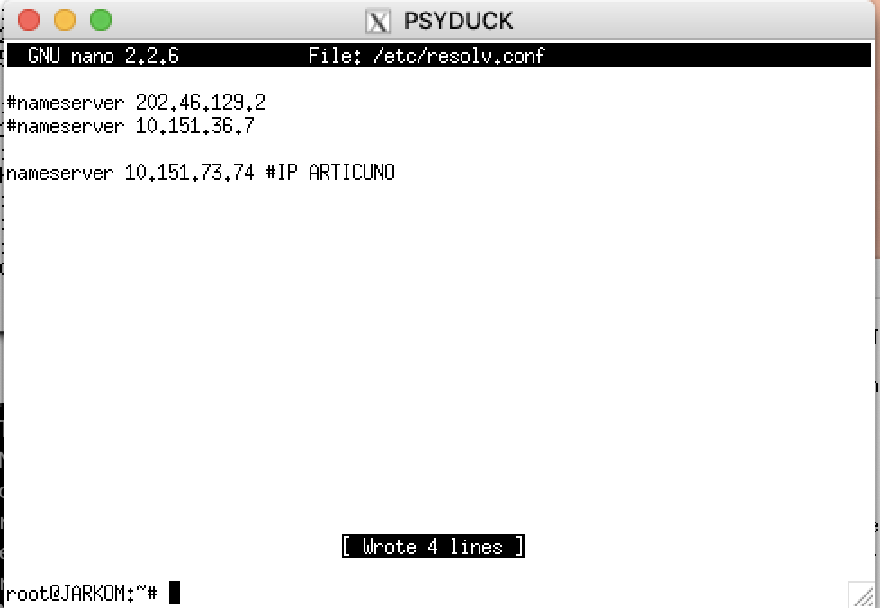

 - Untuk mencoba koneksi DNS, lakukan ping domain **jarkomtc.com** dengan melakukan perintah berikut pada client *PSYDUCK* dan *SNORLAX*

`ping jarkomtc.com`

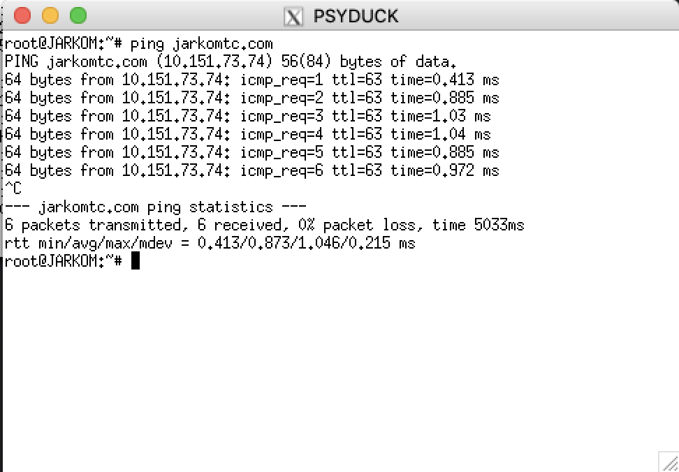

### 1.2.4 Reverse DNS (Record PTR)

Jika pada pembuatan domain sebelumnya DNS server kita bekerja menerjemahkan string domain **jarkomtc.com** kedalam alamat IP agar dapat dibuka, maka Reverse DNS atau Record PTR digunakan untuk menerjemahkan alamat IP ke alamat domain yang sudah diterjemahkan sebelumnya.

- Edit file **/etc/bind/named.conf.local** pada *ARTICUNO*

`nano /etc/bind/named.conf.local`

- Lalu tambahkan konfigurasi berikut ke dalam file **named.conf.local** 
```
zone "73.151.10.in-addr.arpa" {
    type master;
    file "/etc/bind/jarkom/73.151.10.in-addr.arpa";
};
```


- Copykan file **db.local** pada path **/etc/bind** ke dalam folder **jarkom** yang baru saja dibuat dan ubah namanya menjadi **73.151.10.in-addr.arpa**

```
cp /etc/bind/db.local /etc/bind/jarkom/73.151.10.in-addr.arpa
```
*Keterangan: 73.151.10 adalah 3 byte pertama IP ARTICUNO yang dibalik urutan penulisannya*

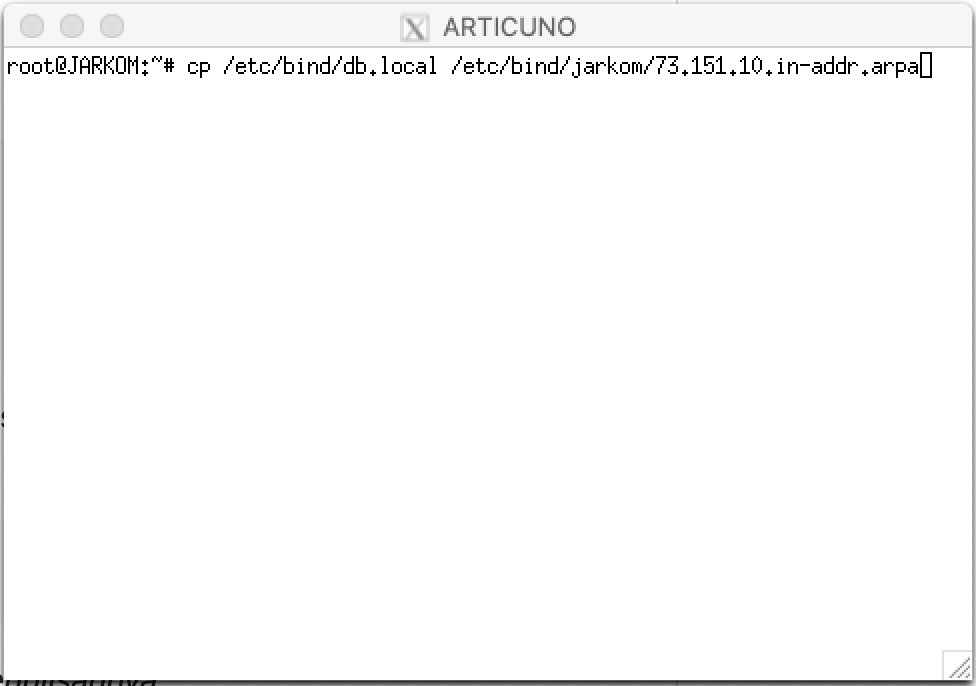

- Edit file **73.151.10.in-addr.arpa** menjadi gambar di bawah ini


- Kemudian restart bind dengan perintah 

`service bind9 restart`

- Untuk mengecek apakah konfigurasi sudah benar atau belum, lakukan perintah berikut pada client *PSYDUCK*
```
// Install package dnsutils
// Pastikan nameserver telah dikembalikan ke settingan awal
apt-get update
apt-get install dnsutils

//Kembalikan nameserver agar tersambung dengan *ARTICUNO*
host -t PTR "IP ARTICUNO"
```


### 1.2.5 Record CNAME
Record CNAME adalah sebuah record yang membuat alias name dan mengarahkan domain ke alamat/domain yang lain.

Langkah-langkah membuat record CNAME:
- Buka file **jarkomtc.com** pada server ARTICUNO dan tambahkan konfigurasi seperti pada gambar berikut:

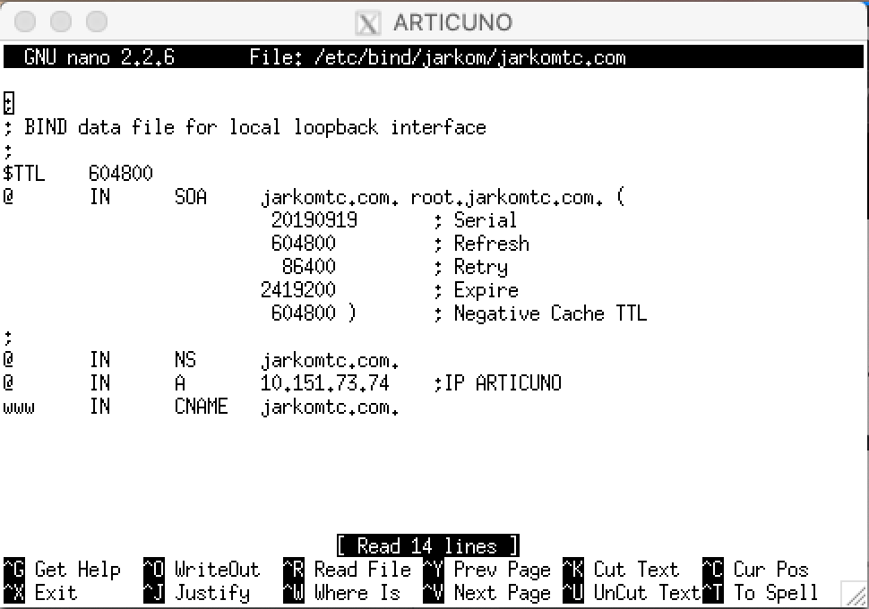

- Kemudian restart bind9 dengan perintah

`service bind9 restart`

- Lalu cek dengan melakukan **host -t CNAME** www.jarkomtc.com atau **ping** www.jarkomtc.com. Hasilnya harus mengarah ke host dengan *IP ARTICUNO*

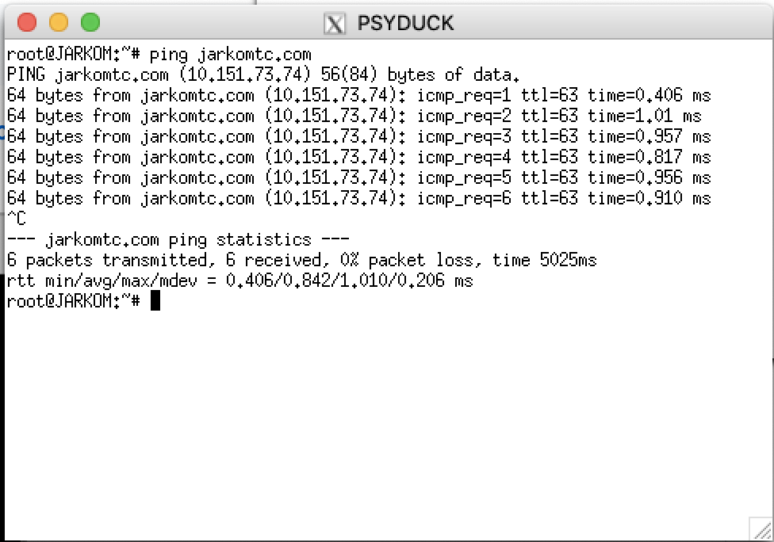

### 1.2.6 Membuat DNS Slave

DNS Slave adalah DNS cadangan yang akan diakses jika server DNS utama mengalami kegagalan. Kita akan menjadikan server *MEWTWO* sebagai DNS slave dan server *ARTICUNO* sebagai DNS masternya.

**I. Konfigurasi Pada Server ARTICUNO**
- Edit file **/etc/bind/named.conf.local** dan sesuaikan dengan syntax berikut

```
zone "jarkomtc.com" {
    type master;
    notify yes;
    also-notify { "IP MEWTWO"; }; // Masukan IP MEWTWO tanpa tanda petik
    allow-transfer { "IP MEWTWO"; }; // Masukan IP MEWTWO tanpa tanda petik
    file "/etc/bind/jarkom/jarkomtc.com";
};
```


- Lakukan restart bind9

`service bind9 restart`

**II. Konfigurasi Pada Server MEWTWO**
- Buka *MEWTWO* dan update package lists dengan menjalankan command:

`apt-get update`

- Setelah melakukan update silahkan install aplikasi bind9 pada *MEWTWO* dengan perintah:

`apt-get install bind9 -y` 

- Kemudian buka file /etc/bind/named.conf.local pada *MEWTWO* dan tambahkan syntax berikut:
```
zone "jarkomtc.com" {
    type slave;
    masters { "IP ARTICUNO"; }; // Masukan IP ARTICUNO tanpa tanda petik
    file "/var/lib/bind/jarkomtc.com";
};
```
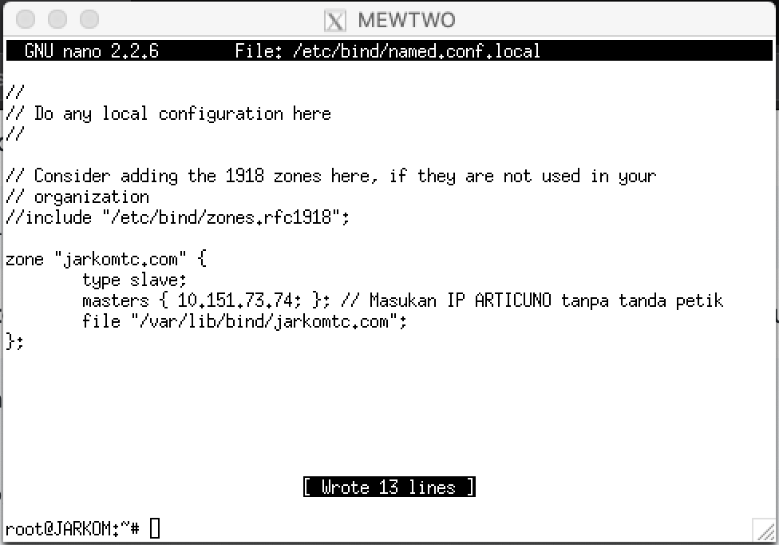

- Lakukan restart bind9

`service bind9 restart`

III. Testing
- Pada server *KATSU* silahkan matikan service bind9

`service bind9 stop`

- Pada client *PSYDUCK* pastikan pengaturan nameserver mengarah ke IP *ARTICUNO* dan IP *MEWTWO* 

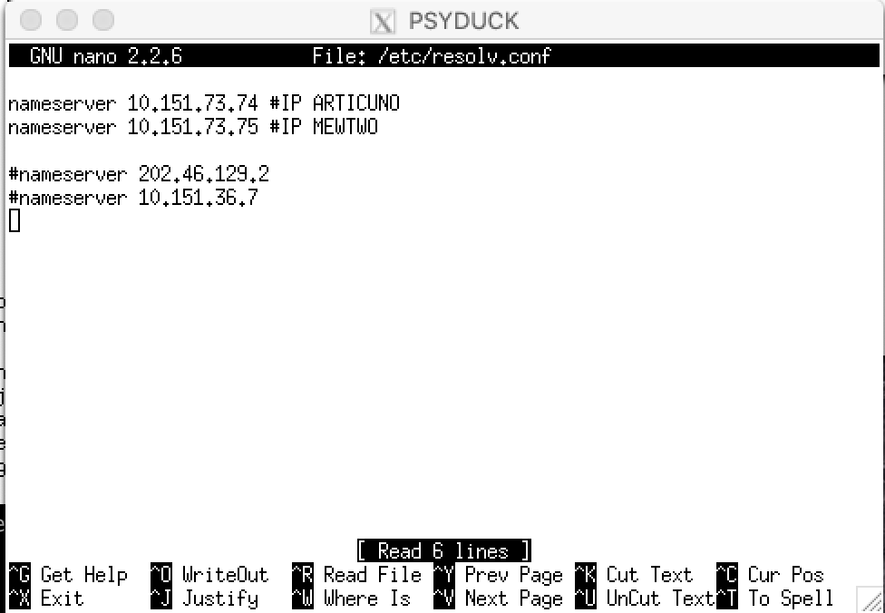

- Lakukan ping ke jarkomtc.com pada client *PSYDUCK*. Jika ping berhasil maka konfigurasi DNS slave telah berhasil


**1.2.7 Membuat Subdomain**
Subdomain adalah bagian dari sebuah nama domain induk. Subdomain umumnya mengacu ke suatu alamat fisik di sebuah situs contohnya: jarkomtc.com merupakan sebuah domain induk. Sedangkan nako.jarkomtc.com merupakan sebuah subdomain.

- Edit file /etc/bind/jarkom/jarkomtc.com lalu tambahkan subdomain untuk jarkomtc.com yang mengarah ke IP ARTICUNO.

`nano /etc/bind/jarkom/jarkomtc.com`

- Tambahkan konfigurasi seperti pada gambar ke dalam file **jarkomtc.com**

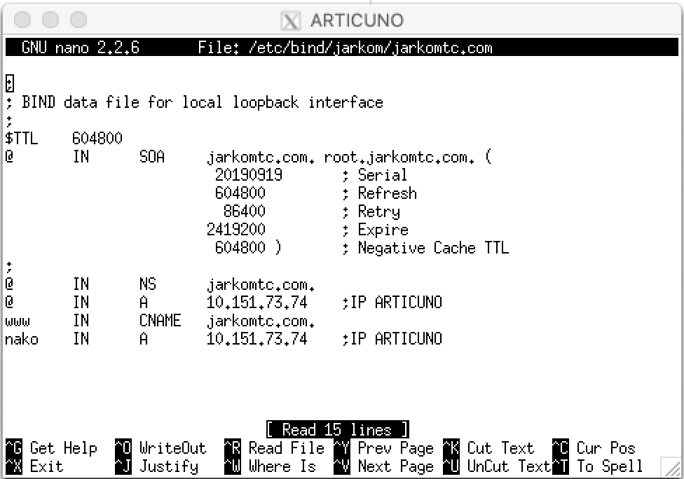

- Tambahkan konfigurasi seperti pada gambar ke dalam file **jarkomtc.com**

- Restart service bind

`service bind9 restart`

- Coba ping ke subdomain dengan perintah berikut dari client *PSYDUCK*

```
ping nako.jarkomtc.com

ATAU

host -t A nako.jarkomtc.com
```
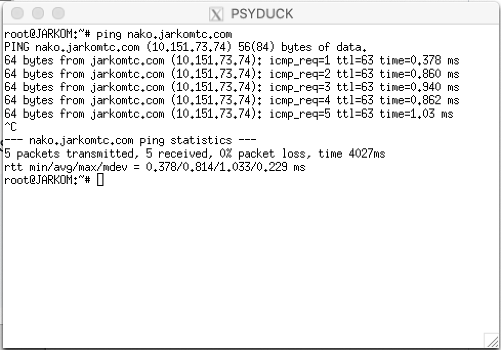
**1.2.8 Delegasi Subdomain**

Delegasi subdomain adalah pemberian wewenang atas sebuah subdomain kepada DNS baru.

**I. Konfigurasi Pada Server ARTICUNO**
- Pada *ARTICUNO*, edit file /etc/bind/jarkom/jarkomtc.com dan ubah menjadi seperti di bawah ini sesuai dengan pembagian IP *ARTICUNO* kelompok masing-masing.

`nano /etc/bind/jarkom/jarkomtc.com`

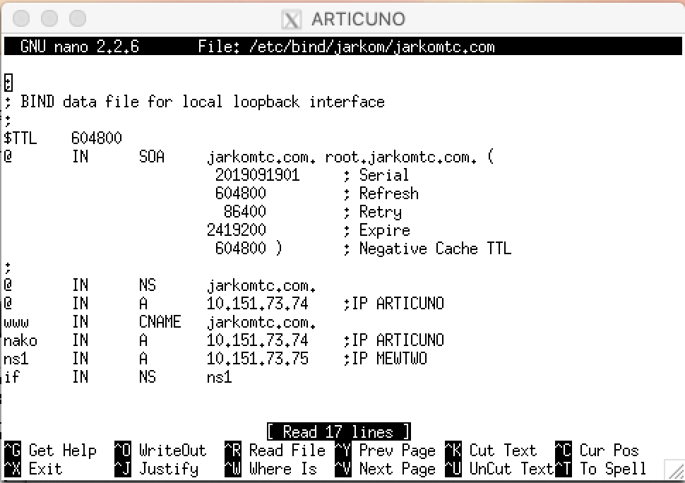

- Kemudian edit file /etc/bind/named.conf.options pada *ARTICUNO*.

`nano /etc/bind/named.conf.options`

- Kemudian comment **dnssec-validation auto;** dan tambahkan baris berikut pada **/etc/bind/named.conf.options**

`allow-query{any;};`

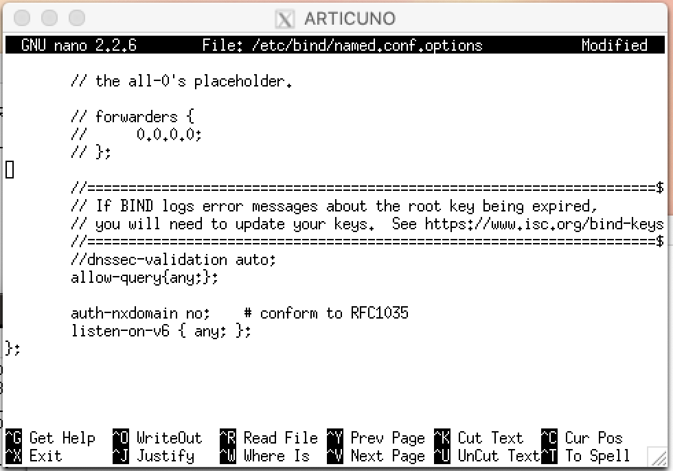

- Kemudian edit file **/etc/bind/named.conf.local** menjadi seperti gambar di bawah:

```
zone "jarkomtc.com" {
    type master;
    file "/etc/bind/jarkom/jarkomtc.com";
    allow-transfer { "IP MEWTWO"; }; // Masukan IP MEWTWO tanpa tanda petik
};
```

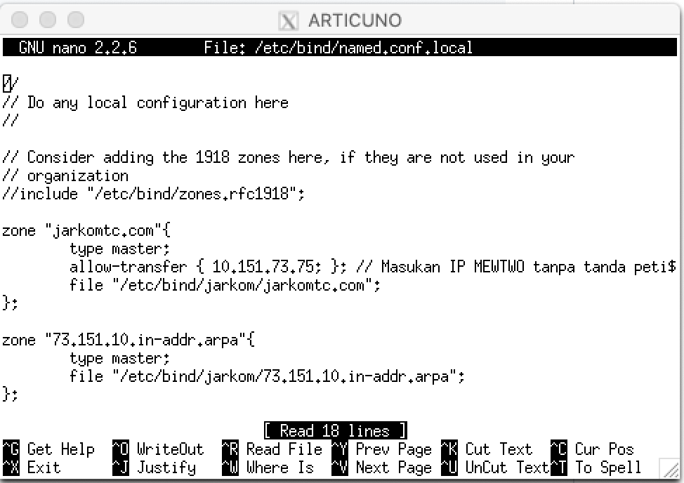

- Setelah itu restart bind9 

`service bind9 restart`

**II. Konfigurasi Pada Server MEWTWO**

- Pada *MEWTWO* edit file **/etc/bind/named.conf.options**

`nano /etc/bind/named.conf.options`

- Kemudian comment dnssec-validation auto; dan tambahkan baris berikut pada **/etc/bind/named.conf.options**

`allow-query{any;};`

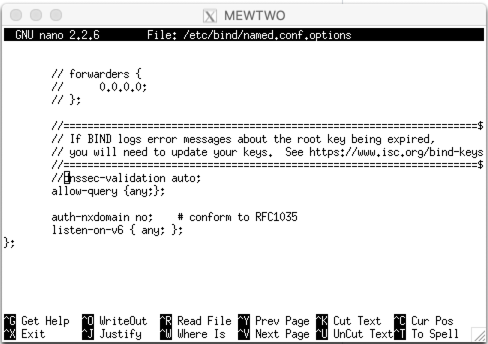

- Lalu edit file **/etc/bind/named.conf.local** menjadi seperti gambar di bawah:

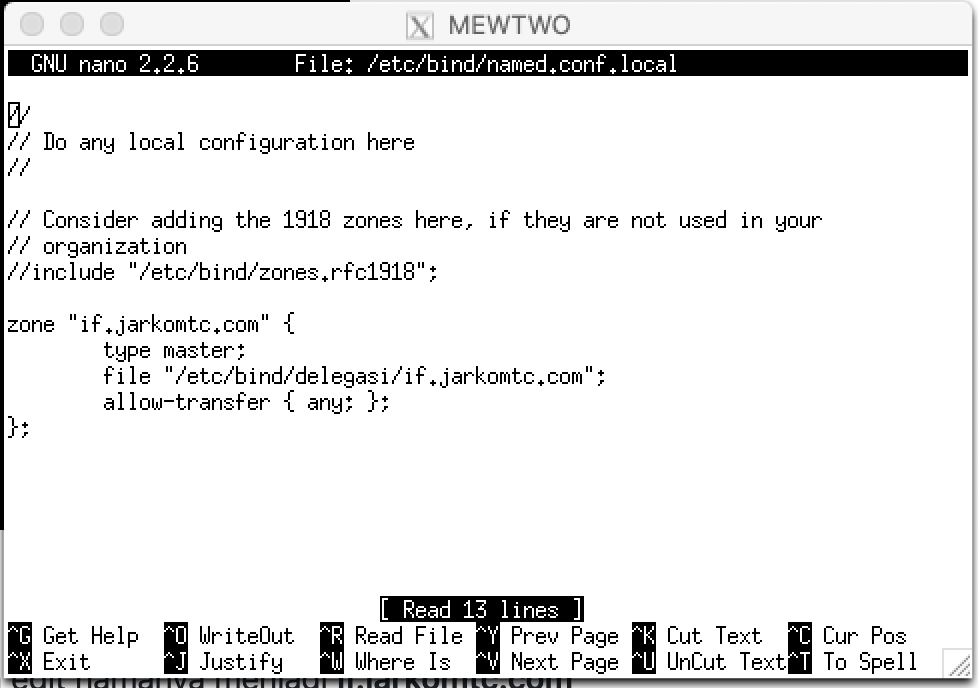

- Kemudian buat direktori dengan **delegasi**
- Copy **db.local** ke direktori pucang dan edit namanya menjadi **if.jarkomtc.com**
```
mkdir /etc/bind/delegasi
cp /etc/bind/db.local /etc/bind/delegasi/if.jarkomtc.com
```
- Kemudian edit file **if.jarkomtc.com** menjadi seperti dibawah ini

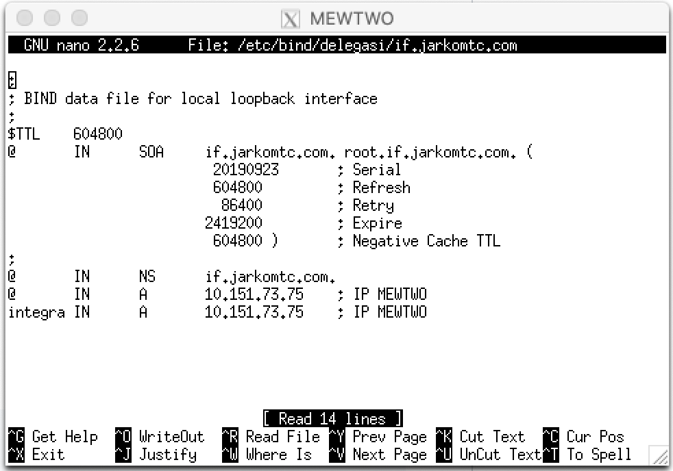

- Restart bind9

`service bind9 restart`

**III. Testing**
- Lakukan ping ke domain **if.jarkomtc.com** dan **integra.if.jarkomtc.com** dari client *PSYDUCK*

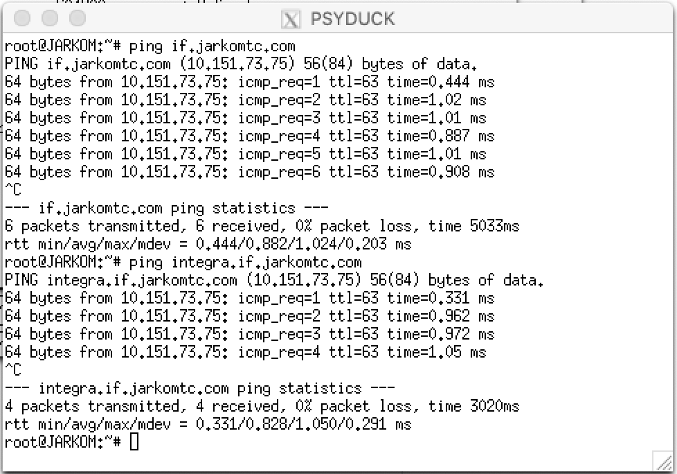

**1.2.9 DNS FORWARDER**

DNS Forwarder digunakan untuk mengarahkan DNS Server ke IP yang ingin dituju.

- Edit file /etc/bind/named.conf.options pada server *ARTICUNO*
- Uncomment pada bagian ini
```
forwarders {
    8.8.8.8;
};
```
- Comment pada bagian ini

`// dnssec-validation auto;`
- Dan tambahkan

`allow-query{any;};`

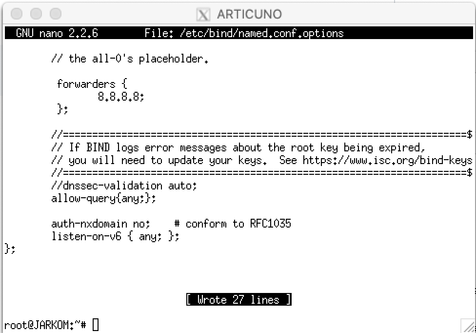

- Harusnya jika nameserver pada file **/etc/resolv.conf** di client diubah menjadi IP *ARTICUNO* maka akan di forward ke IP DNS google yaitu 8.8.8.8 dan bisa mendapatkan koneksi.

**1.3 Keterangan Konfigurasi Zone File**
1. **Penulisan Serial**

Ditulis dengan format YYYYMMDDXX. Serial di increment setiap melakukan perubahan pada file zone.

```
YYYY adalah tahun
MM adalah bulan
DD adalah tanggal
XX adalah counter
```

Contoh:

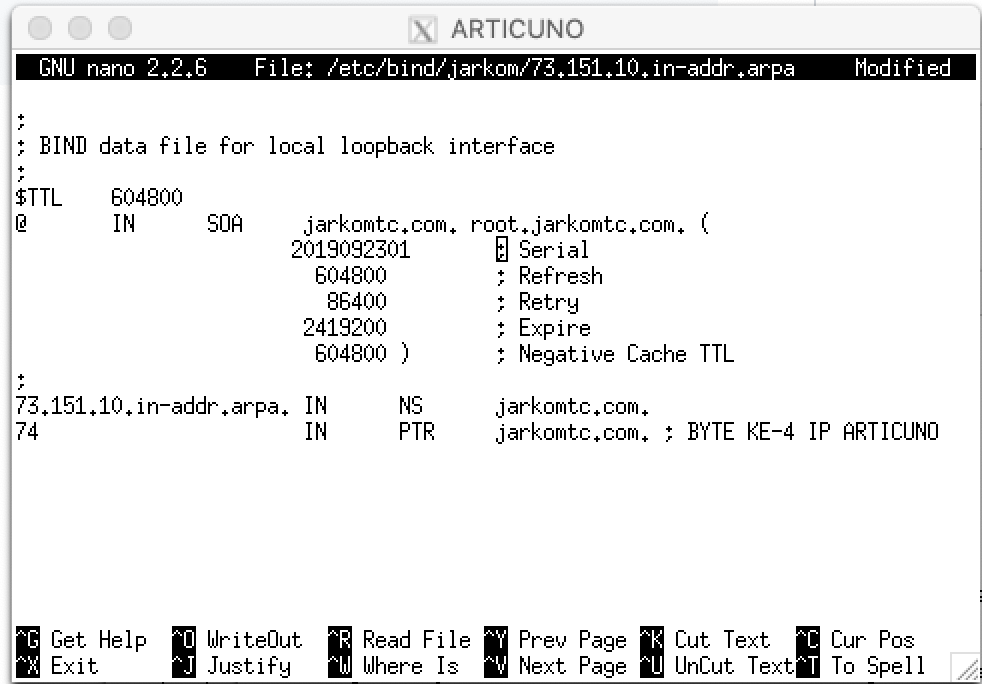

2. **Penggunaan titik**

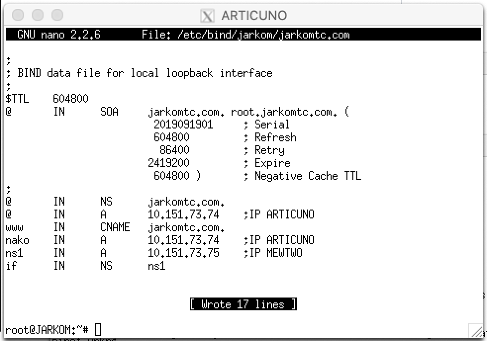

Pada salah satu contoh di atas, dapat kita amati pada kolom keempat terdapat record yang menggunakan titik pada akhir kata dan ada yang tidak. Penggunaan titik berfungsi sebagai penentu FQDN (Fully-Qualified Domain Name) suatu domain.

Contohnya jika "jarkomtc.com." di akhiri dengan titik maka akan dianggap sebagai FQDN dan akan dibaca sebagai "jarkomtc.com" , sedangkan ns1 di atas tidak menggunakan titik sehingga dia tidak terbaca sebagai FQDN. Maka ns1 akan di tambahkan di depan terhadap nilai ORIGIN sehingga ns1 akan terbaca sebagai "**ns1.jarkomtc.com**". Nilai $ORIGIN diambil dari penamaan zone yang terdapat pada /etc/bind/named.conf.local.

3. **Penulisan Name Server (NS) record**

Salah satu aturan penulisan NS record adalah dia harus menuju A record., bukan CNAME.

## Latihan
1. Buatlah domain jarkom.tc dan www.jarkom.tc (CNAME jarkom.tc). Apa yang terjadi jika melakukan ping jarkom.tc dengan ping www.jarkom.tc? Mengapa hal itu terjadi?
2. Buatlah sebuah subdomain pada domain jarkom.tc dengan nama love.jarkom.tc setelah itu buatlah subdomain xx.love.jarkom.tc!

#### Sumber
+ https://ns1.com/resources/dns-types-records-servers-and-queries
+ https://id.wikipedia.org/wiki/Sistem_Penamaan_Domain
+ https://id.wikipedia.org/wiki/BIND
+ https://en.wikipedia.org/wiki/List_of_DNS_record_types
+ http://knowledgelayer.softlayer.com/faq/what-does-serial-refresh-retry-expire-minimum-and-ttl-mean

<!--stackedit_data:
eyJoaXN0b3J5IjpbLTU5Mzc1NzY2MiwtMTE0MzQxMTQ4MywzMj
M4NTM1OTUsMTE1MDUwMTY5OSwtNzgyOTA1MjAxLDIxMzQxMzk0
MTMsNDcyOTM0NDAzLDE2NDAzNzA5MjksLTIwNDE4MjA2NTYsLT
YyNTgyODUzNiwxNjU2ODg0Njg5LDExMzM1NDA5MzAsMzUxNTIy
MjQ0LC0xMDQ2ODM2NTQ2LDQyMDI3NDg4NywtNjY5MTc3Mzg3LD
E1OTE5MTE2NjVdfQ==
-->