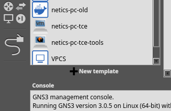
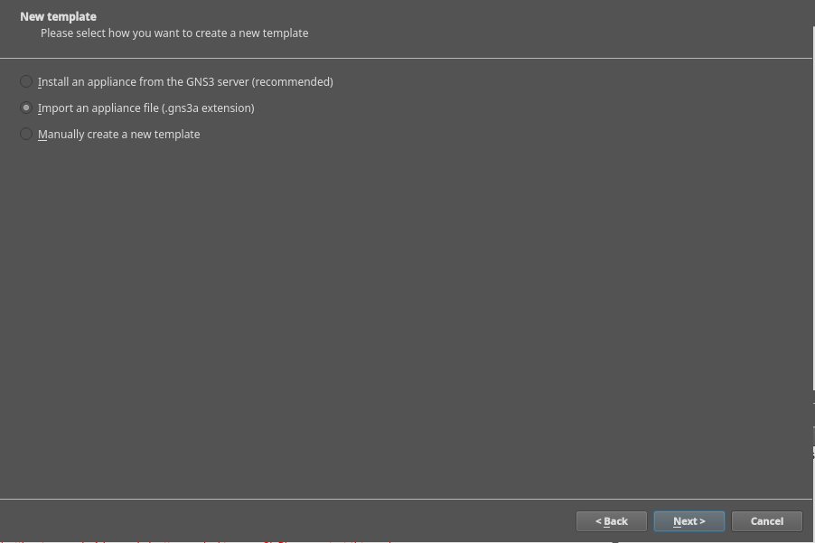
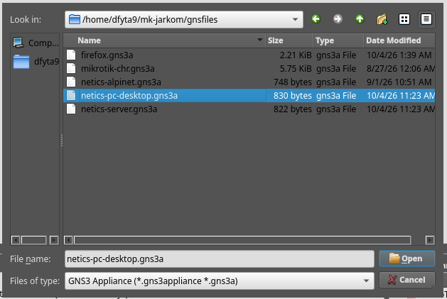
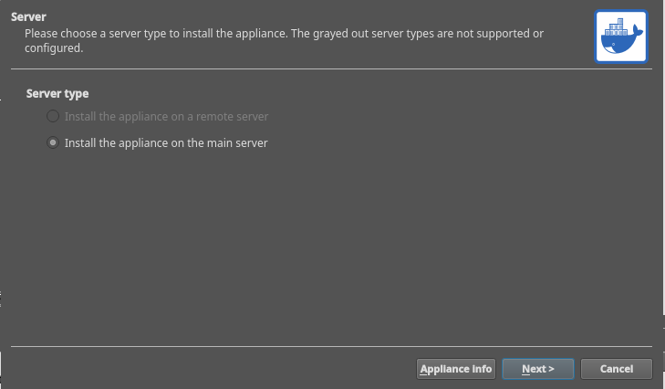
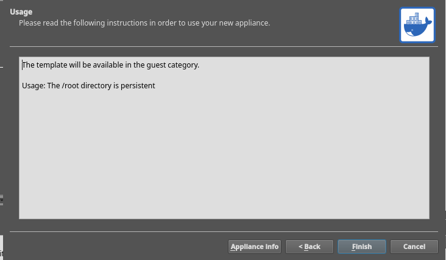
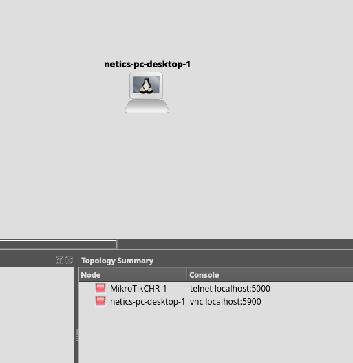

# Module 2

## Table of Contents

- [0. Installing netics-pc-desktop and netics-server](#0-installing-netics-pc-desktop-and-netics-server)
  - [0.1 GNS3 Appliance](#01-gns3-appliance)
  - [0.2 Installation Steps](#02-installation-steps)
- [1. Connecting netics-pc to NAT](#1-connecting-netics-pc-to-nat)
  - [1.1 Giving a Node Internet Access](#11-giving-a-node-internet-access)
  - [1.2 Creating the Topology](#12-creating-the-topology)
- [2. Nginx Web Server](#2-nginx-web-server)
  - [2.1 Nginx Installation and Basic Usage](#21-nginx-installation-and-basic-usage)
  - [2.2 Nginx Configuration](#22-nginx-configuration)
- [3. Reverse Proxy](#3-reverse-proxy)
  - [3.1 Forward and Reverse Proxy Theory](#31-forward-and-reverse-proxy-theory)
  - [3.2 Nginx Configuration Syntax](#32-nginx-configuration-syntax)
  - [3.3 Reverse Proxy Using Nginx](#33-reverse-proxy-using-nginx)
  - [3.4 Load Balancing with Reverse Proxy](#34-load-balancing-with-reverse-proxy)
- [4. Python 3](#4-python-3)
  - [4.1 Installing Python 3](#41-installing-python-3)
  - [4.2 A Simple Web Server with Python 3](#42-a-simple-web-server-with-python-3)
  - [4.3 Testing from the Client](#43-testing-from-the-client)
- [5. Computer Network Models](#5-computer-network-models)
  - [5.1 Introduction](#51-introduction)
  - [5.2 OSI Model](#52-osi-model)
  - [5.3 TCP/IP Model](#53-tcpip-model)
- [6. DNS (Domain Name System)](#6-dns-domain-name-system)
  - [6.1 Theory](#61-theory)
  - [6.2 Practice](#62-practice)
  - [6.3 Zone File Configuration](#63-zone-file-configuration)
  - [6.4 Exercises](#64-exercises)
  - [6.5 References](#65-references)
- [7. Static Routing](#7-static-routing)
  - [7.1 Definition](#71-definition)
  - [7.2 Implementation](#72-implementation)
  - [7.3 Troubleshooting](#73-troubleshooting)
  - [7.4 References](#74-references)

## 0. Installing netics-pc-desktop and netics-server 

### 0.1 GNS3 Appliance

Please download the GNS3 desktop appliance and the netics-server appliance from the links below:

- [netics-pc-desktop](https://drive.google.com/file/d/1ZA8s6kTUNig3N9oG0XdAA12DvG9b5sAI/view?usp=sharing)
- [netics-server](https://drive.google.com/file/d/1Pol2KBgxOomzBzrhNj16rC5OID8T5Wu4/view?usp=sharing)


### 0.2 Installation Steps

The steps below apply, and are exactly the same, for installing both appliances.

1. Select the menu **File → New Template**.

   

2. Select the option **Import an appliance file**, then choose the **netics-pc-desktop.gns3a** file you downloaded. The **netics-alpinet.gns3a** file can be obtained from [here](netics-pc-alpinet\netics-alpinet.gns3a)

   
   

3. Select the option **Install appliance on a remote server**.

   
   

4. Make sure you have opened a new or existing project, then drag and drop the newly installed appliance into GNS3.

   


> [!IMPORTANT]
> For netics-pc-desktop, the console type is a VNC client, not telnet.
> 
> So you need a VNC client to see the node's interface. Any client will do; you can use TightVNC, TigerVNC, or another one.

## 1. Connecting netics-pc to NAT

### 1.1 Giving a Node Internet Access

1. Drag a NAT node onto an empty area.

2. Connect the NAT to netics-pc with a link.

   

3. Click the **Show/Hide interface labels** menu to display the node's interface information.

   

4. Then click the node, choose the `eth0` interface, and click the NAT node you dragged earlier.

   

5. Next, configure the IP of the netics-pc node.

   Right-click the netics-pc-1 node, choose **Configure**, and press the **Edit** button in the Network Configuration section.

   

   - Find these 2 lines:

     ```
     # auto eth0
     # iface eth0 inet dhcp
     ```

   - Uncomment both lines, then save:

     ```
     auto eth0
     iface eth0 inet dhcp
     ```

6. Start the node.

7. Open the node's console and try pinging Google. If it succeeds, your settings are correct.

   

8. This node will later be used as the router for this module. Rename it to `Foosha` using the node's `Change hostname` feature, and also change the symbol to a router symbol using the `Change symbol` feature.

### 1.2 Creating the Topology

1. Add several ethernet switch and ubuntu nodes, then connect the nodes and name them so that they match the picture.

   

2. Use the `Change hostname` feature to rename the nodes.

3. Next, we configure the network of each node with the `Edit network configuration` feature as shown earlier. You can delete all of the existing settings and fill in the settings below.

   - Foosha

     ```
     auto eth0
     iface eth0 inet dhcp

     auto eth1
     iface eth1 inet static
         address [Prefix IP].1.1
         netmask 255.255.255.0

     auto eth2
     iface eth2 inet static
         address [Prefix IP].2.1
         netmask 255.255.255.0
     ```

   - Loguetown

     ```
     auto eth0
     iface eth0 inet static
         address [Prefix IP].1.2
         netmask 255.255.255.0
         gateway [Prefix IP].1.1
     ```

   - Alabasta

     ```
     auto eth0
     iface eth0 inet static
         address [Prefix IP].1.3
         netmask 255.255.255.0
         gateway [Prefix IP].1.1
     ```

   - EniesLobby

     ```
     auto eth0
     iface eth0 inet static
         address [Prefix IP].2.2
         netmask 255.255.255.0
         gateway [Prefix IP].2.1
     ```

   - Water7

     ```
     auto eth0
     iface eth0 inet static
         address [Prefix IP].2.3
         netmask 255.255.255.0
         gateway [Prefix IP].2.1
     ```

   **Explanation of Terms**

   - **Gateway**: The path in a network that data packets must pass through in order to enter another network.

4. Restart all nodes.

5. Check that all ubuntu nodes have the IP addresses matching your settings using the `ip a` command. Below is an example for the `Foosha` node with the Prefix IP `10.105`; adjust it to your own group's Prefix IP.

   

6. The topology you created can already run locally, but we cannot yet access outside networks. So we need to do a few more things.

   - Install the iptables tool

     ```
     apk update
     apk add iptables
     ```

   - Type **`iptables -t nat -A POSTROUTING -o eth0 -j MASQUERADE -s [Prefix IP].0.0/16`** on the `Foosha` router

     **Explanation:**

     - **iptables:** iptables is a tool in the Linux operating system that works as a filter for data traffic. With iptables we can control all traffic on a computer, whether incoming, outgoing, or merely passing through our computer. A more detailed explanation will be given in Module 5.

     - **NAT (Network Address Translation):** A method of translating network addresses used to connect more than one computer to the internet using a single IP address.

     - **Masquerade:** Used to disguise packets, for example by replacing the sender's address with the router's address.

     - **-s (Source Address):** A specification of the source. The address can be a network name, a host name, or an IP address.

   - Type the command `cat /etc/resolv.conf` on `Foosha`

     

   - Remember that IP, because it is the DNS IP. Then type this command on the other ubuntu nodes: `echo nameserver [DNS IP] > /etc/resolv.conf`. In the example case, the command is `echo nameserver 192.168.122.1 > /etc/resolv.conf`.

   - Below is an example of pinging before and after adding the nameserver on the Water7 node

     

   - All nodes should now be able to ping Google, which means they are connected to the internet.

## 2. Nginx Web Server

**Nginx** is open-source software with many functions. This web server is known for its powerful performance and its many advanced features. Some of Nginx's functions include:

- Web server

- Load Balancing

- Reverse Proxy

### 2.1 Nginx Installation and Basic Usage

#### 2.1.1 Open the Water7 Node

Then run the command

```bash
apk update && apk add nginx
```

Once the Nginx installation has finished, don't forget to run the following commands

```bash
mkdir -p /run/nginx
nginx -t && nginx
```

To check the Nginx processes that are currently running, use the command

```bash
ps aux | grep '[n]ginx'
```


#### 2.1.2 Accessing the Web with Lynx

On the **Loguetown** client, install `lynx`, then access Water7's IP address:

```bash
apk add lynx
```

```text
lynx http://[IP Water7]
```

Replace `[IP Water7]` with that node's IP address. The default configuration of the Nginx Alpine package may display `404 Not Found`; a sample page will be created in the next configuration section.


### 2.2 Nginx Configuration

#### 2.2.1 EniesLobby (Nginx worker)

- install and then set up Nginx and PHP

  ```bash
  apk update && apk add nginx php83 php83-fpm
  ```

This module's example uses PHP 8.3.

- check the PHP version

  ```bash
  php83 -v
  ```

- Make sure the `listen` setting in `/etc/php83/php-fpm.d/www.conf` uses the following address:

  ```ini
  listen = 127.0.0.1:9000
  ```

  

- Check the PHP-FPM configuration, then run it if it is not already running:

  ```bash
  php-fpm83 -t && php-fpm83
  ```

- create a new directory in `/var/www`, named `jarkom`

  ```bash
  mkdir -p /var/www/jarkom
  ```

- create the file `/var/www/jarkom/index.php` with the following content

  ```php
  <?php
  echo "Halo, Kamu berada di EniesLobby";
  ?>
  ```

  

- On Alpine, site configuration is loaded from `/etc/nginx/http.d/*.conf`. Edit the default file `/etc/nginx/http.d/default.conf` and replace its contents with the following server block. This file is used so that there are no two default servers on the same port.

- then fill it with this server block configuration:

  ```nginx
  server {

      listen 80 default_server;

      root /var/www/jarkom;

      index index.php index.html index.htm;
      server_name _;

      location / {
          try_files $uri $uri/ /index.php?$query_string;
      }

      # pass PHP scripts to FastCGI server
      location ~ \.php$ {
          try_files $uri =404;
          include /etc/nginx/fastcgi_params;
          fastcgi_param SCRIPT_FILENAME $document_root$fastcgi_script_name;
          fastcgi_pass 127.0.0.1:9000;
      }

      location ~ /\.ht {
          deny all;
      }

      error_log /var/log/nginx/jarkom_error.log;
      access_log /var/log/nginx/jarkom_access.log;
  }
  ```

  

- Save the configuration, then check its syntax:

  ```bash
  mkdir -p /run/nginx
  nginx -t
  ```

- If the check succeeds, run `nginx` on any node that is not running it yet. If Nginx is already running, apply the changes with:

  ```bash
  nginx -s reload
  ```

- From the client, access `http://[IP EniesLobby]` using `lynx`. The page should display `Halo, Kamu berada di EniesLobby`.

  

#### 2.2.2 Water7 (Nginx worker)

- perform the same configuration as on the EniesLobby node. Because Nginx was already started in the basic usage section, use `nginx -s reload` after validating the configuration. Make the contents of `/var/www/jarkom/index.php` different to make testing easier:

  ```php
  <?php
  echo "Halo, Kamu berada di Water7";
  ?>
  ```

  

#### 2.2.3 Server Block Explanation

- `listen` defines which port Nginx will run on.

- `root` indicates the location of the directory containing the web files being used.

- `index` determines the order of index files that the server will try when a request comes in.

- `server_name` determines the host name being served. In this example, `default_server` on `listen` makes this server the destination for requests that do not match any other server; the `_` sign by itself is not a wildcard.

- `location { ... }` Configuration for handling requests to the site root. **try_files** tries to find a file matching **$uri**, then **$uri/**, and if that is also not found, it redirects to index.php using the **query string data**.

- `location ~ \.php$` forwards PHP file requests to PHP-FPM via `127.0.0.1:9000`. This address must be the same as the `listen` value in the PHP-FPM configuration. `SCRIPT_FILENAME` specifies the path of the PHP file to be executed, while `try_files $uri =404` checks that the file exists.

- `location ~ /\.ht` specifies that access to .ht files (such as .htaccess) will be denied. This is a common security measure used to prevent access to sensitive files.

- `error_log` directs the error log to a specific file.

- `access_log` directs the access log to a specific file.

- The file `/etc/nginx/http.d/default.conf` is loaded through the main configuration `/etc/nginx/nginx.conf`, so a `sites-enabled` symlink is not needed.

## 3. Reverse Proxy

### 3.1 Forward and Reverse Proxy Theory

#### 3.1.1 What Is a Proxy

Before getting to know Reverse Proxy in more depth, you should know that a Reverse Proxy and a Proxy Service such as a `Forward Proxy` are 2 different things in the way they work.

##### Forward Proxy

In short, a `Forward Proxy` is a service provided by a server, where this server becomes an intermediary between us and the destination server or website. So when we access a website on the internet, we first connect to the Proxy Server.

A forward proxy acts as an intermediary on the client side. Below is an example of a simple architecture that uses a proxy server.


##### Reverse Proxy

Next, a `Reverse Proxy` is a type of proxy server that is responsible for forwarding client requests to the server. A Reverse Proxy sits between the client and the server. So, requests made by the client will be forwarded by the Reverse Proxy to reach the server. Simply put, the Reverse Proxy sits between the client and the server and is tasked with ensuring that data exchange between the client and the server runs smoothly.

A Reverse Proxy is usually implemented on web servers such as `Apache` and `Nginx`. In addition, as quoted from [`CloudFlare`](https://www.cloudflare.com/learning/cdn/glossary/Reverse-Proxy/), a Reverse Proxy is also used for security so that the exchange of requests from the client to the server or vice versa runs safely.

Not only that, a Reverse Proxy can also perform data compression. Large data will be compressed into smaller data. This can make data exchange run faster. A Reverse Proxy also has the ability to balance the load of servers so that servers do not go down.


#### 3.1.2 How a Reverse Proxy Works

As explained above, a Reverse Proxy sits between the client and the server. The main function of a Reverse Proxy is to receive and forward requests from the client to the server or vice versa. How a Reverse Proxy works can be illustrated with the following example: suppose you act as a client who wants to access a website. The request made by the client, before reaching the server, will first be received by the reverse proxy. After that, the Reverse Proxy forwards it to the server and then receives the server's reply, which will then be delivered to the client.

#### 3.1.3 Benefits of a Reverse Proxy

Because in this module we will focus on `Nginx` as a Reverse Proxy, here are some benefits of using Nginx as a Reverse Proxy.


Some benefits of Nginx as a Reverse Proxy:

- `Load Balancing` - A reverse proxy can perform load balancing, which helps distribute client requests evenly across backend servers or workers. This process is very helpful in avoiding scenarios where a particular server becomes overloaded because of a sudden surge in requests. Load balancing also increases redundancy: if one server dies, the proxy will route or redirect incoming traffic to the other workers.

- `Powerful Caching` - Nginx can cache content received from the proxied server's responses and use it to respond to clients without having to contact the main server for the same content every time a request comes in.

- `Superior Compression` - If the proxied server does not send compressed responses, we can configure Nginx to compress responses `(for example: gzip)` before sending them to the client. This will certainly save bandwidth and speed up website loading.

- `Increased security` - Information about the main server cannot be seen from the outside, making it difficult for hackers to attack. Protection against attacks such as DDoS requires additional configuration and mechanisms.

### 3.2 Nginx Configuration Syntax

The main configuration is located at `/etc/nginx/nginx.conf`. Simple directives end with `;`, while blocks use `{ ... }`. Comments begin with `#`.

The context structure is as follows. This is only an illustration of the structure, not a replacement for the entire default configuration:

```nginx
events {
    worker_connections 1024;
}

http {
    # Site files are loaded inside the http context.
    include /etc/nginx/http.d/*.conf;
}
```

In a site file, `upstream` and `server` are in the `http` context, while `location` is inside `server`. Because `/etc/nginx/http.d/default.conf` is already loaded inside `http`, write the `upstream` and `server` blocks directly in that file without wrapping them in `http` again.

### 3.3 Reverse Proxy Using Nginx

Use the same topology as in the [Nginx Web Server](#2-nginx-web-server) and [Creating the Topology](#12-creating-the-topology) sections. **Alabasta** becomes the reverse proxy, **EniesLobby** and **Water7** become the backends, and **Loguetown** becomes the client. **Foosha** remains the router connecting both subnets and the NAT.

| Node | Role | IP Address |
| --- | --- | --- |
| Loguetown | Client | `[Prefix IP].1.2` |
| Alabasta | Reverse proxy / load balancer | `[Prefix IP].1.3` |
| EniesLobby | Nginx backend | `[Prefix IP].2.2` |
| Water7 | Nginx backend | `[Prefix IP].2.3` |

The configuration example below uses the prefix `10.105`, matching the example in the topology creation section. Adjust the prefix to your group's. Make sure Alabasta can access the EniesLobby and Water7 pages that were created in the Nginx section, and that Loguetown can access Alabasta.

For the first reverse proxy example, forward requests to **EniesLobby**. In the load balancing section, use both backends.

On **Alabasta**, install Nginx:

```bash
apk update && apk add nginx
mkdir -p /run/nginx
```

Replace the contents of `/etc/nginx/http.d/default.conf` with:

```nginx
server {
    listen 80 default_server;
    server_name _;

    location / {
        proxy_pass http://10.105.2.2;
        proxy_set_header Host $host;
        proxy_set_header X-Real-IP $remote_addr;
        proxy_set_header X-Forwarded-For $proxy_add_x_forwarded_for;
    }
}
```


- `proxy_pass` forwards requests to the EniesLobby backend.

- `proxy_set_header Host $host` passes along the host name requested by the client.

- `X-Real-IP` conveys the address of the client connected to Alabasta.

- `X-Forwarded-For` appends the client's address to the list of proxy addresses passed through.

Validate the configuration, then run Nginx if it is not already running:

```bash
nginx -t && nginx
```

If Nginx is already running, use `nginx -t && nginx -s reload`. From **Loguetown**, access Alabasta's address using `lynx http://[IP Alabasta]`. The page that appears should contain the message from EniesLobby.


### 3.4 Load Balancing with Reverse Proxy

An upstream in Nginx refers to the group of nodes used as backends. `proxy_pass http://backend` forwards requests to the group named `backend`.

#### 3.4.1 Round Robin

This is the default load balancing algorithm in Nginx. In this topology, it works by distributing requests alternately to EniesLobby and Water7, then back to EniesLobby.

Configuration:

1. Use **EniesLobby and Water7** as workers using the Nginx and PHP-FPM configuration from the previous Nginx section. Make the contents of `index.php` different on each worker so that the test results show which node responded.

2. On **Alabasta**, replace the contents of `/etc/nginx/http.d/default.conf` from the previous single-backend example with the following configuration. Adjust the worker IPs to your topology.

   ```nginx
   #Default menggunakan Round Robin
   upstream backend  {
       server 10.105.2.2; #IP EniesLobby
       server 10.105.2.3; #IP Water7
   }

   server {
       listen 80 default_server;
       server_name _;

       location / {
           proxy_pass http://backend;
           proxy_set_header    X-Real-IP $remote_addr;
           proxy_set_header    X-Forwarded-For $proxy_add_x_forwarded_for;
           proxy_set_header    Host $http_host;
       }

       error_log /var/log/nginx/lb_error.log;
       access_log /var/log/nginx/lb_access.log;

   }
   ```

3. Check and reload the configuration on Alabasta:

   ```bash
   nginx -t && nginx -s reload
   ```

4. From **Loguetown**, access `http://[IP Alabasta]` several times using `lynx`. Note the worker name on the page that is returned.

   

#### 3.4.2 Weighted Round Robin

Simply assign a weight or load to each server in the previously defined server pool. The server with the largest weight will be prioritized when receiving requests from the client.

Weights can be used to optimize load balancing and ensure that more powerful servers carry a greater load.

Configuration:

```nginx
upstream backend  {
    server 10.105.2.2 weight=4; #IP EniesLobby
    server 10.105.2.3 weight=2; #IP Water7
}
```


#### 3.4.3 Least Connection

Least Connection chooses the worker with the fewest active connections, taking server weights into account. This method uses the number of connections, not measurements of the worker's CPU usage.

Configuration:

```nginx
#Least Connection
upstream backend  {
    least_conn;
    server 10.105.2.2; #IP EniesLobby
    server 10.105.2.3; #IP Water7
}

server {
    listen 80 default_server;
    server_name _;

    location / {
        proxy_pass http://backend;
        proxy_set_header    X-Real-IP $remote_addr;
        proxy_set_header    X-Forwarded-For $proxy_add_x_forwarded_for;
        proxy_set_header    Host $http_host;
    }

    error_log /var/log/nginx/lb_error.log;
    access_log /var/log/nginx/lb_access.log;

}
```

#### 3.4.4 IP Hash

Somewhat different from the two algorithms above, this algorithm performs a hash based on the user's request (using the user's IP address). Requests from the same client IP are directed to the same worker as long as that worker is available. When that server is unavailable, requests from this client will be served by another server.

Configuration:

```nginx
# IP Hash
upstream backend  {
    ip_hash;
    server 10.105.2.2; #IP EniesLobby
    server 10.105.2.3; #IP Water7
}

server {
    listen 80 default_server;
    server_name _;

    location / {
        proxy_pass http://backend;
        proxy_set_header    X-Real-IP $remote_addr;
        proxy_set_header    X-Forwarded-For $proxy_add_x_forwarded_for;
        proxy_set_header    Host $http_host;
    }

    error_log /var/log/nginx/lb_error.log;
    access_log /var/log/nginx/lb_access.log;
}
```

#### 3.4.5 Generic Hash

Generic hash is a type of load balancing that uses a hash algorithm to distribute traffic to backend servers. This hash algorithm uses a hash of a particular value to determine which backend server or worker will handle the request.

The value used for the hash can be anything, such as the client's IP address, HTTP header values, and so on. This hash value is then used to determine which backend server will handle the request.

```nginx
upstream backend  {
    hash $request_uri consistent;
    server 10.105.2.2; #IP EniesLobby
    server 10.105.2.3; #IP Water7
}

server {
    listen 80 default_server;
    server_name _;

    location / {
        proxy_pass http://backend;
        proxy_set_header    X-Real-IP $remote_addr;
        proxy_set_header    X-Forwarded-For $proxy_add_x_forwarded_for;
        proxy_set_header    Host $http_host;
    }

    error_log /var/log/nginx/lb_error.log;
    access_log /var/log/nginx/lb_access.log;
}
```

Each of the method examples above is an alternative. Replace the previous configuration; do not add multiple `upstream backend` blocks with the same name. After making changes, run `nginx -t && nginx -s reload` on Alabasta and repeat the test from the client.

## 4. Python 3

Python 3 provides the built-in `http.server` module for serving files over HTTP. In this exercise, use **Water7** as the server and **Loguetown** as the client. Use the same topology and IP configuration as in the Nginx section: Water7 is at `[Prefix IP].2.3` and Loguetown is at `[Prefix IP].1.2`, connected through Foosha. Make sure both nodes are connected to each other. Nginx continues to use port 80, while the Python server uses port 8000.

### 4.1 Installing Python 3

On **Water7**, run:

```bash
apk update && apk add python3
python3 --version
```

### 4.2 A Simple Web Server with Python 3

Create the web page directory:

```bash
mkdir -p /root/python-web
```

Create the file `/root/python-web/index.html` with the following content:

```html
<!DOCTYPE html>
<html lang="id">
<head>
    <meta charset="UTF-8">
    <title>Web Server Python</title>
</head>
<body>
    <h1>Halo dari Water7!</h1>
    <p>Halaman ini dilayani oleh Python 3.</p>
</body>
</html>
```

Run the server:

```bash
python3 -m http.server 8000 --bind 0.0.0.0 --directory /root/python-web
```

- `-m http.server`: runs the HTTP server module.

- `8000`: the server port, separate from Nginx on port 80.

- `--bind 0.0.0.0`: listens on all IPv4 interfaces.

- `--directory`: specifies the directory of files to be served.

Leave the server console running during testing. Press **Ctrl+C** to stop it. This module serves static files; PHP files are not executed.

### 4.3 Testing from the Client

On **Loguetown**, install `lynx`:

```bash
apk update && apk add lynx
```

Access the server, replacing `[IP Water7]` with the actual IP address:

```text
lynx http://[IP Water7]:8000/
```

The page will display **"Halo dari Water7!"**. The Water7 console logs the request along with the HTTP status, for example `GET / HTTP/1.1` with status `200`.


If it fails, check the connectivity between nodes, port `8000`, and the server process. If a file listing appears, make sure `index.html` is stored in the directory being served.

## 5. Computer Network Models

### 5.1 Introduction

Before getting into Static Routing, it is a good idea to first get to know how networks on computers work. So let's first get acquainted with the models used in computer networking. Happy reading!

Designing and managing a network is very difficult work because it requires integrating many things, such as hardware, software, firmware, and so on. For this reason, a way is needed to simplify the process so that it can be done more easily. Hence, the concept of layering arose to solve this problem. In this concept, several layers are created, where each layer has 1 responsibility and communicates with the other layers. Generally, there are 2 models that use the same concept and have been adopted worldwide, namely the **OSI Model** and the **TCP/IP Model**.

### 5.2 OSI Model

The OSI (_Open Systems Interconnection_) Model is a guideline that governs how computers communicate in a network. This model has 7 layers, with each layer having its own task. The layers consist of:


#### 5.2.1 Physical Layer

This layer (**Layer 1**), as its name suggests, is the physical and lowest layer of the OSI Model. Its task is quite simple and clear: transmitting information in the form of bits, which can be electrical current or electromagnetic waves. When receiving data, this layer converts the data into 0s and 1s before it is sent on to the Data Link Layer. Several devices work at this layer, namely _repeaters_, _hubs_, _modems_, and cables.


#### 5.2.2 Data Link Layer

The main task of the Data Link Layer (**Layer 2**) is to send information from device to directly connected device (_between adjacent nodes_). This layer also ensures that the information delivered is correct through its _error control_ mechanism. At this _layer_, the determination of the source and destination of data (_Addressing Scheme_) is done based on the **MAC Address**, also commonly known as the _hardware address_ or _physical address_. In addition, the _packet_ at this layer is commonly known as a **Frame**. Several devices work at this layer, such as _switches_ and _bridges_. This layer has many protocols; some of the most familiar are _IEEE 802.3_ for Ethernet and _IEEE 802.11_ for WiFi.

> Originally, _switches_ only operated at Layer 2. However, modern _switches_ have begun to be able to operate at Layer 3 as well.


#### 5.2.3 Network Layer

Next is the Network Layer (**Layer 3**), where this layer is tasked with ensuring that _packets_ can get from start to finish. If the data link layer can be called _node-to-node_ communication, then the network layer can be called _end-to-end_ communication. For example, suppose a package is to be sent from house X in city A to house Y in city B, passing through many post offices. The data link layer ensures the package gets from one post office to the next, while the network layer ensures the package gets from house X to house Y.

At this layer, the data being sent is commonly known as a **Packet** and the addressing (_Addressing Scheme_) is based on the **IP Address**. This layer is also responsible for performing _routing_ to ensure _packets_ reach their destination. The device that most commonly works at layer 3 is the _router_. In addition, some protocols that work at this layer include the _Internet Protocol (IP)_, the _Internet Control Message Protocol (ICMP)_ commonly found in the `ping` command, and _routing_ protocols such as _RIP_, _OSPF_, and _BGP_.


When data is sent, the frame will have 2 addresses, namely the _MAC Address_ for direct communication with the next device and the _IP Address_ for end-to-end communication. After arriving at a device, the _MAC Address_ information (such as source and destination) will change. Therefore, a protocol called **Address Resolution Protocol (ARP)** was created to obtain a _MAC Address_ based on an _IP Address_.


#### 5.2.4 Transport Layer

Okay, the _packet_ has arrived correctly at its destination. But how do we know which application needs this _packet_? This is where the Transport Layer (**Layer 4**) works. This layer ensures that data gets correctly from the originating application (_process_) to the destination application (_process_). This layer is quite similar to the concept of _Inter-Process Communication_, because Layer 4 communicates from one _process_ to another _process_ on a different _host_. Therefore, the start and end points (_Addressing Scheme_) of Layer 4 are determined by the **Port Number**. Data at this layer is often called a **Segment**. There are several transport layer protocols, with the 2 best known and most frequently used being **TCP** for _reliable_ but slower communication and **UDP** for _unreliable_ but faster communication.


#### 5.2.5 Session Layer

At the Session Layer (**Layer 5**), several mechanisms take place to ensure communication runs smoothly. Therefore, this layer is responsible for creating, coordinating, and terminating connections between two _hosts_. Several applications make use of this layer, such as the use of _Remote Procedure Call_ (RPC) and AppleTalk's _Zone Information Protocol_ (ZIP).


#### 5.2.6 Presentation Layer

The Presentation Layer (**Layer 6**) is also often known as the **Translation Layer**. At this layer, received data is translated into the appropriate format. Not only that, this layer is also tasked with encrypting data so that the security of information sent over a network can be guaranteed.


#### 5.2.7 Application Layer

As the top layer of the OSI Model, the Application Layer (**Layer 7**) is the source that creates data and the final destination of data. This layer also acts as an intermediary between applications and the computer network. At this layer, there are many protocols that we use and encounter often, such as HTTP, Telnet, FTP, SSH, and others.


### 5.3 TCP/IP Model

The TCP/IP Model is a guideline just like the OSI Model. However, this model is often considered more modern, flexible, and easy, so it has become the standard adopted by the majority of devices in the world. This model is similar to the OSI Model, with several layers merged into one. Here, Layer 5 through Layer 7 are merged into the "Application Layer". Then, some parties merge Layer 1 and Layer 2 into the "Network Interface Layer" or "Network Access Layer". However, many also keep Layer 1 and Layer 2 separate as in the OSI Model. Therefore, the TCP/IP Model has 4 or 5 layers.


## 6. DNS (Domain Name System)

### 6.1 Theory

#### 6.1.1 Definition


Imagine you are looking for someone's phone number in your phone's contact book. Generally, you would search using the name of the person you want to reach, not their phone number. Well, DNS works the same way. When you want to access a website, you type the website's name (for example "www.youtube.com"), and DNS finds out the IP number of the server that hosts that website. After that, your computer contacts the server that uses that IP address.

##### So, DNS is...

DNS (_Domain Name System_) is a naming system for all devices (smartphones, computers, or networks) that are connected to the internet. A DNS Server functions to translate domain names into IP addresses. DNS was created to replace the use of the hosts file system, which was considered inefficient.

#### 6.1.2 How It Works


Here is how DNS works:

1. When you type a website address (such as www.contoh.com) in the browser, the computer (client) asks the DNS server for that website's IP address.

2. If the DNS server already knows the IP address of that website, the DNS server sends that IP address back to your computer.

3. If the DNS server does not know the IP address, that server will ask other DNS servers until it finds the correct IP address.

4. Once the IP address is found, the DNS server sends it to your computer, and only then can the browser access the website.

This is similar to looking for someone's phone number in a contact book. If the first contact book does not have the number, you can look in another contact book.

#### 6.1.3 DNS Server Applications

##### What Is a DNS Server?

Imagine a DNS server as a translator. When you type a website name in the browser, the computer does not immediately understand that name. So, the computer asks the DNS server to "translate" the website name into an IP address, like a house number on the internet. After the DNS server gives the IP address, your computer can contact that website.

For the networking lab, we use the bind application as the DNS server, because BIND (Berkeley Internet Naming Daemon) is the most widely used DNS server and also has quite complete features.

#### 6.1.4 Types of DNS Records

##### What Is a DNS Record?

A DNS record is an entry on a DNS server that helps connect the website name you type with its server's IP address. So, when you type a website name (such as www.youtube.com), the DNS record tells the browser where to go to find that website, like directions on the internet.

| Type  | Description                                                                                                                                 |
| ----- | :------------------------------------------------------------------------------------------------------------------------------------------ |
| A     | Maps a domain name to the IP address (IPv4) of the computer hosting the domain                                                              |
| AAAA  | An AAAA record is almost the same as an A record, but points the domain to an IPv6 address                                                  |
| CNAME | An alias from one name to another: the DNS lookup will continue by retrying the lookup with the new name                                    |
| NS    | Delegates a DNS zone to use the given authoritative name servers                                                                            |
| PTR   | Used for Reverse DNS (Domain Name System) lookup                                                                                            |
| SOA   | Refers to the DNS server that provides authoritative information about an Internet domain                                                   |
| TXT   | Allows administrators to insert arbitrary data into DNS records; this record is also used in the Sender Policy Framework specification     |

#### 6.1.5 SOA (Start of Authority)

##### What Is an SOA?

SOA (Start of Authority) is an important record in DNS that provides information about the management of a DNS zone. We can imagine a DNS zone as a housing complex, and the SOA record as the complex's owner who is responsible for all the houses in it.

##### What Is a DNS Zone?

A DNS zone is a part of the DNS system that manages all records for a single domain or subdomain. Like a housing complex that has many houses, each house represents a DNS record (such as an A record, CNAME record, etc.) in that zone. All of these records work together to ensure that information on the internet can be accessed correctly.

It is the information held by a DNS zone.

| Name    | Description                                                                                                                                                                                                                                                                       |
| ------- | :-------------------------------------------------------------------------------------------------------------------------------------------------------------------------------------------------------------------------------------------------------------------------------- |
| Serial  | The revision number of this zone file. Increment this number every time the zone file is changed so that the change will be distributed to any secondary DNS servers                                                                                                              |
| Refresh | The amount of time in seconds that a secondary nameserver should wait before checking for a new copy of the DNS zone from the domain's primary nameserver. If the zone file has changed, the secondary DNS server will update its copy of the zone to match the primary DNS server's zone |
| Retry   | The amount of time in seconds that the domain's primary nameserver (or server) should wait if a refresh attempt by a secondary nameserver fails before trying to refresh the domain's zone with that secondary nameserver again                                                  |
| Expire  | The amount of time in seconds that a secondary nameserver (or server) will hold the zone before it no longer has authority                                                                                                                                                        |
| Minimum | The amount of time in seconds that the domain's resource records are valid. This is also known as the minimum TTL, and can be overridden by the TTL of individual resource records                                                                                                |
| TTL     | (time to live) - The number of seconds a domain name is cached locally before it expires and returns to the authoritative nameserver for the latest information                                                                                                                   |

---

### 6.2 Practice

#### 6.2.1 Creating the Topology

Create a topology like in the [GNS3 introduction](https://github.com/arsitektur-jaringan-komputer/Modul-Jarkom/tree/master/Modul-GNS3#membuat-topologi) from yesterday.

We will make the `EniesLobby` node the DNS server.

#### 6.2.2 Installing BIND

- Open _EniesLobby_ and update the package lists by running the command:

  ```
  apk update
  ```

- After updating, please install the bind application
  on _EniesLobby_ with the command:

  ```
  apk add bind
  ```

  

#### 6.2.3 Creating a Domain

Next, we will create the domain **jarkom2026.com**.

- Run the command on _EniesLobby_. Fill it in as follows:

  ```
  nano /etc/bind/named.conf.local
  ```

- Fill in the configuration for the domain **jarkom2026.com** according to the following syntax:

  ```
  zone "jarkom2026.com" {
      type master;
      file "/etc/bind/jarkom/jarkom2026.com";
  };
  ```

  

- Create a **jarkom** folder inside **/etc/bind**

  ```
  mkdir /etc/bind/jarkom
  ```

- Fill in the config file /etc/bind/jarkom/jarkom2026.com as follows, and don't forget to adjust EniesLobby's IP

  ```
  ;
  ; BIND data file for local loopback interface
  ;
  $TTL    604800
  @       IN      SOA     jarkom2026.com. root.jarkom2026.com. (
                                2022100601         ; Serial
                                  604800         ; Refresh
                                    86400         ; Retry
                                  2419200         ; Expire
                                   604800 )       ; Negative Cache TTL
  ;
  @       IN      NS      jarkom2026.com.
  @       IN      A       10.105.2.2     ; IP EniesLobby
  @       IN      AAAA    ::1
  ```

  

- Restart bind
  with the command

  ```
  named -c /etc/bind/named.conf.local //to restart and run in the background

  OR

  named -c /etc/bind/named.conf.local -g //to restart and debug at the same time
  ```

#### 6.2.4 Setting the Nameserver on the Client

##### What Is a Nameserver?

A nameserver is like an officer who gives directions on the road in the internet world. When you type a website name (for example, www.contoh.com) in the browser, the nameserver is responsible for finding out where that website is located and telling the browser its IP address.

The domain we created will not be recognized by the client right away, so we must change the nameserver settings on our clients.

- On the clients _Loguetown_ and _Alabasta_, point the nameserver to _EniesLobby_'s IP by editing the _resolv.conf_ file with the command

  ```
  nano /etc/resolv.conf
  ```

  

- To test the DNS connection, ping the domain **jarkom2026.com** by running the following command on the clients _Loguetown_ and _Alabasta_

  ```
  ping -4 -c 5 jarkom2026.com
  ```

  

#### 6.2.5 Reverse DNS (PTR Record)

If in the previous domain creation our DNS server worked by translating the domain string **jarkom2026.com** into an IP address so that it could be opened, then Reverse DNS or PTR Records are used to translate an IP address into the domain address that was previously resolved.

- Edit the file **/etc/bind/named.conf.local** on _EniesLobby_

  ```
  nano /etc/bind/named.conf.local
  ```

- Then add the following configuration to the **named.conf.local** file. Add the reverse of the first 3 bytes of the IP for which you want to do Reverse DNS. Because in my example I use the IP `10.105.2` for the records' IP, the reverse is `2.105.10`

  ```
  zone "2.105.10.in-addr.arpa" {
      type master;
      file "/etc/bind/jarkom/2.105.10.in-addr.arpa";
  };
  ```

  

- Copy the file **/etc/bind/jarkom/jarkom2026.com** into the **jarkom** folder you just created and rename it to **2.105.10.in-addr.arpa**

  ```
  cp /etc/bind/jarkom/jarkom2026.com /etc/bind/jarkom/2.105.10.in-addr.arpa
  ```

  _Note: 2.105.10 is the first 3 bytes of EniesLobby's IP written in reverse order_

- Edit the file **2.105.10.in-addr.arpa** so that it looks like the picture below

  

- Then restart bind
  with the command

  ```
  named -c /etc/bind/named.conf.local
  ```

- To check whether the configuration is correct or not, run the following commands on the client _Loguetown_

  ```
  // Install the dnsutils package
  // Make sure the nameserver in /etc/resolv.conf has been restored to be the same as Foosha's nameserver
  apk update
  apk add bind-tools

  //Restore the nameserver so that it connects to EniesLobby
  host -t PTR "IP EniesLobby"
  ```

  

#### 6.2.6 CNAME Record

A CNAME record is a record that creates an alias name and points a domain to another address/domain.

Steps to create a CNAME record:

- Open the file **jarkom2026.com** on the _EniesLobby_ server and add the configuration as shown in the following picture:

  

- Then restart bind
  with the command

  ```
  named -c /etc/bind/named.conf.local
  ```

- Then check by running `host -t CNAME www.jarkom2026.com` or `ping www.jarkom2026.com -c 5`. The result must point to the host with _EniesLobby_'s IP.

  

#### 6.2.7 Creating a DNS Slave

A DNS Slave is a backup DNS that will be accessed if the primary DNS server fails. We will make the _Water7_ server the DNS slave and the _EniesLobby_ server the DNS master.

##### Configuration on the EniesLobby Server

- Edit the file **/etc/bind/named.conf.local** and adjust it to the following syntax

  ```
  zone "jarkom2026.com" {
      type master;
      notify yes;
      also-notify { "IP Water7"; }; // Enter Water7's IP without the quotation marks
      allow-transfer { "IP Water7"; }; // Enter Water7's IP without the quotation marks
      file "/etc/bind/jarkom/jarkom2026.com";
  };
  ```

  

- Restart bind

  ```
  named -c /etc/bind/named.conf.local
  ```

##### Configuration on the Water7 Server

- Open _Water7_ and update the package lists by running the command:

  ```
  apk update
  ```

- After updating, please install the bind application
  on _Water7_ with the command:

  ```
  apk add bind
  ```

- Then open the file **/etc/bind/named.conf.local** on Water7 and add the following syntax:

  ```
  zone "jarkom2026.com" {
      type slave;
      masters { "IP EniesLobby"; }; // Enter EniesLobby's IP without the quotation marks
      file "/var/lib/bind/jarkom2026.com";
  };
  ```

  

- Restart bind

  ```
  named -c /etc/bind/named.conf.local
  ```

##### Testing

- On the _EniesLobby_ server, please stop the bind service

  ```
  killall named
  ```

- On the client _Loguetown_, make sure the nameserver settings point to both _EniesLobby_'s IP and _Water7_'s IP

  

- Ping jarkom2026.com on the client _Loguetown_. If the ping succeeds, the DNS slave configuration has succeeded

  

#### 6.2.8 Creating a Subdomain

A subdomain is a part of a parent domain name. A subdomain generally refers to a specific address on a site, for example: **jarkom2026.com** is a parent domain, while **luffy.jarkom2026.com** is a subdomain.

- On _EniesLobby_, edit the file **/etc/bind/jarkom/jarkom2026.com** and then add a subdomain for **jarkom2026.com** that points to _Water7_'s IP.

  ```
  nano /etc/bind/jarkom/jarkom2026.com
  ```

- Add the configuration as in the picture into the file **jarkom2026.com**.

  

- Restart the bind service on EniesLobby and Water7

  ```
  named -c /etc/bind/named.conf.local
  ```

- Try pinging the subdomain with the following command from the client _Loguetown_

  ```
  ping -4 -c 5 enmity.jarkom2026.com

  OR

  host -t A enmity.jarkom2026.com
  ```

  

#### 6.2.9 Subdomain Delegation

Subdomain delegation is the process by which a domain owner grants authority to another DNS server to manage a particular subdomain. This allows that subdomain to be managed separately from its main domain.

##### Configuration on the EniesLobby Server

- On _EniesLobby_, edit the file **/etc/bind/jarkom/jarkom2026.com** and change it to look like the one below, according to each person's _EniesLobby_ IP allocation.

  ```
  nano /etc/bind/jarkom/jarkom2026.com
  ```

  

- Then edit the file **/etc/bind/named.conf.local** on _EniesLobby_.

  ```
  nano /etc/bind/named.conf.local
  ```

- add the options

  ```
  options {
    allow-query { any; };
  };
  ```

- Then edit the file **/etc/bind/named.conf.local** so that it looks like the picture below:

  ```
  zone "jarkom2026.com" {
      type master;
      file "/etc/bind/jarkom/jarkom2026.com";
      allow-transfer { "IP Water7"; }; // Enter Water7's IP without the quotation marks
  };
  ```

  

- After that, restart bind

  ```
  named -c /etc/bind/named.conf.local
  ```

##### Configuration on the Water7 Server

- On _Water7_, edit the file **/etc/bind/named.conf.local**

  ```
  nano /etc/bind/named.conf.local
  ```

- also add the options

  ```
  options {
    allow-query { any; };
  };
  ```

- Then edit the file **/etc/bind/named.conf.local** so that it looks like the picture below:

  

- Then create a directory named **delegasi**

  ```
  mkdir /etc/bind/delegasi
  nano /etc/bind/delegasi/its.jarkom2026.com
  ```

- Then edit the file **its.jarkom2026.com** so that it looks like the one below

  

- Restart bind

  ```
  named -c /etc/bind/named.conf.local
  ```

##### Testing

- Ping the domains **its.jarkom2026.com** and **integra.its.jarkom2026.com** from the client _Loguetown_

  

#### 6.2.10 DNS Forwarder

A DNS Forwarder is used to direct a DNS Server to the IP you want to reach.

- Edit the file **/etc/bind/named.conf.local** on the _EniesLobby_ server

- And add a forwarder to Foosha's IP

  ```
  forwarders {
    10.105.2.1;
  };
  ```

  

- Restart bind

  ```
  named -c /etc/bind/named.conf.local
  ```

- If the nameserver in the file **/etc/resolv.conf** on the client is changed to EniesLobby's IP, then queries should be forwarded to the GNS3 DNS IP, which is the nameserver IP on Foosha, and you should be able to get a connection.

- Try pinging google.com from Loguetown. If it is correct, you will still get a response from Google

  

### 6.3 Zone File Configuration

1. **Writing the Serial**

   Written in the format YYYYMMDDXX. The serial is incremented every time a change is made to the zone file.

   ```
   YYYY is the year
   MM is the month
   DD is the day
   XX is the counter
   ```

   Example:

   

2. **Use of the Dot**

   

   In one of the examples above, we can observe that in the fourth column there are records that use a dot at the end of the word and some that do not. The use of the dot serves to mark a domain as an FQDN (Fully-Qualified Domain Name).

   For example, if "**jarkom2026.com.**" ends with a dot, it will be considered an FQDN and will be read as "**jarkom2026.com**", whereas ns1 above does not use a dot so it is not read as an FQDN. So ns1 will have the $ORIGIN value appended to it, so that ns1 will be read as "**ns1.jarkom2026.com**". The $ORIGIN value is taken from the zone name found in _/etc/bind/named.conf.local_.

3. **Writing Name Server (NS) Records**

   One of the rules for writing NS records is that they must point to an A record, not a CNAME.

### 6.4 Exercises

1. Make it so that when we check _EniesLobby's IP_ using dnsutils (host -t PTR 'IP EniesLobby'), the result shows that the IP is owned by the domain **jarkom.com**!

2. Create the subdomains **seru.jarkom.com**, **pre-test.jarkom.com**, and **cool.jarkom.com** that point to _Water7's IP_!

3. Create the subdomain **kerja.jarkom.com**. Then create a subdomain within a subdomain within a subdomain **yyy.lagi.ngerjain.jarkom.com** that points to EniesLobby! (yyy = last 3 digits of your NRP)

4. Create CNAME records **bagus.jarkom.com** and **semangat.yyy.jarkom.com** that point to **jarkom.com**! (yyy = last 3 digits of your NRP)

5. Delegate the subdomains **yyy.ngerjain.jarkom.com** and **asyik.yyy.ngerjain.jarkom.com** from EniesLobby to Water7! (yyy = last 3 digits of your NRP)

### 6.5 References

- https://computer.howstuffworks.com/dns.htm

- http://knowledgelayer.softlayer.com/faq/what-does-serial-refresh-retry-expire-minimum-and-ttl-mean

- https://en.wikipedia.org/wiki/List_of_DNS_record_types

- https://kb.indowebsite.id/knowledge-base/pengertian-catatan-dns-atau-record-dns/
