# Modul 2

## Daftar Isi

- [1. Menghubungkan netics-pc ke NAT](#1-menghubungkan-netics-pc-ke-nat)
  - [1.1 Akses Sebuah Node ke Internet](#11-akses-sebuah-node-ke-internet)
  - [1.2 Membuat Topologi](#12-membuat-topologi)
- [2. Nginx Web Server](#2-nginx-web-server)
  - [2.1 Instalasi dan Penggunaan Dasar Nginx](#21-instalasi-dan-penggunaan-dasar-nginx)
  - [2.2 Konfigurasi Nginx](#22-konfigurasi-nginx)
- [3. Reverse Proxy](#3-reverse-proxy)
  - [3.1 Teori Forward dan Reverse Proxy](#31-teori-forward-dan-reverse-proxy)
  - [3.2 Sintaks Konfigurasi Nginx](#32-sintaks-konfigurasi-nginx)
  - [3.3 Reverse Proxy Menggunakan Nginx](#33-reverse-proxy-menggunakan-nginx)
  - [3.4 Load Balancing dengan Reverse Proxy](#34-load-balancing-dengan-reverse-proxy)
- [4. Python 3](#4-python-3)
  - [4.1 Instalasi Python 3](#41-instalasi-python-3)
  - [4.2 Web Server Sederhana dengan Python 3](#42-web-server-sederhana-dengan-python-3)
  - [4.3 Pengujian dari Client](#43-pengujian-dari-client)
- [5. Computer Network Models](#5-computer-network-models)
  - [5.1 Pendahuluan](#51-pendahuluan)
  - [5.2 OSI Model](#52-osi-model)
  - [5.3 TCP/IP Model](#53-tcpip-model)
- [6. DNS (Domain Name System)](#6-dns-domain-name-system)
  - [6.1 Teori](#61-teori)
  - [6.2 Praktik](#62-praktik)
  - [6.3 Konfigurasi Zone File](#63-konfigurasi-zone-file)
  - [6.4 Latihan](#64-latihan)
  - [6.5 Referensi](#65-referensi)
- [7. Static Routing](#7-static-routing)
  - [7.1 Pengertian](#71-pengertian)
  - [7.2 Implementasi](#72-implementasi)
  - [7.3 Troubleshooting](#73-troubleshooting)
  - [7.4 Referensi](#74-referensi)

## 1. Menghubungkan netics-pc ke NAT

### 1.1 Akses Sebuah Node ke Internet

1. Tarik NAT ke area kosong

2. Hubungkan NAT ke netics-pc dengan link

   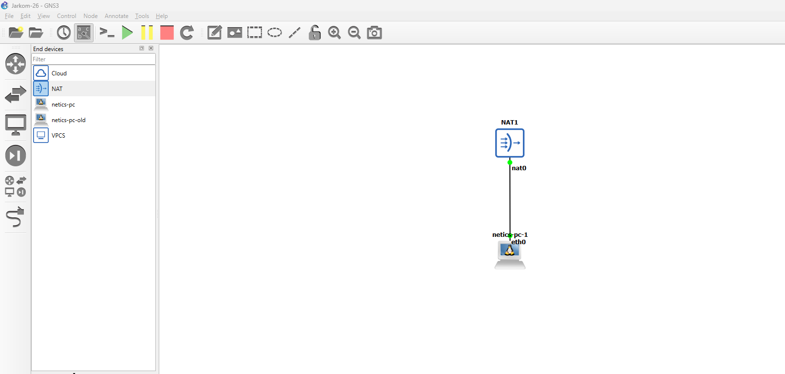

3. Klik menu **Show/Hide interface labels** untuk menampilkan informasi interface node

   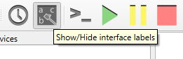

4. Lalu klik node, pilih interface `eth0`, dan klik node NAT yang ditarik tadi

   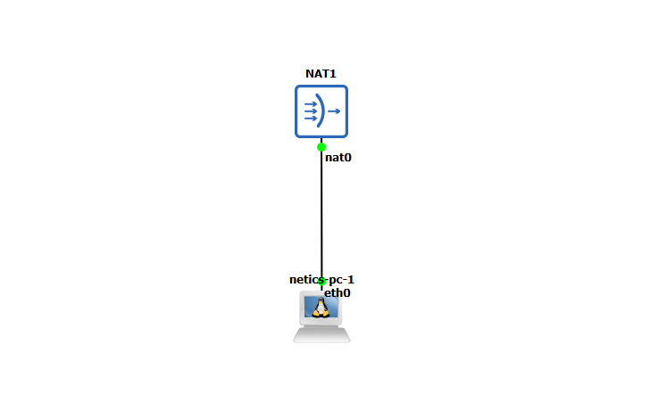

5. Lalu konfigurasi IP dari node netics-pc

   Klik kanan pada node netics-pc-1 dan pilih **Configure** dan tekan tombol **Edit** pada bagian Network Configuration.

   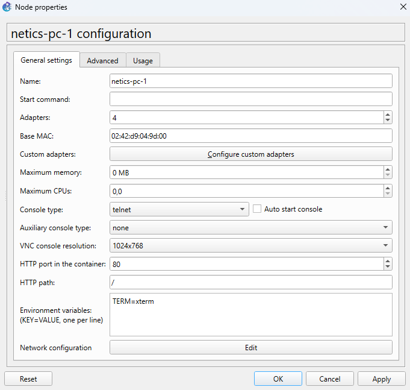

   - Cari 2 line yang seperti ini

     ```
     # auto eth0
     # iface eth0 inet dhcp
     ```

   - Uncomment kedua line tersebut, lalu save

     ```
     auto eth0
     iface eth0 inet dhcp
     ```

6. Start node

7. Akses console dari node, dan coba ping ke google, jika berhasil maka settingan Anda benar

   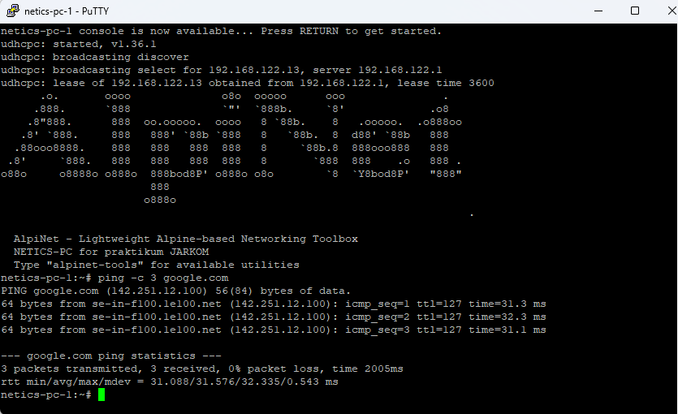

8. Node ini akan nanti digunakan sebagai router untuk modul ini, ganti nama node ini menjadi `Foosha` dengan fitur `Change hostname` di node, dan juga ganti symbol ke simbol router dengan fitur `Change symbol`

### 1.2 Membuat Topologi

1. Tambahkan beberapa node ethernet switch dan ubuntu, lalu buat hubungan antar node dan nama-nama dari node hingga seperti di gambar

   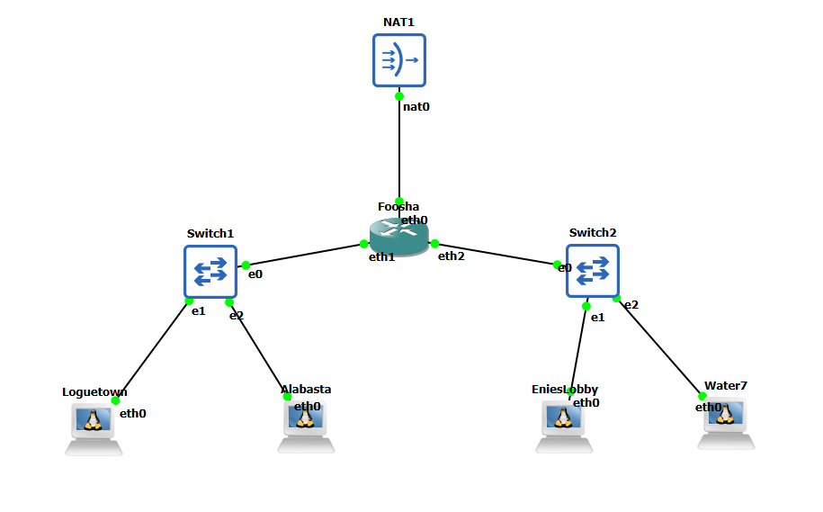

2. Gunakan fitur `Change hostname` untuk merubah nama-nama dari node

3. Lalu kita setting network masing-masing node dengan fitur `Edit network configuration` seperti yang ditunjukkan sebelumnya, kita bisa menghapus semua settingnya dan mengisi dengan settingan di bawah

   - Foosha

     ```
     auto eth0
     iface eth0 inet dhcp

     auto eth1
     iface eth1 inet static
         address [Prefix IP].1.1
         netmask 255.255.255.0

     auto eth2
     iface eth2 inet static
         address [Prefix IP].2.1
         netmask 255.255.255.0
     ```

   - Loguetown

     ```
     auto eth0
     iface eth0 inet static
         address [Prefix IP].1.2
         netmask 255.255.255.0
         gateway [Prefix IP].1.1
     ```

   - Alabasta

     ```
     auto eth0
     iface eth0 inet static
         address [Prefix IP].1.3
         netmask 255.255.255.0
         gateway [Prefix IP].1.1
     ```

   - EniesLobby

     ```
     auto eth0
     iface eth0 inet static
         address [Prefix IP].2.2
         netmask 255.255.255.0
         gateway [Prefix IP].2.1
     ```

   - Water7

     ```
     auto eth0
     iface eth0 inet static
         address [Prefix IP].2.3
         netmask 255.255.255.0
         gateway [Prefix IP].2.1
     ```

   **Penjelasan Pengertian**

   - **Gateway**: Jalur pada jaringan yang harus dilewati paket-paket data untuk dapat masuk ke jaringan yang lain.

4. Restart semua node

5. Cek semua node ubuntu apakah sudah memiliki ip yang sesuai dengan settingan dengan command `ip a`. Berikut adalah contoh untuk node `Foosha` dengan Prefix IP `10.105`, sesuaikan dengan Prefix IP kelompok kalian masing-masing

   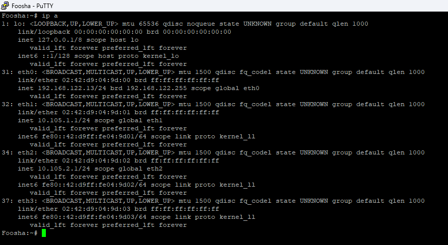

6. Topologi yang dibuat sudah bisa berjalan secara lokal, tetapi kita belum bisa mengakses jaringan keluar. Maka kita perlu melakukan beberapa hal.

   - Install tool iptables

     ```
     apk update
     apk add iptables
     ```

   - Ketikkan **`iptables -t nat -A POSTROUTING -o eth0 -j MASQUERADE -s [Prefix IP].0.0/16`** pada router `Foosha`

     **Keterangan:**

     - **iptables:** iptables merupakan suatu tools dalam sistem operasi Linux yang berfungsi sebagai filter terhadap lalu lintas data. Dengan iptables inilah kita akan mengatur semua lalu lintas dalam komputer, baik yang masuk, keluar, maupun yang sekadar melewati komputer kita. Untuk penjelasan lebih lanjut nanti akan dibahas pada Modul 5.

     - **NAT (Network Address Translation):** Suatu metode penafsiran alamat jaringan yang digunakan untuk menghubungkan lebih dari satu komputer ke jaringan internet dengan menggunakan satu alamat IP.

     - **Masquerade:** Digunakan untuk menyamarkan paket, misal mengganti alamat pengirim dengan alamat router.

     - **-s (Source Address):** Spesifikasi pada source. Address bisa berupa nama jaringan, nama host, atau alamat IP.

   - Ketikkan command `cat /etc/resolv.conf` di `Foosha`

     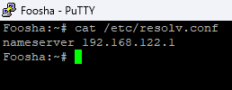

   - Ingat-ingat IP tersebut karena IP tersebut merupakan IP DNS, lalu ketikkan command ini di node ubuntu yang lain `echo nameserver [IP DNS] > /etc/resolv.conf`. Jika pada kasus contoh maka command-nya adalah `echo nameserver 192.168.122.1 > /etc/resolv.conf`.

   - Berikut merupakan contoh saat melakukan ping sebelum dan sesudah menambahkan nameserver pada node Water7

     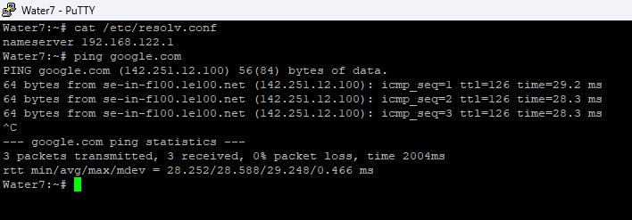

   - Semua node sekarang seharusnya sudah bisa melakukan ping ke google, yang artinya adalah sudah tersambung ke internet

## 2. Nginx Web Server

**Nginx** adalah perangkat lunak (software) yang bersifat open source yang memiliki banyak fungsi. Web server yang satu ini dikenal dengan performanya yang powerful dan memiliki banyak fitur canggih. Beberapa fungsi dari Nginx di antaranya adalah:

- Web server

- Load Balancing

- Reverse Proxy

### 2.1 Instalasi dan Penggunaan Dasar Nginx

#### 2.1.1 Buka Node Water7

Lalu jalankan perintah

```bash
apk update && apk add nginx
```

Apabila instalasi Nginx telah selesai, jangan lupa jalankan perintah berikut

```bash
mkdir -p /run/nginx
nginx -t && nginx
```

Untuk mengecek proses Nginx yang sedang berjalan, gunakan perintah

```bash
ps aux | grep '[n]ginx'
```

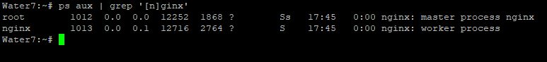

#### 2.1.2 Mengakses Web dengan Lynx

Pada client **Loguetown**, install `lynx`, lalu akses alamat IP Water7:

```bash
apk add lynx
```

```text
lynx http://[IP Water7]
```

Ganti `[IP Water7]` dengan alamat IP node tersebut. Konfigurasi bawaan paket Nginx Alpine dapat menampilkan `404 Not Found`; halaman contoh akan dibuat pada bagian konfigurasi berikutnya.

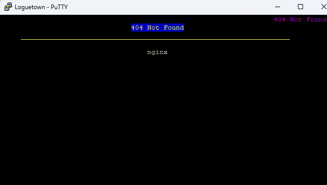

### 2.2 Konfigurasi Nginx

#### 2.2.1 EniesLobby (Nginx worker)

- install lalu setup Nginx dan PHP

  ```bash
  apk update && apk add nginx php83 php83-fpm
  ```

Contoh modul ini menggunakan PHP 8.3.

- cek versi dari PHP

  ```bash
  php83 -v
  ```

- Pastikan pengaturan `listen` pada `/etc/php83/php-fpm.d/www.conf` menggunakan alamat berikut:

  ```ini
  listen = 127.0.0.1:9000
  ```

  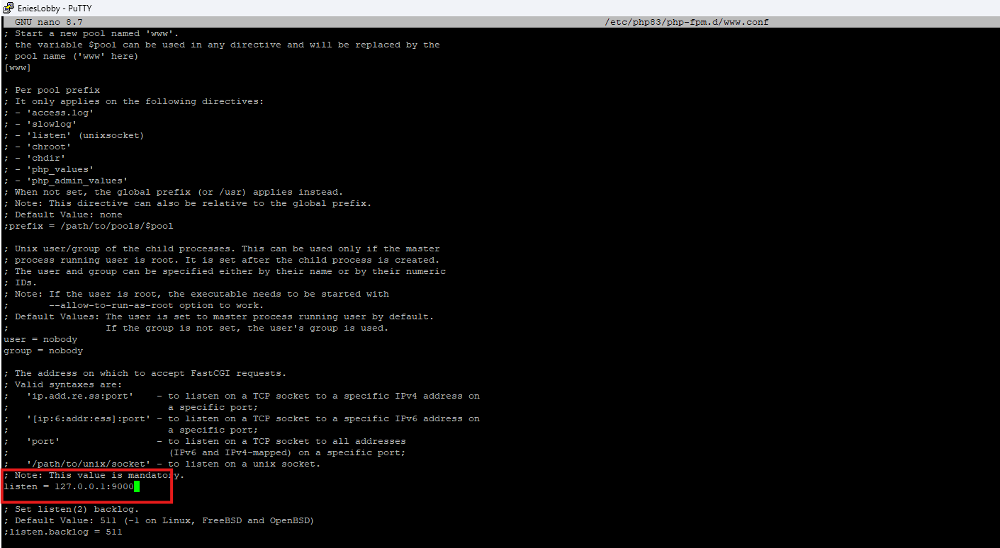

- Periksa konfigurasi PHP-FPM, lalu jalankan jika belum berjalan:

  ```bash
  php-fpm83 -t && php-fpm83
  ```

- buat direktori baru di `/var/www`, dengan nama `jarkom`

  ```bash
  mkdir -p /var/www/jarkom
  ```

- buat file `/var/www/jarkom/index.php` dengan isi berikut

  ```php
  <?php
  echo "Halo, Kamu berada di EniesLobby";
  ?>
  ```

  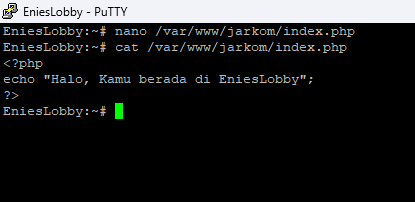

- Pada Alpine, konfigurasi situs dimuat dari `/etc/nginx/http.d/*.conf`. Edit file bawaan `/etc/nginx/http.d/default.conf` dan ganti isinya dengan server block berikut. File ini digunakan agar tidak ada dua default server pada port yang sama.

- kemudian isi dengan konfigurasi server block ini:

  ```nginx
  server {

      listen 80 default_server;

      root /var/www/jarkom;

      index index.php index.html index.htm;
      server_name _;

      location / {
          try_files $uri $uri/ /index.php?$query_string;
      }

      # pass PHP scripts to FastCGI server
      location ~ \.php$ {
          try_files $uri =404;
          include /etc/nginx/fastcgi_params;
          fastcgi_param SCRIPT_FILENAME $document_root$fastcgi_script_name;
          fastcgi_pass 127.0.0.1:9000;
      }

      location ~ /\.ht {
          deny all;
      }

      error_log /var/log/nginx/jarkom_error.log;
      access_log /var/log/nginx/jarkom_access.log;
  }
  ```

  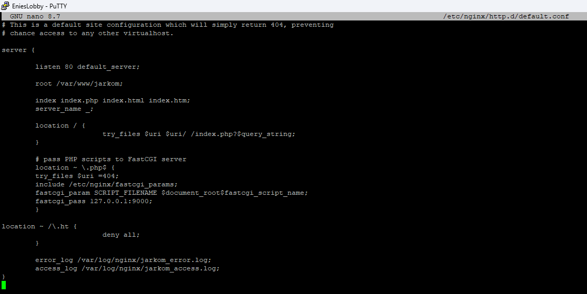

- Simpan konfigurasi, lalu periksa sintaksnya:

  ```bash
  mkdir -p /run/nginx
  nginx -t
  ```

- Jika pemeriksaan berhasil, jalankan `nginx` pada node yang belum menjalankannya. Jika Nginx sudah berjalan, terapkan perubahan dengan:

  ```bash
  nginx -s reload
  ```

- Dari client, akses `http://[IP EniesLobby]` menggunakan `lynx`. Halaman seharusnya menampilkan `Halo, Kamu berada di EniesLobby`.

  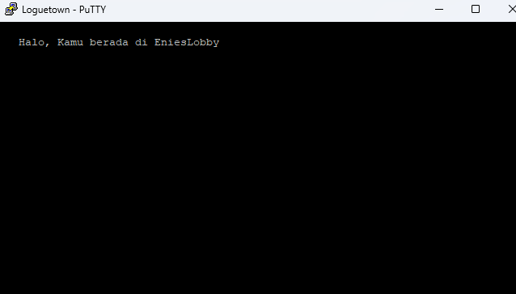

#### 2.2.2 Water7 (Nginx worker)

- lakukan konfigurasi yang sama seperti di node EniesLobby. Karena Nginx sudah dijalankan pada bagian penggunaan dasar, gunakan `nginx -s reload` setelah validasi konfigurasi. Bedakan isi `/var/www/jarkom/index.php` agar memudahkan pengujian:

  ```php
  <?php
  echo "Halo, Kamu berada di Water7";
  ?>
  ```

  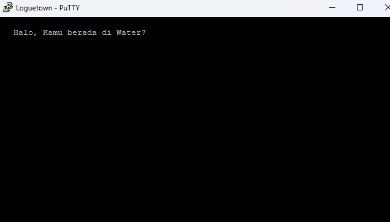

#### 2.2.3 Penjelasan Server Block

- `listen` mendefinisikan di port berapa nantinya Nginx berjalan.

- `root` menjunjukan letak direktori dari file web yang digunakan.

- `index` menentukan urutan file indeks yang akan dicoba oleh server ketika ada permintaan masuk.

- `server_name` menentukan nama host yang dilayani. Pada contoh ini, `default_server` pada `listen` menjadikan server ini tujuan permintaan yang tidak cocok dengan server lain; tanda `_` sendiri bukan wildcard.

- `location { ... }` Konfigurasi untuk menangani permintaan ke akar situs. **try_files** mencoba mencari file yang sesuai dengan **$uri**, kemudian **$uri/**, dan jika itu juga tidak ditemukan, akan mengarahkan ke index.php dengan menggunakan **data query string**.

- `location ~ \.php$` meneruskan permintaan file PHP ke PHP-FPM melalui `127.0.0.1:9000`. Alamat ini harus sama dengan nilai `listen` pada konfigurasi PHP-FPM. `SCRIPT_FILENAME` menentukan path file PHP yang akan dieksekusi, sedangkan `try_files $uri =404` memeriksa keberadaan file tersebut.

- `location ~ /\.ht` mengatur bahwa akses ke file .ht (seperti .htaccess) akan ditolak. Ini adalah langkah keamanan yang umum digunakan untuk mencegah akses ke file sensitif.

- `error_log` mengarahkan log error ke file tertentu.

- `access_log` mengarahkan log akses ke file tertenu.

- File `/etc/nginx/http.d/default.conf` dimuat melalui konfigurasi utama `/etc/nginx/nginx.conf`, sehingga tidak memerlukan symlink `sites-enabled`.

## 3. Reverse Proxy

### 3.1 Teori Forward dan Reverse Proxy

#### 3.1.1 Pengertian Proxy

Sebelum mengenal Reverse Proxy lebih jauh, perlu diketahui bahwa Reverse Proxy dan Proxy Service, seperti `Forward Proxy` adalah 2 hal yang berbeda dari cara kerjanya.

##### Forward Proxy

Secara singkat `Forward Proxy` adalah service yang disediakan oleh suatu server, dimana server ini akan menjadi perantara bagi kita dan server atau website tujuan. Jadi ketika kita mengakses suatu website yang ada di internet kita akan terlebih dahulu terhubung ke Proxy Server.

Forward proxy bertindak sebagai perantara di sisi client. Berikut contoh arsitektur sederhana yang menggunakan proxy server.


##### Reverse Proxy

Selanjutnya, `Reverse Proxy` adalah salah satu jenis server Proxy yang bertanggung jawab dalam meneruskan request client ke server. Reverse Proxy terletak diantara client dan server. Jadi, request yang dilakukan client akan diteruskan oleh Reverse Proxy untuk mencapai ke server. Mudahnya, Reverse Proxy ini berada diantara client dan server yang bertugas untuk menjamin pertukaran data antara client dan server berjalan dengan lancar.

Reverse Proxy biasanya diterapkan pada web server seperti `Apache` dan `Nginx`. Selain itu, dikutip dari [`CloudFlare`](https://www.cloudflare.com/learning/cdn/glossary/Reverse-Proxy/), Reverse Proxy juga digunakan sebagai keamanan agar proses pertukaran request dari client ke server atau sebaliknya berjalan dengan aman.

Tidak hanya itu, Reverse Proxy juga bisa melakukan kompresi data. Data yang besar akan dilakukan kompresi sehingga menjadi data dengan ukuran yang lebih kecil. Hal itu dapat membuat pertukaran data berjalan lebih cepat. Reverse Proxy juga memiliki kemampuan untuk menyeimbangkan load atau beban server agar server tidak down.


#### 3.1.2 Cara Kerja Reverse Proxy

Seperti yang sudah dijelaskan diatas, Reverse Proxy berada diantara client dan server. Fungsi utama Reverse Proxy adalah menerima dan meneruskan request dari client ke server atau sebaliknya. Cara kerja Reverse Proxy bisa digambarkan seperti contoh berikut, misalnya kamu bertindak sebagai client yang ingin mengakses suatu website. Request yang diberikan client sebelum sampai ke server akan diterima oleh reverse proxy terlebih dahulu. Setelah itu Reverse Proxy akan meneruskan ke server dan kemudian menerima balasan dari server yang nantinya akan disampaikan ke client.

#### 3.1.3 Manfaat Reverse Proxy

Karena di modul ini kita akan berfokus pada `Nginx` sebagai Reverse Proxy, maka berikut ini adalah beberapa menfaat ketika menggunakan Nginx sebagai Reverse Proxy.


Beberapa manfaat Nginx sebagi Reverse Proxy:

- `Load Balancing` - Reverse proxy dapat melakukan load balancing yang membantu mendistribusikan permintaan client secara merata di seluruh server backend atau worker. Proses ini sangat membantu dalam menghindari skenario di mana server tertentu menjadi kelebihan beban (over load) karena lonjakan permintaan yang tiba-tiba. Penyeimbangan beban juga meningkatkan redundansi seolah-olah satu server mati, proxy akan bertugas merutekan atau meredirect trafik yang masuk ke worker yang lainnya.

- `Powerful Caching` - Nginx dapat cache konten yang diterima dari respons server proxy dan menggunakannya untuk menanggapi client tanpa harus menghubungi server utama untuk konten yang sama setiap kali ada permintaan.

- `Superior Compression` - Jika server proxy tidak mengirim respons terkompresi, kita dapat mengonfigurasi Nginx untuk mengkompres `(contohnya: gzip)` respons sebelum mengirimnya ke client. Tentunya akan menghemat bandwidth dan mempercepat loading website.

- `Increased security` - Informasi mengenai server utama tidak dapat terlihat dari luar, sehingga sulit diserang oleh hacker. Perlindungan terhadap serangan seperti DDoS memerlukan konfigurasi dan mekanisme tambahan.

### 3.2 Sintaks Konfigurasi Nginx

Konfigurasi utama berada di `/etc/nginx/nginx.conf`. Directive sederhana diakhiri `;`, sedangkan blok menggunakan `{ ... }`. Komentar diawali `#`.

Struktur konteksnya adalah sebagai berikut. Ini hanya ilustrasi struktur, bukan pengganti seluruh konfigurasi bawaan:

```nginx
events {
    worker_connections 1024;
}

http {
    # File situs dimuat di dalam konteks http.
    include /etc/nginx/http.d/*.conf;
}
```

Pada file situs, `upstream` dan `server` berada dalam konteks `http`, sedangkan `location` berada di dalam `server`. Karena `/etc/nginx/http.d/default.conf` sudah dimuat di dalam `http`, tulis blok `upstream` dan `server` langsung di file tersebut tanpa membungkusnya dengan `http` lagi.

### 3.3 Reverse Proxy Menggunakan Nginx

Gunakan topologi yang sama dengan bagian [Nginx Web Server](#2-nginx-web-server) dan [Membuat Topologi](#12-membuat-topologi). **Alabasta** menjadi reverse proxy, **EniesLobby** dan **Water7** menjadi backend, serta **Loguetown** menjadi client. **Foosha** tetap menjadi router penghubung kedua subnet dan NAT.

| Node | Peran | Alamat IP |
| --- | --- | --- |
| Loguetown | Client | `[Prefix IP].1.2` |
| Alabasta | Reverse proxy / load balancer | `[Prefix IP].1.3` |
| EniesLobby | Backend Nginx | `[Prefix IP].2.2` |
| Water7 | Backend Nginx | `[Prefix IP].2.3` |

Contoh konfigurasi di bawah memakai prefix `10.105`, sesuai contoh pada bagian pembuatan topologi. Sesuaikan prefix dengan kelompok kalian. Pastikan Alabasta dapat mengakses halaman EniesLobby dan Water7 yang telah dibuat pada bagian Nginx, serta Loguetown dapat mengakses Alabasta.

Untuk contoh reverse proxy pertama, teruskan request ke **EniesLobby**. Pada bagian load balancing, gunakan kedua backend tersebut.

Pada **Alabasta**, install Nginx:

```bash
apk update && apk add nginx
mkdir -p /run/nginx
```

Ganti isi `/etc/nginx/http.d/default.conf` dengan:

```nginx
server {
    listen 80 default_server;
    server_name _;

    location / {
        proxy_pass http://10.105.2.2;
        proxy_set_header Host $host;
        proxy_set_header X-Real-IP $remote_addr;
        proxy_set_header X-Forwarded-For $proxy_add_x_forwarded_for;
    }
}
```

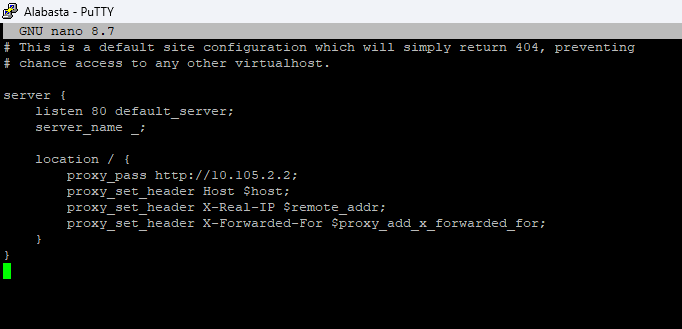

- `proxy_pass` meneruskan request ke backend EniesLobby.

- `proxy_set_header Host $host` meneruskan nama host yang diminta client.

- `X-Real-IP` menyampaikan alamat client yang terhubung ke Alabasta.

- `X-Forwarded-For` menambahkan alamat client ke daftar alamat proxy yang dilalui.

Validasi konfigurasi, lalu jalankan Nginx jika belum berjalan:

```bash
nginx -t && nginx
```

Jika Nginx sudah berjalan, gunakan `nginx -t && nginx -s reload`. Dari **Loguetown**, akses alamat Alabasta menggunakan `lynx http://[IP Alabasta]`. Halaman yang muncul seharusnya berisi pesan dari EniesLobby.


### 3.4 Load Balancing dengan Reverse Proxy

Upstream pada Nginx merujuk pada kelompok node yang digunakan sebagai backend. `proxy_pass http://backend` meneruskan request ke kelompok bernama `backend`.

#### 3.4.1 Round Robin

Merupakan algoritma load balancing default yang ada di Nginx, cara kerjanya yaitu pada topologi ini request dibagikan bergantian ke EniesLobby dan Water7, lalu kembali ke EniesLobby.

Konfigurasi:

1. Gunakan **EniesLobby dan Water7** sebagai worker menggunakan konfigurasi Nginx dan PHP-FPM pada bagian Nginx sebelumnya. Bedakan isi `index.php` pada setiap worker agar hasil pengujian menunjukkan node yang menjawab.

2. Pada **Alabasta**, ganti isi `/etc/nginx/http.d/default.conf` dari contoh satu backend sebelumnya dengan konfigurasi berikut. Sesuaikan IP worker dengan topologi kalian.

   ```nginx
   #Default menggunakan Round Robin
   upstream backend  {
       server 10.105.2.2; #IP EniesLobby
       server 10.105.2.3; #IP Water7
   }

   server {
       listen 80 default_server;
       server_name _;

       location / {
           proxy_pass http://backend;
           proxy_set_header    X-Real-IP $remote_addr;
           proxy_set_header    X-Forwarded-For $proxy_add_x_forwarded_for;
           proxy_set_header    Host $http_host;
       }

       error_log /var/log/nginx/lb_error.log;
       access_log /var/log/nginx/lb_access.log;

   }
   ```

3. Periksa dan muat ulang konfigurasi pada Alabasta:

   ```bash
   nginx -t && nginx -s reload
   ```

4. Dari **Loguetown**, akses `http://[IP Alabasta]` beberapa kali menggunakan `lynx`. Perhatikan nama worker pada halaman yang dikembalikan.

   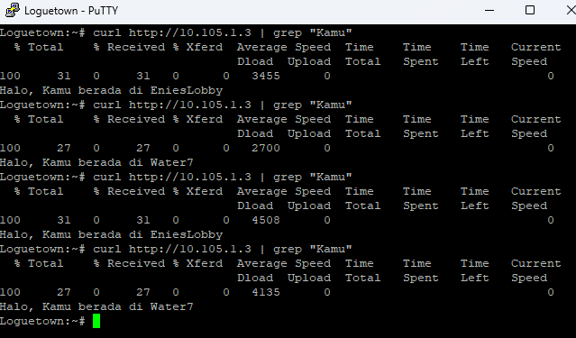

#### 3.4.2 Weighted Round Robin

Cukup dengan menetapkan weight atau beban ke masing-masing server di kumpulan server yang telah ditentukan sebelumnya. Server yang memiliki weight paling besar akan dijadikan prioritas ketika menerima request dari client

Weight dapat digunakan untuk mengoptimalkan load balancing dan memastikan bahwa server yang lebih kuat memiliki beban yang lebih besar.

Konfigurasi:

```nginx
upstream backend  {
    server 10.105.2.2 weight=4; #IP EniesLobby
    server 10.105.2.3 weight=2; #IP Water7
}
```

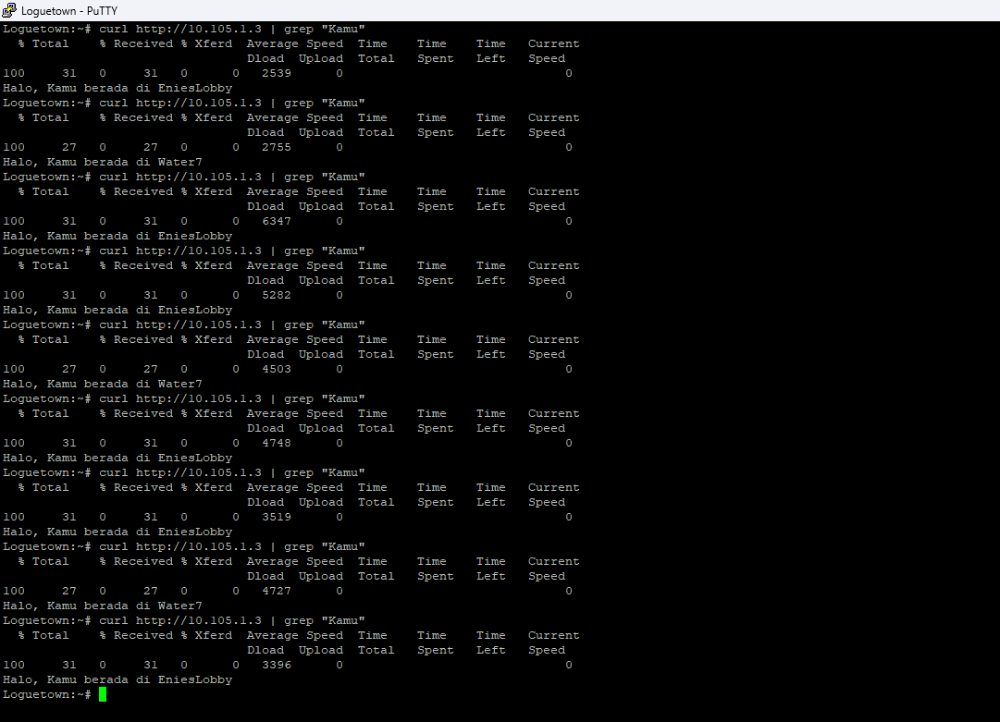

#### 3.4.3 Least Connection

Least Connection memilih worker dengan jumlah koneksi aktif paling sedikit, dengan memperhitungkan bobot server. Metode ini menggunakan jumlah koneksi, bukan pengukuran penggunaan CPU worker.

Konfigurasi:

```nginx
#Least Connection
upstream backend  {
    least_conn;
    server 10.105.2.2; #IP EniesLobby
    server 10.105.2.3; #IP Water7
}

server {
    listen 80 default_server;
    server_name _;

    location / {
        proxy_pass http://backend;
        proxy_set_header    X-Real-IP $remote_addr;
        proxy_set_header    X-Forwarded-For $proxy_add_x_forwarded_for;
        proxy_set_header    Host $http_host;
    }

    error_log /var/log/nginx/lb_error.log;
    access_log /var/log/nginx/lb_access.log;

}
```

#### 3.4.4 IP Hash

Agak berbeda dengan kedua algoritma di atas, algoritma ini akan melakukan hash berdasarkan request dari pengguna (menggunakan alamat IP dari pengguna). Request dari IP client yang sama diarahkan ke worker yang sama selama worker tersebut tersedia. Ketika server ini tidak tersedia, permintaan dari klien ini akan dilayani oleh server lain.

Konfigurasi:

```nginx
# IP Hash
upstream backend  {
    ip_hash;
    server 10.105.2.2; #IP EniesLobby
    server 10.105.2.3; #IP Water7
}

server {
    listen 80 default_server;
    server_name _;

    location / {
        proxy_pass http://backend;
        proxy_set_header    X-Real-IP $remote_addr;
        proxy_set_header    X-Forwarded-For $proxy_add_x_forwarded_for;
        proxy_set_header    Host $http_host;
    }

    error_log /var/log/nginx/lb_error.log;
    access_log /var/log/nginx/lb_access.log;
}
```

#### 3.4.5 Generic Hash

Generic hash adalah jenis load balancing yang menggunakan algoritma hash untuk mendistribusikan lalu lintas ke server backend. Algoritma hash ini menggunakan hash dari nilai tertentu untuk menentukan server backend atau worker mana yang akan menangani permintaan.

Nilai yang digunakan untuk hash dapat berupa apa saja, seperti alamat IP client, nilai HTTP headers dan lain-lain. Nilai hash ini kemudian digunakan untuk menentukan server backend mana yang akan menangani permintaan.

```nginx
upstream backend  {
    hash $request_uri consistent;
    server 10.105.2.2; #IP EniesLobby
    server 10.105.2.3; #IP Water7
}

server {
    listen 80 default_server;
    server_name _;

    location / {
        proxy_pass http://backend;
        proxy_set_header    X-Real-IP $remote_addr;
        proxy_set_header    X-Forwarded-For $proxy_add_x_forwarded_for;
        proxy_set_header    Host $http_host;
    }

    error_log /var/log/nginx/lb_error.log;
    access_log /var/log/nginx/lb_access.log;
}
```

Setiap contoh metode di atas merupakan alternatif. Ganti konfigurasi sebelumnya; jangan menambahkan beberapa blok `upstream backend` dengan nama yang sama. Setelah perubahan, jalankan `nginx -t && nginx -s reload` pada Alabasta dan ulangi pengujian dari client.

## 4. Python 3

Python 3 menyediakan modul bawaan `http.server` untuk menyajikan file melalui HTTP. Pada latihan ini, gunakan **Water7** sebagai server dan **Loguetown** sebagai client. Gunakan topologi dan konfigurasi IP yang sama dengan bagian Nginx: Water7 berada di `[Prefix IP].2.3` dan Loguetown di `[Prefix IP].1.2`, terhubung melalui Foosha. Pastikan kedua node sudah saling terhubung. Nginx tetap menggunakan port 80, sedangkan server Python menggunakan port 8000.

### 4.1 Instalasi Python 3

Pada **Water7**, jalankan:

```bash
apk update && apk add python3
python3 --version
```

### 4.2 Web Server Sederhana dengan Python 3

Buat direktori halaman web:

```bash
mkdir -p /root/python-web
```

Buat file `/root/python-web/index.html` dengan isi:

```html
<!DOCTYPE html>
<html lang="id">
<head>
    <meta charset="UTF-8">
    <title>Web Server Python</title>
</head>
<body>
    <h1>Halo dari Water7!</h1>
    <p>Halaman ini dilayani oleh Python 3.</p>
</body>
</html>
```

Jalankan server:

```bash
python3 -m http.server 8000 --bind 0.0.0.0 --directory /root/python-web
```

- `-m http.server`: menjalankan modul HTTP server.

- `8000`: port server, terpisah dari Nginx pada port 80.

- `--bind 0.0.0.0`: mendengarkan pada semua interface IPv4.

- `--directory`: menentukan direktori file yang dilayani.

Biarkan console server tetap berjalan selama pengujian. Tekan **Ctrl+C** untuk menghentikannya. Modul ini melayani file statis; file PHP tidak dieksekusi.

### 4.3 Pengujian dari Client

Pada **Loguetown**, install `lynx`:

```bash
apk update && apk add lynx
```

Akses server, mengganti `[IP Water7]` dengan alamat IP sebenarnya:

```text
lynx http://[IP Water7]:8000/
```

Halaman akan menampilkan **“Halo dari Water7!”**. Console Water7 mencatat request beserta status HTTP, misalnya `GET / HTTP/1.1` dengan status `200`.

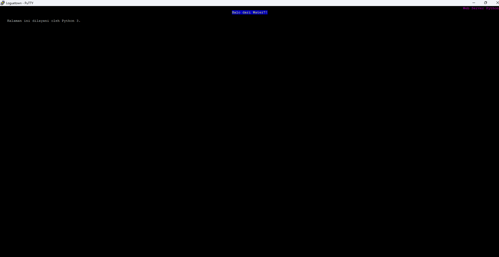

Jika gagal, periksa konektivitas antarnode, port `8000`, dan proses server. Jika muncul daftar file, pastikan `index.html` tersimpan pada direktori yang dilayani.

## 5. Computer Network Models

### 5.1 Pendahuluan

Sebelum masuk ke Static Routing, alangkah baiknya kita kenali terlebih dahulu bagaimana jaringan pada komputer bekerja. Maka dari itu, mari kita berkenalan dulu dengan model yang ada pada jaringan komputer. Selamat membaca!

Mendesain dan mengatur jaringan merupakan pekerjaan yang sangat sulit karena harus mengintegrasikan banyak hal, seperti hardware, software, firmware, dan lain-lainnya. Untuk itu, perlu suatu cara untuk menyederhanakan proses ini agar bisa dilakukan dengan lebih mudah. Maka dari itu, konsep layering hadir untuk mneyeleseaikan masalah ini. Dalam konsep ini, dibuat beberapa layer/lapisan yang mana masing-masing lapisan akan memiliki 1 tanggung jawab dan berkomunikasi dengan lapisan yang lain. Umumnya, ada 2 model yang menggunakan konsep yang sama dan telah diadopsi di dunia, yaitu **OSI Model** dan **TCP/IP Model**.

### 5.2 OSI Model

OSI (_Open Systems Interconnection_) Model merupakan sebuah pedoman yang mengatur bagaimana komputer berkomunikasi dalam sebuah jaringan. Model ini memiliki 7 lapisan, dengan masing-masing lapisan memiliki tugasnya masing-masing. Lapisan itu terdiri dari:


#### 5.2.1 Physical Layer

Lapisan ini (**Layer 1**), sesuai namanya, merupakan lapisan fisik dan paling bawah dari OSI Model. Tugasnya cukup sederhana dan jelas, yaitu mentransmisikan informasi dalam bentuk bits, bisa berupa arus listrik atau gelombang elektromagnetik. Ketika menerima data, lapisan ini akan mengubah data tersebut dalam bentuk 0 dan 1 sebelum kemudian dikirim ke Data Link Layer. Ada beberapa perangkat yang bekerja pada lapisan ini, yaitu _repeater_, _hub_, _modem_, dan kabel.


#### 5.2.2 Data Link Layer

Tugas utama Data Link Layer (**Layer 2**) adalah mengirimkan informasi dari perangkat ke perangkat yang terhubung secara langsung (_between adjacent nodes_). Lapisan ini juga memastikan bahwa informasi yang diberikan tepat dengan mekanisme _error control_ nya. Pada _layer_ ini, penentuan sumber dan tujuan data (_Addressing Scheme_) akan dikirimkan berdasarkan **MAC Address**, biasa dikenal sebagai _hardware address_ atau _physical address_ juga. Selain itu, _packet_ pada layer ini biasa dikenal sebagai **Frame**. Ada beberapa perangkat yang bekerja pada lapisan ini, seperti _switch_ dan _bridge_. Lapisan ini memiliki banyak protokol, beberapa yang paling kita kenali adalah _IEEE 802.3_ untuk Ethernet dan _IEEE 802.11_ untuk WiFi.

> Awalnya, _switch_ hanya beroperasi pada Layer 2. Namun, _switch_ modern sudah mulai bisa beroperasi pada Layer 3 juga.


#### 5.2.3 Network Layer

Selanjutnya adalah Network Layer (**Layer 3**), dimana lapisan ini bertugas untuk memastikan bahwa _packet_ bisa sampai dari awal sampai akhir. Jika data link layer bisa dikatakan sebagai komunikasi _node-to-node_, maka network layer bisa dikatakan sebagai komunikasi _end-to-end_. Misal ada suatu paket yang ingin dikirimkan dari rumah X di kota A ke rumah Y di kota B, dimana paket akan melewati banyak kantor pos. Data link layer memastikan paket sampai dari kantor pos satu ke kantor pos berikutnya, sedangkan network layer memastikan bahwa paket sampai dari rumah X ke rumah Y.

Pada lapisan ini, data yang dikirimkan biasa dikenal sebagai **Packet** dan penentuan alamat (_Addressing Scheme_) adalah berdasarkan **IP Address**. Lapisan ini juga bertanggung jawab untuk melakukan _routing_ untuk memasitkan _packet_ sampai pada tujuan. Perangkat yang paling umum bekerja pada layer 3 adalah _router_. Selain itu, beberapa protokol yang bekerja pada lapisan ini diantaranya adalah _Internet Protocol (IP)_, _Internet Control Message Protocol (ICMP)_ yang biasa ditemukan pada command `ping`, dan protokol _routing_ seperti _RIP_, _OSPF_, dan _BGP_.


Ketika suatu data dikirimkan, frame tersebut akan memiliki 2 alamat, yaitu _MAC Address_ untuk komunikasi secara langsung pada perangkat selanjutnya dan _IP Address_ untuk komunikasi dari awal sampai akhir. Setelah sampai pada suatu perangkat, keterangan _MAC Address_ (seperti source dan destination) akan berubah. Maka dari itu, diciptakan suatu protokol bernama **Address Resolution Protocol (ARP)** untuk mendapatkan _MAC Address_ berdasarkan _IP Address_.


#### 5.2.4 Transport Layer

Oke, _packet_ sudah dengan benar sampai pada tujuan. Namun, bagaimana kita tahu aplikasi mana yang memerlukan _packet_ ini? Di sinilah Transport Layer (**Layer 4**) bekerja. Lapisan ini memastikan bahwa data sampai dari aplikasi (_process_) awal sampai aplikasi (_process_) tujuan dengan benar. Lapisan ini cukup mirip dengan konsep _Inter-Process Communication_, karena Layer 4 berkomunikasi dari _process_ ke _process_ lain, pada _host_ yang berbeda. Maka dari itu, tujuan awal dan akhir (_Addressing Scheme_) dari Layer 4 adalah dari **Port Number**. Data yang berada pada lapisan ini kerap disebut sebagai **Segment**. Ada beberapa protokol dari transport layer, dengan 2 yang paling dikenal dan sering digunakan adalah **TCP** untuk komunikasi yang _reliable_ namun lambat dan **UDP** untuk komunikasi yang _unreliable_ namun cepat.


#### 5.2.5 Session Layer

Pada Session Layer (**Layer 5**), terjadi beberapa mekanisme untuk memastikan komunikasi berjalan dengan lancar. Maka dari itu, lapisan ini bertanggung jawab dalam membuat, mengoordinasikan, dan mengakhiri koneksi/sambungan pada dua _host_. Ada beberapa aplikasi yang memanfaatkan layer ini, seperti penggunaan _Remote Procedure Call_ (RPC) adn _Zone Information Protocol_ (ZIP) milik AppleTalk.


#### 5.2.6 Presentation Layer

Presentation Layer (**Layer 6**) kerap dikenal juga sebagai **Translation Layer**. Pada lapisan ini, data yang diterima akan diterjemahkan sesuai dengan format yang ada. Tak hanya itu, lapisan ini juga bertugas untuk melakukan enkripsi data agar informasi yang dikirim melalui suatu jaringan bisa terjamin keamanannya.


#### 5.2.7 Application Layer

Sebagai lapisan puncak dari OSI Model, Application Layer (**Layer 7**) adalah sumber yang membuat data dan tujuan akhir dari sebuah data. Lapisan ini juga sebagai perantara antara aplikasi dengan jaringan komputer. Pada layer ini, banyak sekali protokol yang digunakan dan sering kita temui, seperti HTTP, Telnet, FTP, SSH, dan lain-lain.


### 5.3 TCP/IP Model

TCP/IP Model merupakan sebuah pedoman layaknya OSI Model. Namun, model ini kerap dianggap lebih modern, fleksibel, dan mudah sehingga telah menjadi standar yang diadopsi oleh mayoritas perangkat di dunia. Model ini mirip dengan OSI Model, dengan beberapa layer digabung menjadi satu. Di sini, Layer 5 sampai Layer 7 digabung menjadi "Application Layer". Kemudian, ada beberapa pihak yang menggabung Layer 1 dan Layer 2 menjadi "Network Interface Layer" atau "Network Access Layer". Namun, banyak juga yang membiarkan Layer 1 dan Layer 2 terpisah seperti OSI Model. Maka dari itu, TCP/IP Model memiliki 4 atau 5 layer.


## 6. DNS (Domain Name System)

### 6.1 Teori

#### 6.1.1 Pengertian


Bayangkan kalian sedang mencari nomor telepon seseorang di buku kontak ponsel kalian. Umumnya kalian akan mencari dengan menggunakan nama orang yang dituju, bukan nomor teleponnya. Nah, DNS memiliki cara kerja yang sama. Saat kalian ingin mengakses sebuah website, kalian akan mengetik nama website tersebut (contohnya "www.youtube.com"), dan DNS akan mencari tahu nomor IP server yang menyimpan websute tersebut. Setelah itu, komputer kalian akan menghubungi server yang menggunakan alamat IP tersebut.

##### Jadi, DNS adalah...

DNS (_Domain Name System_) adalah sistem penamaan untuk semua device (smartphone, computer, atau
network) yang terhubung dengan internet. DNS Server berfungsi menerjemahkan nama domain menjadi alamat IP. DNS dibuat guna untuk menggantikan sistem penggunaan file host yang dirasa tidak efisien.

#### 6.1.2 Cara Kerja


Berikut adalah cara kerja DNS:

1. Ketika kamu mengetik alamat website (seperti www.contoh.com) di browser, komputer (client) akan meminta alamat IP dari website tersebut ke server DNS.

2. Jika server DNS sudah tahu alamat IP dari website itu, maka server DNS akan mengirimkan alamat IP tersebut kembali ke komputer kamu.

3. Jika server DNS tidak tahu alamat IP-nya, server tersebut akan bertanya ke server DNS lain sampai menemukan alamat IP yang tepat.

4. Setelah alamat IP ditemukan, server DNS mengirimkannya ke komputer kamu, dan barulah browser dapat mengakses website tersebut.

Hal ini mirip seperti saat mencari nomor telepon seseorang di buku kontak. Kalau buku kontak pertama tidak punya nomornya, kalian bisa mencari di buku kontak lainnya.

#### 6.1.3 Aplikasi DNS Server

##### Apa itu DNS Server?

Bayangkan DNS server seperti penerjemah. Ketika kamu mengetik nama website di browser, komputer tidak langsung mengerti nama tersebut. Jadi, komputer bertanya ke DNS server untuk "menerjemahkan" nama website menjadi alamat IP, seperti nomor rumah di internet. Setelah DNS server memberikan alamat IP, komputer kamu bisa menghubungi website itu.

Untuk praktikum jarkom kita menggunakan aplikasi bind
 sebagai DNS server, karena BIND(Berkley Internet Naming Daemon) adalah DNS server yang paling banyak digunakan dan juga memiliki fitur-fitur yang cukup lengkap.

#### 6.1.4 Jenis DNS Record

##### Apa itu DNS Record?

DNS record adalah catatan di DNS server yang membantu menghubungkan nama website yang kalian ketik dengan alamat IP servernya. Jadi, saat kalian mengetik nama website (seperti www.youtube.com), DNS record memberitahu browser ke mana harus pergi untuk menemukan website tersebut, seperti petunjuk arah di internet.

| Tipe  | Deskripsi                                                                                                                                   |
| ----- | :------------------------------------------------------------------------------------------------------------------------------------------ |
| A     | Memetakan nama domain ke alamat IP (IPv4) dari komputer hosting domain                                                                      |
| AAAA  | AAAA record hampir mirip A record, tapi mengarahkan domain ke alamat Ipv6                                                                   |
| CNAME | Alias ​​dari satu nama ke nama lain: pencarian DNS akan dilanjutkan dengan mencoba lagi pencarian dengan nama baru                          |
| NS    | Delegasikan zona DNS untuk menggunakan authoritative name servers yang diberikan                                                            |
| PTR   | Digunakan untuk Reverse DNS (Domain Name System) lookup                                                                                     |
| SOA   | Mengacu server DNS yang mengediakan otorisasi informasi tentang sebuah domain Internet                                                      |
| TXT   | Mengijinkan administrator untuk memasukan data acak ke dalam catatan DNS, catatan ini juga digunakan di spesifikasi Sender Policy Framework |

#### 6.1.5 SOA (Start of Authority)

##### Apa itu SOA?

SOA (Start of Authority) adalah catatan penting dalam DNS yang memberikan informasi tentang pengelolaan suatu DNS zone. Kita bisa membayangkan DNS zone seperti kompleks perumahan, dan SOA record sebagai pemilik kompleks yang bertanggung jawab untuk semua rumah di dalamnya.

##### Apa itu DNS Zone?

DNS zone adalah bagian dari sistem DNS yang mengelola semua catatan untuk satu domain atau subdomain. Seperti sebuah kompleks perumahan yang memiliki banyak rumah, setiap rumah mewakili catatan DNS (seperti A record, CNAME record, dll.) dalam zone tersebut. Semua catatan ini bekerja sama untuk memastikan bahwa informasi di internet bisa diakses dengan benar.

Adalah informasi yang dimiliki oleh suatu DNS zone.

| Nama    | Deskripsi                                                                                                                                                                                                                                                                        |
| ------- | :------------------------------------------------------------------------------------------------------------------------------------------------------------------------------------------------------------------------------------------------------------------------------- |
| Serial  | Jumlah revisi dari file zona ini. Kenaikan nomor ini setiap kali file zone diubah sehingga perubahannya akan didistribusikan ke server DNS sekunder manapun                                                                                                                      |
| Refresh | Jumlah waktu dalam detik bahwa nameserver sekunder harus menunggu untuk memeriksa salinan baru dari zona DNS dari nameserver utama domain. Jika file zona telah berubah maka server DNS sekunder akan memperbarui salinan zona tersebut agar sesuai dengan zona server DNS utama |
| Retry   | Jumlah waktu dalam hitungan detik bahwa nameserver utama domain (atau server) harus menunggu jika upaya refresh oleh nameserver sekunder gagal sebelum mencoba refresh zona domain dengan nameserver sekunder itu lagi                                                           |
| Expire  | Jumlah waktu dalam hitungan detik bahwa nameserver sekunder (atau server) akan menahan zona sebelum tidak lagi mempunyai otoritas                                                                                                                                                |
| Minimum | Jumlah waktu dalam hitungan detik bahwa catatan sumber daya domain valid. Ini juga dikenal sebagai TTL minimum, dan dapat diganti oleh TTL catatan sumber daya individu                                                                                                          |
| TTL     | (waktu untuk tinggal) - Jumlah detik nama domain di-cache secara lokal sebelum kadaluarsa dan kembali ke nameserver otoritatif untuk informasi terbaru                                                                                                                           |

---

### 6.2 Praktik

#### 6.2.1 Membuat Topologi

Buat topologi seperti di [pengenalan GNS3](https://github.com/arsitektur-jaringan-komputer/Modul-Jarkom/tree/master/Modul-GNS3#membuat-topologi) kemarin.

Kita akan membuat node `EniesLobby` sebagai DNS server.

#### 6.2.2 Instalasi BIND

- Buka _EniesLobby_ dan update package lists dengan menjalankan command:

  ```
  apk update
  ```

- Setalah melakukan update silahkan install aplikasi bind
  pada _EniesLobby_ dengan perintah:

  ```
  apk add bind
  ```

  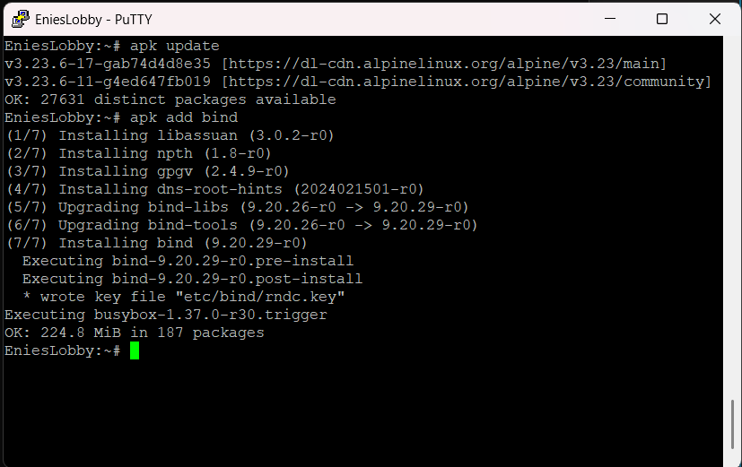

#### 6.2.3 Pembuatan Domain

Kemudian, kita akan membuat domain **jarkom2026.com**.

- Lakukan perintah pada _EniesLobby_. Isikan seperti berikut:

  ```
  nano /etc/bind/named.conf.local
  ```

- Isikan configurasi domain **jarkom2026.com** sesuai dengan syntax berikut:

  ```
  zone "jarkom2026.com" {
      type master;
      file "/etc/bind/jarkom/jarkom2026.com";
  };
  ```

  

- Buat folder **jarkom** di dalam **/etc/bind**

  ```
  mkdir /etc/bind/jarkom
  ```

- Isi file config /etc/bind/jarkom/jarkom2026.com seperti berikut, jangan lupa sesuaikan IP EniesLobby

  ```
  ;
  ; BIND data file for local loopback interface
  ;
  $TTL    604800
  @       IN      SOA     jarkom2026.com. root.jarkom2026.com. (
                                2022100601         ; Serial
                                  604800         ; Refresh
                                    86400         ; Retry
                                  2419200         ; Expire
                                   604800 )       ; Negative Cache TTL
  ;
  @       IN      NS      jarkom2026.com.
  @       IN      A       10.105.2.2     ; IP EniesLobby
  @       IN      AAAA    ::1
  ```

  

- Restart bind
  dengan perintah

  ```
  named -c /etc/bind/named.conf.local //untuk restart dan berjalan di background

  ATAU

  named -c /etc/bind/named.conf.local -g //untuk restart sekaligus debugging
  ```

#### 6.2.4 Pengaturan Nameserver pada Client

##### Apa itu nameserver?

Nameserver adalah seperti petugas yang memberi arahan di jalan di dunia internet. Ketika kamu mengetik nama website (misalnya, www.contoh.com) di browser, nameserver adalah yang bertanggung jawab untuk mencari tahu di mana website itu berada dan memberi tahu browser alamat IP-nya.

Domain yang kita buat tidak akan langsung dikenali oleh client oleh sebab itu kita harus merubah settingan nameserver yang ada pada client kita.

- Pada client _Loguetown_ dan _Alabasta_ arahkan nameserver menuju IP _EniesLobby_ dengan mengedit file _resolv.conf_ dengan mengetikkan perintah

  ```
  nano /etc/resolv.conf
  ```

  

- Untuk mencoba koneksi DNS, lakukan ping domain **jarkom2026.com** dengan melakukan perintah berikut pada client _Loguetown_ dan _Alabasta_

  ```
  ping -4 -c 5 jarkom2026.com
  ```

  

#### 6.2.5 Reverse DNS (Record PTR)

Jika pada pembuatan domain sebelumnya DNS server kita bekerja menerjemahkan string domain **jarkom2026.com** kedalam alamat IP agar dapat dibuka, maka Reverse DNS atau Record PTR digunakan untuk menerjemahkan alamat IP ke alamat domain yang sudah diterjemahkan sebelumnya.

- Edit file **/etc/bind/named.conf.local** pada _EniesLobby_

  ```
  nano /etc/bind/named.conf.local
  ```

- Lalu tambahkan konfigurasi berikut ke dalam file **named.conf.local**. Tambahkan reverse dari 3 byte awal dari IP yang ingin dilakukan Reverse DNS. Karena di contoh saya menggunakan IP `10.105.2` untuk IP dari records, maka reversenya adalah `2.105.10`

  ```
  zone "2.105.10.in-addr.arpa" {
      type master;
      file "/etc/bind/jarkom/2.105.10.in-addr.arpa";
  };
  ```

  

- Copykan file **/etc/bind/jarkom/jarkom2026.com** ke dalam folder **jarkom** yang baru saja dibuat dan ubah namanya menjadi **2.105.10.in-addr.arpa**

  ```
  cp /etc/bind/jarkom/jarkom2026.com /etc/bind/jarkom/2.105.10.in-addr.arpa
  ```

  _Keterangan 2.105.10 adalah 3 byte pertama IP EniesLobby yang dibalik urutan penulisannya_

- Edit file **2.105.10.in-addr.arpa** menjadi seperti gambar di bawah ini

  

- Kemudian restart bind
  dengan perintah

  ```
  named -c /etc/bind/named.conf.local
  ```

- Untuk mengecek apakah konfigurasi sudah benar atau belum, lakukan perintah berikut pada client _Loguetown_

  ```
  // Install package dnsutils
  // Pastikan nameserver di /etc/resolv.conf telah dikembalikan sama dengan nameserver dari Foosha
  apk update
  apk add bind-tools

  //Kembalikan nameserver agar tersambung dengan EniesLobby
  host -t PTR "IP EniesLobby"
  ```

  

#### 6.2.6 Record CNAME

Record CNAME adalah sebuah record yang membuat alias name dan mengarahkan domain ke alamat/domain yang lain.

Langkah-langkah membuat record CNAME:

- Buka file **jarkom2026.com** pada server _EniesLobby_ dan tambahkan konfigurasi seperti pada gambar berikut:

  

- Kemudian restart bind
  dengan perintah

  ```
  named -c /etc/bind/named.conf.local
  ```

- Lalu cek dengan melakukan `host -t CNAME www.jarkom2026.com` atau `ping www.jarkom2026.com -c 5`. Hasilnya harus mengarah ke host dengan IP _EniesLobby_.

  

#### 6.2.7 Membuat DNS Slave

DNS Slave adalah DNS cadangan yang akan diakses jika server DNS utama mengalami kegagalan. Kita akan menjadikan server _Water7_ sebagai DNS slave dan server _EniesLobby_ sebagai DNS masternya.

##### Konfigurasi Pada Server EniesLobby

- Edit file **/etc/bind/named.conf.local** dan sesuaikan dengan syntax berikut

  ```
  zone "jarkom2026.com" {
      type master;
      notify yes;
      also-notify { "IP Water7"; }; // Masukan IP Water7 tanpa tanda petik
      allow-transfer { "IP Water7"; }; // Masukan IP Water7 tanpa tanda petik
      file "/etc/bind/jarkom/jarkom2026.com";
  };
  ```

  

- Lakukan restart bind

  ```
  named -c /etc/bind/named.conf.local
  ```

##### Konfigurasi Pada Server Water7

- Buka _Water7_ dan update package lists dengan menjalankan command:

  ```
  apk update
  ```

- Setalah melakukan update silahkan install aplikasi bind
  pada _Water7_ dengan perintah:

  ```
  apk add bind
  ```

- Kemudian buka file **/etc/bind/named.conf.local** pada Water7 dan tambahkan syntax berikut:

  ```
  zone "jarkom2026.com" {
      type slave;
      masters { "IP EniesLobby"; }; // Masukan IP EniesLobby tanpa tanda petik
      file "/var/lib/bind/jarkom2026.com";
  };
  ```

  

- Lakukan restart bind

  ```
  named -c /etc/bind/named.conf.local
  ```

##### Testing

- Pada server _EniesLobby_ silahkan matikan service bind

  ```
  killall named
  ```

- Pada client _Loguetown_ pastikan pengaturan nameserver mengarah ke IP _EniesLobby_ dan IP _Water7_

  

- Lakukan ping ke jarkom2026.com pada client _Loguetown_. Jika ping berhasil maka konfigurasi DNS slave telah berhasil

  

#### 6.2.8 Membuat Subdomain

Subdomain adalah bagian dari sebuah nama domain induk. Subdomain umumnya mengacu ke suatu alamat fisik di sebuah situs contohnya: **jarkom2026.com** merupakan sebuah domain induk. Sedangkan **luffy.jarkom2026.com** merupakan sebuah subdomain.

- Pada _EniesLobby_, edit file **/etc/bind/jarkom/jarkom2026.com** lalu tambahkan subdomain untuk **jarkom2026.com** yang mengarah ke IP _Water7_.

  ```
  nano /etc/bind/jarkom/jarkom2026.com
  ```

- Tambahkan konfigurasi seperti pada gambar ke dalam file **jarkom2026.com**.

  

- Restart service bind di EniesLobby dan Water7

  ```
  named -c /etc/bind/named.conf.local
  ```

- Coba ping ke subdomain dengan perintah berikut dari client _Loguetown_

  ```
  ping -4 -c 5 enmity.jarkom2026.com

  ATAU

  host -t A enmity.jarkom2026.com
  ```

  

#### 6.2.9 Delegasi Subdomain

Delegasi subdomain adalah proses di mana pemilik domain memberikan wewenang kepada server DNS lain untuk mengelola subdomain tertentu. Ini memungkinkan subdomain tersebut dikelola secara terpisah dari domain utamanya.

##### Konfigurasi Pada Server EniesLobby

- Pada _EniesLobby_, edit file **/etc/bind/jarkom/jarkom2026.com** dan ubah menjadi seperti di bawah ini sesuai dengan pembagian IP _EniesLobby_ masing-masing.

  ```
  nano /etc/bind/jarkom/jarkom2026.com
  ```

  

- Kemudian edit file **/etc/bind/named.conf.local** pada _EniesLobby_.

  ```
  nano /etc/bind/named.conf.local
  ```

- tambahkan options

  ```
  options {
    allow-query { any; };
  };
  ```

- Kemudian edit file **/etc/bind/named.conf.local** menjadi seperti gambar di bawah:

  ```
  zone "jarkom2026.com" {
      type master;
      file "/etc/bind/jarkom/jarkom2026.com";
      allow-transfer { "IP Water7"; }; // Masukan IP Water7 tanpa tanda petik
  };
  ```

  

- Setelah itu restart bind

  ```
  named -c /etc/bind/named.conf.local
  ```

##### Konfigurasi Pada Server Water7

- Pada _Water7_ edit file **/etc/bind/named.conf.local**

  ```
  nano /etc/bind/named.conf.local
  ```

- tambahkan juga options

  ```
  options {
    allow-query { any; };
  };
  ```

- Lalu edit file **/etc/bind/named.conf.local** menjadi seperti gambar di bawah:

  

- Kemudian buat direktori dengan nama **delegasi**

  ```
  mkdir /etc/bind/delegasi
  nano /etc/bind/delegasi/its.jarkom2026.com
  ```

- Kemudian edit file **its.jarkom2026.com** menjadi seperti dibawah ini

  

- Restart bind

  ```
  named -c /etc/bind/named.conf.local
  ```

##### Testing

- Lakukan ping ke domain **its.jarkom2026.com** dan **integra.its.jarkom2026.com** dari client _Loguetown_

  

#### 6.2.10 DNS Forwarder

DNS Forwarder digunakan untuk mengarahkan DNS Server ke IP yang ingin dituju.

- Edit file **/etc/bind/named.conf.local** pada server _EniesLobby_

- Dan tambahkan forwarder ke ip Foosha

  ```
  forwarders {
    10.105.2.1;
  };
  ```

  

- Restart bind

  ```
  named -c /etc/bind/named.conf.local
  ```

- Harusnya jika nameserver pada file **/etc/resolv.conf** di client diubah menjadi IP EniesLobby maka akan di forward ke IP DNS GNS3 yaitu IP nameserver yang ada di Foosha dan bisa mendapatkan koneksi.

- Coba ping google.com pada Loguetown, kalau benar maka tetap bisa mendapatkan respon dari google

  

### 6.3 Konfigurasi Zone File

1. **Penulisan Serial**

   Ditulis dengan format YYYYMMDDXX. Serial di increment setiap melakukan perubahan pada file zone.

   ```
   YYYY adalah tahun
   MM adalah bulan
   DD adalah tanggal
   XX adalah counter
   ```

   Contoh:

   

2. **Penggunaan Titik**

   

   Pada salah satu contoh di atas, dapat kita amati pada kolom keempat terdapat record yang menggunakan titik pada akhir kata dan ada yang tidak. Penggunaan titik berfungsi sebagai penentu FQDN (Fully-Qualified Domain Name) suatu domain.

   Contohnya jika "**jarkom2026.com.**" di akhiri dengan titik maka akan dianggap sebagai FQDN dan akan dibaca sebagai "**jarkom2026.com**" , sedangkan ns1 di atas tidak menggunakan titik sehingga dia tidak terbaca sebagai FQDN. Maka ns1 akan di tambahkan di depan terhadap nilai $ORIGIN sehinga ns1 akan terbaca sebagai "**ns1.jarkom2026.com**" . Nilai $ORIGIN diambil dari penamaan zone yang terdapat pada _/etc/bind/named.conf.local_.

3. **Penulisan Name Server (NS) record**

   Salah satu aturan penulisan NS record adalah dia harus menuju A record., bukan CNAME.

### 6.4 Latihan

1. Buatlah agar bila kita mengecek _IP EniesLobby_ menggunakan dnsutils (host -t PTR 'IP EniesLobby') hasilnya ip tersebut dimiliki oleh domain **jarkom.com** !

2. Buatlah subdomain **seru.jarkom.com**, **pre-test.jarkom.com**, dan **cool.jarkom.com** yang mengarah ke _IP Water7_!

3. Buatlah subdomain **kerja.jarkom.com**. Lalu buatlah subdomain dalam subdomain dalam subdomain **yyy.lagi.ngerjain.jarkom.com** yang mengarah ke EniesLobby ! (yyy = 3 digit NRP terakhir)

4. Buat record CNAME **bagus.jarkom.com** dan **semangat.yyy.jarkom.com** yang mengarah ke **jarkom.com**! (yyy = 3 digit NRP terakhir)

5. Delegasikan subdomain **yyy.ngerjain.jarkom.com** dan **asyik.yyy.ngerjain.jarkom.com** dari EniesLobby ke Water7 ! (yyy = 3 digit NRP terakhir)

### 6.5 Referensi

- https://computer.howstuffworks.com/dns.htm

- http://knowledgelayer.softlayer.com/faq/what-does-serial-refresh-retry-expire-minimum-and-ttl-mean

- https://en.wikipedia.org/wiki/List_of_DNS_record_types

- https://kb.indowebsite.id/knowledge-base/pengertian-catatan-dns-atau-record-dns/

## 7. Static Routing

Setelah kita memahami bagaimana cara jaringan komputer di dunia bekerja pada umumnya, perangkat-perangkat yang digunakan untuk mendukung terjadinya komunikasi di internet, protokol yang dipatuhi, dan lain-lainnya, maka kita akan masuk ke dalam konsep yang tak kalah penting dan akan sering kita temui, yaitu **Routing**.

### 7.1 Pengertian

Jika IP Address bisa kita ibaratkan sebuah alamat rumah, maka sekarang mari kita bayangkan kita sedang berada di suatu perumahan, katakanlah perumahan A. Di perumahan ini, penduduknya mengikuti aturan alamat ruamah yang sama, yaitu huruf A diikuti oleh angka. Misal, tetanggamu yang bernama Bapak Hassan memiliki alamat rumah A-17, Ibu Rumrowi memiliki alamat rumah A-32, dan seterusnya. Sebagai penduduk setempat, kamu kenal dengan mereka dan tahu bagaimana cara mengunjungi rumah mereka tanpa bantuan orang lain.

Suatu hari, kamu diberi tugas untuk mengirimkan makanan ke alamat rumah B-03. Namun, kamu tidak kenal alamat ini karena tidak diawali oleh huruf A seperti biasanya. Maka dari itu, kamu menghubungi kantor pos perumahan dengan alamat A-01 (yang mana kamu tahu letaknya) dan meminta bantuan mereka untuk mengirimkan makanan tersebut. Sebagai kantor pos, mereka memiliki data alamat di seluruh kota, sehingga mereka tahu di mana letak rumah B-01 ini dan ke mana harus memberikan makanan tersebut. Jadi, kamu cukup pergi ke A-01 dan menyerahkan makanan tersebut yang memiliki tujuan B-01. Sisanya akan diurus oleh kantor pos.

Konsep routing kurang lebih sama seperti ilustrasi di atas. Pada hakikatnya, routing merupakan suatu proses yang menentukan jalur terbaik untuk mengirimkan suatu paket/data dari satu jaringan ke jaringan lainnya. Umumnya, hal ini dilakukan oleh _Router_, dimana mereka bertanggung jawab untuk meneruskan packet dari satu segmen jaringan ke segmen lainnya. _Router_ melakukan proses penentuan jalur ini berdasarkan data yang mereka punya, yaitu _Routing Table_ yang berisikan informasi mengenai cara untuk bisa menuju suatu segmen jaringan, sekalipun itu terlihat jauh.

Bila mengacu pada ilustrasi di atas, kamu dan seluruh tetanggamu bisa dianggap sebagai host dan perumahanmu dianggap sebagai suatu _subnet_ (Kita akan mendalami ini di Modul 4). Kemudian, kantor pos bisa dianggap sebagai _Router_ dan data alamat di seluruh kota yang mereka miliki bisa dianggap sebagai _Routing Table_.


Berdasarkan bagaimana cara _Router_ memperoleh informasi terkait _Routing Table_-nya, _Routing_ bisa dibagi menjadi 2 kategori, yaitu **Static Routing** dan **Dynamic Routing**. Untuk Dynamic Routing akan dibahas secara sekilas pada Modul 4, sedangkan Static Routing akan kita pelajari pada modul ini.

Pada Static Routing, seorang (atau tim) _network administrator_ bertanggung jawab untuk mengisi _Routing Table_ pada setiap _Router_. Jika menggunakan analogi kantor pos, pemerintah bertanggung jawab untuk memberi tahu seluruh kantor pos yang ada mengenai kantor pos lainnya dan bagaimana cara suatu kantor pos menghubungi kantor pos lain ataupun perumahan lain. Hal ini cukup sederhana apabila dilakukan pada suatu jaringan dengan jumlah _Router_ dan segmen jaringan yang sedikit, namun akan bertambah sulit dan melelahkan seiring bertambahnya jumlah dan kompleksitas jaringan. Tak hanya itu, apabila ada segmen jaringan baru, seluruh _Router_ harus diberi tahu mengenai hal ini yang tentunya sangat tidak efisien dan akan menghabiskan banyak waktu.

Namun, karena kita akan menggunakan topologi sederhana yang tidak banyak berubah dengan segmen jaringan yang sedikit, maka Static Routing dapat mempermudah kita karena kita akan memiliki kontrol penuh terhadap topologi kita. Selanjutnya, kita akan mencoba melakukannya di dalam GNS3.


### 7.2 Implementasi

Tentu saja kita akan dapat lebih mudah memahaminya dengan langsung melakukan implementasi. Untuk itu, kita akan menggunakan topologi seperti berikut:


Kemudian, pembagian IP Address untuk kasus ini adalah sebagai berikut:

```
# Kompleks A: 10.40.1.X
eth0 Water7: 10.40.1.1
EniesLobby: 10.40.1.2
Westalis: 10.40.1.3

# Kompleks Jalanan Kiri: 10.40.2.X
eth1 Water7: 10.40.2.1
eth0 Dressrosa: 10.40.2.2

# Kompleks Jalanan Kanan: 10.40.3.X
eth1 Dressrosa: 10.40.3.1
eth0 Foosha: 10.40.3.2

# Kompleks B: 10.40.4.X
eth1 Foosha: 10.40.4.1
Alabasta: 10.40.4.2

# Kompleks C: 10.40.5.X
eth2 Foosha: 10.40.5.1
Jipangu: 10.40.5.2
Loguetown: 10.40.5.3
```

Untuk kasus ini, set semua netmask menjadi `255.255.255.0` dahulu (penjelasan lebih lanjut ada di Modul 4). Kemudian, untuk semua host (semua node kecuali Water7, Dressrosa, dan Foosha), set gateway nya menjadi IP Address _Router_ yang terhubung. Misal, EniesLobby dan Water7 terhubung pada eth0 Water7, maka gateway untuk mereka berdua adalah `10.40.1.1`. Lalu, set gateway untuk router sebagai berikut:

```
# kosongi gateway untuk interface eth0 Water7 dan interface eth1 & eth2 Foosha
eth1 Water7: 10.40.2.2
eth0 Foosha: 10.40.3.1
# kosongi juga gateway Dressrosa untuk semua interface
```

#### 7.2.1 Sebelum Routing

Apabila sudah selesai melakukan konfigurasi, lakukan tes konektivitas dengan melakukan ping antar-node di dalam segmen jaringan (kompleks) yang sama. Misal, pastikan **Westalis** bisa melakukan ping ke **EniesLobby** dan **Water7**, **Dressrosa** bisa melakukan ping ke **Foosha**, dan lain-lain

> Kiat: Tidak perlu masuk ke seluruh node. Cukup masuk ke **Water7** dan **Foosha** dan ping semua perangkat yang terhubung dengannya, karena pada umumnya ping bersifat simetris (apabila host A bisa melakukan ping ke host B, berlaku pula sebaliknya) kecuali ada konfigurasi tambahan seperti Firewall atau NAT.

Sekarang, silahkan kalian coba melakukan ping antar-kompleks dengan jarak yang cukup jauh Contohnya **Dressrosa** (`10.40.3.1`) ke **Alabasta** (`10.40.4.2`). Seharusnya, kalian akan mendapatkan output seperti berikut


atau


Kalian mungkin tidak mendapat output sama persis di atas (bahkan _hang_ ketika melakukan ping). Namun, pada hakikatnya hasilnya adalah sama, yaitu tidak bisa melakukan ping.

> Jika melakukan ping antar-kompleks yang masih berdekatan dan terhubung ke _router_ yang sama (misalnya kompleks B dan kompleks C), ada kemungkinan komunikasi ping masih tetap dapat dilakukan.

Maka dari itu, kita akan memberi tahu _router_ bagaimana cara mencapai kompleks lain.

#### 7.2.2 Proses Routing

Cara yang pertama cukup sederhana, yaitu hanya memberi tahu **Dressrosa** tentang bagaimana cara mencapai semua segmen jaringan. Untuk itu, kita akan menggunakan perintah berikut:

```
ip route add <SUBNET TUJUAN>/<NETMASK> via <GATEWAY>
```

Penjelasan:

- **SUBNET TUJUAN** berisi NID atau segmen jaringan yang akan dituju. Di kasus kita, 3 oktet pertama berisi IP kompleks dan oktet terakhir berisi `0`. Penjelasan lebih detail akan kita telusuri di modul 4.

- **NETMASK** untuk kasus kita akan diisi `24` saja.

- **GATEWAY** berisi IP Address dari _router_ untuk menuju ke segmen jaringan tersebut.

Misal:

```
ip route add 10.40.5.0/24 via 10.40.3.2
```

Ketika kita menjalankan perintah di atas pada **Dressrosa**, kita seolah-olah memberi tahu dia bahwa, "Halo Dressrosa, kalau ada _packet_ dengan IP Address tujuan di kompleks C (`10.40.5.X`), maka cara meraihnya adalah dengan melewati `10.40.3.2` (yaitu **Foosha**)"


Sebelum menjalankan perintah di atas, Dressrosa belum tau cara mencapai kompleks C (`10.40.5.X`). Maka dari itu, dia mengatakan bahwa jaringan tersebut tidak dapat diraih (`Network is unreachable`). Setelah kita beri tahu, maka sekarang dia memiliki informasi cara menuju segmen jaringan tersebut. Sehingga, dia dan perangkat luar yang terhubung secara langsung dengan dia (dalam kasus ini, **Water7**) bisa menghubungi alamat yang berada di segmen jaringan tersebut.


Namun, kompleks A masih belum bisa melakukan ping kepada kompleks C. Walaupun packet yang dikirimkan dari kompleks A (`10.40.1.X`) bisa sampai pada kompleks C (`10.40.5.X`) karena semua _router_ sudah tahu jalannya, mereka masih belum tahu cara meraih kompleks A untuk balasannya. Maka dari itu, kita perlu memberi tahu **Dressrosa** lagi mengenai cara meraih kompleks A dengan menjalankan perintah berikut:

```
ip route add 10.40.1.0/24 via 10.40.2.1
```


Seperti pada gambar, awalnya **EniesLobby** sebagai penduduk kompleks A tidak dapat menghubungi kompleks C. Setelah kita jalankan perintah di atas pada **Dressrosa**, EniesLobby dapat melakukan _ping_ ke kompleks C.

> Lakukan hal yang sama untuk kompleks B. Apakah kalian tahu _command_ yang digunakan dan di node apa?

#### 7.2.3 Setelah Routing

Mungkin sembari melakukan implementasi, ada beberapa pertanyaan yang muncul di benak kalian, seperti:

- _Mengapa hanya **Dressrosa** yang dikonfigurasi, sedangkan ada 3 router?_

- _Apakah berarti **Water7** dan **Foosha** tahu cara meraih semua kompleks yang ada? Bagaimana bisa?_

- _Apa yang akan terjadi apabila ada kompleks baru yang ditambahkan, seperti mungkin kompleks D di `10.40.6.X`?_

Potongan _puzzle_ terakhir yang membuat ini semua terjadi dan bisa menjawab kalian adalah **Default Gateway**.

Sederhananya, Default Gateway bisa diibaratkan sebagai orang yang kalian tanya (jika mengikuti ilustrasi awal, maka diibaratkan kantor pos perumahan) ketika tidak tahu arah. Ketika ada _packet_ dengan tujuan yang asing, alih-alih menyerah dan membuangnya, kita cukup kirimkan _packet_ tersebut ke Default Gateway. Hal inilah yang terjadi pada implementasi di atas dan mengapa hanya **Dressrosa** yang dikonfigurasi.

**Study Case: Ping dari EniesLobby ke Jipangu**

Jalankan _command_ di bawah ini di **EniesLobby**:

```
mtr 10.40.5.2
```


melalui `mtr`, kita bisa mengetahui _packet_ yang kita kirimkan melalui node mana saja. Perintah ini mirip seperti `traceroute`. Untuk kasus ini, kita ingin mencari tahu jalur mana yang ditempuh _packet_ dari **EniesLobby** (`10.40.1.3`) ke **Jipangu** (`10.40.5.2`). Penjelasan alur rute yaitu sebagai berikut:

1. Pertama, karena IP Address tujuan (yaitu `10.40.5.2`) tidak berada pada segmen jaringan yang sama, **EniesLobby** tidak tahu bagaimana cara mengirimkannya. Namun karena dia memiliki Default Gateway yaitu **Water7**, maka dia cukup mengirimkan _packet_ tersebut ke sana (yaitu `10.40.1.1`)

2. Hal yang sama dialami oleh **Water7**. Dia sebenarnya juga tidak tahu bagaimana cara mengirimkan _packet_ ini, namun karena dia juga memiliki Default Gateway yaitu **Dressrosa**, maka dia akan mengirimkannya ke sana (yaitu `10.40.2.2`)

3. Tidak seperti EniesLobby dan Water7, **Dressrosa** tahu bagaimana cara meraih segmen jaringan dari tujuan _packet_ ini. Menurut data yang dia punya (atau _Routing Table_ nya), untuk meraih packet tersebut dia harus mengirimkannya ke **Foosha**, yaitu `10.40.3.2`

4. Terakhir, karena **Foosha** terhubung secara langsung dengan **Jipangu**, maka _packet_ bisa langsung dikirimkan ke tujuan, yaitu `10.40.5.2`.

> Seandainya **Water7** dan **Foosha** tidak memiliki Default Gateway, maka kita harus menjalankan perintah `ip route add` untuk mengisi _Routing Table_ mereka seperti apa yang kita lakukan pada **Dressrosa**.

#### 7.2.4 Routing Table

Alangkah baiknya apabila kita tutup dengan penjelasan singkat mengenai komponen terakhir pada perjalanan kita, yaitu **Routing Table**.

Routing Table adalah suatu struktur data yang menyimpan informasi mengenai cara meraih suatu segmen jaringan. Biasanya, di dalam suatu Routing Table terdapat informasi mengenai segmen jaringan tujuan, _next hop_ atau _gateway_ nya, _network interface_ yang digunakan, dan informasi tambahan.

Mari kita lihat Routing Table pada **Dressrosa** dengan:

```
ip route show
```


- `10.40.1.0/24 via 10.40.2.1 dev eth0`: Untuk meraih segmen jaringan `10.40.1.0/24`, maka kirim _packet_ ke `10.40.2.1` melalui _interface_ `eth0`.

- `10.40.2.0/24 dev eth0 proto kernel scope link src 10.40.2.2`: Segmen jaringan `10.40.2.0/24` terhubung secara langsung melalui _interface_ `eth0`. IP milik **Dressrosa** sendiri pada hubungan ini adalah `10.40.2.2`

> Bisakah kalian menerjemahkan sisanya?

### 7.3 Troubleshooting

Apabila kalian sudah melakukan konfigurasi pada _router_ namun masih belum bisa melakukan ping, ada kemungkinan _router_ kalian tidak mau meneruskan _packet_ (_packet forwarding_ dinonaktifkan)

Untuk mengeceknya, bisa menjalankan:

```
cat /proc/sys/net/ipv4/ip_forward
```

`1` berarti _packet forwarding_ aktif dan `0` berarti nonaktif. Untuk mengaktifkannya, bisa menjalankan:

```
sysctl -w net.ipv4.ip_forward=1
```

atau dengan memastikan `net.ipv4.ip_forward=1` ada (biasa di-comment) di dalam `/etc/sysctl.conf`. Restart dengan

```
sysctl -p
```

### 7.4 Referensi

- https://www.geeksforgeeks.org/computer-networks/open-systems-interconnection-model-osi/

- https://www.tutorialspoint.com/data_communication_computer_network/computer_network_models.htm

- https://www.geeksforgeeks.org/computer-networks/computer-network-models/

- https://www.lifewire.com/layers-of-the-osi-model-illustrated-818017
