# **1. Static Routing**

Materi pada modul ini memiliki _outline_ sebagai berikut.

## **Outline**

- [**0. Computer Network Models**](#0-computer-network-models)
  - [**Pendahuluan**](#pendahuluan)
  - [**0.1 OSI Model**](#01-osi-model)
    - [**0.1.1 Physical Layer**](#011-physical-layer)
    - [**0.1.2 Data Link Layer**](#012-data-link-layer)
    - [**0.1.3 Network Layer**](#013-network-layer)
    - [**0.1.4 Transport Layer**](#014-transport-layer)
    - [**0.1.5 Session Layer**](#015-session-layer)
    - [**0.1.6 Presentation Layer**](#016-presentation-layer)
    - [**0.1.7 Application Layer**](#017-application-layer)
  - [**0.2 TCP/IP Model**](#02-tcpip-model)
- [**1. Static Routing**](#0-osi-layer)
  - [**1.1 Pengertian**](#11-pengertian)
  - [**1.2 Implementasi**](#12-implementasi)
    - [**1.2.1 Sebelum Routing**](#121-sebelum-routing)
    - [**1.2.2 Proses Routing**](#122-proses-routing)
    - [**1.2.3 Setelah Routing**](#123-setelah-routing)
    - [**1.2.4 Routing Table**](#124-routing-table)
    - [**Troubleshooting**](#troubleshooting)

</br>

## Pendahuluan

Sebelum masuk ke Static Routing, alangkah baiknya kita kenali terlebih dahulu bagaimana jaringan pada komputer bekerja. Maka dari itu, mari kita berkenalan dulu dengan model yang ada pada jaringan komputer. Selamat membaca!

## **0. Computer Network Models**

Mendesain dan mengatur jaringan merupakan pekerjaan yang sangat sulit karena harus mengintegrasikan banyak hal, seperti hardware, software, firmware, dan lain-lainnya. Untuk itu, perlu suatu cara untuk menyederhanakan proses ini agar bisa dilakukan dengan lebih mudah. Maka dari itu, konsep layering hadir untuk mneyeleseaikan masalah ini. Dalam konsep ini, dibuat beberapa layer/lapisan yang mana masing-masing lapisan akan memiliki 1 tanggung jawab dan berkomunikasi dengan lapisan yang lain. Umumnya, ada 2 model yang menggunakan konsep yang sama dan telah diadopsi di dunia, yaitu **OSI Model** dan **TCP/IP Model**.

## **0.1 OSI Model**

OSI (_Open Systems Interconnection_) Model merupakan sebuah pedoman yang mengatur bagaimana komputer berkomunikasi dalam sebuah jaringan. Model ini memiliki 7 lapisan, dengan masing-masing lapisan memiliki tugasnya masing-masing. Lapisan itu terdiri dari:


## 0.1.1 Physical Layer

Lapisan ini (**Layer 1**), sesuai namanya, merupakan lapisan fisik dan paling bawah dari OSI Model. Tugasnya cukup sederhana dan jelas, yaitu mentransmisikan informasi dalam bentuk bits, bisa berupa arus listrik atau gelombang elektromagnetik. Ketika menerima data, lapisan ini akan mengubah data tersebut dalam bentuk 0 dan 1 sebelum kemudian dikirim ke Data Link Layer. Ada beberapa perangkat yang bekerja pada lapisan ini, yaitu _repeater_, _hub_, _modem_, dan kabel.

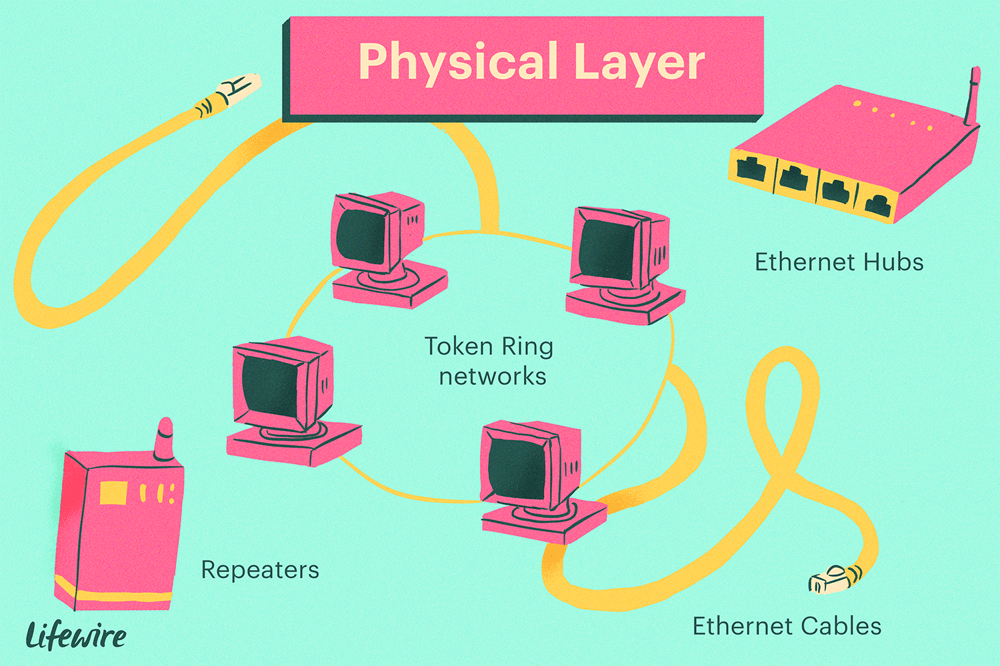

## 0.1.2 Data Link Layer

Tugas utama Data Link Layer (**Layer 2**) adalah mengirimkan informasi dari perangkat ke perangkat yang terhubung secara langsung (_between adjacent nodes_). Lapisan ini juga memastikan bahwa informasi yang diberikan tepat dengan mekanisme _error control_ nya. Pada _layer_ ini, penentuan sumber dan tujuan data (_Addressing Scheme_) akan dikirimkan berdasarkan **MAC Address**, biasa dikenal sebagai _hardware address_ atau _physical address_ juga. Selain itu, _packet_ pada layer ini biasa dikenal sebagai **Frame**. Ada beberapa perangkat yang bekerja pada lapisan ini, seperti _switch_ dan _bridge_. Lapisan ini memiliki banyak protokol, beberapa yang paling kita kenali adalah _IEEE 802.3_ untuk Ethernet dan _IEEE 802.11_ untuk WiFi.

> Awalnya, _switch_ hanya beroperasi pada Layer 2. Namun, _switch_ modern sudah mulai bisa beroperasi pada Layer 3 juga.

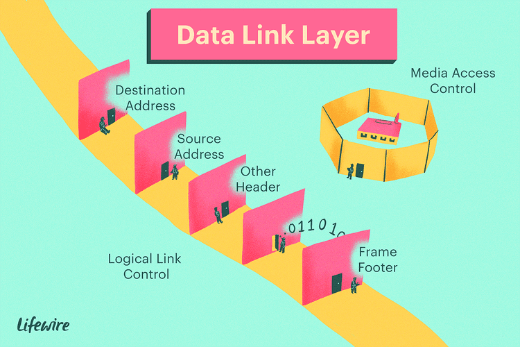

## 0.1.3 Network Layer

Selanjutnya adalah Network Layer (**Layer 3**), dimana lapisan ini bertugas untuk memastikan bahwa _packet_ bisa sampai dari awal sampai akhir. Jika data link layer bisa dikatakan sebagai komunikasi _node-to-node_, maka network layer bisa dikatakan sebagai komunikasi _end-to-end_. Misal ada suatu paket yang ingin dikirimkan dari rumah X di kota A ke rumah Y di kota B, dimana paket akan melewati banyak kantor pos. Data link layer memastikan paket sampai dari kantor pos satu ke kantor pos berikutnya, sedangkan network layer memastikan bahwa paket sampai dari rumah X ke rumah Y.

Pada lapisan ini, data yang dikirimkan biasa dikenal sebagai **Packet** dan penentuan alamat (_Addressing Scheme_) adalah berdasarkan **IP Address**. Lapisan ini juga bertanggung jawab untuk melakukan _routing_ untuk memasitkan _packet_ sampai pada tujuan. Perangkat yang paling umum bekerja pada layer 3 adalah _router_. Selain itu, beberapa protokol yang bekerja pada lapisan ini diantaranya adalah _Internet Protocol (IP)_, _Internet Control Message Protocol (ICMP)_ yang biasa ditemukan pada command `ping`, dan protokol _routing_ seperti _RIP_, _OSPF_, dan _BGP_.

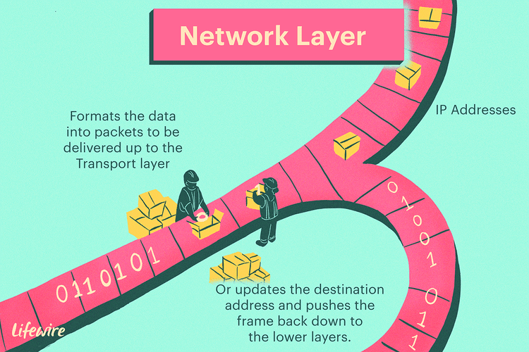

Ketika suatu data dikirimkan, frame tersebut akan memiliki 2 alamat, yaitu _MAC Address_ untuk komunikasi secara langsung pada perangkat selanjutnya dan _IP Address_ untuk komunikasi dari awal sampai akhir. Setelah sampai pada suatu perangkat, keterangan _MAC Address_ (seperti source dan destination) akan berubah. Maka dari itu, diciptakan suatu protokol bernama **Address Resolution Protocol (ARP)** untuk mendapatkan _MAC Address_ berdasarkan _IP Address_.

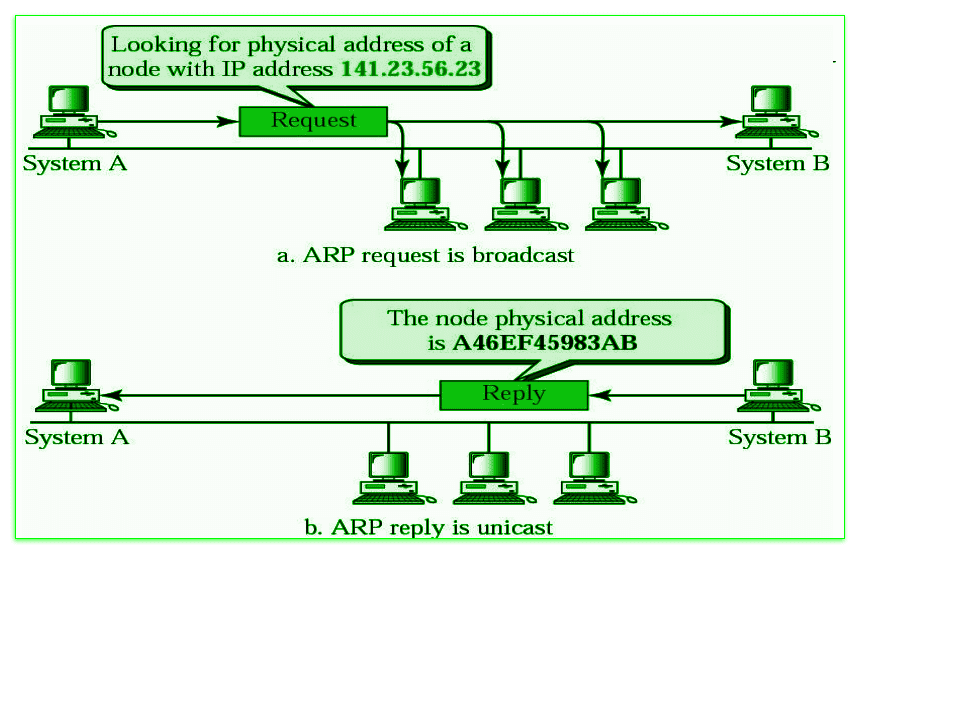

## 0.1.4 Transport Layer

Oke, _packet_ sudah dengan benar sampai pada tujuan. Namun, bagaimana kita tahu aplikasi mana yang memerlukan _packet_ ini? Di sinilah Transport Layer (**Layer 4**) bekerja. Lapisan ini memastikan bahwa data sampai dari aplikasi (_process_) awal sampai aplikasi (_process_) tujuan dengan benar. Lapisan ini cukup mirip dengan konsep _Inter-Process Communication_, karena Layer 4 berkomunikasi dari _process_ ke _process_ lain, pada _host_ yang berbeda. Maka dari itu, tujuan awal dan akhir (_Addressing Scheme_) dari Layer 4 adalah dari **Port Number**. Data yang berada pada lapisan ini kerap disebut sebagai **Segment**. Ada beberapa protokol dari transport layer, dengan 2 yang paling dikenal dan sering digunakan adalah **TCP** untuk komunikasi yang _reliable_ namun lambat dan **UDP** untuk komunikasi yang _unreliable_ namun cepat.

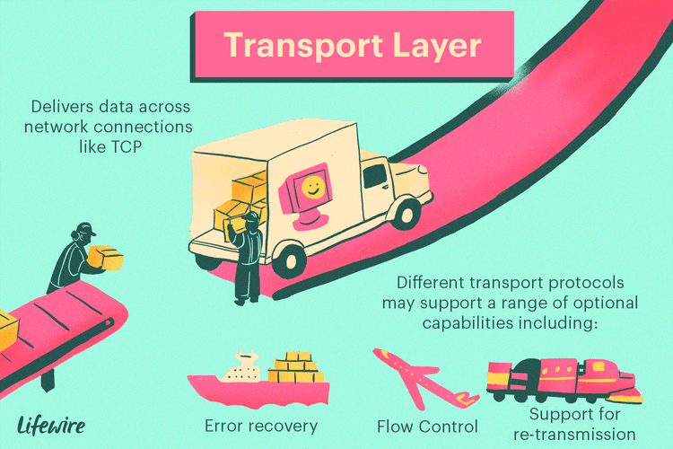

## 0.1.5 Session Layer

Pada Session Layer (**Layer 5**), terjadi beberapa mekanisme untuk memastikan komunikasi berjalan dengan lancar. Maka dari itu, lapisan ini bertanggung jawab dalam membuat, mengoordinasikan, dan mengakhiri koneksi/sambungan pada dua _host_. Ada beberapa aplikasi yang memanfaatkan layer ini, seperti penggunaan _Remote Procedure Call_ (RPC) adn _Zone Information Protocol_ (ZIP) milik AppleTalk.


## 0.1.6 Presentation Layer

Presentation Layer (**Layer 6**) kerap dikenal juga sebagai **Translation Layer**. Pada lapisan ini, data yang diterima akan diterjemahkan sesuai dengan format yang ada. Tak hanya itu, lapisan ini juga bertugas untuk melakukan enkripsi data agar informasi yang dikirim melalui suatu jaringan bisa terjamin keamanannya.

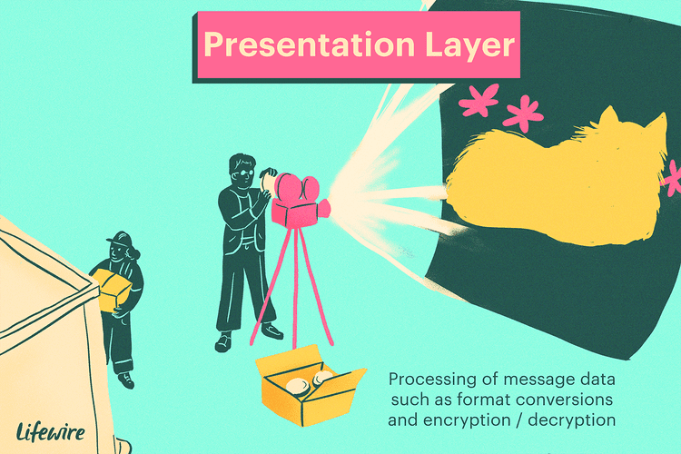

## 0.1.7 Application Layer

Sebagai lapisan puncak dari OSI Model, Application Layer (**Layer 7**) adalah sumber yang membuat data dan tujuan akhir dari sebuah data. Lapisan ini juga sebagai perantara antara aplikasi dengan jaringan komputer. Pada layer ini, banyak sekali protokol yang digunakan dan sering kita temui, seperti HTTP, Telnet, FTP, SSH, dan lain-lain.

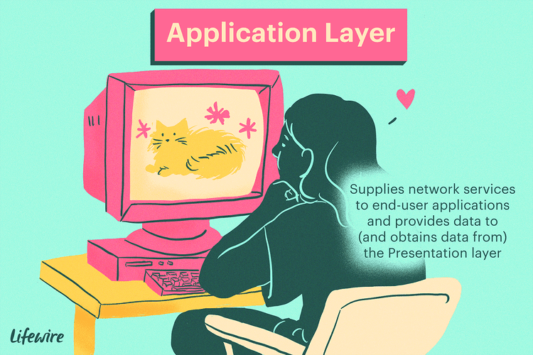

## 0.2 TCP/IP Model

TCP/IP Model merupakan sebuah pedoman layaknya OSI Model. Namun, model ini kerap dianggap lebih modern, fleksibel, dan mudah sehingga telah menjadi standar yang diadopsi oleh mayoritas perangkat di dunia. Model ini mirip dengan OSI Model, dengan beberapa layer digabung menjadi satu. Di sini, Layer 5 sampai Layer 7 digabung menjadi "Application Layer". Kemudian, ada beberapa pihak yang menggabung Layer 1 dan Layer 2 menjadi "Network Interface Layer" atau "Network Access Layer". Namun, banyak juga yang membiarkan Layer 1 dan Layer 2 terpisah seperti OSI Model. Maka dari itu, TCP/IP Model memiliki 4 atau 5 layer.

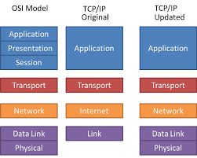

## **1. Static Routing**

Setelah kita memahami bagaimana cara jaringan komputer di dunia bekerja pada umumnya, perangkat-perangkat yang digunakan untuk mendukung terjadinya komunikasi di internet, protokol yang dipatuhi, dan lain-lainnya, maka kita akan masuk ke dalam konsep yang tak kalah penting dan akan sering kita temui, yaitu **Routing**.

## 1.1 Pengertian

Jika IP Address bisa kita ibaratkan sebuah alamat rumah, maka sekarang mari kita bayangkan kita sedang berada di suatu perumahan, katakanlah perumahan A. Di perumahan ini, penduduknya mengikuti aturan alamat ruamah yang sama, yaitu huruf A diikuti oleh angka. Misal, tetanggamu yang bernama Bapak Hassan memiliki alamat rumah A-17, Ibu Rumrowi memiliki alamat rumah A-32, dan seterusnya. Sebagai penduduk setempat, kamu kenal dengan mereka dan tahu bagaimana cara mengunjungi rumah mereka tanpa bantuan orang lain.

Suatu hari, kamu diberi tugas untuk mengirimkan makanan ke alamat rumah B-03. Namun, kamu tidak kenal alamat ini karena tidak diawali oleh huruf A seperti biasanya. Maka dari itu, kamu menghubungi kantor pos perumahan dengan alamat A-01 (yang mana kamu tahu letaknya) dan meminta bantuan mereka untuk mengirimkan makanan tersebut. Sebagai kantor pos, mereka memiliki data alamat di seluruh kota, sehingga mereka tahu di mana letak rumah B-01 ini dan ke mana harus memberikan makanan tersebut. Jadi, kamu cukup pergi ke A-01 dan menyerahkan makanan tersebut yang memiliki tujuan B-01. Sisanya akan diurus oleh kantor pos.

Konsep routing kurang lebih sama seperti ilustrasi di atas. Pada hakikatnya, routing merupakan suatu proses yang menentukan jalur terbaik untuk mengirimkan suatu paket/data dari satu jaringan ke jaringan lainnya. Umumnya, hal ini dilakukan oleh _Router_, dimana mereka bertanggung jawab untuk meneruskan packet dari satu segmen jaringan ke segmen lainnya. _Router_ melakukan proses penentuan jalur ini berdasarkan data yang mereka punya, yaitu _Routing Table_ yang berisikan informasi mengenai cara untuk bisa menuju suatu segmen jaringan, sekalipun itu terlihat jauh.

Bila mengacu pada ilustrasi di atas, kamu dan seluruh tetanggamu bisa dianggap sebagai host dan perumahanmu dianggap sebagai suatu _subnet_ (Kita akan mendalami ini di Modul 4). Kemudian, kantor pos bisa dianggap sebagai _Router_ dan data alamat di seluruh kota yang mereka miliki bisa dianggap sebagai _Routing Table_.

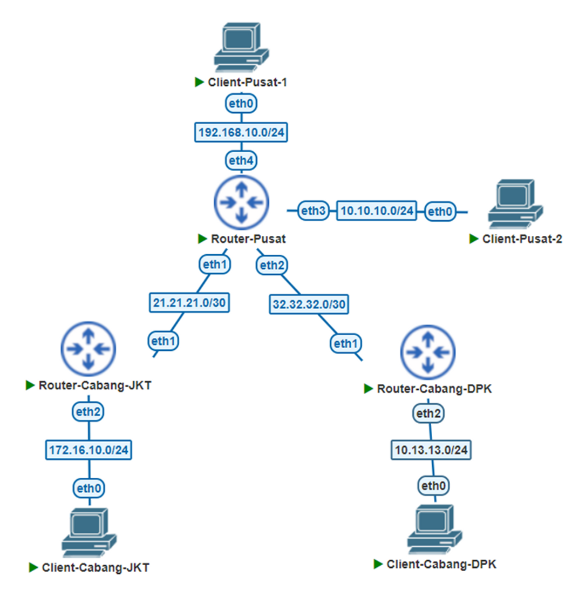

Berdasarkan bagaimana cara _Router_ memperoleh informasi terkait _Routing Table_-nya, _Routing_ bisa dibagi menjadi 2 kategori, yaitu **Static Routing** dan **Dynamic Routing**. Untuk Dynamic Routing akan dibahas secara sekilas pada Modul 4, sedangkan Static Routing akan kita pelajari pada modul ini.

Pada Static Routing, seorang (atau tim) _network administrator_ bertanggung jawab untuk mengisi _Routing Table_ pada setiap _Router_. Jika menggunakan analogi kantor pos, pemerintah bertanggung jawab untuk memberi tahu seluruh kantor pos yang ada mengenai kantor pos lainnya dan bagaimana cara suatu kantor pos menghubungi kantor pos lain ataupun perumahan lain. Hal ini cukup sederhana apabila dilakukan pada suatu jaringan dengan jumlah _Router_ dan segmen jaringan yang sedikit, namun akan bertambah sulit dan melelahkan seiring bertambahnya jumlah dan kompleksitas jaringan. Tak hanya itu, apabila ada segmen jaringan baru, seluruh _Router_ harus diberi tahu mengenai hal ini yang tentunya sangat tidak efisien dan akan menghabiskan banyak waktu.

Namun, karena kita akan menggunakan topologi sederhana yang tidak banyak berubah dengan segmen jaringan yang sedikit, maka Static Routing dapat mempermudah kita karena kita akan memiliki kontrol penuh terhadap topologi kita. Selanjutnya, kita akan mencoba melakukannya di dalam GNS3.

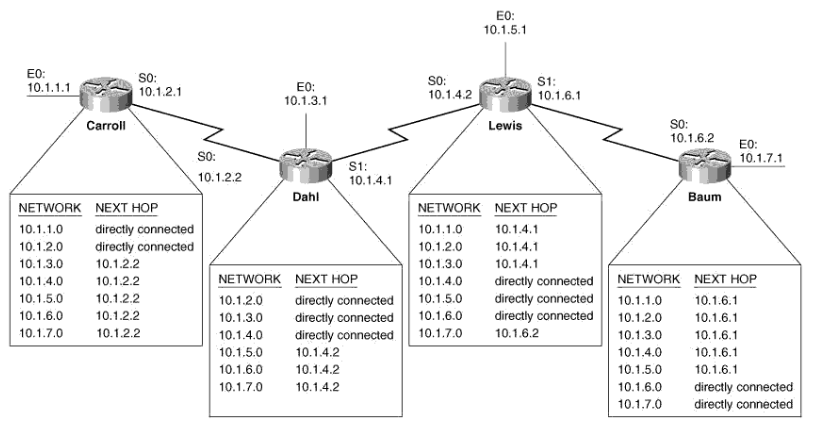

## 1.2 Implementasi

Tentu saja kita akan dapat lebih mudah memahaminya dengan langsung melakukan implementasi. Untuk itu, kita akan menggunakan topologi seperti berikut:

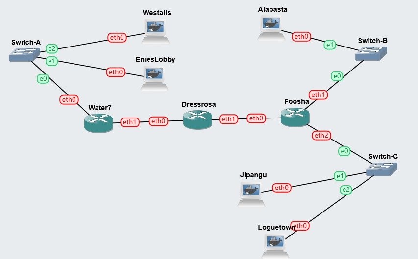

Kemudian, pembagian IP Address untuk kasus ini adalah sebagai berikut:

```
# Kompleks A: 10.40.1.X
eth0 Water7: 10.40.1.1
EniesLobby: 10.40.1.2
Westalis: 10.40.1.3

# Kompleks Jalanan Kiri: 10.40.2.X
eth1 Water7: 10.40.2.1
eth0 Dressrosa: 10.40.2.2

# Kompleks Jalanan Kanan: 10.40.3.X
eth1 Dressrosa: 10.40.3.1
eth0 Foosha: 10.40.3.2

# Kompleks B: 10.40.4.X
eth1 Foosha: 10.40.4.1
Alabasta: 10.40.4.2

# Kompleks C: 10.40.5.X
eth2 Foosha: 10.40.5.1
Jipangu: 10.40.5.2
Loguetown: 10.40.5.3
```

Untuk kasus ini, set semua netmask menjadi `255.255.255.0` dahulu (penjelasan lebih lanjut ada di Modul 4). Kemudian, untuk semua host (semua node kecuali Water7, Dressrosa, dan Foosha), set gateway nya menjadi IP Address _Router_ yang terhubung. Misal, EniesLobby dan Water7 terhubung pada eth0 Water7, maka gateway untuk mereka berdua adalah `10.40.1.1`. Lalu, set gateway untuk router sebagai berikut:

```
# kosongi gateway untuk interface eth0 Water7 dan interface eth1 & eth2 Foosha
eth1 Water7: 10.40.2.2
eth0 Foosha: 10.40.3.1
# kosongi juga gateway Dressrosa untuk semua interface
```

## 1.2.1 Sebelum Routing

Apabila sudah selesai melakukan konfigurasi, lakukan tes konektivitas dengan melakukan ping antar-node di dalam segmen jaringan (kompleks) yang sama. Misal, pastikan **Westalis** bisa melakukan ping ke **EniesLobby** dan **Water7**, **Dressrosa** bisa melakukan ping ke **Foosha**, dan lain-lain

> Kiat: Tidak perlu masuk ke seluruh node. Cukup masuk ke **Water7** dan **Foosha** dan ping semua perangkat yang terhubung dengannya, karena pada umumnya ping bersifat simetris (apabila host A bisa melakukan ping ke host B, berlaku pula sebaliknya) kecuali ada konfigurasi tambahan seperti Firewall atau NAT.

Sekarang, silahkan kalian coba melakukan ping antar-kompleks dengan jarak yang cukup jauh Contohnya **Dressrosa** (`10.40.3.1`) ke **Alabasta** (`10.40.4.2`). Seharusnya, kalian akan mendapatkan output seperti berikut

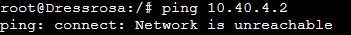

atau

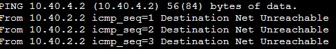

Kalian mungkin tidak mendapat output sama persis di atas (bahkan _hang_ ketika melakukan ping). Namun, pada hakikatnya hasilnya adalah sama, yaitu tidak bisa melakukan ping.

> Jika melakukan ping antar-kompleks yang masih berdekatan dan terhubung ke _router_ yang sama (misalnya kompleks B dan kompleks C), ada kemungkinan komunikasi ping masih tetap dapat dilakukan.

Maka dari itu, kita akan memberi tahu _router_ bagaimana cara mencapai kompleks lain.

## 1.2.2 Proses Routing

Cara yang pertama cukup sederhana, yaitu hanya memberi tahu **Dressrosa** tentang bagaimana cara mencapai semua segmen jaringan. Untuk itu, kita akan menggunakan perintah berikut:

```
ip route add <SUBNET TUJUAN>/<NETMASK> via <GATEWAY>
```

Penjelasan:

- **SUBNET TUJUAN** berisi NID atau segmen jaringan yang akan dituju. Di kasus kita, 3 oktet pertama berisi IP kompleks dan oktet terakhir berisi `0`. Penjelasan lebih detail akan kita telusuri di modul 4.
- **NETMASK** untuk kasus kita akan diisi `24` saja.
- **GATEWAY** berisi IP Address dari _router_ untuk menuju ke segmen jaringan tersebut.

Misal:

```
ip route add 10.40.5.0/24 via 10.40.3.2
```

Ketika kita menjalankan perintah di atas pada **Dressrosa**, kita seolah-olah memberi tahu dia bahwa, "Halo Dressrosa, kalau ada _packet_ dengan IP Address tujuan di kompleks C (`10.40.5.X`), maka cara meraihnya adalah dengan melewati `10.40.3.2` (yaitu **Foosha**)"

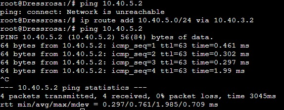

Sebelum menjalankan perintah di atas, Dressrosa belum tau cara mencapai kompleks C (`10.40.5.X`). Maka dari itu, dia mengatakan bahwa jaringan tersebut tidak dapat diraih (`Network is unreachable`). Setelah kita beri tahu, maka sekarang dia memiliki informasi cara menuju segmen jaringan tersebut. Sehingga, dia dan perangkat luar yang terhubung secara langsung dengan dia (dalam kasus ini, **Water7**) bisa menghubungi alamat yang berada di segmen jaringan tersebut.

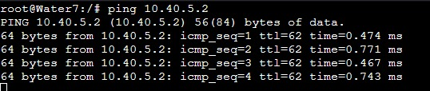

Namun, kompleks A masih belum bisa melakukan ping kepada kompleks C. Walaupun packet yang dikirimkan dari kompleks A (`10.40.1.X`) bisa sampai pada kompleks C (`10.40.5.X`) karena semua _router_ sudah tahu jalannya, mereka masih belum tahu cara meraih kompleks A untuk balasannya. Maka dari itu, kita perlu memberi tahu **Dressrosa** lagi mengenai cara meraih kompleks A dengan menjalankan perintah berikut:

```
ip route add 10.40.1.0/24 via 10.40.2.1
```

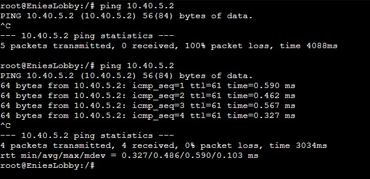

Seperti pada gambar, awalnya **EniesLobby** sebagai penduduk kompleks A tidak dapat menghubungi kompleks C. Setelah kita jalankan perintah di atas pada **Dressrosa**, EniesLobby dapat melakukan _ping_ ke kompleks C.

> Lakukan hal yang sama untuk kompleks B. Apakah kalian tahu _command_ yang digunakan dan di node apa?

## 1.2.3 Setelah Routing

Mungkin sembari melakukan implementasi, ada beberapa pertanyaan yang muncul di benak kalian, seperti:

- _Mengapa hanya **Dressrosa** yang dikonfigurasi, sedangkan ada 3 router?_
- _Apakah berarti **Water7** dan **Foosha** tahu cara meraih semua kompleks yang ada? Bagaimana bisa?_
- _Apa yang akan terjadi apabila ada kompleks baru yang ditambahkan, seperti mungkin kompleks D di `10.40.6.X`?_

Potongan _puzzle_ terakhir yang membuat ini semua terjadi dan bisa menjawab kalian adalah **Default Gateway**.

Sederhananya, Default Gateway bisa diibaratkan sebagai orang yang kalian tanya (jika mengikuti ilustrasi awal, maka diibaratkan kantor pos perumahan) ketika tidak tahu arah. Ketika ada _packet_ dengan tujuan yang asing, alih-alih menyerah dan membuangnya, kita cukup kirimkan _packet_ tersebut ke Default Gateway. Hal inilah yang terjadi pada implementasi di atas dan mengapa hanya **Dressrosa** yang dikonfigurasi.

**Study Case: Ping dari EniesLobby ke Jipangu**

Jalankan _command_ di bawah ini di **EniesLobby**:

```
mtr 10.40.5.2
```

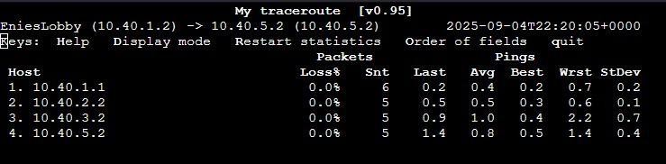

melalui `mtr`, kita bisa mengetahui _packet_ yang kita kirimkan melalui node mana saja. Perintah ini mirip seperti `traceroute`. Untuk kasus ini, kita ingin mencari tahu jalur mana yang ditempuh _packet_ dari **EniesLobby** (`10.40.1.3`) ke **Jipangu** (`10.40.5.2`). Penjelasan alur rute yaitu sebagai berikut:

1. Pertama, karena IP Address tujuan (yaitu `10.40.5.2`) tidak berada pada segmen jaringan yang sama, **EniesLobby** tidak tahu bagaimana cara mengirimkannya. Namun karena dia memiliki Default Gateway yaitu **Water7**, maka dia cukup mengirimkan _packet_ tersebut ke sana (yaitu `10.40.1.1`)
2. Hal yang sama dialami oleh **Water7**. Dia sebenarnya juga tidak tahu bagaimana cara mengirimkan _packet_ ini, namun karena dia juga memiliki Default Gateway yaitu **Dressrosa**, maka dia akan mengirimkannya ke sana (yaitu `10.40.2.2`)
3. Tidak seperti EniesLobby dan Water7, **Dressrosa** tahu bagaimana cara meraih segmen jaringan dari tujuan _packet_ ini. Menurut data yang dia punya (atau _Routing Table_ nya), untuk meraih packet tersebut dia harus mengirimkannya ke **Foosha**, yaitu `10.40.3.2`
4. Terakhir, karena **Foosha** terhubung secara langsung dengan **Jipangu**, maka _packet_ bisa langsung dikirimkan ke tujuan, yaitu `10.40.5.2`.

> Seandainya **Water7** dan **Foosha** tidak memiliki Default Gateway, maka kita harus menjalankan perintah `ip route add` untuk mengisi _Routing Table_ mereka seperti apa yang kita lakukan pada **Dressrosa**.

## 1.2.4 Routing Table

Alangkah baiknya apabila kita tutup dengan penjelasan singkat mengenai komponen terakhir pada perjalanan kita, yaitu **Routing Table**.

Routing Table adalah suatu struktur data yang menyimpan informasi mengenai cara meraih suatu segmen jaringan. Biasanya, di dalam suatu Routing Table terdapat informasi mengenai segmen jaringan tujuan, _next hop_ atau _gateway_ nya, _network interface_ yang digunakan, dan informasi tambahan.

Mari kita lihat Routing Table pada **Dressrosa** dengan:

```
ip route show
```

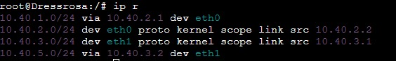

- `10.40.1.0/24 via 10.40.2.1 dev eth0`: Untuk meraih segmen jaringan `10.40.1.0/24`, maka kirim _packet_ ke `10.40.2.1` melalui _interface_ `eth0`.
- `10.40.2.0/24 dev eth0 proto kernel scope link src 10.40.2.2`: Segmen jaringan `10.40.2.0/24` terhubung secara langsung melalui _interface_ `eth0`. IP milik **Dressrosa** sendiri pada hubungan ini adalah `10.40.2.2`

> Bisakah kalian menerjemahkan sisanya?

## Troubleshooting

Apabila kalian sudah melakukan konfigurasi pada _router_ namun masih belum bisa melakukan ping, ada kemungkinan _router_ kalian tidak mau meneruskan _packet_ (_packet forwarding_ dinonaktifkan)

Untuk mengeceknya, bisa menjalankan:

```
cat /proc/sys/net/ipv4/ip_forward
```

`1` berarti _packet forwarding_ aktif dan `0` berarti nonaktif. Untuk mengaktifkannya, bisa menjalankan:

```
sysctl -w net.ipv4.ip_forward=1
```

atau dengan memastikan `net.ipv4.ip_forward=1` ada (biasa di-comment) di dalam `/etc/sysctl.conf`. Restart dengan

```
sysctl -p
```
