# Web Server
## A. Persyaratan Tambahan untuk Mengikuti Sesi Lab
Record A dan PTR pada jarkomtc.com mengarah ke IP MEWTWO

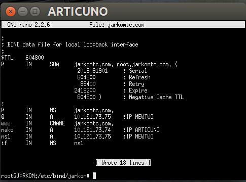

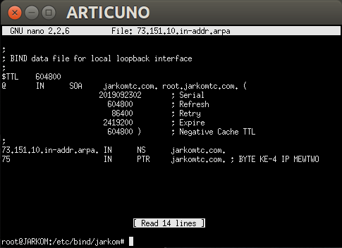

## B. Penting Untuk Dibaca
1. Pastikan semua UML bisa connect ke internet baik dapat melakukan koneksi ke luar maupun dapat ping dari luar (Khusus DMZ)
2. Pastikan Mewtwo dan Articuno sudah memiliki memory 256M
3. Ketika mengalami kendala/error __cek syntax dan samakan seperti modul__ terlebih dahulu __sebelum__ angkat tangan dan berkata __"Mas/Mbak ini kok gak bisa ya?"__

## C. Dasar Teori
### 1. Web Server
Terdapat dua pengertian dari web server. Secara _hardware_, web server berarti sebuah storage yang digunakan untuk menyimpan semua data dari aplikasi web (file HTML, CSS, JavaScript, dll.). Sedangkan secara _software_,  web server adalah sebuah perangkat yang bertugas untuk menyediakan layanan akses menggunakan protokol HTTP atau HTTPS melalui aplikasi web.

### 2. Load Balancing
___Load balancing___ adalah suatu mekanisme penyeimbangan beban yang bekerja dengan cara membagi beban pekerjaan. ___Load balancer___ adalah aplikasi atau alat yang bertugas untuk melakukan _load balancing_. _Load balancer_ dapat meggunakan berbagai macam algoritma _load balancing_ yang bertujuan untuk membagi beban pekerjaan seadil-adilnya. Arsitektur minimal untuk _load balancing_ adalah sebagai berikut:


#### Kenapa dibutuhkan load balancing?
Untuk menangani banyaknya pengguna yang mengakses layanan pada satu waktu dan menjaga layanan tetap tersedia setiap saat, dibutuhkan lebih dari satu komputer untuk memasang layanannya. Dengan layanan yang tersedia di banyak server, dibutuhkan mekanisme pembagian beban untuk memberikan beban yang seimbang pada setiap server. Dengan meletakkan layanan pada beberapa server dan pembagian beban yang optimal, setiap permintaan pengguna bisa ditangani dengan efisien.

### 3. Apache Web Server
__Apache HTTP Server__ atau biasa disebut Apache adalah sebuah _software_ web server _cross-platform_ dan _open source_ yang banyak digunakan. Dalam sesi lab ini, kita akan menggunakan Apache sebagai _software_ web server kita.

## D. Instalasi Apache
#### 1. Buka UML _MEWTWO_
Lalu jalankan perintah
```
apt-get install apache2
```
jika muncul tulisan _"Do you want to continue? [Y/n]"_  input `Y` lalu tekan ___enter___. 

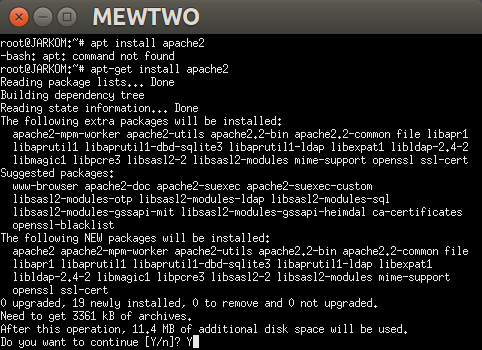

#### 2. Buka browser laptop/komputer masing-masing
Buka web __IP Mewtwo Masing-Masing Kelompok__ sampai muncul halaman Apache seperti di bawah ini.


## E. Instalasi PHP
#### 1. Buka UML Mewtwo
Lalu jalankan perintah
```
apt-get install php5
```
jika muncul tulisan _"Do you want to continue? [Y/n]"_  input `Y` lalu tekan ___enter___. 

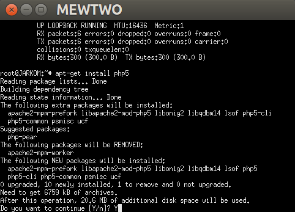

#### 2. Test apakah php sudah ter-install
Jalankan perintah di bawah ini untuk memeriksa versi dari __php__ kalian.
```
php -v
```
Bila _output_-nya mirip dengan yang di bawah ini, maka __php__ kalian telah ter-_install_.

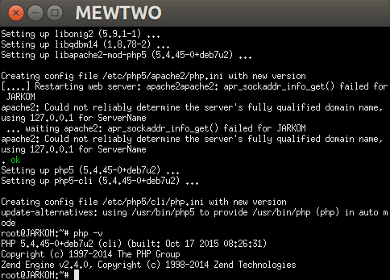

## F. Mengenal Apache
Web server Apache memiliki _directory_  berisi berbagai konfigurasi yang terletak di `/etc/apache2/`

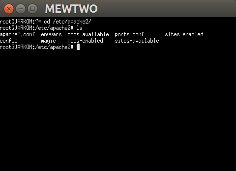

Berikut beberapa hal yang penting untuk diketahui:
+ File Konfigurasi di 	`/etc/apache2`

|__Nama File__ | __Kegunaan__ |
| --- | --- |
| __apache2.conf__ | file konfigurasi utama apache2 |
| __ports.conf__ | file konfigurasi port yang digunakan untuk web server |
| __sites-available__ | _directory_ tempat konfigurasi website (virtual host) yang tersedia |
| __sites-enabled__ | _directory_ tempat konfigurasi website (virtual host) yang tersedia dan sudah aktif |
| __mods-available__ | _directory_ tempat modul-moadul apache2 yang tersedia |
| __mods-enabled__ | _directory_ tempat modul-moadul apache2 yang tersedia dan sudah aktif |

+ _Command_ yang sering digunakan

|__Command__ | __Kegunaan__ |
| --- | --- |
| __a2ensite__ | Untuk mengaktifkan (_ENABLE_) konfigurasi website yang telah dibuat |
| __a2dissite__ | Untuk menonaktifkan (_DISABLE_) konfigurasi website yang sedang aktif |
| __a2enmod__ | Untuk mengaktifkan (_ENABLE_) sebuah modul tertentu ke dalam konfigurasi apache2 |
| __a2dismod__ | Untuk menonaktifkan (_DISABLE_) sebuah modul tertentu dalam konfigurasi apache2 |

## G. Konfigurasi Apache Sederhana
### A. Penggunaan Sederhana
#### A.1. Pindah ke _directory_ `/etc/apache2/sites-available`
Gunakan perintah `cd /etc/apache2/sites-available`

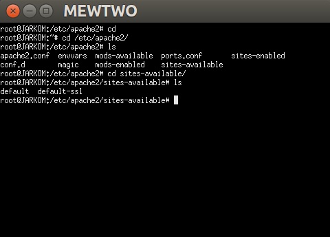

Dapat dilihat di sana terdapat dua buah file:
+ file __default__, file konfigurasi website default apache untuk http.
+ file __default-ssl__, file konfigurasi website default apache untuk https.
#### A.2. Buka file ___default___
Gunakan perintah `nano /etc/apache2/sites-available/default`

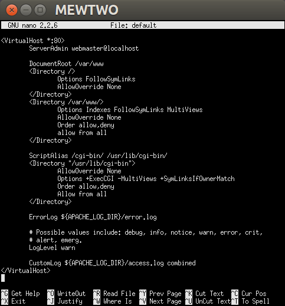

#### A.3.  Pada file _default_ terdapat konfigurasi standar apache
Beberapa diantaranya adalah:
##### __Port__ yang digunakan
```
<VirtualHost *:80>
```
Konfigurasi di atas menunjukkan bahwa port yang digunakan adalah port 80

##### ___Directory___ tempat file website kita berada
```
DocumentRoot /var/www
```
+ Untuk sesi lab JarKom ini silahkan mengubah _DocumentRoot_-nya menjadi `/var/www/html`
+ Begitu juga dengan _line_ ke-9, diubah dari `<Directory /var/www/>` menjadi `<Directory /var/www/html>` 
+ Jangan lupa lakukan `service apache2 restart` setelah melakukan perubahan konfigurasi agar perubahan yang telah dilakukan teraplikasikan

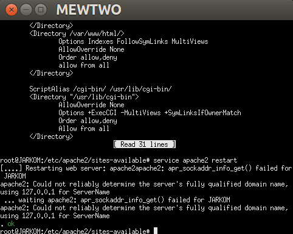

#### A.4. Pindah ke _directory_ yang ditunjuk oleh _DocumentRoot_ pada file _default_
Gunakan perintah `cd /var/www/`

+ Karena tadi kita mengubah _DocumentRoot_ di file _default_ maka sekarang buatlah _directory_ bernama "html" dengan perintah `mkdir /var/www/html`

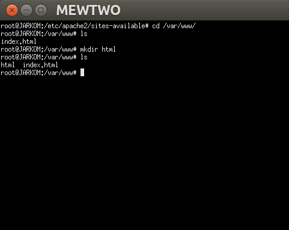

#### 5. Pindah ke _directory_ `/var/www/html` dan buat file _index.php_
Gunakan perintah `nano /var/www/html/index.php` dan isi file  tersebut dengan
```
<?php
	phpinfo();
?>
```

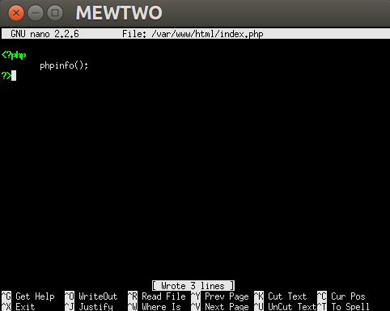

#### A.6. Buka browser laptop/komputer masing-masing
Akses alamat __http://[IP Mewtwo]/index.php__

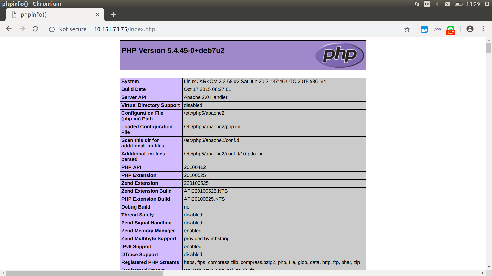

+ __Catatan__:
	Apabila tampilan web tidak muncul seperti gambar di atas dan hanya muncul plain text isi file index.php, silahkan install **libapache2-mod-php7.0** dengan menjalankan perintah
	```
	`apt-get install libapache2-mod-php7.0
	```
	lalu restart apache dengan perintah
	```
	service apache restart
	```
### B. Membuat Konfigurasi Website Menggunakan Port 8080
#### B.1 Pindah ke _directory_ `/etc/apache2/sites-available`
Copy file _default_ menjadi file _default-8080_ dengan perintah
```
cp default default-8080
```

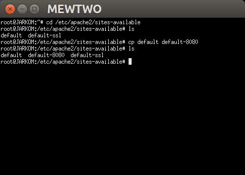

#### B.2 Buka file _default-8080_
Gunakan perintah `nano /etc/apache2/sites-available/default-8080`
+ Kemudian ubah port yang digunakan. Dimana awalnya port `80` menjadi port `8080`.
+ Ubah juga _DocumentRoot_ yang awalnya `/var/www/html` menjadi `/var/www/web-8080`.

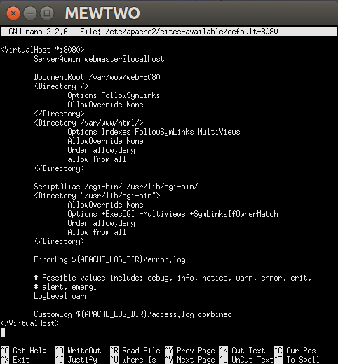

#### B.3 Tambahkan _port 8080_ pada file `ports.conf`
File __ports.conf__ berada pada _directory_ `/etc/apache2`

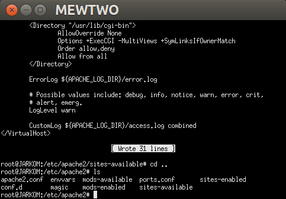

Cara menambahkan port yang perlu didengar adalah dengan menuliskan
```
Listen 8080
```

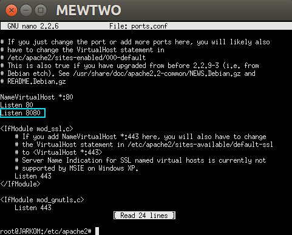

#### B.4 Aktifkan konfigurasi _default-8080_
Untuk mengaktifkan suatu konfigurasi, kita menggunakan perintah `a2ensite` diikuti dengan __nama file konfigurasi tanpa .conf__
Dalam kasus ini perintah yang dijalankan adalah
```
a2ensite default-8080
```

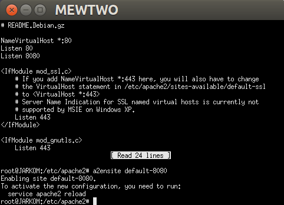

#### B.5 Restart apache
Gunakan perintah `service apache2 restart`

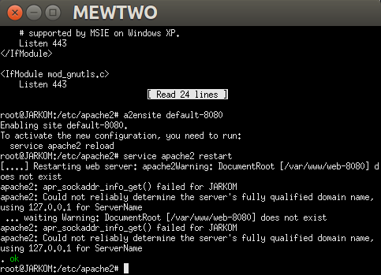

#### B.6 Pindah ke _directory_ `/var/www`
Buatlah sebuah _directory_ baru di dalam `var/www` dengan nama __web-8080__

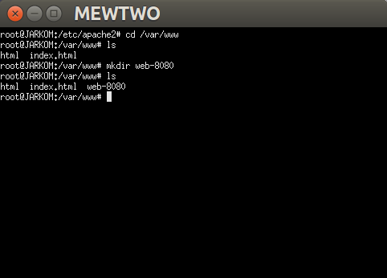

#### B.7 Masuk ke _directory_ `/var/www/web-8080` dan buat file _index.php_
Isi file __index.php__ tersebut dengan
```
<?php
    echo "Hai gaes, ini port 8080 lhoo";
?>
```

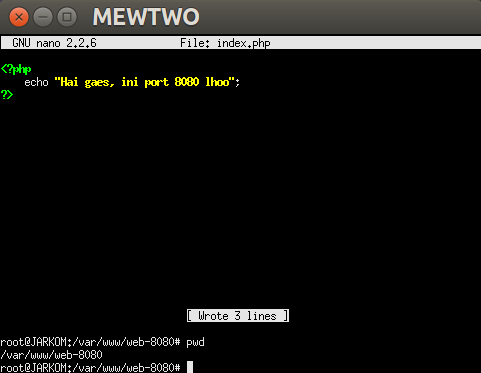

#### B.8 Buka browser laptop/komputer masing-masing
Akses alamat __http://[IP Mewtwo]:8080__

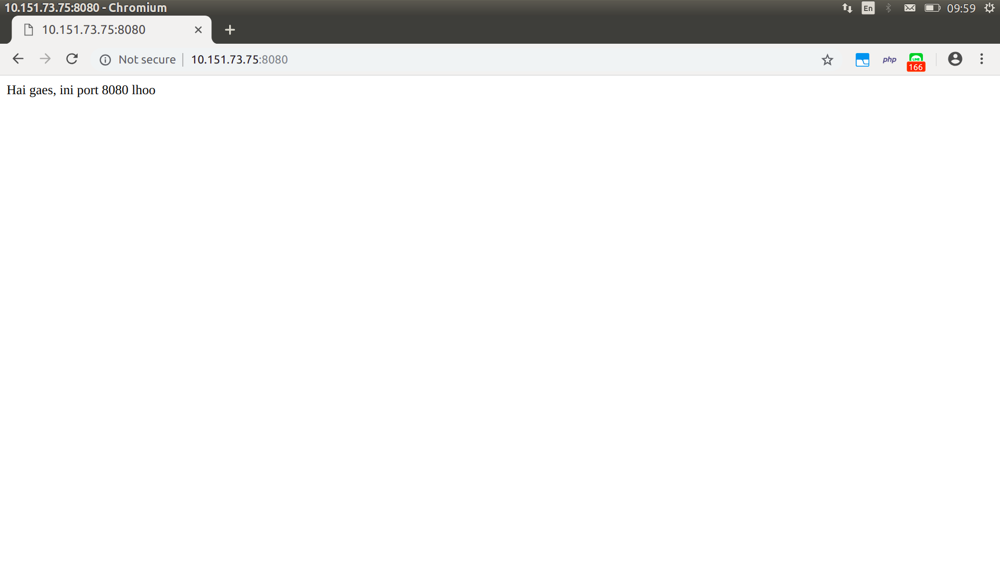

## H. Mari Berimajinasi
### A. Setting Domain pada Apache
Rachma adalah seorang mahasiswi Informatika yang ingin membuat website dengan domain __jarkomtc.com__. Dia memiliki _teman_ bernama Ifin yang kebetulan memiliki server yang bisa digunakan sebagai tempat host untuk websitenya. Sayangnya Ifin sedang berada di luar kota dan server-nya tidak dapat diakses dari sana.

Ayo bantu Ifin membahagiakan hati Rachma dengan mengonfigurasi server Ifin sesuai petunjuk yang ia berikan:
#### A.1 Pindah ke _directory_ `/etc/apache2/sites-available`
Copy file __default__ menjadi file __jarkomtc.com__

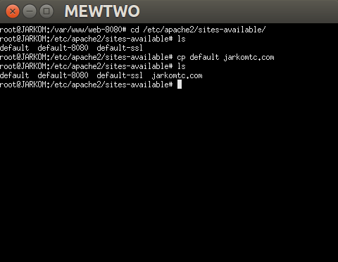

#### A.2 Buka file _jarkomtc.com_
+ Tambahkan
	```
	ServerName jarkomtc.com
	ServerAlias www.jarkomtc.com
	```
	Menurut [dokumentasi apache2.2](https://httpd.apache.org/docs/2.2/mod/core.html):
	+ `ServerName` adalah "_Hostname and port that the server uses to identify itself_"
	+ `ServerAlias` adalah "_Alternate names for a host used when matching requests to name-virtual host_"
+ Ubah _DocumentRoot_ menjadi `/var/www/jarkomtc.com`

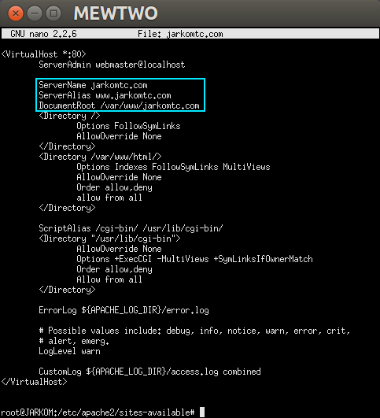

#### A.3 Aktifkan konfigurasi _jarkomtc.com_
Gunakan perintah `a2ensite jarkomtc.com`

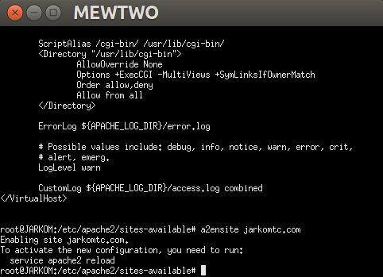

#### A.4 Restart apache
Gunakan perintah `service apache2 restart`

#### A.5 Pindah ke _directory_ `/var/www`
Lalu buatlah sebuah _directory_ baru di dalam `var/www` dengan nama __jarkomtc.com__

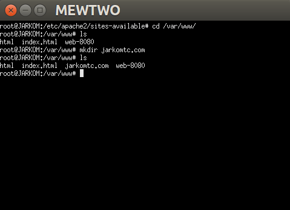

#### A.6 Masuk ke _directory_ `/var/www/jarkomtc.com` dan buat file _index.php_
Isi file __index.php__ tersebut dengan
```
<?php
    echo "Semangat JarKom TC ya, Rachma!";
?>
```

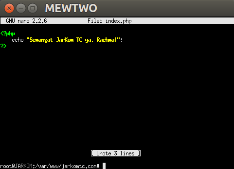

#### A.7 Ganti DNS laptop/komputer sesuai IP Articuno masing-masing
+ __Pada Windows__
	+ Buka _Control Panel_
	+ Klik _Network and Internet_
	+ Klik _Network and Sharing Center_
	+ Klik _Change Adapter Settings_
	+ Klik kanan pada koneksi yang sedang kalian gunakan lalu klik _Properties_
	+ Di bagian "___This connection uses the following items:___" klik ___Internet Protocol Version 4 (TCP/IPv4)___ lalu klik _Properties_. Bisa juga dilakukan dengan _double click_ pada tulisan ___Internet Protocol Version 4 (TCP/IPv4)___.
	+ Pilih ___Use the following DNS server addresses:___ lalu isikan ___IP Articuno___ di _field_ "___Preferred DNS server:___"

		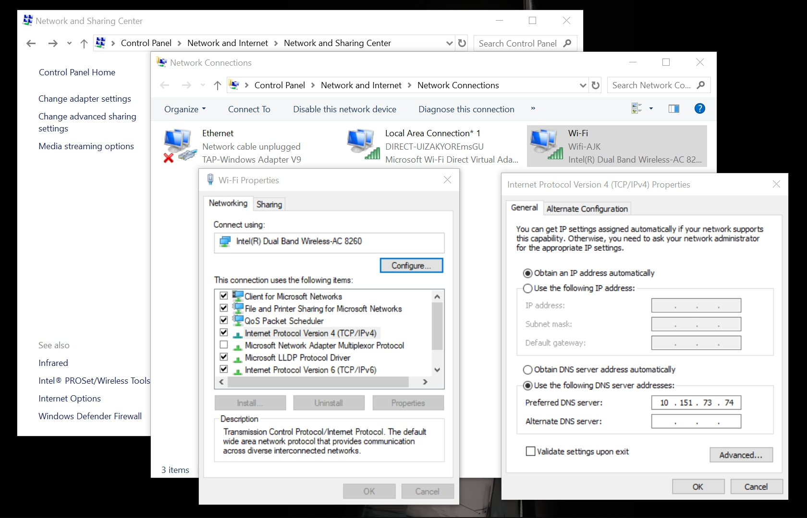
	
+ __Pada Linux__
	+ Ubah file __/etc/resolv.conf__ dengan perintah `sudo nano /etc/resolv.conf`
	+ _Comment_ DNS yang sedang aktif dan tambahkan `nameserver <IP Articuno>`
	+ Simpan hasil perubahannya
	
	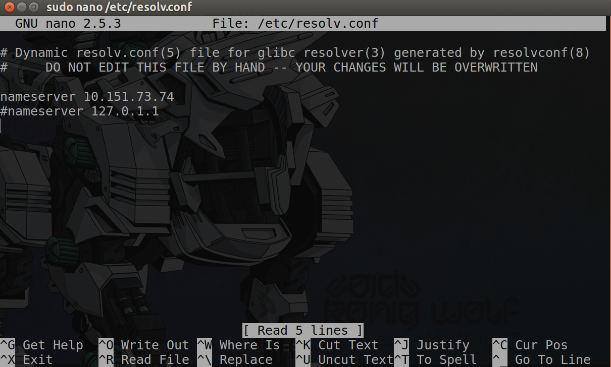

#### A.8 Buka browser dan akses _jarkomtc.com_

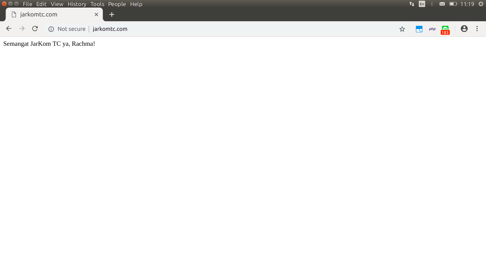

### B. Directory Listing
Di dalam _directory_ `/var/www/jarkomtc.com` terdapat struktur _directory_ sebagai berikut
```
/var/www/jarkomtc.com/
├── assets/
│   └── javascript/
├── data/
└── download/
    └── lagu/
```
Karena di dalam _directory_ __download__ terdapat file-file yang bisa di-download oleh pengunjung website __jarkomtc.com__, Rachma ingin folder tersebut dapat menampilkan list file yang ada. Lain halnya untuk _directory_ __assets__. Rachma tidak ingin pengunjung website yang mengakses _directory_ __assets__ tahu apa isi _directory_ tersebut.

Karena ternyata Ifin sangat menyukai Rachma, tentu ia akan berusaha untuk mengabulkan keinginan Rachma. Kalian sebagai teman yang baik dapat membantu Ifin dengan melakukan hal-hal berikut:
#### B.1 Buat _directory-directory_ yang diperlukan oleh website jarkomtc.com milik Rachma
Gunakan perintah-perintah berikut ini:
```
mkdir /var/www/jarkomtc.com/data
mkdir /var/www/jarkomtc.com/download
mkdir /var/www/jarkomtc.com/download/lagu
mkdir /var/www/jarkomtc.com/assets
mkdir /var/www/jarkomtc.com/assets/javascript
```

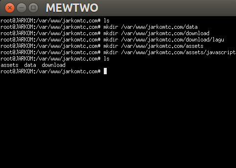

#### B.2 Mengaktifkan Directory Listing
+ Pindah ke _directory_ `/etc/apache2/sites-available` kemudian buka file ___jarkomtc.com___ dan tambahkan
	```
	<Directory /var/www/jarkomtc.com/download>
	    Options +Indexes
	</Directory>
	```
	jangan lupa untuk menyimpan perubahan tersebut agar _directory_  ___download___ menampilkan isi _directory_-nya.
	
	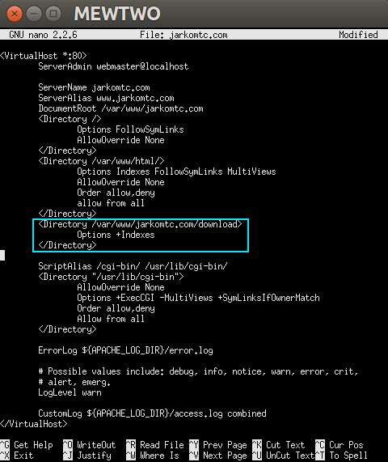
	
+ Restart apache dengan perintah `service apache2 restart`
+ Buka browser dan akses http://jarkomtc.com/download

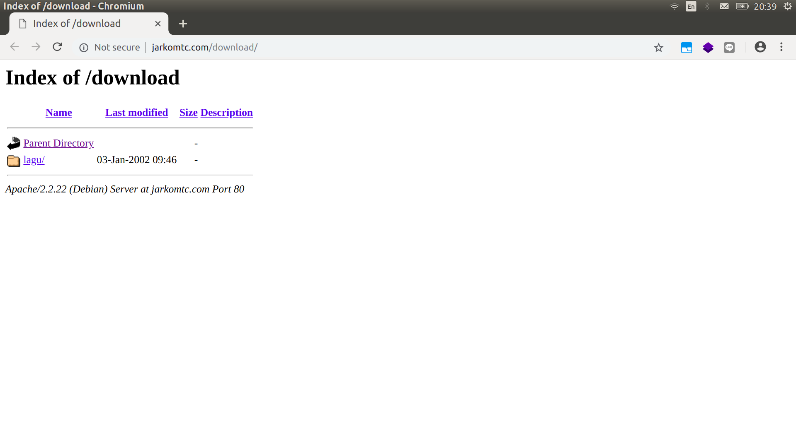

__Keterangan__:
Untuk mengatur _directory_ pada sebuah web, menggunakan
```
<Directory /x> ... </Directory>
```
Contoh untuk mengatur `/var/www/jarkomtc.com/download`
```
<Directory /var/www/jarkomtc.com/download>
	
</Directory>
```
#### B.3 Mematikan Directory Listing
+ Pindah ke _directory_ `/etc/apache2/sites-available` kemudian buka file ___jarkomtc.com___ dan tambahkan
	```
	<Directory /var/www/jarkomtc.com/assets>
	    Options -Indexes
	</Directory>
	```
	jangan lupa untuk menyimpan perubahan tersebut agar _directory_  ___assets___ tidak menampilkan isi _directory_-nya.
	
	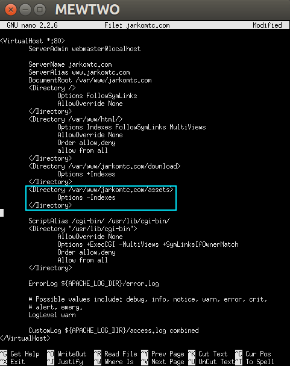
	
+ Restart apache dengan perintah `service apache2 restart`
+ Buka browser dan akses http://jarkomtc.com/assets

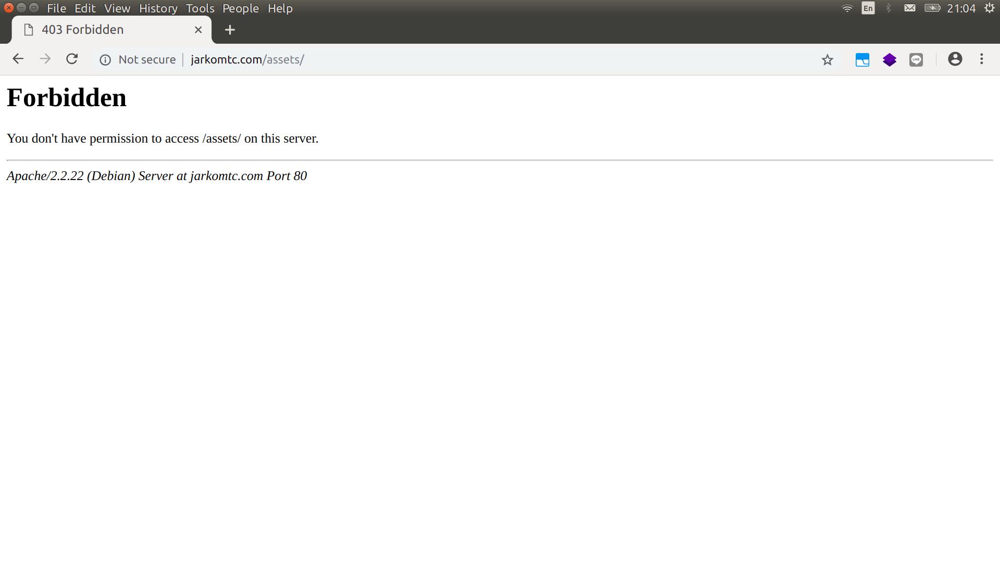

### C. Directory Alias
Karena URL __http://[IP Mewtwo]/assets/javascript__ dirasa terlalu panjang, maka Ifin mencoba membuat _directory alias_ menjadi __http://[IP Mewtwo]/assets/js__ agar Rachma tidak capek mengetik.

Berikut adalah langkah-langkah pengerjaan yang diberikan Ifin pada kalian:
+ Pindah ke _directory_ `/etc/apache2/sites-available` kemudian buka file ___jarkomtc.com___ dan tambahkan
	```    
	<Directory /var/www/jarkomtc.com/assets/javascript>
	    Options +Indexes
	</Directory>
	
	Alias "/assets/js" "/var/www/jarkomtc.com/assets/javascript"
	```
	jangan lupa untuk menyimpan perubahan tersebut agar _directory_  ___assets/javascript___ dapat menampilkan isi _directory_-nya saat pengguna mengakses __http://[IP Mewtwo]/assets/js__.
	
	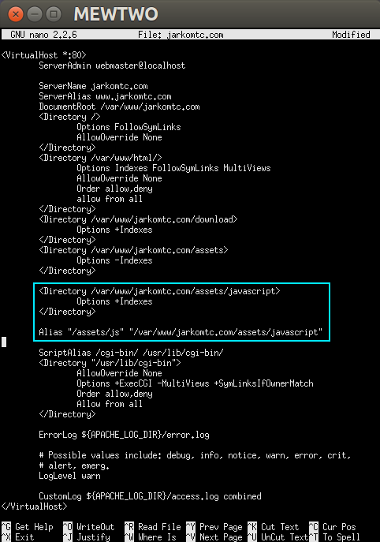
	
+ Restart apache dengan perintah `service apache2 restart`
+ Pindah ke folder __/var/www/jarkomtc.com/assets/javascript__ dan buat file __app.js__ dengan perintah `touch app.js`
+ Buka browser dan akses http://jarkomtc.com/assets/js

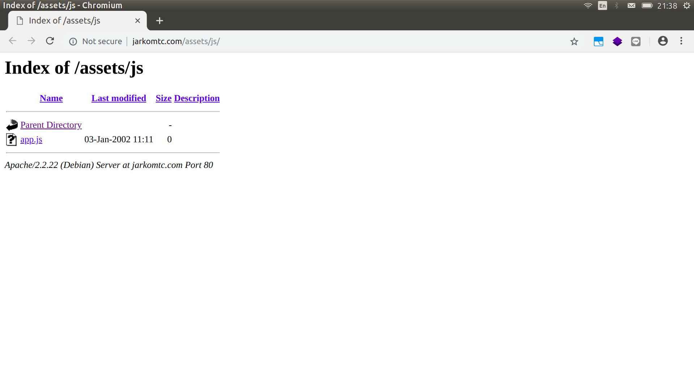

### D. Module Rewrite
#### D.1 Mengaktifkan Module Rewrite
Setelah dipikir-pikir ternyata __[http://jarkomtc.com/index.php](http://jarkomtc.com/index.php)__ kurang cantik untuk penulisan URL. Oleh sebab itu, Ifin berinisiatif untuk mengaktifkan _module rewrite_ agar ketika mengakses file php tidak perlu menambahkan ekstensi _'.php'_.
Maka kita perlu melakukan hal-hal di bawah ini:
+ Menjalankan perintah `a2enmod rewrite` untuk mengaktifkan _module rewrite_.

	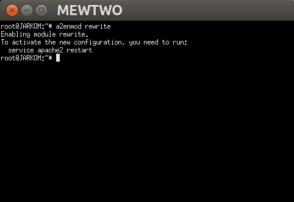
	
+ Restart apache dengan perintah `service apache2 restart`

Biasanya semua konfigurasi terhadap sebuah website diatur pada file di _directory_ __/etc/apache2/sites-available__. Namun terkadang ada sebuah kasus bahwa kita tidak memiliki hak akses root untuk edit file konfigurasi yang berada di folder __/etc/apache2/sites-available__ atau kita tidak ingin user lain untuk mengedit file konfigurasi yang berada di _directory_ __/etc/apache2/sites-available__.

Untuk mengatasi masalah tersebut, kita dapat membuat file __.htaccess__ pada _directory_ yang ingin kita atur.

Contohnya adalah seperti kasus di atas, dimana kita ingin mengatur _mod rewrite_ dari __[http://jarkomtc.com](http://jarkomtc.com)__ agar saat mengakses file php kita tidak perlu menuliskan ekstensinya. Maka yang yang perlu kita lakukan adalah
+ Pindah ke _directory_ `/var/www/jarkomtc.com` dan buat file __.htaccess__ dengan isi file
	```
	RewriteEngine On
	RewriteCond %{REQUEST_FILENAME} !-d
	RewriteRule ^([^\.]+)$ $1.php [NC,L]
	```
	
	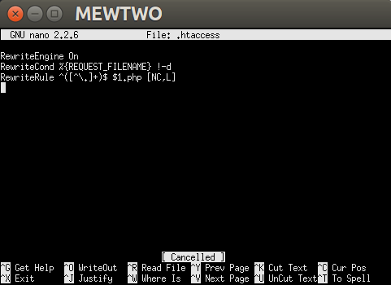

	__Keterangan__:
	+ `RewriteEngine On` = untuk flag bahwa menggunakan module rewrite
	+ `RewriteCond %{REQUEST_FILENAME} !-d` = aturan tidak akan jalan ketika yang diakses adalah _directory_ (d)
	+ `RewriteRule ^([^\.]+)$ $1.php [NC,L]` = $1 adalah parameter input yang akan dicari oleh webserver
	* Lebih detailnya [klik disini](https://httpd.apache.org/docs/2.4/rewrite/flags.html)
+ Buat file _aboutus.php_ di dalam _directory_ `/var/www/jarkomtc.com/` dengan isi
	```
	<?php
		echo "Terima Kasih telah mengunjungi about us";
	?>
	```
+ Pindah ke _directory_ `/etc/apache2/sites-available` kemudian buka file ___jarkomtc.com___ dan tambahkan
	```
	<Directory /var/www/jarkomtc.com>
	    Options +FollowSymLinks -Multiviews
	    AllowOverride All
	</Directory>
	```
	jangan lupa untuk menyimpan perubahan tersebut.
	
	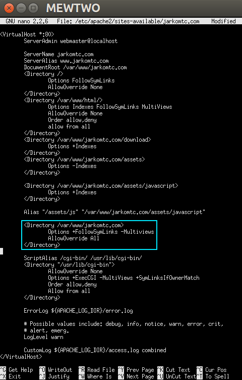
	
	__Keterangan__:
	+ `AllowOverride All` ditambahkan agar  konfigurasi __.htaccess__ dapat berjalan.
	+ `+FollowSymLinks` ditambahkan agar konfigurasi __mod_rewrite__ dapat berjalan.
	+ `-Multiviews` ditambahkan agar konfigurasi __mod_negotiation__ tidak dapat berjalan. __mod_negotiation__ bisa '_rewrite_' _requests_ sehingga menimpa dan mengganggu __mod_rewrite__.
	+ Restart apache dengan perintah `service apache2 restart`
	+ Buka browser dan akses __http://jarkomtc.com/aboutus__

	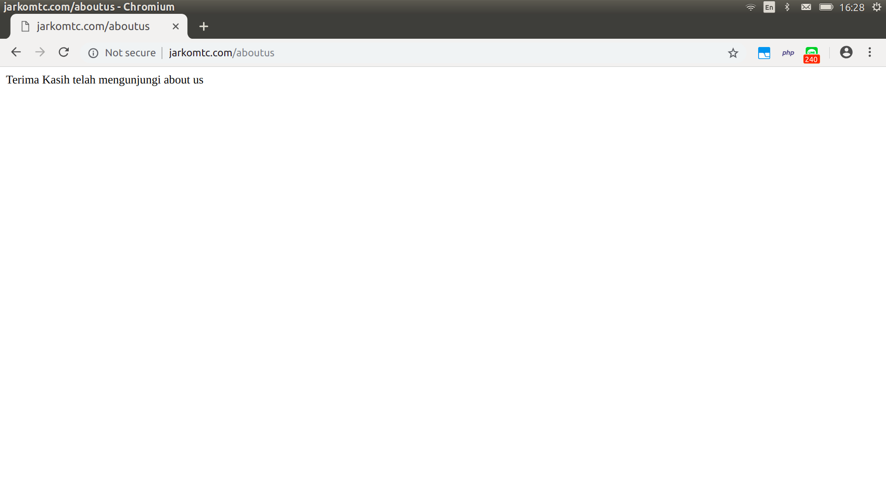
	
### E. Otorisasi
Pada web http:jarkomtc.com terdapat path __/data__ yang tidak boleh dibuka sembarang orang. Rachma ingin __/data__ hanya boleh diakses oleh pengguna yang memiliki IP 10.151.252.0/255.255.252.0

Maka yang diinstruksikan Ifin agar _directory_ __/data__ milik Rachma tetap aman adalah
+ Pindah ke _directory_ `/etc/apache2/sites-available` kemudian buka file ___jarkomtc.com___ dan tambahkan
	```
	<Directory /var/www/jarkomtc.com/data>
	    Options +Indexes
	    Order deny,allow
	    Deny from all
	    Allow from 10.151.252.0/255.255.252.0
	</Directory>
	```
	jangan lupa untuk menyimpan perubahan tersebut.
	
	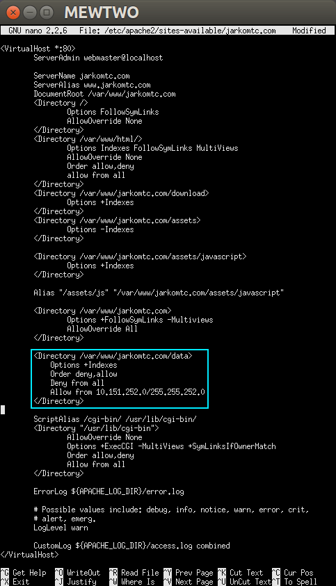
	
	__Keterangan__:
	+ `Order deny, allow` merupakan urutan hak akses. Terdapat dua jenis tipe order yaitu:
		+ `deny,allow`: Bagian _Deny_ harus di-_declare_ terlebih dahulu sebelum _Allow_
		+ `allow,deny`: Bagian _Allow_ harus di-_declare_ terlebih dahulu sebelum _Deny_
	+ `Deny from all`  berarti semua pengguna ditolak
	+ `Allow from 10.151.252.0/255.255.252.0` berarti apabila pengguna memiliki IP NID 10.151.252.0./22, ia diperbolehkan untuk mengakses halaman.
	+ Info lebih lanjut [klik disini](https://httpd.apache.org/docs/2.4/mod/mod_access_compat.html)	+ Restart apache dengan perintah `service apache2 restart`
+ Buka browser dan akses __http://jarkomtc.com/data__
Saat pengguna tidak memiliki __IP NID 10.151.252.0/22__ maka akan muncul halaman seperti di bawah ini

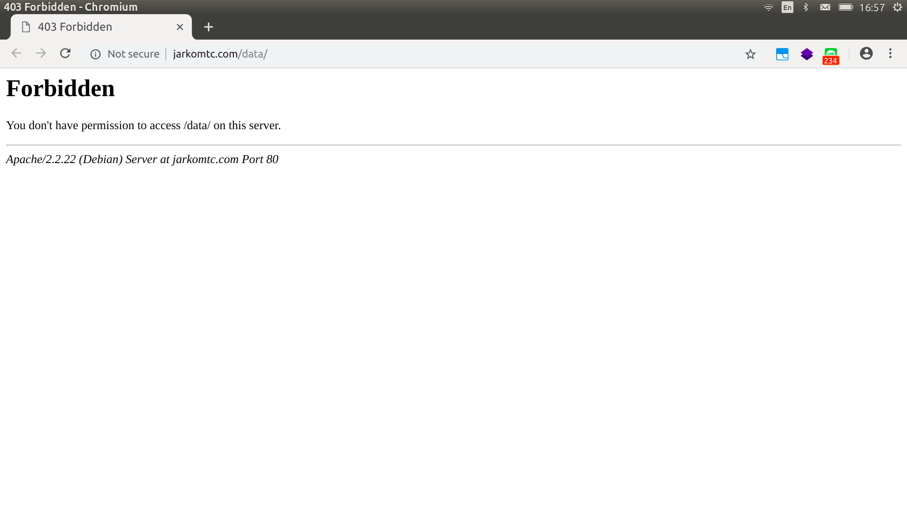

Sedangkan saat pengguna  memiliki __IP NID 10.151.252.0/22__ maka halaman yang muncul adalah seperti di bawah ini

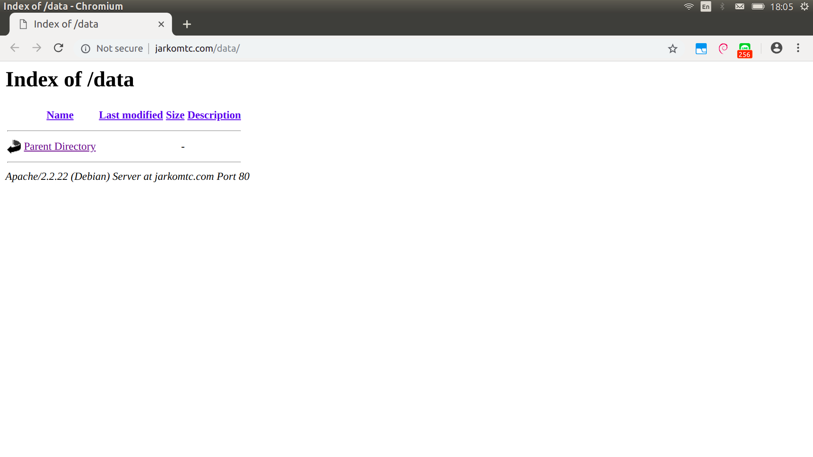

## I. Latihan
1. Download halaman PokePoke di 10.151.36.234/pokepoke.zip
2. Buat domain baru dengan nama __personalpoke.xx.id__ untuk membuka halaman tersebut.
3. Atur agar jika kalian mengetikkan __personalpoke.xx.id__, Web PokePoke dapat terbuka.

### Catatan
+ Untuk download halaman web, gunakan perintah `wget 10.151.36.234/pokepoke.zip`
+ Untuk nomor 2 dan 3, '__xx__' diisi dengan nama kelompok. Contoh: __personalpoke.a4.id__

## Selamat belajar dan tetap semangat!
<!--stackedit_data:
eyJoaXN0b3J5IjpbLTQzNDI2NDY1OSwtMTAzNDgzODA5OSwtMT
g2NzQ5NjA0NCwtMzY4NTM1OTc1LDE4MTg3MjkwOTUsMzY3MTc3
MjYzLC0zMjg3MTg3MjksMjgzNjIxOTgzLDQ0MDkxODA4OSwxMj
c5Mjc3NzgxLDIwNjA1ODY0MjUsMTM4MDYzNDQwMywtMTgxNTY0
NzQ5NiwtNDA3MDQyNDYzLC0yMDU0NjU4ODI0LC0xMDU1NjY1MD
AyLDE0MzkwMTQyOTcsMTY1OTUwOTE2Niw2NzU2MzE0ODYsNzgw
OTkwNDQxXX0=
-->
