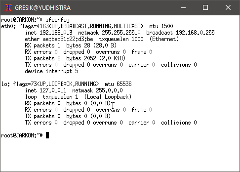
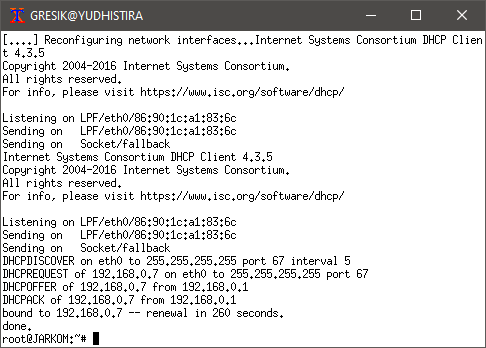

# 1. Dynamic Host Configuration Protocol (DHCP)

## Outline

- [1. Dynamic Host Configuration Protocol (DHCP)](#1-dynamic-host-configuration-protocol-dhcp)
  - [Outline](#outline)
  - [1.1 Konsep](#11-konsep)
    - [1.1.1 Pendahuluan](#111-pendahuluan)
    - [1.1.2 Apa itu DHCP?](#112-apa-itu-dhcp)
    - [1.1.3 Bootstrap Protocol dan DHCP](#113-bootstrap-protocol-dan-dhcp)
    - [1.1.4 DHCP Message Header](#114-dhcp-message-header)
    - [1.1.5 Cara Kerja DHCP](#115-cara-kerja-dhcp)
  - [1.2 Implementasi](#12-implementasi)
    - [1.2.1 Instalasi ISC-DHCP-Server](#121-instalasi-isc-dhcp-server)
    - [1.2.2 Konfigurasi DHCP Server](#122-konfigurasi-dhcp-server)
    - [1.2.3 Konfigurasi DHCP Client](#123-konfigurasi-dhcp-client)
    - [1.2.4 Fixed Address](#124-fixed-address)
    - [1.2.5 Testing](#125-testing)
  - [Soal Latihan](#soal-latihan)
  - [Referensi](#referensi)

## 1.1 Konsep

### 1.1.1 Pendahuluan

Pada modul-modul sebelumnya, kita telah mempelajari cara mengonfigurasi IP, nameserver, gateway, dan subnetmask pada UML secara manual. Metode manual ini oke-oke saja saat diimplementasikan pada jaringan yang memiliki sedikit host. Tapi bagaimana jika jaringan tersebut memiliki banyak host? Jaringan WiFi umum misalnya. Apakah Administrator Jaringannya harus mengonfigurasi setiap host-nya satu per satu? Membayangkannya saja mengerikan, ya.

Di sinilah peran DHCP sangat dibutuhkan.

### 1.1.2 Apa itu DHCP?

**Dynamic Host Configuration Protocol (DHCP)** adalah protokol berbasis arsitektur _client-server_ yang dipakai untuk memudahkan pengalokasian alamat IP dalam satu jaringan. DHCP secara otomatis akan meminjamkan alamat IP kepada host yang memintanya.


Tanpa DHCP, administrator jaringan harus memasukkan alamat IP masing-masing komputer dalam suatu jaringan secara manual. Namun jika DHCP dipasang di jaringan, maka semua komputer yang tersambung ke jaringan akan mendapatkan alamat IP secara otomatis dari DHCP server.

### 1.1.3 Bootstrap Protocol dan Dynamic Host Configuration Protocol

Selain DHCP, terdapat protokol lain yang juga memudahkan pengalokasian alamat IP dalam suatu jaringan, yaitu Bootstrap Protocol (BOOTP). Perbedaan BOOTP dan DHCP terletak pada proses konfigurasinya.

| BOOTP                                                                                       | DHCP                                                                                                                                               |
| ------------------------------------------------------------------------------------------- | -------------------------------------------------------------------------------------------------------------------------------------------------- |
| Administrator jaringan melakukan konfigurasi mapping MAC Address client dengan IP tertentu. | Server akan melakukan peminjaman IP Address dan konfigurasi lainnya dalam rentang waktu tertentu. Protokol ini dibuat berdasarkan cara kerja BOOTP |

### 1.1.4 DHCP Message Header


### 1.1.5 Cara Kerja DHCP

DHCP bekerja dengan melibatkan dua pihak yakni **Server** dan **Client**:

1. **DHCP Server** memberikan suatu layanan yang dapat memberikan alamat IP dan parameter lainnya kepada semua client yang memintanya.
2. **DHCP Client** adalah mesin client yang menjalankan perangkat lunak client yang memungkinkan mereka untuk dapat berkomunikasi dengan DHCP server.
   DHCP Server umumnya memiliki sekumpulan alamat IP yang didistribusikan yang disebut DHCP Pool. Setiap client akan meminjamnya untuk rentan waktu yang ditentukan oleh DHCP sendiri (dalam konfigurasi). Jika masa waktu habis, maka client akan meminta alamat IP yang baru atau memperpanjangnya. Itulah sebabnya alamat IP client menjadi dinamis.


Terdapat 5 tahapan yang dilakukan dalam proses peminjaman alamat IP pada DHCP:

1. **DHCPDISCOVER**: Client menyebarkan request secara broadcast untuk mencari DHCP Server yang aktif. DHCP Server menggunakan UDP port 67 untuk menerima broadcast dari client melalui port 68.
2. **DHCPOFFER**: DHCP server menawarkan alamat IP (dan konfigurasi lainnya apabila ada) kepada client. Alamat IP yang ditawarkan adalah salah satu alamat yang tersedia dalam DHCP Pool pada DHCP Server yang bersangkutan.
3. **DHCPREQUEST**: Client menerima tawaran dan menyetujui peminjaman alamat IP tersebut kepada DHCP Server.
4. **DHCPACK**: DHCP server menyetujui permintaan alamat IP dari client dengan mengirimkan paket ACKnoledgment berupa konfirmasi alamat IP dan informasi lain. Kemudian client melakukan inisialisasi dengan mengikat (binding) alamat IP tersebut dan client dapat bekerja pada jaringan tersebut. DHCP Server akan mencatat peminjaman yang terjadi.
5. **DHCPRELEASE**: Client menghentikan peminjaman alamat IP (apabila waktu peminjaman habis atau menerima DHCPNAK).


Lebih lanjut: [https://www.nada.kth.se/kurser/kth/2D1392/05/lectures/lecture_9.pdf](https://www.nada.kth.se/kurser/kth/2D1392/05/lectures/lecture_9.pdf)

## 1.2 Implementasi

### 1.2.1 Instalasi ISC-DHCP-Server

Pada topologi ini, kita akan menjadikan router **SURABAYA** sebagai DHCP Server. Oleh sebab itu, kita harus meng-_install_ **isc-dhcp-server** di **SURABAYA** dengan melakukan langkah-langkah berikut:

1. Update _package lists_ di router **SURABAYA** dengan perintah

```
apt-get update
```

2. Install **isc-dhcp-server** di router **SURABAYA**

```
apt-get install isc-dhcp-server
```


Abaikan **error** tersebut setelah instalasi isc-dhcp server. Hal itu terjadi karena belum adanya konfigurasi dhcp servernya.

### 1.2.2 Konfigurasi DHCP Server

Langkah-langkah yang harus dilakukan setelah instalasi adalah:

#### A. Menentukan interface mana yang akan diberi layanan DHCP

##### A.1. Buka file konfigurasi interface dengan perintah

```sh
nano /etc/default/isc-dhcp-server
```

##### A.2. Tentukan interface

Coba perhatikan topologi yang telah kalian buat. Interface dari router **SURABAYA** yang menuju ke client **GRESIK**, **SIDOARJO**, dan **BANYUWANGI** adalah `eth2`, maka kita akan memilih interface `eth2` untuk diberikan layanan DHCP.

```sh
INTERFACES="eth2"
```


#### B. Langkah selanjutnya adalah mengonfigurasi DHCP

Ada banyak hal yang dapat dikonfigurasi, antara lain:

- Range IP
- DNS Server
- Informasi Netmask
- Default Gateway
- dll.

##### B.1. Buka file konfigurasi DHCP dengan perintah

```sh
nano /etc/dhcp/dhcpd.conf
```

##### B.2. Tambahkan script berikut

```conf
subnet 'NID' netmask 'Netmask' {
    range 'IP_Awal' 'IP_Akhir';
    option routers 'iP_Gateway';
    option broadcast-address 'IP_Broadcast';
    option domain-name-servers 'DNS_yang_diinginkan';
    default-lease-time 'Waktu';
    max-lease-time 'Waktu';
}
```

Script tersebut mengatur parameter jaringan yang dapat didistribusikan oleh DHCP, seperti informasi netmask, default gateway dan DNS server. Berikut ini beberapa parameter jaringan dasar yang biasanya digunakan:

| **No** | **Parameter Jaringan**                             | **Keterangan**                                                                                                                                                                                                                                                                                         |
| ------ | -------------------------------------------------- | ------------------------------------------------------------------------------------------------------------------------------------------------------------------------------------------------------------------------------------------------------------------------------------------------------ |
| 1      | `subnet 'NID'`                                     | Netword ID pada subnet                                                                                                                                                                                                                                                                                 |
| 2      | `netmask 'Netmask`                                 | Netmask pada subnet                                                                                                                                                                                                                                                                                    |
| 3      | `range 'IP_Awal' 'IP_Akhir'`                       | Rentang alamat IP yang akan didistribusikan dan digunakan secara dinamis                                                                                                                                                                                                                               |
| 4      | `option routers 'Gateway'`                         | IP gateway dari router menuju client sesuai konfigurasi subnet                                                                                                                                                                                                                                         |
| 5      | `option broadcast-address 'IP_Broadcast'`          | IP broadcast pada subnet                                                                                                                                                                                                                                                                               |
| 6      | `option domain-name-servers 'DNS_yang_diinginkan'` | DNS yang ingin kita berikan pada client                                                                                                                                                                                                                                                                |
| 7      | Lease time                                         | Waktu yang dialokasikan ketika sebuah IP dipinjamkan kepada komputer client. Setelah waktu pinjam ini selesai, maka IP tersebut dapat dipinjam lagi oleh komputer yang sama atau komputer tersebut mendapatkan alamat IP lain jika alamat IP yang sebelumnya dipinjam, dipergunakan oleh komputer lain |
| 8      | `default-lease-time 'Waktu'`                       | Lama waktu DHCP server meminjamkan alamat IP kepada client, dalam satuan detik. Default 600 detik                                                                                                                                                                                                      |
| 9      | `max-lease-time 'Waktu'`                           | Waktu maksimal yang di alokasikan untuk peminjaman IP oleh DHCP server ke client dalam satuan detik. Default 7200 detik                                                                                                                                                                                |

Sehingga konfigurasinya menjadi:


##### A.3. Restart service `isc-dhcp-server` dengan perintah

```sh
service isc-dhcp-server restart
```

Jika terjadi **failed!**, maka stop dulu, kemudian start kembali

```sh
service isc-dhcp-server stop
service isc-dhcp-server start
```


Konfigurasi DHCP Server selesai!

### 1.2.3 Konfigurasi DHCP Client

Setelah mengonfigurasi server, kita juga perlu mengonfigurasi interface client supaya bisa mendapatkan layanan dari DHCP server. Di dalam topologi ini, clientnya adalah **GRESIK**, **SIDOARJO**, dan **BANYUWANGI**.

#### A. Mengonfigurasi Client

##### A.1. Periksa IP GRESIK dengan `ifconfig`



Dari konfigurasi sebelumnya, **GRESIK** telah diberikan IP statis 192.168.0.3

##### A.2. Buka `/etc/network/interfaces` untuk mengonfigurasi interface **GRESIK**

```sh
nano /etc/network/interfaces
```

##### A.3. Comment atau hapus konfigurasi yang lama (konfigurasi IP statis)

Lalu tambahkan:

```sh
auto eth0
iface eth0 inet dhcp
```


**Keterangan**:

- **eth0** adalah interface yang digunakan client
- `iface eth0 inet dhcp`: memberikan konfigurasi DHCP pada interface eth0, bukan konfigurasi statis

##### A.4. Restart network dengan perintah `service networking restart`



#### B. Testing

Cek kembali IP **GRESIK** dengan menjalankan `ifconfig`


Periksa juga apakah **GRESIK** sudah mendapatkan DNS server sesuai konfigurasi di DHCP. Periksa `/etc/resolv.conf` dengan menggunakan perintah

```sh
cat /etc/resolv.conf
```


Bila IP dan nameserver **GRESIK** telah berubah sesuai dengan konfigurasi yang diberikan oleh DHCP, maka selamat. Kalian telah berhasil!

**Keterangan**:

- Jika IP **GRESIK** masih belum berubah, jangan panik. Lakukanlah kembali `service networking restart`
- Jika masih belum berubah juga, jangan buru-buru bertanya. Coba periksa lagi semua konfigurasi yang telah kalian lakukan, mungkin terdapat kesalahan penulisan.

#### C. Lakukan kembali langkah - langkah di atas pada client SIDOARJO dan BANYUWANGI

- Client **SIDOARJO**


- Client **BANYUWANGI**


Setelah IP dipinjamkan ke sebuah client, maka IP tersebut tidak akan diberikan ke client lain. Buktinya, tidak ada client yang mendapatkan IP yang sama.

### 1.2.4 Fixed Address

> **Sebuah Kasus**:
>
> Ternyata PC **BANYUWANGI** selain menjadi client, juga akan digunakan sebagai server suatu aplikasi, sehingga akan menyulitkan jika IP nya berganti-ganti setiap **BANYUWANGI** terhubung ke jaringan internet. Oleh karena itu, **BANYUWANGI** membutuhkan IP yang tidak berganti-ganti.

Untuk menyelesaikan kasus tersebut, DHCP Server memiliki layanan untuk "menyewakan" alamat IP secara tetap pada suatu host, yakni **Fixed Address**. Dalam kasus ini, **BANYUWANGI** akan mendapatkan IP tetap 192.168.0.10

#### A. Konfigurasi DHCP Server di router SURABAYA

##### A.1. Buka file konfigurasi DHCP dengan perintah

```sh
nano /etc/dhcp/dhcpd.conf
```

##### A.2. Tambahkan script berikut

```conf
host BANYUWANGI {
    hardware ethernet 'hwaddress_BANYUWANGI';
    fixed-address 192.168.0.10;
}
```


**Penjelasan**:

- Untuk mencari `'hwaddress_BANYUWANGI'` (hardware address) kalian bisa memeriksanya di UML **BANYUWANGI** dengan command `ifconfig`


- **fixed-address** adalah alamat IP yang "disewa" tetap oleh **BANYUWANGI**

##### A.3. Restart service `isc-dhcp-server` pada **SURABAYA** dengan perintah

```sh
service isc-dhcp-server restart
```

#### B. Konfigurasi DHCP Client

##### B.1. Buka `/etc/network/interfaces` untuk mengonfigurasi interface **BANYUWANGI**

```sh
nano /etc/network/interfaces
```

##### B.2. Buka `/etc/network/interfaces` untuk mengonfigurasi interface **BANYUWANGI**

Lalu tambahkan:

```conf
hwaddress ether 'hwaddress_BANYUWANGI'
```


**Keterangan**:
Hardware addresss perlu di-_setting_ juga di `/etc/network/interfaces` karena perangkat yang kalian gunakan adalah perangkat virtual (UML), dimana hwaddress-nya akan berubah setiap kali dijalankan.

#### B.3. Restart network dengan perintah `service networking restart`


#### C. Testing

Periksa IP **BANYUWANGI** dengan melakukan `ifconfig`


IP **BANYUWANGI** telah berubah menjadi 192.168.0.10 sesuai dengan Fixed Address yang diberikan oleh DHCP Server.

### 1.2.5 Testing

Setelah melakukan berbagai konfigurasi di atas, kalian bisa memastikan apakah DHCP Server kalian berhasil dengan cara:

1. Matikan UML kalian dengan `bash bye.sh`
2. Jalankan UML kalian kemabali dengan `bash topologi.sh`
3. Periksa IP di semua client dengan `ifconfig`


Jika **GRESIK** dan **SIDOARJO** berganti alamat IP sesuai dengan range yang telah dikonfigurasi DHCP dan **BANYUWANGI** tetap mendapatkan IP 192.168.0.10, maka konfigurasi DHCP server kalian berhasil.

## Soal Latihan

1. Buatlah konfigurasi DHCP agar GRESIK dan SIDOARJO mendapatkan IP dengan range 192.168.0.2 - 192.168.0.10 dan 192.168.0.12 - 192.168.0.16 dengan syarat:
Setiap 1 menit ip yg digunakan client berubah dan juga dns diarahkan ke dns server kalian sendiri tetapi tetap bisa digunakan untuk mengakses internet.

## Referensi
- [https://www.isc.org/dhcp/](https://www.isc.org/dhcp/)
- [http://www.tcpipguide.com/free/t_DHCPGeneralOperationandClientFiniteStateMachine.htm](http://www.tcpipguide.com/free/t_DHCPGeneralOperationandClientFiniteStateMachine.htm)

