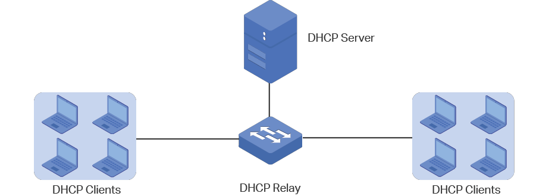

# **1. Dynamic Host Configuration Protocol (DHCP)**

Materi pada modul ini akan cukup banyak dengan *outline* sebagai berikut.

## **Outline**

- [**1. Dynamic Host Configuration Protocol (DHCP)**](#1-dynamic-host-configuration-protocol-dhcp)
  - [**Outline**](#outline)
  - [**1.1 Konsep**](#11-konsep)
    - [**1.1.1 Pendahuluan**](#111-pendahuluan)
    - [**1.1.2 Apa itu DHCP?**](#112-apa-itu-dhcp)
    - [**1.1.3 Bootstrap Protocol dan Dynamic Host Configuration Protocol**](#113-bootstrap-protocol-dan-dynamic-host-configuration-protocol)
    - [**1.1.4 DHCP Message Header**](#114-dhcp-message-header)
    - [**1.1.5 Cara Kerja DHCP**](#115-cara-kerja-dhcp)
    - [**1.1.6 DHCP Relay**](#116-dhcp-relay)
      - [A. Konsep DHCP Relay](#a-konsep-dhcp-relay)
      - [B. Mengapa DHCP Relay diperlukan?](#b-mengapa-dhcp-relay-diperlukan)
    - [**1.7 DHCP Lease Time**](#17-dhcp-lease-time)
      - [A. Lease Time dalam DHCP](#a-lease-time-dalam-dhcp)
      - [B. Pentingnya Pengaturan Lease Time](#b-pentingnya-pengaturan-lease-time)
  - [**1.2 Implementasi**](#12-implementasi)
    - [**1.2.1 Instalasi ISC-DHCP-Server**](#121-instalasi-isc-dhcp-server)
    - [**1.2.2 Konfigurasi DHCP Server**](#122-konfigurasi-dhcp-server)
      - [A. Menentukan *Interface* yang akan Diberi Layanan DHCP](#a-menentukan-interface-yang-akan-diberi-layanan-dhcp)
        - [A.1. Buka *File* Konfigurasi *Interface*](#a1-buka-file-konfigurasi-interface)
        - [A.2. Tentukan *Interface*](#a2-tentukan-interface)
      - [B. Melakukan Konfigurasi pada `isc-dhcp-server`](#b-melakukan-konfigurasi-pada-isc-dhcp-server)
        - [B.1. Buka *File* Konfigurasi DHCP](#b1-buka-file-konfigurasi-dhcp)
        - [B.2. Tambahkan *Script* Konfigurasi](#b2-tambahkan-script-konfigurasi)
        - [A.3. Restart Service `isc-dhcp-server` Dengan Perintah](#a3-restart-service-isc-dhcp-server-dengan-perintah)
    - [**1.2.3 Konfigurasi DHCP Relay**](#123-konfigurasi-dhcp-relay)
      - [A. Melakukan Instalasi](#a-melakukan-instalasi)
      - [B. Melakukan Konfigurasi pada `isc-dhcp-relay`](#b-melakukan-konfigurasi-pada-isc-dhcp-relay)
      - [C. Melakukan Konfigurasi IP Forwarding](#c-melakukan-konfigurasi-ip-forwarding)
    - [**1.2.4 Konfigurasi DHCP Client**](#124-konfigurasi-dhcp-client)
      - [A. Mengonfigurasi *Client*](#a-mengonfigurasi-client)
        - [A.1. Periksa IP Alabasta dengan `ip a`](#a1-periksa-ip-alabasta-dengan-ip-a)
        - [A.2. Buka `/etc/network/interfaces` untuk Mengonfigurasi *Interface* **Alabasta**](#a2-buka-etcnetworkinterfaces-untuk-mengonfigurasi-interface-alabasta)
        - [A.3. *Comment* atau Hapus Konfigurasi yang Lama (Konfigurasi `IP Address` Statis)](#a3-comment-atau-hapus-konfigurasi-yang-lama-konfigurasi-ip-address-statis)
        - [A.4. Restart Alabasta](#a4-restart-alabasta)
      - [B. Testing](#b-testing)
      - [C. Lakukan kembali langkah - langkah di atas pada client Loguetown dan Jipangu](#c-lakukan-kembali-langkah---langkah-di-atas-pada-client-loguetown-dan-jipangu)
    - [**1.2.5 Leasing Times**](#125-leasing-times)
    - [**1.2.6 Fixed Address**](#126-fixed-address)
      - [A. Konfigurasi `DHCP Server` di *Router* Foosha](#a-konfigurasi-dhcp-server-di-router-foosha)
        - [A.1. Buka File Konfigurasi `isc-dhcp-server`](#a1-buka-file-konfigurasi-isc-dhcp-server)
        - [A.2. Tambahkan *Script* Berikut](#a2-tambahkan-script-berikut)
        - [A.3. *Restart* *Service* `isc-dhcp-server` pada **Westalis**](#a3-restart-service-isc-dhcp-server-pada-westalis)
      - [B. Konfigurasi `DHCP Client`](#b-konfigurasi-dhcp-client)
        - [B.1. Konfigurasi *Network Interface* **Jipangu**](#b1-konfigurasi-network-interface-jipangu)
        - [B.2. Tambah konfigurasi berikut](#b2-tambah-konfigurasi-berikut)
      - [B.3. *Restart Node* Jipangu](#b3-restart-node-jipangu)
      - [C. *Testing*](#c-testing)
    - [**1.2.7 Menguji Konfigurasi DHCP pada Topologi**](#127-menguji-konfigurasi-dhcp-pada-topologi)
  - [**Soal Latihan**](#soal-latihan)
  - [**Referensi**](#referensi)
- [**Love Sign dari Oniel 🙆‍♀️🙆‍♂️**](#love-sign-dari-oniel-️️)

</br>

## **1.1 Konsep**

Sebelum membahas lebih jauh, kita akan berkenalan pelan-pelan dengan DHCP. Kalian akan mempelajari konsep, cara kerja, dan implementasi DHCP. Selamat membaca!

### **1.1.1 Pendahuluan**

Pada modul-modul sebelumnya, kita telah mempelajari cara mengonfigurasi `IP Address`, `nameserver`, `gateway`, dan `subnetmask` pada *node* secara manual. Metode manual ini oke-oke saja saat diimplementasikan pada jaringan yang memiliki sedikit *host*. Tapi bagaimana jika jaringan tersebut memiliki banyak host? Jaringan WiFi umum misalnya. Apakah administrator jaringannya harus mengonfigurasi setiap *host*-nya satu per satu? Membayangkannya saja mengerikan, ya.

Di sinilah peran DHCP sangat dibutuhkan.

### **1.1.2 Apa itu DHCP?**

**Dynamic Host Configuration Protocol (DHCP)** adalah protokol berbasis arsitektur *client-server* yang dipakai untuk memudahkan pengalokasian `IP Address` dalam satu jaringan. DHCP secara otomatis akan meminjamkan `IP Address` kepada *host* yang memintanya.


Tanpa DHCP, administrator jaringan harus memasukkan `IP Address` masing-masing komputer dalam suatu jaringan secara manual. Namun jika DHCP dipasang di jaringan, maka semua komputer yang tersambung ke jaringan akan mendapatkan `IP Address` secara otomatis dari `DHCP Server`.

### **1.1.3 Bootstrap Protocol dan Dynamic Host Configuration Protocol**

Selain DHCP, terdapat protokol lain yang juga memudahkan pengalokasian `IP Address` dalam suatu jaringan, yaitu `Bootstrap Protocol (BOOTP)`. Perbedaan `BOOTP` dan DHCP terletak pada proses konfigurasinya, sebagai berikut.

| BOOTP                                                                                       | DHCP                                                                                                                                               |
| ------------------------------------------------------------------------------------------- | -------------------------------------------------------------------------------------------------------------------------------------------------- |
| Administrator jaringan melakukan konfigurasi *mapping* `MAC Address` *client* dengan `IP Address` tertentu. | *Server* akan melakukan peminjaman `IP Address` dan konfigurasi lainnya dalam rentang waktu tertentu. Protokol ini dibuat berdasarkan cara kerja `BOOTP` |

### **1.1.4 DHCP Message Header**


### **1.1.5 Cara Kerja DHCP**

DHCP bekerja dengan melibatkan dua pihak yakni **Server** dan **Client** sebagai berikut.

1. **DHCP Server** memberikan suatu layanan yang dapat memberikan `IP Address` dan parameter lainnya kepada semua *client* yang memintanya.
2. **DHCP Client** adalah mesin *client* yang menjalankan perangkat lunak *client* yang memungkinkan mereka untuk dapat berkomunikasi dengan `DHCP Server`.
   `DHCP Server` umumnya memiliki sekumpulan `IP Address` yang didistribusikan yang disebut `DHCP Pool`. Setiap *client* akan meminjamnya untuk rentan waktu yang ditentukan oleh DHCP sendiri (dalam konfigurasi, yang disebut dengan *leasing time*). Jika masa waktu habis, maka client akan meminta `IP Address` yang baru atau memperpanjangnya. Itulah sebabnya `IP Address` client menjadi dinamis.


Terdapat 5 tahapan yang dilakukan dalam proses peminjaman `IP Address` pada DHCP, yaitu sebagai berikut.

1. **DHCPDISCOVER**: *Client* menyebarkan request secara *broadcast* untuk mencari `DHCP Server` yang aktif. `DHCP Server` menggunakan UDP port 67 untuk menerima broadcast dari client melalui port 68.
2. **DHCPOFFER**: `DHCP Server` menawarkan `IP Address` (dan konfigurasi lainnya apabila ada) kepada *client*. `IP Address` yang ditawarkan adalah salah satu alamat yang tersedia dalam `DHCP Pool` pada `DHCP Server` yang bersangkutan.
3. **DHCPREQUEST**: *Client* menerima tawaran dan menyetujui peminjaman `IP Address` tersebut kepada `DHCP Server`.
4. **DHCPACK**: DHCP server menyetujui permintaan `IP Address` dari *client* dengan mengirimkan paket `ACKnoledgment` berupa konfirmasi `IP Address` dan informasi lain. Kemudian, *client* melakukan inisialisasi dengan mengikat (*binding*) `IP Address` tersebut dan *client* dapat bekerja pada jaringan tersebut. `DHCP Server` akan mencatat peminjaman yang terjadi.
5. **DHCPRELEASE**: *Client* menghentikan peminjaman `IP Address` (apabila waktu peminjaman habis atau menerima `DHCPNAK`).


Lebih lanjut, kalian dapat menonton atau melihat visualisasi kerja dari DHCP di berbagai sumber untuk menambah pemahaman. Salah satunya, adalah pada video berikut [https://youtu.be/S43CFcpOZSI](https://youtu.be/S43CFcpOZSI).

### **1.1.6 DHCP Relay**

Sebelumnya, telah disebutkan bahwa DHCP melibatkan dua pihak, yaitu `DHCP Server` dan `DHCP Client`. Pada bagian ini, dibahas satu pihak lain yang juga terlibat dalam proses peminjaman `IP Address`, yaitu `DHCP Relay`. Apa itu `DHCP Relay`?

#### A. Konsep DHCP Relay
    
`DHCP Relay` adalah perangkat jaringan (dengan skenario paling umum perangkat jaringan tersebut adalah `router`) yang berfungsi sebagai perantara atau penerus (*forwarder*) antara `DHCP Client` dan `DHCP Server` yang tidak berada dalam satu segmen jaringan yang sama. `DHCP Relay` menerima *request* dari `DHCP Client` lalu meneruskannya ke `DHCP Server`. Begitu juga sebaliknya, `DHCP Relay` menerima *response* dari `DHCP Server` lalu meneruskannya ke `DHCP Client`. Dengan adanya `DHCP Relay`, maka `DHCP Client` dan `DHCP Server` tidak perlu berada dalam satu segmen jaringan yang sama.

>Beberapa dari kalian saat membaca kalimat pertama dari penjelasan `DHCP Relay` mungkin akan berfikir bahwa `DHCP Relay` memiliki peran yang sama seperti switch. Nah, maka pemahaman itu adalah salah, ya! 

Penempatan `DHCP Relay` dalam suatu jaringan bisa diilustrasikan seperti berikut.


    
Sebagai *forwarder*, cara atau tahapan kerja DHCP dengan pelibatan `DHCP Relay` akan sama seperti yang telah dijelaskan sebelumnya, tetapi dengan beberapa penyesuaian. Singkatnya seperti berikut.
 - `DHCP Relay` akan menerima `DHCPDISCOVER` dari `DHCP Client`, kemudian meneruskannya ke `DHCP Server`. 
 - `DHCP Server` akan mengirimkan `DHCPOFFER` kepada `DHCP Relay`, kemudian `DHCP Relay` akan meneruskannya ke `DHCP Client`. 
 - `DHCP Relay` juga akan meneruskan `DHCPREQUEST` dari `DHCP Client` ke `DHCP Server`, kemudian `DHCP Server` akan mengirimkan `DHCPACK` kepada `DHCP Relay`, dan `DHCP Relay` akan meneruskannya ke `DHCP Client`. 
 - `DHCP Relay` juga akan meneruskan `DHCPRELEASE` dari `DHCP Client` ke `DHCP Server`, kemudian `DHCP Server` akan mengirimkan `DHCPNAK` kepada `DHCP Relay`, dan `DHCP Relay` akan meneruskannya ke `DHCP Client`.

>Tentu kalian tidak asing dengan istilah tersebut? Ya, istilah tersebut mirip dengan proses *handshake* pada protokol TCP!

#### B. Mengapa DHCP Relay diperlukan?

Ada beberapa alasan mengapa `DHCP Relay` diperlukan, yaitu sebagai berikut.

- Memungkinkan `DHCP Server` melayani `DHCP Client` yang berada di luar segmen jaringan lokal. Tanpa `DHCP Relay`, DHCP hanya dapat bekerja dalam satu segmen jaringan lokal.
- Menghemat `IP Address`. Dengan `DHCP Relay`, hanya dibutuhkan satu `DHCP Server` untuk melayani banyak segmen jaringan. Tanpa `DHCP Relay`, setiap segmen jaringan memerlukan `DHCP Server` masing-masing.
- Memudahkan manajemen jaringan. Administrator jaringan cukup melakukan konfigurasi dan manajemen pada satu `DHCP Server` saja, tidak perlu satu-satu.
- Meningkatkan keamanan jaringan dengan membatasi akses `DHCP Server` hanya dari `DHCP Relay`.


### **1.7 DHCP Lease Time**

`DHCP Lease Time` adalah waktu yang dialokasikan oleh `DHCP Server` ketika sebuah `IP Address` dipinjamkan kepada komputer *client*. Singkatnya, setelah waktu pinjam ini selesai, maka `IP Address` tersebut dapat dipinjam lagi oleh komputer *client* yang sama atau komputer *client* tersebut mendapatkan `IP Address` lain jika `IP Address` yang sebelumnya dipinjam, dipergunakan oleh komputer *client* lain.

#### A. Lease Time dalam DHCP

`DHCP Lease Time` menentukan berapa lama *client* DHCP dapat menggunakan `IP Address` yang dialokasikan oleh `DHCP Server`. Ada beberapa jenis *lease time* dalam DHCP, sebagai berikut.

- Infinite Lease Time
  
    Sederhananya, *client* mendapatkan hak untuk menggunakan `IP Address` tertentu selamanya atau hingga *lease* dibatalkan secara manual oleh administrator. Biasanya, jenis *lease time* ini diterapkan untuk *static* `IP Address` *assignment* pada perangkat seperti *server*, *router*, *switch*, *printer*, dan perangkat penting lain. Kelebihannya, *client* akan selalu mendapatkan `IP Address` yang sama meskipun dilakukan *restart* atau *reconnect*. Tetapi, akan berpotensi menimbulkan pemborosan `IP Address` jika `IP Address` yang telah dialokasikan tidak digunakan.

- Finite Lease Time

    Pada *lease time* jenis ini, *client* hanya bisa menggunakan `IP Address` selama periode waktu tertentu (jam, hari, minggu). Setelah *lease expired*, *client* harus *request* `IP Address` baru dari `DHCP server`. Umumnya, jenis *lease time* ini digunakan untuk *client* seperti komputer, laptop, dan *smartphone*. Kelebihannya, `IP Address` bisa didaur ulang, *client* mendapat `IP Address` baru secara berkala. Tetapi, berpotensi adanya interupsi koneksi saat *renew lease*.

- Dynamic Lease Time

    `DHCP Server` secara otomatis menentukan lama *lease time* berdasarkan *availability* `IP Address` dan *request client*. Hal itu akhirnya mengakibatkan *lease time* bisa sangat pendek hingga lama tergantung ketersediaan `IP Address`. Kelebihannya, tentu memberikan fleksibilitas pengelolaan `IP Address` bagi administrator.

#### B. Pentingnya Pengaturan Lease Time

Beberapa alasan mengapa pengaturan lease time DHCP itu penting adalah sebagai berikut.

- Memastikan ketersediaan `IP Address` dengan membatasi pemakaian per *client* dalam jangka waktu tertentu saja.
- Mencegah *single* *client* mendominasi `IP Address` tertentu dalam jangka panjang, `IP Address` bisa digunakan *client* lain setelah *expired*.
- Memberikan *client* `IP Address` baru secara berkala dari *pool* `IP Address` untuk alasan keamanan & performa.
- Memungkinkan `DHCP Server` menarik kembali (*reclaim*) `IP Address` yang tidak terpakai atau *inactive* untuk kemudian didistribusikan ulang ke *client* lain yang membutuhkan.
- Membantu administrator *troubleshooting* masalah jaringan yang terkait dengan `IP Address` *client*.

</br>

## **1.2 Implementasi**

Setelah memahami konsep, lalu bagaimana implementasinya? Sebelum masuk ke dalam implementasi, kalian harus sudah menguasai semua materi di [**Modul 2**](https://github.com/arsitektur-jaringan-komputer/Modul-Jarkom/tree/master/Modul-2) dan telah memahami topologi yang diberikan untuk Modul 3 ini! Jika belum, silakan kembali ke [**Modul 2**](https://github.com/arsitektur-jaringan-komputer/Modul-Jarkom/tree/master/Modul-2) dan pelajari dengan seksama. Pelajari juga (**editorial**)[https://github.com/arsitektur-jaringan-komputer/Editorial-Praktikum-Jaringan-Komputer] yang telah diberikan! 

Tidak hanya itu, kalian masih ingat kan dengan topologi yang kita pakai di modul-modul sebelumnya? 

!

Nah, untuk implementasi DHCP ini, pada subnet yang berisi client, kita tambahkan satu node baru bernama **`Jipangu`**. Kemudian, untuk subnet yang berisi DNS Server dan lainnya, kita tambahkan satu node baru bernama **`Westalis`** yang nantinya akan berperan sebagai **`DHCP Server`**.


### **1.2.1 Instalasi ISC-DHCP-Server**

Pada topologi ini, kita akan menjadikan **Westalis** sebagai DHCP Server. Oleh sebab itu, kita harus meng-_install_ **isc-dhcp-server** di **Westalis** dengan melakukan langkah-langkah sebagai berikut.

1. Update _package lists_ di **Westalis** dengan perintah sebagai berikut.

```
apt-get update
```

1. *Install* **isc-dhcp-server** di **Westalis**.

```
apt-get install isc-dhcp-server
```

3. Pastikan **isc-dhcp-server** telah ter-*install* dengan perintah.

```
dhcpd --version
```


### **1.2.2 Konfigurasi DHCP Server**

Langkah-langkah yang harus dilakukan setelah instalasi adalah sebagai berikut.

#### A. Menentukan *Interface* yang akan Diberi Layanan DHCP

##### A.1. Buka *File* Konfigurasi *Interface*

Silakan edit *file* konfigurasi `isc-dhcp-server` pada `/etc/default/isc-dhcp-server`.

##### A.2. Tentukan *Interface*

Coba perhatikan topologi yang telah kalian buat. Contoh dari topologi yang dibuat adalah `interface` dari **Westalis** yang menuju ke `switch` adalah `eth0`, maka kita akan memilih `interface` `eth0` untuk diberikan layanan DHCP.


#### B. Melakukan Konfigurasi pada `isc-dhcp-server`

Ada banyak hal yang dapat dikonfigurasi, antara lain sebagai berikut.

- Range IP
- DNS Server
- Informasi Netmask
- Default Gateway
- dll.

##### B.1. Buka *File* Konfigurasi DHCP 

Edit *file* konfigurasi `isc-dhcp-server` pada `/etc/dhcp/dhcpd.conf`.

##### B.2. Tambahkan *Script* Konfigurasi

```conf
subnet 'NID' netmask 'Netmask' {
    range 'IP_Awal' 'IP_Akhir';
    option routers 'iP_Gateway';
    option broadcast-address 'IP_Broadcast';
    option domain-name-servers 'DNS_yang_diinginkan';
    default-lease-time 'Waktu';
    max-lease-time 'Waktu';
}
```

*Script* tersebut mengatur parameter jaringan yang dapat didistribusikan oleh DHCP, seperti informasi `netmask`, `default gateway`, dan `DNS Server`. Berikut ini beberapa parameter jaringan dasar yang biasanya digunakan.

| **No** | **Parameter Jaringan**                             | **Keterangan**                                                                                                                                                                                                                                                                                         |
| ------ | -------------------------------------------------- | ------------------------------------------------------------------------------------------------------------------------------------------------------------------------------------------------------------------------------------------------------------------------------------------------------ |
| 1      | `subnet 'NID'`                                     | Network ID pada subnet interface. Sederhananya pada kasus pembelajaran praktikum kita, nilai NID merupakan 3 bytes dari IP interface tujuan (sesuai dengan langkah [A2](#a2-tentukan-interface)) **pada router** (dalam kasus ini adalah Foosha) dengan byte terakhirnya adalah 0. Sebagai contoh saja, jika interface yang kamu pilih adalah `eth0` dengan IP [IP Prefix].0.1, maka NID subnetnya adalah [IP Prefix].0.0. **NB: Cara menentukan NID yang proper akan dijelaskan pada modul berikutnya**                                                                                                                                                                                                                                                                                   |
| 2      | `netmask 'Netmask`                                 | Netmask pada subnet. Dapat dilihat pada konfigurasi network router dengan cara: Ke topologi (GNS3) → klik kanan router → Configure → Edit Network Configuration → Lihat nilai netmask pada interface yang diinginkan                                                                                                                                                                                                                                                                                    |
| 3      | `range 'IP_Awal' 'IP_Akhir'`                       | Rentang `IP Address` yang akan didistribusikan dan digunakan secara dinamis                                                                                                                                                                                                                               |
| 4      | `option routers 'Gateway'`                         | IP gateway dari router menuju client sesuai konfigurasi subnet                                                                                                                                                                                                                                         |
| 5      | `option broadcast-address 'IP_Broadcast'`          | IP broadcast pada subnet                                                                                                                                                                                                                                                                               |
| 6      | `option domain-name-servers 'DNS_yang_diinginkan'` | DNS yang ingin kita berikan pada client                                                                                                                                                                                                                                                                |
| 7      | Lease time                                         | Waktu yang dialokasikan ketika sebuah IP dipinjamkan kepada komputer client. Setelah waktu pinjam ini selesai, maka IP tersebut dapat dipinjam lagi oleh komputer yang sama atau komputer tersebut mendapatkan `IP Address` lain jika `IP Address` yang sebelumnya dipinjam, dipergunakan oleh komputer lain |
| 8      | `default-lease-time 'Waktu'`                       | Lama waktu DHCP server meminjamkan `IP Address` kepada client, dalam satuan detik. Default 600 detik                                                                                                                                                                                                      |
| 9      | `max-lease-time 'Waktu'`                           | Waktu maksimal yang di alokasikan untuk peminjaman IP oleh DHCP server ke client dalam satuan detik. Default 7200 detik                                                                                                                                                                                |

Pada contoh berikut, kita akan menggunakan DNS 202.46.129.2. Maka konfigurasinya menjadi sebagai berikut.


##### A.3. Restart Service `isc-dhcp-server` Dengan Perintah

```
service isc-dhcp-server restart
```

Jika terjadi **failed!**, maka service harus dihentikan dulu (*stop*), kemudian jalankan kembali (*start*). Untuk memastikan `isc-dhcp-server` berjalan, silakan gunakan perintah sebagai berikut.


```
service isc-dhcp-server status
```

Selamat 🎉, konfigurasi `DHCP Server` telah selesai!

---

### **1.2.3 Konfigurasi DHCP Relay**

Jika memang membutuhkan `DHCP Relay`, maka langkah-langkah berikut harus dilakukan pada perangkat yang dijadikan sebagai `DHCP Relay` (umumnya salah satu *router* yang terhubung dengan `DNS Server`).  Maka, *router* **Foosha** akan menjadi DHCP Relay. Langkah-langkah yang harus dilakukan adalah sebagai berikut.

#### A. Melakukan Instalasi 

Lakukan beberapa instalasi sebelum melakukan konfigurasi pada **Foosha** yang dijadikan sebagai `DHCP Relay`. Instalasi yang dilakukan adalah sebagai berikut.

```
apt-get update
apt-get install isc-dhcp-relay -y
service isc-dhcp-relay start
```

#### B. Melakukan Konfigurasi pada `isc-dhcp-relay`

Pada `/etc/default/isc-dhcp-relay` lakukan konfigurasi berikut.

```
SERVERS="[IP Address dari DHCP Server]"  
INTERFACES="eth1 eth2"
OPTIONS=
```

Isi dari `INTERFACES=` harus menyesuaikan jumlah *interface* *output* yang terhubung dengan *client*. Pada kasus ini, terdapat 2 *interface* *output* yang terhubung dengan *client*, yaitu `eth1` dan `eth2`. 

!

Tidak lupa, `SERVERS=` berisi `IP Address` dari `DHCP Server` yang terhubung.

#### C. Melakukan Konfigurasi IP Forwarding

Pada `/etc/sysctl.conf`.

```
net.ipv4.ip_forward=1
```

Konfigurasi tersebut digunakan untuk mengaktifkan `IP Forwarding`. Kemudian, *restart* *service* `isc-dhcp-relay`.

>Apa itu `IP Forwarding`? `IP Forwarding` adalah fitur yang memungkinkan *router* untuk meneruskan paket dari suatu jaringan ke jaringan lainnya. *Router* memiliki minimal dua *interface* jaringan, misal *interface* A terhubung ke jaringan A dan *interface* B terhubung ke jaringan B. Ketika ada paket IP masuk dari jaringan A menuju ke jaringan B, maka *router* akan meneruskan (*forward*) paket tersebut dari *interface* A ke *interface* B. Demikian pula sebaliknya.

```
service isc-dhcp-relay restart
```

Selamat 🎉, konfigurasi `DHCP Relay` telah selesai!

---

### **1.2.4 Konfigurasi DHCP Client**

Setelah mengonfigurasi *server*, kita juga perlu mengonfigurasi *interface* *client* supaya bisa mendapatkan layanan dari `DHCP Server`. Di dalam topologi ini, contoh *client*-nya adalah **Alabasta**, **Loguetown**, dan **Jipangu**.

#### A. Mengonfigurasi *Client*

##### A.1. Periksa IP Alabasta dengan `ip a`


Dari konfigurasi sebelumnya, **Alabasta** telah diberikan `IP Address` statis [Prefix IP].1.3.

##### A.2. Buka `/etc/network/interfaces` untuk Mengonfigurasi *Interface* **Alabasta**

Silakan edit file `/etc/network/interfaces`.

##### A.3. *Comment* atau Hapus Konfigurasi yang Lama (Konfigurasi `IP Address` Statis)

Lalu tambahkan konfigurasi berikut.

```
auto eth0
iface eth0 inet dhcp
```


**Keterangan**:

- **eth0** adalah *interface* yang digunakan *client*.
- `iface eth0 inet dhcp`: memberikan konfigurasi DHCP pada *interface* eth0, bukan konfigurasi statis.

##### A.4. Restart Alabasta

Untuk melakukan *restart* Alabasta, silakan menuju `GNS3 → klik kanan Alabasta → klik Stop → klik kanan kembali Alabasta → klik Start`.


#### B. Testing

Cek kembali `IP Address` **Alabasta** dengan menjalankan `ip a`.


Periksa juga apakah **Alabasta** sudah mendapatkan `DNS Server` sesuai konfigurasi di `DHCP Server`. Periksa `/etc/resolv.conf` dengan menggunakan perintah sebagai berikut.


Bila `IP Address` dan nameserver **Alabasta** telah berubah sesuai dengan konfigurasi yang diberikan oleh DHCP, maka selamat kalian telah berhasil! 🎉🎉

**Keterangan**:

- Jika IP **Alabasta** masih belum berubah, jangan panik. Silakan *restart* kembali *node* melalui halaman GNS3.
- Jika masih belum berubah juga, jangan buru-buru bertanya. Coba periksa lagi semua konfigurasi yang telah kalian lakukan, mungkin terdapat kesalahan penulisan.

#### C. Lakukan kembali langkah - langkah di atas pada client Loguetown dan Jipangu

- Client **Loguetown** dan **Jipangu**.


Setelah `IP Address` dipinjamkan ke sebuah client, maka `IP Address` tersebut tidak akan diberikan ke *client* lain. Buktinya, tidak ada *client* yang mendapatkan `IP Address` yang sama.

---

### **1.2.5 Leasing Times**

Lakukan konfigurasi pada DHCP, yaitu pada `/etc/dhcp/dhcpd.conf` untuk mengatur *leasing time* pada masing-masing `subnet` yang terhubung. Pada topologi yang digunakan sekarang, `subnet` tersebut adalah `subnet` yang terhubung dengan **Alabasta**, **Loguetown**, dan **Jipangu**. 

```
subnet [Prefix IP].1.0 netmask 255.255.255.0 {
    range [Prefix IP].1.50 [Prefix IP].1.88;
    range [Prefix IP].1.120 [Prefix IP].1.155;
    option routers [Prefix IP].1.1;
    option broadcast-address [Prefix IP].1.255;
    option domain-name-servers [Prefix IP].2.2;
    default-lease-time 300;
    max-lease-time 6900;

}
subnet [Prefix IP].2.0 netmask 255.255.255.0 {
    range [Prefix IP].2.10 [Prefix IP].2.30;
    range [Prefix IP].2.60 [Prefix IP].2.85;
    option routers [Prefix IP].2.1;
    option broadcast-address [Prefix IP].2.255;
    option domain-name-servers [Prefix IP].2.2;
    default-lease-time 600;
    max-lease-time 6900;

}
```

Pada konfigurasi tersebut, dilakukan *leasing* pada subnet `[Prefix IP].1.0` dan `[Prefix IP].3.0`. Pengaturan lama waktu *leasing* ditunjukkan pada tiga baris terakhir pada setiap pengaturan `subnet` dengan satuan ukuran *milisecond*. Selanjutnya, silahkan *restart* `isc-dhcp-server` dengan perintah sebagai berikut.s

```
service isc-dhcp-server stop
service isc-dhcp-server start
```

### **1.2.6 Fixed Address**

Konfigurasi dapat dilakukan sebagai berikut.


> **Studi Kasus**:
>
> Ternyata kapal milik Franky yang diparkir di **Jipangu** selain menjadi *client*, juga akan digunakan sebagai *server* suatu aplikasi jual beli kapal, sehingga akan menyulitkan jika `IP Address`nya berganti-ganti setiap **Jipangu** terhubung ke jaringan internet. Oleh karena itu, **Jipangu** membutuhkan `IP Address` yang tetap dan tidak berganti-ganti.

Masalah yang dihadapi oleh Franky adalah IP address dari Jipangu yang berganti-ganti. Sehingga, requirementnya adalah `IP address` yang tetap. Oleh karena itu, solusi yang dapat ditawarkan adalah dengan fitur dari DHCP Server, yaitu layanan untuk "menyewakan" `IP Address` secara tetap pada suatu *host*, yakni **Fixed Address**. Dalam kasus ini, **Jipangu** akan mendapatkan `IP Address` tetap, yaitu `[Prefix IP].1.13`.

#### A. Konfigurasi `DHCP Server` di **Westalis**

##### A.1. Buka File Konfigurasi `isc-dhcp-server`

Buka dan edit file `/etc/dhcp/dhcpd.conf`.

##### A.2. Tambahkan *Script* Berikut

```
host Jipangu {
    hardware ethernet 'hwaddress_milik_Jipangu';
    fixed-address [Prefix IP].1.13;
}
```


**Penjelasan**:

- Untuk mencari `hwaddress_milik_Jipangu` (*hardware* *address* milik Jipangu), kamu bisa mengeksekusi perintah `ip a` di Jipangu, kemudian lihat *interface* yang berhubungan dengan `DHCP Relay`, dalam kasus ini adalah `eth0`, dan lihat pada bagian `link/ether`. Silakan *copy* *address* tersebut dan masukkan pada konfigurasi `isc-dhcp-server` di **Westalis**.


- **fixed-address** adalah `IP Address` yang "disewa" tetap oleh **Jipangu**

##### A.3. *Restart* *Service* `isc-dhcp-server` pada **Westalis**


#### B. Konfigurasi `DHCP Client`

##### B.1. Konfigurasi *Network Interface* **Jipangu**

*Network interface* dapat diakses pada `/etc/network/interfaces`.


##### B.2. Tambah konfigurasi berikut

```
hwaddress ether 'hwaddress_milik_Jipangu'
```


**Keterangan**:
*Hardware addresss* perlu di-_setting_ juga di `/etc/network/interfaces` untuk mencegah bergantinya `hwaddress` saat *project* GNS3 dimatikan atau di-*export*.

#### B.3. *Restart Node* Jipangu

Silakan *restart* *node* Jipangu di halaman GNS3.

#### C. *Testing*

Periksa IP **Jipangu** dengan melakukan `ip a`.


`IP Address` **Jipangu** telah berubah menjadi `192.168.0.13` sesuai dengan *Fixed* *Address* yang diberikan oleh `DHCP Server`. 👋👋👋

---

### **1.2.7 Menguji Konfigurasi DHCP pada Topologi**

Setelah melakukan berbagai konfigurasi di atas, kalian bisa memastikan apakah` DHCP Server` kalian berhasil dengan cara sebagai berikut.

1. Matikan semua *node* melalui halaman GNS3.
2. Menyalakan kembali semua *node*.
3. Lakukan perintah `ip a` pada setiap *node*.

Jika *node client* berganti `IP Address` sesuai dengan *range* yang telah dikonfigurasi pada `DHCP Server` dan **Jipangu** tetap mendapatkan `IP Address` `[Prefix IP].0.13`, maka konfigurasi `DHCP Server` kalian berhasil.

## **Soal Latihan**

1. Buatlah konfigurasi DHCP agar Loguetown dan Alabasta mendapatkan `IP Address` dengan *range* [Prefix IP].1.69 - [Prefix IP].1.70 dan [Prefix IP].1.200 - [Prefix IP].1.225 dengan syarat yaitu setiap 2 menit, `IP Address` pada *client* berubah dan juga DNS diarahkan ke `DNS Server` kalian sendiri tetapi *client* tetap bisa digunakan untuk mengakses internet.

## **Referensi**
- [https://www.isc.org/dhcp/](https://www.isc.org/dhcp/)
- [http://www.tcpipguide.com/free/t_DHCPGeneralOperationandClientFiniteStateMachine.htm](http://www.tcpipguide.com/free/t_DHCPGeneralOperationandClientFiniteStateMachine.htm)


# **Love Sign dari Oniel 🙆‍♀️🙆‍♂️**


