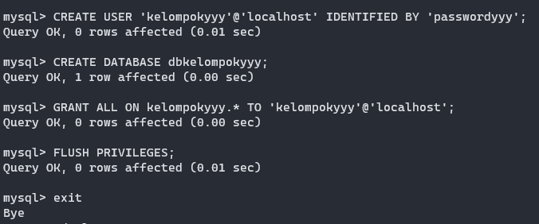
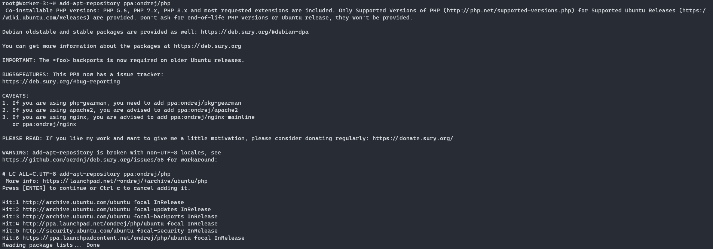

# Implementasi Load Balancer

Pada bagian ini akan dijelaskan implementasi Load Balancer dalam kehidupan sehari-hari. Jika pada modul 2 kita telah melakukan deployment aplikasi PHP pada Nginx, pada modul 3 ini kita akan melakukan deployment kerangka kerja Laravel pada Nginx Load Balancer.

## Persiapan

Untuk melakukan deployment aplikasi Laravel pada GNS3, tambahkan image docker `danielcristh0/ubuntu-focal:1.1` pada GNS3 sesuai langkah yang tertera pada [Modul GNS3](https://github.com/arsitektur-jaringan-komputer/Modul-Jarkom/tree/master/Modul-GNS3#memasukkan-image-ubuntu-ke-gns3). Gunakan image tersebut untuk membuat topologi pada GNS3.

Kemudian buatlah topologi dan lakukan konfigurasi sebagai berikut:


### Melakukan Register Domain pada DNS Server

Lakukan instalasi bind9 sesuai dengan materi [Modul 2](https://github.com/arsitektur-jaringan-komputer/Modul-Jarkom/blob/master/Modul-2/DNS/README.md#12-praktik), kemudian lakukan register domain `implementasi.yyy.com` dengan yyy merupakan nama kelompok.

Tambahkan konfigurasi pada `/etc/bind/named.conf.local` sebagai berikut:

```sh
zone "implementasi.yyy.com" {
        type master;
        file "/etc/bind/implementasi/implementasi.yyy.com";
};
```

Kemudian aturlah register domain pada file `/etc/bind/implementasi/implementasi.yyy.com` sebagai berikut

### Set Up Database pada Load Balancer

Selanjutnya, agar aplikasi Laravel yang kita buat terkoneksi dengan database, lakukan instalasi mysql-server pada Load Balancer dengan perintah berikut:
```
apt install mysql-server
```

Kemudian nyalakan service mysql dengan perintah berikut
```
usermod -d /var/lib/mysql/ mysql
systemctl start mysql.service
```

Lakukan konfigurasi mysql sebagai berikut dengan yyy merupakan kode kelompok:
```sql
CREATE USER 'kelompokyyy'@'localhost' IDENTIFIED BY 'passwordyyy';
CREATE DATABASE dbkelompokyyy;
GRANT ALL ON kelompokyyy.* TO 'kelompokyyy'@'localhost';
FLUSH PRIVILEGES;
```

Hasilnya adalah sebagai berikut:


### Worker

Deployment akan dilakukan pada masing-masing worker. Untuk melakukan deployment, langkah-langkah yang harus dilakukan adalah:

1. Instalasi Package yang Diperlukan

    Pertama, lakukan update package-list dengan command:
    ```sh
    apt update
    ```

    Kemudian, lakukan instalasi `software-properties-common` agar repository php dapat ditambahkan dengan mengetikkan command:
    ```sh
    apt install software-properties-common
    ```

    Setelah menginstall, tambahkan repository `ppa:ondrej/php` dengan perintah:
    ```sh
    add-apt-repository ppa:ondrej/php
    ```

    Apabila terdapat error `bash: add-apt-repository ppa:ondrej/php: No such file or directory`, tambahkan dua baris berikut pada `/etc/apt/sources.list`
    ```
    deb https://ppa.launchpadcontent.net/ondrej/php/ubuntu focal main 
    #deb-src https://ppa.launchpadcontent.net/ondrej/php/ubuntu focal main 
    ```

    seperti berikut ini:

    

    Kemudian, tambahkan keyserver dengan perintah berikut:
    ```sh
    apt-key adv --keyserver hkp://keyserver.ubuntu.com:80 --recv-keys 4f4ea0aae5267a6c
    ```

    Setelah itu, lanjutkan dengan menambahkan repository hingga keluar output sebagai berikut:
    

    Setelah itu lakukan instalasi PHP dengan perintah berikut:
    ```sh
    apt install php8.0-mbstring php8.0-xml php8.0-cli php8.0-common php8.0-intl php8.0-opcache php8.0-readline php8.0-mysql php8.0-fpm composer unzip
    ```

    Lakukan pengecekan versi php dengan mengetikkan `php --version`.
