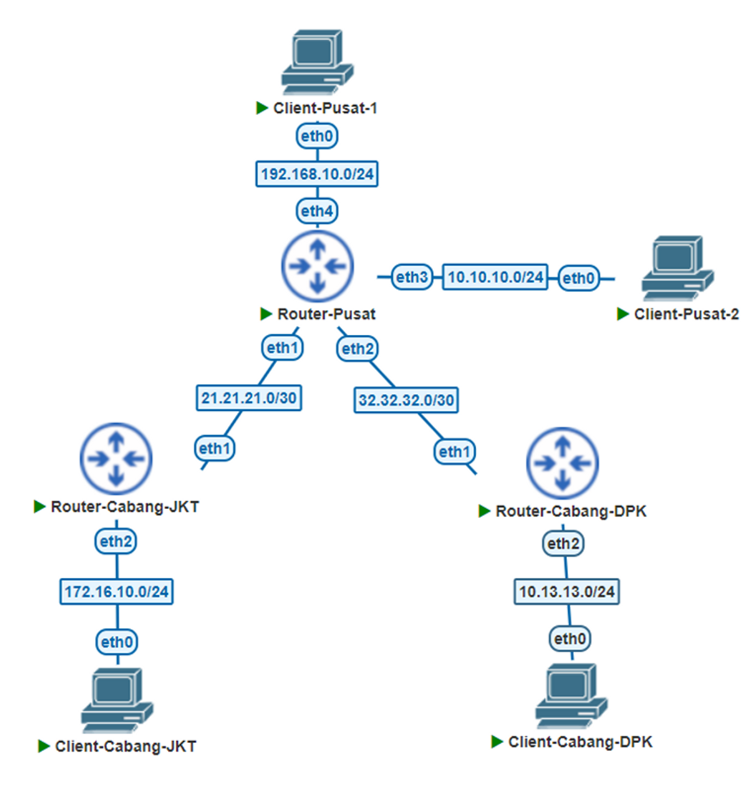
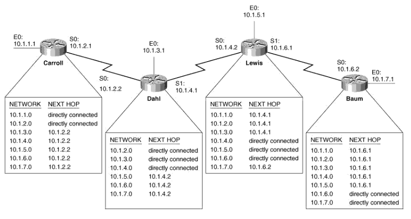
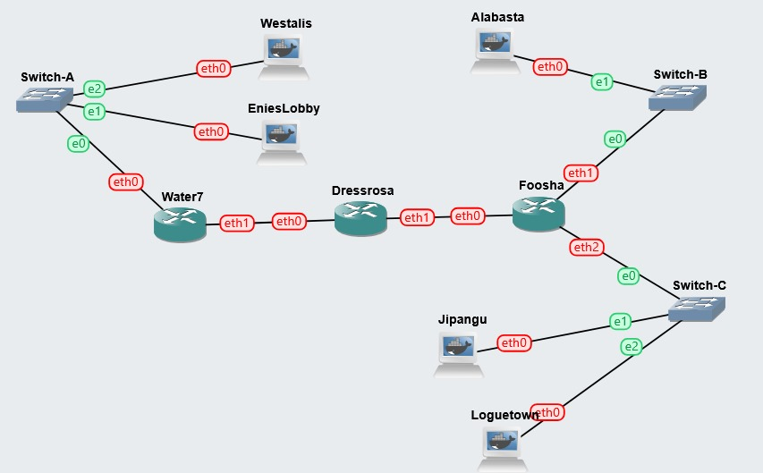
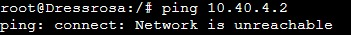
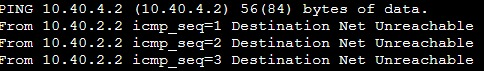
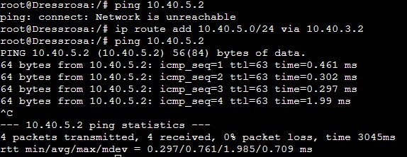
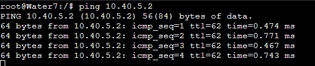
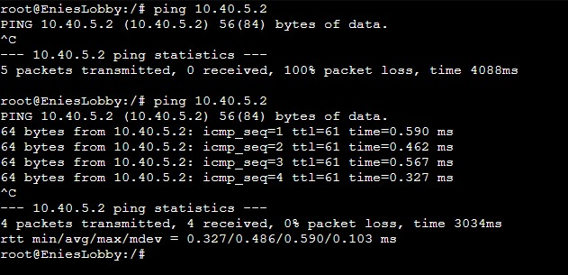
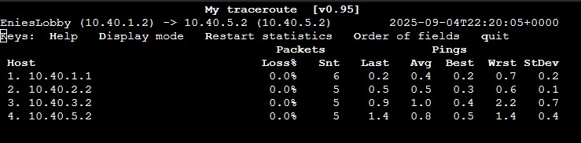
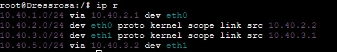

# Modul 3 Jaringan Komputer

## 1. Static Routing

Setelah kita memahami bagaimana cara jaringan komputer di dunia bekerja pada umumnya, perangkat-perangkat yang digunakan untuk mendukung terjadinya komunikasi di internet, protokol yang dipatuhi, dan lain-lainnya, maka kita akan masuk ke dalam konsep yang tak kalah penting dan akan sering kita temui, yaitu **Routing**.

### 1.1 Pengertian

Jika IP Address bisa kita ibaratkan sebuah alamat rumah, maka sekarang mari kita bayangkan kita sedang berada di suatu perumahan, katakanlah perumahan A. Di perumahan ini, penduduknya mengikuti aturan alamat ruamah yang sama, yaitu huruf A diikuti oleh angka. Misal, tetanggamu yang bernama Bapak Hassan memiliki alamat rumah A-17, Ibu Rumrowi memiliki alamat rumah A-32, dan seterusnya. Sebagai penduduk setempat, kamu kenal dengan mereka dan tahu bagaimana cara mengunjungi rumah mereka tanpa bantuan orang lain.

Suatu hari, kamu diberi tugas untuk mengirimkan makanan ke alamat rumah B-03. Namun, kamu tidak kenal alamat ini karena tidak diawali oleh huruf A seperti biasanya. Maka dari itu, kamu menghubungi kantor pos perumahan dengan alamat A-01 (yang mana kamu tahu letaknya) dan meminta bantuan mereka untuk mengirimkan makanan tersebut. Sebagai kantor pos, mereka memiliki data alamat di seluruh kota, sehingga mereka tahu di mana letak rumah B-01 ini dan ke mana harus memberikan makanan tersebut. Jadi, kamu cukup pergi ke A-01 dan menyerahkan makanan tersebut yang memiliki tujuan B-01. Sisanya akan diurus oleh kantor pos.

Konsep routing kurang lebih sama seperti ilustrasi di atas. Pada hakikatnya, routing merupakan suatu proses yang menentukan jalur terbaik untuk mengirimkan suatu paket/data dari satu jaringan ke jaringan lainnya. Umumnya, hal ini dilakukan oleh _Router_, dimana mereka bertanggung jawab untuk meneruskan packet dari satu segmen jaringan ke segmen lainnya. _Router_ melakukan proses penentuan jalur ini berdasarkan data yang mereka punya, yaitu _Routing Table_ yang berisikan informasi mengenai cara untuk bisa menuju suatu segmen jaringan, sekalipun itu terlihat jauh.

Bila mengacu pada ilustrasi di atas, kamu dan seluruh tetanggamu bisa dianggap sebagai host dan perumahanmu dianggap sebagai suatu _subnet_ (Kita akan mendalami ini di Modul 4). Kemudian, kantor pos bisa dianggap sebagai _Router_ dan data alamat di seluruh kota yang mereka miliki bisa dianggap sebagai _Routing Table_.



Berdasarkan bagaimana cara _Router_ memperoleh informasi terkait _Routing Table_-nya, _Routing_ bisa dibagi menjadi 2 kategori, yaitu **Static Routing** dan **Dynamic Routing**. Untuk Dynamic Routing akan dibahas secara sekilas pada Modul 4, sedangkan Static Routing akan kita pelajari pada modul ini.

Pada Static Routing, seorang (atau tim) _network administrator_ bertanggung jawab untuk mengisi _Routing Table_ pada setiap _Router_. Jika menggunakan analogi kantor pos, pemerintah bertanggung jawab untuk memberi tahu seluruh kantor pos yang ada mengenai kantor pos lainnya dan bagaimana cara suatu kantor pos menghubungi kantor pos lain ataupun perumahan lain. Hal ini cukup sederhana apabila dilakukan pada suatu jaringan dengan jumlah _Router_ dan segmen jaringan yang sedikit, namun akan bertambah sulit dan melelahkan seiring bertambahnya jumlah dan kompleksitas jaringan. Tak hanya itu, apabila ada segmen jaringan baru, seluruh _Router_ harus diberi tahu mengenai hal ini yang tentunya sangat tidak efisien dan akan menghabiskan banyak waktu.

Namun, karena kita akan menggunakan topologi sederhana yang tidak banyak berubah dengan segmen jaringan yang sedikit, maka Static Routing dapat mempermudah kita karena kita akan memiliki kontrol penuh terhadap topologi kita. Selanjutnya, kita akan mencoba melakukannya di dalam GNS3.



### 1.2 Implementasi

Tentu saja kita akan dapat lebih mudah memahaminya dengan langsung melakukan implementasi. Untuk itu, kita akan menggunakan topologi seperti berikut:



Kemudian, pembagian IP Address untuk kasus ini adalah sebagai berikut:

```
# Kompleks A: 10.40.1.X
eth0 Water7: 10.40.1.1
EniesLobby: 10.40.1.2
Westalis: 10.40.1.3

# Kompleks Jalanan Kiri: 10.40.2.X
eth1 Water7: 10.40.2.1
eth0 Dressrosa: 10.40.2.2

# Kompleks Jalanan Kanan: 10.40.3.X
eth1 Dressrosa: 10.40.3.1
eth0 Foosha: 10.40.3.2

# Kompleks B: 10.40.4.X
eth1 Foosha: 10.40.4.1
Alabasta: 10.40.4.2

# Kompleks C: 10.40.5.X
eth2 Foosha: 10.40.5.1
Jipangu: 10.40.5.2
Loguetown: 10.40.5.3
```

Untuk kasus ini, set semua netmask menjadi `255.255.255.0` dahulu (penjelasan lebih lanjut ada di Modul 4). Kemudian, untuk semua host (semua node kecuali Water7, Dressrosa, dan Foosha), set gateway nya menjadi IP Address _Router_ yang terhubung. Misal, EniesLobby dan Water7 terhubung pada eth0 Water7, maka gateway untuk mereka berdua adalah `10.40.1.1`. Lalu, set gateway untuk router sebagai berikut:

```
# kosongi gateway untuk interface eth0 Water7 dan interface eth1 & eth2 Foosha
eth1 Water7: 10.40.2.2
eth0 Foosha: 10.40.3.1
# kosongi juga gateway Dressrosa untuk semua interface
```

#### 1.2.1 Sebelum Routing

Apabila sudah selesai melakukan konfigurasi, lakukan tes konektivitas dengan melakukan ping antar-node di dalam segmen jaringan (kompleks) yang sama. Misal, pastikan **Westalis** bisa melakukan ping ke **EniesLobby** dan **Water7**, **Dressrosa** bisa melakukan ping ke **Foosha**, dan lain-lain

> Kiat: Tidak perlu masuk ke seluruh node. Cukup masuk ke **Water7** dan **Foosha** dan ping semua perangkat yang terhubung dengannya, karena pada umumnya ping bersifat simetris (apabila host A bisa melakukan ping ke host B, berlaku pula sebaliknya) kecuali ada konfigurasi tambahan seperti Firewall atau NAT.

Sekarang, silahkan kalian coba melakukan ping antar-kompleks dengan jarak yang cukup jauh Contohnya **Dressrosa** (`10.40.3.1`) ke **Alabasta** (`10.40.4.2`). Seharusnya, kalian akan mendapatkan output seperti berikut



atau



Kalian mungkin tidak mendapat output sama persis di atas (bahkan _hang_ ketika melakukan ping). Namun, pada hakikatnya hasilnya adalah sama, yaitu tidak bisa melakukan ping.

> Jika melakukan ping antar-kompleks yang masih berdekatan dan terhubung ke _router_ yang sama (misalnya kompleks B dan kompleks C), ada kemungkinan komunikasi ping masih tetap dapat dilakukan.

Maka dari itu, kita akan memberi tahu _router_ bagaimana cara mencapai kompleks lain.

#### 1.2.2 Proses Routing

Cara yang pertama cukup sederhana, yaitu hanya memberi tahu **Dressrosa** tentang bagaimana cara mencapai semua segmen jaringan. Untuk itu, kita akan menggunakan perintah berikut:

```
ip route add <SUBNET TUJUAN>/<NETMASK> via <GATEWAY>
```

Penjelasan:

- **SUBNET TUJUAN** berisi NID atau segmen jaringan yang akan dituju. Di kasus kita, 3 oktet pertama berisi IP kompleks dan oktet terakhir berisi `0`. Penjelasan lebih detail akan kita telusuri di modul 4.

- **NETMASK** untuk kasus kita akan diisi `24` saja.

- **GATEWAY** berisi IP Address dari _router_ untuk menuju ke segmen jaringan tersebut.

Misal:

```
ip route add 10.40.5.0/24 via 10.40.3.2
```

Ketika kita menjalankan perintah di atas pada **Dressrosa**, kita seolah-olah memberi tahu dia bahwa, "Halo Dressrosa, kalau ada _packet_ dengan IP Address tujuan di kompleks C (`10.40.5.X`), maka cara meraihnya adalah dengan melewati `10.40.3.2` (yaitu **Foosha**)"



Sebelum menjalankan perintah di atas, Dressrosa belum tau cara mencapai kompleks C (`10.40.5.X`). Maka dari itu, dia mengatakan bahwa jaringan tersebut tidak dapat diraih (`Network is unreachable`). Setelah kita beri tahu, maka sekarang dia memiliki informasi cara menuju segmen jaringan tersebut. Sehingga, dia dan perangkat luar yang terhubung secara langsung dengan dia (dalam kasus ini, **Water7**) bisa menghubungi alamat yang berada di segmen jaringan tersebut.



Namun, kompleks A masih belum bisa melakukan ping kepada kompleks C. Walaupun packet yang dikirimkan dari kompleks A (`10.40.1.X`) bisa sampai pada kompleks C (`10.40.5.X`) karena semua _router_ sudah tahu jalannya, mereka masih belum tahu cara meraih kompleks A untuk balasannya. Maka dari itu, kita perlu memberi tahu **Dressrosa** lagi mengenai cara meraih kompleks A dengan menjalankan perintah berikut:

```
ip route add 10.40.1.0/24 via 10.40.2.1
```



Seperti pada gambar, awalnya **EniesLobby** sebagai penduduk kompleks A tidak dapat menghubungi kompleks C. Setelah kita jalankan perintah di atas pada **Dressrosa**, EniesLobby dapat melakukan _ping_ ke kompleks C.

> Lakukan hal yang sama untuk kompleks B. Apakah kalian tahu _command_ yang digunakan dan di node apa?

#### 1.2.3 Setelah Routing

Mungkin sembari melakukan implementasi, ada beberapa pertanyaan yang muncul di benak kalian, seperti:

- _Mengapa hanya **Dressrosa** yang dikonfigurasi, sedangkan ada 3 router?_

- _Apakah berarti **Water7** dan **Foosha** tahu cara meraih semua kompleks yang ada? Bagaimana bisa?_

- _Apa yang akan terjadi apabila ada kompleks baru yang ditambahkan, seperti mungkin kompleks D di `10.40.6.X`?_

Potongan _puzzle_ terakhir yang membuat ini semua terjadi dan bisa menjawab kalian adalah **Default Gateway**.

Sederhananya, Default Gateway bisa diibaratkan sebagai orang yang kalian tanya (jika mengikuti ilustrasi awal, maka diibaratkan kantor pos perumahan) ketika tidak tahu arah. Ketika ada _packet_ dengan tujuan yang asing, alih-alih menyerah dan membuangnya, kita cukup kirimkan _packet_ tersebut ke Default Gateway. Hal inilah yang terjadi pada implementasi di atas dan mengapa hanya **Dressrosa** yang dikonfigurasi.

**Study Case: Ping dari EniesLobby ke Jipangu**

Jalankan _command_ di bawah ini di **EniesLobby**:

```
mtr 10.40.5.2
```



melalui `mtr`, kita bisa mengetahui _packet_ yang kita kirimkan melalui node mana saja. Perintah ini mirip seperti `traceroute`. Untuk kasus ini, kita ingin mencari tahu jalur mana yang ditempuh _packet_ dari **EniesLobby** (`10.40.1.3`) ke **Jipangu** (`10.40.5.2`). Penjelasan alur rute yaitu sebagai berikut:

1. Pertama, karena IP Address tujuan (yaitu `10.40.5.2`) tidak berada pada segmen jaringan yang sama, **EniesLobby** tidak tahu bagaimana cara mengirimkannya. Namun karena dia memiliki Default Gateway yaitu **Water7**, maka dia cukup mengirimkan _packet_ tersebut ke sana (yaitu `10.40.1.1`)

2. Hal yang sama dialami oleh **Water7**. Dia sebenarnya juga tidak tahu bagaimana cara mengirimkan _packet_ ini, namun karena dia juga memiliki Default Gateway yaitu **Dressrosa**, maka dia akan mengirimkannya ke sana (yaitu `10.40.2.2`)

3. Tidak seperti EniesLobby dan Water7, **Dressrosa** tahu bagaimana cara meraih segmen jaringan dari tujuan _packet_ ini. Menurut data yang dia punya (atau _Routing Table_ nya), untuk meraih packet tersebut dia harus mengirimkannya ke **Foosha**, yaitu `10.40.3.2`

4. Terakhir, karena **Foosha** terhubung secara langsung dengan **Jipangu**, maka _packet_ bisa langsung dikirimkan ke tujuan, yaitu `10.40.5.2`.

> Seandainya **Water7** dan **Foosha** tidak memiliki Default Gateway, maka kita harus menjalankan perintah `ip route add` untuk mengisi _Routing Table_ mereka seperti apa yang kita lakukan pada **Dressrosa**.

#### 1.2.4 Routing Table

Alangkah baiknya apabila kita tutup dengan penjelasan singkat mengenai komponen terakhir pada perjalanan kita, yaitu **Routing Table**.

Routing Table adalah suatu struktur data yang menyimpan informasi mengenai cara meraih suatu segmen jaringan. Biasanya, di dalam suatu Routing Table terdapat informasi mengenai segmen jaringan tujuan, _next hop_ atau _gateway_ nya, _network interface_ yang digunakan, dan informasi tambahan.

Mari kita lihat Routing Table pada **Dressrosa** dengan:

```
ip route show
```



- `10.40.1.0/24 via 10.40.2.1 dev eth0`: Untuk meraih segmen jaringan `10.40.1.0/24`, maka kirim _packet_ ke `10.40.2.1` melalui _interface_ `eth0`.

- `10.40.2.0/24 dev eth0 proto kernel scope link src 10.40.2.2`: Segmen jaringan `10.40.2.0/24` terhubung secara langsung melalui _interface_ `eth0`. IP milik **Dressrosa** sendiri pada hubungan ini adalah `10.40.2.2`

> Bisakah kalian menerjemahkan sisanya?

### 1.3 Troubleshooting

Apabila kalian sudah melakukan konfigurasi pada _router_ namun masih belum bisa melakukan ping, ada kemungkinan _router_ kalian tidak mau meneruskan _packet_ (_packet forwarding_ dinonaktifkan)

Untuk mengeceknya, bisa menjalankan:

```
cat /proc/sys/net/ipv4/ip_forward
```

`1` berarti _packet forwarding_ aktif dan `0` berarti nonaktif. Untuk mengaktifkannya, bisa menjalankan:

```
sysctl -w net.ipv4.ip_forward=1
```

atau dengan memastikan `net.ipv4.ip_forward=1` ada (biasa di-comment) di dalam `/etc/sysctl.conf`. Restart dengan

```
sysctl -p
```

### 1.4 Referensi

- https://www.geeksforgeeks.org/computer-networks/open-systems-interconnection-model-osi/

- https://www.tutorialspoint.com/data_communication_computer_network/computer_network_models.htm

- https://www.geeksforgeeks.org/computer-networks/computer-network-models/

- https://www.lifewire.com/layers-of-the-osi-model-illustrated-818017

1. [Web Server](Web%20server/README.md)
2. [DNS (Domain Name System)](DNS/README.md)
3. [Reverse Proxy](Reverse%20Proxy/README.md)
