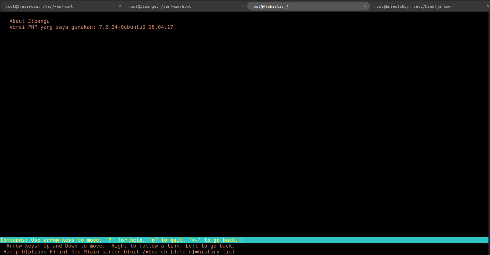
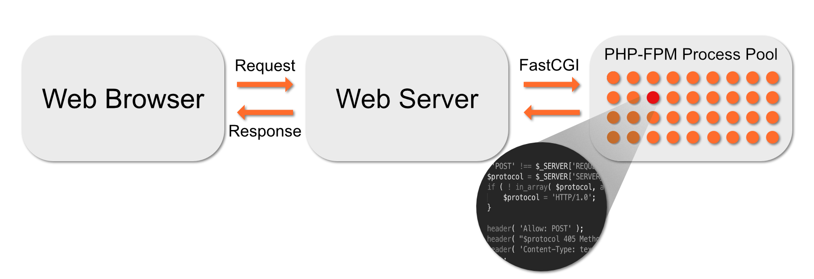
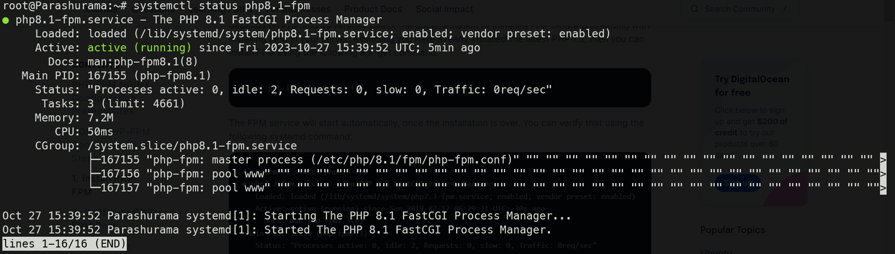

# 2. Reverse Proxy

## Outline

- [2. Reverse Proxy](#2-reverse-proxy)
  - [Outline](#outline)
  - [2.1 Pengertian, Cara Kerja, dan Manfaat](#21-pengertian-cara-kerja-dan-manfaat)
    - [2.1.1 Pengertian](#211-pengertian)
    - [2.1.2 Cara Kerja](#212-cara-kerja)
    - [2.1.3 Manfaat](#213-manfaat)
  - [2.2 Implementasi](#22-implementasi)
    - [2.2.1 Instalasi](#221-instalasi)
    - [2.2.2 Konfigurasi Dasar](#222-konfigurasi-dasar)
    - [2.2.3 Integrasi dengan PHP](#223-integrasi-dengan-php)
- [3. PHP-FPM](#3-php-fpm)
  - [3.1 Pengertian dan Cara Kerja](#31-pengertian-dan-cara-kerja)
    - [3.1.1 Pengertian](#311-pengertian)
    - [3.1.2 Cara Kerja](#312-cara-kerja)
  - [3.2 Implementasi](#22-implementasi)
    - [3.2.1 Instalasi](#221-instalasi)
    - [3.2.2 Konfigurasi Dasar](#222-konfigurasi-dasar)

## 2.1 Pengertian, Cara Kerja, dan Manfaat

### 2.1.1 Pengertian

Sebelum mengenal Reverse Proxy lebih jauh, perlu diketahui bahwa Reverse Proxy dan Proxy Service adalah 2 hal yang berbeda dari cara kerjanya. Secara singkat `Proxy Service` adalah service yang disediakan oleh suatu server, dimana server ini akan menjadi perantara bagi kita dan server atau website tujuan. Jadi ketika kita mengakses suatu website yang ada di internet kita akan terlebih dahulu terhubung ke Proxy Server.

Tak hanya itu, Proxy server juga cukup efektif digunakan sebagai sebuah gateway. Nantinya, semua koneksi yang dilakukan akan sesuai dengan setting gateway yang ditetapkan. Dengan begitu, tidak mudah disusupi serangan dari luar yang tidak diinginkan. Contoh aristektur sederhana yang menggunakan Proxy server.


Selanjutnya, `Reverse Proxy` adalah salah satu jenis server Proxy yang bertanggung jawab dalam meneruskan request client ke server. Reverse Proxy terletak diantara client dan server. Jadi, request yang dilakukan client akan diteruskan oleh Reverse Proxy untuk mencapai ke server. Mudahnya, Reverse Proxy ini berada diantara client dan server yang bertugas untuk menjamin pertukaran data antara client dan server berjalan dengan lancar.

Reverse Proxy biasanya diterapkan pada web server seperti `Apache` dan `Nginx`. Selain itu, dikutip dari [`CloudFlare`](https://www.cloudflare.com/learning/cdn/glossary/Reverse-Proxy/), Reverse Proxy juga digunakan sebagai keamanan agar proses pertukaran request dari client ke server atau sebaliknya berjalan dengan aman.

Tidak hanya itu, Reverse Proxy juga bisa melakukan kompresi data. Data yang besar akan dilakukan kompresi sehingga menjadi data dengan ukuran yang lebih kecil. Hal itu dapat membuat pertukaran data berjalan lebih cepat. Reverse Proxy juga memiliki kemampuan untuk menyeimbangkan load atau beban server agar server tidak down.

### 2.1.2 Cara Kerja

Seperti yang sudah dijelaskan diatas, Reverse Proxy berada diantara client dan server. Fungsi utama Reverse Proxy adalah menerima dan meneruskan request dari client ke server atau sebaliknya. Cara kerja Reverse Proxy bisa digambarkan seperti contoh berikut, misalnya kamu bertindak sebagai client yang ingin mengakses suatu website. Request yang diberikan client sebelum sampai ke server akan diterima oleh reverse proxy terlebih dahulu. Setelah itu Reverse Proxy akan meneruskan ke server dan kemudian menerima balasan dari server yang nantinya akan disampaikan ke client.


### 2.1.3 Manfaat

Karena di modul ini kita akan berfokus pada `Nginx` sebagai Reverse Proxy, maka berikut ini adalah beberapa menfaat ketika menggunakan Nginx sebagai Reverse Proxy.


Beberapa manfaat Nginx sebagi Reverse Proxy:

- `Load Balancing` - Reverse proxy dapat melakukan load balancing yang membantu mendistribusikan permintaan client secara merata di seluruh server backend atau worker. Proses ini sangat membantu dalam menghindari skenario di mana server tertentu menjadi kelebihan beban (over load) karena lonjakan permintaan yang tiba-tiba. Penyeimbangan beban juga meningkatkan redundansi seolah-olah satu server mati, proxy akan bertugas merutekan atau meredirect trafik yang masuk ke worker yang lainnya.

- `Powerful Caching` - Nginx dapat cache konten yang diterima dari respons server proxy dan menggunakannya untuk menanggapi client tanpa harus menghubungi server utama untuk konten yang sama setiap kali ada permintaan.

- `Superior Compression` - Jika server proxy tidak mengirim respons terkompresi, kita dapat mengonfigurasi Nginx untuk mengkompres `(contohnya: gzip)` respons sebelum mengirimnya ke client. Tentunya akan menghemat bandwidth dan mempercepat loading website.

- `Increased security` - Informasi mengenai server utama tidak dapat terlihat dari luar, sehingga sulit diserang oleh hackerm. Reverse Proxy juga mencegah serangan `distibuted denial-of-service (DDOS)`.

## 2.2 Implementasi

### 2.2.1 Instalasi

Step 1 - Instalasi nginx di Dressrosa

```bash
apt-get update && apt-get install nginx
```

Step 2 - Cek status dari nginx

```bash
service nginx status
```


### 2.2.2 Konfigurasi Dasar

Step 1 - Instal lynx di Alabasta

```bash
apt update
apt-get install lynx
```

Step 2 - Cek menggunakan lynx


Step 3 - Lakukan pengujian dengan membuat file index.html di direktori `/var/www/html`.

```bash
<h1>Selamat Datang di Dressrosa</h1>
```

Step 4 - Ganti `server name` di `/etc/nginx/sites-available/default` dengan domain utama yang telah dibuat sebelumnya di
[modul persiapan](../prerequisite.md).

```
server_name jarkom.site;
```

Step 4 - Lakukan pengujian lagi, maka akan muncul halaman yang berbeda dari halaman sebelumnya.

```bash
lynx jarkom.site/index.html
```


### 2.2.3 Integrasi dengan PHP

Step 1 - Masih di Dressrosa, coba lakukan instalasi PHP

```bash
apt-get install php php-fpm
```

Step 2 - Buat script sederhana menggunakan PHP

Masuk ke direktori `/var/www/html`, lalu buat file index.php:

```php
<?php
$hostname = gethostname();

echo "Hello World!<br>";
echo "Selamat datang di: $hostname<br>";
?>
```

Step 3 - Edit default file nginx di `/etc/nginx/sites-available/default`

```bash
nano /etc/nginx/sites-available/default
```

Tambahkan index.php pada server block bagian `index`:

```bash
# Add index.php to the list if you are using PHP
index index.html index.htm index.php;
```

Uncomment beberapa bagian, seperti contoh di bawah:

```bash
        location ~ \.php$ {
                include snippets/fastcgi-php.conf;
        #
        #       # With php-fpm (or other unix sockets):
                fastcgi_pass unix:/var/run/php/php7.2-fpm.sock;
        #       # With php-cgi (or other tcp sockets):
        #       fastcgi_pass 127.0.0.1:9000;
        }
```

Step 4 - Lakukan pengujian dari Alabasta

```bash
lynx jarkom.site/index.php
```


### 2.2.4 Konfigurasi Reverse Proxy

### A. Melewatkan request yang masuk ke proxy server

Nginx di server utama akan mem-prokxy request, dimana server utama akan mengirimkan request tersebut ke server proxy (worker tertentu), mengambil respons, dan mengirimkannya kembali ke client. Dimungkinkan untuk mem-proxy permintaan ke server HTTP (ke worker yang menggunakan Nginx atau server yang tidak menggunakan Nginx) atau server non-HTTP (yang dapat menjalankan aplikasi yang dikembangkan dengan framework tertentu, seperti PHP atau Python) menggunakan protokol tertentu. Protokol yang didukung termasuk `FastCGI`, `uwsgi`, `SCGI`, dan `memcached`.

Untuk meneruskan permintaan ke server proxy, maka bisa menggunakan `proxy_pass` yang spesifikan di `location` tertentu. Untuk meneruskan request ke proxy server kita bisa menggunakan `nama domain atau alamat IP` dari server proxy yang tersebut, kita juga bisa menspesifikan `port` nya.

Contoh sederhana penggunaan `proxy_pass` di server utama:

```bash
location /some/path/ {
    proxy_pass http://www.example.com/link/;
}
```

```bash
location /some/path/ {
    proxy_pass http://192.168.1.1/link/;
}
```

Konfigurasi di sisi worker, karena berbasis PHP maka kita menggunakan `PHP-FPM (FastCGI Process Manager)`:

```bash
server {
        listen 80;

        server_name _;

        index index.html index.htm index.php;

        location / {
                        # First attempt to serve request as file, then
                        # as directory, then fall back to displaying a 404.
                        try_files $uri $uri/ =404;
                }
        # pass PHP scripts to FastCGI server
        #
        location ~ \.php$ {
                include snippets/fastcgi-php.conf;
        #
        #       # With php-fpm (or other unix sockets):
                fastcgi_pass unix:/var/run/php/php7.2-fpm.sock;
        #       # With php-cgi (or other tcp sockets):
        #       fastcgi_pass 127.0.0.1:9000;
        }
}
```

#### Catatan

- `proxy_pass` - merupakan salah satu [modul](http://nginx.org/en/docs/http/ngx_http_proxy_module.html) yang ada di nginx, digunakan untuk meneruskan request ke alamat tertentu.

- `FastCGI` - `Fast Common Gateway Interface (FastCGI)` adalah protokol standar untuk menghubungkan aplikasi eksternal ke web server. Ini adalah versi peningkatan fitur dari [Common Gateway Interface (CGI)](https://www.geeksforgeeks.org/common-gateway-interface-cgi/).

- `PHP-FPM` - `FastCGI Process Manager (PHP-FPM)` adalah implementasi FastCGI untuk bahasa PHP. PHP-FPM merupakan interpreter PHP yang terpisah dari aplikasi web server. Setiap request atas script PHP yang masuk ke web server akan diteruskan (forward) ke FastCGI melalui socket atau koneksi TCP/IP.

- `uWSGI` - adalah implementasi dari `Web Server Gateway Interface (WSGI)` yang biasanya digunakan untuk menjalankan aplikasi web berbasis Python.

- `SCGI` - `SCGI (Simple Common Gateway Interface)` adalah protokol komunikasi antara server web dan aplikasi web. Ini mirip dengan CGI (Common Gateway Interface), tetapi dirancang untuk lebih efisien dan cepat. Beberapa server web yang mendukung SCGI termasuk Apache dengan mod_scgi, lighttpd, dan beberapa server web lainnya.

- `Memcached` - Memcached adalah sistem penyimpanan cache dalam memori yang digunakan untuk meningkatkan kinerja situs web atau aplikasi dengan menyimpan data dalam memori RAM, sehingga mengurangi kebutuhan untuk mengakses sumber daya yang lebih lambat seperti basis data atau penyimpanan disk. Dalam case Nginx, Memcached digunakan untuk mengarahkan request atau permintaan ke server Memcached yang telah dibuat. Lengkapnya bisa dibaca di dokumentasi [Memcached](https://memcached.org/about).

#### Konfigurasi

Step 1 - Di Jipangu, pastikan sebelumnya telah menginstal `Nginx dan PHP`. Uncoment beberapa konfigurasi `default` di `/etc/nginx/sites-available`.

Tambahkan `index.php` di block index

```bash
index index.html index.htm index.nginx-debian.html index.php;
```

Konfigurasi PHP menggunakan `FastCGI server`

```bash
        # pass PHP scripts to FastCGI server
        #
        location ~ \.php$ {
                include snippets/fastcgi-php.conf;
        #
        #       # With php-fpm (or other unix sockets):
                fastcgi_pass unix:/var/run/php/php7.2-fpm.sock;
        #       # With php-cgi (or other tcp sockets):
        #       fastcgi_pass 127.0.0.1:9000;
        }

```

Step 2 - Buat file `index.php` di `/var/www/html`.

```php
<?php
$hostname = gethostname();
$php_version = phpversion();

echo "About $hostname<br>";
echo "Versi PHP yang saya gunakan: $php_version<br>";
?>
```

Step 3 - Jangan lupa start service `PHP FPM`.

```bash
/etc/init.d/php7.2-fpm start
```

Atau

```bash
service php7.2-fpm start
```

Step 4 - Kembali ke Dressrosa, tambahkan `location` baru di `/etc/nginx/sites-available/default`.

```bash
location /about-jipangu/ {
        proxy_pass http://<ip_jipangu>/index.php;
}
```

Step 5 - Simpan konfigurasi, lalu restart service nginx.

```bash
service nginx restart
```

Step 6 - Lakukan pengujian melalui client menggunakan lynx.

```bash
lynx jarkom.site/about-jipangu
```



### B. Melewatkan Request Headers

## 3. PHP-FPM

## 3.1 Pengertian dan Cara Kerja

### 3.1.1 Pengertian

PHP-FPM adalah singkatan dari `PHP FastCGI Process Manager`. PHP-FPM adalah implementasi PHP dari FastCGI. PHP-FPM adalah sebuah daemon yang berjalan di background dan mengelola proses PHP untuk server web (seperti Apache atau Nginx). PHP-FPM berjalan sebagai service dan mendengarkan permintaan dari server web. Ketika permintaan datang, PHP-FPM akan memprosesnya dan mengembalikan hasilnya ke server web.

PHP-FPM adalah cara yang lebih baik untuk mengelola proses PHP daripada menggunakan modul PHP Apache atau FastCGI. PHP-FPM memiliki beberapa keuntungan dibandingkan dengan modul PHP Apache atau FastCGI. PHP-FPM memiliki kemampuan untuk mengelola proses PHP secara efisien dan dapat dikonfigurasi untuk mengelola proses PHP sesuai dengan kebutuhan. PHP-FPM juga memiliki kemampuan untuk mengelola proses PHP secara dinamis.

### 3.1.2 Cara Kerja

PHP-FPM berperan sebagai pengelola proses yang berhubungan dengan menjalankan script PHP, mengatur antrian permintaan, mengelola proses yang berjalan, dan menangani komunikasi antara server web dan skrip PHP.

Setiap kali server web menerima permintaan untuk skrip PHP, server web akan mengirim permintaan ke PHP-FPM. PHP-FPM akan memproses permintaan dan mengembalikan hasilnya ke server web. Server web kemudian akan mengirimkan hasilnya ke browser.



## 3.2 Implementasi

### 3.2.1 Instalasi

Step 1 - Instalasi PHP-FPM di Web Server

```bash
apt-get install php php8.1-fpm
```

Step 2 - Cek status dari PHP-FPM

```bash
systemctl status php8.1-fpm
```



### 3.2.2 Konfigurasi Dasar

Konfigurasi untuk PHP FPM dibedakan menjadi 2 yaitu konfigurasi untuk `pool` dan konfigurasi untuk `global`. Konfigurasi untuk `pool` berada di `/etc/php/8.1/fpm/pool.d/www.conf` sedangkan konfigurasi untuk `global` berada di `/etc/php/8.1/fpm/php-fpm.conf`. Untuk variabel apa saja yang dapat di konfigurasi dan dikustomisasi dapat dilihat di [sini](https://www.php.net/manual/en/install.fpm.configuration.php).

Step 1 - buat config untuk dressrosa.conf.

```bash
nano /etc/php/8.1/fpm/pool.d/dressrosa.conf
```

Step 2 - Ubah beberapa konfigurasi menjadi seperti berikut:

```conf
[dressrosa_site]
user = dressrosa_user
group = dressrosa_user
listen = /var/run/php8.1-fpm-dressrosa-site.sock
listen.owner = www-data
listen.group = www-data
php_admin_value[disable_functions] = exec,passthru,shell_exec,system
php_admin_flag[allow_url_fopen] = off

; Choose how the process manager will control the number of child processes.

pm = dynamic
pm.max_children = 75
pm.start_servers = 10
pm.min_spare_servers = 5
pm.max_spare_servers = 20
pm.process_idle_timeout = 10s
```

step 3 - Buat user dan group baru untuk dressrosa

```bash
groupadd dressrosa_user
useradd -g dressrosa_user dressrosa_user
```

step 4 - restart service php-fpm

```bash
systemctl restart php8.1-fpm
```

step 5 - ubah socket php-fpm pada nginx dengan socket yang baru di config pada dressrosa.conf.

```bash
location ~ \.php$ {
                include snippets/fastcgi-php.conf;
        #
        #       # With php-fpm (or other unix sockets):
                fastcgi_pass unix:/var/run/php8.1-fpm-dressrosa-site.sock;
        #       # With php-cgi (or other tcp sockets):
        #       fastcgi_pass 127.0.0.1:9000;
        }
```

step 6 - restart nginxnya juga

```bash
systemctl restart nginx
```

#### Referensi

- https://docs.nginx.com/nginx/admin-guide/web-server/reverse-proxy
- https://www.techopedia.com/definition/24198/fast-common-gateway-interface-fastcgi
- https://helpful.knobs-dials.com/index.php/CGI,_FastCGI,_SCGI,_WSGI,_servlets_and_such
- http://nginx.org/en/docs/http/ngx_http_proxy_module.html
