# 2. Reverse Proxy

## Outline

- [2. Reverse Proxy](#2-reverse-proxy)
  - [Outline](#outline)
  - [2.1 Pengertian, Cara Kerja, dan Manfaat](#21-pengertian-cara-kerja-dan-manfaat)
    - [2.1.1 Pengertian](#211-pengertian)
      - [A. Forward Proxy](#a-forward-proxy)
      - [B. Reverse Proxy](#b-reverse-proxy)
    - [2.1.2 Cara Kerja](#212-cara-kerja)
    - [2.1.3 Manfaat](#213-manfaat)
  - [2.2 Implementasi](#22-implementasi)
    - [2.2.1 Instalasi](#221-instalasi)
    - [2.2.2 Konfigurasi Dasar](#222-konfigurasi-dasar)
      - [A. Halaman Statis](#a-membuat-halaman-statis)
      - [B. Halaman Dinamis](#b-membuat-halaman-dinamis-menggunakan-php)
    - [2.2.3 Mengenal PHP FPM](#23-mengenal-php-fpm)
      - [A. Pengertian](#a-pengertian)
      - [B. Cara Kerja](#b-cara-kerja)
      - [C. Perbadingan PHP-FPM Versi 7 dan versi 8](#c-perbadingan-php-fpm-versi-7-dan-versi-8)
      - [D. Konfigurasi Dasar](#d-konfigurasi-dasar)
    - [2.2.4 Konfigurasi Reverse Proxy](#224-konfigurasi-reverse-proxy)
      - [A. Melewatkan request yang masuk ke proxy server](#a-melewatkan-request-yang-masuk-ke-proxy-server)
      - [B. Menambahkan Request Headers](#b-menambahkan-request-headers)
      - [C. Proxy Binding](#c-proxy-bind)
    - [2.2.5 Load Balancing Lanjutan](#225-load-balancing-lanjutan)
      - [A. Round Robin](#a-round-robin)
      - [B. Least Connection](#b-least-connection)
      - [C. IP Hash](#c-ip-hash)
      - [D. Generic Hash](#d-generic-hash)
  - [2.3 Load Testing](#23-load-testing)
    - [2.3.1 Apache Benchmark](#231-apache-benchmark)
      - [A. Instalasi](#a-instalasi)
      - [B. Pengujian](#b-pengujian)
        - [1. Menguji Website HTTPS](#1-menguji-website-https)
        - [2. Menguji Website HTTP](#2-menguji-website-http-jarkomsite)
        - [3. Menguji Website HTTP yang Memerlukan Autentikasi](#3-menguji-website-http-yang-memerlukan-autentikasi)
        - [4. Menguji Load Balancing](#4-menguji-load-balancing)
          - [a. Skenario 1](#skenario-1)
          - [b. Skenario 2](#skenario-2)
          - [c. Skenario 3](#skenario-3)

## 2.1 Pengertian, Cara Kerja, dan Manfaat

### 2.1.1 Pengertian

Sebelum mengenal Reverse Proxy lebih jauh, perlu diketahui bahwa Reverse Proxy dan Proxy Service, seperti `Forward Proxy` adalah 2 hal yang berbeda dari cara kerjanya.

#### A. Forward Proxy

Secara singkat `Forward Proxy` adalah service yang disediakan oleh suatu server, dimana server ini akan menjadi perantara bagi kita dan server atau website tujuan. Jadi ketika kita mengakses suatu website yang ada di internet kita akan terlebih dahulu terhubung ke Proxy Server.

Tak hanya itu, Proxy server juga cukup efektif digunakan sebagai sebuah gateway. Nantinya, semua koneksi yang dilakukan akan sesuai dengan setting gateway yang ditetapkan. Dengan begitu, tidak mudah disusupi serangan dari luar yang tidak diinginkan. Contoh aristektur sederhana yang menggunakan Proxy server.

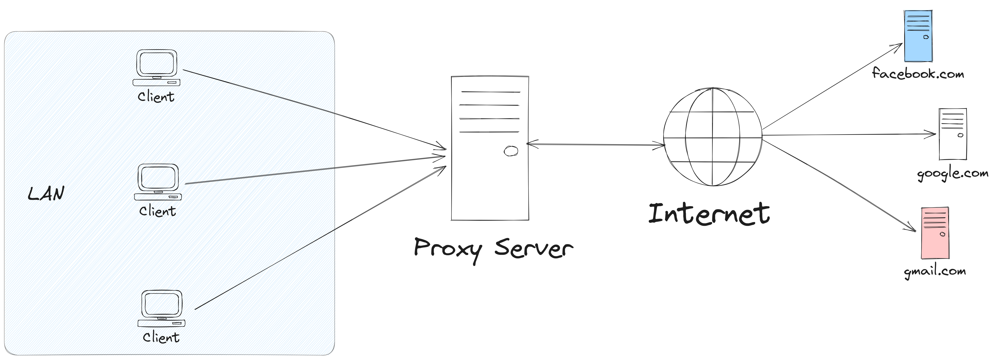

#### B. Reverse Proxy

Selanjutnya, `Reverse Proxy` adalah salah satu jenis server Proxy yang bertanggung jawab dalam meneruskan request client ke server. Reverse Proxy terletak diantara client dan server. Jadi, request yang dilakukan client akan diteruskan oleh Reverse Proxy untuk mencapai ke server. Mudahnya, Reverse Proxy ini berada diantara client dan server yang bertugas untuk menjamin pertukaran data antara client dan server berjalan dengan lancar.

Reverse Proxy biasanya diterapkan pada web server seperti `Apache` dan `Nginx`. Selain itu, dikutip dari [`CloudFlare`](https://www.cloudflare.com/learning/cdn/glossary/Reverse-Proxy/), Reverse Proxy juga digunakan sebagai keamanan agar proses pertukaran request dari client ke server atau sebaliknya berjalan dengan aman.

Tidak hanya itu, Reverse Proxy juga bisa melakukan kompresi data. Data yang besar akan dilakukan kompresi sehingga menjadi data dengan ukuran yang lebih kecil. Hal itu dapat membuat pertukaran data berjalan lebih cepat. Reverse Proxy juga memiliki kemampuan untuk menyeimbangkan load atau beban server agar server tidak down.


### 2.1.2 Cara Kerja

Seperti yang sudah dijelaskan diatas, Reverse Proxy berada diantara client dan server. Fungsi utama Reverse Proxy adalah menerima dan meneruskan request dari client ke server atau sebaliknya. Cara kerja Reverse Proxy bisa digambarkan seperti contoh berikut, misalnya kamu bertindak sebagai client yang ingin mengakses suatu website. Request yang diberikan client sebelum sampai ke server akan diterima oleh reverse proxy terlebih dahulu. Setelah itu Reverse Proxy akan meneruskan ke server dan kemudian menerima balasan dari server yang nantinya akan disampaikan ke client.

### 2.1.3 Manfaat

Karena di modul ini kita akan berfokus pada `Nginx` sebagai Reverse Proxy, maka berikut ini adalah beberapa menfaat ketika menggunakan Nginx sebagai Reverse Proxy.


Beberapa manfaat Nginx sebagi Reverse Proxy:

- `Load Balancing` - Reverse proxy dapat melakukan load balancing yang membantu mendistribusikan permintaan client secara merata di seluruh server backend atau worker. Proses ini sangat membantu dalam menghindari skenario di mana server tertentu menjadi kelebihan beban (over load) karena lonjakan permintaan yang tiba-tiba. Penyeimbangan beban juga meningkatkan redundansi seolah-olah satu server mati, proxy akan bertugas merutekan atau meredirect trafik yang masuk ke worker yang lainnya.

- `Powerful Caching` - Nginx dapat cache konten yang diterima dari respons server proxy dan menggunakannya untuk menanggapi client tanpa harus menghubungi server utama untuk konten yang sama setiap kali ada permintaan.

- `Superior Compression` - Jika server proxy tidak mengirim respons terkompresi, kita dapat mengonfigurasi Nginx untuk mengkompres `(contohnya: gzip)` respons sebelum mengirimnya ke client. Tentunya akan menghemat bandwidth dan mempercepat loading website.

- `Increased security` - Informasi mengenai server utama tidak dapat terlihat dari luar, sehingga sulit diserang oleh hacker. Reverse Proxy juga mencegah serangan seperti `distibuted denial-of-service (DDOS)`.

## 2.2 Implementasi

### 2.2.1 Instalasi

Step 1 - Instalasi nginx di Dressrosa

```bash
apt-get update && apt-get install nginx
```

Step 2 - Cek status dari nginx

```bash
service nginx status
```


### 2.2.2 Konfigurasi Dasar

Step 1 - Instal lynx di Loguetown

```bash
apt update
apt-get install lynx -y
```

Step 2 - Cek menggunakan lynx

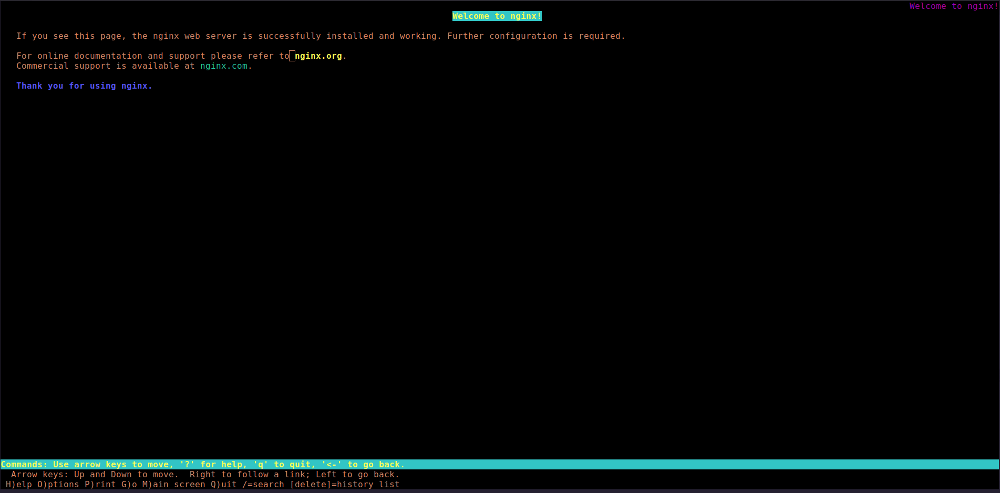

#### A. Membuat Halaman Statis

Step 1 - Masuk ke `/var/www/html`, lalu buat buat suatu file HTML baru dengan nama `index.html`. Silahkan gunakan text editor yang ada seperi nano atau vim.

```html
!DOCTYPE html>
<html lang="en">
  <head>
    <meta charset="UTF-8" />
    <meta name="viewport" content="width=device-width, initial-scale=1.0" />
    <title>Static Page</title>
  </head>
  <body>
    <h1>Selamat Datang di Dressrosa</h1>
  </body>
</html>
```

Step 2 - Ganti `server name` di `/etc/nginx/sites-available/default` dengan domain utama yang telah dibuat sebelumnya di
[modul persiapan](../prerequisite.md).

```bash
server_name jarkom.site;
```

Step 3 - Lakukan pengujian lagi, maka akan muncul halaman yang berbeda dari halaman sebelumnya.

```bash
lynx jarkom.site/index.html
```

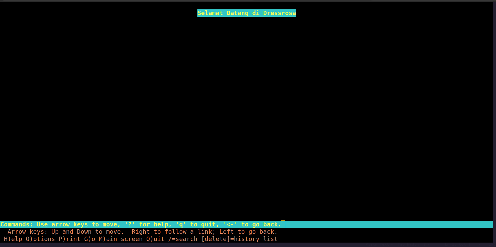

#### B. Membuat Halaman Dinamis Menggunakan PHP

Step 1 - Masih di Dressrosa, coba lakukan instalasi PHP

```bash
apt-get install php php-fpm
```

Step 2 - Buat script sederhana menggunakan PHP

Masuk ke direktori `/var/www/html`, lalu buat file `index.php`:

```php
<!DOCTYPE html>
<html lang="en">
<head>
    <meta charset="UTF-8">
    <meta name="viewport" content="width=device-width, initial-scale=1.0">
    <title>Dynamics Page</title>
    <link rel="stylesheet" href="style.css">
</head>
<body>
    <div class="container">
        <center>
            <?php
                $hostname = gethostname();
                echo "Hello World!<br>";
                echo "Selamat datang di: $hostname<br>";
            ?>
        </center>
    </div>
</body>
</html>
```

Step 3 - Masih di direktori yang sama coba buat file CSS dengan nama `style.css`

```css
body {
  display: flex;
  align-items: center;
  height: 100vh;
  margin: 0;
  font-family: Arial, sans-serif;
}

.container {
  text-align: center;
  max-width: 600px;
  padding: 20px;
  border: 1px solid #ccc;
  background-color: #f9f9f9;
}
```

Step 3 - Edit default file nginx di `/etc/nginx/sites-available/default`

```bash
nano /etc/nginx/sites-available/default
```

Tambahkan index.php pada server block bagian `index`:

```bash
# Add index.php to the list if you are using PHP
index index.html index.htm index.php;
```

Uncomment beberapa bagian, seperti contoh di bawah:

```bash
location ~ \.php$ {
    include snippets/fastcgi-php.conf;
#
#   # With php-fpm (or other unix sockets):
    fastcgi_pass unix:/var/run/php/php7.2-fpm.sock;
#   # With php-cgi (or other tcp sockets):
#   fastcgi_pass 127.0.0.1:9000;
}
```

Step 4 - Lakukan pengujian dari Loguetown

```bash
lynx jarkom.site/index.php
```

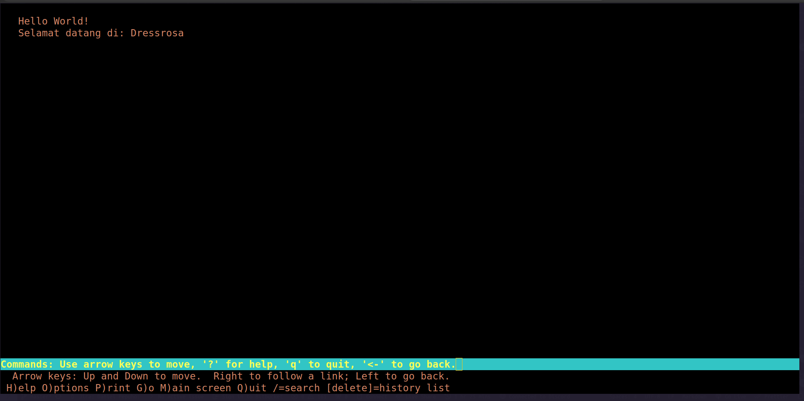

#### Kesimpulan

Dari dua percobaan diatas, dengan menggunakan halaman statis dan dinamis dapat disimpulkan bahwa:

- `Proses di sisi server` - Halaman dinamis memerlukan pemrosesan di sisi server sebelum konten dikirim ke browser. Ini termasuk eksekusi kode PHP atau bahkan pemanggilan data dari database. Proses ini membutuhkan waktu tambahan dibandingkan dengan sekadar mengirim atau menampilkan halaman statis.

- `Ukuran respon` - Jika halaman dinamis memuat banyak data (CSS, HTML, JavaScript, dll) atau memerlukan query ke database, hal ini dapat mempengaruhi waktu pemuatan. Ukuran respon yang besar memerlukan lebih banyak waktu untuk mentransfer melalui jaringan.

Mari kita lihat perbandingan respon dari masing-masing halaman di `access log` Nginx. Dapat disimpulkan respone size pada halaman dinamis cukup besar, karena membutuhkan beberapa proses (eksekusi kode PHP, pemanggilan file CSS, dll)

- Halaman Statis

```bash
cat /var/log/nginx/access.log | grep 'index.html'
```

```bash
Client IP               Date                 HTTP Method                HTTP Status     Respone Size(byte)  Referer     Detailed user agent info.
192.168.1.3 - - [02/Nov/2023:18:20:25 +0700] "GET /index.html HTTP/1.0"    200             246               "-"        "Lynx/2.8.9dev.16 libwww-FM/2.14 SSL-MM/1.4.1 GNUTLS/3.5.17"
```

- Halaman Dinamis

```bash
cat /var/log/nginx/access.log | grep 'index.php'
```

```bash
Client IP               Date                 HTTP Method                HTTP Status     Respone Size(byte)      Referer                         Detailed user agent info.
192.168.1.3 - - [02/Nov/2023:18:24:49 +0700] "GET /index.php HTTP/1.0"     200              428            "http://jarkom.site/index.php"       "Lynx/2.8.9dev.16 libwww-FM/2.14 SSL-MM/1.4.1 GNUTLS/3.5.17"
```


### 2.3. Mengenal PHP-FPM

#### A. Pengertian

PHP-FPM adalah singkatan dari `PHP FastCGI Process Manager`. PHP-FPM adalah implementasi PHP dari FastCGI. PHP-FPM adalah sebuah daemon yang berjalan di background dan mengelola proses PHP untuk server web (seperti Apache atau Nginx). PHP-FPM berjalan sebagai service dan mendengarkan permintaan dari server web. Ketika permintaan datang, PHP-FPM akan memprosesnya dan mengembalikan hasilnya ke server web.

PHP-FPM adalah cara yang lebih baik untuk mengelola proses PHP daripada menggunakan modul PHP Apache atau FastCGI. PHP-FPM memiliki beberapa keuntungan dibandingkan dengan modul PHP Apache atau FastCGI. PHP-FPM memiliki kemampuan untuk mengelola proses PHP secara efisien dan dapat dikonfigurasi untuk mengelola proses PHP sesuai dengan kebutuhan. PHP-FPM juga memiliki kemampuan untuk mengelola proses PHP secara dinamis.

#### B. Cara Kerja

PHP-FPM berperan sebagai pengelola proses yang berhubungan dengan menjalankan script PHP, mengatur antrian permintaan, mengelola proses yang berjalan, dan menangani komunikasi antara server web dan skrip PHP.

Setiap kali server web menerima permintaan untuk skrip PHP, server web akan mengirim permintaan ke PHP-FPM. PHP-FPM akan memproses permintaan dan mengembalikan hasilnya ke server web. Server web kemudian akan mengirimkan hasilnya ke browser.


#### C. Perbadingan PHP-FPM Versi 7 dan versi 8

|Konfigurasi(default value)  | PHP-FPM 7| PHP-FPM 8|
|----------------------------|----------|----------|
|pm                          | static   | ondemand |
|pm.max_children             | 5        | 100      |
|pm.min_spare_servers        | 1        | 2        |
|pm.max_spare_servers        | 5        | 50       |

|Fitur                       |PHP-FPM 7            | PHP-FPM 8               |
|----------------------------|---------------------|-------------------------|
|stream_socket_server        |tidak support        |support                  |
|php_stream_set_option       |support options      |support options dan flags|

#### D. Konfigurasi Dasar

Step 1 - Instalasi PHP-FPM di Web Server

```bash
apt-get install php php-fpm
```

Step 2 - Cek status dari PHP-FPM

```bash
service php7.2-fpm status
```

Atau

```bash
/etc/init.d/php7.2-fpm status
```

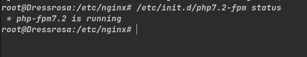

#### Catatan

Konfigurasi untuk PHP FPM dibedakan menjadi 2 yaitu konfigurasi untuk `pool` dan konfigurasi untuk `global`. Konfigurasi untuk `pool` berada di `/etc/php/7.2/fpm/pool.d/www.conf` sedangkan konfigurasi untuk `global` berada di `/etc/php/7.2/fpm/php-fpm.conf`. Untuk variabel apa saja yang dapat di konfigurasi dan dikustomisasi dapat dilihat di [sini](https://www.php.net/manual/en/install.fpm.configuration.php).

Step 3 - buat config untuk dressrosa.conf.

```bash
nano /etc/php/7.2/fpm/pool.d/dressrosa.conf
```

Step 4 - Ubah beberapa konfigurasi menjadi seperti berikut:

```conf
[dressrosa_site]
user = dressrosa_user
group = dressrosa_user
listen = /var/run/php8.1-fpm-dressrosa-site.sock
listen.owner = www-data
listen.group = www-data
php_admin_value[disable_functions] = exec,passthru,shell_exec,system
php_admin_flag[allow_url_fopen] = off

; Choose how the process manager will control the number of child processes.

pm = dynamic
pm.max_children = 75
pm.start_servers = 10
pm.min_spare_servers = 5
pm.max_spare_servers = 20
pm.process_idle_timeout = 10s

;contoh diatas konfigurasi untuk mengatur jumalh proses PHP-FPM yang berjalan
```

Step 5 - Buat user dan group baru untuk dressrosa

```bash
groupadd dressrosa_user
useradd -g dressrosa_user dressrosa_user
```

Step 6 - restart service php-fpm

```bash
/etc/init.d/php7.2-fpm restart
```

Step 7 - ubah socket php-fpm pada nginx dengan socket yang baru di config pada dressrosa.conf.

```bash
location ~ \.php$ {
                include snippets/fastcgi-php.conf;
        #
        #       # With php-fpm (or other unix sockets):
                fastcgi_pass unix:/var/run/php7.2-fpm-dressrosa-site.sock;
        #       # With php-cgi (or other tcp sockets):
        #       fastcgi_pass 127.0.0.1:9000;
        }
```

Step 8 - restart nginxnya juga

```bash
systemctl restart nginx
```

### 2.2.4 Konfigurasi Reverse Proxy

### A. Melewatkan request yang masuk ke proxy server

Nginx di server utama akan mem-prokxy request, dimana server utama akan mengirimkan (melewatkan) request tersebut ke server proxy (worker tertentu), mengambil respons, dan mengirimkannya kembali ke client. Dimungkinkan untuk mem-proxy permintaan ke server HTTP (ke worker yang menggunakan Nginx atau server yang tidak menggunakan Nginx) atau server non-HTTP (yang dapat menjalankan aplikasi yang dikembangkan dengan framework tertentu, seperti PHP atau Python) menggunakan protokol tertentu. Protokol yang didukung termasuk `FastCGI`, `uWSGI`, `SCGI`, dan `Memcached`.

Untuk meneruskan permintaan ke server proxy, maka bisa menggunakan `proxy_pass` yang spesifikan di `location` tertentu. Untuk meneruskan request ke proxy server kita bisa menggunakan `nama domain, alamat IP, UNIX socket, TCP sockets, dan lain-lain` dari server proxy yang tersebut, kita juga bisa menspesifikan `port` nya.

Contoh sederhana penggunaan `proxy_pass` di server utama:

```bash
location /some/path/ {
    proxy_pass http://www.example.com/link/;
}
```

```bash
location /some/path/ {
    proxy_pass http://192.168.1.1/link/;
}
```

```bash
location ~ \.php {
    proxy_pass http://127.0.0.1:8000;
}
```

Konfigurasi di sisi worker. Karena berbasis PHP maka kita menggunakan `PHP-FPM (FastCGI Process Manager)`:

```bash
server {
        listen 80;

        server_name _;

        root /var/www/html;

        index index.html index.htm index.php;

        location / {
                        # First attempt to serve request as file, then
                        # as directory, then fall back to displaying a 404.
                        try_files $uri $uri/ =404;
                }
        # pass PHP scripts to FastCGI server
        #
        location ~ \.php$ {
                include snippets/fastcgi-php.conf;
        #
        #       # With php-fpm (or other unix sockets):
                fastcgi_pass unix:/var/run/php/php7.2-fpm.sock;
        #       # With php-cgi (or other tcp sockets):
        #       fastcgi_pass 127.0.0.1:9000;
        }
}
```

#### Catatan

- `proxy_pass` - merupakan salah satu [modul](http://nginx.org/en/docs/http/ngx_http_proxy_module.html) yang ada di nginx, digunakan untuk meneruskan request ke alamat tertentu.

- `FastCGI` - `Fast Common Gateway Interface (FastCGI)` adalah protokol standar untuk menghubungkan aplikasi eksternal ke web server. Ini adalah versi peningkatan fitur dari [Common Gateway Interface (CGI)](https://www.geeksforgeeks.org/common-gateway-interface-cgi/).

- `PHP-FPM` - `FastCGI Process Manager (PHP-FPM)` adalah implementasi FastCGI untuk bahasa PHP. PHP-FPM merupakan interpreter PHP yang terpisah dari aplikasi web server. Setiap request atas script PHP yang masuk ke web server akan diteruskan (forward) ke FastCGI melalui socket atau koneksi TCP/IP.

- `uWSGI` - adalah implementasi dari `Web Server Gateway Interface (WSGI)` yang biasanya digunakan untuk menjalankan aplikasi web berbasis Python.

- `SCGI` - `SCGI (Simple Common Gateway Interface)` adalah protokol komunikasi antara server web dan aplikasi web. Ini mirip dengan CGI (Common Gateway Interface), tetapi dirancang untuk lebih efisien dan cepat. Beberapa server web yang mendukung SCGI termasuk Apache dengan mod_scgi, lighttpd, dan beberapa server web lainnya.

- `Memcached` - Memcached adalah sistem penyimpanan cache dalam memori yang digunakan untuk meningkatkan kinerja situs web atau aplikasi dengan menyimpan data dalam memori RAM, sehingga mengurangi kebutuhan untuk mengakses sumber daya yang lebih lambat seperti basis data atau penyimpanan disk. Dalam case Nginx, Memcached digunakan untuk mengarahkan request atau permintaan ke server Memcached yang telah dibuat. Lengkapnya bisa dibaca di dokumentasi [Memcached](https://memcached.org/about).

#### Konfigurasi `proxy_pass`

Step 1 - Di Jipangu, pastikan sebelumnya telah menginstal `Nginx dan PHP`. Uncoment beberapa konfigurasi `default` di `/etc/nginx/sites-available`.

- Arahkan ke DocumenRoot yang diinginkan di block `root`:

  ```bash
  root /var/www/html
  ```

- Tambahkan `index.php` di block index:

  ```bash
  index index.html index.htm index.nginx-debian.html index.php;
  ```

Konfigurasi PHP menggunakan `FastCGI server`

```bash
        # pass PHP scripts to FastCGI server
        #
        location ~ \.php$ {
                include snippets/fastcgi-php.conf;
        #
        #       # With php-fpm (or other unix sockets):
                fastcgi_pass unix:/var/run/php/php7.2-fpm.sock;
        #       # With php-cgi (or other tcp sockets):
        #       fastcgi_pass 127.0.0.1:9000;
        }

```

Step 2 - Buat file `index.php` di `/var/www/html`.

```php
<?php
$hostname = gethostname();
$php_version = phpversion();
?>

<center>
<h1>About <?php echo $hostname; ?></h1>
<p>Versi PHP yang saya gunakan: <?php echo $php_version; ?></p>
</center>
```

Step 3 - Jangan lupa start service `PHP FPM`.

```bash
/etc/init.d/php7.2-fpm start
```

Atau

```bash
service php7.2-fpm start
```

Step 4 - Kembali ke Dressrosa, tambahkan `location` baru di `/etc/nginx/sites-available/default`.

```bash
location /about-jipangu/ {
        proxy_pass http://<ip_jipangu>/index.php;
}
```

Step 5 - Simpan konfigurasi, lalu restart service nginx.

```bash
service nginx restart
```

Step 6 - Lakukan pengujian melalui client menggunakan lynx.

```bash
lynx jarkom.site/about-jipangu
```

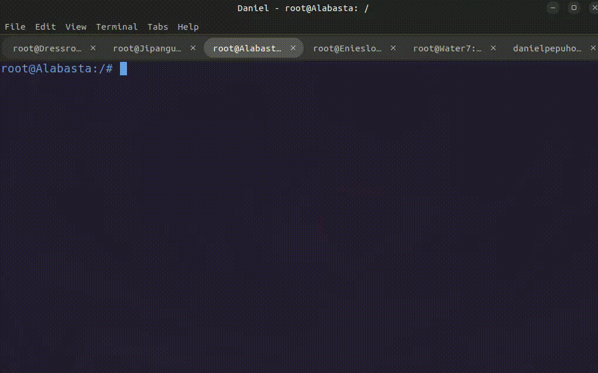

### B. Menambahkan Request Headers

Directive di Nginx yang digunakan untuk mengatur header HTTP yang dikirim ke server backend atau worker saat proxying request. Modul yang bisa digunakan yaitu [proxy_set_header](https://nginx.org/en/docs/http/ngx_http_proxy_module.html#proxy_set_header). Format nya adalah:

```bash
proxy_set_header <header> <value>;
```

`<header>` - adalah nama header yang ingin diatur

`<value>` - adalah nilai yang ingin ditetapkan dari suatu header

Aturan penggunaan header:

- nama header harus diawali dengan huruf kapital dan tidak boleh menggunakan spasi.
- nilai dari header berupa string, angka.
- konteks penggunaannya bisa di dalam `server`, `location` tertentu dan `upstream`.

Contoh sederhana penggunan `proxy_set_header`:

```bash
location /some/path/ {
    proxy_set_header Host $host;
    proxy_set_header X-Real-IP $remote_addr;
    proxy_pass http://example.com:8000;
}
```

#### Catatan

`location /some/path/` - Header ini menjelaskan bahwa Nginx akan mem-proxy semua request yang masuk di `/some/path` secara otomatis akan dialihkan ke alamat `http://example.com` dengan port 8000.

`proxy_set_header Host $host` - Header ini menyatakan bahwa Nginx akan mengatur header Host di request yang dikirim ke worker agar sesuai dengan header `Host` di request asli dari client. Hal ini diperlukan agar server backend atau worker dapat mengetahui URL mana yang diakses oleh client.

`proxy_set_header X-Real-IP $remote_addr` - Header X-Real-IP berisi alamat IP client yang mengirimkan request, tanpa melewati proxy. Hal ini berguna jika server worker perlu mengetahui alamat IP client yang sebenarnya, misalnya untuk tujuan logging atau keamanan.

#### Konfigurasi `proxy_set_header`

```bash
location /about-jipangu/ {
        proxy_pass http://192.168.2.5/index.php;
        proxy_set_header Host $Host;
        proxy_set_header X-Real-IP $remote_addr;
}
```

### C. Proxy Bind

Jika kita memiliki beberapa server proxy untuk menerima request dari client, kita bisa menggunakan modul [proxy_bind](https://nginx.org/en/docs/http/ngx_http_proxy_module.html#proxy_bind) untuk melakukan binding.

Contoh sederhana penggunaan `proxy_bind`:

```bash
location /app1/ {
    proxy_bind 127.0.0.1;
    proxy_pass http://example.com/app1/;
}

location /app2/ {
    proxy_bind 127.0.0.2;
    proxy_pass http://example.com/app2/;
}
```

Konfigurasi sederhana menggunakan `proxy_bind`

```bash
location /app1/ {
        # Dressrosa
        proxy_bind 127.0.0.1;
        proxy_pass http://127.0.0.1/index.php;
}

location /app2/ {
        # Enieslobby
        proxy_bind 192.168.2.2;
        proxy_pass http://192.168.2.3/index.php;
}

location /app3/ {
        # Jipangu
        proxy_bind 192.168.2.2;
        proxy_pass http://192.168.2.5/index.php;
}
```

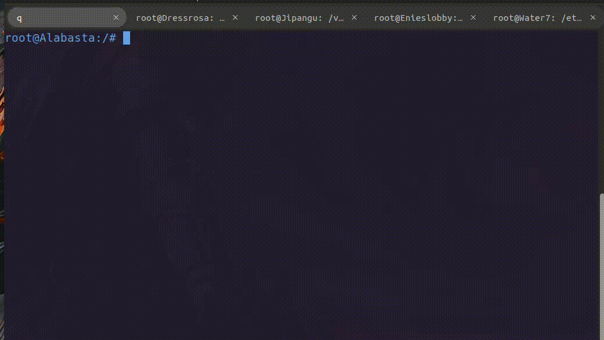

#### Catatan

`proxy_bind <ip_address>` - Menentukan alamat IP yang akan digunakan oleh server utama untuk melakukan binding ke server backend atau worker.

`proxy_pass http://<ip_address>` - Meneruskan permintaan clien ke server backend atau worker.

### 2.2.5 Load Balancing Lanjutan

Jika di modul 2, kita telah mencoba salah satu metode atau algoritma load balancing yaitu `Round Robin`, pada modul kali ini kita akan mencoba algoritma lainnya yaitu: `Least-connection`, `IP Hash`, dan `Generic Hash`. Diharapkan kalian telah membaca pengertian dan cara kerjanya di [modul 2](https://github.com/arsitektur-jaringan-komputer/Modul-Jarkom/blob/master/Modul-2/Web%20server/README.md#b-load-balancing-pada-nginx).

Pada modul ini kita akan mengkonfigurasi semua metode load balancing yang dibahas sebelumnya.

#### A. Round Robin

Merupakan algoritma load balancing default yang ada di Nginx, cara kerjanya yaitu jika kita memiliki 3 buah node, maka urutannya adalah dari node pertama, kemudian node kedua, dan ketiga. Setelah node ketiga menerima beban, maka akan diulang kembali dari node ke satu.

Konfigurasi:

Step 1 - Pastikan di Water 7, Jipangu, dan Enieslobby telah terinstall Nginx dan PHP

```bash
apt-get update && apt-get install nginx php php-fpm
```

step 2 - Modifikasi konfigurasi Nginx, buat file baru di `/etc/nginx/sites-available/jarkom`. Lakukan hal ini di semua worker Nginx selain Dressrosa. Untuk menonaktifkan konfigurasi `default` pada `/etc/nginx/sites-enabled` bisa menggunakan perintah `unlink /etc/nginx/sites-enabled/default`.

```bash
server {

listen 80;

root /var/www/jarkom;

index index.php index.html index.htm;
server_name _;

location / {
        try_files $uri $uri/ /index.php?$query_string;
}

# pass PHP scripts to FastCGI server
location ~ \.php$ {
        include snippets/fastcgi-php.conf;
        fastcgi_pass unix:/var/run/php/php7.2-fpm.sock;
}

location ~ /\.ht {
        deny all;
}

error_log /var/log/nginx/jarkom_error.log;
access_log /var/log/nginx/jarkom_access.log;
}
```

Step 3 - Kemudian buat direktori baru di `/var/www`dengan nama `jarkom`. Lalu buat file `index.php`. Hal yang sama dilakukan disetiap worker.

```php
<?php
$hostname = gethostname();
$php_version = phpversion();
?>

<center>
<h1>About <?php echo $hostname; ?></h1>
<p>Versi PHP yang saya gunakan: <?php echo $php_version; ?></p>
</center>
```

Step 4 - Di Dressrosa buat file baru untuk Nginx di `/etc/nginx/sites-available`, contoh filenya `lb-jarkom`.

```bash
#Default menggunakan Round Robin
upstream backend  {
server 192.168.2.3; #IP EniesLobby
server 192.168.2.4; #IP Water7
server 192.168.2.5; #IP Jipangu
}

server {
listen 80;
server_name jarkom.site;

        location / {
                proxy_pass http://backend;
                proxy_set_header    X-Real-IP $remote_addr;
                proxy_set_header    X-Forwarded-For $proxy_add_x_forwarded_for;
                proxy_set_header    Host $http_host;
        }

error_log /var/log/nginx/lb_error.log;
access_log /var/log/nginx/lb_access.log;

}
```

Step 5 - Unlink default config di `/etc/nginx/sites-enabled` dan symlink file `lb-jarkom` ke `/etc/nginx/sites-enabled`

```bash
unlink /etc/nginx/sites-enabled/default
```

```bash
ln -s /etc/nginx/sites-available/lb-jarkom /etc/nginx/sites/enabled/
```

```bash
service nginx restart
```

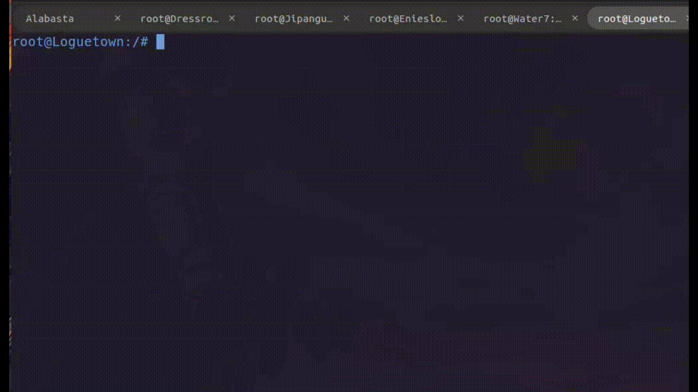

#### Weighted Round Robin

Cukup dengan menetapkan weight atau beban ke masing-masing server di kumpulan server yang telah ditentukan sebelumnya. Server yang memiliki weight paling besar akan dijadikan prioritas ketika menerima request dari client

Weight dapat digunakan untuk mengoptimalkan load balancing dan memastikan bahwa server yang lebih kuat memiliki beban yang lebih besar.

Konfigurasi:

```bash
upstream backend  {
   server 192.168.2.3 weight=4; #IP EniesLobby
   server 192.168.2.4 weight=2; #IP Water7
   server 192.168.2.5 weight=1; #IP Jipangu
}
```

#### B. Least Connection

Jika Round robin akan mendistribusikan berdasarkan nomor dan urutan server, maka least-connection akan melakukan prioritas pembagian dari beban kinerja yang paling rendah. Node master akan mencatat semua beban dan kinerja dari semua node, dan akan melakukan prioritas dari beban yang paling rendah. Sehingga diharapkan tidak ada server dengan beban yang rendah.

Konfigurasi:

```bash
#Least Connection
upstream backend  {
least_conn;
server 192.168.2.3; #IP EniesLobby
server 192.168.2.4; #IP Water7
server 192.168.2.5; #IP Jipangu
}

server {
listen 80;
server_name jarkom.site;

        location / {
                proxy_pass http://backend;
                proxy_set_header    X-Real-IP $remote_addr;
                proxy_set_header    X-Forwarded-For $proxy_add_x_forwarded_for;
                proxy_set_header    Host $http_host;
        }

error_log /var/log/nginx/lb_error.log;
access_log /var/log/nginx/lb_access.log;

}


```

#### C. IP Hash

Agak berbeda dengan kedua algoritma di atas, algoritma ini akan melakukan hash berdasarkan request dari pengguna (menggunakan alamat IP dari pengguna). Sehingga server akan selalu menerima request dari alamat IP yang berbeda. Ketika server ini tidak tersedia, permintaan dari klien ini akan dilayani oleh server lain.

Konfigurasi:

```bash
# IP Hash
upstream backend  {
   ip_hash;
   server 192.168.2.3; #IP EniesLobby
   server 192.168.2.4; #IP Water7
   server 192.168.2.5; #IP Jipangu
}

server {
   listen 80;
   server_name jarkom.site;

   location / {
       proxy_pass http://backend;
       proxy_set_header    X-Real-IP $remote_addr;
       proxy_set_header    X-Forwarded-For $proxy_add_x_forwarded_for;
       proxy_set_header    Host $http_host;
   }

  error_log /var/log/nginx/lb_error.log;
  access_log /var/log/nginx/lb_access.log;
}
```

#### D. Generic Hash

Generic hash adalah jenis load balancing yang menggunakan algoritma hash untuk mendistribusikan lalu lintas ke server backend. Algoritma hash ini menggunakan hash dari nilai tertentu untuk menentukan server backend atau worker mana yang akan menangani permintaan.

Nilai yang digunakan untuk hash dapat berupa apa saja, seperti alamat IP client, nilai HTTP headers dan lain-lain. Nilai hash ini kemudian digunakan untuk menentukan server backend mana yang akan menangani permintaan.

```bash
upstream backend  {
   hash $request_uri consistent;
   server 192.168.2.3; #IP EniesLobby
   server 192.168.2.4; #IP Water7
   server 192.168.2.5; #IP Jipangu
}

server {
   listen 80;
   server_name jarkom.site;

   location / {
       proxy_pass http://backend;
       proxy_set_header    X-Real-IP $remote_addr;
       proxy_set_header    X-Forwarded-For $proxy_add_x_forwarded_for;
       proxy_set_header    Host $http_host;
   }

  error_log /var/log/nginx/lb_error.log;
  access_log /var/log/nginx/lb_access.log;
}
```

### 2.3 Load Testing

Apa itu **load testing**? Singkatnya **load testing** adalah jenis pengujian perangkat lunak yang bertujuan untuk menguji performa dan kinerja sistem saat menghadapi beban yang tinggi atau penggunaan yang ekstensif. Dalam Load testing, sistem dikenakan beban simulasi yang tinggi untuk mengukur kemampuan sistem dalam menangani jumlah pengguna, transaksi, atau permintaan yang besar secara bersamaan.

Tujuan dari Load Testing:

- Mengekspos kecacatan pada aplikasi seperti _buffer overflow_, _memory leaks_, dan _mismanagement memory_.
- Menentukan batas atas dari komponen-komponen sistem, seperti database, hardware, network, load balancing yang digunakan, dll.

Tools yang bisa digunakan untuk load testing seperti [Apache JMeter](https://jmeter.apache.org/), [Apache Benchmark atau ab](https://httpd.apache.org/docs/2.4/programs/ab.html), [wrk](https://github.com/wg/wrk), [Locust](https://locust.io/), dll.

### 2.3.1 Apache Benchmark

Apache Benchmark (ab) adalah tool pengujian beban atau load testing dan benchmarking untuk server Hypertext Transfer Protocol (HTTP). Apache bench sangat mudah dijalankan di terminal. Output pengujian beban cepat dapat diperoleh hanya dalam satu menit.Untuk menggunakan alat ini, tidak diperlukan pengaturan yang rumit. Selain itu, ia terinstal secara otomatis dengan server web Apache, atau dapat diinstal secara terpisah sebagai utilitas Apache.

#### A. Instalasi

Apache benchmark sendiri sangan mudah proses instalasinya, sudah ada sejak kita menginstall Apache2 atau dapat diinstall sebagai utilitas.

```bash
apt-get update && apt-get install apache2-utils
```

Atau jika sudah melakukan proses update sebelumnya, cukup dengan menginstall packagenya:

```bash
apt-get install apache2-utils
```

Verifikasi instalasi:

```bash
ab -V
```

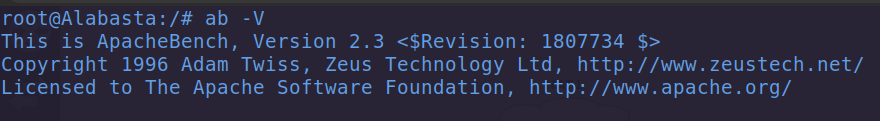

#### B. Pengujian

#### 1. Menguji Website HTTPS

Step 1 - Ganti `resolv.conf` terlebih dahulu agar bisa mengakses ke internet:

```bash
nameserver 192.168.122.1
#nameserver 192.168.2.3
```

Step 2 - Kita akan menguji website `apache.org` menggunakan Apache bencmark:

```bash
ab -n 100 -c 10 https://www.apache.org/
```

Penjelasan:

`ab` - Apache bench command.

`-n` - argument untuk menentukan jumlah permintaan atau request. Secara default jika kita tidak menentukan jumlah request, maka jumlah request = 1.

`-c` - adalah konkurensi, menunjukan jumlah beberapa permintaan yang dilakukan secara bersamaan. Jika kita tidak menentukan jumlah konkurensi, maka defaultnya adalah satu permintaan dalam satu waktu.

`URL` - path url yang ingin ditest. Perlu diingat juga untuk menambahkan tanda **/** di akhir url yang kita uji.

Ouput:

```bash
This is ApacheBench, Version 2.3 <$Revision: 1807734 $>
Copyright 1996 Adam Twiss, Zeus Technology Ltd, http://www.zeustech.net/
Licensed to The Apache Software Foundation, http://www.apache.org/

Benchmarking www.apache.org (be patient).....done


Server Software:        Apache
Server Hostname:        www.apache.org
Server Port:            443
SSL/TLS Protocol:       TLSv1.2,ECDHE-RSA-CHACHA20-POLY1305,2048,256
TLS Server Name:        www.apache.org

Document Path:          /
Document Length:        64667 bytes

Concurrency Level:      10
Time taken for tests:   3.741 seconds
Complete requests:      100
Failed requests:        0
Total transferred:      6601140 bytes
HTML transferred:       6466700 bytes
Requests per second:    26.73 [#/sec] (mean)
Time per request:       374.053 [ms] (mean)
Time per request:       37.405 [ms] (mean, across all concurrent requests)
Transfer rate:          1723.40 [Kbytes/sec] received

Connection Times (ms)
              min  mean[+/-sd] median   max
Connect:       83  132  31.9    124     214
Processing:    84  235  89.5    246     376
Waiting:       25   75  45.1     58     227
Total:        237  367  86.5    371     518

Percentage of the requests served within a certain time (ms)
  50%    371
  66%    417
  75%    450
  80%    460
  90%    480
  95%    504
  98%    518
  99%    518
 100%    518 (longest request)
```

Penjelasan:

`Server Software` - nama dari web server yang digunakan

`Server Hostname` - nama domain atau DNS, selain DNS bisa IP Adress juga.

`Server Port` - port yang digunakan ab untuk konek ke website, karena menggunakan HTTPS maka portnya adalah 443, jika menggunakan HTTP, maka portnya adalah 80.

`SSL/TLS Protocol` - protokol negosiasi antara server dan client.

`Document Path` - path yang diakses atau dihit oleh ab.

`Document Length` - ukuran dalam bytes dari suatu `Document` yang berhasil di return, Jika panjang `Document` berubah selama pengujian, responsnya dianggap error.

`Concurrency Level` - jumlah beberapa request yang dilakukan secara bersamaan.

`Time Taken for Tests` - rentang waktu yang dibutuhkan, mulai dari proses testing menggunakan ab sampai proses terakhir menerima respon.

`Complete Requests` - jumlah dari respon yang berhasil selama proses testing.

`Failed Requests` - jumlah dari respon yang gagal selama proses testing.

`Total Transferred` - jumlah total (dalam byte) yang diterima dari server.

`HTML Transferred` - jumlah total (dalam byte) dokumen yang diterima dari server. Jumlah ini tidak termasuk byte yang diterima di header HTTP

`Requests per second` - jumlah permintaan per detik. Nilai ini merupakan hasil pembagian jumlah permintaan dengan total waktu yang dibutuhkan.

`Time per request` - Rata-rata waktu yang dihabiskan per permintaan. Nilai pertama dihitung dengan rumus: concurrency _ timetaken _ 1000/done sedangkan nilai kedua dihitung dengan rumus timetaken \* 1000/done.

`Transfer rate` - Kecepatan transfer. Dihitung dengan rumus totalread / 1024 / timetaken.

#### Plotting output

Kita akan mencoba untuk memplot hasil yang relevan untuk melihat berapa banyak waktu yang dibutuhkan server seiring dengan meningkatnya jumlah permintaan. Caranya yaitu dengan menambahkan opsi `-g` pada command sebelumnya diikuti dengan nama file, contoh: `out.data` di mana data keluaran ab akan disimpan ke dalam file tersebut.

Step 1 - Buat direktori baru di `root`, dimana direktori tersebut akan digunakan untuk menyimpan output selama proses benchmark.

```bash
cd /root/
```

```bash
mkdir benchmark && cd benchmark
```

Step 2 - Jalankan command `ab` ditambahkan argumen `-g`.

```bash
ab -n 100 -c 10 -g out.data https://www.apache.org/
```

Step 3 - Cek isi dari file `out.data`.

```bash
cat out.data
```

Atau menggunakan command `less`, jika muncul pesan `command not found` install telebih dahulu.

```bash
apt install less -y
```

```bash
less out.data
```

Output:

```bash
starttime                       seconds         ctime   dtime   ttime   wait
Wed Nov 01 03:59:05 2023        1698811145      99      116     216     27
Wed Nov 01 03:59:04 2023        1698811144      96      136     232     42
Wed Nov 01 03:59:05 2023        1698811145      86      146     233     57
```

Penjelasan:

`starttime` - adalah tanggal dan waktu pada saat proses testing atau benchmarking dimulai.

`seconds` - sama seperti `starttime` hanya saja dalam format timestamp UNIX. Sebagai contoh jika `seconds` nya = `1698811145` maka untuk mengetahui tanggal aslinya kita bisa menggunakan command: `date -d @<timestamp>`. Maka hasilnya = `Wed Nov  1 03:59:05 UTC 2023`.

`ctime` - keterangan waktu koneksi (connection time).

`dtime` - menunjukan waktu pemrosesan.

`ttime` - menunjukan total waktu (total time), dimana perhitungannya yaitu: ttime = ctime + dtime.

`wait` - adalah waktu tunggu (waiting time).

Visualisasi dari Plot:

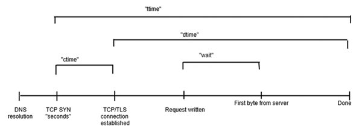

#### 2. Menguji Website HTTP (jarkom.site)

Step 1 - Ganti `resolv.conf` ke nameserver Enieslobby.

```bash
#nameserver 192.168.122.1
nameserver 192.168.2.3
```

Step 2 - Lakukan benchmark ke website jarkom.site, untuk pengujian pertama jumlah request yang berikan 100 dengan jumlah konkurensi 10.

```bash
ab -n 100 -c 10 -g out.data http://www.jarkom.site/
```

Output:

```bash
This is ApacheBench, Version 2.3 <$Revision: 1807734 $>
Copyright 1996 Adam Twiss, Zeus Technology Ltd, http://www.zeustech.net/
Licensed to The Apache Software Foundation, http://www.apache.org/

Benchmarking www.jarkom.site (be patient).....done


Server Software:        nginx/1.14.0
Server Hostname:        www.jarkom.site
Server Port:            80

Document Path:          /
Document Length:        112 bytes

Concurrency Level:      10
Time taken for tests:   0.213 seconds
Complete requests:      100
Failed requests:        0
Total transferred:      25800 bytes
HTML transferred:       11200 bytes
Requests per second:    470.44 [#/sec] (mean)
Time per request:       21.257 [ms] (mean)
Time per request:       2.126 [ms] (mean, across all concurrent requests)
Transfer rate:          118.53 [Kbytes/sec] received

Connection Times (ms)
              min  mean[+/-sd] median   max
Connect:        2    5   2.4      4      15
Processing:     4   16   8.5     14      37
Waiting:        3   16   8.5     14      37
Total:          6   21   8.8     20      40

Percentage of the requests served within a certain time (ms)
  50%     20
  66%     24
  75%     26
  80%     28
  90%     37
  95%     39
  98%     39
  99%     40
 100%     40 (longest request)
```

Penjelasan:

`Server Software: nginx/1.14.0` - menunjukan webserver yang digunakan adalah Nginx (webserver Dressrosa).

`Server Hostname: www.jarkom.site` - Domain yang digunakan
yaitu: `www.jarkom.site`.

`Server Port: 80` - Karena webistenya menggunakan HTTP, maka default portnya adalah 80.

`Complete requests: 100` dan `Failed requests: 0` - Tampaknya request yang dikirim tidak ada yang gagal.

#### 3. Menguji Website HTTP yang Memerlukan Autentikasi

Selanjutnya kita akan melakukan benchmarking ke website yang menggunakan HTTP Basic authetication

Step 1 - Di Dressrosa silahkan generate user dan password menggunakan htpasswd

```bash
htpasswd -c /etc/nginx/.htpasswd luffy
```

Step 2 - Tambahkan konfigurasi Auth Basic di `/etc/nginx/sites/available/lb-jarkom`

```bash
auth_basic "Administrator's Area";
auth_basic_user_file /etc/nginx/.htpasswd;
```

Step 3 - Tambahkan konfigurasi untuk memblokir semua file ``.htaccess` dan `.htpasswd` di file `lb-jarkom`

```bash
 location ~ /\.ht {
     deny all;
}
```

Update file `lb-jarkom`:

```bash
#Default menggunakan Round Robin
upstream backend  {
server 192.168.2.3; #IP EniesLobby
server 192.168.2.4; #IP Water7
server 192.168.2.5; #IP Jipangu
}

server {

listen 80;

server_name jarkom.site;

        location / {
            proxy_pass http://backend;
            proxy_set_header    X-Real-IP $remote_addr;
            proxy_set_header    X-Forwarded-For $proxy_add_x_forwarded_for;
            proxy_set_header    Host $http_host;

            auth_basic "Administrator's Area";
            auth_basic_user_file /etc/nginx/.htpasswd;
        }

        location ~ /\.ht {
            deny all;
        }

error_log /var/log/nginx/lb_error.log;
access_log /var/log/nginx/lb_access.log;

}
```

Step 4 - Lakukan pengujian menggunakan `ab`, karena website yang dituju menggunakan Auth Basic sebagai autentikasi maka perlu menambahkan argumen `-A` dan `username:password`

```bash
ab -A luffy:water7 -n 100 -c 100 http://jarkom.site/
```

Output:

```bash
This is ApacheBench, Version 2.3 <$Revision: 1807734 $>
Copyright 1996 Adam Twiss, Zeus Technology Ltd, http://www.zeustech.net/
Licensed to The Apache Software Foundation, http://www.apache.org/

Benchmarking jarkom.site (be patient).....done


Server Software:        nginx/1.14.0
Server Hostname:        jarkom.site
Server Port:            80

Document Path:          /
Document Length:        107 bytes

Concurrency Level:      10
Time taken for tests:   0.176 seconds
Complete requests:      100
Failed requests:        50
   (Connect: 0, Receive: 0, Length: 50, Exceptions: 0)
Total transferred:      25100 bytes
HTML transferred:       10500 bytes
Requests per second:    566.99 [#/sec] (mean)
Time per request:       17.637 [ms] (mean)
Time per request:       1.764 [ms] (mean, across all concurrent requests)
Transfer rate:          138.98 [Kbytes/sec] received

Connection Times (ms)
              min  mean[+/-sd] median   max
Connect:        1    4   2.3      3      10
Processing:     2   13   9.9      8      33
Waiting:        2   13   9.8      8      33
Total:          4   17  10.7     11      40

Percentage of the requests served within a certain time (ms)
  50%     11
  66%     15
  75%     29
  80%     30
  90%     35
  95%     39
  98%     40
  99%     40
 100%     40 (longest request)
```

#### 4. Menguji Load Balancing

Benchmarking untuk menguji algoritma load balancing yang telah kita buat.

#### Skenario 1

Menambah jumlah request dan konkurensi.

Step 1 - Install Htop di Dressrosa, Water7, EniesLobby, dan Jipangu

```bash
apt-get install htop -y
```

Step 2 - Untuk melakukan monitoring menggunakan Htop, cukup jalankan perintah `htop`.

Htop sendiri memiliki tiga bagian utama, yaitu:

- `Header` - Dimana Kita dapat melihat informasi CPU, Memory, Swap dan juga menampilkan proses, load average, and Up-time.

- `List Proses` - Daftar proses yang berjalan dan diurutkan berdasarkan penggunaan CPU.

- `Footer` - Menunjukkan berbagai opsi seperti bantuan, setup, filter tree kill, nice, quit, dan lain lain.

Tampak dari gambar di bawah proses yang berjalan masih cukup normal

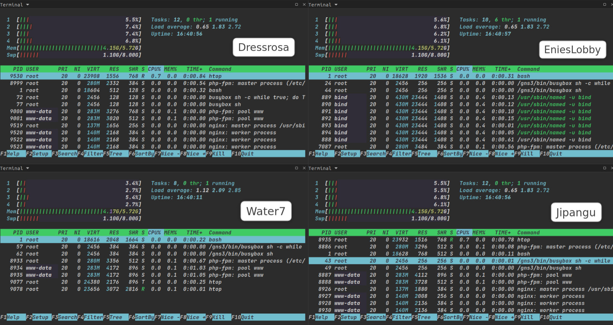

Step 3 - Update `worker_connections` di Dressrosa, EniesLobby, Water7 & Jipangu. `worker_connections` sendiri adalah parameter yang menentukan jumlah koneksi yang bisa ditangani oleh suatu worker

```bash
nano /etc/nginx/nginx.conf
```

Cari block `events`, lalu update jumlah dari `worker_connections` nya:

```bash
...
events {
        worker_connections 1024;
        # multi_accept on;
}
...
```

Step 4 - Lakukan Benchamarking, dengan menambah jumlah request dan konkurensi

```bash
ab -A luffy:water7 -n 2000 -c 500 http://jarkom.site/
```

Ouput

```bash
This is ApacheBench, Version 2.3 <$Revision: 1807734 $>
Copyright 1996 Adam Twiss, Zeus Technology Ltd, http://www.zeustech.net/
Licensed to The Apache Software Foundation, http://www.apache.org/

Benchmarking jarkom.site (be patient)
Completed 200 requests
Completed 400 requests
Completed 600 requests
Completed 800 requests
Completed 1000 requests
Completed 1200 requests
Completed 1400 requests
Completed 1600 requests
Completed 1800 requests
Completed 2000 requests
Finished 2000 requests


Server Software:        nginx/1.14.0
Server Hostname:        jarkom.site
Server Port:            80

Document Path:          /
Document Length:        105 bytes

Concurrency Level:      500
Time taken for tests:   3.129 seconds
Complete requests:      2000
Failed requests:        1358
   (Connect: 0, Receive: 0, Length: 1358, Exceptions: 0)
Total transferred:      502008 bytes
HTML transferred:       210008 bytes
Requests per second:    639.10 [#/sec] (mean)
Time per request:       782.345 [ms] (mean)
Time per request:       1.565 [ms] (mean, across all concurrent requests)
Transfer rate:          156.66 [Kbytes/sec] received

Connection Times (ms)
              min  mean[+/-sd] median   max
Connect:        6   17   9.0     15      60
Processing:     8  248 403.2     36    3084
Waiting:        8  246 403.1     35    3084
Total:         22  265 405.7     51    3113

Percentage of the requests served within a certain time (ms)
  50%     51
  66%     98
  75%    317
  80%    503
  90%   1046
  95%   1297
  98%   1313
  99%   1524
 100%   3113 (longest request)
```

Tampak dari gambar dibawah, resource dan proses yang digunakan cukup banyak. Hal ini terjadi karena request atau permintaan yang dikirimkan sangat banyak.

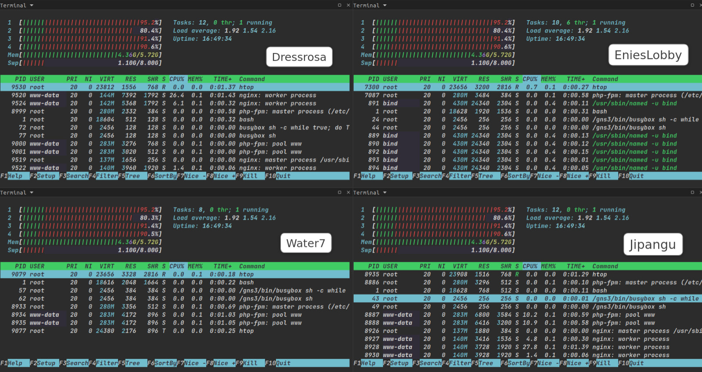

#### Skenario 2

Mengirim request lebih banyak, melewati limit yang ditentukan di `worker_connections`

Step 1 - Lakukan benchamrking, tapi kali ini jumlahnya request dan konkurensinya lebih banyak

```bash
ab -A luffy:water7 -n 6000 -c 2000 http://jarkom.site/
```

Ouput:

```bash
This is ApacheBench, Version 2.3 <$Revision: 1807734 $>
Copyright 1996 Adam Twiss, Zeus Technology Ltd, http://www.zeustech.net/
Licensed to The Apache Software Foundation, http://www.apache.org/

Benchmarking jarkom.site (be patient)
Completed 600 requests
Completed 1200 requests
Completed 1800 requests
Completed 2400 requests
Completed 3000 requests
Completed 3600 requests
apr_socket_recv: Connection reset by peer (104)
Total of 3672 requests completed
```

Tampak proses benchmark nya tidak selesai, jika Kita cek di error log, maka akan muncul pesan `worker_connections are not enough`. Berarti server Nginx telah mencapai batas maksimum koneksi yang dapat ditangani oleh suatu worker dalam satu waktu

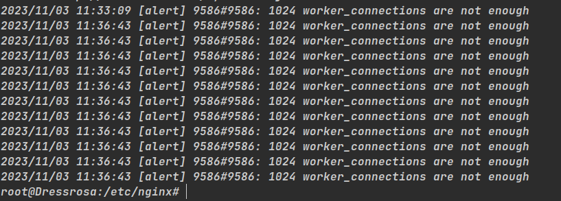

#### Skenario 3

Stop service Nginx di beberapa worker

Step 1 - Coba stop service Nginx di worker Water7 & Jipangu

```bash
service nginx stop
```

Step 2 - Kemudian lakukan benchmarking

```bash
ab -A luffy:water7 -n 1000 -c 500 http://jarkom.site/
```

Output

```bash
This is ApacheBench, Version 2.3 <$Revision: 1807734 $>
Copyright 1996 Adam Twiss, Zeus Technology Ltd, http://www.zeustech.net/
Licensed to The Apache Software Foundation, http://www.apache.org/

Benchmarking jarkom.site (be patient)
Completed 100 requests
Completed 200 requests
Completed 300 requests
Completed 400 requests
Completed 500 requests
Completed 600 requests
Completed 700 requests
Completed 800 requests
Completed 900 requests
Completed 1000 requests
Finished 1000 requests


Server Software:        nginx/1.14.0
Server Hostname:        jarkom.site
Server Port:            80

Document Path:          /
Document Length:        182 bytes

Concurrency Level:      500
Time taken for tests:   1.625 seconds
Complete requests:      1000
Failed requests:        0
Non-2xx responses:      1000
Total transferred:      343000 bytes
HTML transferred:       182000 bytes
Requests per second:    615.40 [#/sec] (mean)
Time per request:       812.478 [ms] (mean)
Time per request:       1.625 [ms] (mean, across all concurrent requests)
Transfer rate:          206.14 [Kbytes/sec] received

Connection Times (ms)
              min  mean[+/-sd] median   max
Connect:        3   15   6.0     17      25
Processing:     4  110 179.3     26    1595
Waiting:        4  110 179.2     26    1595
Total:         11  125 181.5     44    1613

Percentage of the requests served within a certain time (ms)
  50%     44
  66%    233
  75%    259
  80%    269
  90%    275
  95%    298
  98%    341
  99%    351
 100%   1613 (longest request)

```

Tampak request yang masuk secara otomatis di alihkan ke worker yang masih berjalan yaitu EniesLobby. Tampak juga tidak ada request yang fail.

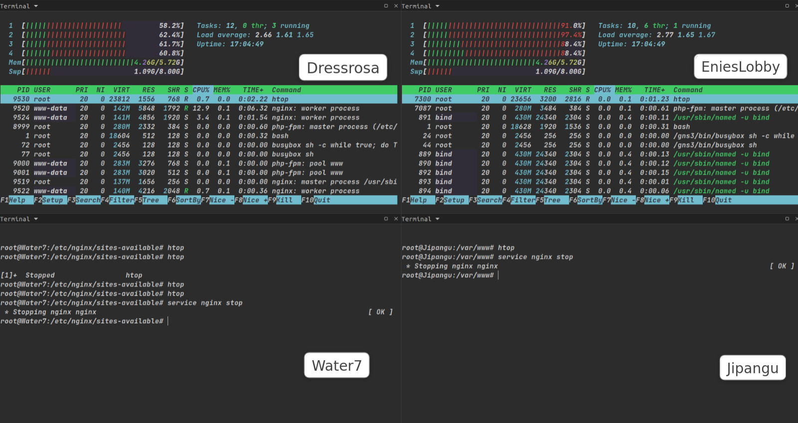

Jika kita mengecek error log, maka akan muncul pesan error `failed (111: Connection refused) while connecting to upstream`, hal ini terjadi karena server utama mencoba mengalihkan request ke alamat IP 192.168.2.4 (Water7) & 192.168.2.5 (EniessLobby). Namun kedua worker tersebut tidak dapat diakses karena service Nginx nya tidak berjalan.

```bash
cat /var/log/nginx/lb_error.log
```


#### Catatan

`Request` & `concurrency` - Untuk jumlah request dan konkurensi harap disesuaikan dengan CPU dan Memory.


#### Referensi

- <https://docs.nginx.com/nginx/admin-guide/web-server/reverse-proxy>
- <https://helpful.knobs-dials.com/index.php/CGI,_FastCGI,_SCGI,_WSGI,_servlets_and_such>
- <https://www.techopedia.com/definition/24198/fast-common-gateway-interface-fastcgi>
- <http://nginx.org/en/docs/http/ngx_http_proxy_module.html>
- <https://www.tutorialspoint.com/apache_bench/index.htm>
- <https://www.linuxid.net/31888/mengenal-konfigurasi-nginx-error-log-dan-access-log>
- <https://betterstack.com/community/guides/logging/how-to-view-and-configure-nginx-access-and-error-logs>
- <https://httpd.apache.org/docs/2.4/programs/ab.html>
