# Web Server

## Table of contents
+ A. [Additional Requirements for Taking Lab Sessions ](#a-additional-requirements-for-taking-lab-sessions)
+ B. [Important To Read](#b-important-to-read)
+ C. [Basic theory](#c-basic-theory)
  + 1.[ Web Server](#1-web-server)
  + 2.[ Load Balancing](#2-load-balancing)
  + 3.[ Apache Web Server](#3-apache-web-server)
+ D. [Lynx Installation](#d-lynx-installation)
+ E. [Apache Installation](#e-apache-installation)
+ F. [PHP Installation](#f-php-installation)
+ G. [Getting to know Apache](#g-getting-to-know-apache)
+ H. [Simple Apache Configuration](#h-simple-apache-configuration)
  + A. [Simple Usage](#a-simple-usage)
  + B. [Configuring a Website Using Port 8080](#b-configuring-a-website-using-port-8080)
+ H. [Let's Imagine](#h-let's-imagine)
  + A. [Domain Settings on Apache](#a-domain-settings-on-apache)
  + B. [Directory Listing](#b-directory-listing)
  + C. [Directory Alias](#c-directory-alias)
  + D. [Module Rewrite](#d-module-rewrite)

## A. Additional Requirements for Taking Lab Sessions
Record A and PTR on jarkom2020.com must point to the IP Water7


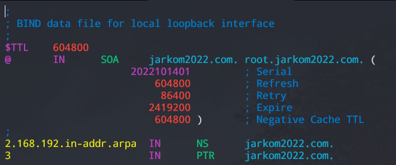

## B. Important To Read
1. Make sure all nodes can connect to the internet, both can connect outside and can ping from outside
2. Do not try to overtake the assistant's direction. The negligence is borne by the practitioner.
3. When experiencing problems / errors __check the syntax and make it the same as module__ first. Most likely the problem that occurs is due to a typing error.

## C. Basic theory
### 1. Web Server
There are two meanings of a web server. By _hardware_, web server means a storage that is used to store all data from web applications (HTML, CSS, JavaScript, etc. files). While _software_, a web server is a device whose job is to provide access services using HTTP or HTTPS protocols through web applications.

### 2. Load Balancing
___Load balancing___ is a mechanism that works by dividing the workload. ___Load balancer___ is an application or tool whose job is to perform _load balancing_. _Load balancer_ can use various _load balancing_ algorithms which aim to divide the workload equitably. The minimal architecture for _load balancing_ is as follows:


#### Kenapa dibutuhkan load balancing?
In order to handle the large number of users accessing the service at one time and keep the service available at all times, it takes more than one computer to install the service. With services available on multiple servers, a load sharing mechanism is needed to provide a balanced load on each server. By putting the service on multiple servers and optimal load sharing, every user request can be handled efficiently.

### 3. Apache Web Server
__Apache HTTP Server__ or commonly called Apache is a widely used _cross-platform_ and _open source_ web server _software_. In this lab session, we will use Apache as our web server _software_.

## D. Lynx Installation
__Lynx__ is a web browser that can be used on the command-line. Lynx can display hypertext documents and navigate existing links on a web page using only the keyboard.
#### 1. Open UML _Loguetown_
Then run the command
```
apt-get update
apt-get install lynx
```
if it says _"Do you want to continue? [Y/n]"_ input `Y` then press ___enter___.
#### 2. Open google.com page using lynx
Run command
```
lynx google.com
```
If there is an option like the picture below, choose it as you wish.

<br/>
If it is installed correctly, a screen like the one below will appear.
<br/>
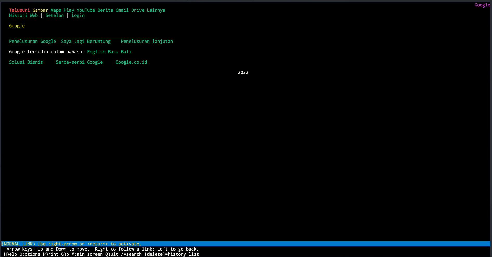

## E. Apache Installation
#### 1. Open Node _Water7_
Then run the command
```
apt-get install apache2
```
if it says _"Do you want to continue? [Y/n]"_ input `Y` then press ___enter___.


#### 2. Open your respective laptop/computer browser
Open the web __IP Water7 Each Group__ with `lynx` until the Apache page appears as below.

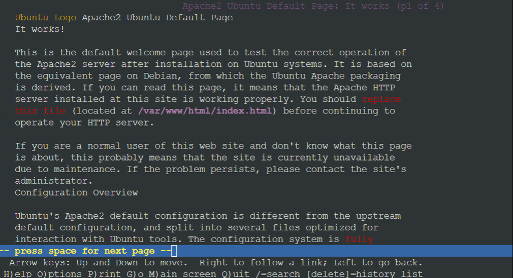

## E. PHP Installation
#### 1. Open Node Water7
Then run the command
```
apt-get install php
```
if it says _"Do you want to continue? [Y/n]"_ input `Y` then press ___enter___.

#### 2. Test apakah php sudah ter-install
Run the command below to check the version of your __php__.
```
php -v
```
If the _output_ is similar to the one below, then your __php__ has been _installed_.


## F. Getting to know Apache
The Apache web server has a _directory_ containing various configurations located at `/etc/apache2/`

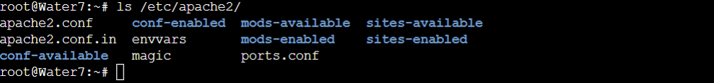

Here are some important things to know:
+ Configuration File is in `/etc/apache2`

|__File Name__ | __Usage__ |
| --- | --- |
| __apache2.conf__ | Apache2 main configuration file |
| __ports.conf__ | Port configuration file used for web server |
| __sites-available__ | _Directory_ where website configurations (virtual hosts) are available |
| __sites-enabled__ | _Directory_ where website configuration (virtual host) is available and is already active |
| __mods-available__ | _Directory_ where available apache2 modules are |
| __mods-enabled__ | _Directory_ where available and active apache2 modules are |

+ frequently used  _Command_

|__Command__ | __Usage__ |
| --- | --- |
| __a2ensite__ | To activate (_ENABLE_) the website configuration that has been created |
| __a2dissite__ | To disable (_DISABLE_) the currently active website configuration |
| __a2enmod__ | To enable (_ENABLE_) a particular module into apache2 configuration |
| __a2dismod__ | To disable (_DISABLE_) a specific module in apache2 configuration |

## G. Simple Apache Configuration
### A. Simple Usage
#### A.1. Move to _directory_ `/etc/apache2/sites-available`
Use the command `cd /etc/apache2/sites-available`

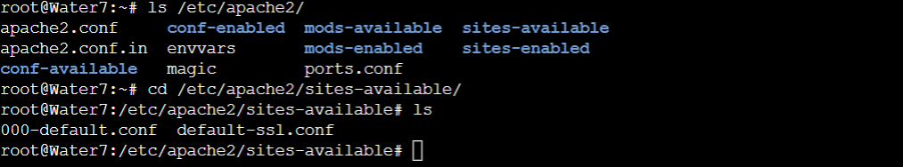

You can see that there are two files:
+ file __000-default.conf__, apache default website configuration file for http.
+ file __default-ssl.conf__, Apache default website configuration file for https.
  
__Additional Note__ :

Check the apache2 version that you have installed by using the command: `apache2 -v`. If the apache2 version that you have installed is version 2.4.x then follow the appropriate module. If the apache version that you have installed is version 2.2.x, then follow the appropriate module with certain additional notes.

#### A.2. Open File ___default___
For version 2.4.x use the command `nano /etc/apache2/sites-available/000-default.conf`. As for version 2.2.x use the command `nano /etc/apache2/sites-available/default`

For version 2.4.x each configuration file in the directory `/etc/apache2/sites-available` file name is added with `.conf`. Example : `/etc/apache2/sites-available/default.conf`. Because if you don't add `.conf` it will get an error.

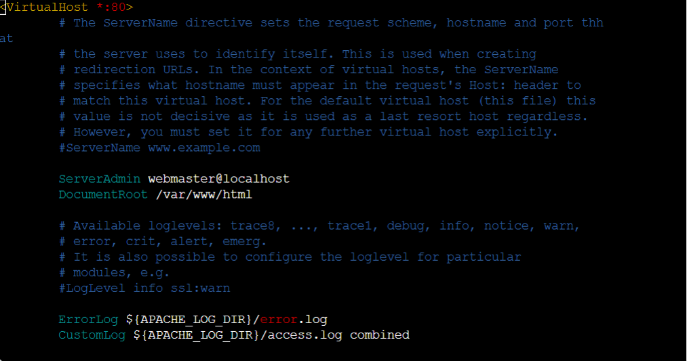

#### A.3.  In the _default_ file there is the standard apache configuration
Some of them are:
##### __Port__ in use
```
<VirtualHost *:80>
```
The configuration above shows that the port used is port 80

##### ___Directory___ where our website files are located
```
DocumentRoot /var/www/html
```
+ For this JarKom lab session please change the _DocumentRoot_ to `/var/www/html`
+ Don't forget to do `service apache2 restart` after making configuration changes so that the changes that have been made are applied

#### A.4. Move to the _directory_ pointed to by _DocumentRoot_ in the _default_ file
Use the command `cd /var/www/`

+ Since we changed the _DocumentRoot_ in the _default_ file to `/var/www/html`, now create a _directory_ named "html" with the command `mkdir /var/www/html`if the directory haven't been created yet.

#### A.5. Move to _directory_ `/var/www/html` and create file _index.php_
Use the command `nano /var/www/html/index.php` and fill the file with
```
<?php
	phpinfo();
?>
```


#### A.6. Open your respective laptop/computer browser
Access the address using lynx __http://[IP Water7]/index.php__


+ __Note__:
	If the web display does not appear as shown above and only plain text appears the contents of the index.php file, please install **libapache2-mod-php7.0** by running the command
```
apt-get install libapache2-mod-php7.0
```
	then restart apache with the command
```
service apache restart
```

### B. Configuring a Website Using Port 8080
#### B.1 Move to _directory_ `/etc/apache2/sites-available`
Move to _directory_ `/etc/apache2/sites-available` using command 
```
cd /etc/apache2/sites-available
```
Copy the _000-default.conf_ file into the _000-default-8080.conf_ file with the command
```
mv default-8080 default-8080.conf
```
Don't forget not to use `.conf` if apache2 version is 2.2.x. If you have you can rename the file using the command

#### B.2 Open file _default-8080.conf_
Open the file that you created earlier. Use the command `nano /etc/apache2/sites-available/default-8080.conf`. Don't forget not to add `.conf` if apache2 version is 2.2.x.
+ Then change the port used. Where initially port `80` became port `8080`.
+ Also change _DocumentRoot_ which was originally `/var/www/html` to `/var/www/web-8080`.


#### B.3 Add _port 8080_ in `ports.conf` . file
The __ports.conf__ file is located in the _directory_ `/etc/apache2`

The way to add a port that needs to be heard is to write
```
Listen 8080
```


#### B.4 Enable _default-8080.conf_ configuration
To enable a configuration, we use the command `a2ensite` followed by the __name of the configuration file__ that was created.
In this case the command to run is
```
a2ensite default-8080.conf
```


#### B.5 Restart apache
Use command `service apache2 restart`


#### B.6 Move to _directory_ `/var/www`
Create a new _directory_ inside `var/www` with the name __web-8080__


#### B.7 Go to _directory_ `/var/www/web-8080` and create file _index.php_
Fill the __index.php__ file with
```
<?php
    echo "Hello, I'm running in port 8080";
?>
```


#### B.8 Open your respective laptop/computer browser
Access address __http://[IP Water7]:8080__


## H. Let's Imagine
### A. Domain Settings on Apache
Fulan and Poyoyo are a group in the Computer Network course. They were instructed by the assistant to create a website with the domain __jarkom2021.com__, and were given access to a server that could be used as a host for their website. But for some reason or another, Poyoyo can't help you carry out orders from the assistant. Luckily, Poyoyo left a note for Fulan to follow so Fulan could complete the assistant's orders.

Let's help Fulan by configuring the server according to the instructions given by Poyoyo:

#### A.1 Move to _directory_ `/etc/apache2/sites-available`
Copy the __000-default.conf__ file into the __jarkom2021.com__ file. Don't forget not to add `.conf` if apache2 version is 2.2.x

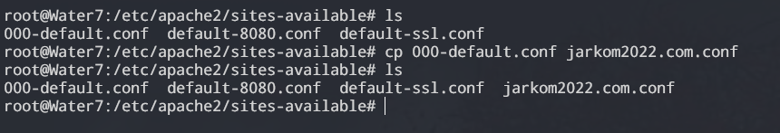

#### A.2 Open file _jarkom2021.com_
+ Add
```
ServerName jarkom2021.com
ServerAlias www.jarkom2021.com
```
	According to [apache2.4 documentation](https://httpd.apache.org/docs/2.2/mod/core.html):
	+ `ServerName` is "_Hostname and port that the server uses to identify itself_"
	+ `ServerAlias` is "_Alternate names for a host used when matching requests to name-virtual host_"
+ Change _DocumentRoot_ to `/var/www/jarkom2021.com`

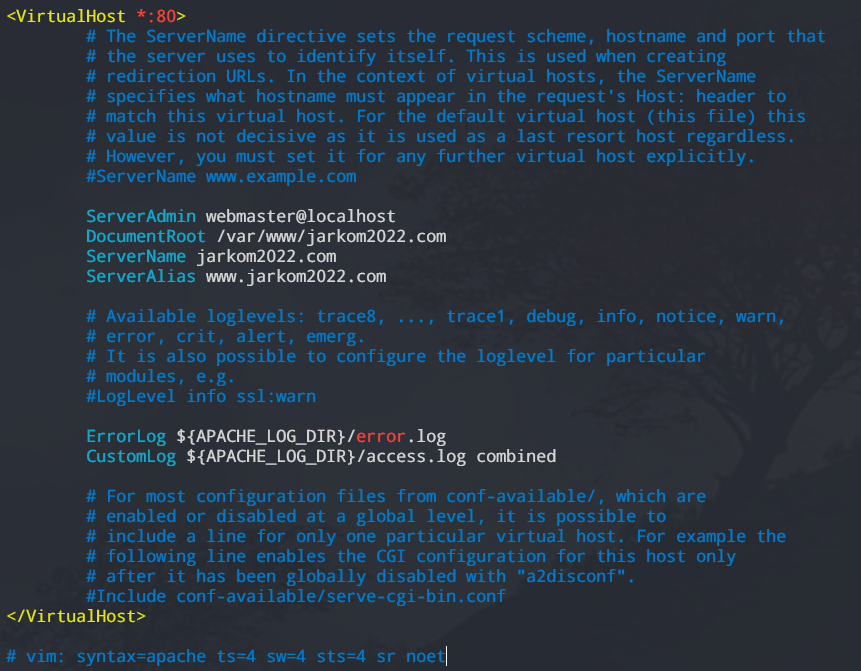

#### A.3 Enable _jarkom2021.com_ configuration
Use the command `a2ensite jarkom2021.com`

#### A.4 Restart apache
Use command `service apache2 restart`

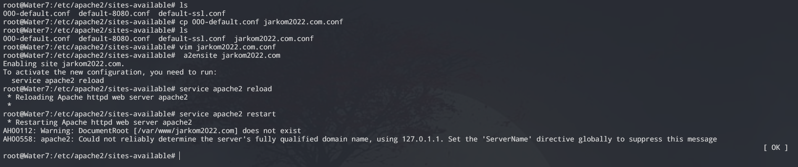

#### A.5 Move to _directory_ `/var/www`
Then create a new _directory_ inside `var/www` with the name __jarkom2021.com__


#### A.6 Go to _directory_ `/var/www/jarkom2021.com` and create file _index.php_
Fill the __index.php__ file with
```
<?php
    echo "Water7 is a city in One Piece...";
?>
```


#### A.7 Open _jarkom2021.com_ using _lynx_


### B. Directory Listing
Inside the _directory_ `/var/www/jarkom2021.com` given the _directory_ structure as follows.
```
/var/www/jarkom2021.com/
├── assets/
│   └── javascript/
├── data/
└── download/
    └── img/
```
The next command from the assistant is to create some directories, __/assets__, __/data__, and __/download__. The __/download__ directory must be able to display a list of files in that directory, while the __/assets__ directory must not display the contents of that directory.

Let's help those Fulan who are confused about reading Poyoyo's explanation so that Fulan can do the assistant's orders. 

#### B.1 Create the _directory-directory_ required by Waffle's jarkom2021.com website
Use the following commands:
```
mkdir /var/www/jarkom2021.com/data
mkdir /var/www/jarkom2021.com/download
mkdir /var/www/jarkom2021.com/download/img
mkdir /var/www/jarkom2021.com/assets
mkdir /var/www/jarkom2021.com/assets/javascript
```


#### B.2 Activate Directory Listing for /download
+ Move to _directory_ `/etc/apache2/sites-available` then open file ___jarkom2021.com___ and add
```
<Directory /var/www/jarkom2021.com/download>
	Options +Indexes
</Directory>
```
	don't forget to save the changes so that _directory_ ___download___ displays the contents of its _directory_.
	
	
	
	
+ Restart apache with command `service apache2 restart`
+ Open a browser and access http://jarkom2021.com/download


__Explanation__:
To set the _directory_ on a web, use
```
<Directory /x> ... </Directory>
```
Example to set `/var/www/jarkom2021.com/download`
```
<Directory /var/www/jarkom2021.com/download>
	
</Directory>
```

#### B.3 Turn off Directory Listing for /assets
+ Move to _directory_ `/etc/apache2/sites-available` then open file ___jarkom2021.com___ and add
```
<Directory /var/www/jarkom2021.com/assets>
	Options -Indexes
</Directory>
```
	don't forget to save the changes so that _directory_ ___assets___ doesn't display the contents of its _directory_.
	
	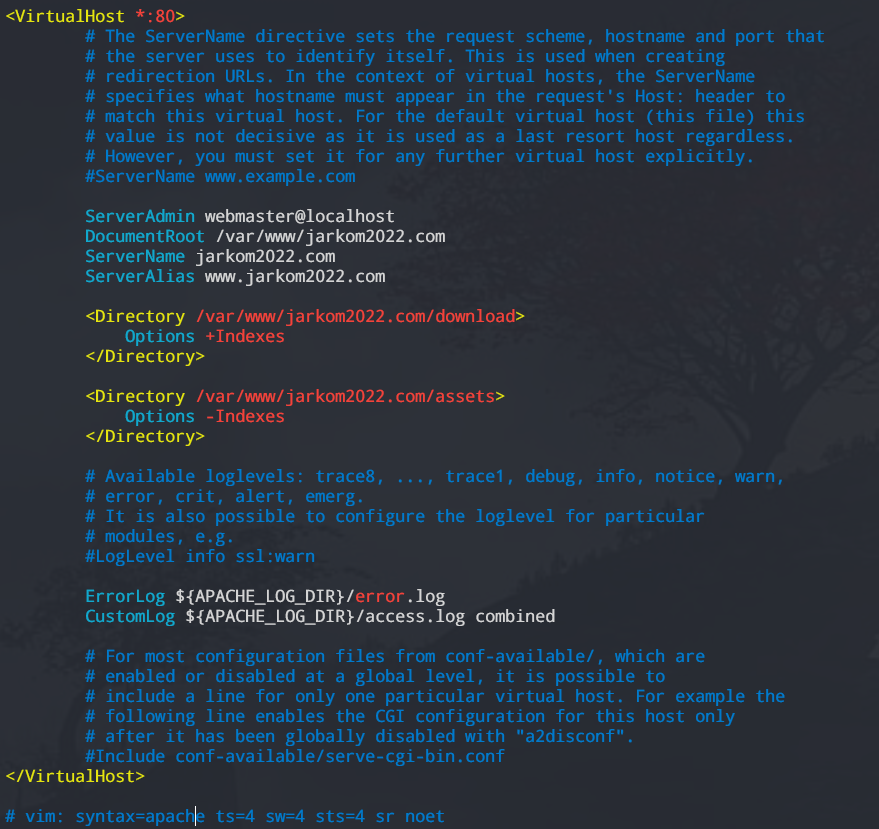
	
+ Restart apache with command `service apache2 restart`
+ Open a browser and access http://jarkom2021.com/assets


### C. Directory Alias
Because the URL __http://[IP Water7]/assets/javascript__ is too long, then Fulan try to make the _directory alias_ __http://[IP Water7]/assets/js__ to make it look _simple_.

Here are the working steps given by Poyoyo:

+ Move to _directory_ `/etc/apache2/sites-available` then open file ___jarkom2021.com___ and add
```    
<Directory /var/www/jarkom2021.com/assets/javascript>
	Options +Indexes
</Directory>

Alias "/assets/js" "/var/www/jarkom2021.com/assets/javascript"
```

	don't forget to save the changes so that _directory_ ___assets/javascript___ can display the contents of its _directory_ when the user accesses __http://[IP Water7]/assets/js__.
	
	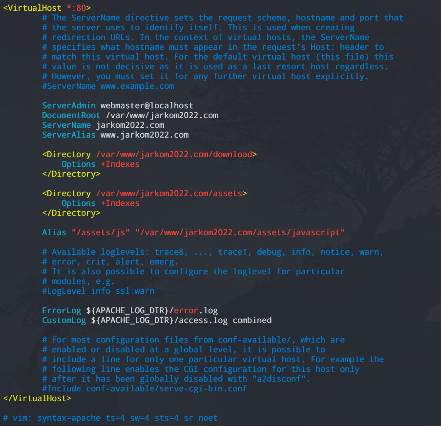
	
+ Restart apache with command `service apache2 restart`
+ Move to folder __/var/www/jarkom2021.com/assets/javascript__ and create file __app.js__ with command `touch app.js`
+ Open a browser and access http://jarkom2021.com/assets/js

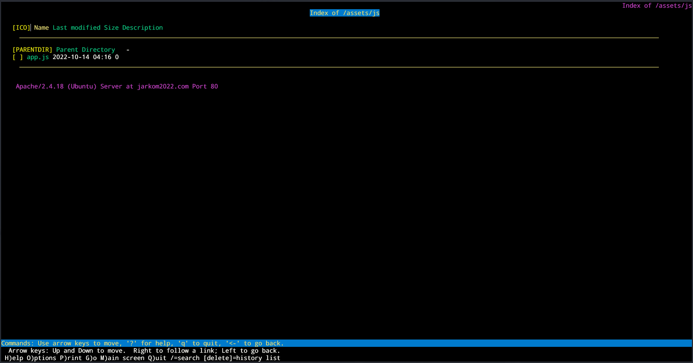

### D. Module Rewrite
#### D.1 Activate Module Rewrite
The next assistant command is to turn on _module rewrite_ so that URL writing becomes neater and without the need to write the _.php_ extension when accessing the page.

+ Run the command `a2enmod rewrite` to enable _module rewrite_.

+ Restart apache with the command `service apache2 restart`

	

Usually all configurations for a website are set in a file in _directory_ __/etc/apache2/sites-available__. But sometimes there is a case that root privileges to edit configuration files located in the __/etc/apache2/sites-available__ folder are not owned, or we don't want other users to edit the configuration files located in _directory_ __/etc/apache2/sites -available__.

To solve the problem, create a __.htaccess__ file in the _directory_ to be managed.

An example is like the case above, where we want to set _mod rewrite_ from __[http://jarkom2021.com](http://jarkom2021.com)__ so that when we access the php file we don't need to write the extension. Then what we need to do is
+ Move to _directory_ `/var/www/jarkom2021.com` and create a __.htaccess__ file with the contents of the file
```
RewriteEngine On
RewriteCond %{REQUEST_FILENAME} !-d
RewriteRule ^([^\.]+)$ $1.php [NC,L]
```

	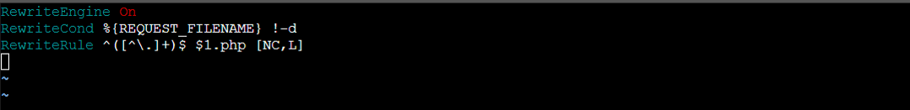

	__Explanation__:
	+ `RewriteEngine On` = for flag that uses module rewrite
	+ `RewriteCond %{REQUEST_FILENAME} !-d` = the rule will not run when the accessed is _directory_ (d)
	+ `RewriteRule ^([^\.]+)$ $1.php [NC,L]` = $1 is the input parameter that will be searched by the webserver
	* For more details [click here](https://httpd.apache.org/docs/2.4/rewrite/flags.html)
+ Create file _about.php_ inside _directory_ `/var/www/jarkom2021.com/` with contents
```
<?php
	echo "This is About page";
?>
```
+ Move to _directory_ `/etc/apache2/sites-available` then open file ___jarkom2021.com___ and add
```
<Directory /var/www/jarkom2021.com>
	Options +FollowSymLinks -Multiviews
	AllowOverride All
</Directory>
```
	and don't forget to save the changes.
	
	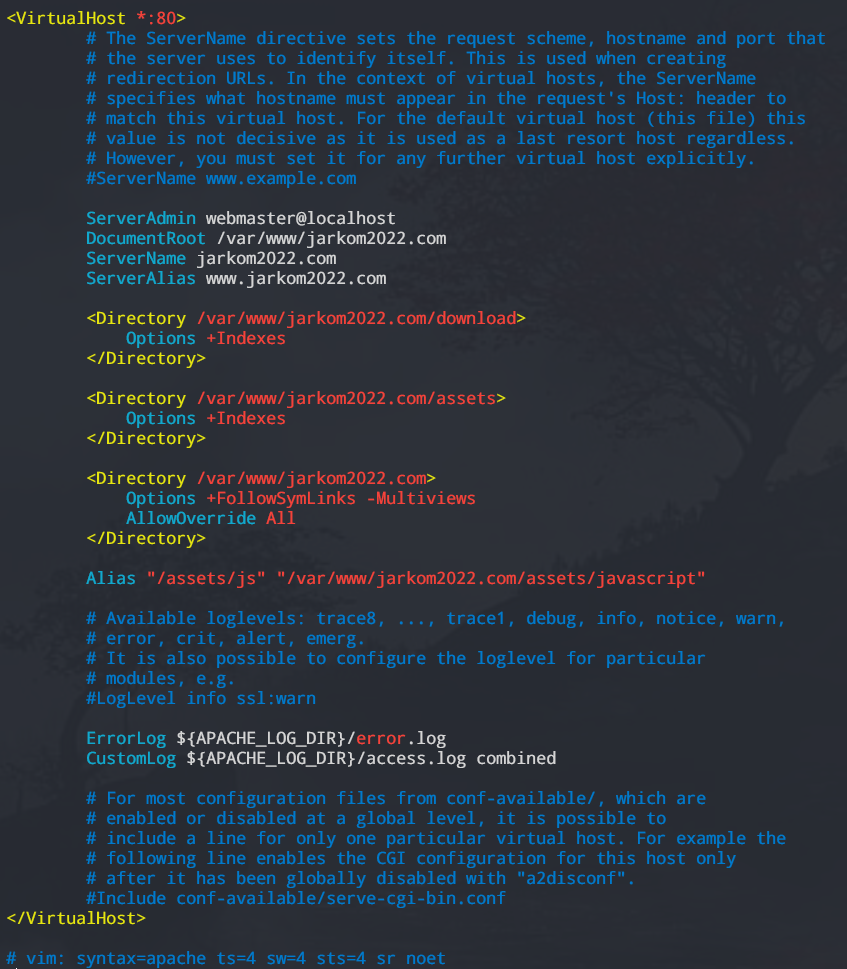
	
	__Explanation__:
	+ `AllowOverride All` added so that the __.htaccess__ configuration can run.
	+ `+FollowSymLinks` added so that the __mod_rewrite__ configuration can run.
	+ `-Multiviews` added to prevent __mod_negotiation__ configuration from running. __mod_negotiation__ can '_rewrite_' _requests_ thus overwriting and interfering with __mod_rewrite__.

+ Restart apache with command `service apache2 restart`
+ Open a browser and access __http://jarkom2021.com/aboutus__

	
	
<!-- ### E. Authorization
On the web http:jarkom2020.com there is a path __/data__ which cannot be opened by anyone. Rachma wants __/data__ to only be accessed by users who have IP 10.151.252.0/255.255.252.0

So what Ifin instructed to keep Rachma's _directory_ __/data__ safe was
+ Move to _directory_ `/etc/apache2/sites-available` then open file ___jarkom2020.com___ and add
	```
	<Directory /var/www/jarkom2020.com/data>
	    Options +Indexes
	    Order deny,allow
	    Deny from all
	    Allow from 10.151.252.0/255.255.252.0
	</Directory>
	```
	don't forget to save the changes.
	
	__Explanation__:
	+ `Order deny, allow` is the order of access rights. There are two types of orders, namely:
		+ `deny,allow`: The _Deny_ section must be _declared_ first before _Allow_
		+ `allow,deny`: The _Allow_ section must be _declared_ first before _Deny_
	+ `Deny from all`  means all users are rejected
	+ `Allow from 10.151.252.0/255.255.252.0` means if the user has IP NID 10.151.252.0./22, he is allowed to access the page.
	+ For more info [click here](https://httpd.apache.org/docs/2.4/mod/mod_access_compat.html)	
	+ Restart apache with the command `service apache2 restart`
+ Open a browser and access __http://jarkom2020.com/data__
When the user does not have an __IP NID 10.151.252.0/22__ a page like the one below will appear

	IMG HERE

Meanwhile, when the user has a __IP NID 10.151.252.0/22__ then the page that appears is as below

	IMG HERE

-->

### 4. Nginx Web Server
__Nginx__ (pronounced: engine-x) is an open-source software that serves multiple functions. This web server is known for its powerful performance and advanced features. Some of the functions of Nginx include:

- Web server
- Load Balancing
- Reverse Proxy

#### A. Nginx Installation

##### 1. Open the Foosha Node

Then run the command:

```bash
apt-get update
apt-get install nginx
```

If you see the prompt _"Do you want to continue? [Y/n]"_  input `Y` and press ___enter___.

Once the Nginx installation is complete, don't forget to run the following command:

```bash
service nginx start
```

To check the status of Nginx, you can use the command:

```bash
service nginx status
```

##### 2. Use `lynx` to access the web.

Open the web page of __IP Water7 Masing-Masing Kelompok__ using `lynx` until the Nginx page appears as shown below.

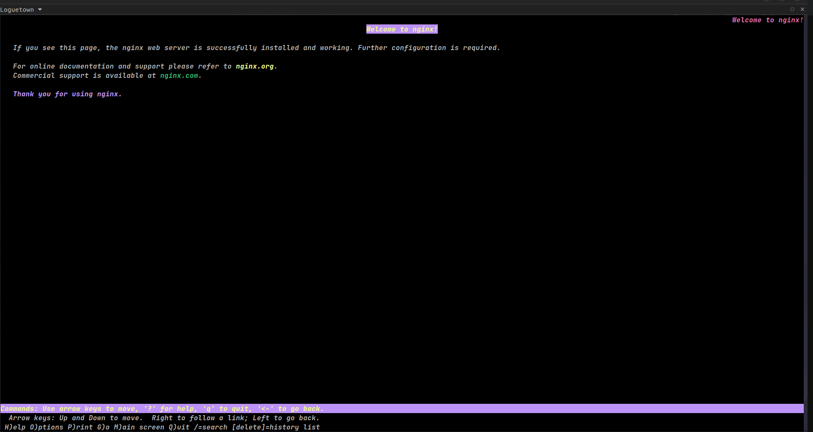


#### B. Load Balancing in Nginx

The common load balancing architecture used in Nginx (default):

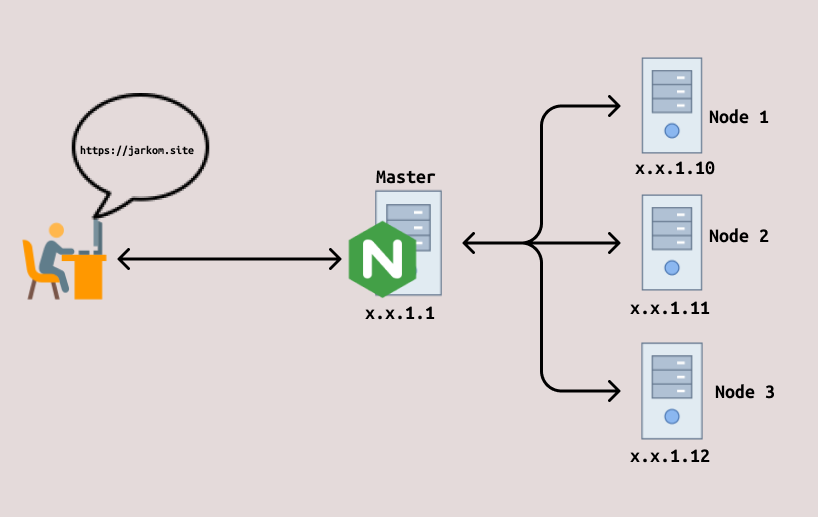

However, we can also use another type of architecture, namely __Weighted load balancing__, by adding the `weight` parameter in the Nginx configuration, allowing one node to have a higher weight or load.

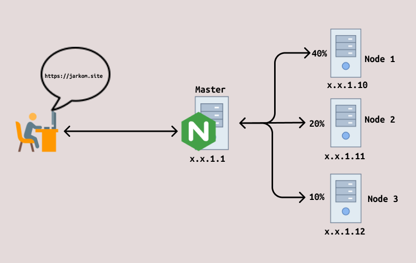

Nginx also offers several load balancing methods or algorithms that can be customized to meet the user's needs. Here are some commonly used methods:

- Round Robin

	If you choose this method, the load distribution will be assigned according to the server or master sequence number. If there are 3 nodes, the order is the first node, followed by the second node, and then the third node. After the third node receives the load, the sequence repeats from the first node. Round Robin is the default method in Nginx.

```bash
upstream mynode {
	server srv1.example.com;
	server srv2.example.com;
	server srv3.example.com;
}
```
- Least-Connection

	Unlike Round Robin, which distributes based on server order, Least-Connection prioritizes distributing loads to nodes with the lowest workload. The master node records all loads and performance of each node and prioritizes those with the lowest load, ensuring no server is underloaded.

```bash
upstream mynode {
	least_conn;
	server srv1.example.com;
	server srv2.example.com;
	server srv3.example.com;
}
	```

- IP Hash

	This algorithm differs from the previous ones by hashing requests based on the user's IP address. Thus, each server consistently receives requests from different IP addresses. If a server is unavailable, requests from the client will be served by another server.

```bash
upstream mynode {
	ip_hash;
	server srv1.example.com;
	server srv2.example.com;
	server srv3.example.com;
}
```

- Generic Hash

	The Hash Load Balancer method maps loads to each node by creating a hash based on specified text and/or Nginx Variables within the hash configuration.	

```bash
upstream mynode {
	hash $request_uri consistent;
	server srv1.example.com;
	server srv2.example.com;
	server srv3.example.com;
}
```

#### C. Upstream
In Nginx, "upstream" refers to a group or cluster of nodes that we want to use as a web server.

```bash
http {
    upstream nama_upstream {
        nama_method;
        server 192.168.1.2;
        server 192.168.1.3;
	server 192.168.1.4 weight=5;
        server ....;
    }
}

server {
    location / {
        proxy_pass http://nama_upstream;
    }
}

```

#### D. Reverse Proxy

A Reverse Proxy is a proxy system used to forward or bypass client requests. It acts as a bridge between frontend and backend servers, ensuring smooth data exchange and request handling.

Besides data exchange, Reverse Proxy also provides security and compression, reducing the load on servers when handling multiple requests simultaneously. Here's a simple script using a reverse proxy:

```bash
server {
    listen 80;
    server_name www.jarkom.site jarkom.site;

    location /blog {
       proxy_pass http://blog.jarkom.site:8000/posts/;
    }
}
```

If a visitor accesses http://jarkom.site/blog/my-post, Nginx will proxy this request to another server at http://blog.jarkom.site:8000/posts. However, the main server still receives and serves the connection, acting only as an intermediary.

When the proxy server address includes a URI, such as /blog/, the forwarded request URI is replaced with the URI specified in the directive. If the proxy server address is specified without a URI, the request connection URI is forwarded to the proxy server.

#### E. Setup Load Balancing di Nginx

Create a simple topology as shown in the image below:

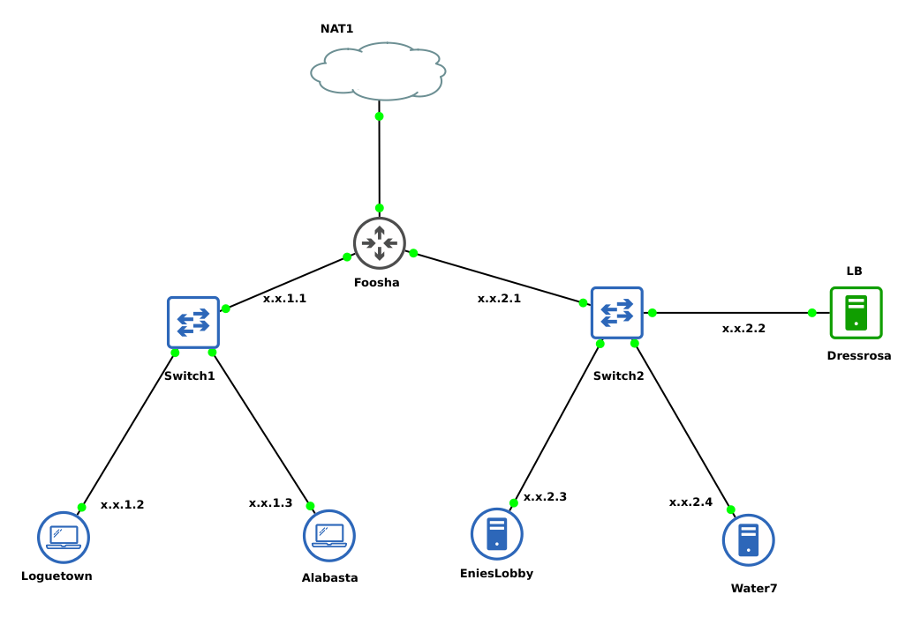

Set up the IP addresses on each node, ensuring that every node is connected to the internet.

- Foosha

```bash
auto eth0
iface eth0 inet dhcp

auto eth1
iface eth1 inet static
	address [Prefix IP].1.1
	netmask 255.255.255.0

auto eth2
iface eth2 inet static
	address [Prefix IP].2.1
	netmask 255.255.255.0
```

- Loguetown

```bash
auto eth0
iface eth0 inet static
	address [Prefix IP].1.2
	netmask 255.255.255.0
	gateway [Prefix IP].1.1
```

- Alabasta

```bash
auto eth0
iface eth0 inet static
	address [Prefix IP].1.3
	netmask 255.255.255.0
	gateway [Prefix IP].1.1
```

- Dressrosa

```bash
auto eth0
iface eth0 inet static
	address [Prefix IP].2.2
	netmask 255.255.255.0
	gateway [Prefix IP].2.1
```

- Enieslobby

```bash
auto eth0
iface eth0 inet static
	address [Prefix IP].2.3
	netmask 255.255.255.0
	gateway [Prefix IP].2.1
```

- Water7

```bash
auto eth0
iface eth0 inet static
	address [Prefix IP].2.4
	netmask 255.255.255.0
	gateway [Prefix IP].2.1
```

#### Dressrosa (DNS Server)

- Install Bind9 and Nginx on Dressrosa:

```bash
apt-get update
apt-get install bind9 nginx
```

- Then, create a simple domain as shown in the previous module; for this topology, we will use `jarkom.site` as the main domain.

- Contents of the __named.conf.local__ file:

```bash
//
// Do any local configuration here
//

// Consider adding the 1918 zones here, if they are not used in your
// organization
//include "/etc/bind/zones.rfc1918";


zone "jarkom.site" {
		type master;
		file "/etc/bind/jarkom/jarkom.site";
};

zone "2.168.192.in-addr.arpa" {
	type master;
	file "/etc/bind/jarkom/2.168.192.in-addr.arpa";
};
```

- Contents of the __jarkom.site__ file:

```bash
;
; BIND data file for local loopback interface
;
$TTL    604800
@       IN      SOA     jarkom.site. root.jarkom.site. (
				2         ; Serial
				604800    ; Refresh
				86400     ; Retry
				2419200   ; Expire
				604800 )  ; Negative Cache TTL
;
@       IN      NS      jarkom.site.
@       IN      A       192.168.2.2
```

- Contents of the __2.168.192.in-addr.arpa__ file:

```bash
;
; BIND data file for local loopback interface
;
$TTL    604800
@       IN      SOA     jarkom.site. root.jarkom.site. (
				2         ; Serial
				604800    ; Refresh
				86400     ; Retry
				2419200   ; Expire
				604800 )  ; Negative Cache TTL
;
2.168.192.in-addr.arpa.         IN      NS      jarkom.site.
2                               IN      PTR     jarkom.site.
```

- Testing the domain created on `Alabasta`

	

#### EniesLobby (Nginx worker)

- Install and set up Nginx and PHP

```bash
apt-get update && apt install nginx php php-fpm -y
```

- Check the PHP version

```bash
php -v
```

	

- Create a new directory in `/var/www`, named `jarkom`

```bash
mkdir /var/www/jarkom
```

- Enter the `jarkom` directory and create a file named `index.php`

```php
<?php
echo "Halo, Kamu berada di EniesLobby";
?>
```

- Next, configure Nginx. First, navigate to `/etc/nginx/sites-available` and create a new file named `jarkom`

```
nano jarkom

or

touch jarkom
```

- Then add the following server block configuration:

```bash
server {

	listen 80;

	root /var/www/jarkom;

	index index.php index.html index.htm;
	server_name _;

	location / {
			try_files $uri $uri/ /index.php?$query_string;
	}

	# pass PHP scripts to FastCGI server
	location ~ \.php$ {
	include snippets/fastcgi-php.conf;
	fastcgi_pass unix:/var/run/php/php7.2-fpm.sock;
	}

location ~ /\.ht {
			deny all;
	}

	error_log /var/log/nginx/jarkom_error.log;
	access_log /var/log/nginx/jarkom_access.log;
}
```

- Save the file, then create a `symlink`:

```bash
ln -s /etc/nginx/sites-available/jarkom /etc/nginx/sites-enabled
```

- Finally, restart Nginx:

```bash
service nginx restart

or

nginx -s reload
```

- To check if the configuration is correct, use the following command:

```bash
nginx -t
```

	


#### Water7 (Nginx worker)

- Repeat the same steps as on the EniesLobby node, but change the configuration in `index.php` for easier testing:

```php
<?php
echo "Halo, Kamu berada di Water7";
?>
```
#### Explanation

##### Server Block:

 - `listen` defines the port on which Nginx will operate.

 - `root` points to the directory containing the web files.

- `index` determines the order of index files the server will try when a request is made.

- `server_name` specifies the server's name. The underscore _ means the server will respond to any unmatched server names. This can be changed to an IP address, domain name, localhost, etc.

- `location { ... }` configuration to handle requests to the root site. __try_files__ attempts to find the file matching __$uri__, then __$uri/__, and if that also fails, it directs to index.php using the __data query string__.

- `location ~ \.php$` configuration to handle PHP files. This matches the .php extension in the URL and processes it using FastCGI, directing it to the PHP FastCGI socket. Adjust the PHP socket version as per the installed PHP version (e.g., PHP 7.2 in this case).

- `location ~ /\.ht` restricts access to .ht files (like .htaccess), which is a common security measure to prevent access to sensitive files.

- `error_log` directs error logs to a specific file.

- `access_log` directs access logs to a specific file.

- `ln -s /etc/nginx/sites-available/jarkom /etc/nginx/sites-enabled` creates a symbolic link of the Nginx configuration file from the /etc/nginx/sites-available directory to the /etc/nginx/sites-enabled directory.


#### Dressrosa (Load Balancer)

- Return to the Dressrosa node and create a new file in `/etc/nginx/sites-available` named `lb-jarkom`

```bash
# Default using Round Robin
upstream myweb  {
	server 192.168.2.3; #IP EniesLobby
	server 192.168.2.4; #IP Water7
}

server {
	listen 80;
	server_name jarkom.site;

	location / {
	proxy_pass http://myweb;
	}
}
```
- lSave the file, then create a `symlink`

```bash
ln -s /etc/nginx/sites-available/lb-jarkom /etc/nginx/sites-enabled
```

#### Explanation

- `upstream` - defines a group of servers that will receive the load, named __myweb__.  In this case, there are two servers with IP addresses 192.168.2.3 and 192.168.2.4. The Round Robin method will distribute traffic equally between these two servers.

- `listen` - specifies that this web server will listen for requests on port 80.

- `location / { ... }` configures how Nginx will handle incoming requests. In this case, all requests will be forwarded to the server group defined in the __upstream__ block.

#### Testinf
Log into Loguetwon or Alabasta and run the command __lynx http://jarkom.site__.
```bash
lynx http://jarkom.site
```
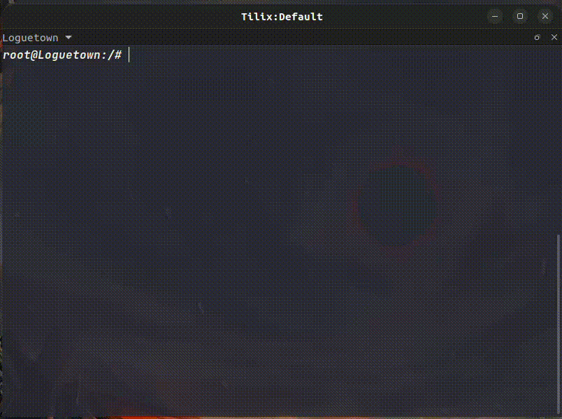


Try stopping the Nginx service on one of the workers, then test again.


#### Troubleshoting

- `502 Bad Gateway` - Ensure the PHP socket used in the server block matches the installed PHP version.

- `404 Not Found` - Ensure the PHP file location specified in the __root__ directive is correct.

- `403 Forbidden` - PEnsure the filename specified in the __index__ directive is correct.

- `service php7.2-fpm restart` - If  fails, try running service `service php7.2-fpm start`.

- `Default page Nginx` - To remove the default Nginx page, run `sudo rm /etc/nginx/sites-enabled/default` or unlink it with `unlink /etc/nginx/sites-enabled/default`, then restart Nginx. This often happens when trying to display a PHP page but still seeing the default Nginx page.

- Don't forget to restart the service when making changes to the configuration.

## I. Excercises
<!-- #### TBA -->
1. Download the practice questions page at https://github.com/arsitektur-jaringan-komputer/Modul-Jarkom/raw/master/Modul-2/Web%20server/page.zip (using wget)
2. Create a new domain with the name __jarkom.yyy.id__ to open the page.
3. Edit the word `yyy` in index.php with your group name.
4. Set it so that if you type in __jarkom.yyy.id__, the practice web can open with lynx.
### Notes
+ Then unzip the file. If an error appears like `unzip: command not found` then install unzip first using the `apt-get install unzip` command.
+ Make the unzipped directory of the file to _DocumentRoot_ web
+ For numbers 2, 3, and 4, '__yyy__' is filled with the name of the group. Example: __jarkom.E01.id__


## Don't hesitate to ask if you're still confused!
<p align="center">
	
</p>

<!-- 
	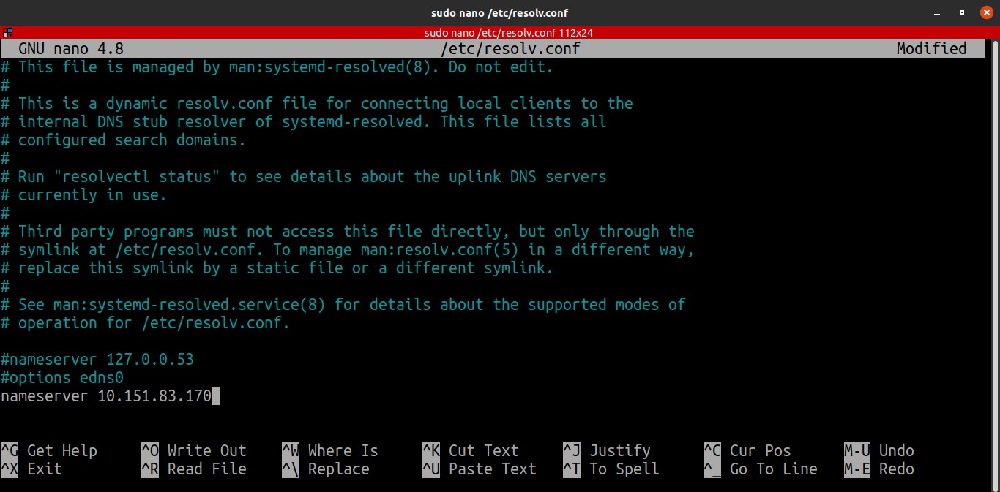
	
	
	
	
	
	
	
	
 -->
