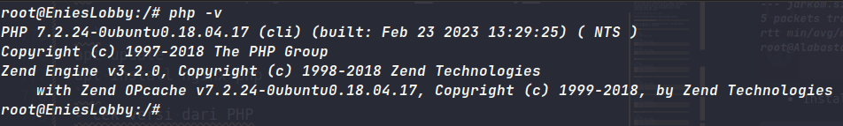

# Web Server

## Daftar Isi

- A. [Dasar Teori](#a-dasar-teori)
  - 1.[ Web Server](#1-web-server)
  - 2.[ Load Balancing](#2-load-balancing)
  - 3.[ Apache2 Web Server](#3-apache-web-server)
- B. [Instalasi Lynx](#b-instalasi-lynx)
- C. [Instalasi Web Server](#c-instalasi-web-server)
- D. [Instalasi PHP](#d-instalasi-php)
- E. [Mengenal Apache](#e-mengenal-apache)
- F. [Persyaratan Sebelum Melanjutkan ](#f-persyaratan-sebelum-melanjutkan)
- G. [Penting Untuk Dibaca](#g-penting-untuk-dibaca)
- H. [Konfigurasi Apache Sederhana](#h-konfigurasi-apache-sederhana)
  - A. [Penggunaan Sederhana](#a-penggunaan-sederhana)
  - B. [Membuat Konfigurasi Website Menggunakan Port 8080](#b-membuat-konfigurasi-website-menggunakan-port-8080)
- I. [Implementasi Apache Web Server](#i-implementasi-apache-web-server)
  - A. [Setting Domain pada Apache](#a-setting-domain-pada-apache)
  - B. [Directory Listing](#b-directory-listing)
  - C. [Directory Alias](#c-directory-alias)
  - D. [Module Rewrite](#d-module-rewrite)
- J. [Implementasi Nginx Web Server](#j-implementasi-nginx-web-server)

## A. Dasar Teori

### 1. Web Server

Terdapat dua pengertian dari web server. Secara _hardware_, web server berarti sebuah storage yang digunakan untuk menyimpan semua data dari aplikasi web (file HTML, CSS, JavaScript, dll.). Sedangkan secara _software_, web server adalah sebuah perangkat yang bertugas untuk menyediakan layanan akses menggunakan protokol HTTP atau HTTPS melalui aplikasi web.

### 2. Load Balancing

**_Load balancing_** adalah suatu mekanisme penyeimbangan beban yang bekerja dengan cara membagi beban pekerjaan. **_Load balancer_** adalah aplikasi atau alat yang bertugas untuk melakukan _load balancing_. _Load balancer_ dapat meggunakan berbagai macam algoritma _load balancing_ yang bertujuan untuk membagi beban pekerjaan seadil-adilnya. Arsitektur minimal untuk _load balancing_ adalah sebagai berikut


#### Kenapa dibutuhkan load balancing?

Untuk menangani banyaknya pengguna yang mengakses layanan pada satu waktu dan menjaga layanan tetap tersedia setiap saat, dibutuhkan lebih dari satu komputer untuk memasang layanannya. Dengan layanan yang tersedia di banyak server, dibutuhkan mekanisme pembagian beban untuk memberikan beban yang seimbang pada setiap server. Dengan meletakkan layanan pada beberapa server dan pembagian beban yang optimal, setiap permintaan pengguna bisa ditangani dengan efisien.

### 3. Apache2 Web Server

Apache HTTP Server atau biasa disebut Apache adalah sebuah software web server cross-platform dan open source yang banyak digunakan.

### 4. Nginx Web Server

**Nginx** (baca: engine-x) adalah perangkat lunak (software) yang bersifat open source yang memiliki banyak fungsi. Web server yang satu ini dikenal dengan performanya yang powerful dan memiliki banyak fitur canggih. Beberapa fungsi dari Nginx di antaranya adalah:

- Web server
- Load Balancing
- Reverse Proxy

## B. Instalasi Lynx

**Lynx** adalah salah satu web browser yang dapat digunakan pada command-line. Lynx dapat menampilkan _hypertext document_ dan menavigasi _link_ yang ada pada suatu halaman web dengan hanya menggunakan keyboard.

#### 1. Buka Node _Loguetown_

Lalu jalankan perintah

```
apt-get update
apt-get install lynx
```

jika muncul tulisan _"Do you want to continue? [Y/n]"_ input `Y` lalu tekan **_enter_**.

#### 2. Buka halaman google.com menggunakan lynx

Jalankan perintah

```
lynx google.com
```

Kalau ada pilihan seperti gambar di bawah ini, pilihlah sesuai keinginan.

<br/>
Kalau sudah terinstall dengan benar, akan muncul tampilan seperti di bawah ini.
<br/>


## C. Instalasi Web Server

### Menggunakan Apache

##### 1. Buka Node _Water7_

Lalu jalankan perintah

```
apt-get install apache2
```

jika muncul tulisan _"Do you want to continue? [Y/n]"_ input `Y` lalu tekan **_enter_**.


Apabila telah selesai melakukan instalasi Apache2, silakan jalankan perintah

```
service apache2 start
```

##### 2. Gunakan `lynx` untuk mengakses web.

Buka web **IP Water7** dengan `lynx` sampai muncul halaman Apache seperti di bawah ini.


### Menggunakan Nginx

##### 1. Buka Node Foosha

Lalu jalankan perintah

```bash
apt-get update
apt-get install nginx
```

jika muncul tulisan _"Do you want to continue? [Y/n]"_ input `Y` lalu tekan **_enter_**.

Apabila instalasi Nginx telah selesai, jangan lupa jalankan perintah berikut

```bash
service nginx start
```

Untuk mengecek status dari Nginx, bisa menggunakan perintah

```bash
service nginx status
```

##### 2. Gunakan `lynx` untuk mengakses web.

Buka web **IP Water7** dengan `lynx` sampai muncul halaman Nginx seperti di bawah ini.


## D. Instalasi PHP

#### 1. Buka Node Water7

Lalu jalankan perintah

```
apt-get install php
```

jika muncul tulisan _"Do you want to continue? [Y/n]"_ input `Y` lalu tekan **_enter_**.

#### 2. Test apakah php sudah ter-install

Jalankan perintah di bawah ini untuk memeriksa versi dari **php** kalian.

```
php -v
```

Bila _output_-nya mirip dengan yang di bawah ini, maka **php** kalian telah ter-_install_.


## E. Mengenal Apache

Web server Apache memiliki _directory_ berisi berbagai konfigurasi yang terletak di `/etc/apache2/`


Berikut beberapa hal yang penting untuk diketahui:

- File Konfigurasi di `/etc/apache2`

| **Nama File**       | **Kegunaan**                                                                        |
| ------------------- | ----------------------------------------------------------------------------------- |
| **apache2.conf**    | File konfigurasi utama apache2                                                      |
| **ports.conf**      | File konfigurasi port yang digunakan untuk web server                               |
| **sites-available** | _Directory_ tempat konfigurasi website (virtual host) yang tersedia                 |
| **sites-enabled**   | _Directory_ tempat konfigurasi website (virtual host) yang tersedia dan sudah aktif |
| **mods-available**  | _Directory_ tempat modul-moadul apache2 yang tersedia                               |
| **mods-enabled**    | _Directory_ tempat modul-moadul apache2 yang tersedia dan sudah aktif               |

- _Command_ yang sering digunakan

| **Command**   | **Kegunaan**                                                                     |
| ------------- | -------------------------------------------------------------------------------- |
| **a2ensite**  | Untuk mengaktifkan (_ENABLE_) konfigurasi website yang telah dibuat              |
| **a2dissite** | Untuk menonaktifkan (_DISABLE_) konfigurasi website yang sedang aktif            |
| **a2enmod**   | Untuk mengaktifkan (_ENABLE_) sebuah modul tertentu ke dalam konfigurasi apache2 |
| **a2dismod**  | Untuk menonaktifkan (_DISABLE_) sebuah modul tertentu dalam konfigurasi apache2  |

## F. Persyaratan Sebelum Melanjutkan

Record A dan PTR pada jarkom2022.com sudah harus mengarah ke IP Water7


<br/>


## G. Penting Untuk Dibaca

1. Pastikan semua Node dapat terhubung ke internet, baik dapat melakukan koneksi ke luar maupun dapat ping dari luar
2. Ketika mengalami kendala/error **cek syntax dan samakan seperti modul** terlebih dahulu. Besar kemungkinan masalah yang terjadi dikarenakan adanya kesalahan dalam pengetikan.

## H. Konfigurasi Apache Sederhana

### A. Penggunaan Sederhana

#### A.1. Pindah ke _directory_ `/etc/apache2/sites-available`

Gunakan perintah `cd /etc/apache2/sites-available`


Dapat dilihat di sana terdapat dua buah file:

- file **000-default.conf**, file konfigurasi website default apache untuk http.
- file **default-ssl.conf**, file konfigurasi website default apache untuk https.

**Catatan tambahan** :

Cek versi apache2 yang telah kalian install dengan menggunakan command : `apache2 -v`. Jika versi apache2 yang telah kalian install versi 2.4.x maka mengikuti sesuai modul. Jika versi apache yang telah kalian install versi 2.2.x maka mengikuti sesuai modul dengan catatan tambahan tertentu.

#### A.2. Buka file **_default_**

Untuk versi 2.4.x gunakan perintah `nano /etc/apache2/sites-available/000-default.conf`. Sedangkan untuk versi 2.2.x gunakan perintah `nano /etc/apache2/sites-available/default`

Untuk versi 2.4.x setiap configurasi file yang berada di directory `/etc/apache2/sites-available` nama file-nya ditambahi dengan `.conf`. Contoh : `/etc/apache2/sites-available/default.conf`. Karena jika tidak ditambahi dengan `.conf` maka akan error.


#### A.3. Pada file _default_ terdapat konfigurasi standar apache

Beberapa diantaranya adalah:

##### **Port** yang digunakan

```
<VirtualHost *:80>
```

Konfigurasi di atas menunjukkan bahwa port yang digunakan adalah port 80

##### **_Directory_** tempat file website kita berada

```
DocumentRoot /var/www/html
```

- Silakan mengubah _DocumentRoot_-nya menjadi `/var/www/html`
- Jangan lupa lakukan `service apache2 restart` setelah melakukan perubahan konfigurasi agar perubahan yang telah dilakukan teraplikasikan

#### A.4. Pindah ke _directory_ yang ditunjuk oleh _DocumentRoot_ pada file _default_

Gunakan perintah `cd /var/www/`

- Karena tadi kita mengubah _DocumentRoot_ di file _default_ menjadi `/var/www/html`, maka sekarang buatlah _directory_ bernama "html" dengan perintah `mkdir /var/www/html` apabila belum ada directorynya

#### A.5. Pindah ke _directory_ `/var/www/html` dan buat file _index.php_

Gunakan perintah `nano /var/www/html/index.php` dan isi file tersebut dengan

```
<?php
	phpinfo();
?>
```


#### A.6. Buka browser laptop/komputer masing-masing

Akses alamat menggunakan lynx **http://[IP Water7]/index.php**


- **Catatan**:
  Apabila tampilan web tidak muncul seperti gambar di atas dan hanya muncul plain text isi file index.php, silahkan install **libapache2-mod-php7.0** dengan menjalankan perintah
  ```
  apt-get install libapache2-mod-php7.0
  ```
  lalu restart apache dengan perintah
  ```
  service apache2 restart
  ```

### B. Membuat Konfigurasi Website Menggunakan Port 8080

#### B.1 Pindah ke _directory_ `/etc/apache2/sites-available`

Pindah ke _directory_ `/etc/apache2/sites-available` menggunakan perintah

```
cd /etc/apache2/sites-available
```

Copy file _000-default.conf_ menjadi file _000-default-8080.conf_ dengan perintah

```
cp 000-default.conf default-8080.conf
```

Jangan lupa untuk tidak menggunakan `.conf` jika apache2 versi 2.2.x. Jika sudah kalian bisa rename file tersebut menggunakan perintah

#### B.2 Buka file _default-8080.conf_

Buka file yang telah kalian buat pada sebelumnya. Gunakan perintah `nano /etc/apache2/sites-available/default-8080.conf`. Jangan lupa untuk tidak menambahkan `.conf` jika apache2 versi 2.2.x.

- Kemudian ubah port yang digunakan. Dimana awalnya port `80` menjadi port `8080`.
- Ubah juga _DocumentRoot_ yang awalnya `/var/www/html` menjadi `/var/www/web-8080`.


#### B.3 Tambahkan _port 8080_ pada file `ports.conf`

File **ports.conf** berada pada _directory_ `/etc/apache2`

Cara menambahkan port yang perlu didengar adalah dengan menuliskan

```
Listen 8080
```


#### B.4 Aktifkan konfigurasi _default-8080.conf_

Untuk mengaktifkan suatu konfigurasi, kita menggunakan perintah `a2ensite` diikuti dengan **nama file konfigurasi** yang telah dibuat.
Dalam kasus ini perintah yang dijalankan adalah

```
a2ensite default-8080.conf
```


#### B.5 Restart apache

Gunakan perintah `service apache2 restart`


#### B.6 Pindah ke _directory_ `/var/www`

Buatlah sebuah _directory_ baru di dalam `var/www` dengan nama **web-8080**


#### B.7 Masuk ke _directory_ `/var/www/web-8080` dan buat file _index.php_

Isi file **index.php** tersebut dengan

```
<?php
    echo "Halo, saya berlari di port 8080";
?>
```


#### B.8 Buka browser laptop/komputer masing-masing

Akses alamat **http://[IP Water7]:8080**


## I. Implementasi Apache Web Server

### A. Setting Domain pada Apache

Fulan dan Poyoyo adalah satu kelompok dalam mata kuliah Jaringan Komputer. Mereka diperintahkan oleh asisten untuk membuat website dengan domain **jarkom2022.com**, dan diberikan akses ke server yang bisa digunakan sebagai tempat host untuk websitenya. Tapi karena sesuatu dan lain hal, Poyoyo tidak bisa membantumu mengerjakan perintah dari asisten. Beruntungnya, Poyoyo meninggalkan catatan untuk Fulan ikuti agar Fulan dapat menyelesaikan perintah dari asisten.

Ayo bantu Fulan dengan mengonfigurasi server sesuai petunjuk yang diberikan Poyoyo:

#### A.1 Pindah ke _directory_ `/etc/apache2/sites-available`

Copy file **000-default.conf** menjadi file **jarkom2022.com**. Jangan lupa untuk tidak menambahkan `.conf` jika apache2 versi 2.2.x


#### A.2 Buka file _jarkom2022.com_

- Tambahkan

```
ServerName jarkom2022.com
ServerAlias www.jarkom2022.com
```

    Menurut [dokumentasi apache2.4](https://httpd.apache.org/docs/2.2/mod/core.html):
    + `ServerName` adalah "_Hostname and port that the server uses to identify itself_"
    + `ServerAlias` adalah "_Alternate names for a host used when matching requests to name-virtual host_"

- Ubah _DocumentRoot_ menjadi `/var/www/jarkom2022.com`


#### A.3 Aktifkan konfigurasi _jarkom2022.com_

Gunakan perintah `a2ensite jarkom2022.com`

#### A.4 Restart apache

Gunakan perintah `service apache2 restart`


#### A.5 Pindah ke _directory_ `/var/www`

Kemudian buatlah sebuah _directory_ baru di dalam `/var/www` dengan nama **jarkom2022.com**


#### A.6 Masuk ke _directory_ `/var/www/jarkom2022.com` dan buat file _index.php_

Isi file **index.php** tersebut dengan

```
<?php
    echo "Water7 adalah kota di One Piece...";
?>
```


#### A.7 Buka _jarkom2022.com_ menggunakan _lynx_


### B. Directory Listing

Di dalam _directory_ `/var/www/jarkom2022.com` diberikan struktur _directory_ sebagai berikut.

```
/var/www/jarkom2022.com/
├── assets/
│   └── javascript/
├── data/
└── download/
    └── img/
```

Perintah berikutnya dari asisten adalah untuk membuat beberapa direktori, **/assets**, **/data**, dan **/download**. Direktori **/download** harus dapat menampilkan daftar file yang ada dalam direktori tersebut, sedangkan direktori **/assets** tidak boleh menampilkan isi direktori tersebut.

Ayo bantu Fulan yang kebingunan membaca penjelasan dari Poyoyo agar dapat mengerjakan perintah asisten.

#### B.1 Buat _directory-directory_ yang diperlukan oleh website jarkom2022.com milik Waffle

Gunakan perintah-perintah berikut ini:

```
mkdir /var/www/jarkom2022.com/data
mkdir /var/www/jarkom2022.com/download
mkdir /var/www/jarkom2022.com/download/img
mkdir /var/www/jarkom2022.com/assets
mkdir /var/www/jarkom2022.com/assets/javascript
```


#### B.2 Aktifkan Directory Listing untuk /download

- Pindah ke _directory_ `/etc/apache2/sites-available` kemudian buka file **_jarkom2022.com_** dan tambahkan

```
<Directory /var/www/jarkom2022.com/download>
	Options +Indexes
</Directory>
```

    jangan lupa untuk menyimpan perubahan tersebut agar _directory_  ___download___ menampilkan isi _directory_-nya.

    

- Restart apache dengan perintah `service apache2 restart`
- Buka browser dan akses http://jarkom2022.com/download


**Keterangan**:
Untuk mengatur _directory_ pada sebuah web, menggunakan

```
<Directory /x> ... </Directory>
```

Contoh untuk mengatur `/var/www/jarkom2022.com/download`

```
<Directory /var/www/jarkom2022.com/download>

</Directory>
```

#### B.3 Matikan Directory Listing untuk /assets

- Pindah ke _directory_ `/etc/apache2/sites-available` kemudian buka file **_jarkom2022.com_** dan tambahkan

```
<Directory /var/www/jarkom2022.com/assets>
	Options -Indexes
</Directory>
```

    jangan lupa untuk menyimpan perubahan tersebut agar _directory_  ___assets___ tidak menampilkan isi _directory_-nya.

    

- Restart apache dengan perintah `service apache2 restart`
- Buka browser dan akses http://jarkom2022.com/assets


### C. Directory Alias

Karena URL **http://[IP Water7]/assets/javascript** dirasa terlalu panjang, maka Fulan mencoba membuat _directory alias_ menjadi **http://[IP Water7]/assets/js** agar lebih terlihat _simple_.

Berikut adalah langkah-langkah pengerjaan yang diberikan Poyoyo:

- Pindah ke _directory_ `/etc/apache2/sites-available` kemudian buka file **_jarkom2022.com_** dan tambahkan

```
<Directory /var/www/jarkom2022.com/assets/javascript>
	Options +Indexes
</Directory>

Alias "/assets/js" "/var/www/jarkom2022.com/assets/javascript"
```

    jangan lupa untuk menyimpan perubahan tersebut agar _directory_  ___assets/javascript___ dapat menampilkan isi _directory_-nya saat pengguna mengakses __http://[IP Water7]/assets/js__.

    

- Restart apache dengan perintah `service apache2 restart`
- Pindah ke folder **/var/www/jarkom2022.com/assets/javascript** dan buat file **app.js** dengan perintah `touch app.js`
- Buka browser dan akses http://jarkom2022.com/assets/js


### D. Module Rewrite

#### D.1 Aktifkan Module Rewrite

Perintah asisten berikutnya adalah menyalakan _module rewrite_ agar penulisan URL menjadi lebih rapi dan tanpa perlu menuliskan ekstensi _.php_ ketika mengakses laman.

- Jalankan perintah `a2enmod rewrite` untuk mengaktifkan _module rewrite_.

- Restart apache dengan perintah `service apache2 restart`


Biasanya semua konfigurasi terhadap sebuah website diatur pada file di _directory_ **/etc/apache2/sites-available**. Namun terkadang ada sebuah kasus bahwa hak akses root untuk mengedit file konfigurasi yang berada di folder **/etc/apache2/sites-available** tidak dimiliki, atau kita tidak ingin user lain untuk mengedit file konfigurasi yang berada di _directory_ **/etc/apache2/sites-available**.

Untuk mengatasi masalah tersebut, buat file **.htaccess** pada _directory_ yang akan diatur.

Contohnya adalah seperti kasus di atas, dimana kita ingin mengatur _mod rewrite_ dari **[http://jarkom2022.com](http://jarkom2022.com)** agar saat mengakses file php kita tidak perlu menuliskan ekstensinya. Maka yang yang perlu kita lakukan adalah

- Pindah ke _directory_ `/var/www/jarkom2022.com` dan buat file **.htaccess** dengan isi file

```
RewriteEngine On
RewriteCond %{REQUEST_FILENAME} !-d
RewriteRule ^([^\.]+)$ $1.php [NC,L]
```

    

    __Keterangan__:
    + `RewriteEngine On` = untuk flag bahwa menggunakan module rewrite
    + `RewriteCond %{REQUEST_FILENAME} !-d` = aturan tidak akan jalan ketika yang diakses adalah _directory_ (d)
    + `RewriteRule ^([^\.]+)$ $1.php [NC,L]` = $1 adalah parameter input yang akan dicari oleh webserver
    * Lebih detailnya [klik disini](https://httpd.apache.org/docs/2.4/rewrite/flags.html)

- Buat file _about.php_ di dalam _directory_ `/var/www/jarkom2022.com/` dengan isi

```
<?php
	echo "Ini adalah halaman About";
?>
```

- Pindah ke _directory_ `/etc/apache2/sites-available` kemudian buka file **_jarkom2022.com_** dan tambahkan

  ```
  <Directory /var/www/jarkom2022.com>
      Options +FollowSymLinks -Multiviews
      AllowOverride All
  </Directory>
  ```

  dan jangan lupa untuk menyimpan perubahan tersebut.

  

  **Keterangan**:

  - `AllowOverride All` ditambahkan agar konfigurasi **.htaccess** dapat berjalan.
  - `+FollowSymLinks` ditambahkan agar konfigurasi **mod_rewrite** dapat berjalan.
  - `-Multiviews` ditambahkan agar konfigurasi **mod_negotiation** tidak dapat berjalan. **mod_negotiation** bisa '_rewrite_' _requests_ sehingga menimpa dan mengganggu **mod_rewrite**.

- Restart apache dengan perintah `service apache2 restart`
- Buka browser dan akses **http://jarkom2022.com/about**


## J. Implementasi Nginx Web Server

Buatlah topologi sederhana seperti gambar dibawah


Setup IP Address di masing-masing nodes, pastikan setiap nodes terhubung ke internet

- Foosha

  ```bash
  auto eth0
  iface eth0 inet dhcp

  auto eth1
  iface eth1 inet static
  	address [Prefix IP].1.1
  	netmask 255.255.255.0

  auto eth2
  iface eth2 inet static
  	address [Prefix IP].2.1
  	netmask 255.255.255.0
  ```

- Loguetown

```bash
auto eth0
iface eth0 inet static
	address [Prefix IP].1.2
	netmask 255.255.255.0
	gateway [Prefix IP].1.1
```

- Alabasta

```bash
auto eth0
iface eth0 inet static
	address [Prefix IP].1.3
	netmask 255.255.255.0
	gateway [Prefix IP].1.1
```

- Dressrosa

```bash
auto eth0
iface eth0 inet static
	address [Prefix IP].2.2
	netmask 255.255.255.0
	gateway [Prefix IP].2.1
```

- Enieslobby

```bash
auto eth0
iface eth0 inet static
	address [Prefix IP].2.3
	netmask 255.255.255.0
	gateway [Prefix IP].2.1
```

- Water7

```bash
auto eth0
iface eth0 inet static
	address [Prefix IP].2.4
	netmask 255.255.255.0
	gateway [Prefix IP].2.1
```

#### Dressrosa (DNS Server)

- instal Bind9 dan Nginx di Dressrosa:

```bash
apt-get update
apt-get install bind9 nginx
```

- kemudian buat domain sederhana seperti contoh di submodul sebelumnya, pada topologi kali ini kita akan menggunakan `jarkom.site` sebagai domain utama.

- isi dari file **named.conf.local**

```bash
//
// Do any local configuration here
//

// Consider adding the 1918 zones here, if they are not used in your
// organization
//include "/etc/bind/zones.rfc1918";


zone "jarkom.site" {
		type master;
		file "/etc/bind/jarkom/jarkom.site";
};

zone "2.168.192.in-addr.arpa" {
	type master;
	file "/etc/bind/jarkom/2.168.192.in-addr.arpa";
};
```

- isi dari file **jarkom.site**

```bash
;
; BIND data file for local loopback interface
;
$TTL    604800
@       IN      SOA     jarkom.site. root.jarkom.site. (
				2         ; Serial
				604800    ; Refresh
				86400     ; Retry
				2419200   ; Expire
				604800 )  ; Negative Cache TTL
;
@       IN      NS      jarkom.site.
@       IN      A       192.168.2.2
```

- isi dari file **2.168.192.in-addr.arpa**

```bash
;
; BIND data file for local loopback interface
;
$TTL    604800
@       IN      SOA     jarkom.site. root.jarkom.site. (
				2         ; Serial
				604800    ; Refresh
				86400     ; Retry
				2419200   ; Expire
				604800 )  ; Negative Cache TTL
;
2.168.192.in-addr.arpa.         IN      NS      jarkom.site.
2                               IN      PTR     jarkom.site.
```

- lakukan pengujian untuk domain yang telah dibuat, dari `Alabasta`


#### EniesLobby (Nginx worker)

- install lalu setup Nginx dan PHP

```bash
apt-get update && apt install nginx php php-fpm -y
```

- cek versi dari PHP

```bash
php -v
```

    

- buat direktori baru di `/var/www`, dengan nama `jarkom`

```bash
mkdir /var/www/jarkom
```

- masuk direktori `jarkom` lalu buat file `index.php`

```php
<?php
echo "Halo, Kamu berada di EniesLobby";
?>
```

- selanjutnya kita akan melakukan konfigurasi pada Nginx, pertama masuk ke direktori `/etc/nginx/sites-available` lalu buat file baru dengan nama `jarkom`

```
nano jarkom

atau

touch jarkom
```

- kemudian isi dengan konfigurasi server block ini:

```bash
server {

	listen 80;

	root /var/www/jarkom;

	index index.php index.html index.htm;
	server_name _;

	location / {
			try_files $uri $uri/ /index.php?$query_string;
	}

	# pass PHP scripts to FastCGI server
	location ~ \.php$ {
	include snippets/fastcgi-php.conf;
	fastcgi_pass unix:/var/run/php/php7.2-fpm.sock;
	}

location ~ /\.ht {
			deny all;
	}

	error_log /var/log/nginx/jarkom_error.log;
	access_log /var/log/nginx/jarkom_access.log;
}
```

- lalu simpan, kemudian buat `symlink`

```bash
ln -s /etc/nginx/sites-available/jarkom /etc/nginx/sites-enabled
```

- terakhir restart Nginx

```bash
service nginx restart

atau

nginx -s reload
```

- jika mengecek apakah konfigurasi yang dibuat sudah benar atau belum, bisa mengunakan perintah berikut

```bash
nginx -t
```

    

#### Water7 (Nginx worker)

- lakukan hal yang sama seperti di node EniesLobby, namun bedakan pada konfigurasi `index.php` nya agar memudahkan pada saat pengujian

```php
<?php
echo "Halo, Kamu berada di Water7";
?>
```

#### Penjelasan

##### Server Block:

- `listen` mendefinisikan di port berapa nantinya Nginx berjalan.

- `root` menjunjukan letak direktori dari file web yang digunakan.

- `index` menentukan urutan file indeks yang akan dicoba oleh server ketika ada permintaan masuk.

- `server_name` menentukan nama server. Tanda garis bawah \_ adalah penanda bahwa server akan menanggapi permintaan untuk semua nama server yang tidak cocok dengan nama server lain. Nama server bisa diganti dengan IP Address, nama domain, localhost, dll.

- `location { ... }` Konfigurasi untuk menangani permintaan ke akar situs. **try_files** mencoba mencari file yang sesuai dengan **$uri**, kemudian **$uri/**, dan jika itu juga tidak ditemukan, akan mengarahkan ke index.php dengan menggunakan **data query string**.

- `location ~ \.php$` konfigurasi untuk menangani file PHP. Lokasi ini akan mencocokkan ekstensi .php pada URL dan akan memprosesnya dengan menggunakan FastCGI dan mengarahkannya ke socket FastCGI PHP. Untuk penggunaan PHP Socket perlu disesuaikan dengan versi PHP yang diinstall, dalam case ini kita menggunakan PHP7.2.

- `location ~ /\.ht` mengatur bahwa akses ke file .ht (seperti .htaccess) akan ditolak. Ini adalah langkah keamanan yang umum digunakan untuk mencegah akses ke file sensitif.

- `error_log` mengarahkan log error ke file tertentu.

- `access_log` mengarahkan log akses ke file tertenu.

- `ln -s /etc/nginx/sites-available/jarkom /etc/nginx/sites-enabled` adalah perintah untuk membuat symlink (link simbolik) dari file konfigurasi Nginx yang berada di direktori /etc/nginx/sites-available ke direktori /etc/nginx/sites-enabled.

#### Dressrosa (Load Balancer)

- kembali lagi ke node Dressrosa, kemudian buat file baru di direktori `/etc/nginx/sites-available` dengan nama `lb-jarkom`

```bash
# Default menggunakan Round Robin
upstream myweb  {
	server 192.168.2.3; #IP EniesLobby
	server 192.168.2.4; #IP Water7
}

server {
	listen 80;
	server_name jarkom.site;

	location / {
	proxy_pass http://myweb;
	}
}
```

- lalu simpan lalu buat `symlink`

```bash
ln -s /etc/nginx/sites-available/lb-jarkom /etc/nginx/sites-enabled
```

#### Penjelasan

- `upstream` - mendefinisikan grup atau kelompok server yang akan menerima lalu lintas atau beban dengan **myweb** sebagai nama upstream. Dalam kasus ini, ada dua server dengan alamat IP masing-masing 192.168.2.3 dan 192.168.2.4. Dengan metode Round Robin, lalu lintas akan dibagi secara setara antara kedua server ini.

- `listen` - mendefinisikan bahwa web server ini akan berjalan dan mendengarkan permintaan (request) pada port 80.

- `location / { ... }` mengatur cara server Nginx menangani permintaan. Dalam hal ini, semua permintaan akan diteruskan ke grup server yang telah didefinisikan di bagian **upstream**.

#### Pengujian

Masuk ke Loguetwon atau Alabasta lalu jalankan perintah **lynx http://jarkom.site**.

```bash
lynx http://jarkom.site
```


Coba untuk stop service Nginx di salah satu worker, lalu lakukan pengujian lagi.


#### Troubleshoting

- `502 Bad Gateway` - Pastikan socket PHP yang digunakan pada server block sudah sesuai dengan versi PHP yang diinstal.

- `404 Not Found` - Pastikan kembali lokasi dari file PHP di **root** sudah benar atau belum.

- `403 Forbidden` - Pastikan nama file yang ingin dipanggil dibagian **index** sudah benar.

- `service php7.2-fpm restart` - Tapi statusnya masih fail, coba dijalankan dulu dengan perintah `service php7.2-fpm start`.

- `Default page Nginx` - Jika ingin menghilangkan default page dari Nginx, jalan perintah `sudo rm -rf /etc/nginx/sites-enabled/default` lalu restart Nginx. Sering terjadi ketika ingin menampilkan halaman dari PHP, tapi yang muncul masih default page Nginx.

- Jangan lupa melakukan restart, ketika ada perubahan pada konfigurasi.

## K. Latihan

<!-- #### TBA -->

1. Download halaman soal latihan di https://github.com/arsitektur-jaringan-komputer/Modul-Jarkom/raw/master/Modul-2/Web%20server/page.zip (Gunakan wget)
2. Buat domain baru dengan nama **jarkom.yyy.id** untuk membuka halaman tersebut.
3. Edit kata `yyy` yang ada di index.php dengan 3 digit terakhir NRP kalian.
4. Atur agar jika kalian mengetikkan **jarkom.yyy.id**, Web latihan dapat terbuka dengan lynx.
5. Cobalah menggunakan algoritma load balancing selain Roundrobin (Least-Conn, IP Hash & Generic Hash)
6. Cobalah untuk menggunakan web server Apache2 di node selain LB.

### Catatan

- Kemudian unzip file tersebut. Jika muncul error seperti `unzip: command not found` maka install unzip terlebih dahulu menggunakan command `apt-get install unzip`.
- Buat directory hasil unzip file tersebut menjadi _DocumentRoot_ web
- Untuk nomor 2, 3, dan 4, '**yyy**' diisi dengan 3 digit terakhir NRP. Contoh: **jarkom.123.id**

## Jangan ragu bertanya kalau ada yang masih bingung!

<p align="center">
	
</p>

<!--
	
	
	
	
	
	
	
	
	
 -->
