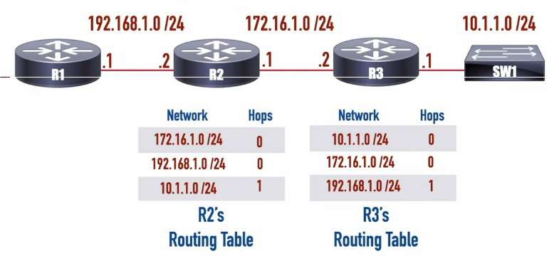
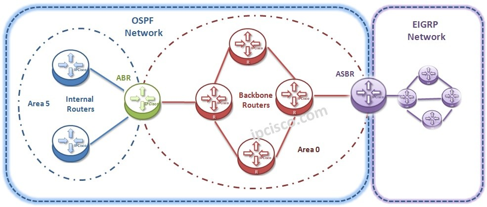
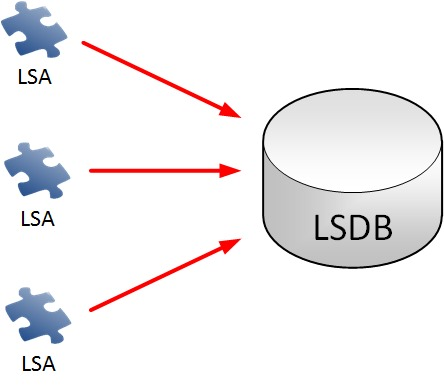
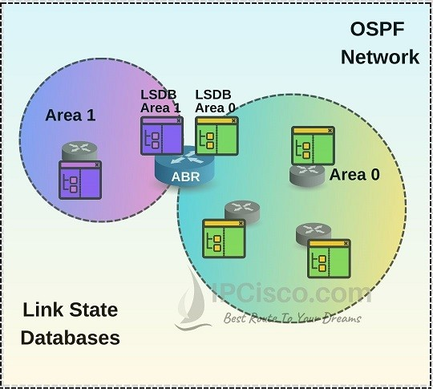
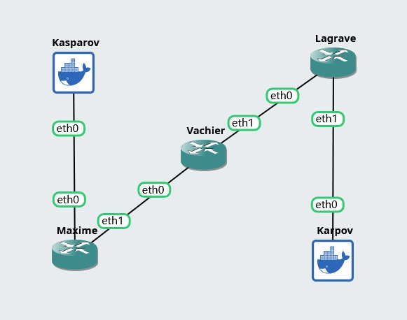
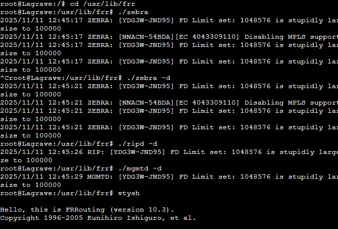
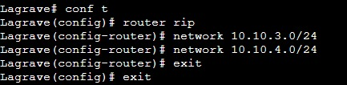
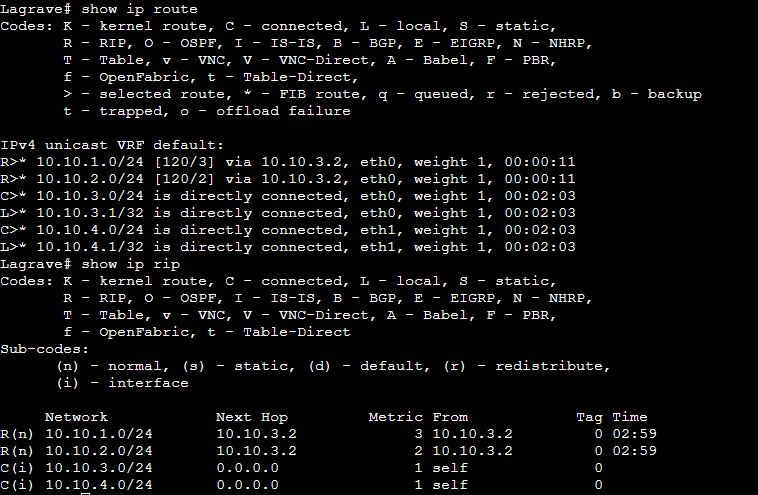
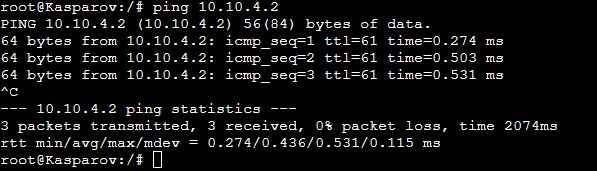

# DYNAMIC ROUTING

- [A. Pengenalan](#a-pengenalan)
  - [Definisi](#definisi)
  - [Tujuan](#tujuan)
- [B. Pembagian](#b-pembagian)
  - [Algoritma](#algoritma)
    - [1. Distance Vector](#1-distance-vector)
    - [2. Link State](#2-link-state)
  - [Batasan](#batasan)
    - [1. IGP](#1-igp)
    - [2. EGP](#2-egp)
- [C. Protokol](#c-protokol)
  - [RIP](#rip)
    - [Route Poisoning](#route-poisoning)
    - [Poison Reverse](#poison-reverse)
    - [Split Horizon](#split-horizon)
  - [OSPF](#ospf)
    - [LSA dan LSDB](#lsa-dan-lsdb)
    - [Area]
    - [Packet]
- [D. Implementasi](#d-implementasi)

## A. Pengenalan

### Definisi

Pada modul sebelumnya, kita sudah membahas mengenai routing, cara kerja, serta fungsinya. Tak hanya itu, kita juga telah membahas salah satu jenis routing berdasarkan cara _Router_ mendapatkan informasi terkait _Routing Table_-nya, yaitu Static Routing. Di modul ini, kita akan membahas sekilas mengenai jenis yang kedua, yaitu **Dynamic Routing**.

Pada Dynamic Routing, _Router_ akan mendapatkan informasi mengenai jaringan dari komunikasi dengan _Router_ lainnya. Hal ini tentu akan memudahkan _network administrator_ dalam melakukan konfigurasi _routing_ pada jaringan yang besar. Selain itu, sifatnya yang adaptif membuat perubahan topologi dalam jaringan bukan lagi suatu masalah yang besar, karena _Router_ akan menyesuaikan dan membuat jalur komunikasi yang baru (bila ada). Namun berbeda dengan Static Routing, pada Dynamic Routing terdapat protokol-protokol berbeda yang menentukan cara komunikasi antar-_Router_ dengan kelebihan dan kekurangannya masing-masing. Pada modul ini, kita hanya akan menyinggung 2 protokol yang sering digunakan, yaitu **RIP** dan **OSPF**.

### Tujuan

Jika dibandingkan dengan Static Routing, penggunaan Dynamic Routing lebih tepat diterapkan pada jaringan berskala besar karena memiliki beberapa keunggulan berikut:

1. Router hanya perlu mengetahui dan mengenalkan jaringan yang terhubung langsung dengannya.
2. Tidak perlu mengonfigurasi atau mengetahui seluruh jaringan yang ada secara manual.
3. Ketika terdapat penambahan atau perubahan jaringan, hanya router yang terkait langsung yang akan memperbarui tabel routing-nya secara otomatis. Sehingga, tidak perlu ada konfigurasi ulang di seluruh jaringan.

## B. Pembagian

Tidak seperti Static Routing, protokol-protokol yang ada di dalam Dynamic Routing dapat dikategorikan ke dalam beberapa tipe berdasarkan algoritma yang digunakan serta cakupan wilayah penggunaannya.

### Algoritma

Berdasarkan algoritma yang digunakan untuk menentukan jalur yang akan digunakan oleh semua packet yang melewatinya, terdapat 2 kategori yaitu **Distance Vector Routing** dan **Link State Routing**.

#### 1. Distance Vector

Pada algoritma Distance Vector, seluruh router tidak perlu mengetahui keadaan seluruh topologi jaringan, namun cukup mengetahui tetangganya. Untuk meraih suatu segmen jaringan, router cukup mengetahui jarak (**Distance**) dan arah (**Vector**) menuju jaringan tujuan berdasarkan informasi routing table dari router tetangganya. Router akan bertukar informasi ini secara berkala dan melakukan update pada routing tablenya. Umumnya, algoritma **Bellman-Ford** akan digunakan di teknik ini. Contoh protokol yang tergolong Distance Vector Routing adalah **RIP** dan **IGRP**.

Distance Vector memiliki beberapa ciri-ciri, diantaranya adalah:

1. Router tidak mengetahui keadaan seluruh topologi
2. Traffic pada topologi akan cenderung lebih sedikit karena informasi routing yang dibagikan tidak banyak.
3. Router akan tidak banyak menggunakan sumber daya (RAM/CPU)
4. Konvergensi terjadi cukup lambat

> Protokol yang ada pada kategori ini cukup sederhana, namun memiliki beberapa potensi masalah seperti **Count to Infinity Problem**

#### 2. Link State

Tidak seperti Distance Vector, router pada Link State akan mengetahui informasi mengenai seluruh topologi. Semua router akan berbagi informasi mengenai topologi pada semua router menggunakan **Link-State Advertisement (LSA)**, sehingga semua router akan memiliki informasi yang sama. Setelah itu, masing-masing router akan membuat **Link-State Database (LDSB)** dan menggunakan algoritma **Dijkstra** untuk menentukan jalur packet. Contoh protokol yang tergolong pada kategori ini adalah **OSPF** dan **IS-IS**.

Link State Routing memiliki beberapa karakteristik, yaitu:

1. Setiap router akan memiliki informasi mengenai seluruh topologi
2. Traffic pada jaringan cenderung banyak dan berat
3. Router akan menggunakan sumber daya yang lebih banyak
4. Konvergensi terjadi lebih cepat daripada menggunakan Distance Vector

### Batasan

Tidak hanya algoritma, protokol routing juga bisa dibedakan berdasarkan batasan wilayah mereka beroperasi menjadi 2, yaitu **Interior Gateway Protocol (IGP)** dan **Exterior Gateway Protocol (EGP)**. Namun sebelum mengenal lebih jauh dengan mereka, kita akan membahas sedikit mengenai Autonomous System.

**Autonomous System (AS)** adalah suatu jaringan yang berada dalam kendali organisasi yang sama dengan menggunakan protokol routing yang jelas. Contohnya adalah kumpulan host/jaringan dengan ISP yang sama atau pada universitas/perusahaan yang sama.

#### 1. IGP

Interior Gateway Protocol atau biasa dikenal sebagai IGP adalah kumpulan protokol yang mengatur bagaimana router pada AS yang sama berkomunikasi. Dengan kata lain, protokol-protokol pada IGP digunakan oleh router untuk berkomunikasi dengan router lain pada Autonomous System yang sama. Contoh protokol-protokol yang merupakan IGP adalah **RIP**, **IGRP**, **OSPF**, dan **IS-IS**.

#### 2. EGP

Exterior Gateway Protocol (EGP) adalah protokol-protokol yang mengatur bagaimana router berkomunikasi pada AS yang berbeda. Protokol-protokol inilah yang digunakan untuk komunikasi antar organisasi besar ataupun ISP di internet. Meskipun ini adalah kategori, dalam prakteknya hanya ada satu protokol EGP yang umum digunakan, yaitu **BGP** atau **Border Gateway Protocol**.

## C. Protokol

Setelah mengetahui beberapa kategori protokol pada Dynamic Routing, kita akan membahas 2 diantaranya yang umum digunakan, yaitu **RIP** dan **OSPF**.

### RIP

**Routing Information Protocol (RIP)** merupakan salah satu protokol dynamic routing yang cukup tua dan masuk ke dalam kategori Distance Vector Routing. Di protokol ini, router akan berbagi informasi mengenai routing table-nya ke seluruh router yang terhubung secara langsung dengannya. Di dalam routing table, terdapat informasi mengenai cara meraih suatu subnet, interface yang digunakan, serta **hop count**, yaitu metrik yang menunjukkan berapa router atau _hops_ yang harus ditempuh sebelum sampai ke subnet tujuan. **Hop count** ini menjadi jantung dari RIP karena router akan menentukan jalur yang ditempuh suatu packet berdasarkan hop count nya.

Agar lebih mudah, mari kita menggunakan gambar topologi sederhana berikut ini



Dari sudut pandang R2, subnet 172.16.1.0/24 dan 192.168.1.0/24 terhubung langsung dengannya, maka dari itu hop count nya bernilai 0 (karena tidak perlu ada _hop_ atau router lagi di tengah-tengahnya). Begitu pula dengan R3, karena subnet 10.1.1.0/24 dan 172.16.1.0/24 terhubung langsung dengannya, maka hop count nya akan bernilai 0. Kemudian, pada interval yang ditentukan (umumnya setiap 30 detik), R2 dan R3 akan berbagi informasi mengenai routing table masing-masing.

R2 melihat bahwa di dalam routing table R3, terdapat informasi bahwa R3 bisa meraih subnet 10.1.1.0/24 dengan 0 hop. Kemudian, R2 menyimpulkan bahwa dia juga bisa meraih subnet 10.1.1.0/24 dalam 0+1 hop, karena harus melalui R3 terlebih dahulu. Sehingga, R2 menambahkan entri baru di routing tablenya yang menyatakan bahwa dia bisa meraih subnet 10.1.1.0/24 dalam 1 hop. Hal yang sama terjadi pada R3 dengan subnet 192.168.1.0/24.

Pada interval selanjutnya, router berbagi informasi lagi. Sekarang, kita akan mengambil contoh interaksi antara R2 dan R1. R1 melihat routing table R2, ternyata terdapat informasi bahwa R2 bisa meraih subnet 10.1.1.0/24 dalam 1 hop. R1 membuat kesimpulan yang sama, yaitu bahwa dia bisa meraih subnet 10.1.1.0/24 dalam 1+1 hop (karena harus melalui R2).

Namun, protokol ini memiliki batasan, yaitu hop count maksimal yang dimiliki oleh suatu router adalah 15. Apabila terdapat subnet yang memiliki hop count lebih dari itu, maka subnet tersebut dianggap _unreachable_. Hal ini dilakukan untuk mencegah terjadinya _infinite routing loop_.

Selain itu, apabila terdapat masalah pada suatu link/hubungan dengan suatu subnet, maka propagasi atau informasi mengenai gangguan ini bisa cenderung lambat untuk diketahui oleh seluruh router. Tak hanya itu, ada potensi untuk terjadinya **Count to Infinity Problem**, dimana router akan berbagi informasi salah mengenai subnet yang bermasalah dan menambah hop count nya sampai maksimal.

Sebagai contoh, apabila sambungan antara R3 dan 10.1.1.0/24 terputus, maka R3 akan menandai bahwa jaringan tersebut _unreachable_. Namun, sebelum R3 sempat membagikan informasi ini, dia bisa mendapat informasi dari R2 bahwa R2 bisa meraih 10.1.1.0/24 dalam 1 hop (Karena itu ada di dalam routing table-nya). R3 senang mendengar hal ini dan mengubah entri di routing tablenya, sehingga dia berasumsi bahwa dia bisa meraih subnet 10.1.1.0/24 dalam 1+1 hop via R2.

Pada interval selanjutnya, R3 akan menyebarkan informasi palsu ini ke R2, sehingga R2 berpikir bahwa dia bisa meraih subnet 10.1.1.0/24 via B dalam 2+1 hop. Siklus ini akan berlangsung sampai entri menjadi _unreachable_. Maka dari itu, diterapkan beberapa teknik untuk memitigasi hal ini.

#### Route Poisoning

Ketika ada _link_ atau sambungan yang gagal, maka router yang terhubung langsung harus menyebarkan berita buruk ini secara langsung kepada tetangganya dengan cara menandai bahwa subnet yang terputus tersebut bisa diraih dalam 15+1 hop. Maka dari itu, router-router tetangga akan segera mengetahui bahwa subnet tersebut _unreachable_. Pada topologi di atas, ketika sambungan antara R3 dan 10.1.1.0/24 gagal, maka R3 akan secara langsung memberi informasi kepada R2 bahwa 10.1.1.0/24 _reachable_ via R3 dalam 15+1 hop. R2 akan paham dengan informasi ini dan menandai bahwa subnet 10.1.1.0/24 sekarang _unreachable_ via R3.

#### Split Horizon

Berbeda dengan Route Poisoning yang terjadi ketika ada sambungan yang gagal, Split Horizon merupakan mekanisme untuk menghindari looping. Cara kerjanya cukup sederhana, yaitu jangan membagikan informasi mengenai cara meraih suatu subnet kembali ke router asal kamu mempelajarinya. Dengan kata lain, apabila router A mendapat informasi cara meraih subnet X melalui router B, maka jangan memberikan informasi ini lagi (yaitu informasi cara meraih subnet X) ke router B lagi, karena tidak masuk akal (router B sudah bisa meraih X secara langsung tanpa perlu ke A).

#### Poison Reverse

Poison Reverse merupakan teknik yang mirip dengan Split Horizon, yaitu mekanisme untuk mencegah looping. Namun berbeda dengan Split Horizon yang lebih "sunyi" (karena router tidak memberi informasi kembali), Poison Reverse bekerja dengan lebih eksplisit sehingga banyak yang beranggapan bahwa Split Horizon dengan Poison Reverse lebih aman daripada Split Horizon saja. Cara kerjanya juga mirip, yaitu bagikan informasi kembali mengenai cara meraih suatu subnet ke router asal kamu mempelajarinya, namun tandai bahwa subnet tersebut bisa diraih dalam 15+1 hop. Dengan kata lain, apabila router A mendapat informasi cara meraih subnet X melalui router B, maka A akan memberi tahu bahwa router B bisa meraih subnet X melalui router A dalam 15+1 hop. Maka dari itu, router B akan menganggap bahwa subnet X _unreachable_ via A. \

> Bila merujuk pada topologi di atas, router A bisa dimisalkan R2, router B bisa dimisalkan R3, dan X bisa dimisalkan subnet 10.1.1.0/24.

### OSPF



**Open Shortest Path First** atau yang biasa dikenal dengan **OSPF** adalah suatu protokol routing link-state yang bertujuan untuk melakukan routing dan menentukan jalur terbaik yang ditempuh suatu packet di dalam suatu Autonomous System (AS) yang sama. Pada intinya, router-router pada OSPF akan saling bertukar informasi yang diketahuinya mengenai seluruh topologi dengan tetangga-tetangganya. Hasilnya, router-router yang bertetangga akan memiliki informasi yang sama mengenai jaringan dan bisa menghitung rute dengan algoritma seperti **Dijkstra's Algorithm**

Ada 3 tabel utama yang digunakan oleh OSPF, yakni:

1. **Neighbor Table** menunjukkan router OSPF lainnya yang terhubung secara langsung
2. **Topology Table** merupakan jantung dari OSPF yang berisi informasi mengenai topologi. Di dalam OSPF, tabel ini juga biasa dikenal sebagai **LSDB** dan akan kita bahas selanjutnya
3. **Routing Table** adalah tabel untuk menunjukkan jalur yang digunakan suatu packet. Tabel ini sudah sering kita singgung di modul-modul sebelumnya

#### LSA dan LSDB



Pada OSPF, informasi mengenai topologi disimpan di dalam suatu tabel yang disebut **Link State Database (LSDB)**. Suatu LSDB berisi kumpulan **Link State Advertisement (LSA)** yang merupakan informasi-informasi kecil yang dimiliki oleh masing-masing router OSPF.

Dalam suatu area (akan kita bahas sebentar lagi), **semua router harus memiliki LSDB yang sama persis**. Karena LSDB terdiri dari LSA, maka LSA yang dimiliki oleh semua router juga harus sama persis. Maka dari itu, router-router akan membagikan menunjukkan LSDB masing-masing dan saling berbagi LSA kepada sesama router dengan tujuan semua router memiliki pengetahuan yang sama.

### Area

Karena OSPF bertujuan supaya semua router memiliki LSDB yang sama, maka hal ini memicu banyak sekali traffic di jaringan seperti penunjukan LSDB, permintaan LSA, pengiriman LSA, dan lain-lain. Hal ini tentu saja akan sangat mempengaruhi kualitas jaringan, terutama apabila jumlah router meningkat. Maka dari itu, dibuatlah suatu konsep **Area** untuk mengumpulkan beberapa router menjadi kelompok-kelompok kecil.


Umumnya area bisa dibagi menjadi 2, yaitu Backbone Area dan Standard Area. Backbone Area merupakan area pusat dimana semua area akan terhubung dengan area ini dan komunikasi antar-area harus melalui Backbone Area. Area ini diberi Area ID khusus, yaitu 0 (sehingga Area 0 = Backbone Area). Standard Area adalah area selain Backbone Area dan dapat diberi ID berapapun selain 0

> Namun, ada beberapa tipe area lainnya seperti Stub Area, NSSA, dan Totally Stubby. Namun tipe-tipe ini tidak akan kita bahas di modul ini.



Idealnya, router-router dalam suatu area harus memiliki LSDB yang sama. Sehingga, traffic di dalam suatu area akan dipenuhi pertukaran informasi sampai seluruh router telah tersinkronisasi (memiliki LSDB yang sama). Namun, LSDB pada suatu area dan area lain bisa (dan pasti) berbeda. Untungnya, suatu router tidak perlu memiliki LSDB dari area yang tidak dihuni olehnya.

Misal merujuk pada gambar di bawah ini, R2 dan R3 (dan ABR1 juga) akan memiliki LSDB yang sama untuk Area 25. Namun, R2 dan R3 tidak perlu memiliki LSDB untuk Area 34, 0, dan 0.0.0.5. Namun, karena ABR1 juga terhubung ke Area 34 dan Area 0, maka ABR1 harus memiliki LSDB untuk area-area tersebut. Sehingga, ABR1 akan memiliki 3 LSDB yang berbeda (satu untuk masing-masing area).


Dari gambar di atas kita juga bisa melakukan klasifikasi router berdasarkan role-nya, yaitu:

1. **Internal Router**: Router yang semua interfacenya ada pada 1 non-backbone area saja. Contoh: R1, R2, R3, R4, R5.
2. **Backbone Router**: Router yang memiliki setidaknya 1 interface pada Area 0. Contoh: BB1, BB2, ABR1, ABR2, ASBR1.
3. **Area Border Router**: Router yang terhubung ke lebih dari 1 area OSPF (salah satunya pasti Area 0). Contoh: ABR1, ABR2
4. **Autonomous System Boundary Router**: Router yang terhubung ke area OSPF dan arean non-OSPF. Contoh: ASBR1.

> Agar bisa lebih paham dengan cara kerja OSPF, bagaimana proses pertukaran informasi terjadi, dan bagaimana proses _network adjacency_ pada router-router yang terhubung langsung, kalian juga bisa mempelajari 5 tipe packet yang ada pada OSPF yaitu Hello, DBD, LSR, LSU, dan LSAck.

## D. Implementasi

Pada modul ini, kita akan mencoba mengimplementasikan protokol **RIP** di GNS3 menggunakan image `royyana/netics-pc:debi-latest`. Kita akan menggunakan package **frr** atau Free-Range Routing. Selain itu, kita juga akan menggunakan topologi yang sangat sederhana seperti berikut ini:



Dan konfigurasi IP sebagai berikut:

```
Kasparov:
eth0: 10.10.1.2
gateway: 10.10.1.1

Maxime:
eth0: 10.10.1.1
eth1: 10.10.2.1

Vachier:
eth0: 10.10.2.2
eth1: 10.10.3.2

Lagrave:
eth0: 10.10.3.1
eth1: 10.10.4.1

Karpov:
eth0: 10.10.4.2
gateway: 10.10.4.1
```

Karena di dalam image sudah tersedia frr, maka kita tidak perlu melakukan instalasi dan bisa langsung navigasi ke direktori frr

```
cd /usr/lib/frr
```

Lalu, nyalakan semua service yang diperlukan

```
./zebra -d
./ripd -d
./mgmtd -d
```

> Gunakan flag -d untuk mengeksekusi sebagai daemon. Apabila tidak ingin dijalankan sebagai daemon, maka bisa menggunakan tmux untuk tetap menggunakan shell.

Selanjutnya, masuk ke semua router (node **Maxime**, **Vachier**, dan **Lagrave**) dan jalankan command berikut untuk memasuki CLI untuk berinteraksi dengan FRRouting:

```
vtysh
```



Pada semua router, mulai konfigurasi dengan menjalankan command berikut di dalam `vtysh`:

```
conf t
router rip
```

Command selanjutnya cukup menjalankan

```
network <NID>/<NETMASK>
```

dimana NID berisi network ID dari subnet yang terhubung secara langsung dan NETMASK merupakan subnet masknya. Lakukan ini untuk semua interface yang ada, sehingga:

Pada node **Maxime**:

```
network 10.10.1.0/24
network 10.10.2.0/24
```

Pada node **Vachier**:

```
network 10.10.2.0/24
network 10.10.3.0/24
```

Pada node **Lagrave**:

```
network 10.10.3.0/24
network 10.10.4.0/24
```

Lalu di semua node, kembali ke privileged EXEC mode dengan:

```
exit
exit
```



Untuk melihat apakah RIP dan route sudah benar, bisa dengan:

```
show ip rip
show ip route
```



Apabila sudah muncul R, maka routing hasil dari RIP sudah berhasil masuk dan bisa dites dengan melakukan ping dari **Kasparov** ke **Karpov** (atau sebaliknya, sama aja)



## Referensi

- https://www.catchpoint.com/dynamic-routing-protocols
- https://www.idn.id/routing-dynamic/
- https://www.baeldung.com/cs/routing-igp-egp-protocols
- https://www.geeksforgeeks.org/computer-networks/difference-between-distance-vector-routing-and-link-state-routing/
- https://www.youtube.com/playlist?list=PLIFyRwBY_4bSkwy0-im5ERL-_CeBxEdx3
- https://docs.paloaltonetworks.com/pan-os/11-0/pan-os-networking-admin/ospf/ospf-concepts/ospf-router-types
- https://ipcisco.com/lesson/ospf-stub-area-and-totally-stub-area-on-cisco-packet-tracer/
- https://ipcisco.com/lesson/what-is-lsdb/
