# SUBNETTING

- [A. Pengenalan](#a-pengenalan)
  - [Istilah](#istilah)
  - [IP Address](#ip-address)
  - [Subnet](#subnet)
  - [Network ID, Broadcast Address, dan Available Hosts](#network-id-broadcast-address-dan-available-hosts)
    - [Network ID](#network-id)
    - [Broadcast Address](#broadcast-address)
    - [Available Hosts](#available-hosts)
  - [IP Publik dan IP Privat](#ip-publik-dan-ip-privat)
- [B. SUBNETTING](#b-subnetting)
  - [Pengertian](#pengertian)
  - [Perhitungan Subnet](#perhitungan-subnet)
    - [A. Classful](#a-classful)
    - [B. Classless / CIDR](#b-classless--cidr)
      - [1. FLSM (Fixed Length Subnet Masking)](#1-flsm-fixed-length-subnet-masking)
      - [2. VLSM (Variable Length Subnet Masking)](#2-vlsm-variable-length-subnet-masking)
- [C. SUPERNETTING](#c-supernetting)

## A. Pengenalan

### Istilah

| Istilah | Penjelasan                                                                                                                                         |
| ------- | -------------------------------------------------------------------------------------------------------------------------------------------------- |
| iface   | Disebut network interface, antarmuka yang menghubungkan 2 layer protokol. Setiap interface memiliki nama yang berbeda                              |
| eth0    | Salah satu nama interface yang digunakan untuk berhubungan dengan subnet                                                                           |
| address | Sebuah alamat IP unik bagi komputer dalam sebuah jaringan                                                                                          |
| netmask | Kombinasi angka sepanjang 32 bit yang berfungsi membagi IP ke dalam subnet-subnet dan menentukan rentang alamat IP pada subnet yang bisa digunakan |
| gateway | Alamat IP yang menjadi pintu keluar menuju subnet lain, biasanya diisi alamat IP router terdekat                                                   |

**Apa itu Subnetting?**

Bayangkan sebuah jaringan besar seperti lingkungan perumahan dengan banyak rumah di dalamnya. Agar lebih teratur, lingkungan itu dibagi menjadi beberapa blok kecil. Dalam jaringan komputer, proses pembagian seperti ini disebut subnetting — yaitu cara membagi satu jaringan IP besar menjadi beberapa jaringan kecil dengan menambah panjang prefix (netmask). Misalnya, jaringan 192.168.1.0/24 dapat dibagi menjadi empat subnet: 192.168.1.0/26, 192.168.1.64/26, 192.168.1.128/26, dan 192.168.1.192/26.

**Mengapa Perlu Subnetting?**

Manfaat subnetting :

- Meningkatkan efisiensi routing
- Dapat mengatur kebijakan sendiri untuk keamanan jaringan
- Mengurangi ukuran broadcast domain

### IP Address

IP Address (Versi 4)

- Alamat IP adalah suatu alamat unik yang diberikan untuk menandai sebuah komputer yang terhubung dalam suatu jaringan.
- Alamat IP terdiri dari 32 bit biner yang dalam penulisannya dikonversi menjadi bilangan desimal.
- Alamat IP (yang panjangnya 32 bit itu) dibagi menjadi 4 oktet (masing-masing oktet berisi 8 bit) dipisahkan dengan tanda titik.

### Subnet


### Network ID, Broadcast Address, dan Available Hosts

Jika suatu PC memiliki alamat 10.151.36.5/24, maka informasi yang dapat digali dari IP tersebut adalah:

1.  Alamat IP
2.  Netmask
3.  Network ID (NID) : Sebuah alamat IP yang menjadi identitas untuk suatu area jaringan/subnet
4.  Broadcast Address : Sebuah alamat IP yang berperan untuk pengiriman pesan broadcast dalam suatu jaringan/subnet
5.  Available Hosts: Rentang alamat IP yang bisa digunakan dalam suatu jaringan/subnet

Contoh skenario: Carilah Network ID (NID), Broadcast Address, dan rentang alamat IP dari sebuah alamat 10.151.36.5/24!

Penyelesaian : Informasi sementara yang didapat dari 10.151.36.5/24 adalah

```
    1. IP : 10.151.36.5
    2. Netmask : 255.255.255.0 (/24)
    3. Network ID?
    4. Broadcast Address?
    5. Available Host?
```

Berikut akan dijelaskan bagaimana mencari NID, Broadcast Address, dan Available Host:

#### Network ID

Mencari Network ID (NID)


#### Broadcast Address

Mencari Broadcast Address


#### Available Hosts

Mencari rentang alamat IP

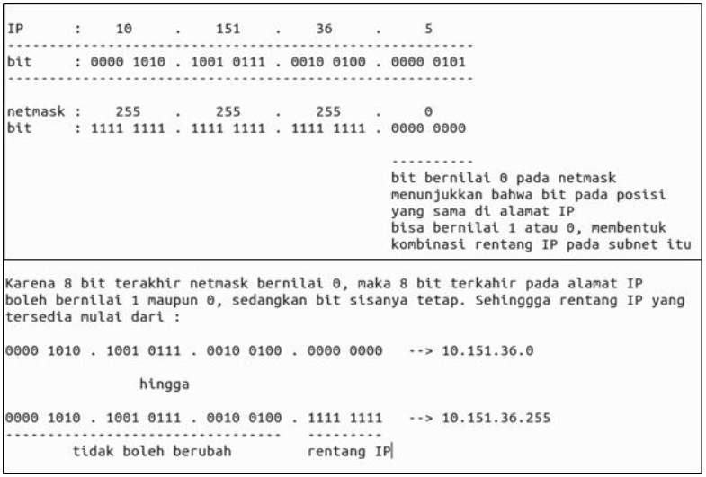

### IP Publik dan IP Privat

Alamat IP dibagi menjadi 2 jenis, yaitu :

- IP Publik = alamat IP yang digunakan dalam jaringan global Internet, cirinya alamat IP dapat diakses melalui internet secara langsung.
- IP Privat = alamat IP yang digunakan (dikenali) dan hanya dapat diakses oleh jaringan lokal.

Rentang IP Privat :

- 10.0.0.0/8 (Class A)
- 172.16.0.0/12, 172.31.0.0/12 (Class B)
- 192.168.0.0/16 (Class C)

Rentang IP Publik adalah selain rentang IP Privat di atas.

## B. SUBNETTING

### Pengertian

**Subnet** adalah suatu sub jaringan dari jaringan yang lebih besar. Dengan adanya subnet, kita dapat melakukan manajemen suatu jaringan dengan lebih baik.

**Tujuan** utama kita belajar subnetting adalah **pembagian alamat IP untuk kebutuhan tertentu**. Contohnya pada gedung Departemen Informatika dimana terdapat beberapa laboratorium, dan setiap laboratorium memiliki lebih dari 1 komputer yang harus dikonfigurasikan sedemikian rupa agar dapat saling berkomunikasi dan mengakses internet.

Dari contoh tersebut, muncullah salah satu konfigurasi paling dasar dalam penyelesaian permasalahan ini yaitu pembagian alamat IP untuk setiap laboratorium di gedung Departemen Informatika, seperti :

1.  Laboratorium LP memiliki jaringan dengan subnet **10.151.34.0/24**
2.  Laboratorium AJK memiliki jaringan dengan subnet **10.151.36.0/24**

### Perhitungan Subnet

Ada dua metode pembagian/pengalokasian IP yang dikenal dalam jaringan, yaitu Classful dan Classless.

#### A. Classful

Pembagian IP dengan menggunakan metode ini didasarkan pada pembagian class pada alamat IP. Tiap subnet akan diberikan ukuran atau netmask yang dapat menampung jumlah komputer/ host yang terdapat dalam subnet tersebut. Tabel berikut menunjukkan Class yang terdapat pada metode _**Classful**_.

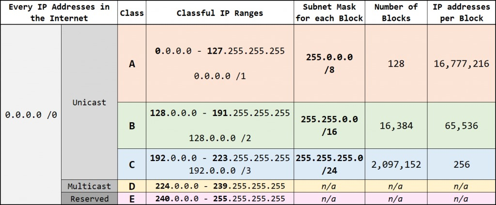

Sebagai contoh apabila kita memerlukan 250 IP Address, maka kita akan menggunakan blok alamat dari **Class C**. Apabila kita memerlukan lebih banyak address, yaitu sebanyak 60.000, maka kita bisa menggunakan blok alamat dari **Class B**. Apabila masih kurang, bisa menggunakan blok alamat dari **Class A**.

Contoh penerapan pembagian alamat IP dengan metode _**Classful**_ sebagai berikut.

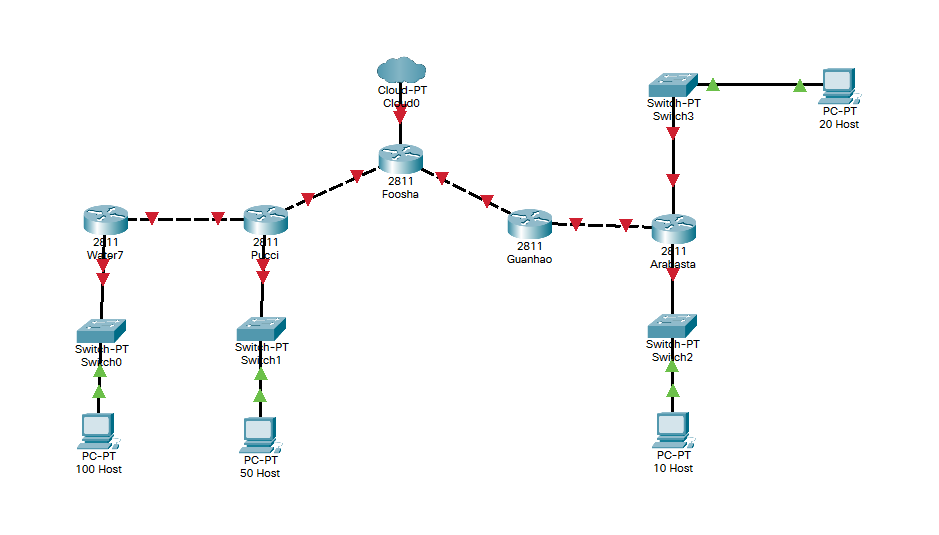

Anggap kita memiliki topologi jaringan seperti gambar di atas. Lalu, tentukan jumlah subnet yang ada di dalam topologi tersebut.

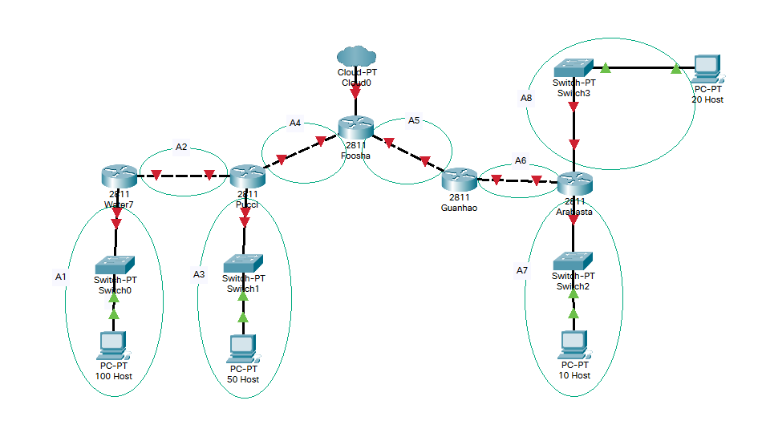

Terdapat 8 subnet di dalam topologi. Dengan menggunakan teknik classful setiap subnet akan memiliki netmask /24 karena semua subnet memiliki jumlah host di bawah 256. Sehingga pembagian IP yang memungkinkan untuk topologi di atas adalah sebagai berikut.


Namun, bagaimana jika kita hanya perlu 300 alamat? Menggunakan Class C tidaklah cukup, namun menggunakan Class B akan membuang sangat banyak sekali alamat, yaitu sebanyak lebih dari 60.000 alamat akan terbuang sia-sia.

Bisa saja kita menggunakan dua alamat dari Class C (sehingga cukup untuk 512 alamat IP). Hal ini memang bisa dilakukan (dan telah dilakukan pada umumnya), namun bagaimana jika kita perlu 25.000 alamat IP? Menggunakan metode ini kita akan perlu menggunakan 98 blok alamat dan apabila menggunakan blok dari kelas B, masih sebanyak 45.000 alamat IP akan terbuang.

Karena sangat tidak efisien, maka ditemukanlah teknik alokasi IP yang jauh lebih baik, yaitu **C**lassless **I**nter-**D**omain **R**outing atau kerap dikenal dengan istilah **CIDR**.

#### B. Classless / CIDR

Di dalam metode Classless, pembagian IP sudah tidak lagi terpaku pada 3 kelas di atas. Dengan metode ini, IP bisa dialokasikan sesuai kebutuhan masing-masing segmen jaringan. Metode Classless diimplementasikan secara formal dengan **CIDR** dan diatur oleh RFC 1518/1519. Dengan metode ini, maka:

- Apabila kita perlu 250 IP, maka bisa menggunakan subnet dengan ukuran /24
- Apabila kita perlu 300 IP, maka bisa menggunakan subnet dengan ukuran /23
- Apabila kita perlu 500 IP, maka juga bisa menggunakan subnet dengan ukuran /23
- Apabila kita perlu 25.000 IP, maka bisa menggunakan subnet dengan ukuran /17
- Apabila kita perlu 250.000 IP, maka bisa menggunakan subnet dengan ukuran /14

Cara ini bisa membuat pembagian IP menjadi jauh lebih fleksibel dan jumlah alamat IP yang terbuang sia-sia menjadi sangat sangat lebih sedikit.

Di dalam classless sendiri, ada 2 cara untuk melakukan subnetting atau membuat segmen jaringan, yaitu **FLSM** dan **VLSM**.

##### 1. FLSM (Fixed Length Subnet Masking)

**F**ixed **L**ength **S**ubnet **M**asking (FLSM) adalah teknik pembagian jaringan di mana setiap subnet memiliki ukuran atau jumlah host yang sama. Misalnya, jika kalian memiliki alamat jaringan dengan prefix `/24` dan ingin membaginya menjadi 4 subnet, maka setiap subnet akan mendapatkan bagian yang sama besar, yaitu dengan prefix `/26`.

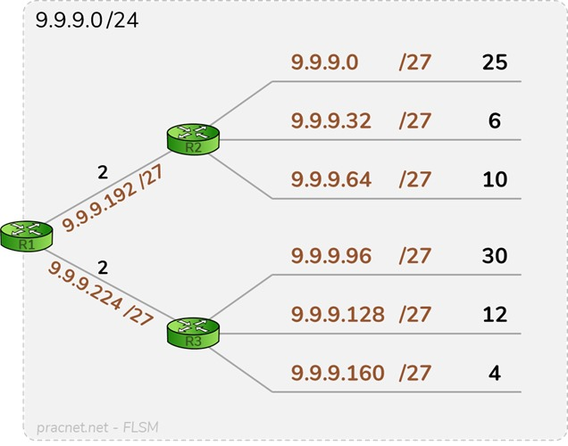

Sebagai contoh, kalian diberi alamat `9.9.9.0/24` dan memiliki topologi seperti di atas, dengan angka berwarna hitam menunjukkan jumlah host pada masing-masing subnet. Karena ada 8 subnet, maka kalian akan membagi alamat tersebut menjadi alamat-alamat dengan ukuran `/27`, yang mana berisi 30 alamat IP yang bisa digunakan

> Subnet dengan prefix `/27` berisi 32 IP namun hanya 30 yang bisa digunakan, karena IP pertama digunakan sebagai **Network ID** dan IP terakhir digunakan sebagai **Broadcast Address**. Hal ini berlaku untuk semua subnet kecuali `/31` (Diatur oleh RFC 3021) dan `/32`.

Namun, bagaimana jika kamu memiliki 2 subnet, dengan subnet pertama membutuhkan 25.000 IP namun subnet kedua hanya perlu 500 IP? Jika menggunakan aturan FLSM, maka kedua subnet harus memiliki ukuran `/17`. Untuk subnet pertama, ini tidak masalah. Namun untuk subnet kedua, ukuran ini terlalu besar sehingga akan menjadi sangat boros dan tidak efisien. Tak hanya itu, bagaimana jika kita perlu subnet ke-3? ke-4, dan seterusya? Maka dari itu, kita akan mencoba menggunakan teknik lain.

##### 2. VLSM (Variable Length Subnet Masking)

Berbeda dengan FLSM, **V**ariable **L**ength **S**ubnet **M**asking (VLSM) adalah teknik subnetting yang mana semua subnet bisa memiliki ukuran yang berbeda-beda. Inti utama dari penggunaan teknik VLSM adalah untuk mengefisienkan pembagian IP di dalam jaringan, karena besar netmask akan disesuaikan dengan banyaknya komputer/host yang membutuhkan alamat IP di masing-masing subnet.

> Jadi, pada teknik **VLSM**, subnet mask (netmask) akan diberikan sesuai dengan kebutuhan jumlah alamat IP dari subnet tersebut.

Contoh penerapannya, kita akan menggunakan topologi seperti contoh metode _**Classful**_.

**Langkah 1** - Tentukan jumlah alamat IP yang dibutuhkan oleh tiap subnet dan lakukan _labelling_ netmask berdasarkan jumlah IP yang dibutuhkan.

| Subnet    | Jumlah IP | Netmask |
| --------- | --------- | ------- |
| A1        | 101       | /25     |
| A2        | 2         | /30     |
| A3        | 51        | /26     |
| A4        | 2         | /30     |
| A5        | 2         | /30     |
| A6        | 2         | /30     |
| A7        | 11        | /28     |
| A8        | 21        | /27     |
| **Total** | **192**   | **/24** |

Berdasarkan total IP dan netmask yang dibutuhkan, maka kita dapat menggunakan netmask **/24** untuk memberikan pengalamatan IP pada subnet.

**Catatan**

> Penentuan subnet mask (netmask) _**root**_ dalam pembagian IP tidak hanya berdasarkan **jumlah** IP yang dibutuhkan, tetapi perlu diperhatikan juga berapa banyak netmask yang dibutuhkan oleh subnet yang ada dalam topologi tersebut. Seperti pada contoh yang kita gunakan, karena netmask terbesar yang dibutuhkan adalah **/25** dan hanya terdapat 1 subnet yang membutuhkan subnet tersebut, maka pembagian IP dapat dilakukan mulai dari netmask **/24**.

**Langkah 2** - Subnet besar yang dibentuk memiliki NID **192.168.1.0** dengan netmask **/24**. Hitung pembagian IP berdasarkan NID dan netmask tersebut menggunakan pohon seperti gambar di bawah.

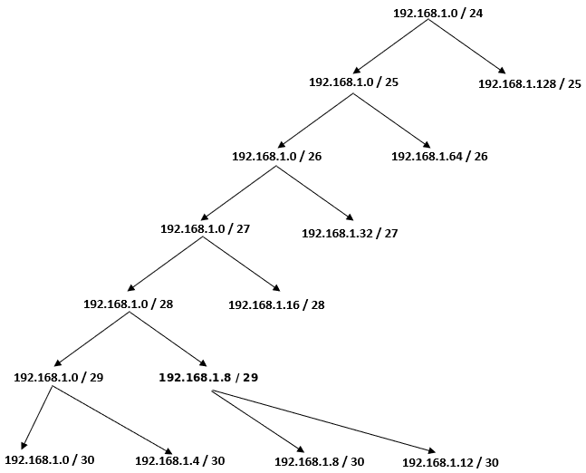

**Langkah 3** - Lakukan subnetting dengan menggunakan pohon tersebut untuk pembagian IP sesuai dengan kebutuhan masing-masing subnet yang ada.

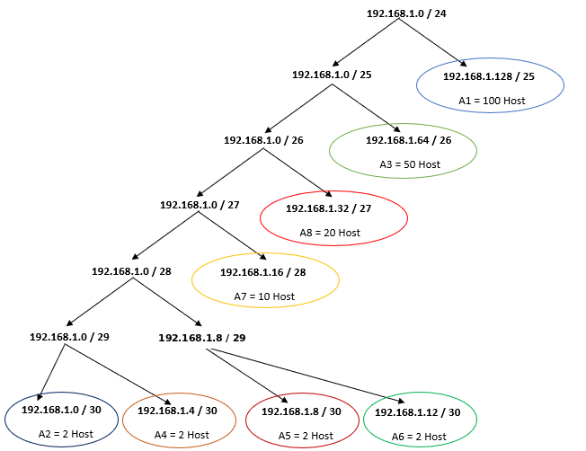

Dari pohon dari pohon tersebut akan mendapat pembagian IP sebagai berikut.


## C. SUPERNETTING

Supernetting adalah kebalikan dari subnetting, yaitu teknik menggabungkan beberapa jaringan kecil (subnet) menjadi satu jaringan yang lebih besar dengan cara mengurangi panjang prefix (menambah jumlah bit host) pada alamat jaringan. Dengan kata lain, jika subnetting memecah satu jaringan besar menjadi beberapa jaringan kecil, maka supernetting menyatukan beberapa jaringan kecil yang berurutan menjadi satu blok jaringan yang lebih besar.

Supernetting memiliki beberapa tujuan dan manfaat, diantaranya sebagai berikut:

- Mengurangi ukuran tabel routing (lebih efisien di router).
- Menyederhanakan manajemen jaringan besar.
- Digunakan dalam teknik route aggregation di internet (menggabungkan banyak prefix menjadi satu entri routing).

Untuk bagaimana cara melakukannya bisa menggunakan _route aggregation_ dari CIDR dengan mengikuti langkah-langkah berikut:

**Langkah 1** - Tentukan subnet yang ada dalam topologi dan lakukan _labelling_ netmask terhadap masing-masing subnet. Contohnya dapat dilihat pada gambar berikut.

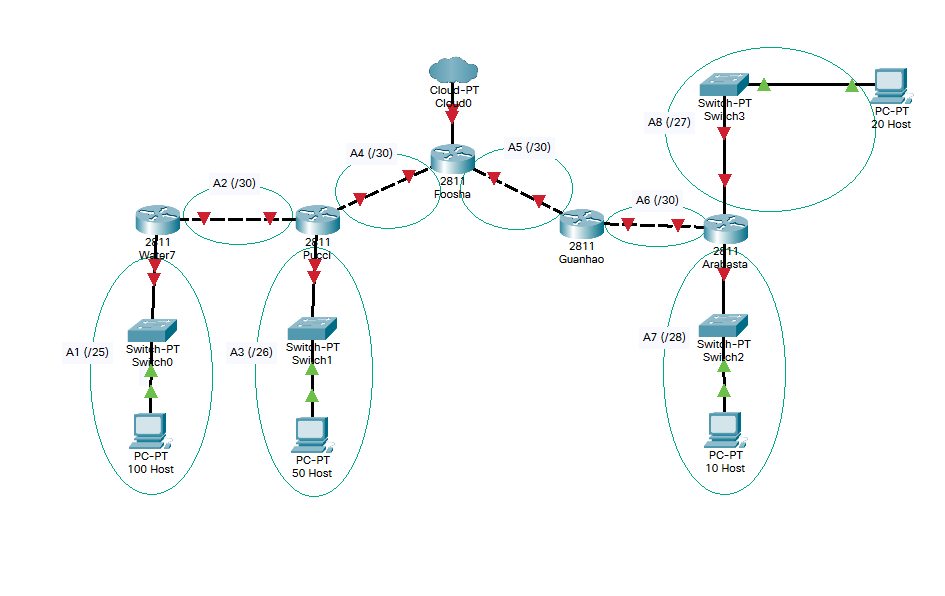

Langkah 2 - Gabungkan subnet paling bawah di dalam topologi. Paling bawah berarti subnet yang paling jauh dari internet (gambar awan). Maka pada topologi yang digunakan kali ini, subnet yang dapat digabungkan adalah A1 dengan A2 dan subnet A7 dengan A8. Subnet yang digabung tersebut akan membentuk sebuah subnet lebih besar dari subnet-subnet kecil yang ada di dalamnya.

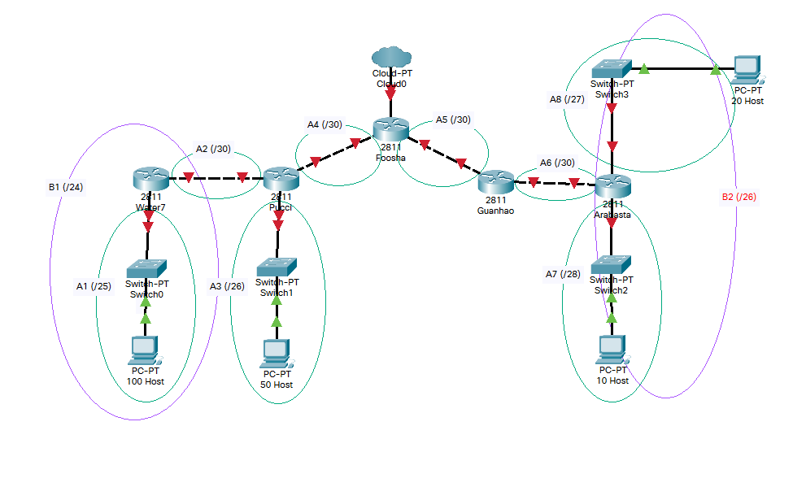

Subnet **B1** merupakan hasil penggabungan dari subnet **A1** dan **A2**, Subnet **B2** merupakan hasil penggabungan dari subnet **A7** dan **A8**.

> _**Mengapa subnet B1 memiliki netmask /24? Dan subnet B2 memiliki netmask /26?**_

Perhatikan subnet **A1** dan **A2**. Subnet **A1** memiliki netmask /25, dan subnet **A2** memiliki netmask /30. Pada teknik **CIDR** subnet gabungan akan memiliki netmask yang **1 tingkat di atas subnet terbesar yang digabungkan**. Berdasarkan contoh di atas A1 = /25 dan A2 = /30, maka jika dilakukan penggabungan akan menjadi subnet **B1** dengan netmask **/24**. Begitu pula dengan subnet B2.

Lalu ulangi langkah tersebut sampai menjadi sebuah subnet besar yang mencakup 1 topologi yang kita miliki.

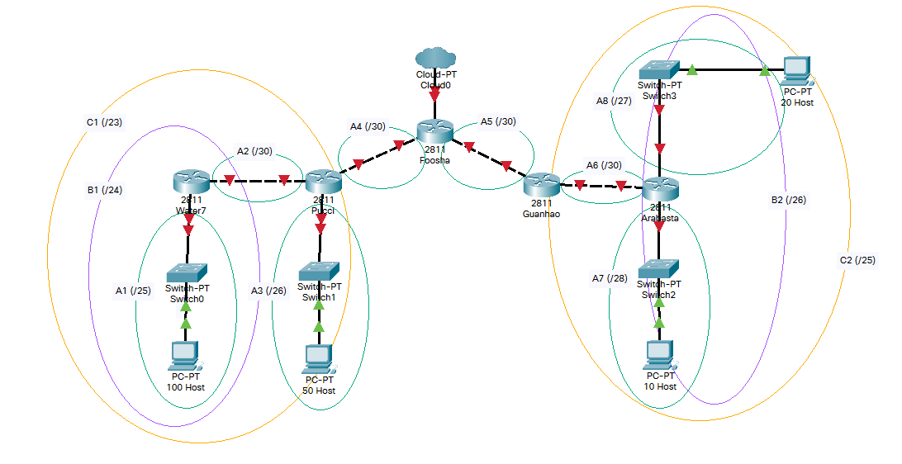
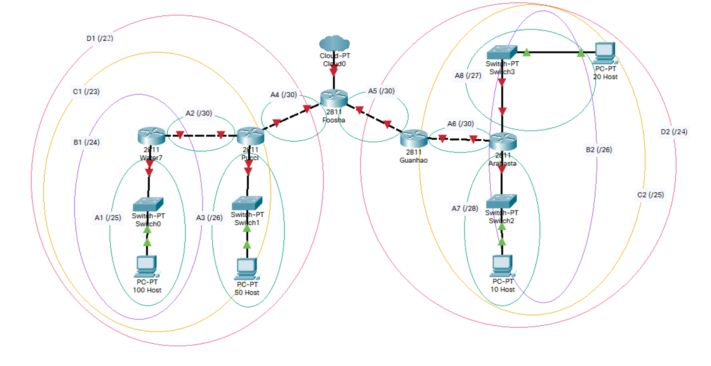
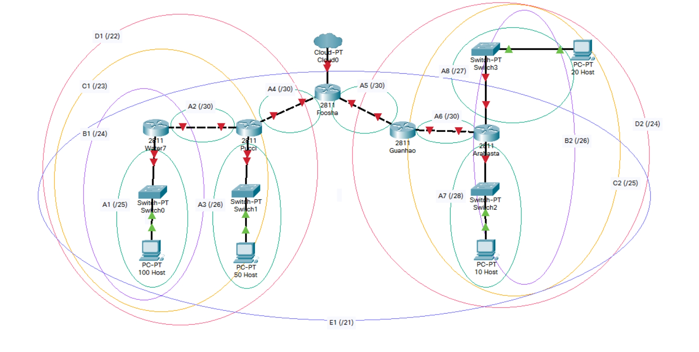

**Langkah 3** - Dari proses penggabungan yang telah dilakukan, didapatkan sebuah subnet besar dengan netmask **/21**. Kali ini dapat menggunakan NID **192.168.0.0**, netmask **255.255.248.0**.

**Langkah 4** - Hitung pembagian IP dengan pohon berdasarkan penggabungan subnet yang telah dilakukan.


> **Catatan**

> **Perbedaan** antara pohon VLSM dengan pohon CIDR adalah ketika satu subnet diturunkan, netmask yang akan terbentuk **disesuaikan dengan penggabungan subnet** yang telah dilakukan sebelumnya. Sebagai contoh, dari netmask besar /21, pada teknik VLSM akan dibagi dua menjadi masing-masing /22. Namun pada penggabungan yang dilakukan sebelumnya, /21 dihasilkan dari penggabungan /22 dan /24 maka subnet yang terbentuk memiliki netmask /22 dan /24.

**Langkah 5** - Berdasarkan penghitungan, maka didapatkan pembagian IP sebagai berikut.

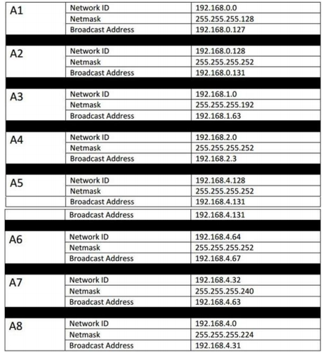

Jika kalian menggunakan CIDR maka netmask yang terbentuk akan menjadi lebih besar dibandingkan dengan menggunakan VLSM. Tetapi salah satu **keunggulan** teknik **CIDR** adalah ketika terdapat subnet baru yang ditambahkan dalam topologi, **tidak perlu melakukan penghitungan kembali** karena kemungkinan besar masih ada interval (_range_) IP yang tidak terpakai. Selain itu, teknik CIDR juga mengefisienkan _routing_ karena umumnya tabel routing yang dimiliki lebih sederhana dibandingkan teknik VLSM.

## Referensi

- https://www.practicalnetworking.net/stand-alone/classful-cidr-flsm-vlsm/
- https://it.telkomuniversity.ac.id/subnetting-kenali-pengertian-mekanisme-serta-fungsinya/
- https://www.geeksforgeeks.org/computer-networks/supernetting-in-network-layer/
