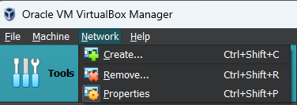
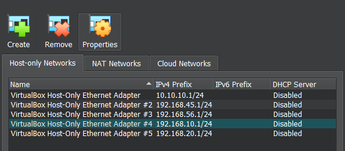
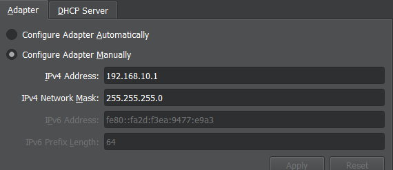
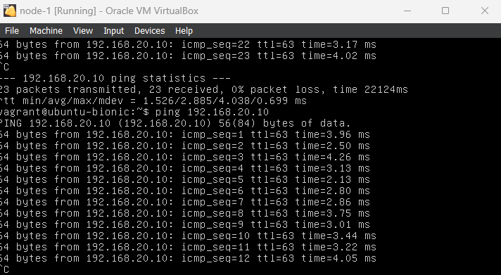
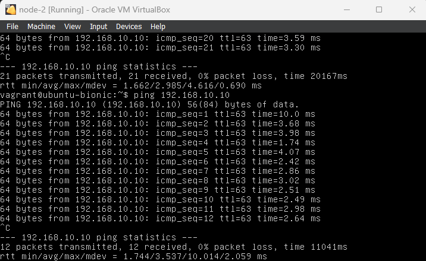
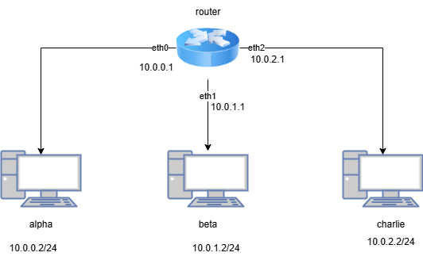

# Implementasi Terraform Dengan VirtualBox

Panduan ini menjelaskan langkah-langkah untuk melakukan *spawning* VM menggunakan Terraform pada VirtualBox dan konfigurasi routing serta subnetting dalam VM.

## Prerequisites

Pastikan perangkat berikut sudah terpasang pada komputer Anda:
- [VirtualBox](https://www.virtualbox.org/)
- [Terraform](https://www.terraform.io/)

## Langkah-Langkah

### 1. Konfigurasi Network

Buatlah VirtualBox Host-Only Ethernet Adapter dengan langkah berikut:
1. Buka **Network** di sidebar atas VirtualBox.
   


3. Klik **Create**. Jika muncul peringatan, klik **Yes**.
4. Pilih adapter yang baru dibuat, **VirtualBox Host-Only Ethernet Adapter**.



5. Atur IPv4 address dan netmask sesuai kebutuhan. Contoh: `192.168.10.0/24` dan `192.168.20.0/24`.



### 2. Topologi

Topologi yang akan kita buat melibatkan satu router yang terhubung ke dua node, masing-masing dengan subnet `192.168.10.0/24` dan `192.168.20.0/24`.


### 3. Konfigurasi Terraform

Pada implementasi ini, kita akan menggunakan tiga file Terraform: `main.tf`, `variables.tf`, dan `outputs.tf`.

#### main.tf

File ini mendefinisikan infrastruktur untuk router dan dua node:

```hcl
terraform {
  required_providers {
    virtualbox = {
      source  = "terra-farm/virtualbox"
      version = "0.2.2-alpha.1"
    }
  }
}

resource "virtualbox_vm" "router" {
  name      = var.router_name
  image     = var.image
  cpus      = var.cpus
  memory    = var.memory
  user_data = file(var.user_data_file)

  network_adapter {
    type = "nat"
  }

  network_adapter {
    type           = "hostonly"
    host_interface = var.host_only_adapter1
  }

  network_adapter {
    type           = "hostonly"
    host_interface = var.host_only_adapter2
  }
}

resource "virtualbox_vm" "node1" {
  name      = var.node1_name
  image     = var.image
  cpus      = var.cpus
  memory    = var.memory
  user_data = file(var.user_data_file)

  network_adapter {
    type           = "hostonly"
    host_interface = var.host_only_adapter1
  }
}

resource "virtualbox_vm" "node2" {
  name      = var.node2_name
  image     = var.image
  cpus      = var.cpus
  memory    = var.memory
  user_data = file(var.user_data_file)

  network_adapter {
    type           = "hostonly"
    host_interface = var.host_only_adapter2
  }
}
```
#### Penjelasan

**Provider**
<br>
Menggunakan `terra-farm/virtualbox` sebagai provider untuk membuat VM di VirtualBox. Provider ini memungkinkan Terraform untuk mengelola sumber daya VirtualBox, termasuk pembuatan dan pengaturan virtual machines.

**Resources**
- **Router**
  - VM yang bertindak sebagai router dengan:
    - Dua hostonly adapter untuk jaringan internal
    - Satu adapter NAT untuk koneksi internet

- **Node1 dan Node2**
  - Dua node dengan satu adapter hostonly yang terhubung pada subnet masing-masing, yang memungkinkan komunikasi antara node dan router.

#### variables.tf

File ini mendefinisikan variabel-variabel yang diperlukan.

```hcl
variable "router_name" {
  description = "Name of the router VM"
  type        = string
  default     = "router"
}

variable "node1_name" {
  description = "Name of the first node VM"
  type        = string
  default     = "node-1"
}

variable "node2_name" {
  description = "Name of the second node VM"
  type        = string
  default     = "node-2"
}

variable "image" {
  description = "Image for the VMs"
  type        = string
  default     = "https://app.vagrantup.com/ubuntu/boxes/bionic64/versions/20180903.0.0/providers/virtualbox.box"
}

variable "cpus" {
  description = "Number of CPUs for the VMs"
  type        = number
  default     = 1
}

variable "memory" {
  description = "Memory allocated for the VMs in MiB"
  type        = string
  default     = "512 mib"
}

variable "user_data_file" {
  description = "Path to the user data file"
  type        = string
  default     = "${path.module}/user_data"
}

variable "host_only_adapter1" {
  description = "Host-only Ethernet Adapter for Node 1"
  type        = string
  default     = "VirtualBox Host-Only Ethernet Adapter #4"
}

variable "host_only_adapter2" {
  description = "Host-only Ethernet Adapter for Node 2"
  type        = string
  default     = "VirtualBox Host-Only Ethernet Adapter #5"
}
```
### Catatan Tambahan
- Buat file kosong bernama `user_data` di direktori proyek, yang akan digunakan dalam inisialisasi VM.
- Periksa pengaturan adapter jaringan di VirtualBox untuk memastikan mereka sesuai dengan konfigurasi yang diberikan di `variables.tf`.

### 4. Menjalankan Perintah Terraform

Untuk menjalankan konfigurasi Terraform, ikuti langkah-langkah berikut:

#### a. Navigasi ke Direktori Proyek
Pastikan bahwa Anda berada di direktori proyek yang menyimpan `main.tf`.

#### b. Inisiasi Terraform
```bash
terraform init
```

#### c. Membuat Rencana (Plan)
```bash
terraform plan
```

#### d. Menerapkan Konfigurasi (Apply)
```bash
terraform apply
```

Atau untuk menghindari konfirmasi, gunakan:
```bash
terraform apply -auto-approve
```

### 5. Memeriksa Output

Setelah `terraform apply` dijalankan, VM akan muncul di VirtualBox. Masuk ke dalam VM tersebut untuk melanjutkan konfigurasi.

### 6. Konfigurasi IP

#### Router
Setelah melakukan _spawning_ VM, buka VM tersebut dan lakukan:

```bash
sudo nano /etc/netplan/50-cloud-init.yaml
```
Perintah ini membuka file yang digunakan untuk mengatur jaringan di router.

Pada router, kita akan menghubungkan dengan 2 subnet, yaitu 192.168.10.0/24 dan 192.168.20.0/24, sehingga kita akan memasukkan konfigurasi di bawah ini ke dalam `50-cloud-init.yaml`:

```bash
network:
  version: 2
  ethernets:
    enp0s8:
      dhcp4: no
      addresses:
        - 192.168.10.1/24
    enp0s9:
      dhcp4: no
      addresses:
        - 192.168.20.1/24
```
Dari code di atas, kita memberi alamat IP statis untuk dua antarmuka jaringan router. enp0s8 akan digunakan untuk Node 1 dan enp0s9 untuk Node 2.

Setelah memasukkan konfigurasi, jalankan perintah berikut untuk menerapkan perubahan:
```bash
sudo netplan apply
```

Kemudian, lakukan up pada ethernet:
```bash
sudo ip link set enp0s8 up
sudo ip link set enp0s9 up
```
Perintah di atas ini mengaktifkan interface jaringan agar router bisa berkomunikasi.

Langkah selanjutnya, untuk memastikan router dapat meneruskan paket data antara node, kita harus mengaktifkan IP forwarding:
```bash
sudo sysctl -w net.ipv4.ip_forward=1
```

Selanjutnya, kita perlu mengatur iptables agar router dapat menangani lalu lintas:
```bash
sudo iptables -t nat -A POSTROUTING -o enp0s17 -j MASQUERADE
```
Perintah di atas akan menyembunyikan alamat IP asli dari paket yang keluar dari router, membantu dalam pengaturan jaringan.

Tambahkan rute untuk masing-masing node sehingga router tahu cara mencapai mereka:
```bash
sudo ip route add 192.168.10.0/24 via 192.168.10.1
sudo ip route add 192.168.20.0/24 via 192.168.20.1
```
Perintah ini memberi tahu router bagaimana menemukan Node 1 dan Node 2.

Untuk sementara, kita matikan firewall (UFW) agar tidak menghalangi koneksi:
```bash
sudo ufw disable
```
Menonaktifkan firewall memungkinkan semua lalu lintas jaringan melewati tanpa batasan.

#### Node 1

Masukkan konfigurasi berikut pada `50-cloud-init.yaml`
```bash
network:
  version: 2
  ethernets:
    enp0s17:
      dhcp4: no
      addresses:
        - 192.168.10.10/24
      gateway4: 192.168.10.1
```
Di sini, kita memberi Node 1 alamat IP dan menyebutkan router sebagai gateway.

Lalu, Jalankan perintah ini untuk menerapkan pengaturan:
```bash
sudo netplan apply
```

Setelah itu, kita aktifkan interface jaringan node 1:
```bash
sudo ip link set enp0s17 up
```

#### Node 2

Buka terminal di Node 2 dan jalankan perintah berikut:
```bash
sudo nano /etc/netplan/50-cloud-init.yaml
```

Di dalam file, masukkan konfigurasi berikut:
```bash
network:
  version: 2
  ethernets:
    enp0s17:
      dhcp4: no
      addresses:
        - 192.168.20.10/24
      gateway4: 192.168.20.1
```

Jalankan perintah ini untuk menerapkan pengaturan:
```bash
sudo netplan apply
```

Setelah itu, kita aktifkan interface jaringan node 2:
```bash
sudo ip link set enp0s17 up
```

### 7. Lakukan testing pada routing

Setelah itu kita cek dengan node1 melakukan ping pada node2 dan sebaliknya, serta router melakukan ping pada masing-masing node.

Pada node1:
```bash
ping 192.168.20.10
```
Hasil:




Pada node2:
```bash
ping 192.168.10.10
```
Hasil:



# Implementasi Terraform Dengan VirtualBox

Panduan ini menjelaskan langkah-langkah untuk melakukan *spawning* VM menggunakan Terraform pada Proxmox dan konfigurasi routing serta subnetting dalam VM.

## Topologi

Topologi yang akan kita buat melibatkan satu router yang terhubung ke tiga node, masing-masing dengan subnet `10.0.0.0/24`, `10.0.1.0/24` dan `10.0.2.0/24`.



## Project Files

File yang akan kita buat dalam project ini adalah `main.tf` untuk menyimpan konfigurasi terraform, `variables.tf` untuk menyimpan semua variable yang digunakan dalam file main, serta `script.sh` yang berisi command-command yang akan dijalankan dalam router untuk konfigurasi routing

## Langkah - langkah

### 1. main.tf

Secara garis besar, isi dari file `main.tf` dapat dibagi menjadi 3 bagian, yaitu `providers`, `scripts resource`, dan `vm resources`.

#### providers

Bagian ini berfungsi untuk inisialisasi provider yang akan kita gunakan dengan source, version, serta credential yang kita inginkan

```hcl
terraform {
  required_providers {
    proxmox = {
      source  = "bpg/proxmox"
      version = "0.66.1"
    }
  }
}

provider "proxmox" {
  endpoint = var.proxmox_url
  username = var.proxmox_user
  password = var.proxmox_password
  insecure = true
}
```

`required_providers` dalam block `terraform` berfungsi untuk mendeklarasikan dependencies yang akan kita gunakan, disin kita menggunakan provider `bpg/proxmox` veresi `0.66.1`.

Kemudian kita set credential yang akan kita pakai pada block `provider "proxmox"`. *url*, *user*, serta *password* akan dibagikan kepada praktikan saat waktu praktikum

<br>

#### script resources

Bagian ini terdiri dari resource `proxmox_virtual_environment_file` milik `bpg/proxmox` yang berfungsi untuk menyimpan file baru kedalam server proxmox yang dapat digunakan dalam pembuatan vm.

> proxmox tidak mengizinkan injeksi script / command secara remote ke dalam vm sehingga script yang akan digunakan perlu di upload terlebih dahulu ke dalam server

```hcl
resource "proxmox_virtual_environment_file" "script" {
  content_type = "snippets"
  datastore_id = "local"
  node_name = "its"
  file_mode = "0700"

  source_file {
    path = "./script.sh"
  }
}
```

`content_type` merupakan salah satu tipe file yang didefinisikan oleh proxmox sesuai kegunaannya, dimana `snippets` merupakan tipe file versatile yang dapat meliputi format file apapun, salah satunya adalah .sh

`datastore_id` merujuk pada nama penyimpanan pada server proxmox, server netics menggunakan datastore `local` yang terletak dalam sebuah node.

`node_name` adalah nama node yang akan digunakan, server netics yang akan digunakan hanya memiliki 1 node yaitu `its`.

`file_mode` merupakan nilai octal yang merepresentasikan permission dari sebuah file dalam sistem operasi linux.

`source_file` dengan atribut `path` berfungsi untuk mendefinisikan path dari file yang ingin kita upload

> anda dapat meng-hardcode script yang anda buat kedalam main.tf dengan mengganti `source_file` dengan `source_raw` implementasinya dapat dilihat [disini](https://registry.terraform.io/providers/bpg/proxmox/latest/docs/guides/cloud-init#custom-cloud-init-configuration)

<br>

#### vm resources

`bpg/porxmox` menggunakan resource `proxmox_virtual_environment_vm` untuk mendefinisikan sebuah vm. 

*_Penjelasan detail dari tiap atribut dalam resource ini dapat disimak pada [video implementasi - 9:55](https://youtu.be/YNwTvInKKV0?si=AMLvZ6mBoWH9lsce&t=595)_*

Atribut-atribut yang dapat diganti menyesuaikan topologi dan credential yang didapat adalah `name`, `vm_id`, `agent`, `ip_config`, `user_account`, serta jumlah `network_device`


Berikut adalah 4 resource `proxmox_virtual_environment_vm` masing-masing untuk `Alpha`, `Beta`, `Charlie`, dan `Router`:
```hcl
resource "proxmox_virtual_environment_vm" "alpha" {
    name = "alpha"
    node_name = "its"
    on_boot = true
    stop_on_destroy = true
    scsi_hardware = "virtio-scsi-single"
    vm_id = lookup(var.vm_id_list, "alpha")

    agent {
      enabled = false
    }

    initialization {
      ip_config { #eth0
        ipv4 {
          address = lookup(var.ip_list, "alpha")
          gateway = lookup(var.gateaway_list, "alpha")
        }
      }
      user_account {
        username = "hmd"
        password = "hmd"
      }
    }

    cpu {
      cores = 1
      type = "x86-64-v2-AES"
    }

    memory {
      dedicated = 1024 # 1GB
      floating = 1024
    }

    disk {
      datastore_id = "local-lvm"
      file_id = "local:iso/focal-server-cloudimg-amd64.img"
      file_format = "raw"
      interface = "virtio0"
      iothread = true
      size = 3 # GB
    }

    network_device {
      enabled = true
      firewall = false
      bridge = "vmbr0"
    }
}
```

```hcl
resource "proxmox_virtual_environment_vm" "beta" {
    name = "beta"
    node_name = "its"
    on_boot = true
    stop_on_destroy = true
    scsi_hardware = "virtio-scsi-single"
    vm_id = lookup(var.vm_id_list, "beta")

    agent {
      enabled = false
    }

    initialization {
      ip_config { #eth0
        ipv4 {
          address = lookup(var.ip_list, "beta")
          gateway = lookup(var.gateaway_list, "beta")
        }
      }
      user_account {
        username = "hmd"
        password = "hmd"
      }
    }

    cpu {
      cores = 1
      type = "x86-64-v2-AES"
    }

    memory {
      dedicated = 1024 # 1GB
      floating = 1024
    }

    disk {
      datastore_id = "local-lvm"
      file_id = "local:iso/focal-server-cloudimg-amd64.img"
      file_format = "raw"
      interface = "virtio0"
      iothread = true
      size = 3 # GB
    }

    network_device {
      enabled = true
      firewall = false
      bridge = "vmbr0"
    }
}
```

```hcl
resource "proxmox_virtual_environment_vm" "charlie" {
    name = "charlie"
    node_name = "its"
    on_boot = true
    stop_on_destroy = true
    scsi_hardware = "virtio-scsi-single"
    vm_id = lookup(var.vm_id_list, "charlie")

    agent {
      enabled = false
    }

    initialization {
      ip_config { #eth0
        ipv4 {
          address = lookup(var.ip_list, "charlie")
          gateway = lookup(var.gateaway_list, "charlie")
        }
      }
      user_account {
        username = "hmd"
        password = "hmd"
      }
    }

    cpu {
      cores = 1
      type = "x86-64-v2-AES"
    }

    memory {
      dedicated = 1024 # 1GB
      floating = 1024
    }

    disk {
      datastore_id = "local-lvm"
      file_id = "local:iso/focal-server-cloudimg-amd64.img"
      file_format = "raw"
      interface = "virtio0"
      iothread = true
      size = 3 # GB
    }

    network_device {
      enabled = true
      firewall = false
      bridge = "vmbr0"
    }
}
```

```hcl
resource "proxmox_virtual_environment_vm" "router" {
    name = "router"
    node_name = "its"
    on_boot = true
    stop_on_destroy = true
    scsi_hardware = "virtio-scsi-single"
    vm_id = lookup(var.vm_id_list, "router")
    hook_script_file_id = proxmox_virtual_environment_file.script1.id

    agent {
      enabled = true
    }

    initialization {
      ip_config { #eth0
        ipv4 {
          address = lookup(var.ip_list, "router1-eth0")
        }
      }
      ip_config { #eth1
        ipv4 {
          address = lookup(var.ip_list, "router1-eth1")
        }
      }
      ip_config { #eth2
        ipv4 {
          address = lookup(var.ip_list, "router1-eth2")
        }
      }
      user_account {
        username = "hmd"
        password = "hmd"
      }
    }

    cpu {
      cores = 1
      type = "x86-64-v2-AES"
    }

    memory {
      dedicated = 1024 # 1GB
      floating = 1024
    }

    disk {
      datastore_id = "local-lvm"
      file_id = "local:iso/focal-server-cloudimg-amd64.img"
      file_format = "raw"
      interface = "virtio0"
      iothread = true
      size = 3 # GB
    }

    network_device {
      enabled = true
      firewall = false
      bridge = "vmbr0"
    }
    network_device {
      enabled = true
      firewall = false
      bridge = "vmbr0"
    }
    network_device {
      enabled = true
      firewall = false
      bridge = "vmbr0"
    }
}
```

Hal yang membedakan resource untuk *router* dan *client lain* adalah penambahan `hook_script_file_id` dan `agent` (enabled = true) untuk menempelkan file script pada vm, serta jumlah `ip_config` dan `network_device` yang disesuaikan dengan topologi.

<br>

### 2. variables.tf

deklarasikan semua variable yang digunakan pada `main.tf` di dalam `variables.tf` sesuai tipe nya.

```hcl
variable "proxmox_url" {
  type    = string
  default = "https://url_yang_diberikan/"
}

variable "proxmox_user" {
  type    = string
  default = "user_yang_diberikan@pam"
}

variable "proxmox_password" {
  type    = string
  default = "password_yang_diberikan"
}

variable "vm_id_list" {
  type        = map(number)
  default = {
    "alpha" = 555
    "beta" = 554
    "charlie" = 553
    "router" = 552
  }
}

variable "ip_list" {
  type        = map(string)
  default = {
    "alpha" = "10.0.0.2/24"
    "beta" = "10.0.1.2/24"
    "charlie" = "10.0.2.2/24"
    "router1-eth0" = "10.0.0.1/24"
    "router1-eth1" = "10.0.1.1/24"
    "router1-eth2" = "10.0.2.1/24"
  }
}

variable "gateaway_list" {
  type        = map(string)
  default = {
    "alpha" = "10.0.0.1"
    "beta" = "10.0.1.1"
    "charlie" = "10.0.2.1"
  }
}
```
> anda dapat menghapus default value dari `url`, `user`, serta `password` dan meletakkannya pada seuah file .tfvars karena bersifat sensitif.

<br>

### 3. script.sh

script yang bisa di tempelkan ke vm pada proxmox berupa `hook script` yang memiliki format khusus. 

`Agent` yang akan menjalankan script tersebut akan memberikan 2 input berupa `VMID` (id dari vm dimana script akan dijalankan) serta `PHASE` (fase dari vm tersebut). 

Untuk menjalankan perintah di dalam vm, kita memanfaatkan command `qm guest exec` yang dimiliki oleh server proxmox. perintah tersebut menggunakan `VMID`, sedangkan `PHASE` digunakan untuk mengatur agar `Agent` menjalankan script kita pada saat `post-start` (setelah vm dihidupkan).

Berikut adalah template script yang bisa digunakan

```hcl
#! /usr/bin/env bash

VMID=$1;
PHASE=$2;

if [[ "$PHASE" == "post-start" ]]; then
    sleep 180;

    qm guest exec "$VMID" -- bash -c "
        # write your script here
    ";
fi
```

Command-command yang perlu dimasukkan ke dalam template script adalah sebagai berikut:

```
sysctl -w net.ipv4.ip_forward=1 &&
echo 'net.ipv4.ip_forward=1' >> /etc/sysctl.conf &&
netplan apply &&
ip link set eth0 up &&
ip link set eth1 up &&
ip link set eth2 up &&
ip route add 10.0.0.0/24 via 10.0.0.1 &&
ip route add 10.0.1.0/24 via 10.0.1.1 &&
ip route add 10.0.2.0/24 via 10.0.2.1
```

*_Jangan Lupa mengakhiri tiap baris dengan tanda `&&` kecuali baris terakhir_*

<br>
Isi dari script.sh akan menjadi seperti berikut:

```hcl
#! /usr/bin/env bash

VMID=$1;
PHASE=$2;

if [[ "$PHASE" == "post-start" ]]; then
    sleep 180;

    qm guest exec "$VMID" -- bash -c "
        sysctl -w net.ipv4.ip_forward=1 &&
        echo 'net.ipv4.ip_forward=1' >> /etc/sysctl.conf &&
        netplan apply &&
        ip link set eth0 up &&
        ip link set eth1 up &&
        ip link set eth2 up &&
        ip route add 10.0.0.0/24 via 10.0.0.1 &&
        ip route add 10.0.1.0/24 via 10.0.1.1 &&
        ip route add 10.0.2.0/24 via 10.0.2.1
    ";
fi
```

<br>

### 4. ping check

Anda dapat melakuka tesing ping melalui web gui proxmox dengan langkah-langkah sebagai berikut:

1. masuk ke url yang diberikan
2. login dengan username dan password kelompok kalian
3. cari vm yang kalian buat dengan melihat VMID yang kalian pakai
4. pilih node yang ingin kalian tes, lalu click shell
5. login dengan username dan password vm yang sudah kalian buat pada `main.tf`
6. lakukan ping pada ip vm yang kalian inginkan

Navigasi porxmox webGUI dapat disimak di [video implementasi - 1:37:32](https://youtu.be/YNwTvInKKV0?si=RkRoQ4K56yaebono&t=5852)


