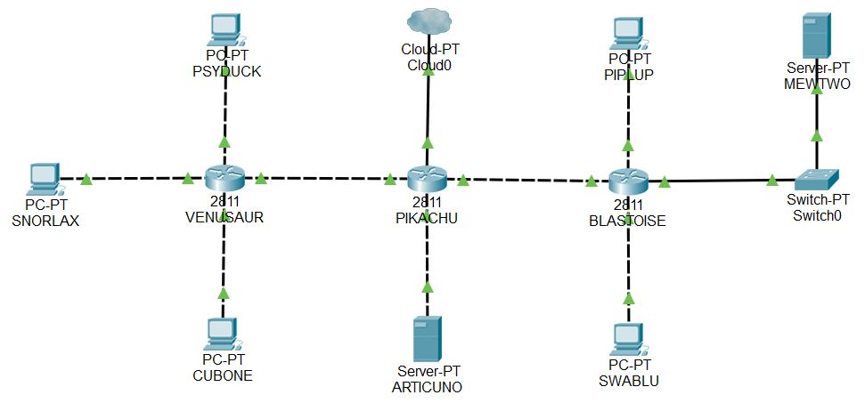

# FIREWALL

1. [Definisi](#1-definisi)
2. [Fungsi Firewall](#2-fungsi-firewall)
3. [Cara kerja Firewall](#3-cara-kerja-firewall)
4. [Jenis-jenis Firewall](#4-jenis-jenis-firewall)
5. [IPTables](#5-iptables)


#

### 1. Definisi
Firewall adalah sebuah sistem keamanan pada jaringan komputer yang digunakan untuk melindungi suatu komputer dari beberapa jenis serangan dari komputer luar berdasarkan aturan keamanan (_security rules_) yang telah ditentukan. 

Menurut Wikipedia, Firewall adalah tembok api, tembok pelindung, atau dinding api yang merupakan suatu sistem yang dirancang untuk mencegah akses yang tidak diinginkan dari atau kedalam suatu jaringan internal.

### 2. Fungsi Firewall
Firewall diperlukan karena keamanan, diantara pertimbangan adanya firewall adalah:

- Pencurian data pada jaringan internal
- Pengaksesan data oleh orang yang tidak berhak
- Denial of Service

### 3. Cara Kerja Firewall
 

Gambar ilustrasi Firewall (Sumber: https://id.wikipedia.org/wiki/Berkas:Ilustrasi-Firewall.png)

Firewall adalah suatu mekanisme untuk melindungi keamanan jaringan komputer dengan mengizinkan lalu lintas jaringan yang dianggap aman untuk melaluinya dan mencegah lalu lintas jaringan yang tidak aman. Pengaturan lalu lintas paket tersebut berupa menyaring paket data yang keluar dan masuk di jaringan. 

Paket data yang ’baik’ diperbolehkan untuk melewati jaringan dan paket yang dianggap ’jahat’ tidak diperbolehkan melewati jaringan. Firewall dapat berupa perangkat lunak atau perangkat keras yang ditanam perangkat lunak untuk memfilter paket data. Umumnya, sebuah firewall diimplementasikan dalam sebuah mesin terdedikasi, yang berjalan pada pintu gerbang (gateway) antara jaringan lokal (suatu subnet) dan jaringan (subnet) lainnya. Firewall umumnya juga digunakan untuk mengontrol akses terhadap siapa saja yang memiliki akses terhadap jaringan pribadi dari pihak luar.

Cara-cara firewall dalam melindungi jaringan komputer internal, antara lain :

- Menolak dan memblokir paket data yang datang berdasarkan sumber dan tujuan yang tidak diinginkan.
- Menolak dan menyaring paket data yang berasal dari jaringan internal ke internet. Misal, ketika ada pengguna jaringan internet akan mengakses situs yang tidak baik.
- Menolak dan menyaring paket data berdasakan konten yang tidak diinginkan. Misal, firewall yang terintegrasi pada suatu antivirus akan menyaring dan mencegah file yang sudah terjangkit virus memasuki jaringan internal.
- Melaporkan semua aktivitas jaringan dan kegiatan firewall (log).

### 4. Jenis-Jenis Firewall
Firewall mempunyai beberapa tipe untuk melindungi jaringan, antara lain :

1. __Packet-Filtering Firewall__ 

    __Packet-filtering Firewall__ adalah tipe firewall yang memeriksa dan membandingkan alamat sumber dari paket lewat dengan aturan atau kebijakan yang telah terdaftar pada filtering firewall. Pada firewall tipe ini akan diatur apakah paket data tersebut akan diperbolehkan lewat atau menolaknya. Pada OSI layer, firewall ini bekerja pada network layer. 

    Pada Linux, packet filtering firewall ditanamkan pada kernel (sebagai modul kernel, atau digabungkan ke dalam kernel) dan dapat diatur menggunakan IPTables yang merupakan paket aplikasi built-in pada Linux. Aturan atau kebijakan pemeriksaan paket data berdasarkan informasi yang dapat ditangkap dari packet header, antara lain :

    - IP address sumber dan tujuan.
    - Nomor port TCP/UDP sumber dan tujuan.
    - Tipe ICMP message.

2. __Application Filter Firewall__ 

    Firewall ini bekerja pada application layer OSI sehingga dapat menyaring aplikasi-aplikasi yang dipakai untuk akses ke Internet. Tipe firewall ini umumnya agak mahal harganya karena lebih kompleks.

3. __Proxy Firewall__ 

    Fasilitas proxy server menggunakan perantara (proxy) sebagai jembatan hubungan antara LAN dan WAN/Inernet. Proxy server umumnya berfungsi pada lapisan aplikasi, oleh sebab itu sering juga disebut application firewall. 

    Jika __packet filter__ hanya berfungsi menyaring paket-paket yang diterima tanpa mengubah paket-paket tersebut, proxy server menerima dan mengubah alamat paket dengan memberikan alamat proxy server, dengan demikian, menyembunyikan alamat pengirim yang sebenarnya. 
    
    Untuk itu, proxy server umumnya mempergunakan metode yang dinamakan Network Address Translation (NAT), yang berfungsi untuk menyembunyikan IP address pribadi yang dipakai oleh LAN. Selain memeriksa alamat paket, proxy server juga memeriksa isi paket.

4. __Stateful Inspection Firewall__ 

    Firewall dengan metode stateful inspection ini bekerja di antara lapisan data link dan network referensi model OSI. Jika suatu paket data diterima, langkah pertama yang dilakukan oleh stateful inspection ini adalah memeriksa informasi header paket data dengan tabel state untuk melihat apakah sudah ada jalur yang tersedia untuk paket tersebut. Jika jalur sudah tersedia, maka stateful inspection membuat asumsi bahwa paket boleh diterima dan diteruskan ke tujuannya. Jika jalur belum tersedia, maka stateful inspection mencocokkan paket data dengan peraturan keamanan (security policy) yang telah dibuat untuk menentukan apakah paket mendapat izin untuk diteruskan. Stateful inspection terus-menerus mengawasi setiap koneksi yang terjadi dan membuat catatan pada tabel status yang dimilikinya.

Pada Modul kali ini kita akan mempelajari bagaimana Packet-Filtering Firewall menggunakan command `# iptables`. untuk dokumentasi dan cara penggunaannya bisa dilihat pada `# man iptables`.

### 5. IPTables


(Sumber : https://medium.com/@pamungkasjayuda/protect-server-dengan-iptables-fail2ban-b3cb3d4a42b7)

Iptables adalah suatu tools dalam sistem operasi linux yang berfungsi sebagai alat untuk melakukan penyaringan (_filter_) terhadap lalu lintas (traffic) data. Secara sederhana, iptables digambarkan sebagai pengatur lalu lintas data. Aturan-aturan lalu lintas pada iptables berada dalam sebuah tabel, dimana __table__ adalah sekelompok __chain__ dan __chain__ adalah sekelompok __rules__. Pada _high-level_ iptables, memungkinkan terdapat _multiple tables_ dengan _multiple chains_. Secara default, iptables berjalan tanpa _rules_ apapun.

Struktur kerja IPTables,
```
iptables -> Tables -> Chains -> Rules
```


(Sumber : https://musaamin.web.id/cara-setting-firewall-dengan-iptables-di-linux/)

Macam-macam chain pada IPTables :

1. __PREROUTING__

    Titik dimana kita bisa memanipulasi paket network sebelum dia memasuki keputusan routing, apakah ia akan masuk ke dalam Linux kita atau cuma sekedar ‘lewat’.

    Digunakan untuk mentranslasi address sebelum proses routing terjadi. Dilakukan dengan mengubah Destination IP dari paket data.
2. __POSTROUTING__

    Digunakan untuk mentranslasi address setelah proses routing. Dilakukan dengan merubah source IP Address dari paket data.
3. __INPUT__

    Melakukan filter paket yang masuk melalui firewall.
4. __OUTPUT__

    Melakukan filter paket yang keluar firewall sebelum routing.
5. __FORWARD__

    Untuk menyaring paket yang menuju ke NIC lain dalam sever atau host lain (hanya diteruskan/melewati firewall).

#### 5.1 Tables dan Chains
Terdapat 3 tabel utama yang ada pada IPTables dapat digambarkan sebagai berikut :


(Sumber : https://static.thegeekstuff.com/wp-content/uploads/2011/01/iptables-filter-nat-mangle-tables.png)

__a. Filter Table__

Table ini adalah tabel default pada iptables. Jadi, jika kita tidak mendefinisikan table yang kita gunakan pada iptables, maka secara default menggunakan Filter table.
    
__Filter table__ adalah tabel yang bertanggung jawab untuk pemfilteran paket.

Filter Table memiliki built-in chain, yaitu :

- __INPUT chain__ – Untuk memfilter paket yang menuju jaringan lokal. Contoh syntax:
```
# iptables --append INPUT --source 10.151.36.0/24 --jump DROP

atau dapat ditulis dengan :

# iptables -A INPUT -s 10.151.36.0/24 -j DROP
```
Keterangan :

Syntax tersebut akan men DROP semua paket yang masuk (INPUT) yang berasal dari subnet 10.151.36.0/24

- __OUTPUT chain__ – Untuk memfilter paket yang dari jaringan lokal ke jaringan luar sebelum proses routing dilakukan. Contoh syntax:
```
# iptables --append OUTPUT --destination 10.151.36.5 --jump DROP

atau dapat ditulis dengan :

# iptables -A OUTPUT -d 10.151.36.5 -j DROP
```
Keterangan :

Syntax tersebut akan men DROP semua paket keluar (OUTPUT) yang menuju ke 10.151.36.5
- __FORWARD chain__ – Untuk memfilter paket yang diteruskan (melewati) firewall. Contoh syntax:
```
# iptables --append FORWARD --source 10.151.36.0/24 --jump ACCEPT

atau dapat ditulis dengan :

# iptables -A FORWARD -s 10.151.36.0/24 -j ACCEPT
```
Keterangan :

Syntax tersebut akan meng ACCEPT semua paket keluar yang melewati yang berasal dari subnet 10.151.36.0/24


(Sumber : https://musaamin.web.id/wp-content/uploads/2018/07/iptabes-tutorial-input-forward-output.jpg)

__b. NAT Table__

NAT Table berfungsi untuk mentranslasikan jaringan lokal yang melewati firewall menuju jaringan luar. NAT Table memiliki built-in chain, yaitu :

- __PREROUTING chain__ – pada chain PREROUTING, dijalankan DNAT (Destination NAT) yaitu ketika anda mengubah alamat tujuan dari paket pertama dengan kata lain anda merubah ke mana komunikasi terjadi. 

    Destination NAT selalu dilakukan sebelum routing, ketika paket masuk dari jaringan. Port forwarding, load sharing dan transparent proxy semuanya adalah bentuk dari DNAT. 
    
    Destination NAT dilakukan pada chain PREROUTING, ketika paket masuk, hal ini berarti semua tools di dalam router akan melihat paket akan pergi ke tujuan yang sebenarnya. Hal ini juga berarti bahwa opsi -i (incoming interface) bisa digunakan. 
    
    Destination NAT dispesifikasikan dengan menggunakan -j DNAT dan opsi --to-destination menspesifikasikan sebuah alamat IP, range alamat IP dan range dari port (hanya untuk protokol UDP dan TCP) yang sifatnya optional. 
    
    Sebagai contoh, kita memiliki jaringan LAN internal yang ingin kita amankan. Pada jaringan tersebut terdapat DMZ sebagai HTTP server yang servernya memiliki IP 10.151.73.98. Kita ingin semua HTTP request yang berasal dari jaringan luar (interface eth0) diarahkan ke DMZ tersebut.

    ```
    # iptables --table nat --append PREROUTING --in-interface eth0 --protocol tcp --dport 80 --jump DNAT --to-destination 10.151.73.98:80

    atau dapat ditulis dengan :

    # iptables -t nat -A PREROUTING -i eth0 -p tcp --dport 80 -j DNAT --to-destination 10.151.73.98:80
    ```
- __POSTROUTING chain__ – pada chain POSTROUTING dijalankan SNAT (Source NAT), yaitu ketika anda mengubah alamat asal dari paket pertama dengan kata lain anda mengubah dari mana koneksi terjadi. 

    Source NAT selalu dilakukan __setelah routing__, sebelum paket keluar ke jaringan. Masquerading adalah contoh dari SNAT. Untuk melakukan Source NAT anda harus merubah asal dari koneksi. Hal ini dilakukan di chain POSTROUTING, saat sebelum keluar. 
    
    Hal ini sangat penting, dikarenakan berarti tools lain yang di dalam router itu (routing, packet filtering) akan melihat paket itu tidak berubah. Hal ini juga berarti opsi -o (outgoing interface) juga bisa digunakan. Source dispesifikasikan dengan menggunakan -j SNAT, dan juga opsi --to-source untuk menspesifikasikan sebuah alamat IP, range alamat IP dan port atau range port (hanya untuk protokol UDP dan TCP) yang sifatnya optional. 
    
    Sebagai contoh, pada modul pengenalan UML kita telah menjalankan IP masquerading dengan syntax berikut:
    ```
    # iptables --table nat --append POSTROUTING --out-interface eth0 --jump MASQUERADE

    atau dapat ditulis dengan : 

    # iptables -t nat -A POSTROUTING -o eth0 -j MASQUERADE
    ```
    Rule diatas berarti, source address dari setiap paket yang keluar (-o) melalui eth0 akan diubah menjadi IP dari eth0 (MASQUERADE).

    

    (Sumber : https://www.karlrupp.net/en/computer/computer/graphics/nat-chains.gif)

__c. Mangle Table__

Mangle Table berfungsi untuk melakukan perubahan pada paket data. Perubahan yang dilakukan pada TCP header untuk memodifikasi QOS (Quality of Service) pada paket tersebut. Mangle Table memiliki built-in chain, yaitu :
- __PREROUTING chain__
- __OUTPUT chain__
- __FORWARD chain__
- __INPUT chain__
- __POSTROUTING chain__

#### 5.2 Rules
Hal-hal yang perlu diingat untuk memberlakukan rules pada IPTables, yaitu :

- Rules mempunyai kriteria dan target.
- Jika kriteria sudah sesuai, firewall akan mengeksekusi rule pada target atau suatu nilai (parameter) yang disebutkan pada target.
- Jika kriteria tidak sesuai, firewall akan mengeksekusi rule yang selanjutnya.

Tujuan paket dapat di definisikan pada target, beberapa target yang sering digunakan adalah :

1. __ACCEPT__ – Firewall akan mengizinkan paket data.
2. __DROP__ – Firewall akan menolak paket data.
3. __RETURN__ – Firewall akan berhenti mengeksekusi rangkaian rules pada chain untuk paket data tersebut dan aturan pada chain tersebut dieksekusi ulang.
4. __MASQUERADE__ – Target yang hanya berlaku pada NAT Table. Digunakan untuk mendefinisikan paket diarahkan ke subnet mana. Biasanya hanya digunakan untuk IP dinamis, jika menggunakan IP statis, maka gunakan SNAT target.
5. __REJECT__ – Firewall akan menolak paket dan mengirimkan error message.
6. __REDIRECT__ – Target yang hanya berlaku pada NAT Table. Firewall akan mengarahkan paket ke device (mesin) yang digunakannya menggunakan Primary IP address (alamat localhost) interface-nya.

Untuk macam-macam target lebih lengkap, dapat dilihat pada dokumentasi extension dari iptables 
```
# man iptables-extension
```

__Syntax__

Secara umum, untuk memodifikasi aturan yang berlaku pada IPTables dengan menjalankan :
```
# iptables [-t table] command chain rules
```
Jika tidak disebutkan tablenya maka defaultnya menggunakan filter table.

Beberapa command yang sering digunakan pada iptables :

| Command and Syntax                                        | Description                                                                             | Example                                         |
| --------------------------------------------------------- |:--------------------------------------------------------------------------------------- |:----------------------------------------------- |
| `-A, --append chain rule-specification`                   | menambahkan rules pada chain  | `# iptables -A INPUT -s 10.151.36.0/24 -j DROP` 
| `-C, --check chain rule-specification`                    | mengecek rule apa saja yang berlaku pada chain    | `iptables -C INPUT -s 10.151.36.0/24 -j DROP`
| `-D, --delete chain {rule-specification \ rulenum}`      | menghapus rules pada chain    | `# iptables -D INPUT -s 10.151.36.0/24 -j DROP`
| `-I, --insert chain [rulenum] rule-specification`         | menyisipkan rules pada urutan tertentu    | `# iptables -I OUTPUT 2 -s 10.151.36.0/24 -j DROP`
| `-R, --replace chain rulenum rule-specification`          | mengganti rules pada chain tertentu   | `# iptables -R OUTPUT 2 -s 10.151.36.0/24 -j DROP`
| `-L, --list [chain]`                                      | melihat daftar rules yang berlaku berdasarkan chain   | `# iptables -L INPUT`
| `-S, --list-rules [chain]`                                | melihat semua rules yang berlaku pada firewall   | `# iptables -S INPUT`, `iptables -n -L -v --line-numbers`
| `-F, --flush [chain]`                                     | menghilangkan semua rules pada chain tertentu (semua chain jika chain tidak disebutkan) | `# iptables -F INPUT`

**Penjelasan :**

- `rule-specification` = `[matches...] [target]`
- `match` = `-m matchname [per-match-options]`
- `target` = `-j targetname [per-target-options]`
- `[]` = syntax tersebut bersifat opsional

Beberapa parameter yang perlu diketahui :

| Parameter                         | Descripton                        |
| --------------------------------- | :-------------------------------- |
| `[!] -p, --protocol protocolename`    | mendefinisikan opsi port yang digunakan paket
| `[!] -s, --source address`            | mendefinisikan opsi alamat asal dari paket
| `[!] -d, --destination address`       | mendefinisikan opsi alamat tujuan dari paket
| `-m, --match matchname`                 | mendefinisikan kesesuaian rule untuk tujuannya ke mana
| `-j, --jump targetname`                 | mendefinisikan rule akan menggunakan target yang mana
| `[!] -i, --in-interface name`       | mendefinisikan opsi interface yang dilihat masuk paketnya
| `[!] -o, --out-interface name`      | mendefinisikan opsi interface yang dilihat keluar paketnya

**Penjelasan :**
- `[!]` = bisa dinegasikan

Untuk opsi command maupun parameter lebih lengkap dapat dilihat pada dokumentasi `iptables`, 

```bash
# man iptables-extension
```

# **Praktik**

#### List default policy untuk setiap chain
```bash
# iptables -L | grep policy
```
#### 
#### Change default policy for a Chain
```bash
# iptables --policy {ACCEPT | DROP | REJECT}
```
Contoh :
```bash
# iptables --policy FORWARD ACCEPT
```
####

#### ACCEPT koneksi dari sebuah alamat IP

```bash
# iptables -A INPUT -s 10.151.36.100 -j ACCEPT
```
Penjelasan : 
- ACCEPTS semua koneksi yang berasal dari IP 10.10.36.100
#####
#### DROP koneksi dari sebuah subnet

```bash
# iptables -A INPUT -s 10.151.36.0/24 -j DROP
```
Penjelasan :
- BLOK semua koneksi yang berasal dari subnet 10.151.36.0/24 


#### DROP semua koneksi, hanya ALLOW koneksi yang menuju 192.168.36.5

```bash
# iptables --policy OUTPUT DROP
# iptables -A OUTPUT -d 192.168.36.5 -j ACCEPT
```
 Penjelasan :
 - DROP semua koneksi yang keluar
 - ALLOW koneksi yang menuju alamat IP 192.168.36.5

#### DROP koneksi HTTP

```bash
# iptables -A INPUT -p tcp --dport 80 -j DROP
```
 Penjelasan :
 - DROP semua paket yang protocolnya tcp dan menuju port 80 (http)

#### Menyimpan Rules IPTables

```bash
# sudo /sbin/iptables-save
```

#### Menghapus semua Rules pada IPTables

```bash
# iptables -F
```

#### Melihat semua Rules pada IPTables

```bash
# iptables -L
```

# Soal Latihan



1. Komputer di subnet CUBONE tidak diizinkan mengakses server ARTICUNO
2. Komputer di subnet SNORLAX tidak dapat diakses pada pukul 08.00 - 20.00
3. Server MEWTWO tidak diperbolehkan menerima koneksi SSH
4. Semua paket yang menuju subnet SWABLU akan diarahkan ke PIPLUP
