# GNS3 Introduction Module

- [GNS3 Introduction Module](#gns3-introduction-module)
  - [What is GNS3?](#what-is-gns3)
  - [GNS3 MacOS Installation](#gns3-macos-installation)
  - [Installing VMware Workstation](#installing-vmware-workstation)
  - [Installing VirtualBox](#installing-virtualbox)
  - [Installing GNS3 VM in VMWare](#installing-gns3-vm)
  - [Importing the GNS3 VM in VirtualBox](#importing-the-gns3-vm-in-virtualbox)
  - [Installing GNS3 GUI](#installing-gns3-gui)
  - [Installing the netics-pc appliance](#installing-the-netics-pc-appliance)
  - [Using GNS3](#using-gns3)
    - [Setting Up IP on a Node](#setting-up-ip-on-a-node)
    - [Connecting a Node to the Internet](#connecting-a-node-to-the-internet)
    - [Creating a Topology](#creating-a-topology)
  - [Exporting a GNS3 Project](#exporting-a-gns3-project)
  - [Requirements](#requirements)
  - [Warnings, Advice, Tips, and Tricks](#warnings-advice-tips-and-tricks)
  - [Troubleshooting](#troubleshooting)
  - [Sources](#sources)

<br>

## What is GNS3?

**GNS3 (Graphical Network Simulator-3)** is a tool that helps you run a simulation of anything from a small topology consisting of just a few devices on your computer all the way up to a topology with many devices hosted across multiple servers.

<br>

## GNS3 MacOS Installation

Installation of GNS3 for macOS can be viewed in the following YouTube video:
<br>
[](https://youtu.be/7N_hJ5bOofg?si=thDG4ZY7FIdfaPlG)

## Installing VMware Workstation
1. Open the website https://support.broadcom.com/ and register a new account (using a personal email is recommended).
2. Open the menu **VMware Cloud Foundation → My Downloads → Free Software Downloads** to access the list of software available for free.

   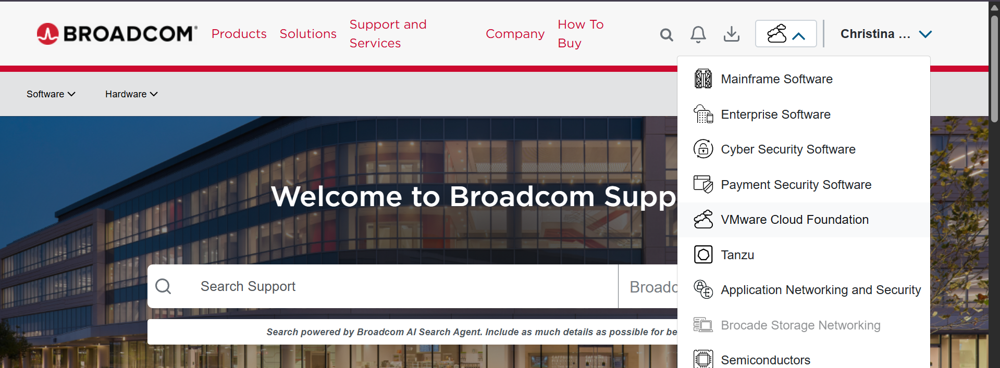

   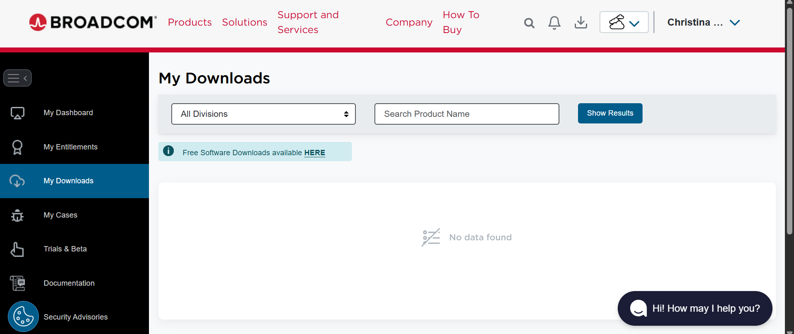

3. Select the **VMware Workstation Pro** menu, then choose the version to be installed. For Windows, it is recommended to pick the latest **VMware Workstation Pro 17.0 for Windows** version.

   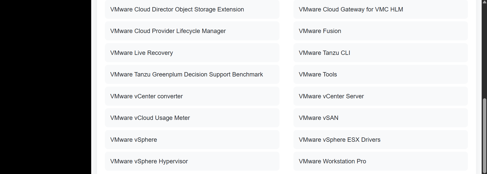

   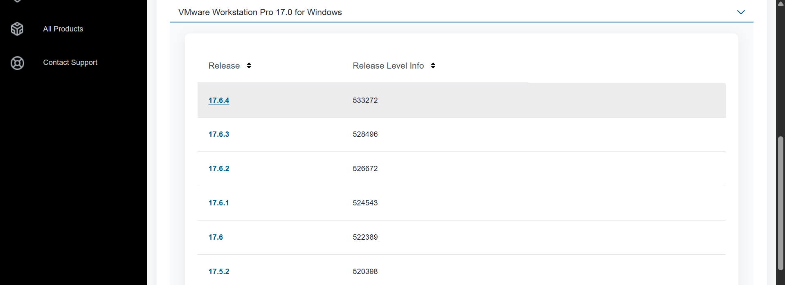

4. Check the **Terms & Conditions** box, then fill out the screening data to start the installation process.

   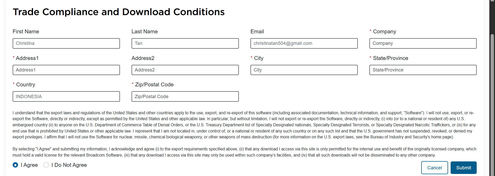

<br>

## Installing VirtualBox

Please download it from the following link:

- [VirtualBox 7.0](https://www.oracle.com/virtualization/technologies/vm/downloads/virtualbox-downloads.html).

Choose the VirtualBox version that matches your OS.

<br>

## Installing GNS3 VM
1. Open the following GitHub link https://github.com/gns3/gns3-gui/releases?page=2#release-v3.0.6, then download the **GNS3-3.0.6-all-in-one.exe** and **GNS3.VM.VMware.Workstation.3.0.6.zip** files.

   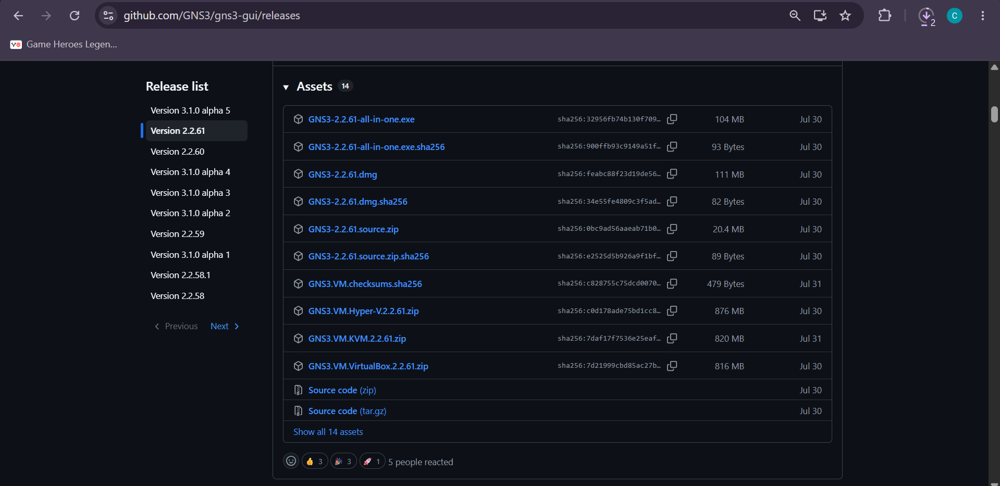

2. Extract the **GNS3.VM.VirtualBox.2.2.61.zip** file that was downloaded.

3. Open VMware Workstation, then select the menu **File → Open** and choose the **.ova** file from the extracted folder.

   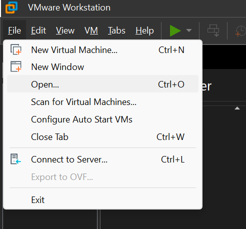

4. After the import process succeeds, turn on the virtual machine and wait until the IP address along with the GNS3 port appears. Note down that IP address and port, as both will be used to connect to the GNS3 GUI.

   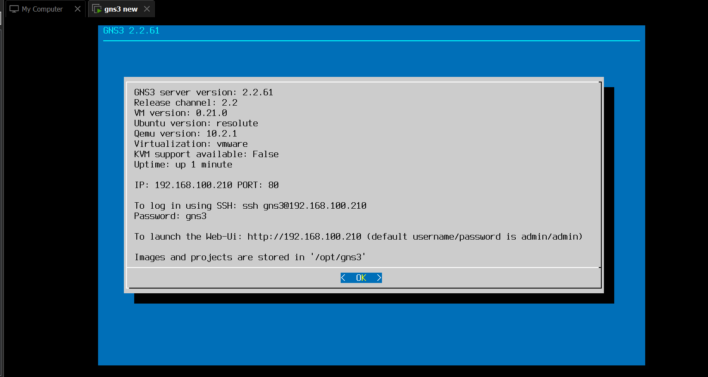

5. If you run into an issue when turning on the virtual machine, open the **Settings → Processors** menu, then uncheck the **Virtualize Intel VT-x/EPT or AMD-V/RVI** option.

   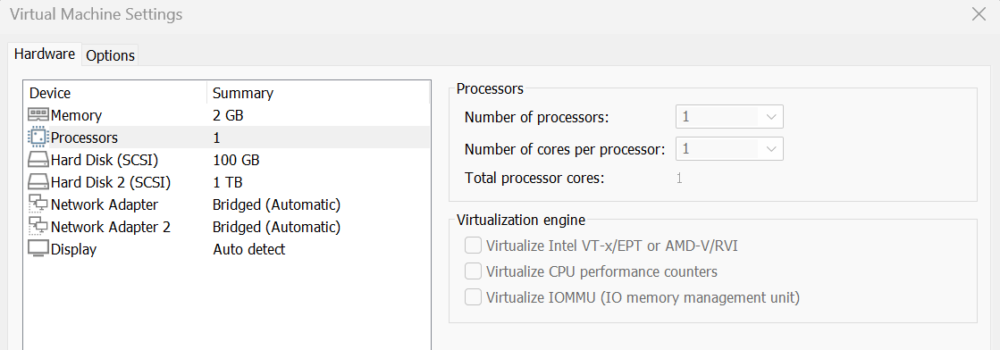

<br>

<br>

## Importing the GNS3 VM in VirtualBox

1. Download the GNS3 VM image
   Please download it from the following link [GNS3 VM 3.0.6](https://github.com/GNS3/gns3-gui/releases/download/v3.0.6/GNS3.VM.VirtualBox.3.0.6.zip). Once done, extract it right away.

2. Import the .ova file into VirtualBox


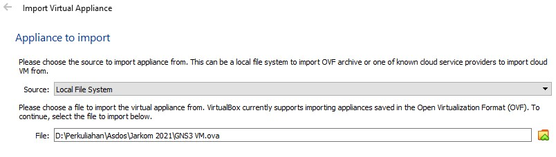

3. Create a new host network adapter

- Select File Menu -> Host Network Manager <br/>
  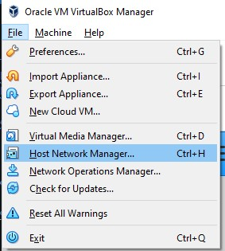
- Click Create <br/>
  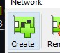
- Then set the IPv4 Address to `192.168.0.1`, and the IPv4 Network Mask to `255.255.255.0`, then click Apply
  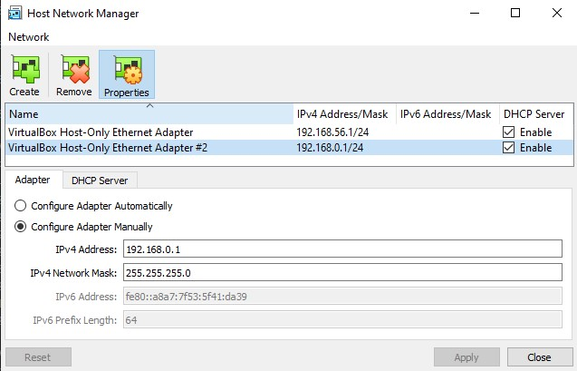
  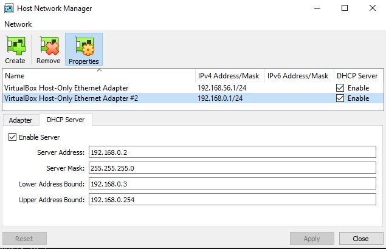

4. Change the Network Adapter on the VM

- Go to Settings -> Network
- Change Adapter 1 to Host-only Adapter and match it to the host network you created earlier
  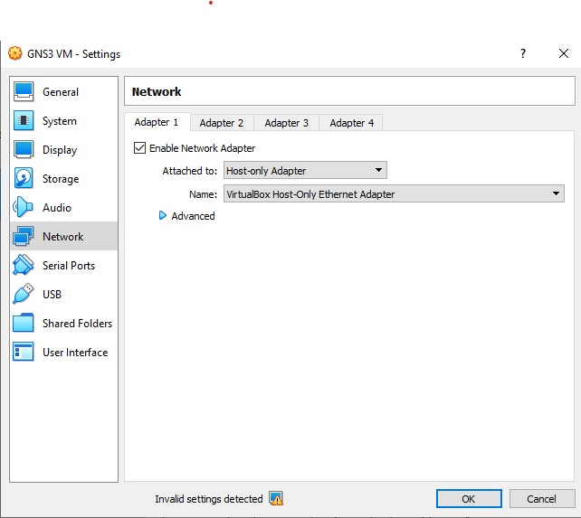
- And change Adapter 2 to NAT <br/>
  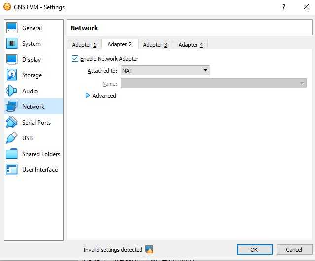
- So that the GNS3 Web-UI can be accessed from a browser on the host, add `port forwarding` (in the `Advanced` dropdown) for port 80 on the guest; this way GNS3 can be accessed via `127.0.0.1:80` <br/>
  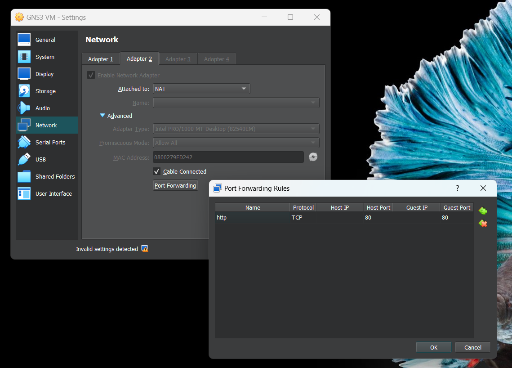
- Then click OK

5. Run the VM

- The VM should now display this
  

<br>

## Installing GNS3 GUI
1. Run the GNS3 **.exe** file that was downloaded, then follow the installation process until it finishes.

2. Open the menu **Edit → Preferences → Server → Remote servers**, then fill in the **Host** and **Port** fields with the IP address and port obtained from the GNS3 VM earlier.

   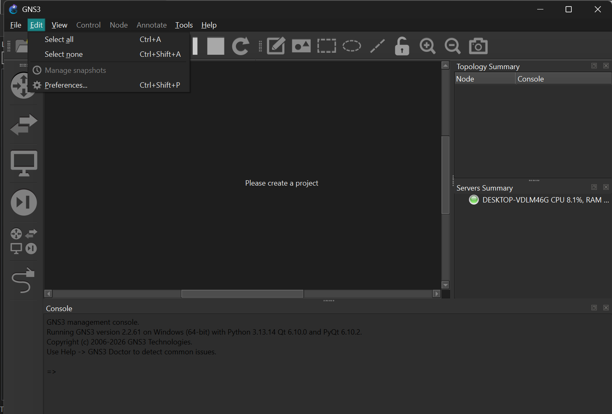

   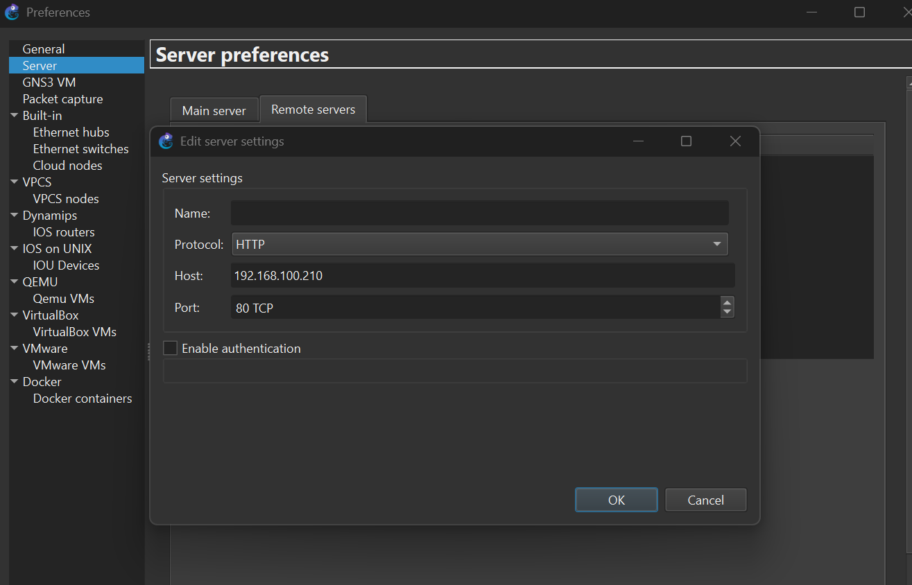

3. To start a new project, select the menu **File → New blank project**.

<br>

## Installing the netics-pc appliance
1. Select the menu **File → New Template**.

   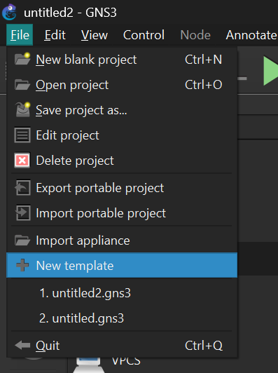

2. Choose the **Import an appliance file** option, then select the **netics-alpinet.gns3a** file that was downloaded. The **netics-alpinet.gns3a** file can you get from [here](netics-pc-alpinet\netics-alpinet.gns3a)

   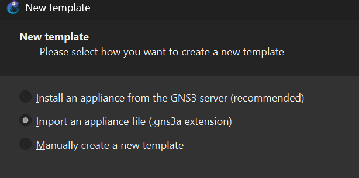

3. Choose the **Install appliance on a remote server** option.

   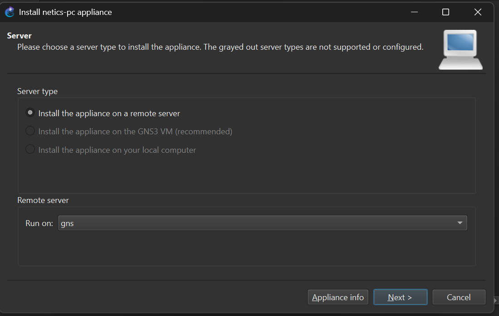

4. Drag and drop the **netics-pc** appliance onto an empty area to try it out.

   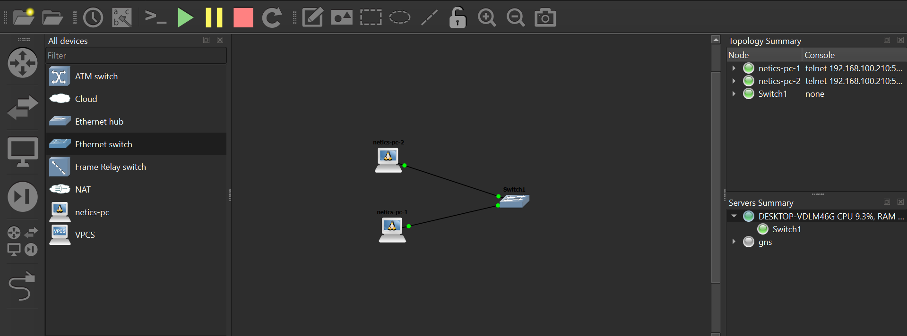

You can download the netics-pc gns3a appliance file [Here](https://drive.google.com/file/d/1McrXZs10dDU1I_HDM-wd3iE4agobPEXd/view?usp=sharing)

<br>

## Using GNS3

### Setting Up IP on a Node
1. Right-click on the node and open `Configure`
2. In the `General settings` menu, look for the `Edit network configuration` button
3. There you can set up the IP according to the interface being used. An interface is what is used to connect two devices

### Connecting a Node to the Internet

1. Drag NAT into an empty area
2. Connect NAT to the netics-pc with a link

   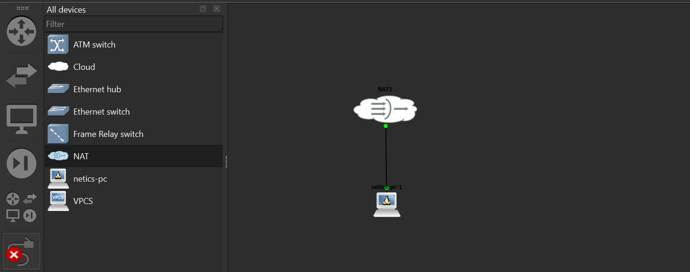

3. Click the **Show/Hide interface labels** menu to display the node's interface information

   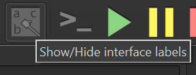

4. Then click the node, select the `eth0` interface, and click the NAT node you dragged earlier

   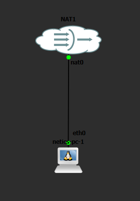

5. Then configure the IP of the netics-pc node

- Look for the 2 lines that look like this

```
# auto eth0
# iface eth0 inet dhcp
```

- Uncomment both lines, then save

```
auto eth0
iface eth0 inet dhcp
```

6. Start the node
7. Access the console of the node, and try pinging Google; if it succeeds, your settings are correct

   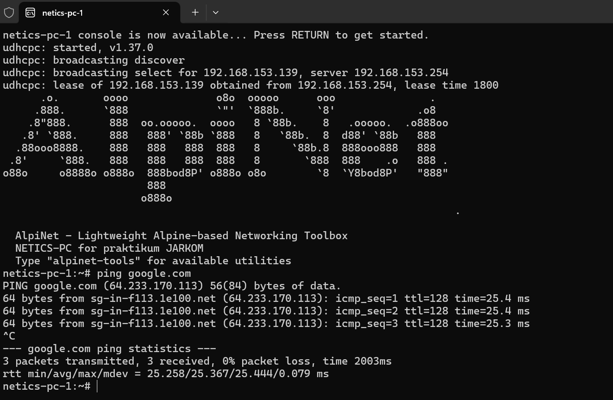

8. This node will later be used as the router for this module; rename this node to `Foosha` using the `Change hostname` feature on the node, and also change the symbol to the router symbol using the `Change symbol` feature

<br>

### Creating a Topology

1. Add a few ethernet switch and ubuntu nodes, then create connections between the nodes and name the nodes to match the picture

   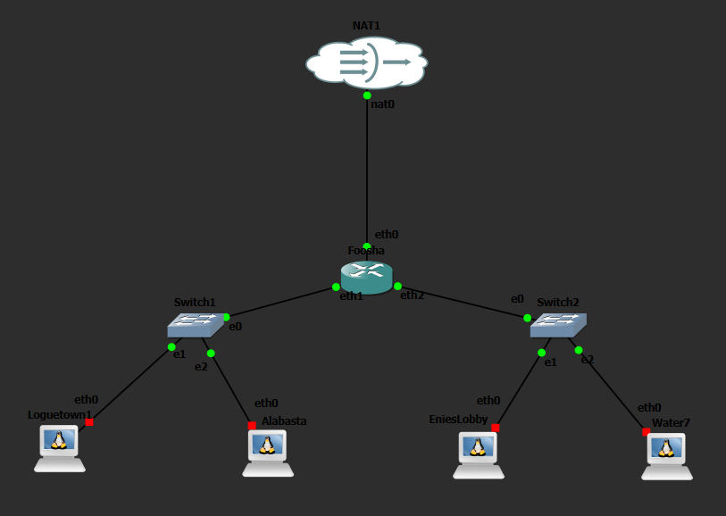

2. Use the `Change hostname` feature to rename the nodes
3. Then we configure the network of each node using the `Edit network configuration` feature as shown [here](#setting-up-ip-on-a-node) earlier; we can delete all the existing settings and fill in the settings below

- Foosha

```
auto eth0
iface eth0 inet dhcp

auto eth1
iface eth1 inet static
	address [IP Prefix].1.1
	netmask 255.255.255.0

auto eth2
iface eth2 inet static
	address [IP Prefix].2.1
	netmask 255.255.255.0
```

- Loguetown

```
auto eth0
iface eth0 inet static
	address [IP Prefix].1.2
	netmask 255.255.255.0
	gateway [IP Prefix].1.1
```

- Alabasta

```
auto eth0
iface eth0 inet static
	address [IP Prefix].1.3
	netmask 255.255.255.0
	gateway [IP Prefix].1.1
```

- EniesLobby

```
auto eth0
iface eth0 inet static
	address [IP Prefix].2.2
	netmask 255.255.255.0
	gateway [IP Prefix].2.1
```

- Water7

```
auto eth0
iface eth0 inet static
	address [IP Prefix].2.3
	netmask 255.255.255.0
	gateway [IP Prefix].2.1
```

**Definition Explanation**

- **Gateway**: The path in a network that data packets must pass through in order to reach another network.

4. Restart all nodes
5. Check whether all the ubuntu nodes have the IP corresponding to the settings using the `ip a` command. Below is an example for the `Foosha` node with IP Prefix `10.105`; adjust it to match your group's IP Prefix

   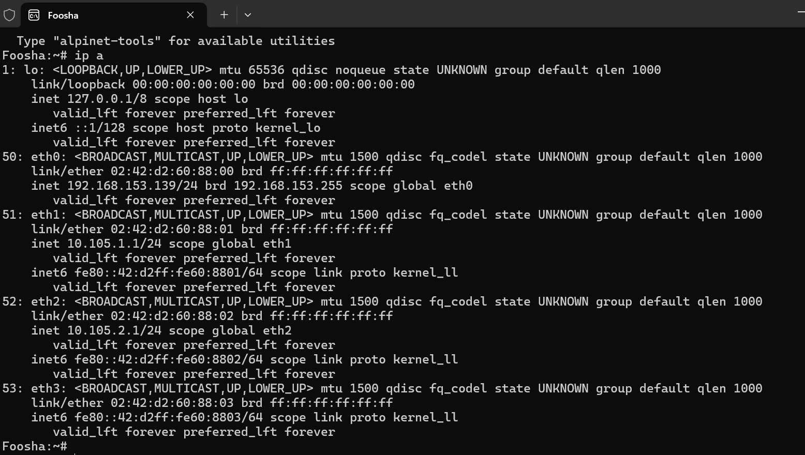

6. The topology you created can already run locally, but we cannot reach external networks yet. So we need to do a few things.
- Install the iptables tool
  ```
  apk update
  apk add iptables
  ```
- Type **`iptables -t nat -A POSTROUTING -o eth0 -j MASQUERADE -s [IP Prefix].0.0/16`** on the `Foosha` router
  **Notes:**
  - **iptables:** iptables is a tool in the Linux operating system that functions as a filter against data traffic. With iptables we manage all traffic in the computer, whether incoming, outgoing, or merely passing through our computer. This will be discussed in more detail in Module 5.
  - **NAT (Network Address Translation):** A method of translating network addresses used to connect more than one computer to the internet using a single IP address.
  - **Masquerade:** Used to disguise packets, for example by replacing the sender address with the router's address.
  - **-s (Source Address):** A specification for the source. The address can be a network name, a host name, or an IP address.
- Type the command `cat /etc/resolv.conf` on `Foosha`

  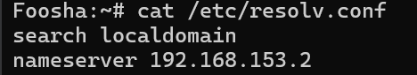

- Remember that IP because that IP is the DNS IP, then type the following command on the other ubuntu nodes `echo nameserver [DNS IP] > /etc/resolv.conf`. In the example case the command would be `echo nameserver 192.168.153.2 > /etc/resolv.conf`.
- Below is an example of pinging before and after adding the nameserver on the Water7 node

  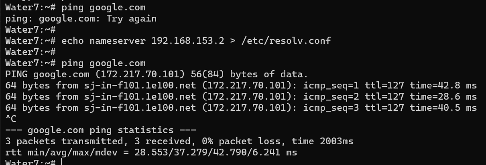

- All nodes should now be able to ping Google, which means they are connected to the internet

<br>

<br>

## Exporting a GNS3 Project

1. In the GNS3 desktop app, go to the **File** menu, then find the **Export Project** option.

   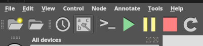

2. A pop-up will appear for export configuration and preferences. Choose the **bzip2 compression** type and leave the compression level at its default value of 9.

   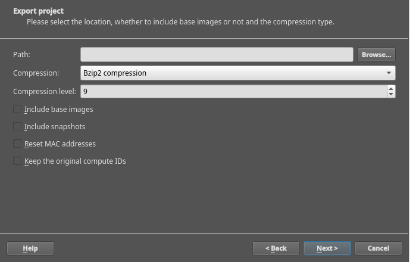

3. Then choose the destination folder and the name of the exported GNS3 project.

   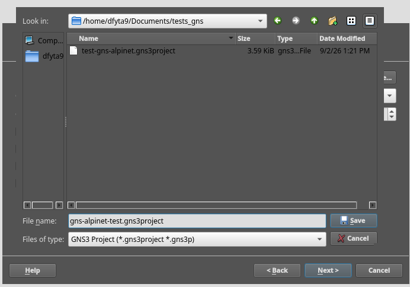

4. This step can be skipped, or customized if you'd like; once done, just click the "Finish" button.

   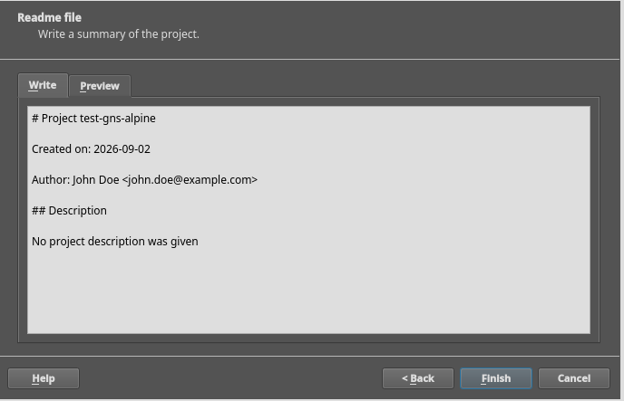

   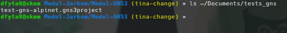

<br>

## Requirements

- Practitioners are **only** allowed to use the **netics-alpinet.gns3a** appliance

<br>

## Warnings, Advice, Tips, and Tricks

- Whatever is installed on a node is **not persistent**, meaning that when you work on that project again you will need to reinstall the application
- Therefore, **always** save the node's config to the `/root` directory before leaving the project
- You can put the command you always want to run on that node into the `/root/.bashrc` file, at the very bottom. (Example: the iptables and echo nameserver commands from earlier)

  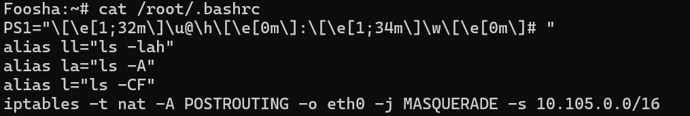

- Besides `/root/.bashrc`, you can add a startup script by placing the command in the `network config`, preceded by the word `up`, as in the following example:

  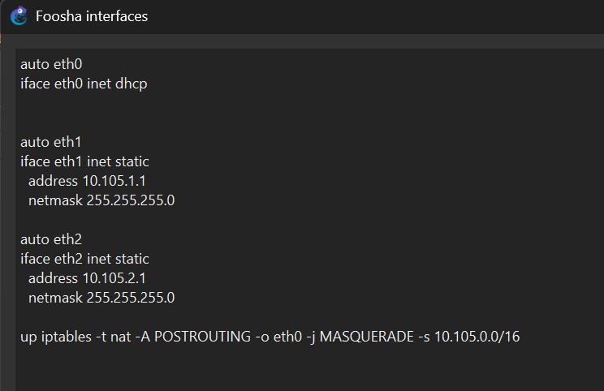

- You can export the project when working as a team by going to the `File` menu -> `Export portable project`
- If you are working using a VM on your own local machine, you can prevent losing applications or config files by turning off the VM in save state mode.
- Take advantage of bash scripting to install all the required applications so you don't have to enter commands one by one, then save them to `/root`.
- It is not recommended to use GNS3 on WSL or on Windows (GUI) _*if you run into problems, solve them yourself*_
- Something that normally works suddenly stopped working? Try turning off the VM first, then turning it back on. Still not working? Try another GNS3 installation method before asking the assistants.
- Can't install using one method? Try another installation method first before asking the assistants.

## Sources

- https://docs.gns3.com/docs/
