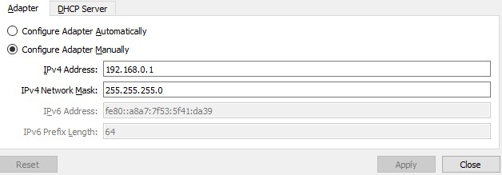

Modul Pengenalan GNS3
===============

- [Modul Pengenalan GNS3](#modul-pengenalan-gns3)
  - [Apakah GNS3 itu?](#apakah-gns3-itu)
  - [Instalasi GNS3](#instalasi-gns3)
    - [Menggunakan VM](#menggunakan-vm)
    - [Menggunakan Ubuntu](#menggunakan-ubuntu)
  - [Penggunaan GNS3](#penggunaan-gns3)
    - [Setup IP](#setup-ip)
      - [Pembagian Prefix IP](#pembagian-prefix-ip)
      - [Setup IP di Node](#setup-ip-di-node)
    - [Akses ke Internet](#akses-ke-internet)
  - [Sumber](#sumber)

## Apakah GNS3 itu?
**GNS3 (Graphical Network Simulator-3)** adalah alat yang membantu Anda untuk bisa menjalankan sebuah simulasi dari topologi kecil yang hanya terdiri dari beberapa alat saja di komputer Anda sampai dengan topologi yang memiliki banyak alat yang di-hosting di beberapa server.

## Instalasi GNS3
### Menggunakan VM
- Install VirtualBox
Silahkan mendownload dari [link berikut.](https://www.oracle.com/virtualization/technologies/vm/downloads/virtualbox-downloads.html)

- Download Image VM GNS3
Silahkan mendowload dari [link berikut](https://github.com/GNS3/gns3-gui/releases/download/v2.2.19/GNS3.VM.VirtualBox.2.2.19.zip). Sehabis itu langsung saja extract.

- Import file .ova ke VirtualBox

- Membuat host network adapter baru
  - Pilih File Menu -> Host Network Manager  

  - Klik Create  

  - Lalu setting agar IPv4 Address adalah `192.168.0.1`, dan IPv4 Network Mask `255.255.255.0` lalu klik apply

- Ubah Network Adapter di VM 
  - Pergi ke Settings -> Network
  - Ubah Adapter 1 ke Host-only Adapter dan sesuaikan dengan host network yang telah dibuat sebelumnya

  - Dan ubah Adapter 2 menjadi NAT  

  - Lalu klik OK

- Jalankan VM
  - Maka VM seharusnya bisa menampilkan ini

  - Lalu buka alamat dengan keterangan "To launch the Web-UI" di browser

- Import image ubuntu
  - Klik `Go to preferences`
  - Klik `Docker`
  - Klik `Add Docker container template`
  - `Server type` pilih `Run this Docker container locally`
  - Klik `Docker Virtual Machine`, pilih `New image` isikan `kuuhaku86/gns3-ubuntu:1.0.0` di Image name

  - Klik `Container name` masukkan `ubuntu-1` sebagai nama container
  - Klik `Network adapters` dan masukkan angka 4 
  - Lalu klik tombol `Add template` di bawah sendiri

- Coba image yang telah di-import
  - Klik `Servers` di kiri atas
  - Klik `local`
  - Klik `Add blank project`
  - Masukkan nama project (terserah)
  - Klik `Add project`
  - Klik tombol `Add a node` di samping kiri  

  - Lalu tarik `ubuntu-1` ke area kosong di halaman
  - Tunggu sampai loading selesai
  - Jika berhasil akan menampilkan tampilan yang mirip dengan ini

  - Kita bisa start dengan klik kanan di node dan klik `Start`  

- Akses node
  - Bisa dilakukan dengan `Web console`   

  - Bisa dilakukan menggunakan command `telnet [IP VM] [Port node]` sesuai dengan di kanan, jika menggunakan contoh di gambar, maka commandnya adalah `telnet 192.168.0.16 5000`

  - Jika menggunakan telnet, hati-hati jika ingin keluar dari node. Gunakan `Ctrl + ]` lalu ketik quit untuk keluar dari node.
  - Jika command prompt tidak kunjung keluar, bisa klik enter berkali-kali sampai keluar

### Menggunakan Ubuntu

## Penggunaan GNS3

### Setup IP
Dalam praktikum jaringan komputer, Anda akan sering melakukan setting untuk IP dari node yang digunakan. Lalu untuk membedakan ip jaringan dari masing-masing kelompok, maka 2 oktet awal (Prefix IP) dari IP yang digunakan sudah ditentukan seperti di bawah.

#### Pembagian Prefix IP

**Kelas A** 
KELOMPOK | Prefix IP
---------|------------
A1 | 192.168
A2 | 10.0
A3 | 192.169
A4 | 10.1
A5 | 192.170
A6 | 10.2
A7 | 192.171
A8 | 10.3
A9 | 192.172
A10 | 10.4
A11 | 192.173
A12 | 10.5
A13 | 192.174
A14 | 10.6
A15 | 192.175

#### Setup IP di Node

- Klik kanan pada node, buka `Configure`
- Pada menu `General settings`, cari tombol Edit network configuration
- Di situ kalian bisa setup IP sesuai dengan interface yang digunakan. Interface adalah sesuatu yang digunakan untuk menghubungkan dua device

### Akses ke Internet

## Sumber
- https://docs.gns3.com/docs/