# Modul Pengenalan GNS3

- [Modul Pengenalan GNS3](#modul-pengenalan-gns3)
  - [Apakah GNS3 itu?](#apakah-gns3-itu)
  - [Instalasi GNS3 MacOS](#apakah-gns3-itu)
  - [Instalasi VMWare Workstation](#instalasi-gns3-macos)
  - [Instalasi VirtualBox](#instalasi-virtualbox)
  - [Instalasi GNS3 VM di VMWare](#instalasi-gns3-vm-di-vmware)
  - [Import GNS3 VM di VirtualBox](#import-gns3-vm-di-virtualbox)
  - [Instalasi GNS3 GUI](#instalasi-gns3-gui)
  - [Instalasi netics-pc appliance](#instalasi-netics-pc-appliance)
  - [Instalasi netics-pc appliance khusus web (MAC)](#instalasi-netics-pcappliance-khusus-web-mac)
    - [Catatan Penting penambahan Persisten Volumes untuk GNS3 Windows dan MAC](#catatan-penting-penambahan-persisten-volumes-untuk-gns3-windows-dan-mac)
    - [Uji singkat persistent volumes](#uji-singkat-persistent-volumes)
  - [Penggunaan GNS3](#penggunaan-gns3)
    - [Setup IP di Node](#setup-ip-di-node)
    - [Akses Sebuah Node ke Internet](#akses-sebuah-node-ke-internet)
    - [Membuat Topologi](#membuat-topologi)
  - [Cara export project gns3](#cara-export-project-gns3)
  - [Ketentuan](#ketentuan)
  - [Peringatan, Saran, Tips, dan Trik](#peringatan-saran-tips-dan-trik)
  - [Troubleshooting](#troubleshooting)
  - [Sumber](#sumber)

<br>

## Apakah GNS3 itu?

**GNS3 (Graphical Network Simulator-3)** adalah alat yang membantu Anda untuk bisa menjalankan sebuah simulasi dari topologi kecil yang hanya terdiri dari beberapa alat saja di komputer Anda sampai dengan topologi yang memiliki banyak alat yang di-hosting di beberapa server.

<br>

## Instalasi GNS3 Mac0S

Instalasi GNS3 untuk MacOS dapat melihat video youtube berikut:
<br>
[](https://youtu.be/7N_hJ5bOofg?si=thDG4ZY7FIdfaPlG)

> [!IMPORTANT]
> <b>Note: (Mohon dibaca sebelum melihat video)</b> 
> Silahkan mendownload file-file yang dibutuhkan di video di link berikut: [GNS3 MAC](https://drive.google.com/drive/folders/1rq2WIeBvOkhdIGJQKfNfvuk1pZfZzqb8?usp=sharing).
> Akan terdapat 2 file: `GNS3-3.zip` (image GNS3) dan `VMware-Fusion-13.6.4-24832108_universal.dmg` (VMWare)
>
> Beberapa perubahan dan langkah yang harus dilakukan pada video
> 1. `menit 5.23`: upgrade ke version 3.0.6
> 2. `menit 7.16`: poin 2 pake image "netics-pc” (bisa di skip dulu)

## Instalasi VMWare Workstation
1. Buka situs web https://support.broadcom.com/ lalu daftarkan akun baru (disarankan menggunakan email pribadi).
2. Buka menu **VMWare Cloud Foundation → My Downloads → Free Software Downloads** untuk mengakses daftar software yang tersedia secara gratis.

   

   

3. Pilih menu **VMWare Workstation Pro**, lalu tentukan versi yang akan diinstal. Untuk Windows, disarankan memilih **VMWare Workstation Pro 17.0 for Windows** versi terbaru.

   

   

4. Centang box **Terms & Conditions**, lalu lengkapi data screening untuk memulai proses instalasi.

   

<br>

## Instalasi VirtualBox

Silahkan mendownload dari link berikut 

- [VirtualBox 7.0](https://www.oracle.com/virtualization/technologies/vm/downloads/virtualbox-downloads.html).

Pilih versi VirtualBox yang sesuai dengan jenis dari OS anda.

<br>

## Instalasi GNS3 VM di VMWare
1. Buka tautan GitHub berikut https://github.com/gns3/gns3-gui/releases?page=2#release-v3.0.6, lalu unduh file **GNS3-3.0.6-all-in-one.exe** dan **GNS3.VM.VMware.Workstation.3.0.6.zip**.

   

2. Ekstrak file **GNS3.VM.VirtualBox.2.2.61.zip** yang telah diunduh.

3. Buka VMWare Workstation, lalu pilih menu **File → Open** dan pilih file **.ova** dari folder hasil ekstraksi.

   

4. Setelah proses import berhasil, nyalakan virtual machine dan tunggu hingga alamat IP beserta port GNS3 muncul. Catat alamat IP beserta port tersebut, karena keduanya akan digunakan untuk terhubung dengan GNS3 GUI.

   

5. Jika muncul kendala saat menyalakan virtual machine, buka menu **Settings → Processors**, lalu hapus tanda centang pada opsi **Virtualize Intel VT-x/EPT or AMD-V/RVI**.

   

<br>

## Import GNS3 VM di VirtualBox

1. Download Image VM GNS3
   Silahkan mendowload dari link berikut [GNS3 VM 3.0.6](https://github.com/GNS3/gns3-gui/releases/download/v3.0.6/GNS3.VM.VirtualBox.3.0.6.zip). Sehabis itu langsung saja extract.

2. Import file .ova ke VirtualBox


3.  Membuat host network adapter baru

- Pilih File Menu -> Host Network Manager <br/>
  
- Klik Create <br/>
  
- Lalu setting agar IPv4 Address adalah `192.168.0.1`, dan IPv4 Network Mask `255.255.255.0` lalu klik apply
  
  

4. Ubah Network Adapter di VM

- Pergi ke Settings -> Network
- Ubah Adapter 1 ke Host-only Adapter dan sesuaikan dengan host network yang telah dibuat sebelumnya
  
- Dan ubah Adapter 2 menjadi NAT <br/>
  
- Agar Web-UI dari gns3 dapat diakses pada browser host, tambahkan `port forwarding`(pada dropdown `Advance`) untuk port 80 pada guest, dengan begitu gns3 dapat diakses melalui `127.0.0.1:80` <br/>
  
- Lalu klik OK

5.  Jalankan VM

- Maka VM seharusnya bisa menampilkan ini
  

<br>

## Instalasi GNS3 GUI (Untuk MAC silahkan menggunakan GNS3 Web UI, tidak menggunakan GNS3 GUI Desktop)
1. Jalankan file **.exe** GNS3 yang telah diunduh, lalu ikuti proses instalasi hingga selesai.

2. Buka menu **Edit → Preferences → Server → Remote servers**, lalu isi kolom **Host** dan **Port** dengan alamat IP dan port yang telah diperoleh dari GNS3 VM sebelumnya.

   

   

3. Untuk memulai proyek baru, pilih menu **File → New blank project**.

<br>

## Instalasi netics-pc appliance

1. Pilih menu **File → New Template**.

   

2. Pilih opsi **Import an appliance file**, lalu pilih berkas **netics-alpinet.gns3a** yang telah diunduh. Untuk berkas **netics-alpinet.gns3a** bisa anda dapatkan dari [sini](netics-pc-alpinet\netics-alpinet.gns3a)

   

3. Pilih opsi **Install appliance on a remote server**.

   

4. Pergi ke menu Edit dan pilih opsi **Preferences**

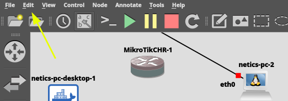 

Kemudian pergi ke **Docker Containers** dan cari docker container dengan nama `netics-pc`

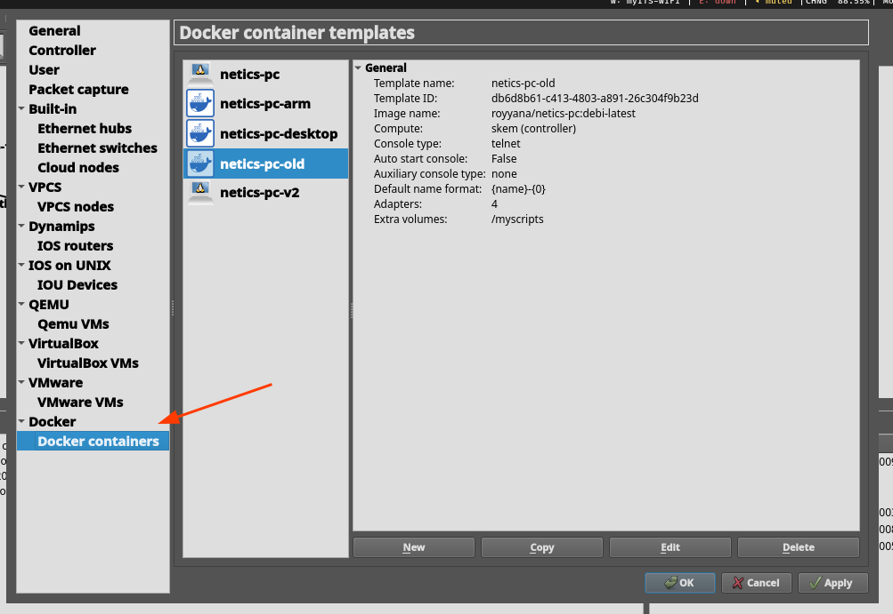
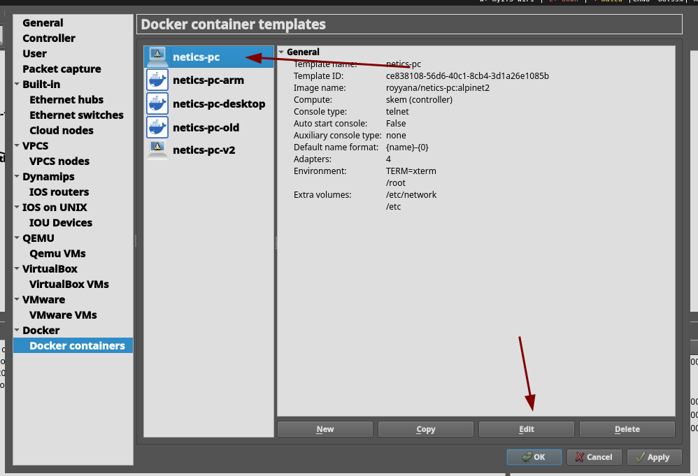

Dan klik tombol edit yang ada di bawah seperti gambar di atas, akan muncul pop up konfigurasi, klik yang bertuliskan **Advanced** dan pada box `Additional directories...` tambahkan value berikut:

```
/root
/etc/network
/etc
```

> [!IMPORTANT]
> Penambahan direktori-direktori diatas digunakan untuk **Persistent volumes** (data tetap tersimpan walau node sedang mati di direktori yang di pilih)

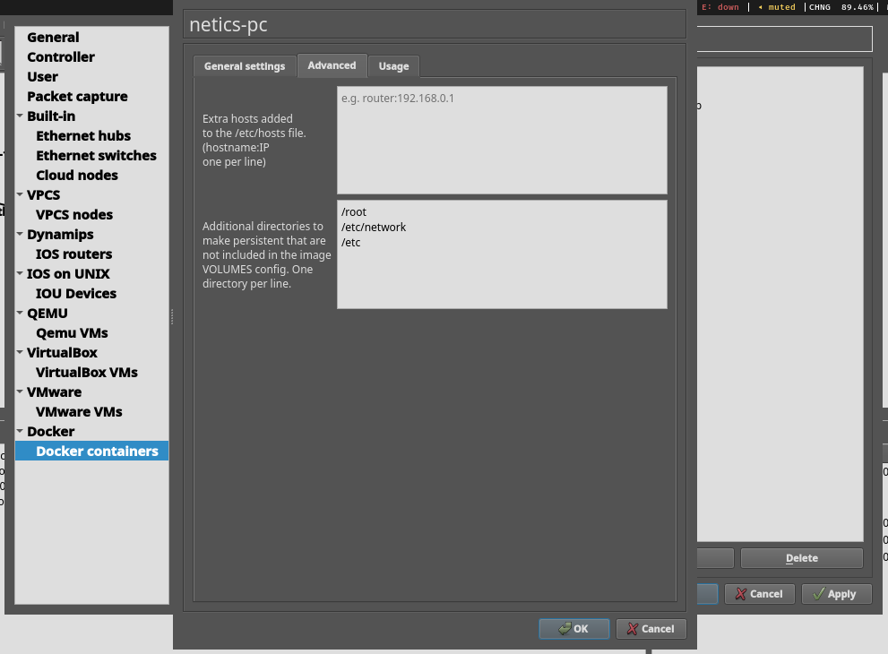

Jika sudah, klik tombol **OK**, kemudian klik tombol **Apply** dan setelah itu **OK**.

5. Drag and drop appliance **netics-pc** ke area kosong untuk mencoba.

   

Link download file netics-pc appliance [here](https://drive.google.com/file/d/1McrXZs10dDU1I_HDM-wd3iE4agobPEXd/view?usp=drive_link)

<br>

## Instalasi netics-pc appliance khusus web (MAC)

> [!IMPORTANT]
>
> Pastikan GNS3 VM nya sudah menyala

1. Untuk mac silahkan bisa mengakses GNS3 Web Interface melalui browser dengan mengetikkan IP yang diberikan di GNS3 VM nya

2. Klik icon GNS3 di pojok kiri atas, dan pilih menu `Template Preferences`

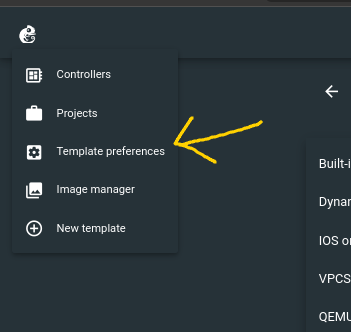 

3. Kemudian pilih menu `Docker`

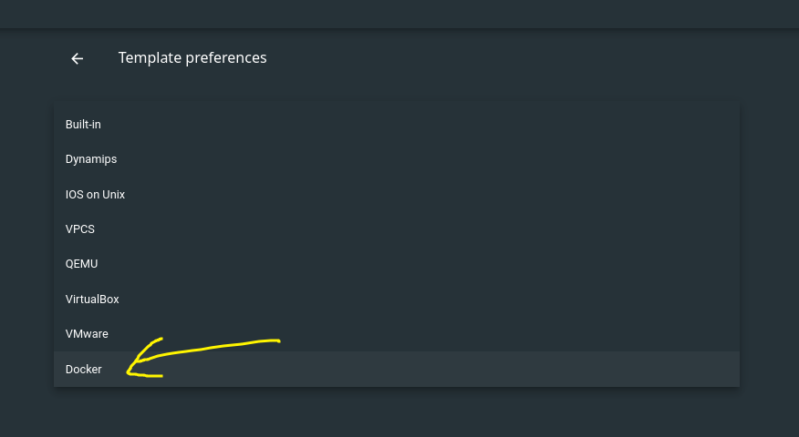 

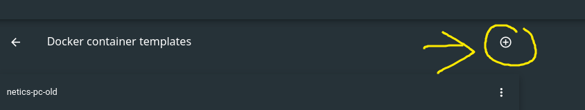 

4. Kemudian isi detail Docker Appliance nya seperti berikut (bisa melihat screenshot di bawah)

> Image netics-pc untuk yang menggunakan *MAC* `royyana/netics-pc:alpinet2-arm`
> Network Adapters : `4`
> Name : `netics-pc`
> Start Command : (blank)
> Console type : `telnet`
> Auxilarry Console type : `none`
> Environment :  (blank)

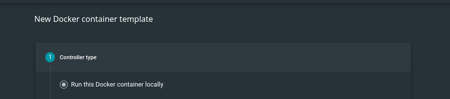
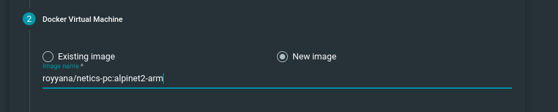
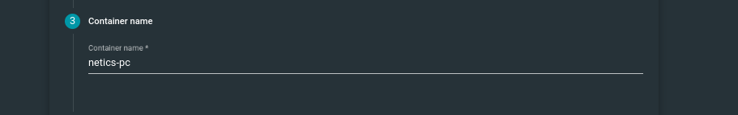
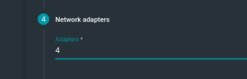
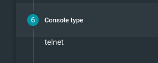
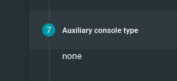

5. Setelah selesai, klik tombol `Add template` di pojok kanan bawah
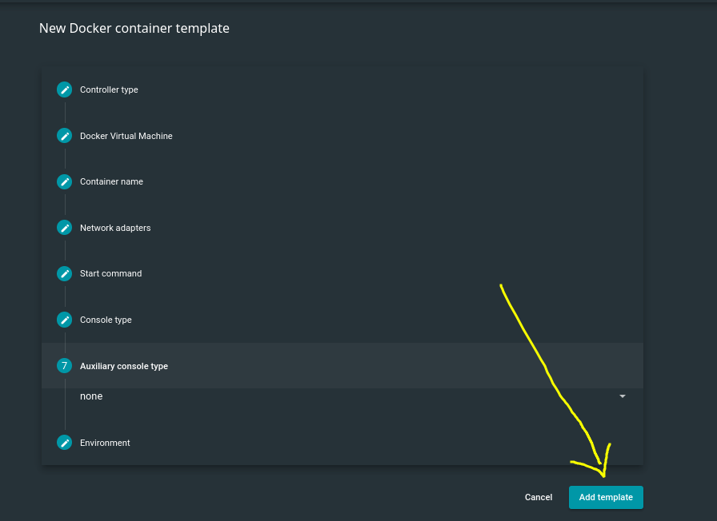

6. Setelah itu pergi ke project yang sudah dibuat atau blank project, dan drag n drop appliance netics-pc tadi ke area simulasi


> [!IMPORTANT]
> Langkah-langkah dibawah ini digunakan untuk menambahkan **Persistent volumes** pada `/root`, `/etc` dan `/etc/network`


Catat alamat `IP` dan `port` dari GNS3 server yang sudah berjalan dan mengetahui kredensial akun dan passwordnya, serta pastikan `curl` dan `python` sudah terinstall di lokal MAC anda.

> [!TIP]
> `<GNS3_IP>` dan `<GNS3_PORT>` harus diganti dengan nilai IP dan port yang asli, misalnya `172.16.53.150` dan `80`. Tanda kurung siku (`<` `>`) tidak boleh disertakan pada saat running command.

7. Jalankan perintah berikut untuk melakukan login dan memperoleh JSON Web Token (JWT): (ganti GNS3_USER dan GNS3_PW dengan kredensial username dan password yang ada di gns3 server)

```bash
curl -X POST http://<GNS3_IP>:<GNS3_PORT>/v3/access/users/login \
  -H "Content-Type: application/x-www-form-urlencoded" \
  -d "username=<GNS3_USER>&password=<GNS3_PW>"
```

Server akan memberikan respons berupa objek JSON yang memuat `access_token`, contoh:

```json
{"access_token": "eyJ0eXAiOiJKV1QiLCJhbGciOiJIUzI1NiJ9...", "token_type": "bearer"}
```

8. Salin nilai dari `access_token` tanpa menyertakan tanda kutipnya dan simpan ke dalam sebuah variabel environment

```bash
TOKEN_GNS3_JWT="<access_token>"
```

9. Jalankan perintah dibawah ini, kemudian cari `template_id` dari node / appliance yang bernama `netics-pc`

```bash
curl -H "Authorization: Bearer $TOKEN_GNS3_JWT" \
  http://<GNS3_IP>:<GNS3_PORT>/v3/templates | python3 -m json.tool
```

Temukan blok JSON yang mirip dengan potongan response seperti dibawah:

```json
{
    "template_id": "c4d71fb7-b835-49d9-9e34-1c45b47277ba",
    "name": "netics-pc",
    "template_type": "docker",
    "image": "royyana/netics-pc:alpinet2-arm",
    "extra_volumes": [],
    ...
}
```

Kemudian catat nilai `template_id` nya (salin ke clipboard atau yang lain)

10. Jalankan perintah dibawah ini, gunanya untuk menambahkan direktori yang akan dijadikan persisten (data tersimpan meskipun node mati pada direktori-direktori yang di set)

```bash
curl -X PUT http://<GNS3_IP>:<GNS3_PORT>/v3/templates/<template_id> \
  -H "Authorization: Bearer $TOKEN_GNS3_JWT" \
  -H "Content-Type: application/json" \
  -d '{"extra_volumes": ["/root", "/etc", "/etc/network"]}'
```

Extra volumes yang di set adalah direktori-direktori berikut (dapat digunakan untuk menyimpan script otomasi):
```
/root
/etc/network
/etc
```

11. Verifikasi perubahan appliance netics-pc dengan perintah dibawah:

```bash
curl -H "Authorization: Bearer $TOKEN_GNS3_JWT" \
  http://<GNS3_IP>:<GNS3_PORT>/v3/templates/<template_id> | python3 -m json.tool
```

Pastikan output dari command diatas mirip seperti di bawah ini:

```json
{
    "environment": "",
    "console_type": "telnet",
    "aux_type": "none",
    "console_auto_start": false,
    "console_http_port": 80,
    "console_http_path": "/",
    "console_resolution": "1024x768",
    "extra_hosts": "",
    "extra_volumes": [
        "/root",
        "/etc",
        "/etc/network"
    ],
    "memory": 0,
    "cpus": 0.0,
    "custom_adapters": []
}
```

Pastikan blok `extra_volumes` terdapat 3 direktori yang diset sebelumnya


> [!IMPORTANT]
> Ditunggu saja kalau agak lama muncul netics-pc nya (tolong diabaikan nama netics-pc yang ada di gambar bawah, instalasi nya tetap menggunakan `netics-pc`, bukan `netics-pc-arm`)


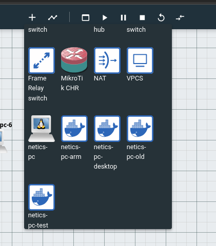
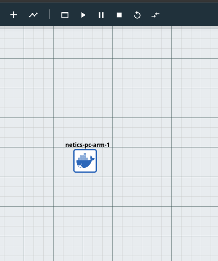

<br>

### Catatan Penting penambahan Persisten Volumes untuk GNS3 Windows dan MAC

> [!TIP]
> Pembaruan pada template **tidak** secara otomatis memengaruhi node yang telah ada sebelumnya di dalam suatu topology. Apabila sebuah node yang dibuat dari template ini telah ada dalam suatu project, langkah-langkah berikut perlu dilakukan:

1. Hentikan (stop) node tersebut.
2. Hapus node tersebut dari topology. Tindakan ini tidak menghapus Docker image yang mendasarinya; hanya instance container yang sedang berjalan yang akan dihapus.
3. Tarik (drag) instance baru dari template tersebut ke dalam topology.
4. Jalankan (start) node yang baru dibuat. Extra volumes akan ter-mount sebagaimana mestinya.

### Uji singkat persistent volumes

1. Drag&Drop dan jalankan node netics-pc, kemudian buka console-nya.
2. Buat sebuah file pada salah satu direktori extra volume:
   ```bash
   echo "hello" > /root/testfile.txt
   ```
3. Pada Web UI/GNS3 Desktop, h1. Jalankan node, kemudian buka console-nya.

4. Periksa apakah file tersebut masih ada:
   ```bash
   cat /root/testfile.txt
   ```
Apabila file tersebut masih ada, maka persistensi telah terkonfirmasi berfungsi.
``
<br>

## Penggunaan GNS3

### Setup IP di Node
1. Klik kanan pada node, buka `Configure`
2. Pada menu `General settings`, cari tombol `Edit network configuration`
3. Di situ kalian bisa setup IP sesuai dengan interface yang digunakan. Interface adalah sesuatu yang digunakan untuk menghubungkan dua device

### Akses Sebuah Node ke Internet

1. Tarik NAT ke area kosong
2. Hubungkan NAT ke netics-pc dengan link

   

3. Klik menu **Show/Hide interface labels** untuk menampilkan informasi interface node

   

4. Lalu klik node, pilih interface `eth0`, dan klik node NAT yang ditarik tadi

   

5. Lalu konfigurasi IP dari node netics-pc

Klik kanan pada node netics-pc-1 dan pilih **Configure** dan tekan tombol **Edit** pada bagian Network Configuration.

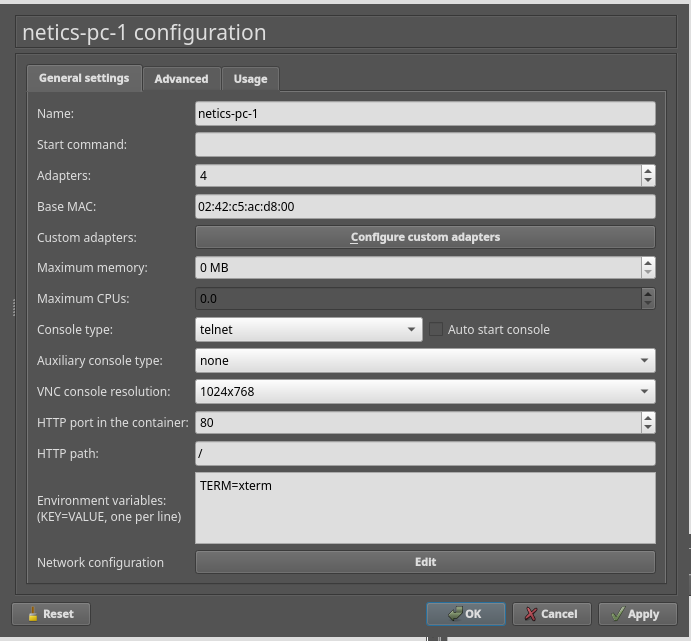 

- Cari 2 line yang seperti ini

```
# auto eth0
# iface eth0 inet dhcp
```

- Uncomment kedua line tersebut, lalu save

```
auto eth0
iface eth0 inet dhcp
```

6. Start node
7. Akses console dari node, dan coba ping ke google, jika berhasil maka settingan Anda benar

   

8. Node ini akan nanti digunakan sebagai router untuk modul ini, ganti nama node ini menjadi `Foosha` dengan fitur `Change hostname` di node, dan juga ganti symbol ke simbol router dengan fitur `Change symbol`

<br>

### Membuat Topologi

1. Tambahkan beberapa node ethernet switch dan ubuntu, lalu buat hubungan antar node dan nama-nama dari node hingga seperti di gambar

   

2. Gunakan fitur `Change hostname` untuk merubah nama-nama dari node
3. Lalu kita setting network masing-masing node dengan fitur `Edit network configuration` seperti yang ditunjukkan [disini](#setup-ip-di-node) sebelumnya, kita bisa menghapus semua settingnya dan mengisi dengan settingan di bawah

- Foosha

```
auto eth0
iface eth0 inet dhcp

auto eth1
iface eth1 inet static
	address [Prefix IP].1.1
	netmask 255.255.255.0

auto eth2
iface eth2 inet static
	address [Prefix IP].2.1
	netmask 255.255.255.0
```

- Loguetown

```
auto eth0
iface eth0 inet static
	address [Prefix IP].1.2
	netmask 255.255.255.0
	gateway [Prefix IP].1.1
```

- Alabasta

```
auto eth0
iface eth0 inet static
	address [Prefix IP].1.3
	netmask 255.255.255.0
	gateway [Prefix IP].1.1
```

- EniesLobby

```
auto eth0
iface eth0 inet static
	address [Prefix IP].2.2
	netmask 255.255.255.0
	gateway [Prefix IP].2.1
```

- Water7

```
auto eth0
iface eth0 inet static
	address [Prefix IP].2.3
	netmask 255.255.255.0
	gateway [Prefix IP].2.1
```

**Penjelasan Pengertian**

- **Gateway**: Jalur pada jaringan yang harus dilewati paket-paket data untuk dapat masuk ke jaringan yang lain.

4. Restart semua node
5. Cek semua node ubuntu apakah sudah memiliki ip yang sesuai dengan settingan dengan command `ip a`. Berikut adalah contoh untuk node `Foosha` dengan Prefix IP `10.105`, sesuaikan dengan Prefix IP kelompok kalian masing-masing

   

6. Topologi yang dibuat sudah bisa berjalan secara lokal, tetapi kita belum bisa mengakses jaringan keluar. Maka kita perlu melakukan beberapa hal.
- Install tool iptables
  ```
  apk update
  apk add iptables
  ```
- Ketikkan **`iptables -t nat -A POSTROUTING -o eth0 -j MASQUERADE -s [Prefix IP].0.0/16`** pada router `Foosha`
  **Keterangan:**
  - **iptables:** iptables merupakan suatu tools dalam sistem operasi Linux yang berfungsi sebagai filter terhadap lalu lintas data. Dengan iptables inilah kita akan mengatur semua lalu lintas dalam komputer, baik yang masuk, keluar, maupun yang sekadar melewati komputer kita. Untuk penjelasan lebih lanjut nanti akan dibahas pada Modul 5.
  - **NAT (Network Address Translation):** Suatu metode penafsiran alamat jaringan yang digunakan untuk menghubungkan lebih dari satu komputer ke jaringan internet dengan menggunakan satu alamat IP.
  - **Masquerade:** Digunakan untuk menyamarkan paket, misal mengganti alamat pengirim dengan alamat router.
  - **-s (Source Address):** Spesifikasi pada source. Address bisa berupa nama jaringan, nama host, atau alamat IP.
- Ketikkan command `cat /etc/resolv.conf` di `Foosha`

  

- Ingat-ingat IP tersebut karena IP tersebut merupakan IP DNS, lalu ketikkan command ini di node ubuntu yang lain `echo nameserver [IP DNS] > /etc/resolv.conf`. Jika pada kasus contoh maka command-nya adalah `echo nameserver 192.168.153.2 > /etc/resolv.conf`.
- Berikut merupakan contoh saat melakukan ping sebelum dan sesudah menambahkan nameserver pada node Water7

  

- Semua node sekarang seharusnya sudah bisa melakukan ping ke google, yang artinya adalah sudah tersambung ke internet

<br>

## Cara export project gns3

1. Di gns3 desktop, cari pilihan menu **File**, kemudian cari menu **Export Project**

 

2. Kemudian akan muncul pop up untuk konfigurasi dan preferensi cara export project, disini kalian pilih tipe kompresi **bzip2 compression** dan untuk level compression nya dibiarkan default value nya 9 saja


3. Kemudian pilih path folder dan juga nama dari export project gns


4. Untuk step ini bisa diabaikan saja atau kalau mau di-custom juga diperbolehkan, kalau sudah tinggal tekan tombol "Finish" saja

 


<br>

## Ketentuan

- Praktikan **hanya** diperbolehkan menggunakan appliances **netics-alpinet.gns3a**

<br>

## Peringatan, Saran, Tips, dan Trik

- Apa yang diinstal di node **tidak persisten**, artinya saat Anda mengerjakan project tersebut lagi Anda perlu menginstal aplikasi itu kembali
- Maka **selalu** simpan config di node ke directory `/root` sebelum keluar dari project
- Anda bisa memasukkan command yang ingin selalu dijalankan di node tersebut ke file `/root/init.sh` di bagian paling bawah. (Contoh : command iptables dan echo nameserver tadi)
  
  

> [!TIP]
> Direktori yang dijadikan persisten volume pada appliance netics-pc adalah `/root`, `/etc` dan `/etc/network`

> [!IMPORTANT]
> Jalankan `chmod +x /root/init.sh` agar file bash init dapat dijalankan setiap kali node di start atau restart.

- selain `/root/init.sh`, anda dapat menambahkan startup script dengan meletakkan command pada `network config` dengan didahului kata `up` atau memodifikasi file `/etc/network/interfaces` seperti contoh berikut:

  

- Anda bisa melakukan ekspor project jika bekerja secara tim dengan pergi ke menu `File` -> `Export portable project`
- Jika mengerjakan menggunakan VM di local kalian sendiri. Kalian bisa mencegah hilangnya aplikasi atau file config dengan mematikan VM di mode save state.
- Manfaatkan bash scripting untuk install-install aplikasi yang diperlukan sehingga tidak perlu memasukkan command satu-satu, lalu save ke `/root`.
- Tidak disarankan untuk menggunakan gns3 pada WSL ataupun windows(GUI) _*jika-ada-masalah-selesaikan-sendiri*_
- Ada sesuatu yang biasanya bisa tetapi tiba-tiba tidak bisa? Coba matikan dulu VM nya baru nyalakan kembali. Masih tidak bisa? Coba cara install GNS3 yang lain dahulu sebelum bertanya ke asisten.
- Tidak bisa install di satu metode? Coba cara install yang lain dulu sebelum bertanya ke asisten.

## Troubleshooting

- _[UNTUK VIRTUALBOX]_ jika gns3 tidak dapat terkoneksi dengan internet,<br>
  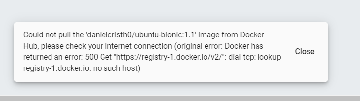
  coba ganti Network Adapter 2 Dari `NAT` menjadi `Bridged Adapter`, kemudian pada dropdown `Advanced` ubah `Promiscuous Mode` menjadi `Allow All` serta pastikan `Cable Connected` diaktifkan <br>
  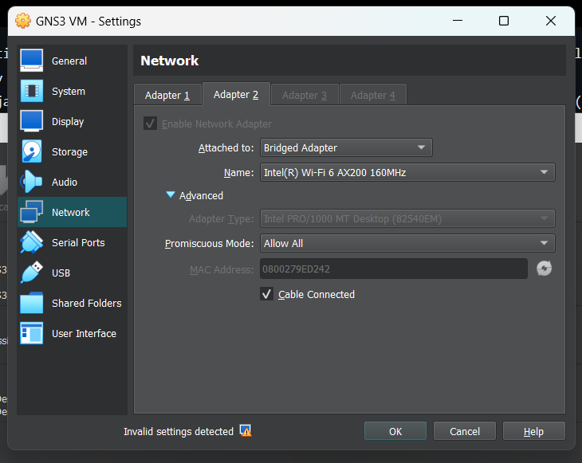
- Ada sesuatu yang biasanya bisa tetapi tiba-tiba tidak bisa? Coba matikan dulu VM nya baru nyalakan kembali. Masih tidak bisa? Coba cara instal GNS3 yang lain dahulu sebelum bertanya ke asisten.
- Tidak bisa instal di satu metode? Coba cara instal yang lain dulu sebelum bertanya ke asisten.
- Jika terjadi error 404 ketika akan meng-export project, <br>
  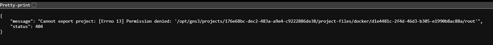
  - pertama, masuk kedalam terminal dengan memilih opsi shell pada GUI:<br>
    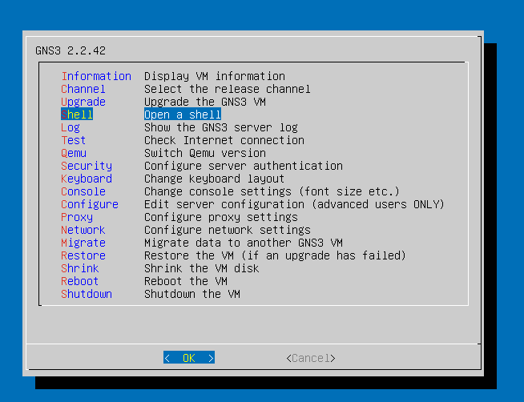
  - kemudian ubah permission directory penyimpanan project gns3 (sesuai path yang muncul pada error) dengan command `sudo chown -R gns3:gns3 /path/to/directory` <br>
    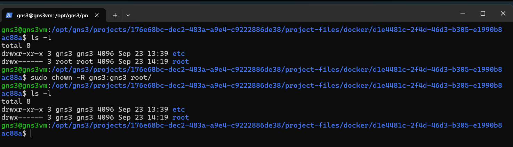

## Sumber

- https://docs.gns3.com/docs/
