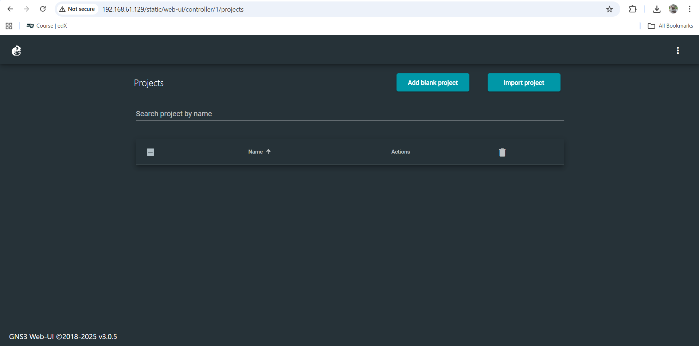

# Modul Pengenalan GNS3

- [Modul Pengenalan GNS3](#modul-pengenalan-gns3)
  - [Apakah GNS3 itu?](#apakah-gns3-itu)
  - [Instalasi GNS3](#instalasi-gns3)
    - [Import Image di VirtualBox](#import-image-di-virtualbox)
    - [Import Image di VMWare](#import-image-di-vmware)
    - [Memasukkan Image Ubuntu ke GNS3](#memasukkan-image-ubuntu-ke-gns3)
  - [Penggunaan GNS3](#penggunaan-gns3)
    - [Setup IP di Node](#setup-ip-di-node)
    - [Akses Sebuah Node ke Internet](#akses-sebuah-node-ke-internet)
    - [Membuat Topologi](#membuat-topologi)
  - [Ketentuan](#ketentuan)
  - [Peringatan, Saran, Tips, dan Trik](#peringatan-saran-tips-dan-trik)
  - [Troubleshooting](#troubleshooting)
  - [Sumber](#sumber)

## Apakah GNS3 itu?

**GNS3 (Graphical Network Simulator-3)** adalah alat yang membantu Anda untuk bisa menjalankan sebuah simulasi dari topologi kecil yang hanya terdiri dari beberapa alat saja di komputer Anda sampai dengan topologi yang memiliki banyak alat yang di-hosting di beberapa server.

## Instalasi GNS3

### Instalasi GNS3 Mac0S

Instalasi GNS3 untuk MacOS dapat melihat video youtube berikut:
<br>
[](https://youtu.be/7N_hJ5bOofg?si=thDG4ZY7FIdfaPlG)

<b>Note:</b> Khusus untuk Mac dengan processor Intel, dapat mendownload image yang sama seperti windows dengan link berikut
[GNS3 VM 2.2.42](https://github.com/GNS3/gns3-gui/releases/download/v2.2.42/GNS3.VM.VirtualBox.2.2.42.zip). Sehabis itu langsung saja extract.

### Instalasi GNS3 Windows

Instalasi GNS3 untuk Windows dapat melihat video youtube berikut:
<br>
[](https://youtu.be/2RNlsxK0AzY?si=KkeadApIC3U9C-ke)

<b>Note:</b> Video ini mengikuti penginstalan GNS 3 dengan VMWare, langkah-langkah secara poin terdapat pada [Import Image di VMWare](#import-image-di-vmware).

### Import Image di VirtualBox

1. Install VirtualBox
   Silahkan mendownload dari link berikut [VirtualBox 7.0](https://www.oracle.com/virtualization/technologies/vm/downloads/virtualbox-downloads.html).

2. Download Image VM GNS3
   Silahkan mendowload dari link berikut [GNS3 VM 3.0.5](https://github.com/GNS3/gns3-gui/releases/download/v3.0.5/GNS3.VM.VMware.Workstation.3.0.5.zip). Sehabis itu langsung saja extract.

3. Import file .ova ke VirtualBox


4.  Membuat host network adapter baru

- Pilih File Menu -> Host Network Manager <br/>
  
- Klik Create <br/>
  
- Lalu setting agar IPv4 Address adalah `192.168.0.1`, dan IPv4 Network Mask `255.255.255.0` lalu klik apply
  
  

5. Ubah Network Adapter di VM

- Pergi ke Settings -> Network
- Ubah Adapter 1 ke Host-only Adapter dan sesuaikan dengan host network yang telah dibuat sebelumnya
  
- Dan ubah Adapter 2 menjadi NAT <br/>
  
- Agar Web-UI dari gns3 dapat diakses pada browser host, tambahkan `port forwarding`(pada dropdown `Advance`) untuk port 80 pada guest, dengan begitu gns3 dapat diakses melalui `127.0.0.1:80` <br/>
  
- Lalu klik OK

6.  Jalankan VM

- Maka VM seharusnya bisa menampilkan ini
  
- Lalu buka alamat dengan keterangan "To launch the Web-UI" di browser
  

Setelah itu silahkan lanjutkan untuk mengimpor image Ubuntu ke GNS3 [disini](#memasukkan-image-ubuntu-ke-gns3)

### Import Image di VMWare

1. Install VMWare
   Silahkan mendownload dari [VMware Workstation 17](https://www.vmware.com/products/workstation-pro/workstation-pro-evaluation.html).

2. Download Image VM GNS3
   Silahkan mendowload dari [GNS3 VM 3.0.5](https://github.com/GNS3/gns3-gui/releases/download/v3.0.5/GNS3.VM.VMware.Workstation.3.0.5.zip). Sehabis itu langsung saja extract.

3. Import file .ova ke VMWare dan namai VM.


4. Sesuaikan settingan VMWare dengan klik `Edit virtual machine settings`.

- Pastikan settingan Network sudah sesuai.


- Jika ada error `Virtualized ... Not Supported on Platform` saat vm nanti dijalankan, coba disable virtualisasi di settingan processor


5.  Jalankan VM

- Maka VM seharusnya bisa menampilkan ini
  
- Lalu buka alamat dengan keterangan "To launch the Web-UI" di browser
- Jika diminta masukkan username dan password, bisa menggunakan credentials default pada tampilan gns vmware.
  

Setelah itu silahkan lanjutkan untuk mengimpor image Ubuntu ke GNS3 [disini](#memasukkan-image-ubuntu-ke-gns3)

### Memasukkan Image Ubuntu ke GNS3

1. Import image ubuntu

- Klik `Open menu`
  <br>
- Klik `Template preferences`
  <br>
- Klik `Docker`
- Klik `Add Docker container template`
  <br>
- `Server type` pilih `Run this Docker container locally`
- Klik `Docker Virtual Machine`, pilih `New image` isikan `royyana/netics-pc:debi-latest` di Image name<br>
  
- Klik `Container name` masukkan `netics-pc` sebagai nama container
- Klik `Network adapters` dan masukkan angka 4
- Kosongi bagian `Start command`.
- Lalu klik tombol `Add template` di bawah sendiri

2. Coba image yang telah di-import

- Klik `Projects` di kiri atas
- Klik `Add blank project`
- Masukkan nama project (terserah)
- Klik `Add project`
- Klik tombol + `Add a node` di samping kiri <br/>
  
- Lalu tarik `netics-pc` ke area kosong di halaman
- Tunggu sampai loading selesai
- Jika berhasil akan menampilkan tampilan yang mirip dengan ini
  
- Kita bisa start dengan klik kanan di node dan klik `Start` <br/>
  

3. Akses node

- Bisa dilakukan dengan `Web console` <br/>
  
- Bisa dilakukan menggunakan command `telnet [IP VM] [Port node]` di terminal lokal pc kita, jika menggunakan contoh di gambar, maka commandnya adalah `telnet 192.168.61.129 5000`

  
- Jika menggunakan telnet, hati-hati jika ingin keluar dari node. Gunakan `Ctrl + ]` lalu ketik quit untuk keluar dari node.
- Jika command prompt tidak kunjung keluar, bisa klik enter berkali-kali sampai keluar

## Penggunaan GNS3

### Setup IP di Node

1. Klik kanan pada node, buka `Configure`
2. Pada menu `General settings`, cari tombol `Edit network configuration`
3. Di situ kalian bisa setup IP sesuai dengan interface yang digunakan. Interface adalah sesuatu yang digunakan untuk menghubungkan dua device

### Akses Sebuah Node ke Internet

1. Buka menu Add a Node
2. Tarik NAT ke area kosong <br/>
   
3. Gunakan aktifkan menu `Add a Link` <br/>
   
4. Lalu klik node, pilih interface `eth0`, dan klik node NAT yang ditarik tadi <br/>
   
5. Lalu konfigurasi IP dari node netics-pc

- Cari 2 line yang seperti ini

```
# auto eth0
# iface eth0 inet dhcp
```

- Uncomment kedua line tersebut, lalu save

```
auto eth0
iface eth0 inet dhcp
```

6. Start node
7. Akses console dari node, dan coba ping ke google, jika berhasil maka settingan Anda benar
   
8. Node ini akan nanti digunakan sebagai router untuk modul ini, ganti nama node ini menjadi `Foosha` dengan fitur `Change hostname` di node, dan juga ganti symbol ke simbol router dengan fitur `Change symbol`

### Membuat Topologi

1. Tambahkan beberapa node ethernet switch dan ubuntu, lalu buat hubungan antar node dan nama-nama dari node hingga seperti di gambar <br/>
   
2. Gunakan fitur `Change hostname` untuk merubah nama-nama dari node
3. Lalu kita setting network masing-masing node dengan fitur `Edit network configuration` seperti yang ditunjukkan [disini](#setup-ip-di-node) sebelumnya, kita bisa menghapus semua settingnya dan mengisi dengan settingan di bawah

- Foosha

```
auto eth0
iface eth0 inet dhcp

auto eth1
iface eth1 inet static
	address [Prefix IP].1.1
	netmask 255.255.255.0

auto eth2
iface eth2 inet static
	address [Prefix IP].2.1
	netmask 255.255.255.0
```

- Loguetown

```
auto eth0
iface eth0 inet static
	address [Prefix IP].1.2
	netmask 255.255.255.0
	gateway [Prefix IP].1.1
```

- Alabasta

```
auto eth0
iface eth0 inet static
	address [Prefix IP].1.3
	netmask 255.255.255.0
	gateway [Prefix IP].1.1
```

- EniesLobby

```
auto eth0
iface eth0 inet static
	address [Prefix IP].2.2
	netmask 255.255.255.0
	gateway [Prefix IP].2.1
```

- Water7

```
auto eth0
iface eth0 inet static
	address [Prefix IP].2.3
	netmask 255.255.255.0
	gateway [Prefix IP].2.1
```

**Penjelasan Pengertian**

- **Gateway**: Jalur pada jaringan yang harus dilewati paket-paket data untuk dapat masuk ke jaringan yang lain.

4. Restart semua node
5. Cek semua node ubuntu apakah sudah memiliki ip yang sesuai dengan settingan dengan command `ip a`. Berikut adalah contoh untuk node `Foosha` dengan Prefix IP `10.40`, sesuaikan dengan Prefix IP kelompok kalian masing-masing
   
6. Topologi yang dibuat sudah bisa berjalan secara lokal, tetapi kita belum bisa mengakses jaringan keluar. Maka kita perlu melakukan beberapa hal.
- Install tool iptables
  ```
  apt update
  apt install iptables
  ```
- Ketikkan **`iptables -t nat -A POSTROUTING -o eth0 -j MASQUERADE -s [Prefix IP].0.0/16`** pada router `Foosha`
  **Keterangan:**
  - **iptables:** iptables merupakan suatu tools dalam sistem operasi Linux yang berfungsi sebagai filter terhadap lalu lintas data. Dengan iptables inilah kita akan mengatur semua lalu lintas dalam komputer, baik yang masuk, keluar, maupun yang sekadar melewati komputer kita. Untuk penjelasan lebih lanjut nanti akan dibahas pada Modul 5.
  - **NAT (Network Address Translation):** Suatu metode penafsiran alamat jaringan yang digunakan untuk menghubungkan lebih dari satu komputer ke jaringan internet dengan menggunakan satu alamat IP.
  - **Masquerade:** Digunakan untuk menyamarkan paket, misal mengganti alamat pengirim dengan alamat router.
  - **-s (Source Address):** Spesifikasi pada source. Address bisa berupa nama jaringan, nama host, atau alamat IP.
- Ketikkan command `cat /etc/resolv.conf` di `Foosha` <br/>
  
- Ingat-ingat IP tersebut karena IP tersebut merupakan IP DNS, lalu ketikkan command ini di node ubuntu yang lain `echo nameserver [IP DNS] > /etc/resolv.conf`. Jika pada kasus contoh maka command-nya adalah `echo nameserver 192.168.122.1 > /etc/resolv.conf`.
- Berikut merupakan contoh saat melakukan ping sebelum dan sesudah menambahkan nameserver pada node Water7<br>
  
- Semua node sekarang seharusnya sudah bisa melakukan ping ke google, yang artinya adalah sudah tersambung ke internet

## Ketentuan

- Praktikan **hanya** diperbolehkan menggunakan image docker `royyana/netics-pc:debi-latest`

## Peringatan, Saran, Tips, dan Trik

- Apa yang diinstal di node **tidak persisten**, artinya saat Anda mengerjakan project tersebut lagi Anda perlu menginstal aplikasi itu kembali
- Maka **selalu** simpan config di node ke directory `/root` sebelum keluar dari project
- Anda bisa memasukkan command yang ingin selalu dijalankan di node tersebut ke file `/root/.bashrc` di bagian paling bawah. (Contoh : command iptables dan echo nameserver tadi)</br>
  
- selain `/root/.bashrc`, anda dapat menambahkan startup script dengan meletakkan command pada `network config` dengan didahului kata `up` seperti contoh berikut:<br>
  
- Anda bisa melakukan ekspor project jika bekerja secara tim dengan pergi ke menu `Project settings` -> `Export portable project`.</br>
  
- Jika mengerjakan menggunakan VM di local kalian sendiri. Kalian bisa mencegah hilangnya aplikasi atau file config dengan mematikan VM di mode save state.
- Manfaatkan bash scripting untuk install-install aplikasi yang diperlukan sehingga tidak perlu memasukkan command satu-satu, lalu save ke `/root`.
- Tidak disarankan untuk menggunakan gns3 pada WSL ataupun windows(GUI) _*jika-ada-masalah-selesaikan-sendiri*_

## Troubleshooting

- _[UNTUK VIRTUALBOX]_ jika gns3 tidak dapat terkoneksi dengan internet,<br>
  
  coba ganti Network Adapter 2 Dari `NAT` menjadi `Bridged Adapter`, kemudian pada dropdown `Advanced` ubah `Promiscuous Mode` menjadi `Allow All` serta pastikan `Cable Connected` diaktifkan <br>
  
- Ada sesuatu yang biasanya bisa tetapi tiba-tiba tidak bisa? Coba matikan dulu VM nya baru nyalakan kembali. Masih tidak bisa? Coba cara instal GNS3 yang lain dahulu sebelum bertanya ke asisten.
- Tidak bisa instal di satu metode? Coba cara instal yang lain dulu sebelum bertanya ke asisten.
- Jika terjadi error 404 ketika akan meng-export project, <br>
  
  - pertama, masuk kedalam terminal dengan memilih opsi shell pada GUI:<br>
    
  - kemudian ubah permission directory penyimpanan project gns3 (sesuai path yang muncul pada error) dengan command `sudo chown -R gns3:gns3 /path/to/directory` <br>
    

## Sumber

- https://docs.gns3.com/docs/
