# MODUL WIRESHARK dan CRIMPING

## 1. WIRE CRIMPING
Dalam membangun jaringan komputer, tentunya dibutuhkan segala hal yang dapat menghubungkan perangkat-perangkat komputer yang ada. Hingga saat ini, komponen paling fundamental dalam jaringan komputer adalah kabel. Sekalipun teknologi nirkabel sudah lama ditemukan dan dikembangkan, tapi peran kabel jaringan tetap belum bisa tergantikan. Oleh karena itu di sini kita akan belajar bagaimana membuat kabel jaringan (dalam hal ini kabel UTP) menjadi fungsional.

__1. *Kebutuhan*__

Peralatan dan bahan yang perlu dipersiapkan:

__1.1. Tang Crimping__

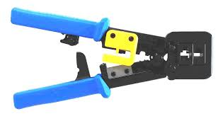

__1.2. RJ-45__

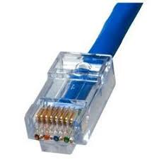

__1.3. Kabel UTP__

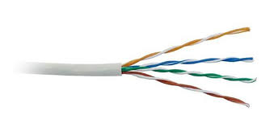

__1.4. Lan tester__

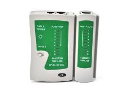

__2. *Jenis-Jenis Pengkabelan*__

__2.1. Straight (T568B)__

Kabel straight merupakan kabel yang memiliki cara pemasangan yang sama antara ujung satu dengan ujung yang lainnya. Kabel straight digunakan untuk menghubungkan 2 device yang berbeda, misalnya antara switch dengan router dan komputer dengan switch. Urutan kabel straight jika dilihat dari sisi tembaga RJ-45 adalah seperti dibawah ini:

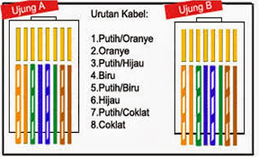


__2.2. Crossover (T568A)__

Kabel crossover merupakan kabel yang memiliki susunan berbeda antara ujung satu dengan ujung dua. Kabel crossover digunakan untuk menghubungkan 2 device yang sama. Jika dilihat dari sisi tembaga RJ-45, berikut susunan kabel crossover:

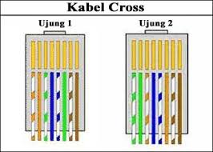

__3. *Cara Crimping*__

- Mengupas kulit kabel selebar +-2 cm menggunakan tang crimping.

- Menyusun rapi delapan kabel yang terdapat didalam kabel UTP sesuai dengan jenis kabel mana yang ingin dibuat (straight atau cross).

- Meluruskan kabel yang masih kusut.

- Meratakan ujung kabel dengan memotong nya menggunakan tang crimping.

- Memasukan kabel kedalam konektor RJ-45, pastikan ujung kabel menyentuh ujung RJ-45, dan jepitlah menggunakan tang crimping.

- Lakukan hal serupa pada kedua ujung kabel.

- Menguji menggunakan LAN tester, jika semua lampu menyala, berarti kabel tersebut telah di crimping dengan benar dan bisa digunakan.


## 2. WIRESHARK
Sebuah jaringan komputer dibangun dengan tujuan mengirimkan/menerima data antara satu end-point dengan end-point lainnya. Data dikirim dalam bentuk paket-paket. Struktur paket terdiri dari:

__1. *Header*__

Bagian header berisi alamat dan data lain yang diperlukan untuk mencapai tujuan yang dimaksudkan. Struktur dari header meliputi:

|Instruksi | Keterangan|
|--------- | -----------|
|_Panjang paket_ | Sebagian jaringan sudah memiliki panjang paket yang baku (_fixed-length_), sementara sebagian yang lain bergantung pada header untuk memuat informasi ini|
|_Sinkronisasi_ | Beberapa bit yang membantu paket mencocokkan jaringan yang dimaksud|
|_Nomor paket_ | Menunjukkan urutan dari total paket yang ada|
|_Protokol_ | Pada jaringan yang membawa lebih dari satu macam informasi, protokol ini menunjukkan jenis paket yang ditransmisikan, apakah termasuk e-mail, halaman web, atau yang lain|
|_Alamat tujuan_ | Ke mana paket dikirimkan|
|_Alamat asal_ | Dari mana paket dikirimkan|

__2. *Payload*__

Payload juga disebut sebagai __*body*__ dari paket. Pada bagian inilah data yang akan dikirimkan lewat paket berada

__3. *Trailer*__

trailer, kadang-kadang disebut __*footer*__, biasanya memuat sepasang bit yang memberi sinyal pada perangkat penerima bahwa paket sudah mencapai ujungnya. Bisa juga trailer memuat semacam _error checking_.

### 2.1 Instalasi

Instalasi pada OS Windows atau macOS bisa mengunduh installer pada [laman resmi Wireshark](https://www.wireshark.org/download.html). Untuk OS Linux atau FreeBSD tutorialnya bisa dilihat di [sini](http://linuxtechlab.com/install-wireshark-linux-centosubuntu/).

Setelah melakukan instalasi, jalankan Wireshark sebagai __administrator__ (Windows) atau __root__ (Linux)

Tampilan awalnya kira-kira seperti ini:
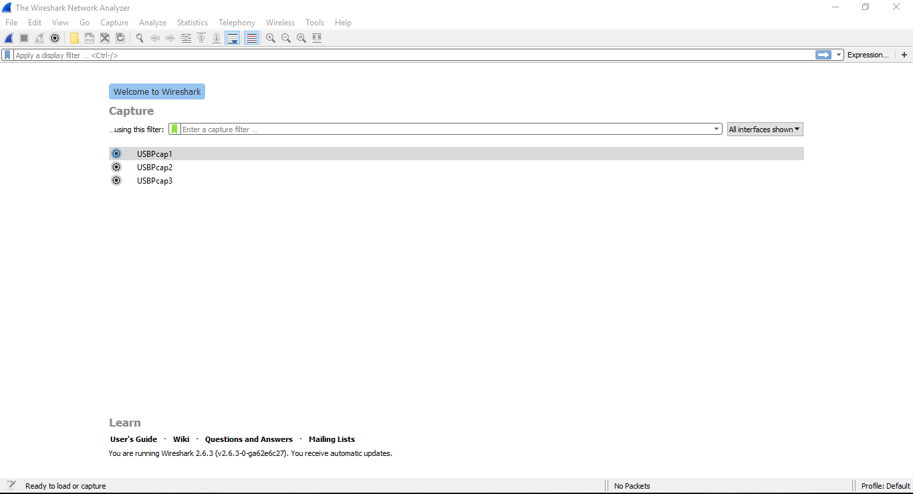

### 1.2 Filters

Dalam Wireshark terdapat 2 jenis filter __*Capture Filter*__ dan __*Display Filter*__

#### 2.2.1 Capture Filter
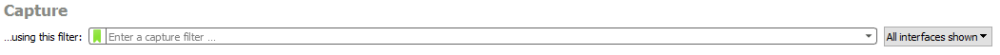

- Definisi: Memilah paket yang akan ditangkap (_captured_). Paket yang tidak memenuhi kriteria dibiarkan lewat tanpa di tangkap.
- Sintaks filter dapat terdiri dari 1 atau lebih __primitive__. Primitive sendiri biasanya terdiri dari sebyah __id__ (bilangan atau nama) yang didahului oleh 1 atau lebih jenis __qualifier__. Tapi perlu diingat bahwa dalam satu primitive tidak boleh ada 2 qualifier sejenis.
- Jenis qualifier:

    |Qualifier | Keterangan | Contoh|
    |--------- | ---------- | ------|
    |_type_ | Menentukan jenis id atau nama yang menjadi nilai filter | `host`, `net`, `port`, `portrange`|
    |_dir_ | Menentukan direction atau arah dari id | `src`, `dst`, dan lain-lain|
    |_proto_ | Menentukan protokol dari id | `tcp`, `udp`, `ether`, dan lain-lain|
- Sintaks filter dapat memuat operator, tanda kurung, negasi (`!` / `not`), dan konjungsi (`&&` / `and` atau `||` / `or`). Konjungsi digunakan untuk menghubungkan 2 primitive dalam satu sintaks.

- Contoh sintaks capture filter:

    |Filter expression / Primitive(s) | Keterangan|
    |---------------------------------|-----------|
    |`host 10.151.36.1` | Menangkap semua paket yang spesifik menuju ke atau berasal dari alamat 10.151.33.1|
    |`src host 10.151.33.1` | Menangkap semua paket yang spesifik menuju ke atau berasal dari alamat 10.151.33.1|
    |`net 192.168.0.0/24` atau `net 192.168.0.0 mask 255.255.255.0` | Menangkap semua paket yang berasal dari atau menuju ke subnet 192.168.0.0/24|
    |`dst net 192.168.0.0/24` | Menangkap semua paket yang menuju ke subnet 192.168.0.0/24|
    |`udp port 80` | Menangkap semua paket dengan protokol UDP yang menuju ke atau berasala dari port 25|
    |`tcp src port 22 \|\| host 10.151.33.30` | Menangkap semua paket dengan protokol TCP yang berasal dari port 22, atau semua paket yang berasal dari atau menuju ke alamat 10.151.33.30|

- Contoh capture filter `tcp dst port 443`:
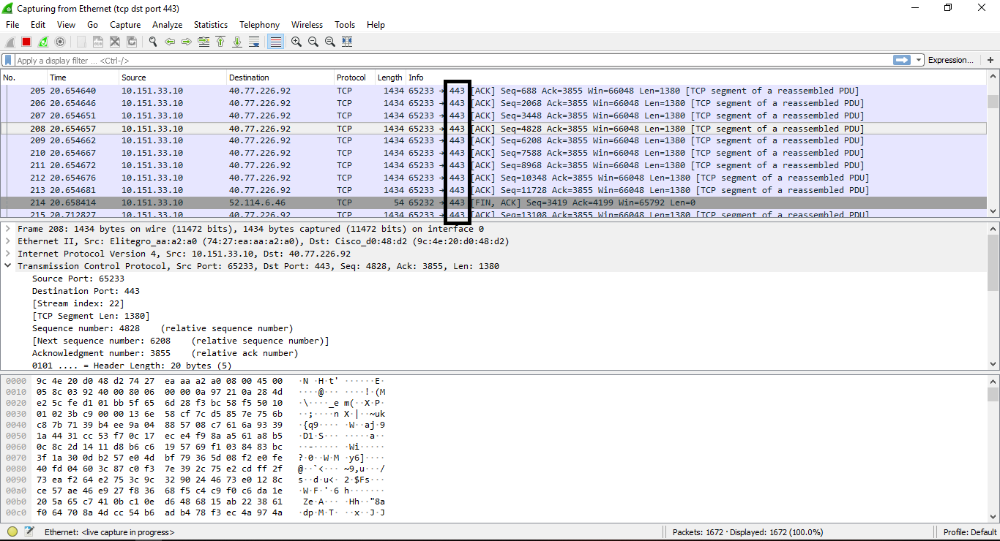

#### 2.2.2 Display Filter

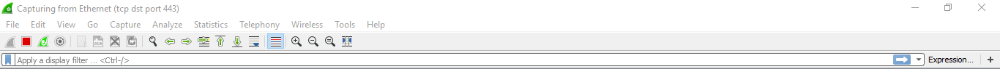

- Definisi: Memilah paket yang akan ditampilkan (_displayed_) dari kumpulan paket yang sudah di tangkap
- Secara umum sintaks display filter terdiri dari `[protocol].[field] [comparison operator] [value]`. Berikut ini daftar __*comparison operator*__ yang tersedia:

    | English | Comparison Operator (C-like) | Indonesia |
    | ------- | ---------------------------- | --------- |
    | equal | == | Sama dengan |
    | inequality | != | Tidak sama dengan |
    | greater than | > | Lebih besar dari |
    | less than | < | Lebih kecil dari |
    | greater than or equal to | >= | Lebih besar dari atau sama dengan
    | less than or equal to | <= | Lebih kecil dari atau sama dengan |
    | contains | | Protokol atau field mengandung nilai tertentu
    | matches | ~ | Protokol atau field cocok dengan _regular expression_ Perl |
    | bitwise_and | & | Membandingkan nilai bit sebuah field |

- Sebagaimana capture filter, display filter juga bisa menggabungkan 2 filter expression dengan __*logical operator*__:

    | Logical Operator | Keterangan |
    | ---------------- | ---------- |
    | `and` atau `&&` | logical AND |
    | `or` atau `\|\|` | logical OR |
    | `xor` atau `^^` | logical XOR |
    | `not` atau `!` | logical NOT |
    | `[...]` | substring operator |
    | `in` | membership operator |

- Contoh penggunaan display filter:

    | Filter expression | Keterangan |
    | ----------------- | ---------- |
    | `tcp.port == 443` | Menampilkan semua paket dengan protokol TCP yang menuju ke atau berasal dari port 443 |
    | `ip.src == 192.168.0.1 \|\| ip.dst == 192.168.0.1` | Menampilkan semua paket yang berasal dari alamat 192.168.0.1 atau menuju ke alamat 192.168.0.1 |
    | `http.request.uri contains "login"` | Menampilkan semua paket dengan protokol HTTP yang URI nya mengandung string "login" |

- Misalkan display filter yang digunakan adalah `http.accept containts "text"`, hasilnya kurang lebih sebagai berikut:

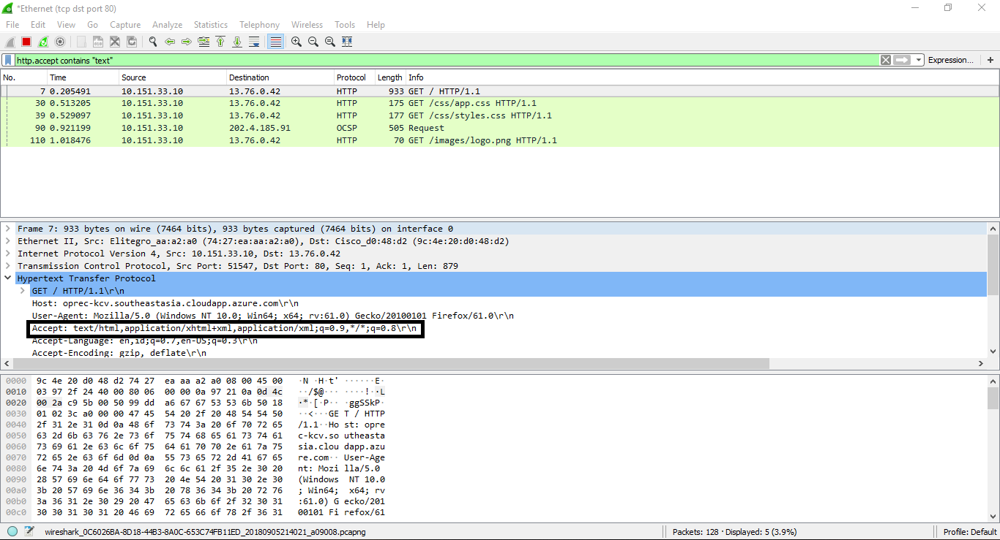

### 2.3 Export data hasil packet capture

1. Setelah memilih packet, pilih pada menu bar File -> Export Objects -> [Protokol yang diinginkan]. Dalam contoh ini dipilih protokol HTTP.

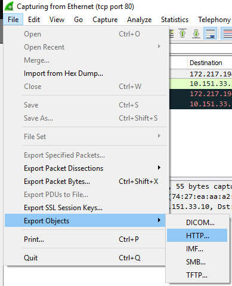

2. Pilih paket yang akan di-export. Dalam contoh ini dipilih paket yang memuat gambar dari situs tertentu. Lalu klik Save dan berikan nama file, path, beserta ekstensinya jika perlu. Dalam contoh ini nama file tidak diubah.

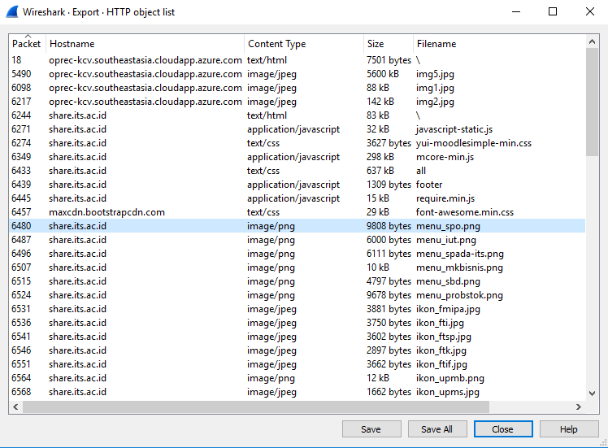

3. File berhasil di-export

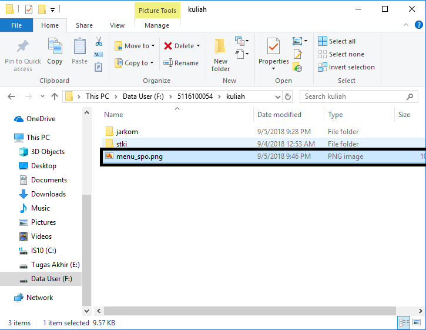

## 3. Penggunaan Wireshark pada FTP server

Buka aplikasi wireshark lalu mulai meng-capture

### 3.1. Connect ke server

3.1.1 Linux

masukkan command ini ke CLI

```
$ ftp [host ip]
```
kemudian masukkan username dan password, lalu bisa dikendalikan seperti CLI biasa

3.1.2 Windows

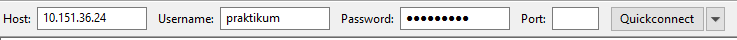

dan masukkan host, username, dan password di tempat yang disediakan, lalu klik quickconnect

3.1.3 Wireshark

saat login wireshark akan menampilkan beberapa command di bawah ini

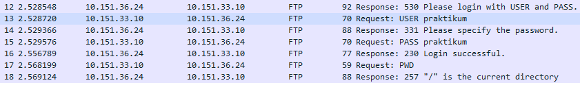

penjelasan:

| Perintah | Keterangan |
| -------- | ---------- |
| USER | username untuk login ke FTP server |
| PASS | password untuk login ke FTP server |
| PWD | untuk menampilkan posisi direktori saat ini |

### 3.2. Upload File

3.2.1 Linux

Command upload untuk linux

```
$ put [full path file]
```

3.2.2 Windows

Untuk FileZilla tinggal drag dari Local site lalu drop di Remote site

3.2.3 Wireshark

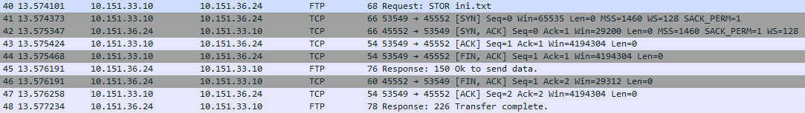

Untuk upload ke FTP server perintahnya adalah STOR

### 3.3. Download File

3.3.1 Linux

Command download untuk linux

```
$ get [nama file]
```

3.3.2 Windows

Untuk FileZilla tinggal drag dari Remote site ke Local site

3.3.3 Wireshark

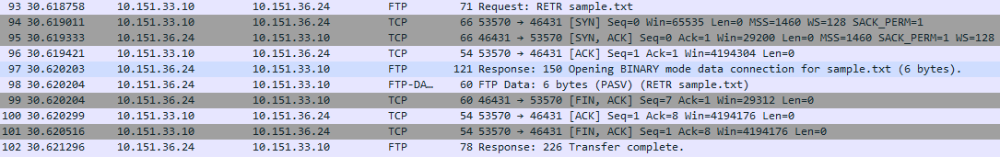

Untuk download dari FTP server perintahnya adalah RETR

## Latihan
1. Ketika mengakses suatu halaman web, berapakah port yang dituju oleh suatu paket?
2. Apa sajakah perbedaan ketika mengakses halaman utama website if.its.ac.id dan monta.if.its.ac.id? Jelaskan jawaban anda.
3. Ada berapa jumlah paket yang dikirimkan oleh web server ketika mengunduh file? Mengapa terjadi yang seperti itu?
4. Dari hasil analisa paket, apa perbedaan ketika menggunakan persistent connection dan non-persistent connection?
5. Apa perbedaan ketika autentikasi menggunakan method basic dengan digest?
6. Apa perbedaan ketika mengakses halaman web biasa dengan ketika proses login terjadi?
7. Apa saja yang selalu dikirimkan browser ke web server?

## Referensi

https://computer.howstuffworks.com/question5251.htm

https://wiki.wireshark.org/

https://www.wireshark.org/docs/wsug_html_chunked/ChCapCaptureFilterSection.html

http://www.tcpdump.org/manpages/pcap-filter.7.html

https://www.wireshark.org/docs/wsug_html_chunked/ChWorkBuildDisplayFilterSection.html

https://wiki.wireshark.org/ProtocolReference
