# **PENTING UNTUK DIBACA**
1. Pastikan UML *KATSU* dan *PIZZA* Memory yang sebelumnya **96 diganti 256** pada file topologi.sh.

2. Jalankan **iptables** agar client *SOTO* dan *KARI* bisa terhubung ke internet.

3. Ketika ingin mengakses internet pastikan sudah mengexport proxy terlebih dahulu. **syntaxnya cek modul pengenalan UML** .

4. Jangan melakukan apapun sebelum asisten memberikan perintah.

5. Ikuti apa yang asisten arahkan.

6. Ketika point 4 dan 5 tidak ditaati **resiko tanggung sendiri!!!**


# 1. DNS (Domain Name System)

## 1.1 Teori

### 1.1.A Pengertian

DNS (_Domain Name System_) adalah sistem penamaan untuk semua device (smartphone, computer, atau
network) yang terhubung dengan internet. DNS Server berfungsi menerjemahkan nama domain menjadi alamat IP. DNS dibuat guna untuk menggantikan sistem penggunaan file host yang dirasa tidak efisien.

### 1.1.B Cara Kerja


Client akan meminta alamt IP dari suatu domain ke DNS server. Jika pada DNS server data alamat IP dari DNS server tersebut ada maka akan di return alamat IP nya kembali menuju client. Jika DNS server tersebut tidak memiliki alamat IP dari domain tersebut maka dia akan bertanya kepada DNS server yang lain sampai alamat domain itu ditemukan.

### 1.1.C Aplikasi DNS Server

Untuk praktikum jarkom kita menggunakan aplikasi BIND9 sebagai DNS server, karena BIND(Berkley Internet Naming Daemon) adalah DNS server yang paling banyak digunakan dan juga memiliki fitur-fitur yang cukup lengkap.

### 1.1.D List DNS Record
| Tipe          | Deskripsi                     |
| ------------- |:-----------------------------|
| A             | Memetakan nama domain ke alamat IP (IPv4) dari komputer hosting domain|
| AAAA          | AAAA record hampir mirip A record, tapi mengarahkan domain ke alamat Ipv6|
| CNAME         | Alias ​​dari satu nama ke nama lain: pencarian DNS akan dilanjutkan dengan mencoba lagi pencarian dengan nama baru|
| NS            | Delegasikan zona DNS untuk menggunakan authoritative name servers yang diberikan|
| PTR           | Digunakan untuk Reverse DNS (Domain Name System) lookup|
| SOA           | Mengacu server DNS yang mengediakan otorisasi informasi tentang sebuah domain Internet|
| TXT           | Mengijinkan administrator untuk memasukan data acak ke dalam catatan DNS, catatan ini juga digunakan di spesifikasi Sender Policy Framework|

### 1.1.E SOA (Start of Authority)

Adalah informasi yang dimiliki oleh suatu DNS zone.

| Nama          | Deskripsi                     |
| ------------- |:-----------------------------|
| Serial        | Jumlah revisi dari file zona ini. Kenaikan nomor ini setiap kali file zone diubah sehingga perubahannya akan didistribusikan ke server DNS sekunder manapun|
| Refresh       | Jumlah waktu dalam detik bahwa nameserver sekunder harus menunggu untuk memeriksa salinan baru dari zona DNS dari nameserver utama domain. Jika file zona telah berubah maka server DNS sekunder akan memperbarui salinan zona tersebut agar sesuai dengan zona server DNS utama|
| Retry         | Jumlah waktu dalam hitungan detik bahwa nameserver utama domain (atau server) harus menunggu jika upaya refresh oleh nameserver sekunder gagal sebelum mencoba refresh zona domain dengan nameserver sekunder itu lagi|
| Expire        | Jumlah waktu dalam hitungan detik bahwa nameserver sekunder (atau server) akan menahan zona sebelum tidak lagi mempunyai otoritas|
| Minimum       | Jumlah waktu dalam hitungan detik bahwa catatan sumber daya domain valid. Ini juga dikenal sebagai TTL minimum, dan dapat diganti oleh TTL catatan sumber daya individu|
| TTL           | (waktu untuk tinggal) - Jumlah detik nama domain di-cache secara lokal sebelum kadaluarsa dan kembali ke nameserver otoritatif untuk informasi terbaru|


------


## 1.2 Praktik

### 1.2.A Buat Topologi Berikut

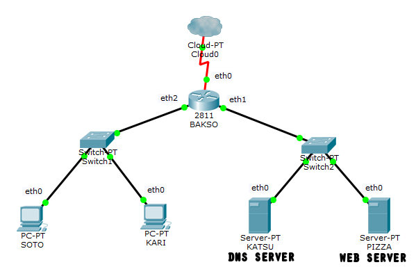

Referensi 

[Modul Pengenalan UML](https://github.com/rohanaq/Modul-Pengenalan-UML "Modul Pengenalan UML")

### 1.2.A Instalasi bind

- Buka *KATSU* dan update package lists dengan menjalankan command:

	```
	apt-get update
	```

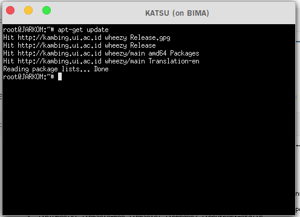

- Setalah melakukan update silahkan install aplikasi bind9 pada *KATSU* dengan perintah:

	```
	apt-get install bind9 -y
	```

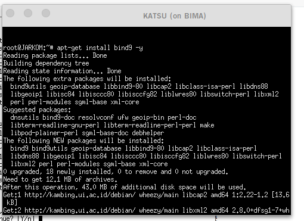

### 1.2.B Pembuatan Domain
Pada sesilab ini kita akan membuat domain **jarkomtc.com**.

- Lakukan perintah pada *KATSU*. Isikan seperti berikut:

  ```
   nano /etc/bind/named.conf.local
  ```

- Isikan configurasi domain **jarkomtc.com** sesuai dengan syntax berikut:

  ```
  zone "jarkomtc.com" {
  	type master;
  	file "/etc/bind/jarkom/jarkomtc.com";
  };
  ```

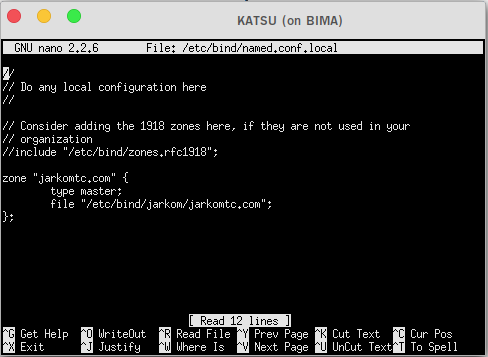

- Buat folder **jarkom** di dalam **/etc/bind**

  ```
  mkdir /etc/bind/jarkom
  ```


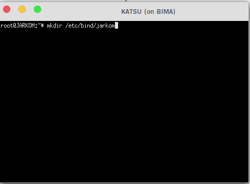

- Copykan file **db.local** pada path **/etc/bind** ke dalam folder **jarkom** yang baru saja dibuat dan ubah namanya menjadi **jarkomtc.com**

  ```
  cp /etc/bind/db.local /etc/bind/jarkom/jarkomtc.com
  ```


- Kemudian buka file **jarkomtc.com** dan edit seperti gambar berikut dengan IP *KATSU* masing-masing kelompok:

  ```
  nano /etc/bind/jarkom/jarkomtc.com
  ```

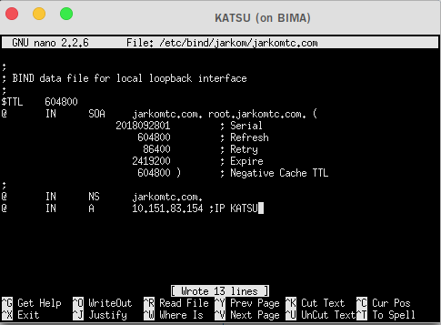

- Restart bind9 dengan perintah 

  ```
  service bind9 restart
  
  ATAU
  
  named -g //Bisa digunakan untuk restart sekaligus debugging
  ```


### 1.2.C Setting nameserver pada client

Domain yang kita buat tidak akan langsung dikenali oleh client oleh sebab itu kita harus merubah settingan nameserver yang ada pada client kita.

- Pada client *SOTO* dan *KARI* arahkan nameserver menuju IP *KATSU* dengan mengedit file _resolv.conf_ dengan mengetikkan perintah 

	```
	nano /etc/resolv.conf
	```


- Untuk mencoba koneksi DNS, lakukan ping domain **jarkomtc.com** dengan melakukan  perintah berikut pada client *SOTO* dan *KARI*

  ```
  ping jarkomtc.com
  ```

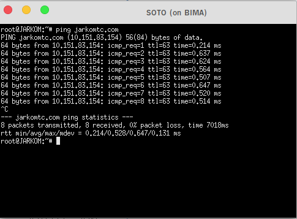


### 1.2.D Reverse DNS (Record PTR)

Jika pada pembuatan domain sebelumnya DNS server kita bekerja menerjemahkan string domain **jarkomtc.com** kedalam alamat IP agar dapat dibuka, maka Reverse DNS atau Record PTR digunakan untuk menerjemahkan alamat IP ke alamat domain yang sudah diterjemahkan sebelumnya.

- Edit file **/etc/bind/named.conf.local** pada *KATSU*

  ```
  nano /etc/bind/named.conf.local
  ```

- Lalu tambahkan konfigurasi berikut ke dalam file **named.conf.local**

  ```
  zone "83.151.10.in-addr.arpa" {
      type master;
      file "/etc/bind/jarkom/83.151.10.in-addr.arpa";
  };
  ```

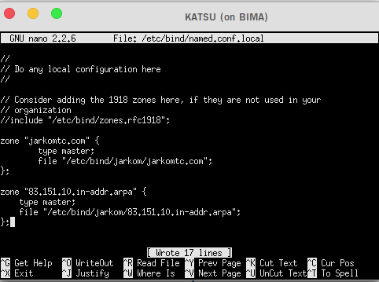

- Copykan file **db.local** pada path **/etc/bind** ke dalam folder **jarkom** yang baru saja dibuat dan ubah namanya menjadi **83.151.10.in-addr.arpa**

  ```
  cp /etc/bind/db.local /etc/bind/jarkom/83.151.10.in-addr.arpa
  ```

  *Keterangan 83.151.10 adalah 3 byte pertama IP KATSU yang dibalik urutan penulisannya*

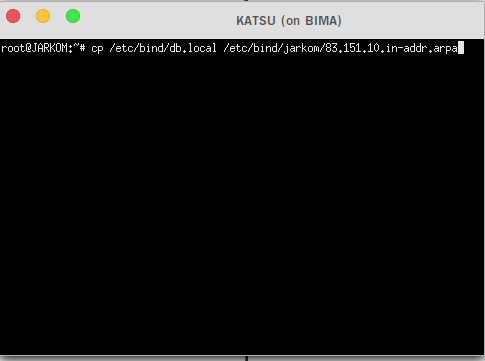

- Edit file **83.151.10.in-addr.arpa** menjadi seperti gambar di bawah ini


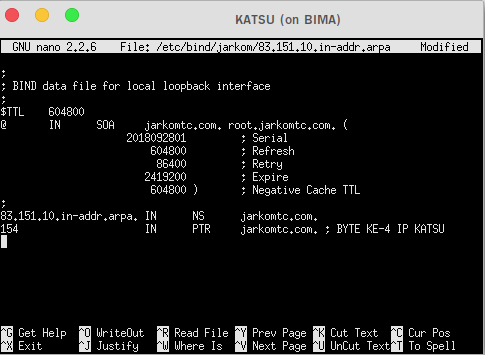

- Kemudian restart bind9 dengan perintah 

  ```
  service bind9 restart
  ```

- Untuk mengecek apakah konfigurasi sudah benar atau belum, lakukan perintah berikut pada client *SOTO* 

  ```
  // Install package dnsutils
  // Pastikan nameserver telah dikembalikan ke settingan awal
  apt-get update
  apt-get install dnsutils
  
  //Kembalikan nameserver agar tersambung dengan KATSU
  host -t PTR "IP KATSU"
  ```

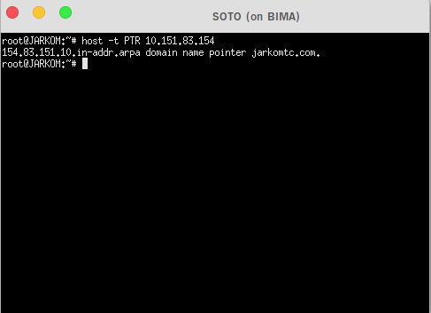


### 1.2.E Record CNAME
Record CNAME adalah sebuah record yang membuat alias name dan mengarahkan domain ke alamat/domain yang lain.

Langkah-langkah membuat record CNAME:

- Buka file **jarkomtc.com** pada server *KATSU* dan tambahkan konfigurasi seperti pada gambar berikut:


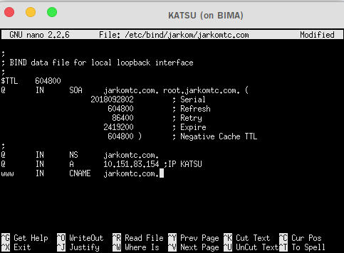


- Kemudian restart bind9 dengan perintah

  ```
  service bind9 restart
  ```

- Lalu cek dengan melakukan **host -t CNAME www.jarkomtc.com** atau **ping www.jarkomtc.com**. Hasilnya harus mengarah ke host dengan IP *KATSU*.


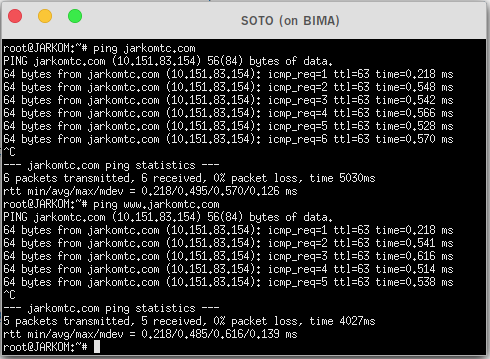


### 1.2.F Membuat DNS Slave

DNS Slave adalah DNS cadangan yang akan diakses jika server DNS utama mengalami kegagalan. Kita akan menjadikan server *PIZZA* sebagai DNS slave dan server *KATSU* sebagai DNS masternya.

#### I. Konfigurasi Pada Server KATSU

- Edit file **/etc/bind/named.conf.local** dan sesuaikan dengan syntax berikut

  ```
  zone "jarkomtc.com" {
      type master;
      notify yes;
      also-notify { "IP PIZZA"; }; // Masukan IP PIZZA tanpa tanda petik
      allow-transfer { "IP PIZZA"; }; // Masukan IP PIZZA tanpa tanda petik
      file "/etc/bind/jarkom/jarkomtc.com";
  };
  ```

  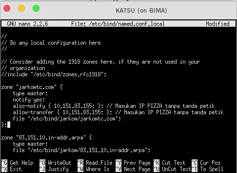


- Lakukan restart bind9

  ```
  service bind9 restart
  ```


#### II. Konfigurasi Pada Server PIZZA

- Buka *PIZZA* dan update package lists dengan menjalankan command:

  ```
  apt-get update
  ```

- Setalah melakukan update silahkan install aplikasi bind9 pada *PIZZA* dengan perintah:

  ```
  apt-get install bind9 -y
  ```

- Kemudian buka file **/etc/bind/named.conf.local** pada PIZZA dan tambahkan syntax berikut:

  ```
  zone "jarkomtc.com" {
      type slave;
      masters { "IP KATSU"; }; // Masukan IP KATSU tanpa tanda petik
      file "/var/lib/bind/jarkomtc.com";
  };
  ```

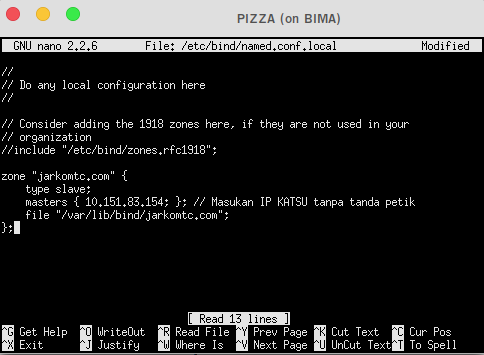

- Lakukan restart bind9

  ```
  service bind9 restart
  ```


#### III. Testing

- Pada server *KATSU* silahkan matikan service bind9

  ```
  service bind9 stop
  ```

- Pada client *SOTO* pastikan pengaturan nameserver mengarah ke IP *KATSU* dan IP *PIZZA*

  

- Lakukan ping ke jarkomtc.com pada client *SOTO*. Jika ping berhasil maka konfigurasi DNS slave telah berhasil


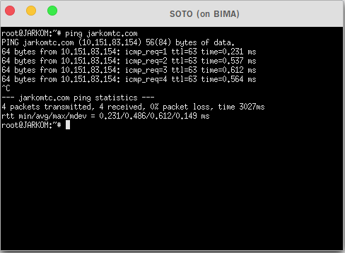


### 1.2.G Membuat Subdomain

Subdomain adalah bagian dari sebuah nama domain induk. Subdomain umumnya mengacu ke suatu alamat fisik di sebuah situs contohnya: **jarkomtc.com** merupakan sebuah domain induk. Sedangkan **nako.jarkomtc.com** merupakan sebuah subdomain.

- Edit file **/etc/bind/jarkom/jarkomtc.com** lalu tambahkan subdomain untuk **jarkomtc.com** yang mengarah ke IP *KATSU*.

  ```
  nano /etc/bind/jarkom/jarkomtc.com
  ```

- Tambahkan konfigurasi seperti pada gambar ke dalam file **jarkomtc.com**.

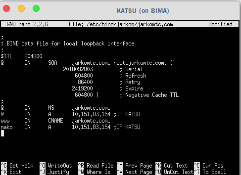

- Restart service bind  

  ```
  service bind9 restart
  ```

- Coba ping ke subdomain dengan perintah berikut dari client *SOTO*

  ```
  ping nako.jarkomtc.com
  
  ATAU
  
  host -t A nako.jarkomtc.com
  ```

  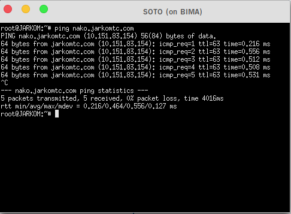


### 1.2.H Delegasi Subdomain

Delegasi subdomain adalah pemberian wewenang atas sebuah subdomain kepada DNS baru.

#### I. Konfigurasi Pada Server *KATSU*

- Pada *KATSU*, edit file **/etc/bind/jarkom/jarkomtc.com** dan ubah menjadi seperti di bawah ini sesuai dengan pembagian IP *KATSU* kelompok masing-masing.

  ```
  nano /etc/bind/jarkom/jarkomtc.com
  ```

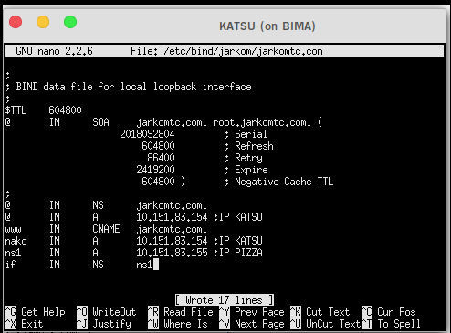

- Kemudian edit file **/etc/bind/named.conf.options** pada *KATSU*.

  ```
  nano /etc/bind/named.conf.options
  ```

- Kemudian comment **dnssec-validation auto;** dan tambahkan baris berikut pada **/etc/bind/named.conf.options**

  ```
  allow-query{any;};
  ```


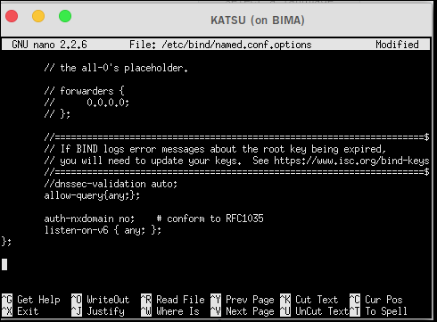

- Kemudian edit file **/etc/bind/named.conf.local** menjadi seperti gambar di bawah:

  ```
  zone "jarkomtc.com" {
      type master;
      file "/etc/bind/jarkom/jarkomtc.com";
      allow-transfer { "IP PIZZA"; }; // Masukan IP PIZZA tanpa tanda petik
  };
  ```


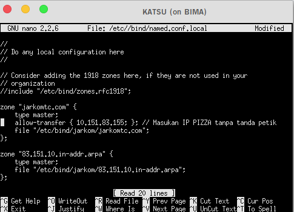

- Setelah itu restart bind9

  ```
  service bind9 restart
  ```

#### II. Konfigurasi Pada Server *PIZZA*

- Pada *PIZZA* edit file **/etc/bind/named.conf.options**

  ```
  nano /etc/bind/named.conf.options
  ```

- Kemudian comment **dnssec-validation auto;** dan tambahkan baris berikut pada **/etc/bind/named.conf.options**

  ```
  allow-query{any;};
  ```

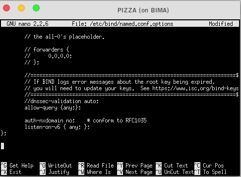

- Lalu edit file **/etc/bind/named.conf.local** menjadi seperti gambar di bawah:

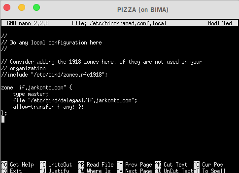

- Kemudian buat direktori dengan nama **delegasi** 

- Copy **db.local** ke direktori pucang dan edit namanya menjadi **if.jarkomtc.com** 

  ```
  mkdir /etc/bind/delegasi
  cp /etc/bind/db.local /etc/bind/delegasi/if.jarkomtc.com
  ```

- Kemudian edit file **if.jarkomtc.com** menjadi seperti dibawah ini

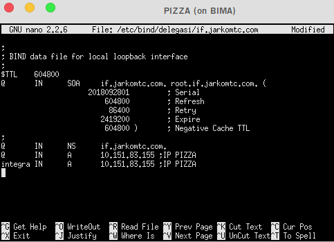

- Restart bind9

  ```
  service bind9 restart
  ```

#### III. Testing

- Lakukan ping ke domain **if.jarkomtc.com** dan **integra.if.jarkomtc.com** dari client *SOTO*

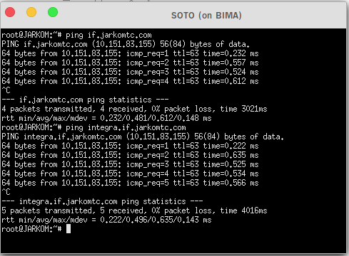


### 1.2.I DNS Forwarder

DNS Forwarder digunakan untuk mengarahkan DNS Server ke IP yang ingin dituju.

- Edit file **/etc/bind/named.conf.options** pada server *KATSU*
- Uncomment pada bagian ini

```
forwarders {
    8.8.8.8;
};
```
- Comment pada bagian ini

```
// dnssec-validation auto;
```
- Dan tambahkan

```
allow-query{any;};
```

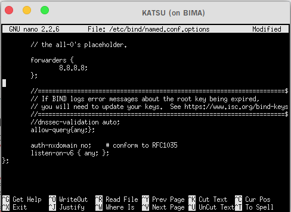

- Harusnya jika nameserver pada file **/etc/resolv.conf** di client diubah menjadi IP KATSU maka akan di forward ke IP DNS google yaitu 8.8.8.8 dan bisa mendapatkan koneksi.


### 1.3 Keterangan Configurasi Zone file

1. #### Penulisan Serial

   Ditulis dengan format YYYYMMDDXX. Serial di increment setiap melakukan perubahan pada file zone.

   ```
   YYYY adalah tahun
   MM adalah bulan
   DD adalah tanggal
   XX adalah counter
   ```

   Contoh:

   

2. #### Penggunaan Titik

   

   Pada salah satu contoh di atas, dapat kita amati pada kolom keempat terdapat record yang menggunakan titik pada akhir kata dan ada yang tidak. Penggunaan titik berfungsi sebagai penentu FQDN (Fully-Qualified Domain Name) suatu domain.

   Contohnya jika "**jarkomtc.com.**" di akhiri dengan titik maka akan dianggap sebagai FQDN dan akan dibaca sebagai "**jarkomtc.com**" , sedangkan ns1 di atas tidak menggunakan titik sehingga dia tidak terbaca sebagai FQDN. Maka ns1 akan di tambahkan di depan terhadap nilai $ORIGIN sehinga ns1 akan terbaca sebagai "**ns1.jarkomtc.com**" . Nilai $ORIGIN diambil dari penamaan zone yang terdapat pada  */etc/bind/named.conf.local*.

3. #### Penulisan Name Server (NS) record

   Salah satu aturan penulisan NS record adalah dia harus menuju A record., bukan CNAME. 


## Latihan

1. Buatlah domain **whisper.gf** dan **www.whisper.gf** (CNAME **whisper.gf**). Apa yang terjadi jika melakukan ping **whisper.gf** dengan ping **www.whisper.gf**? Mengapa hal itu terjadi?
2. Buatlah sebuah subdomain pada domain **whisper.gf** dengan nama **love.whisper.gf** setelah itu buatlah subdomain dari subdomain **moon.night.love.whisper.gf**!

## References
* https://computer.howstuffworks.com/dns.htm
* http://knowledgelayer.softlayer.com/faq/what-does-serial-refresh-retry-expire-minimum-and-ttl-mean
* https://en.wikipedia.org/wiki/List_of_DNS_record_types
* https://kb.indowebsite.id/knowledge-base/pengertian-catatan-dns-atau-record-dns/
