# Web Server

## A. Persyaratan Tambahan Mengikuti Sesilab
1. Record A dan PTR pada jarkomtc.com mengarah ke IP Pizza

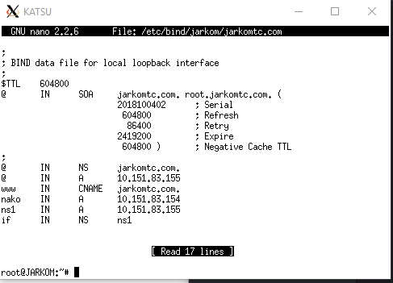

## B. Penting Untuk Dibaca
1. Pastikan Semua UML bisa connect ke internet baik dapat melakukan koneksi keluar maupun dapat ping dari luar (Khusus DMZ).
2. Pastikan Pizza dan Katsu sudah memiliki memory 256M
3. Ketika mengalami kendala/error **cek syntax dan samakan seperti modul** terlebih dahulu **sebelum** angkat tangan dan berkata **"Mas/Mbak ini kok gak bisa ya?"**

## C. Dasar Teori

### 1. Web Server
Web Server adalah perangkat yang menyediakan layanan akses kepada pengguna melalui protokol HTTP atau HTTPS melalui aplikasi web.

### 2. Load Balancing
Load balancing adalah suatu mekanisme penyeimbangan beban yang bekerja dengan cara membagi beban pekerjaan. Load balancer adalah aplikasi atau alat yang bertugas untuk melakukan load balancing . Load balancer dapat meggunakan berbagai macam algoritma load balancing yang bertujuan untuk membagi beban pekerjaan seadil-adilnya. Minimal arsitektur load balancing adalah sebagai berikut:

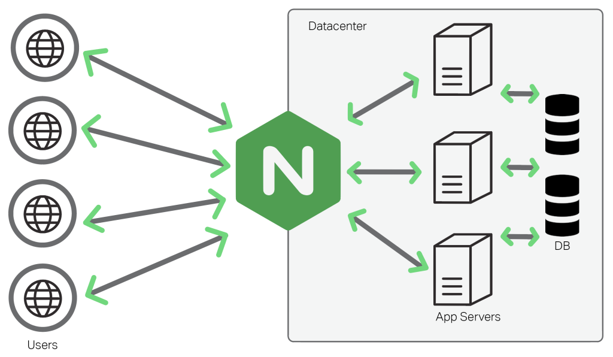

## Kenapa dibutuhkan load balancing?
Untuk menangani banyaknya pengguna yang mengakses layanan pada satu waktu dan menjaga layanan tetap tersedia setiap saat, dibutuhkan lebih dari satu komputer untuk memasang layanannya. Dengan layanan yang tersedia di banyak server, dibutuhkan mekanisme pembagian beban untuk memberikan beban yang seimbang pada setiap server. Dengan meletakkan layanan pada beberapa server dan pembagian beban yang optimal, setiap permintaan pengguna bisa ditangani dengan efisien.

### 3. Apache Web Server
Apache adalah sebuah nama web server yang bertanggung jawab pada request-response HTTP dan logging informasi secara detail

## D. Instalasi Apache

**STEP 1** - Buka uml **Pizza** dan jalankan perintah

    apt-get install apache2

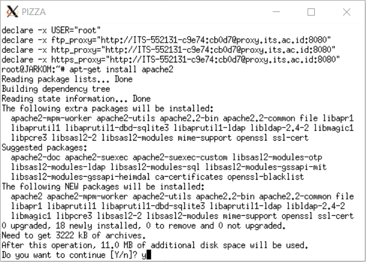
    
**STEP 2** - Buka browser laptop/komputer masing-masing dan buka web **IP Pizza Masing-Masing Kelompok** sampai muncul halaman Apache

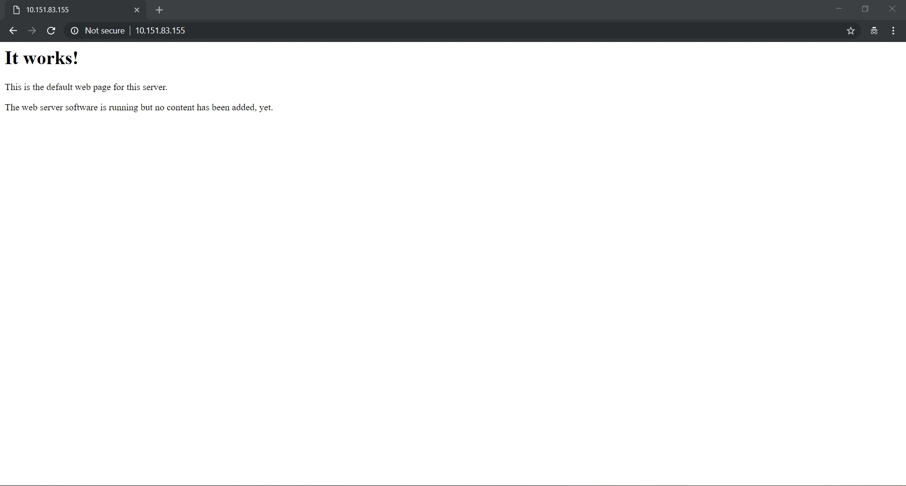

## E. Instalasi PHP

**STEP 1** - Buka uml **Pizza** dan jalankan perintah

    apt-get install php5
    
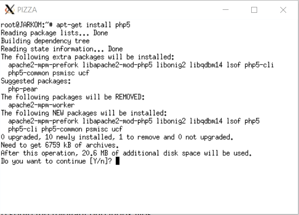

**STEP 2** - Test apakah **php** sudah terinstall dengan menjalankan perintah

    php -v
    
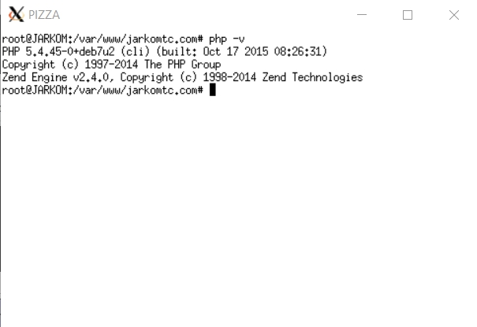

## F. Mengenal Apache

Webserver Apache memiliki folder untuk konfigurasi yang berada di **/etc/apache2**

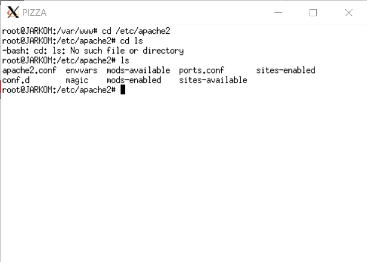

Pada folder **/etc/apache2** terdapat berbagai file dan folder untuk konfigurasi

Penting untuk diketahui:
* ***Tentang File*** :

Nama File | Pengertian
------------ | -------------
**apache2.conf** | file konfigurasi utama apache2.
**ports.conf** | file konfigurasi port yang digunakan untuk webserver.
**sites-available** | folder tempat konfigurasi website (virtual host) yang tersedia.
**sites-enabled** | folder tempat konfigurasi website (virtual host) yang tersedia dan sudah aktif.
**mods-available** | folder tempat modul-modul apache2 yang tersedia.
**mods-enabled** | folder tempat modul-modul apache2 yang tersedia dan sudah aktif.

* ***Tentang Command***

Command | Arti
------------ | -------------
a2ensite | Untuk memasukkan atau ENABLE config yang telah dibuat
a2dissite | Untuk menonaktifkan atau DISABLE config yang telah dibuat
a2enmod | Untuk ENABLE spesifik modul ke dalam konfigurasi apache2
a2dismod | Untuk DISABLE spesifik modul ke dalam konfigurasi apache2

## G. Konfigurasi Apache Sederhana
### G.1. Penggunaan Sederhana

**STEP 1** - Pindah ke folder **/etc/apache2/sites-available**

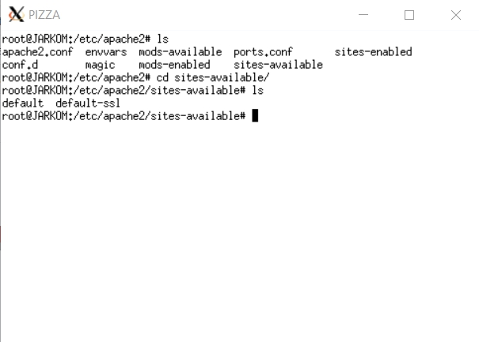
    
Pada folder **/etc/apache2/sites-available** terdapat dua buah file.

- **default** adalah file konfigurasi website default apache untuk http.

- **default-ssl** adalah file konfigurasi website default apache untuk https.

**STEP 2** - Buka file **default**

**STEP 3** - Pada file **default** berisi contoh konfigurasi,

a. Port berapa yang digunakan.
    
    <VirtualHost *:80> # Menggunakan port 80
        
b. Domain
    
    # ServerName www.example.com
        
c. Folder tempat website
    
    DocumentRoot /var/www/html
     
**STEP 4** - Pindah ke folder tempat website pada file konfigurasi default yaitu **/var/www/html** dan buat file **index.php** yang berisi

    <?php
        phpinfo();
    ?>

**STEP 5** - Buka browser dan akses alamat **http://[IP Pizza]/index.php**

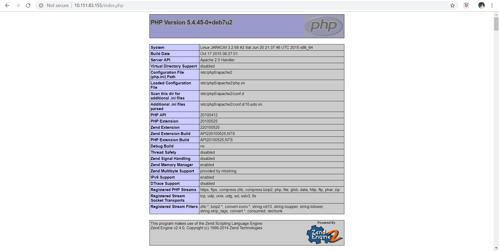
    
* **Catatan**:  Apabila tampilan web tidak muncul seperti gambar diatas dan hanya muncul plain text isi file **index.php**, silahkan install **libapache2-mod-php7.0** dengan menjalankan perintah 
        
    `apt-get install libapache2-mod-php7.0`
    
    dan restart apache dengan perintah
    
    `service apache2 restart`
        
### G.2. Membuat Konfigurasi Website Menggunakan Port 8080

**STEP 1** - Pindah ke folder **/etc/apache2/sites-available** dan copy file **default** menjadi file **default-8080**.

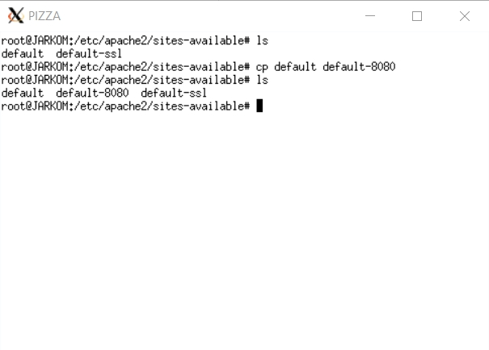
    
**STEP 2** - Buka file **default-8080**, kemudian ubah ubah port yang digunakan yang awalnya **80** menjadi **8080** dan ubah tempat menaruh file/folder web yang awalnya **/var/www/html** menjadi **/var/www/web-8080**.

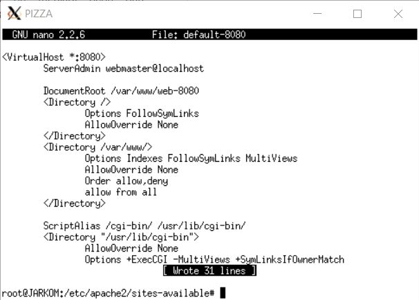

**STEP 3** - Tambahkan **port 8080** pada file **ports.conf**

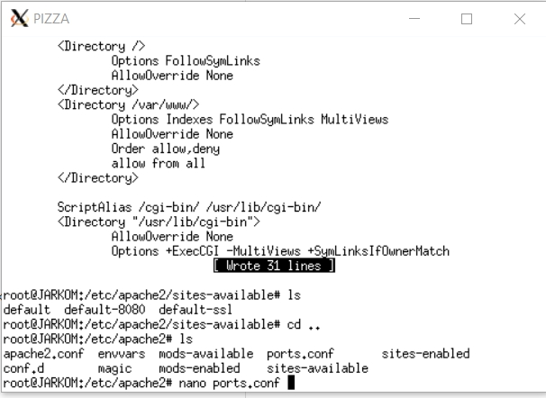
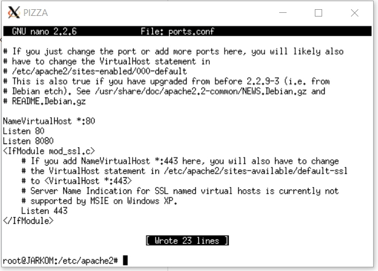

**STEP 4** - Untuk mengaktifkan konfigurasi **default-8080** jalankan perintah
`a2ensite` dan ketik nama **file konfigurasi tanpa .conf**
    
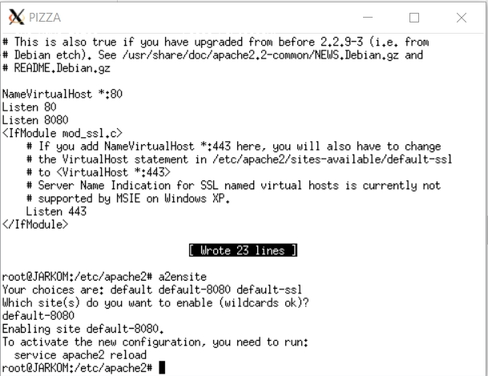
    
kemudian tekan enter.

Atau bisa ketikkan langsung `a2ensite (namafile)`

**STEP 5** - Restart apache menggunakan perintah `service apache2 restart`

**STEP 6** - Pindah ke folder **/var/www** dan buat folder baru dengan nama **web-8080**

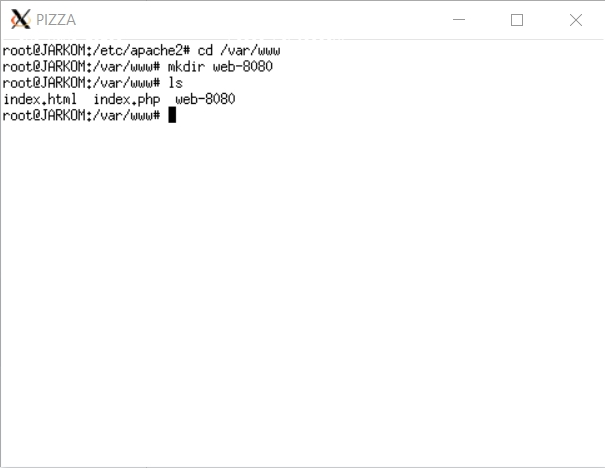

**STEP 7** - Masuk ke folder **web-8080** dan buat file **index.php** yang berisi
    
    <?php
        echo "Halo ini port 8080 loo";
    ?>
    
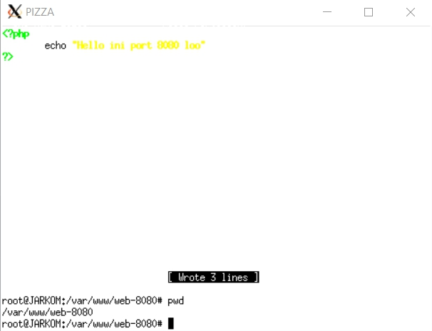
        
**STEP 8** - Buka browser dan akses alamat http://[IP Pizza]:8080

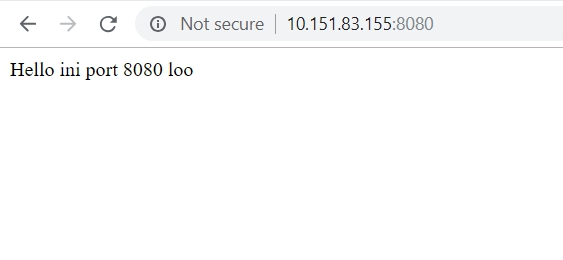

## H. Mari Berimajinasi
### H.1. Setting Domain Pada Apache
Nisa adalah seorang mahasiswi Departemen Infomatika yang sedang ingin membuat website dengan domain **jarkomtc.com**. Dia memiliki **teman** yang bernama Adi kebetulan mempunyai server yang bisa digunakan untuk tempat host websitenya.

Maka yang harus dilakukan Adi untuk menyenangkan hati Nisa adalah:

**STEP 1** - Pindah ke folder **/etc/apache2/sites-available** dan copy file **default** menjadi **jarkomtc.com**

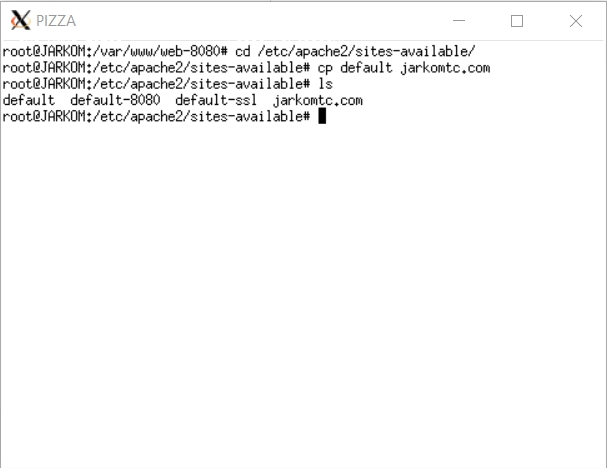
    
**STEP 2** - Buka file **jarkomtc.com**, kemudian
    
***2.1*** - Ubah **ServerName** menjadi **jarkomtc.com**.

***2.2*** - Tambahkan

    ServerAlias www.jarkomtc.com
agar dapat mengakses **www.jarkomtc.com**
         
***2.3*** - Ganti tempat **DocumentRoot** yang awalnya **/var/www/html** menjadi **/var/www/jarkomtc.com**
    
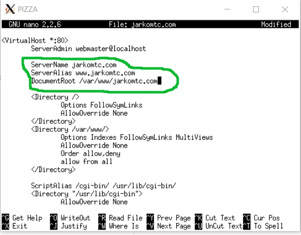
    
**STEP 3** - Aktifkan konfigurasi **jarkomtc.com** dengan menjalankan `a2ensite jarkomtc.com`
 
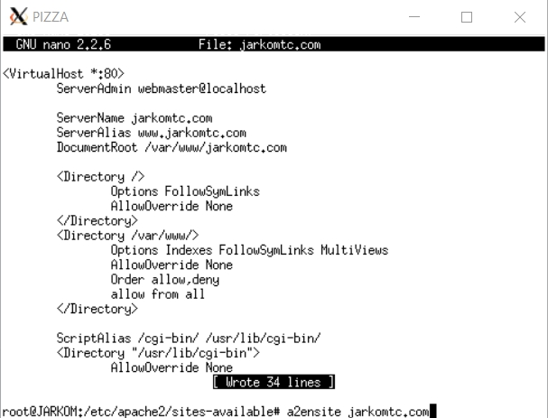
 
**STEP 4** - Restart apache dengan menjalankan `service apache2 restart`

**STEP 5** - Pindah ke folder **/var/www** dan buat folder baru dengan nama **jarkomtc.com**

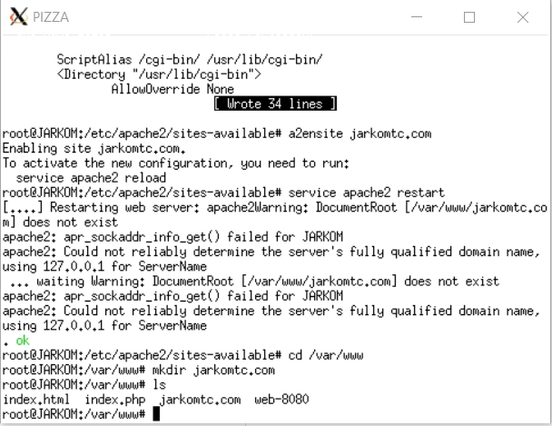

**STEP 6** - Buat file **index.php** dengan isi file

    <?php
        echo "Semangat Jarkom TC";
    ?>

**STEP 7** - Ganti DNS laptop/komputer sesuai **IP Katsu** masing-masing. 
**Pada Windows**
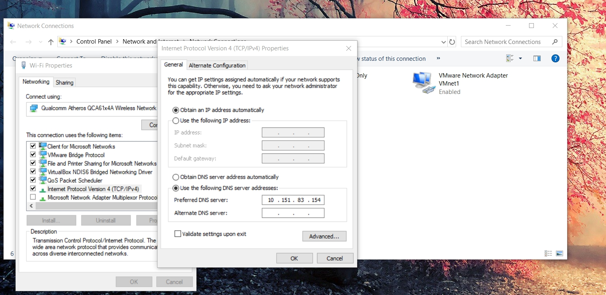 

**Pada Linux**
- Ubah file yang ada pada **/etc/resolv.conf**
- Caranya dengan `sudo nano /etc/resolv.conf`
- Simpan hasil perubahannya

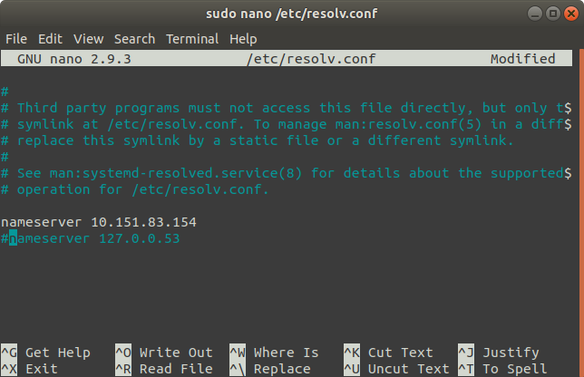 

**STEP 8** - Buka browser dan akses **jarkomtc.com**

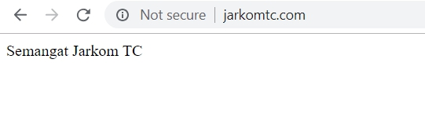

### H.2. Directory Listing

Di dalam folder **/var/www/jarkomtc.com** terdapat folder sebagai berikut

        /var/www/jarkomtc.com
                            /data
                            /download
                                    /lagu
                            /assets
                                    /javascript

Karena folder **download** terdapat file-file yang bisa didownload oleh pengunjung website **jarkomtc.com**, Nisa ingin folder tersebut dapat menampilkan list file yang ada. Tetapi untuk folder **assets**, Azy tidak ingin ada yang tahu apa isi folder tersebut ketika diakses oleh pengunjung websitenya.

Karena Adi sangat suka kepada Nisa.

Maka yang harus dilakukan Adi adalah:

**STEP 1** - Buat folder **download**, **data**,**assets**, **download/lagu** dan **assets/javascript** pada **/var/www/jarkomtc.com** dengan menjalankan perintah berikut

        mkdir /var/www/jarkomtc.com/data
        mkdir /var/www/jarkomtc.com/download
        mkdir /var/www/jarkomtc.com/download/lagu
        mkdir /var/www/jarkomtc.com/assets
        mkdir /var/www/jarkomtc.com/assets/javascript

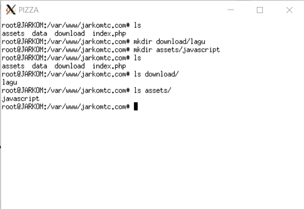

**STEP 2** - Mengaktifkan Directory Listing

***2.1*** - Pindah ke folder **/etc/apache2/sites-available** kemudian buka file **jarkomtc.com** dan tambahkan
    
    <Directory /var/www/jarkomtc.com/download>
        Options +Indexes #Untuk mengaktifkan directory listing
    </Directory>
    
agar folder **download** menampilkan isi folder.
    

    
***2.2*** - Simpan dan restart apache `service apache2 restart`

***2.3*** - Buka Browser dan akses **http://jarkomtc.com/download**

**Keterangan**:
  1. Untuk mengatur folder pada sebuah web, menggunakan
  
  `<Directory /x> ... </Directory>`
  
Contoh untuk mengatur /var/www/jarkomtc.com/download
    
    <Directory /var/www/jarkomtc.com/download>
        
    </Directory>

**STEP 3** - Mematikan Directory Listing

***3.1*** - Pindah ke folder **/etc/apache2/sites-available** kemudian buka file **jarkomtc.com** dan tambahkan
    
    <Directory /var/www/jarkomtc.com/assets>
        Options -Indexes #Untuk mematikan directory listing
    </Directory>

agar folder **assets** tidak menampilkan isi folder.

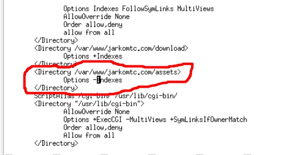
    
***3.2*** - Simpan dan restart apache `service apache2 restart`

***3.3*** - Buka Browser dan akses **http://jarkomtc.com/assets**

  
### H.3 Directory Alias

Karena dirasa **http://[IP Pizza]/assets/javascript** terlalu panjang url-nya, maka Adi mencoba membuat directory alias menjadi **http://[IP Pizza]/assets/js** agar Nisa tidak capek mengetik.

Maka yang dilakukan Adi adalah

**STEP 1** - Pindah ke folder **/etc/apache2/sites-available** kemudian buka file **jarkomtc.com** dan tambahkan

    Alias "/assets/js" "/var/www/jarkomtc.com/assets/javascript"
            
    <Directory /var/www/jarkomtc.com/assets/javascript>
        Options +Indexes
    </Directory>

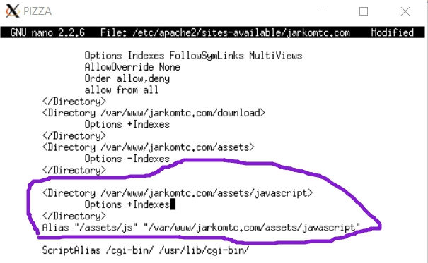
        
**STEP 2** - Restart apache2 `service apache2 restart`

**STEP 3** - Pindah ke folder **/var/www/jarkomtc.com/assets/javascript** dan buat file **app.js** dengan perintah `touch app.js`

**STEP 4** - Buka browser dan akses **http://jarkomtc.com/assets/js**

### H.4. Module Rewrite

* ### Mengaktifkan Module Rewrite

Setelah dipikir-pikir ternyata **http://jarkomtc.com/index.php** ternyata kurang cantik untuk penulisan url. Maka Adi berinisiatif untuk mengaktifkan module rewrite agar ketika mengakses file php tidak usah menambahkan ekstensi .php.

Maka yang dilakukan Adi adalah

**STEP 1** - Menjalankan perintah `a2enmod` dan menuliskan **rewrite** untuk mengaktikan module rewrite.

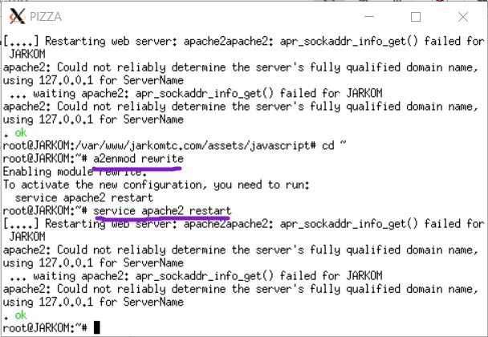

**STEP 2** - Restart apache `service apache2 restart`

Biasanya semua konfigurasi terhadap sebuah website diatur pada file di folder **/etc/apache2/sites-available**. Namun terkadang ada sebuah kasus bahwa kita tidak memiliki hak akses root untuk edit file konfigurasi yang berada di folder **/etc/apache2/sites-available** atau kita tidak ingin user lain untuk mengedit file konfigurasi yang berada di folder **/etc/apache2/sites-available**.

Untuk mengatasi masalah tersebut kita dapat membuat file **.htaccess** pada folder dimana kita ingin atur.

Contoh kasus diatas kita ingin mengatur mod rewrite dari **http://jarkomtc.com** agar saat mengakses file php tanpa ekstensi file. 

Maka yang dilakukan adalah

**STEP 1** - Pindah ke folder **/var/www/jarkomtc.com** dan buat file **.htaccess** dengan isi file

    RewriteEngine On
    RewriteCond %{REQUEST_FILENAME} !-d
    RewriteRule ^([^\.]+)$ $1.php [NC,L]

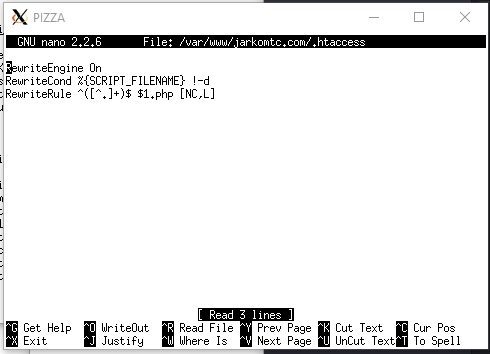

**Keterangan** :

    * RewriteEngine On = Untuk flag bahwa menggunakan module rewrite
    * RewriteCond %{SCRIPT_FILENAME} !-d = aturan tidak akan jalan ketika yang diakses adalah folder (d)
    * RewriteRule ^([^.]+)$ $1.php [NC,L] = $1 adalah parameter input yang akan dicari oleh webserver
    * Info cek [Klik Disini](https://httpd.apache.org/docs/2.4/rewrite/flags.html)

**STEP 2** - Buat file aboutus.php dengan isi

    <?php
        echo "Terima Kasih telah mengunjungi about us";
    ?>
    
**STEP 3** - Pindah ke folder **/etc/apache2/sites-available** kemudian buka file **jarkomtc.com** dan tambahkan

    <Directory /var/www/jarkomtc.com>
        Options +FollowSymLinks -Multiviews
        AllowOverride All
    </Directory>

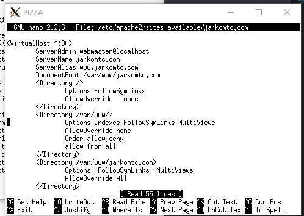

**Keterangan** :

* `AllowOverride All` ditambahkan agar konfigurasi **.htaccess** dapat berjalan.
* `+FollowSymLinks` ditambahkan agar konfigurasi **mod_rewrite** dapat berjalan.
* `-Multiviews` ditambahkan agar konfigurasi **mod_negotiation** tidak dapat berjalan. **mod_negotiation** bisa 'rewrite' requests sehingga menimpa dan mengganggu **mod_rewrite**.

**STEP 4** - Restart apache `service apache2 restart`

**STEP 5** - Buka browser dan akses **http://jarkomtc.com/aboutus**

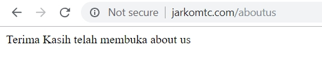

### H.5 Otorisasi

Pada web **http://jarkomtc.com** terdapat path **/data** yang tidak boleh dibuka sembarang orang. Nisa ingin **/data** hanya boleh di akses oleh pengguna yang memiliki ip **10.151.252.0/255.255.252.0**.

Maka yang dilakukan Adi agar Nisa tetap aman adalah

**STEP 1** - Pindah ke folder **/etc/apache2/sites-available** kemudian buka file **jarkomtc.com** dan tambahkan

    <Directory /var/www/jarkomtc.com/data>
        Options +Indexes
        Order deny,allow
        Deny from all
        Allow from 10.151.252.0/255.255.252.0
    </Directory>

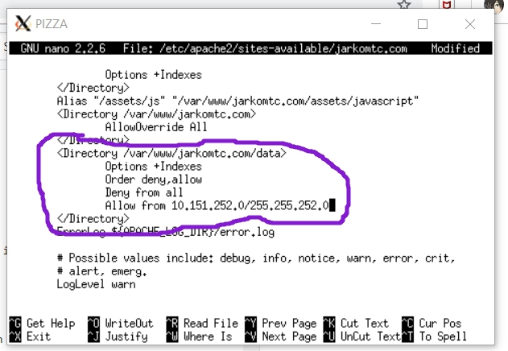

**Keterangan** :

* `Order deny,allow` merupakan urutan hak akses. Terdapat dua jenis tipe order yaitu:

1. deny,allow : Bagian *Deny* harus dideclare terlebih dahulu sebelum _Allow_
2. allow, deny : Bagian *Allow* harus dideclare terlebih dahulu sebelum _Deny_

* `Deny from all` berarti semua pengguna ditolak

* `Allow from 10.151.252.0/255.255.252.0` berarti apabila pengguna memiliki ip nid 10.151.252.0/22 diperbolehkan mengakses halaman.

* Info lebih lanjut [Klik Disini](https://httpd.apache.org/docs/2.4/mod/mod_access_compat.html)

**STEP 2** - Restart apache `service apache2 restart`

**STEP 3** - Buka browser dan akses **http://jarkomtc.com/data**

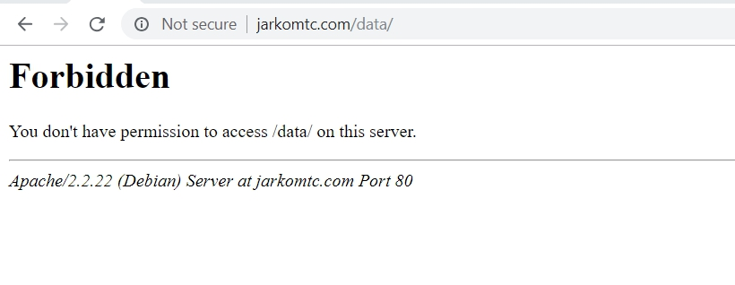

Gambar diatas ketika pengguna **tidak memiliki ip nid 10.151.252.0/22**

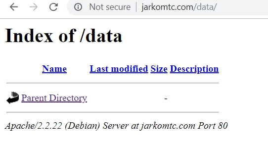

Gambar diatas ketika pengguna **memiliki ip nid 10.151.252.0/22**

### 4. Latihan
1. Download halaman MakanMakan di 10.151.36.5/MakanMakan
2. Buat domain baru dengan nama ayomakan.xxx.id untuk membuka halaman tersebut 
3. Atur agar jika kalian mengetikkan ayomakan.xxx.id Web MakanMakan dapat terbuka

#### Catatan
- Untuk download halaman web `wget 10.151.36.5/makanmakan.tar.xz`
- Untuk nomor 3, xxx diisi dengan nama kelompok. Contoh: ayomakan.b02.id

## 
MODUL DNS DAN WEB SERVER SELESAI

## 
Selamat Menunggu Soal Shift :)

