# 1. Dynamic Host Configuration Protocol (DHCP)

## Outline
- [1. Dynamic Host Configuration Protocol (DHCP)](#1-dynamic-host-configuration-protocol-dhcp)
    - [Outline](#outline)
    - [1.1 Konsep](#11-konsep)
        - [1.1.1 Pendahuluan](#111-pendahuluan)
        - [1.1.2 Apa itu DHCP?](#112-apa-itu-dhcp)
        - [1.1.3 Bootstrap Protocol dan Dynamic Host Configuration Protocol](#113-bootstrap-protocol-dan-dynamic-host-configuration-protocol)
        - [1.1.4 DHCP Message Header](#114-dhcp-message-header)
        - [1.1.5 Cara Kerja DHCP](#115-cara-kerja-dhcp)
    - [1.2 Implementasi](#12-implementasi)
        - [1.2.1 Instalasi ISC-DHCP-Server](#121-instalasi-isc-dhcp-server)
        - [1.2.2 Konfigurasi DHCP Server](#122-konfigurasi-dhcp-server)
        - [1.2.3 Konfigurasi DHCP Client](#123-konfigurasi-dhcp-client)
        - [1.2.4 Fixed Address](#124-fixed-address)
        - [1.2.5 Testing](#125-testing)
    - [1.3 Soal Latihan](#13-soal-latihan)
    - [1.4 Referensi](#14-referensi)
## 1.1 Konsep

### 1.1.1 Pendahuluan
Pada modul sebelumnya, kita telah mempelajari cara mengonfigurasi alamat IP, nameserver, gateway, dan subnetmask pada UML. Metode konfigurasi manual ini dapat diimplementasikan dengan mudah pada jaringan yang hanya memiliki sedikit host. Namun, apa yang terjadi jika suatu jaringan memiliki banyak host? Apakah Administrator Jaringan harus melakukan semua konfigurasi tersebut secara manual satu persatu ke semua host? Tentu tidak kawan!

Misalnya pada kasus jaringan WiFi umum: Apakah kalian pernah terfikir, siapakah yang bertugas memberikan alamat IP pada setiap client yang terhubung ke jaringan WiFi? Tentu saja pengalokasian dan pemberian alamat IP tersebut tidak dilakukan secara manual karena client yang terhubung sangatlah banyak dan berganti-ganti. 

Adapun kasus ini dapat diselesaikan oleh DHCP.

### 1.1.2 Apa itu DHCP?

**DHCP (Dynamic Host Configuration Protocol)** adalah protokol yang berbasis arsitektur client/server yang dipakai untuk memudahkan pengalokasian alamat IP dalam satu jaringan. DHCP secara otomatis meminjamkan alamat IP kepada host yang memintanya. 


Tanpa DHCP, administrator jaringan harus memasukkan alamat IP masing-masing komputer dalam suatu jaringan secara manual. Namun jika DHCP dipasang di jaringan, maka semua komputer yang tersambung ke jaringan akan mendapatkan alamat IP secara otomatis dari DHCP server.

### 1.1.3 Bootstrap Protocol dan Dynamic Host Configuration Protocol

Selain DHCP, terdapat protokol lain yang juga memudahkan pengalokasian alamat IP dalam suatu jaringan, yaitu Bootstrap Protocol (BOOTP). Perbedaan BOOTP dan DHCP terletak pada proses konfigurasinya.

| BOOTP | DHCP |
| --- | --- |
| Administrator jaringan melakukan konfigurasi mapping MAC Address client dengan IP tertentu. | Server akan melakukan peminjaman IP Address dan konfigurasi lainnya dalam rentang waktu tertentu. Protokol ini dibuat berdasarkan cara kerja BOOTP. |

### 1.1.4 DHCP Message Header


Keterangan:


### 1.1.5 Cara Kerja DHCP

DHCP bekerja dengan melibatkan dua pihak yakni **Server** dan **Client**: 

1. **DHCP Server** memberikan suatu layanan yang dapat memberikan alamat IP dan parameter lainnya kepada semua client yang memintanya. 
2. **DHCP Client** adalah mesin client yang menjalankan perangkat lunak client yang memungkinkan mereka untuk dapat berkomunikasi dengan DHCP server.

DHCP Server umumnya memiliki sekumpulan alamat IP yang didistribusikan yang disebut **DHCP Pool**. Setiap client akan meminjamnya untuk rentan waktu yang ditentukan oleh DHCP sendiri (dalam konfigurasi). Jika masa waktu habis, maka client akan meminta alamat IP yang baru atau memperpanjangnya. Itulah sebabnya alamat IP client menjadi dinamis.


Terdapat 4 tahapan yang dilakukan dalam proses peminjaman alamat IP pada DHCP:

1. **DHCPDISCOVER**: Client menyebarkan request secara broadcast untuk mencari DHCP Server yang aktif. DHCP Server menggunakan UDP port 67 untuk menerima broadcast dari client melalui port 68.
2. **DHCPOFFER**: DHCP server menawarkan alamat IP (dan konfigurasi lainnya apabila ada) kepada client. Alamat IP yang ditawarkan adalah salah satu alamat yang tersedia dalam DHCP Pool pada DHCP Server yang bersangkutan.
3. **DHCPREQUEST**: Client menerima tawaran dan menyetujui peminjaman alamat IP tersebut kepada DHCP Server.
4. **DHCPACK**: DHCP server menyetujui permintaan alamat IP dari client dengan mengirimkan paket ACKnoledgment berupa konfirmasi alamat IP dan informasi lain. Kemudian client melakukan inisialisasi dengan mengikat (binding) alamat IP tersebut dan client dapat bekerja pada jaringan tersebut. DHCP Server akan mencatat peminjaman yang terjadi.
5. **DHCPRELEASE**: Client menghentikan peminjaman alamat IP (apabila waktu peminjaman habis atau menerima DHCPNAK).


Lebih lanjut: [https://www.nada.kth.se/kurser/kth/2D1392/05/lectures/lecture_9.pdf](https://www.nada.kth.se/kurser/kth/2D1392/05/lectures/lecture_9.pdf)

## 1.2 Implementasi
### 1.2.1 Instalasi ISC-DHCP-Server
Pada topologi ini, kita akan menjadikan router **BAKSO** sebagai DHCP Server. Oleh karena itu, kita harus menginstal **isc-dhcp-server** di **BAKSO** dengan melakukan langkah-langkah berikut:

1. Update package lists di router **BAKSO**
    ```bash
    apt-get update
    ```
2. Install **isc-dhcp-server** di router **BAKSO**
    ```bash
    apt-get install isc-dhcp-server
    ```
    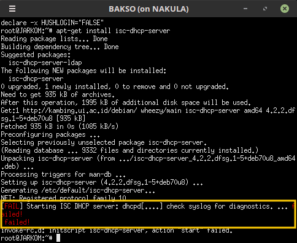

    **[FAIL]** 
    Eits, jangan panik dulu!!! Coba dibaca baik-baik, yang gagal bukanlah proses instalasinya, namun proses `starting ISC DHCP server`. Hal ini terjadi karena kita belum mengonfigurasi interface-nya. Mari kita lanjutkan ke langkah selanjutnya!

### 1.2.2 Konfigurasi DHCP Server
Langkah pertama yang harus dilakukan setelah instalasi adalah **menentukan interface** mana yang akan diberikan layanan DHCP. Konfigurasi interface terletak di `/etc/default/isc-dhcp-server`.

Maka, lakukanlah:

1. Membuka file konfigurasi
    ```bash
    nano /etc/default/isc-dhcp-server
    ```
2. Menentukan interface. 
   Coba cermati topologi kalian. Interface dari router **BAKSO** yang menuju ke client **SOTO**, **KARI**, dan **PECEL** adalah `eth2`, maka kita akan memilih interface `eth2` untuk diberikan layanan DHCP.

    ```bash
    INTERFACES="eth2"
    ```

    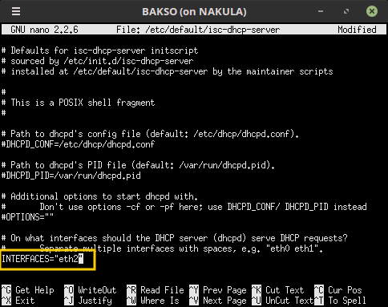

Setelah menentukan interface, langkah selanjutnya adalah **mengonfigurasi DHCP**-nya. Ada banyak hal yang dapat dikonfigurasi, antara lain:
* Range IP
* DNS Server
* Informasi Netmask
* Default Gateway
* dll

Konfigurasi DHCP terletak di `/etc/dhcp/dhcpd.conf`. Langkah-langkah yang harus dilakukan adalah:

1. Buka file konfigurasi
    ```bash
    nano /etc/dhcp/dhcpd.conf
    ```
2. Tambahkan script berikut:
    ```bash
    subnet 'NID' netmask 'Netmask' {
        range 'IP_Awal' 'IP_Akhir';
        option routers 'iP_Gateway';
        option broadcast-address 'IP_Broadcast';
        option domain-name-servers 'DNS_yang_diinginkan';
        default-lease-time 'Waktu';
        max-lease-time 'Waktu';
    }
    ```
    Script tersebut mengatur parameter jaringan yang dapat didistribusikan oleh DHCP, seperti informasi netmask, default gateway dan DNS server. Berikut ini beberapa **parameter jaringan dasar** yang biasanya digunakan:

    | No | Parameter Jaringan | Keterangan  |
    | --- |---|---|
    | 1 | `subnet 'NID'` | Network ID pada subnet. |
    | 2 | `netmask 'Netmask'` | Netmask pada subnet. |
    | 3 | `range 'IP_Awal' 'IP_Akhir'` | Rentang alamat IP yang akan didistribusikan dan digunakan secara dinamis. |
    | 4 | `option routers 'Gateway'` | IP gateway dari router menuju client sesuai konfigurasi subnet. |
    | 5 | `option broadcast-address 'IP_Broadcast'` | IP broadcast pada subnet. |
    | 6 | `option domain-name-servers 'DNS_yang_diinginkan'` | DNS yang ingin kita berikan pada client. |
    | 7 | Lease time | Waktu yang dialokasikan ketika sebuah IP dipinjamkan kepada komputer client. Setelah waktu pinjam ini selesai, maka IP tersebut dapat dipinjam lagi oleh komputer yang sama atau komputer tersebut mendapatkan alamat IP lain jika alamat IP yang sebelumnya dipinjam, dipergunakan oleh komputer lain. |
    | 8 | `default-lease-time 'Waktu'` | Lama waktu DHCP server meminjamkan alamat IP kepada client, dalam satuan detik. Default 600 detik.|
    | 9 | `max-lease-time 'Waktu'` | Waktu maksimal yang di alokasikan untuk peminjaman IP oleh DHCP server ke client dalam satuan detik. Default 7200 detik. |

    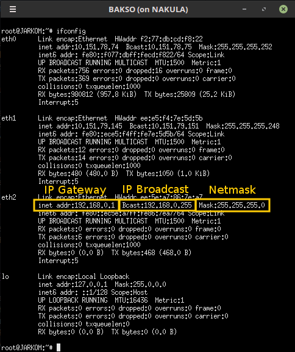

    Sehingga, konfigurasinya menjadi seperti ini:
    ```bash
    subnet 192.168.0.0 netmask 255.255.255.0 {
        range 192.168.0.10 192.168.0.20;
        option routers 192.168.0.1;
        option broadcast-address 192.168.0.255;
        option domain-name-servers 202.46.129.2;
        default-lease-time 600;
        max-lease-time 7200;
    }
    ```
    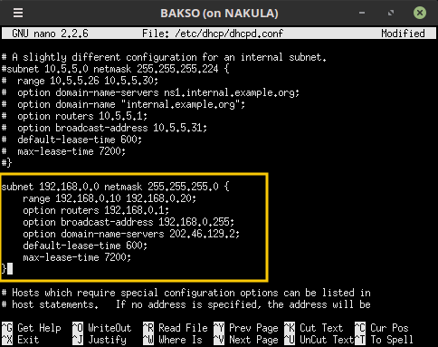

3. Jangan lupa restart servicenya!
    ```bash
    service isc-dhcp-server restart
    ```
    Jika terjadi **failed!**, maka stop dulu, kemudian start kembali
    ```bash
    service isc-dhcp-server stop
    service isc-dhcp-server start
    ```
    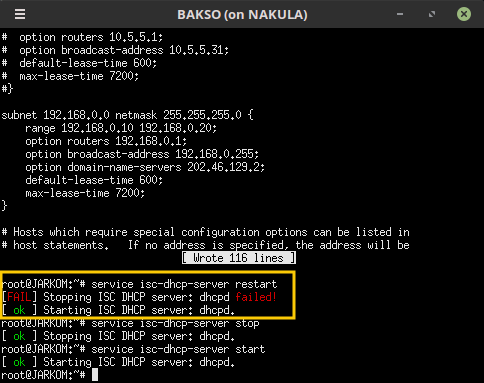

Konfigurasi DHCP Server selesai!

### 1.2.3 Konfigurasi DHCP Client
Setelah mengonfigurasi server, kita juga perlu mengonfigurasi interface client supaya client bisa mendapatkan layanan dari DHCP server. Di dalam topologi ini, clientnya adalah **SOTO**, **KARI**, dan **PECEL**. 

1. Sebelumnya, coba cek terlebih dahulu IP **SOTO** dengan `ifconfig`
    
    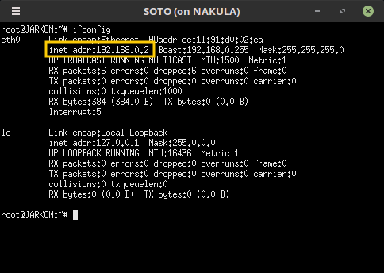

    Dari konfigurasi sebelumnya, **SOTO** telah diberikan IP static 192.168.0.2

2. Kemudian buka `/etc/network/interfaces` untuk mengonfigurasi interface **SOTO**.
    ```bash
    nano /etc/network/interfaces
    ```
3. Comment atau hapus konfigurasi yang lama, kemudian tambahkan script ini.
    ```bash
    auto eth0
    iface eth0 inet dhcp
    ```
    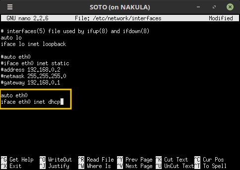

    **Keterangan**: 
    * **eth0** adalah interface yang digunakan client
    * `iface eth0 inet dhcp` : interface eth0 diberikan konfigurasi DHCP, bukan static

4. Jangan lupa restart!
    ```bash
    service networking restart
    ```
    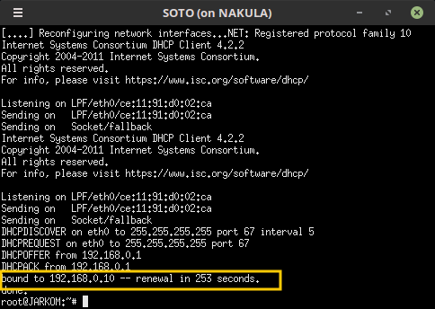

5. Testing

    Coba cek kembali IP **SOTO** dengan melakukan ```ifconfig```

    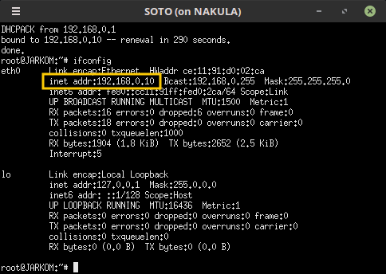

    Cek pula apakah **SOTO** sudah mendapatkan DNS server sesuai konfigurasi di DHCP. Cek di `/etc/resolv.conf`, dengan menggunakan command:
    
    ```bash 
    cat /etc/resolv.conf
    ```
    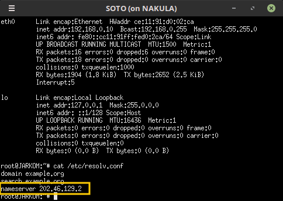

    Yeay! IP **SOTO** telah berubah sesuai dengan range IP yang diberikan oleh DHCP Server, serta nameserver-nya otomatis terkonfigurasi mengarah ke 202.46.129.2. DHCP kalian berhasil!

    **Keterangan** : 
    * Jika IP **SOTO** masih belum berubah, jangan panik. Lakukanlah kembali ```service networking restart```
    * Jika masih belum berubah juga, jangan buru-buru bertanya. Coba cek lagi semua konfigurasi yang telah kamu lakukan, mungkin ada typo-typo.

Lakukan kembali langkah-langkah di atas pada client **KARI** dan **PECEL**.

* Client **KARI**

    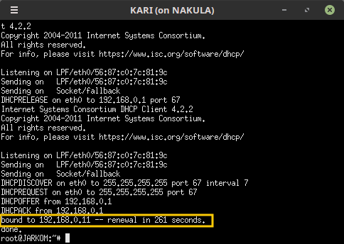

    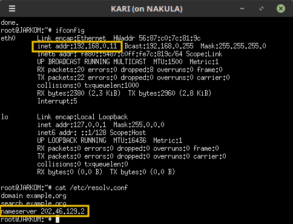

* Client **PECEL**

    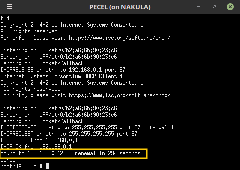

    

Setelah IP dipinjamkan ke sebuah client, maka IP tersebut tidak akan diberikan ke client lain. Buktinya, tidak ada client yang mendapatkan IP yang sama.

### 1.2.4 Fixed Address

> **Sebuah Kasus:**
> >
>    Ternyata PC **PECEL** selain menjadi client, juga akan digunakan sebagai server suatu aplikasi, sehingga akan menyulitkan jika IP nya berganti-ganti setiap **PECEL** terhubung ke jaringan internet. Oleh karena itu, **PECEL** membutuhkan IP yang tidak berganti-ganti. 

Untuk menyelesaikan kasus tersebut, DHCP Server memiliki layanan untuk "menyewakan" alamat IP secara tetap pada suatu host, yakni **Fixed Address**. Dalam kasus ini, **PECEL** akan mendapatkan IP tetap 192.168.0.15.

Lakukanlah:

1. Buka file konfigurasi DHCP Server di router **BAKSO**
     ```bash
    nano /etc/dhcp/dhcpd.conf
    ```
    Dan tambahkan script berikut:
    ```bash
    host pecel {
        hardware ethernet 'hwaddress_PECEL';
        fixed-address 192.168.0.15;
    }
    ```
    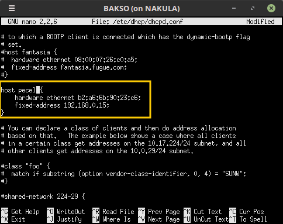

    **Penjelasan:**
    
    * Untuk mencari `'hwaddress_PECEL'` (hardware address) kalian bisa mengeceknya di UML **PECEL** dengan command `ifconfig`

        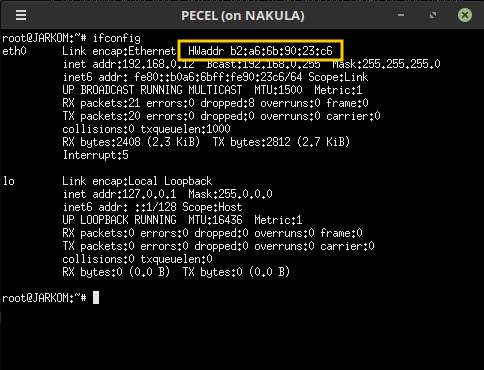

    * **fixed-address** adalah alamat IP yang "disewa" tetap oleh **PECEL**
    
2. Jangan lupa restart!
    ```bash
    service isc-dhcp-server restart
    ```

Setelah mengonfigurasi DHCP server, kita juga harus mengonfigurasi DHCP client. Lakukanlah:

1. Buka file konfigurasi interface **PECEL**
    ```bash
    nano /etc/network/interfaces
    ```
2. Tambahkan script berikut pada konfigurasi
    ```bash
    hwaddress ether 'hwaddress_PECEL'
    ```

    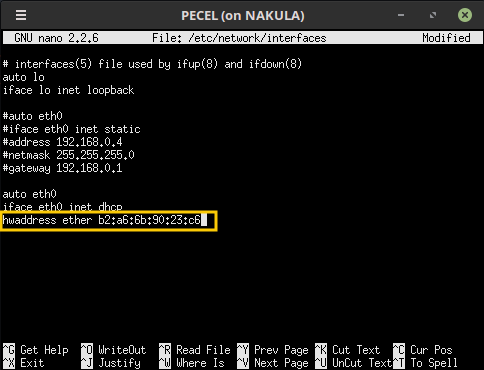

    **Keterangan:** 
    Hardware address perlu di-setting juga di **/etc/network/interfaces** karena perangkat yang kalian gunakan adalah perangkat virtual (UML) dimana hwaddress-nya akan berubah setiap kali dijalankan.

3. Jangan lupa restart!
    ```bash
    service networking restart
    ```
    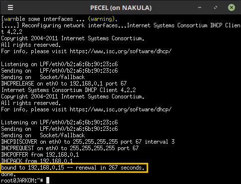

4. Testing

    Coba cek IP **PECEL** dengan melakukan ```ifconfig```

    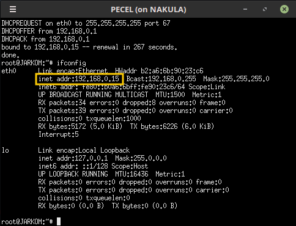

    Yeay! IP **PECEL** telah berubah menjadi 192.168.0.15 sesuai dengan Fixed Address yang diberikan oleh DHCP Server.

### 1.2.5 Testing

Setelah melakukan berbagai konfigurasi di atas, kalian bisa memastikan apakah DHCP Server kalian berhasil dengan cara:

1. Matikan UML kalian
    ```bash
    bash bye.sh
    ```
2. Jalankan UML kembali 
    ```bash
    bash topologi.sh
    ```
3. Cek IP di semua client dengan ```ifconfig```.

    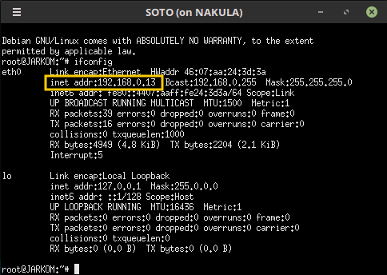

    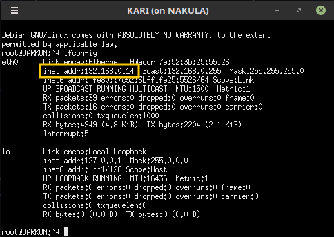

    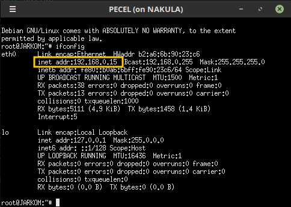
    
Jika **SOTO** dan **KARI** berganti alamat IP sesuai dengan range yang telah dikonfigurasi DHCP dan **PECEL** tetap mendapatkan IP 192.168.0.15, maka konfigurasi DHCP server kalian berhasil. 

## 1.3 Soal Latihan
1. Buatlah konfigurasi DHCP agar SOTO dan KARI mendapatkan IP dengan range 192.168.0.1 - 192.168.0.10 dan 192.168.0.12 - 192.168.0.16 dengan syarat:
    * Setiap 1 menit IP yang digunakan client berganti
    * DNS mengarah ke DNS server kalian sendiri yaitu KATSU, tetapi tetap bisa digunakan untuk mengakses internet
2. Bagaimana cara konfigurasi DHCP dengan 2 interface?

## 1.4 Referensi
* **Manual ISC DHCP** : https://www.isc.org/wp-content/uploads/2018/10/dhcpd44.html
* https://www.nada.kth.se/kurser/kth/2D1392/05/lectures/lecture_9.pdf
* http://www.tcpipguide.com/free/t_DHCPGeneralOperationandClientFiniteStateMachine.htm