# 2. Proxy Server

## Outline
- [2. Proxy Server](#2-proxy-server)
    - [Outline](#outline)
    - [2.1 Pengertian, Fungsi, dan Manfaat](#21-pengertian-fungsi-dan-manfaat)
        - [2.1.1 Pengertian](#211-pengertian)
        - [2.1.2 Fungsi](#212-fungsi)
        - [2.1.3 Manfaat](#213-manfaat)
        - [2.1.4 Software Proxy Server](#214-software-proxy-server)
        - [2.1.5 Cara Kerja Squid](#215-cara-kerja-squid)
    - [2.2 Implementasi](#22-implementasi)
        - [2.2.1 Instalasi Squid](#221-instalasi-squid)
        - [2.2.2 Konfigurasi Dasar Squid](#222-konfigurasi-dasar-squid)
        - [2.2.3 Membuat User Login](#223-membuat-user-login)
        - [2.2.4 Pembatasan Waktu Akses](#224-pembatasan-waktu-akses)
        - [2.2.5 Pembatasan Akses ke Website Tertentu](#225-pembatasan-akses-ke-website-tertentu)
        - [2.2.6 Pembatasan Bandwidth](#226-pembatasan-bandwidth)
    - [2.3 Soal Latihan](#23-soal-latihan)
    - [2.4 Referensi](#24-referensi)
  
## 2.1 Pengertian, Fungsi, dan Manfaat
### 2.1.1 Pengertian
Proxy server adalah sebuah server atau program komputer yang berperan sebagai penghubung antara suatu komputer dengan jaringan internet. Atau dalam kata lain, proxy server adalah suatu jaringan yang menjadi perantara antara jaringan lokal dan jaringan internet.

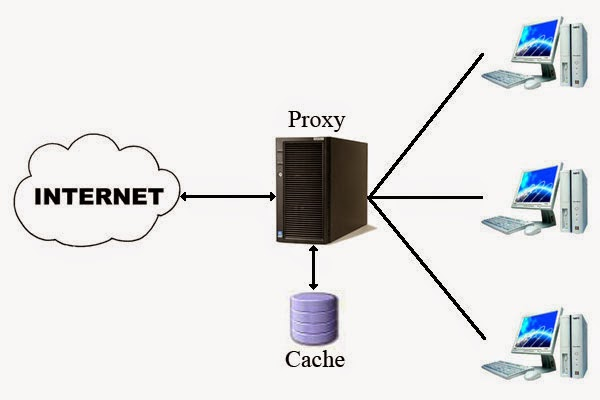

Proxy server dapat berupa suatu sistem komputer ataupun sebuah aplikasi yang bertugas menjadi gateway atau pintu masuk yang menghubungan komputer kita dengan jaringan luar.

### 2.1.2 Fungsi
1. ***Connection sharing*** :
Proxy bertindak sebagai gateway yang menjadi pembatas antara jaringan lokal dengan jaringan luar. Gateway bertindak juga sebagai sebuah titik dimana sejumlah koneksi dari pengguna lokal dan koneksi jaringan luar juga terhubung kepadanya. Oleh sebab itu, koneksi dari jaringan lokal ke internet akan menggunakan sambungan yang dimiliki oleh gateway secara bersama-sama (connection sharing).

2. ***Filtering*** :
Proxy bisa difungsikan untuk bekerja pada layar aplikasi dengan demikian maka dia bisa berfungsi sebagai firewalll paket filtering yang dapat digunakan untuk melindungi jaringan lokal terhadap gangguan maupun ancaman serangan dari jaringan luar. Fungsi filtering ini juga dapat diatur atau dikonfigurasi untuk menolak akses terhadap situs web tertentu dan pada waktu- waktu tertentu juga.

3. ***Caching*** :
Sebuah proxy server mempunyai mekanisme penyimpanan obyek-obyek yang telah diminta dari server-server yang ada di internet. Dengan mekanisme caching ini maka akan menyimpan objek-objek yang merupakan berbagai permintaan/request dari para pengguna yang di peroleh dari internet.

### 2.1.3 Manfaat
Proxy server memiliki manfaat-manfaat berikut ini:
- Membagi koneksi
- Menyembunyikan IP
- Memblokir situs yang tidak diinginkan
- Mengakses situs yang telah diblokir
- Mengatur bandwith

### 2.1.4 Software Proxy Server
Beberapa contoh software proxy server yang sering digunakan adalah sebagai berikut:
1. CCProxy
2. WinGate
3. Squid
4. Nginx

### 2.1.5 Cara Kerja Squid
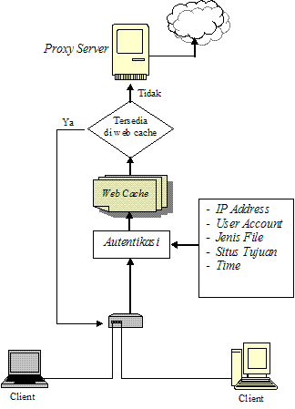

## 2.2 Implementasi
Untuk praktikum jarkom kali ini, software proxy server yang digunakan adalah **Squid** dan UML yang digunakan sebagai proxy server adalah **PIZZA**.

### 2.2.1 Instalasi Squid
**STEP 1** - Install squid3 pada UML **PIZZA**, ketikkan:
```bash
apt-get install squid3
```


**STEP 2** - Cek status squid3 untuk memastikan bahwa Squid3 telah berjalan dengan baik dengan mengetikkan 
```bash
service squid3 status
```

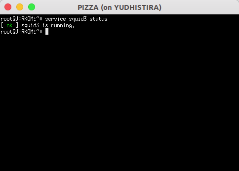

Jika muncul status **ok** maka instalasi telah berhasil.

### 2.2.2 Konfigurasi Dasar Squid
**STEP 1** - Backup terlebih dahulu file konfigurasi default yang disediakan squid. Ketikkan perintah berikut untuk melakukan backup:

```bash
mv /etc/squid3/squid.conf /etc/squid3/squid.conf.bak
```

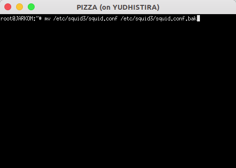

**STEP 2** - Buat konfigurasi baru dengan mengetikkan:
```bash
nano /etc/squid3/squid.conf
```

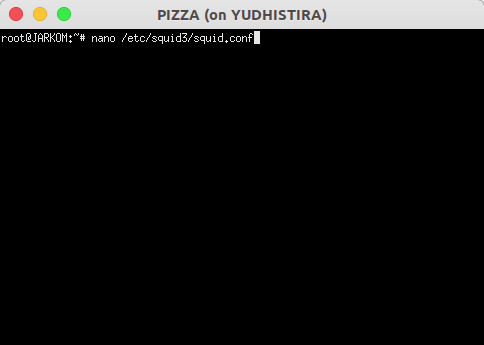

**STEP 3** - Kemudian, pada file config yang baru, ketikkan script:
```bash
http_port 8080
visible_hostname pizza
```

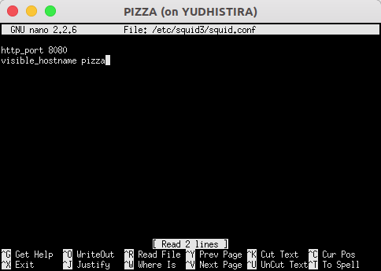

**Keterangan:**
- `http_port 8080` : Port yang digunakan untuk mengakses proxy, dalam kasus ini adalah **8080**. (Sintaks: `http_port 'PORT_YANG_DIINGINKAN'`)
- `visible_hostname pizza` : Nama proxy yang akan terlihat oleh user (Sintaks: `visible_hostname 'NAMA_YANG_DIINGINKAN'`)

**STEP 4** - Restart squid dengan cara mengetikkan perintah:
```bash
service squid3 restart
```

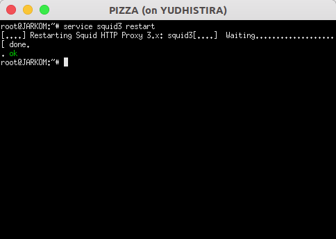

**STEP 5** - Ubah pengaturan proxy browser. 
Gunakan **IP PIZZA** sebagai host dan isikan port **8080**. Kemudian cobalah untuk mengakses web **http://its.ac.id** (usahakan menggunakan mode **incognito/private**). Maka akan muncul halaman seperti berikut:


**STEP 7** - Supaya bisa mengakses web **http://its.ac.id**, maka kalian harus menambah sebaris script pada konfigurasi squid. Buka kembali file konfigurasi tadi dan tambahkan baris berikut:
```bash
http_access allow all
```

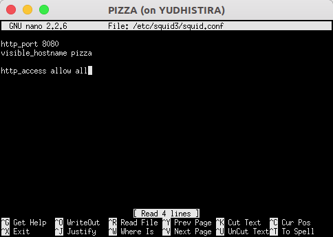

**Keterangan:**
- `http_access allow all` : Memperbolehkan semuanya untuk mengakses proxy via http. Pengaturan ini perlu ditambahkan karena pengaturan default squid adalah **deny** (Sintaks: `http_access allow 'TARGET'`)
- Untuk menolak koneksi, maka **allow** diganti dengan **deny**.

**STEP 9** - **Simpan** file konfigurasi tersebut, lalu **restart** squid. Refresh halaman web **http://its.ac.id**. 

Seharusnya halaman yang ditampilkan kembali normal.

### 2.2.3 Membuat User Login

**STEP 1** - Install `apache2-utils` pada UML **PIZZA**. Sebelumnya kalian sudah harus melakukan `apt-get update`. Ketikkan:
```bash
apt-get install apache2-utils
```

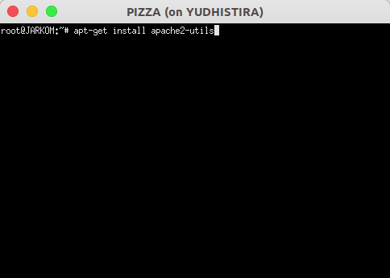

**STEP 2** - Buat user dan password baru. Ketikkan:
```bash
htpasswd -c /etc/squid3/passwd jarkom204
```
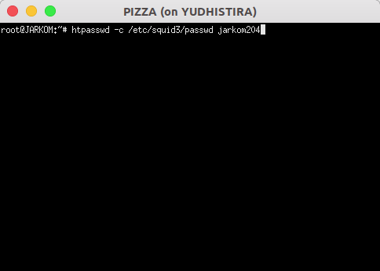

Ketikkan password yang diinginkan. Jika sudah maka akan muncul notifikasi:

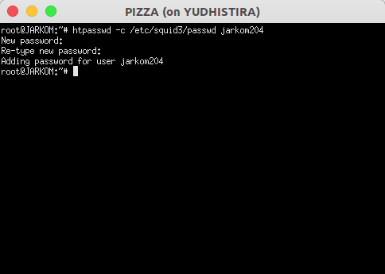

**STEP 3** - Edit konfigurasi squid menjadi:
```bash
http_port 8080
visible_hostname pizza

auth_param basic program /usr/lib/squid3/ncsa_auth /etc/squid3/passwd
auth_param basic children 5
auth_param basic realm Proxy
auth_param basic credentialsttl 2 hours
auth_param basic casesensitive on
acl USERS proxy_auth REQUIRED
http_access allow USERS
```

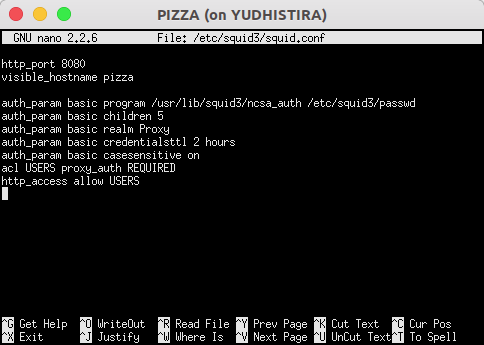

**Keterangan:**
- `auth_param` digunakan untuk mengatur autentikasi (Sintaks: `auth_param 'SCHEME' 'PARAMETER' 'SETTING'`. Lebih lengkapnya di [http://www.squid-cache.org/Doc/config/auth_param/](http://www.squid-cache.org/Doc/config/auth_param/)).
- `program` : Perintah untuk mendefiniskan autentikator eksternal.
- `children` : Mendefinisikan jumlah maksimal autentikator muncul.
- `realm` : Teks yang akan muncul pada pop-up autentikasi.
- `credentialsttl` : Mengatur masa aktif suatu autentikasi berlaku.
- `casesensitive` : Mengatur apakah **username** bersifat case sensitive atau tidak.
- `acl` digunakan untuk mendefinisikan pengaturan akses tertentu. (Sintaks umum: **acl ACL_NAME ACL_TYPE ARGUMENT** . Lebih lengkapnya di http://www.squid-cache.org/Doc/config/acl/)
- Untuk melihat daftar apa saja yang bisa diatur dengan acl bisa diakses di: https://wiki.squid-cache.org/SquidFaq/SquidAcl)

**STEP 4** - Restart squid

**STEP 5** - Ubah pengaturan proxy browser. Gunakan **IP PIZZA** sebagai host, dan isikan port **8080**. Kemudian cobalah untuk mengakses web **elearning.if.its.ac.id** (usahakan menggunakan mode **incognito/private**), akan muncul pop-up untuk login.

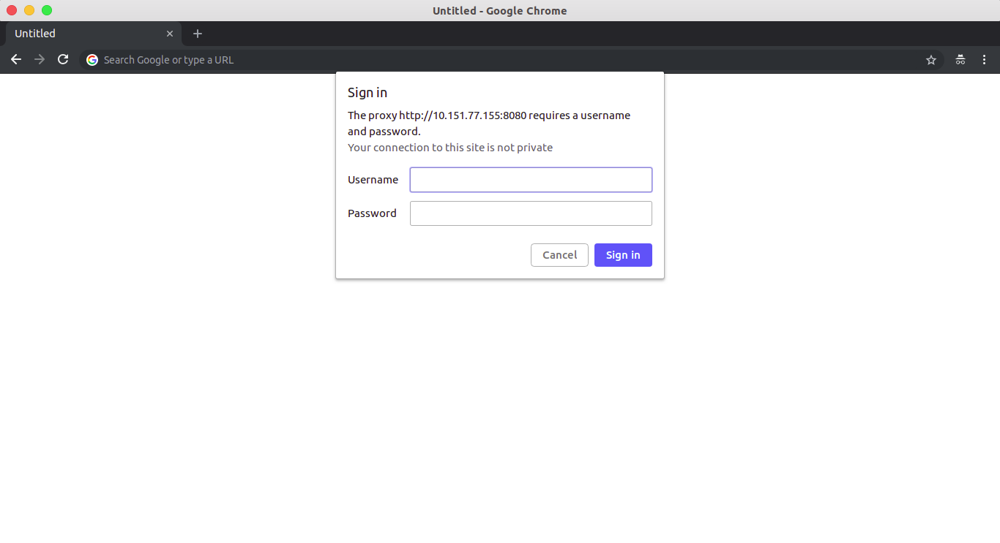

**STEP 6** - Isikan username dan password.

**STEP 7** - E-learning berhasil dibuka.

### 2.2.4 Pembatasan Waktu Akses

Kita akan mencoba membatasi akses proxy pada hari dan jam tertentu. Asumsikan proxy dapat digunakan hanya pada hari **Senin** sampai **Jumat** pada jam **08.00-16.00**.

**STEP 1** - Buat file baru bernama **acl.conf** di folder **squid3**

    nano /etc/squid3/acl.conf

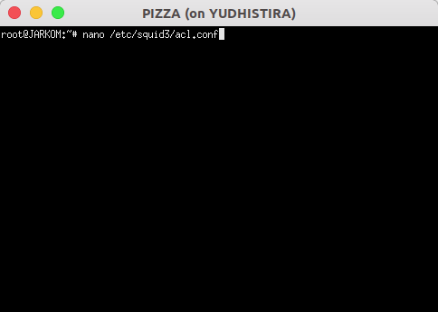

**STEP 2** - Tambahkan baris berikut

    acl KERJA time MTWHF 08:00-16:00

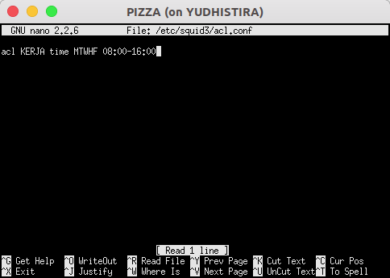

**STEP 3** - Simpan file **acl.conf**.

**STEP 4** - Buka file **squid.conf**.

    nano /etc/squid3/squid.conf

**STEP 5** - Ubah konfigurasinya menjadi:

    include /etc/squid3/acl.conf
    
    http_port 8080
    http_access allow KERJA
    http_access deny all
    visible_hostname pizza

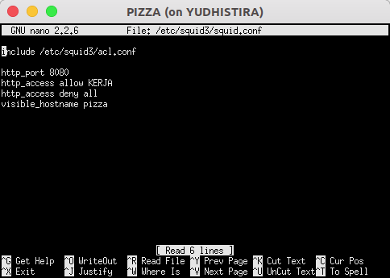

**STEP 6** - Simpan file tersebut. Kemudian restart squid.

**STEP 7** - Cobalah untuk mengakses web **http://its.ac.id** (usahakan menggunakan mode **incognito/private**). Akan muncul halaman error jika mengakses diluar waktu yang telah ditentukan.

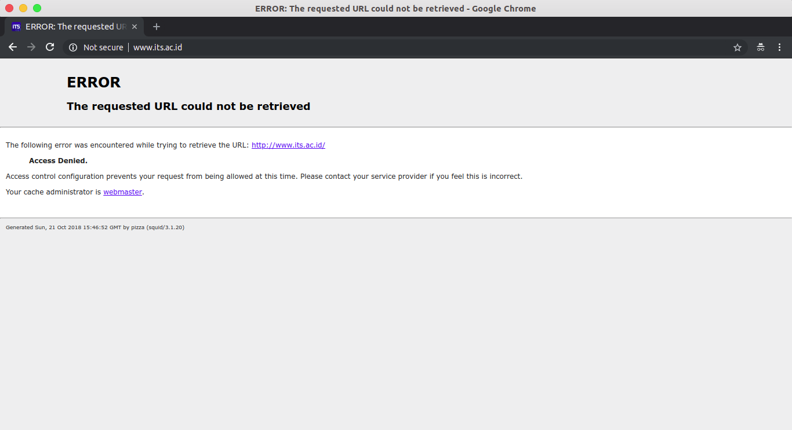

Keterangan:
- **MTWHF** adalah hari-hari dimana user diperbolehkan menggunakan proxy. (S: Sunday, M: Monday, T: Tuesday, W: Wednesday, H: Thursday, F: Friday, A: Saturday)
- Penulisan jam menggunakan format: **h1:m1-h2:m2**. Dengan syarat **h1<h2** dan **m1<m2**

### 2.2.5 Pembatasan Akses ke Website Tertentu

Kita akan mencoba membatasi akses ke beberapa website. Untuk contoh disini, kita akan memblokir website **elearning.if.its.ac.id**

**STEP 1** - Buat file bernama **bad-sites.acl** di folder **squid3** dengan mengetikkan:

    nano /etc/squid3/bad-sites.acl
    
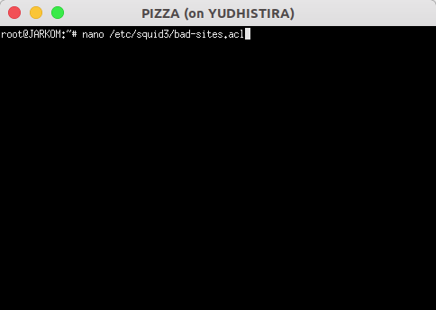

**STEP 2** - Tambahkan alamat url yang akan diblock seperti baris berikut:

    elearning.if.its.ac.id

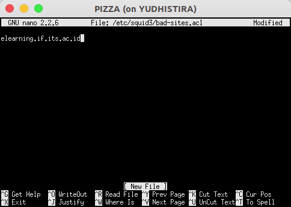

**STEP 3** - Ubah file konfigurasi squid menjadi seperti berikut ini.

    http_port 8080
    visible_hostname pizza

    acl BLACKLISTS dstdomain "/etc/squid3/bad-sites.acl"
    http_access deny BLACKLISTS
    http_access allow all

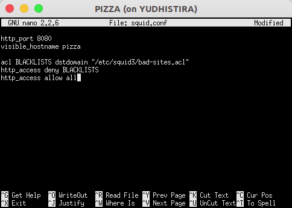

**STEP 4** - Restart squid. Kemudian cobalah untuk mengakses web **elearning.if.its.ac.id** (usahakan menggunakan mode **incognito/private**). Seharusnya muncul halaman error seperti di bawah ini.


Keterangan:
- **dstdomain** artinya destination domain/domain tujuan. Sintaksnya bisa diikuti dengan nama domain tujuan atau file yang menampung list-list alamat website.

### 2.2.6 Pembatasan Bandwidth

Kita akan mencoba untuk membatasi bandwidth yang akan diberikan kepada user proxy. Untuk contoh disini kita akan membatasi penggunaannya maksimal 512 kbps.

**STEP 1** - Buat file bernama acl-bandwidth.conf di folder squid3

    nano /etc/squid3/acl-bandwidth.conf
    
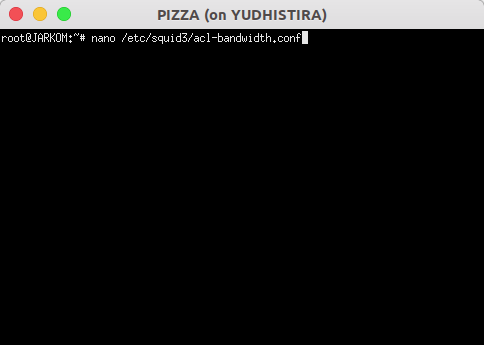

**STEP 2** - Ketikkan baris berikut

    delay_pools 1
    delay_class 1 1
    delay_access 1 allow all
    delay_parameters 1 16000/64000

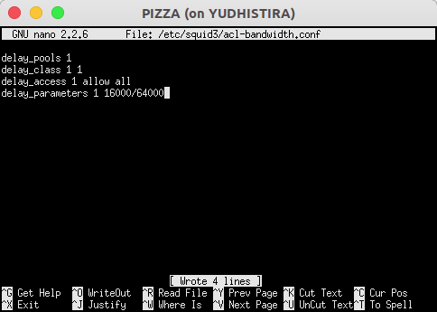

**STEP 3** - Ubah konfigurasi squid3 menjadi:

    include /etc/squid3/acl-bandwidth.conf
    http_port 8080
    visible_hostname pizza

    http_access allow all

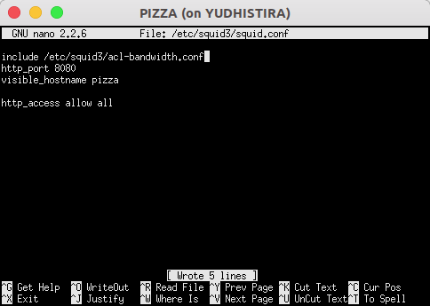

**STEP 4** - Restart Squid

**STEP 5** - Cobalah untuk melakukan speed test. Berikut perbedaan sebelum dan sesudah adanya pembatasan bandwidth saat melakukan speed test

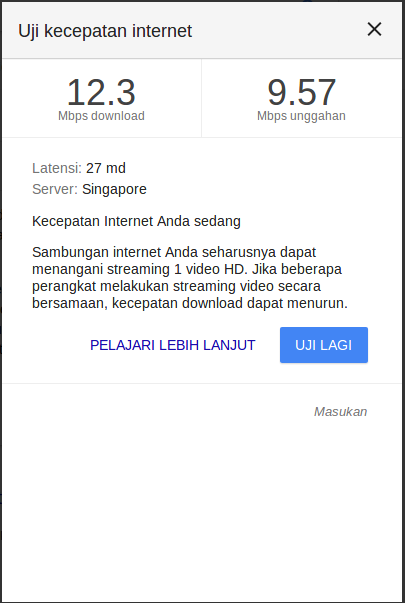 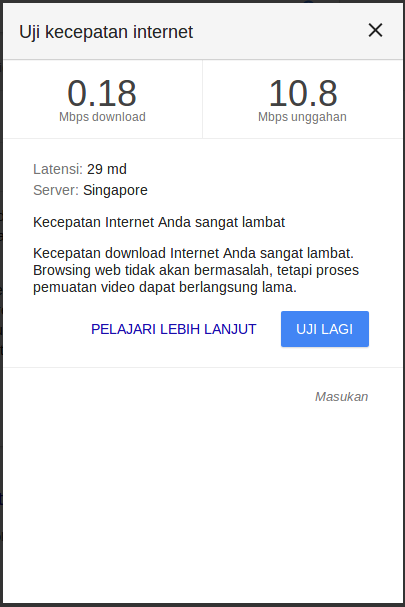

Keterangan:
- **delay_pools** digunakan untuk menentukan berapa bagian/pool yang akan dibuat. (Sintaks: **delay_pools JUMLAH_YANG_DIINGINKAN**. 
Lebih lengkap lihat di http://www.squid-cache.org/Doc/config/delay_pools/).
- **delay_class** digunakan untuk menentukan tipe/class pembagian bandwith dari setiap pool. (Sintaks: **delay_class POOL_KE_BERAPA KELAS**.) 
Lebih lengkap lihat di http://www.squid-cache.org/Doc/config/delay_class/.
- **delay_access** mirip seperti http_access, tetapi digunakan untuk mengakses pool yang telah dibuat (Sintaks: **delay_access POOL_KE_BERAPA allow/deny TARGET**. 
Lebih lengkap lihat di http://www.squid-cache.org/Doc/config/delay_access/).
- **delay_parameters** digunakan untuk mengatur parameter dari pool yang telah dibuat. Sintaks berbeda-beda sesuai dengan tipe/kelas dari pool yang dibuat. 
Lebih lengkap lihat di http://www.squid-cache.org/Doc/config/delay_parameters/
- **16000/64000** **(restore/max)**
**restore** menentukan besarnya bandwith dalam satuan bytes/second
**max** menentukan besarnya file atau bucket yang dapat dilewatkan tanpa melalui delay dalam satuan bytes.
- Penjelasan dari fitur **delay_pools** lebih lengkap bisa dilihat di https://wiki.squid-cache.org/Features/DelayPools

## 2.3 Soal Latihan
Mocatfrio adalah seorang mahasiswi Informatika ITS. Dia ingin membuat sebuah proxy sendiri. Proxy yang akan dibuat nantinya harus bisa diakses dengan nama **proxy.xxx.id** dan port yang digunakan **8080**. Dia ingin ada login terlebih dahulu saat menggunakan proxy. Untuk akun yang akan digunakan untuk dirinya sendiri, dia ingin menggunakan username **mocatfrio** dan password **n0-madeN**. Proxy ini nantinya hanya bisa digunakan saat mocatfrio sedang ada kelas. Jadwal kelas mocatfrio adalah Senin, Rabu, dan Kamis mulai jam 7 pagi sampai jam 4 sore. Kemudian, dia ingin membatasi agar hanya user dari **Informatics_wifi** saja yang bisa menggunakan proxy tersebut. Lalu, dia teringat kalau dulu dia pernah ditolak masuk Unair. Oleh karena itu dia memutuskan untuk memblokir website Unair (unair.ac.id) beserta seluruh subdomain yang ada. Supaya adil, dia ingin agar seluruh user mendapatkan bandwidth yang sama, yaitu 512 kbps.

Karena mocatfrio ternyata sangat sibuk, maka dia meminta bantuan kalian untuk membuatkan proxy seperti yang dia minta. Cobalah untuk memenuhi permintaan mocatfrio supaya mocatfrio merasa senang.

Keterangan:
- **xxx** adalah kelompok kalian masing-masing. Misal: **c01**
- **Informatics_wifi** : 10.151.252.0/22

## 2.4 Referensi
* **Manual Squid3** : http://www.visolve.com/uploads/resources/squid30.pdf
