SUBNETTING AND ROUTING
======================

Modul 4 kali ini akan membahas tentang ***Subnetting*** dan ***Routing***.

- [A. PENGENALAN](#a-pengenalan)
    - [Istilah](#istilah)
    - [IP Address](#ip-address)
    - [Subnet](#subnet)
    - [Network ID, Broadcast Address, dan Available Hosts](#network-id-broadcast-address-dan-available-hosts)
        - [Network ID](#network-id)
        - [Broadcast Address](#broadcast-address)
        - [Available Hosts](#available-hosts)
    - [IP Publik dan IP Privat](#ip-publik-dan-ip-privat)
    - [Let’s Wrap and Warm Up!](#lets-wrap-and-warm-up)
- [B. SUBNETTING](#b-subnetting)
    - [Pengertian](#pengertian)
    - [Perhitungan Subnet](#perhitungan-subnet)
        - [A. Classful](#a-classful)
        - [B. Classless](#b-classless)
            - [1. VLSM (Variable Length Subnet Masking)](#1-vlsm-variable-length-subnet-masking)
            - [2. CIDR (Classless Inter Domain Routing)](#2-cidr-classless-inter-domain-routing)
- [C. ROUTING](#c-routing)
    - [Pengertian](#pengertian-1)
    - [Praktik](#praktik)
        - [1) Membuat Topologi](#1-membuat-topologi)
        - [2) Subnetting](#2-subnetting)
        - [3) Routing](#3-routing)
        - [4) Testing](#4-testing)
- [LATIHAN!](#latihan)

## A. PENGENALAN
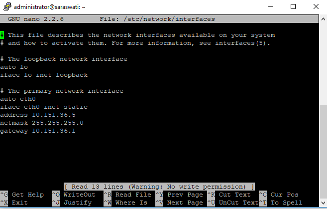

### Istilah

Istilah | Penjelasan
--------|-----------
iface | Disebut network interface, antarmuka yang menghubungkan 2 layer protokol. Setiap interface memiliki nama yang berbeda
eth0 | Salah satu nama interface yang digunakan untuk berhubungan dengan subnet
address | Sebuah alamat IP unik bagi komputer dalam sebuah jaringan
netmask | Kombinasi angka sepanjang 32 bit yang berfungsi membagi IP ke dalam subnet-subnet dan menentukan rentang alamat IP pada subnet yang bisa digunakan
gateway | Alamat IP yang menjadi pintu keluar menuju subnet lain, biasanya diisi alamat IP router terdekat

**Mengapa Perlu Subnetting?**

Sebagai permisalan, wilayah Indonesia perlu dibagi menjadi bagian-bagian kecil (provinsi, kota, dan seterusnya). Tujuannya untuk memudahkan pemerintah dalam mengatur kebijakan sesuai kondisi dari daerah masing-masing. Hal tersebut juga yang terjadi pada jaringan internet. Jaringan mencakup seluruh koneksi antar komputer yang terhubung ke internet.
Manfaat subnetting :
- Meningkatkan efisiensi routing
- Dapat mengatur kebijakan sendiri untuk keamanan jaringan
- Mengurangi ukuran broadcast domain

**Mengapa Perlu Routing?**

Sebagai permisalan, ketika Anda ingin mengantar paket, maka perlu mencantumkan alamat tujuan. Kemudian Anda kirim ke kantor pos, lalu kantor pos akan mengirimkan paket ke alamat yang dituju. Agar paket sampai ditujuan yang benar, Pak Pos yang mengirimkan paket perlu mengetahui rute untuk mencapai tujuan paket tersebut, proses tersebut yang dinamakan ***routing***. Yaitu, memberitahukan rute perjalanan kepada Pak Pos untuk mencapai alamat tujuan paket yang diantarkannya.

### IP Address
IP Address (Versi 4)

- Alamat IP adalah suatu alamat unik yang diberikan untuk menandai sebuah komputer yang terhubung dalam suatu jaringan.
- Alamat IP terdiri dari 32 bit biner yang dalam penulisannya dikonversi menjadi bilangan desimal.
- Alamat IP (yang panjangnya 32 bit itu) dibagi menjadi 4 oktet (masing-masing oktet berisi 8 bit) dipisahkan dengan tanda titik.

### Subnet

### Network ID, Broadcast Address, dan Available Hosts
Jika suatu PC memiliki alamat 10.151.36.5/24, maka informasi yang dapat digali dari IP tersebut adalah:

1. Alamat IP
2. Netmask
3. Network ID (NID) : Sebuah alamat IP yang menjadi identitas untuk suatu area jaringan/subnet
4. Broadcast Address : Sebuah alamat IP yang berperan untuk pengiriman pesan broadcast dalam suatu jaringan/subnet
5. Available Hosts: Rentang alamat IP yang bisa digunakan dalam suatu jaringan/subnet

Contoh skenario:
    Carilah Network ID (NID), Broadcast Address, dan rentang alamat IP dari sebuah alamat 10.151.36.5/24!
    
Penyelesaian :
    Informasi sementara yang didapat dari 10.151.36.5/24 adalah
    
        1. IP : 10.151.36.5
        2. Netmask : 255.255.255.0 (/24)
        3. Network ID?
        4. Broadcast Address?
        5. Available Host?
   
   Berikut akan dijelaskan bagaimana mencari NID, Broadcast Address, dan Available Host:
   
#### Network ID
Mencari Network ID (NID)

#### Broadcast Address
Mencari Broadcast Address

#### Available Hosts
Mencari rentang alamat IP

### IP Publik dan IP Privat
Alamat IP dibagi menjadi 2 jenis, yaitu :
- IP Publik = alamat IP yang digunakan dalam jaringan global Internet, cirinya alamat IP dapat diakses melalui internet secara langsung.
- IP Privat = alamat IP yang digunakan (dikenali) dan hanya dapat diakses oleh jaringan lokal.

Rentang IP Privat :
- 10.0.0.0/8 (Class A)
- 172.16.0.0/12, 172.31.0.0/12 (Class B)
- 192.168.0.0/16 (Class C)

Rentang IP Publik adalah selain rentang IP Privat di atas.

### Let’s Wrap and Warm Up!

    
**Mari Diskusi**

1. Carilah Network ID, Broadcast Address dan rentang alamat IP dari 172.16.1.27/29
2. Apakah IP 10.151.36.5/24 dan 10.151.36.128/24 berada dalam satu subnet? Sebutkan alasannya.
3. Apakah IP 10.151.252.5/22 dan 10.151.253.10/22 berada dalam satu subnet? Sebutkan alasannya.
   
## B. SUBNETTING
### Pengertian

**Subnet** adalah suatu sub jaringan dari jaringan yang lebih besar. Dengan adanya subnet, kita dapat melakukan manajemen suatu jaringan dengan lebih baik.

**Tujuan** utama kita belajar subnetting adalah **pembagian alamat IP untuk kebutuhan tertentu**. Contohnya pada gedung Departemen Informatika dimana terdapat beberapa laboratorium, dan setiap laboratorium memiliki lebih dari 1 komputer yang harus dikonfigurasikan sedemikian rupa agar dapat saling berkomunikasi dan mengakses internet.

Dari contoh tersebut, muncullah salah satu konfigurasi paling dasar dalam penyelesaian permasalahan ini yaitu pembagian alamat IP untuk setiap laboratorium di gedung Departemen Informatika, seperti :
1. Laboratorium LP memiliki jaringan dengan subnet **10.151.34.0/24**
2. Laboratorium AJK memiliki jaringan dengan subnet **10.151.36.0/24**

### Perhitungan Subnet
Ada dua metode pembagian IP yang dikenal dalam jaringan, yaitu Classful

#### A. Classful
Pembagian IP dengan menggunakan metode ini didasarkan pada pembagian class pada alamat IP. Tiap subnet akan diberikan ukuran atau netmask yang dapat menampung jumlah komputer/ host yang terdapat dalam subnet tersebut. Tabel berikut menunjukkan Class yang terdapat pada metode ***Classful***.

Class | Netmask | Jumlah Host
------|---------|------------
Class A | /8 | 16777216
Class B | /16 | 65536
Class C | /24 | 256

Contoh penerapan pembagian alamat IP dengan metode ***Classful*** sebagai berikut.

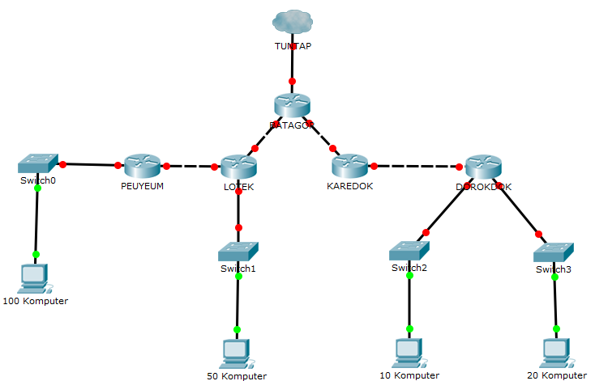

Anggap kita memiliki topologi jaringan seperti gambar di atas. Lalu, tentukan jumlah subnet yang ada di dalam topologi tersebut.

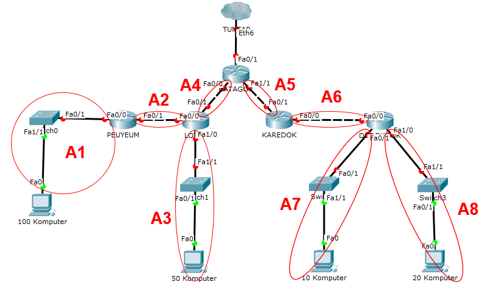

Terdapat 8 subnet di dalam topologi. Dengan menggunakan teknik classful setiap subnet akan memiliki netmask /24 karena semua subnet memiliki jumlah host di bawah 256. Sehingga pembagian IP yang memungkinkan untuk topologi di atas adalah sebagai berikut.

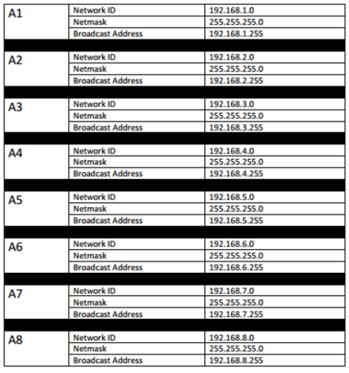

#### B. Classless

##### 1. VLSM (Variable Length Subnet Masking)

Inti utama dari penggunaan teknik VLSM adalah untuk mengefisienkan pembagian IP di dalam jaringan. Besar netmask disesuaikan dengan banyaknya komputer/ host yang membutuhkan alamat IP.

> Jadi, pada teknik **VLSM**, subnet mask (netmask) akan diberikan sesuai dengan kebutuhan jumlah alamat IP dari subnet tersebut.

Contoh penerapannya, kita akan menggunakan topologi seperti contoh metode ***Classful***.

**Langkah 1** - Tentukan jumlah alamat IP yang dibutuhkan oleh tiap subnet dan lakukan *labelling* netmask berdasarkan jumlah IP yang dibutuhkan.

Subnet | Jumlah IP | Netmask
-------|:---------:|:------:
 A1 | 101 | /25 |
 A2 | 2 | /30
 A3 | 51 | /26
 A4 | 2 | /30
 A5 | 2 | /30
 A6 | 2 | /30
 A7 | 11 | /28
 A8 | 21 | /27
**Total** | **192** | **/24**

Berdasarkan total IP dan netmask yang dibutuhkan, maka kita dapat menggunakan netmask **/24** untuk memberikan pengalamatan IP pada subnet.

**Catatan**

> Penentuan subnet mask (netmask) ***root*** dalam pembagian IP tidak hanya berdasarkan **jumlah** IP yang dibutuhkan, tetapi perlu diperhatikan juga berapa banyak netmask yang dibutuhkan oleh subnet yang ada dalam topologi tersebut. Seperti pada contoh yang kita gunakan, karena netmask terbesar yang dibutuhkan adalah **/25** dan hanya terdapat 1 subnet yang membutuhkan subnet tersebut, maka pembagian IP dapat dilakukan mulai dari netmask **/24**.

**Langkah 2** - Subnet besar yang dibentuk memiliki NID **192.168.1.0** dengan netmask **/24**. Hitung pembagian IP berdasarkan NID dan netmask tersebut menggunakan pohon seperti gambar di bawah.

**Langkah 3** - Lakukan subnetting dengan menggunakan pohon tersebut untuk pembagian IP sesuai dengan kebutuhan masing-masing subnet yang ada.

Dari pohon dari pohon tersebut akan mendapat pembagian IP sebagai berikut.

##### 2. CIDR (Classless Inter Domain Routing)

Perhitungan pada teknik CIDR juga didasarkan pada jumlah komputer/ host yang ada di dalam subnet. Tetapi cara mendapatkan subnet besar tidak sama dengan VLSM. Penerapan teknik CIDR dapat dilakukan dengan langkah sebagai berikut.

**Langkah 1** - Tentukan subnet yang ada dalam topologi dan lakukan *labelling* netmask terhadap masing-masing subnet. Contohnya dapat dilihat pada gambar berikut.
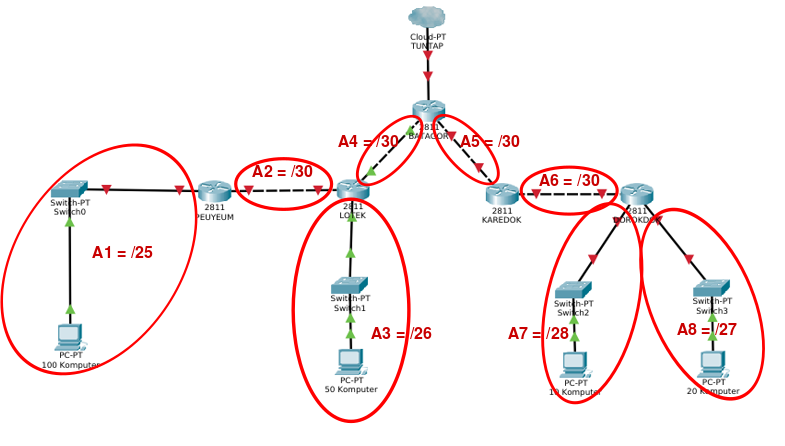

**Langkah 2** - Gabungkan subnet paling bawah di dalam topologi. Paling bawah berarti subnet yang paling jauh dari internet (gambar awan). Maka pada topologi yang digunakan kali ini, subnet yang dapat digabungkan adalah **A1** dengan **A2** dan subnet **A7** dengan **A8**. Subnet yang digabung tersebut akan membentuk sebuah subnet lebih besar dari subnet-subnet kecil yang ada di dalamnya.

Subnet **B1** merupakan hasil penggabungan dari subnet **A1** dan **A2**, Subnet **B2** merupakan hasil penggabungan dari subnet **A7** dan **A8**.

> ***Mengapa subnet B1 memiliki netmask /24? Dan subnet B2 memiliki netmask /26?***

Perhatikan subnet **A1** dan **A2**. Subnet **A1** memiliki netmask /25, dan subnet **A2** memiliki netmask /30. Pada teknik **CIDR** subnet gabungan akan memiliki netmask yang **1 tingkat di atas subnet terbesar yang digabungkan**. Berdasarkan contoh di atas A1 = /25 dan A2 = /30, maka jika dilakukan penggabungan akan menjadi subnet **B1** dengan netmask **/24**. Begitu pula dengan subnet B2.

Lalu ulangi langkah tersebut sampai menjadi sebuah subnet besar yang mencakup 1 topologi yang kita miliki.

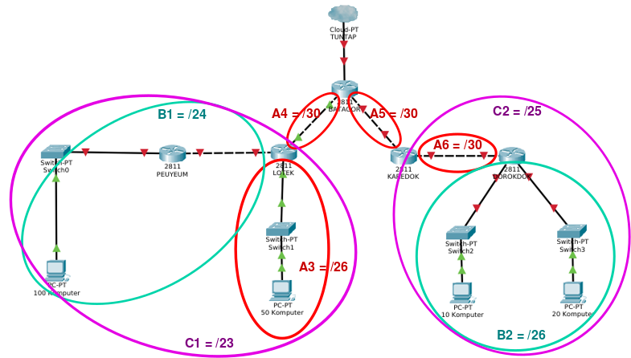

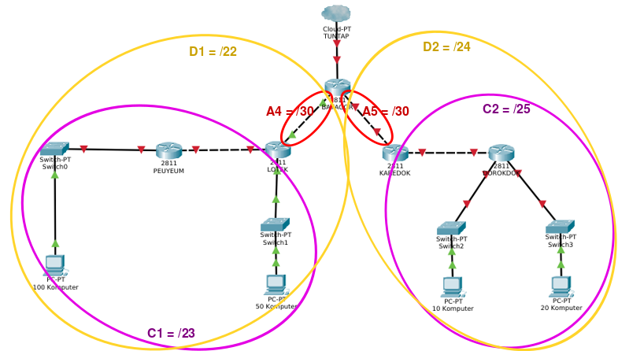

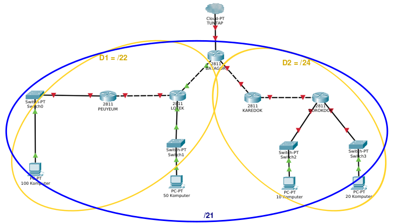

**Langkah 3** - Dari proses penggabungan yang telah dilakukan, didapatkan sebuah subnet besar dengan netmask **/21**. Kali ini dapat menggunakan NID **192.168.0.0**, netmask **255.255.248.0**.

**Langkah 4** - Hitung pembagian IP dengan pohon berdasarkan penggabungan subnet yang telah dilakukan.

> **Catatan**

> **Perbedaan** antara pohon VLSM dengan pohon CIDR adalah ketika satu subnet diturunkan, netmask yang akan terbentuk **disesuaikan dengan penggabungan subnet** yang telah dilakukan sebelumnya. Sebagai contoh, dari netmask besar /21, pada teknik VLSM akan dibagi dua menjadi masing-masing /22. Namun pada penggabungan yang dilakukan sebelumnya, /21 dihasilkan dari penggabungan /22 dan /24 maka subnet yang terbentuk memiliki netmask /22 dan /24.

**Langkah 5** - Berdasarkan penghitungan, maka didapatkan pembagian IP sebagai berikut.

Jika kalian menggunakan CIDR maka netmask yang terbentuk akan menjadi lebih besar dibandingkan dengan menggunakan VLSM. Tetapi salah satu **keunggulan** teknik **CIDR** adalah ketika terdapat subnet baru yang ditambahkan dalam topologi, **tidak perlu melakukan penghitungan kembali** karena kemungkinan besar masih ada interval (*range*) IP yang tidak terpakai. Selain itu, teknik CIDR juga mengefisienkan *routing* karena umumnya tabel routing yang dimiliki lebih sederhana dibandingkan teknik VLSM.

## C. ROUTING

### Pengertian
Setelah mengetahui bagaimana cara ***Subnetting*** suatu jaringan dan metode pembagian IP, terdapat satu hal lain yang perlu diketahui yaitu ***Routing***.

Dalam perkembangan dunia jaringan muncul banyak protokol *routing* yang dapat memudahkan administrator jaringan karena dapat memperbarui tabel routingnya secara otomatis, teknik tersebut dinamakan ***Dynamic Routing*** (**Perutean Dinamis**). Beberapa protokol *routing* dinamis terkenal antara lain RIP, RIP versi 2, EIGRP, dan OSPF. Protokol-protokol tersebut tidak dipelajari pada modul ini, namun dapat dipelajari lebih lanjut pada mata kuliah TAJ di semester 7 (gasal).

Routing yang dibahas yaitu ***Static Routing*** (**Perutean Statis**), yang mengharuskan administrator jaringan untuk menambahkan/ memberitahukan rute (*route*) baru ke dalam tabel routing ketika terdapat subnet tambahan dalam jaringannya.

Konsep *static routing* sederhana, daftarkan NID dan netmask yang ada serta tentukan gateway untuk menuju ke subnet tersebut. Untuk mencoba teknik *routing static*, kita akan menggunakan aplikasi **Cisco Packet Tracer**.

### Praktik

Buka aplikasi Cisco Packet Tracer, kita akan membuat topologi baru.

#### 1) Membuat Topologi

Silakan buat topologi menggunakan **Cisco Packet Tracer**. Untuk menambahkan Router, Switch, dan PC dapat dilakukan dengan *drag and drop* yang ada pada menu. Pada praktik kali ini, sesuaikan *device* dengan pilihan dengan kotak merah pada gambar di bawah 

* untuk menambahkan Cloud

* untuk menambahkan Router

* untuk menambahkan Switch

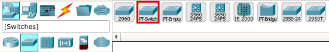

* untuk menambahkan PC

* untuk menambahkan Cable

* jika terdapat peringatan (*alert*) ketika menyambungkan kabel antar device, tambahkan port pada router terlebih dahulu.

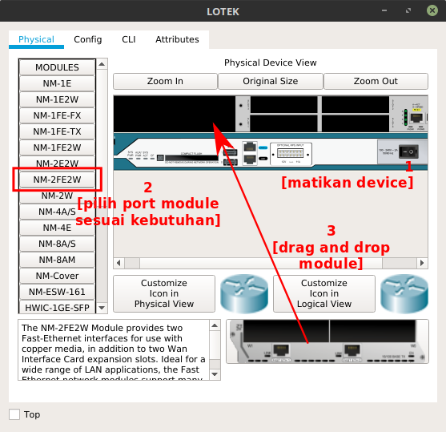

Pada UML, buatlah topologi tersebut seperti yang telah diajarkan pada [modul pengenalan UML](https://github.com/rohanaq/Modul-Pengenalan-UML) dengan **catatan** setiap *device* yang akan terhubung **harus** dihubungkan menggunakan ***switch***.

#### 2) Subnetting

Praktik kali ini akan menerapkan cara routing untuk teknik *subnetting* **VLSM** yang telah kita lakukan sebelumnya.

Atur IP untuk masing-masing **interface** yang ada di setiap *device* sesuai dengan pembagian subnet pada pohon **VLSM**.

Pada UML, buka /etc/network/interfaces untuk mengatur interface pada setiap perangkat.

Pada CPT, interface dapat diatur pada menu **Config** > **INTERFACE** > **“nama interface”** (contoh: FastEthernet0/0). Isi alamat IP dan subnet mask dari subnet interface tersebut. Berikut contoh untuk mengatur IP pada subnet **A4**.

Atur IP pada interface BATAGOR yang mengarah ke LOTEK dengan **192.168.1.5**.

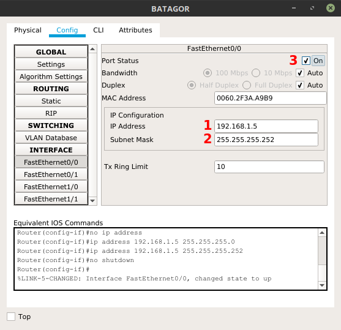

Atur IP pada interface LOTEK yang mengarah ke BATAGOR dengan **192.168.1.6**.

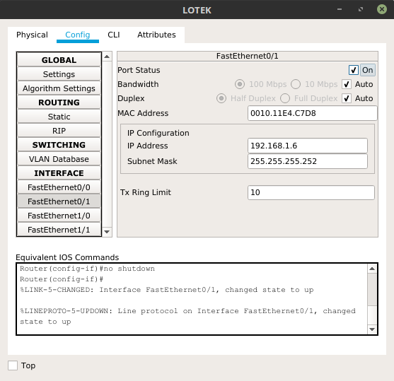

Selanjutnya atur IP pada subnet A3.
Atur IP pada interface LOTEK yang mengarah ke *client* dengan **192.168.1.65**.

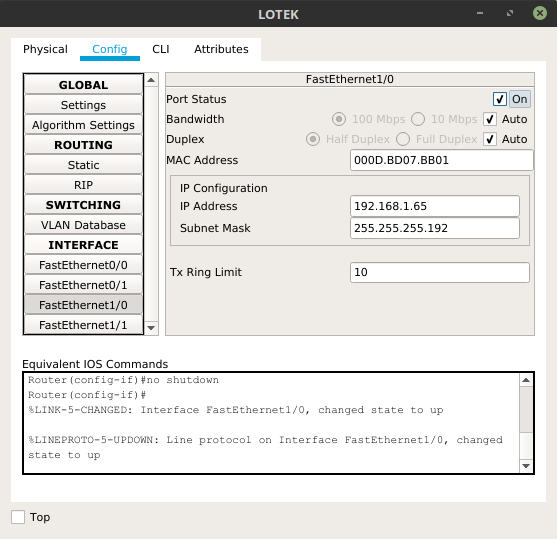

Atur IP pada *client* LOTEK dengan cara :
- Masuk ke *client*
- Pilih tab Desktop
- Pilih IP Configuration

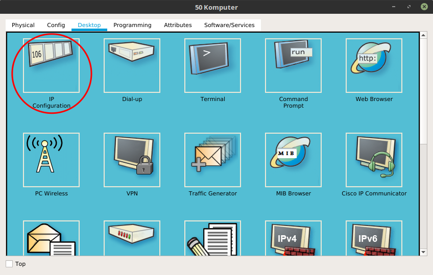

Lakukan hal yang sama untuk mengatur alamat IP setiap ***interface*** pada device yang ada dalam topologi. Setelah selesai, lakukan langkah selanjutnya yaitu ***Routing*** agar topologi dapat berfungsi dengan semestinya.

#### 3) Routing

Pada CPT, ***Routing*** dapat dilakukan pada menu **Config** > **Routing** > **Static** pada device **Router**. Lalu isi **Static Routes** seperti gambar dibawah pada BATAGOR dan tekan tombol **Add**

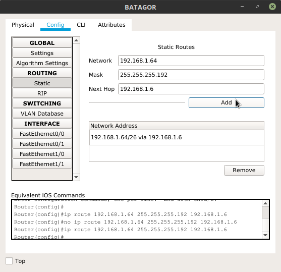

Pada *static routing* juga dibutuhkan ***default routing*** agar router dapat mengirimkan paket sesuai dengan tujuan. Default routing dibutuhkan untuk router yang berada di bawah router utama (router yang terhubung internet), contohnya LOTEK

***Keterangan*** : 
1. Network 192.168.1.64 adalah Network ID yang akan dihubungkan
2. Mask 255.255.255.192 adalah netmask dari subnet A3
3. Next Hop 192.168.1.65 (disebut **gateway**), adalah IP yang dituju ketika ingin menuju subnet poin 1, yaitu interface pada LOTEK yang mengarah ke BATAGOR

Pada **UML**, *routing* dilakukan pada device ***router*** dengan perintah :

    route add -net <NID subnet> netmask <netmask> gw <IP gateway>

Lalu lihat hasil *routing* dengan perintah :

    route -n

Maka sekarang, BATAGOR dan *host* pada LOTEK sudah saling terhubung. Agar semua subnet dapat saling terhubung, tambahkan *static routing* berikut :

1. Pada BATAGOR
    
        Network 192.168.1.128 Netmask 255.255.255.128 Next Hop 192.168.1.6
        Network 192.168.1.0 Netmask 255.255.255.252 Next Hop 192.168.1.6
        Network 192.168.1.12 Netmask 255.255.255.252 Next Hop 192.168.1.10
        Network 192.168.1.16 Netmask 255.255.255.240 Next Hop 192.168.1.10
        Network 192.168.1.32 Netmask 255.255.255.224 Next Hop 192.168.1.10

2. Pada LOTEK

        Network 192.168.1.128 Netmask 255.255.255.128 Next Hop 192.168.1.2

3. Pada PEUYEUM
        
        Network 0.0.0.0 Netmask 0.0.0.0 Next Hop 192.168.1.1

4. Pada KAREDOK

        Network 0.0.0.0 Netmask 0.0.0.0 Next Hop 192.168.1.9
        Network 192.168.1.16 Netmask 255.255.255.240 Next Hop 192.168.1.14
        Network 192.168.1.32 Netmask 255.255.255.224 Next Hop 192.168.1.14

5. Pada DOROKDOK

        Network 0.0.0.0 Netmask 0.0.0.0 Next Hop 192.168.1.13

**Kesimpulannya**, untuk melakukan *static routing* disesuaikan dengan daftar NID yang ada. Semakin banyak NID dalam suatu topologi, semakin banyak pula rute yang perlu ditambahkan ke router, maka diperlukan teknik pengelompokkan (***Subnetting***) yang tepat untuk menyederhanakan ***Routing***.
        
#### 4) Testing

Untuk mengetesnya dapat dilakukan dengan cara ping dari client ke IP tujuan atau menggunakan tombol dengan ikon surat pada *toolbar*.

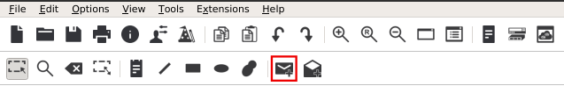

## LATIHAN!

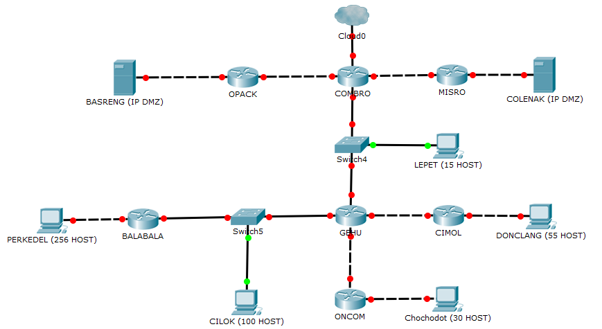

Implementasikan subnetting dan routing topologi di atas pada Cisco Packet Tracer dan UML menggunakan teknik subnetting yang berbeda! Contoh pada Cisco Packet Tracer menggunakan CIDR, pada UML menggunakan VLSM atau sebaliknya. (Untuk UML, tiap subnet diwakili satu client/komputer saja) 
