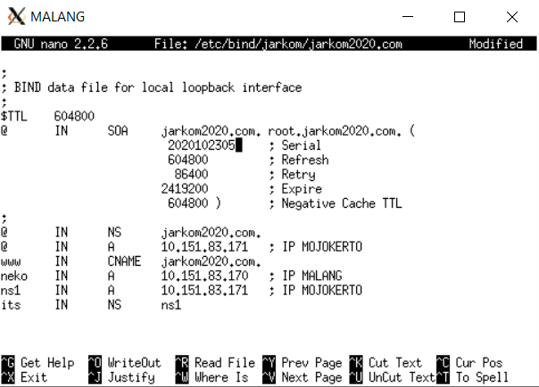
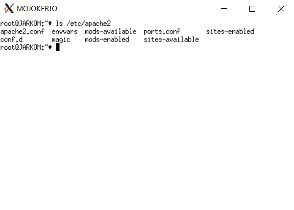
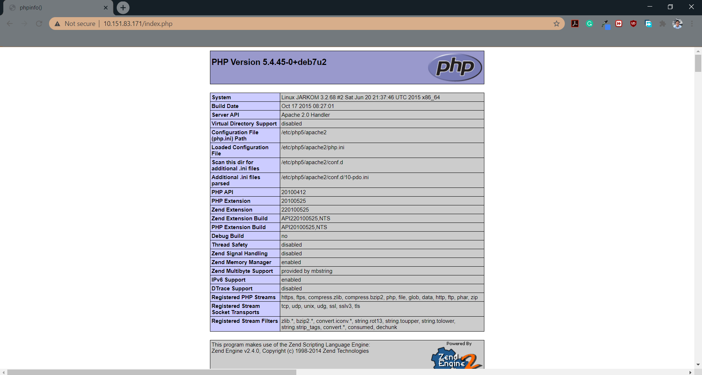
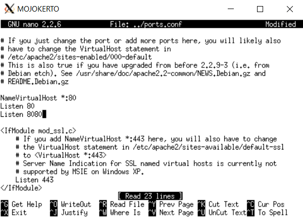
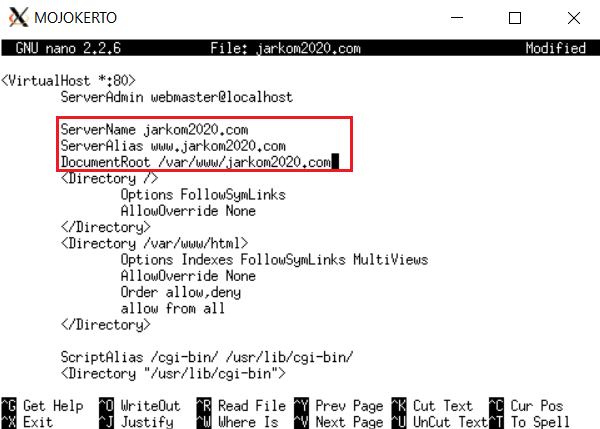
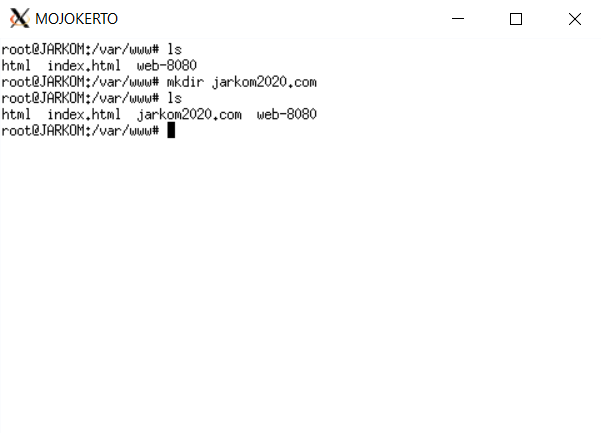
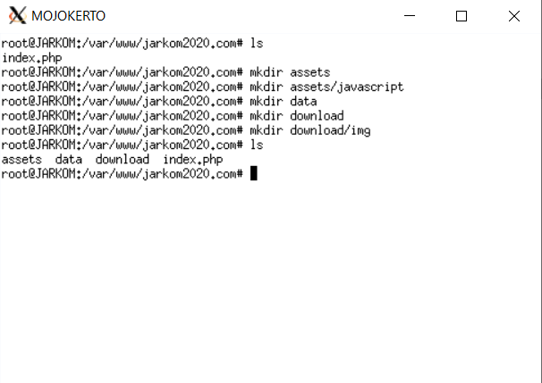
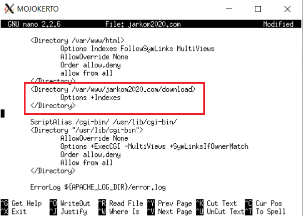
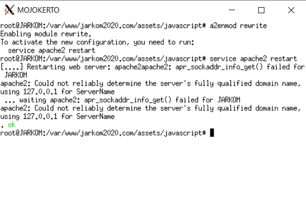

# Web Server

## Daftar Isi
+ A. [Persyaratan Tambahan untuk Mengikuti Sesi Lab ](#a-persyaratan-tambahan-untuk-mengikuti-sesi-lab)
+ B. [Penting Untuk Dibaca](#b-penting-untuk-dibaca)
+ C. [Dasar Teori](#c-dasar-teori)
  + 1.[ Web Server](#1-web-server)
  + 2.[ Load Balancing](#2-load-balancing)
  + 3.[ Apache Web Server](#3-apache-web-server)
+ D. [Instalasi Apache](#d-instalasi-apache)
+ E. [Instalasi PHP](#e-instalasi-php)
+ F. [Mengenal Apache](#f-mengenal-apache)
+ G. [Konfigurasi Apache Sederhana](#g-konfigurasi-apache-sederhana)
  + A. [Penggunaan Sederhana](#a-penggunaan-sederhana)
  + B. [Membuat Konfigurasi Website Menggunakan Port 8080](#b-membuat-konfigurasi-website-menggunakan-port-8080)
+ H. [Mari Berimajinasi](#h-mari-berimajinasi)
  + A. [Setting Domain pada Apache](#a-setting-domain-pada-apache)
  + B. [Directory Listing](#b-directory-listing)
  + C. [Directory Alias](#c-directory-alias)
  + D. [Module Rewrite](#d-module-rewrite)

## A. Persyaratan Tambahan untuk Mengikuti Sesi Lab
Record A dan PTR pada jarkom2020.com sudah harus mengarah ke IP MOJOKERTO




## B. Penting Untuk Dibaca
1. Pastikan semua UML dapat terhubung ke internet, baik dapat melakukan koneksi ke luar maupun dapat ping dari luar (Khusus DMZ)
2. Pastikan UML Mojokerto dan Malang sudah memiliki memory 256M
3. Jangan mencoba untuk mendahului arahan asisten. Kelalaian ditanggung praktikan.
4. Ketika mengalami kendala/error __cek syntax dan samakan seperti modul__ terlebih dahulu. Besar kemungkinan masalah yang terjadi dikarenakan adanya kesalahan dalam pengetikan.
5. ___Khusus untuk pengguna sistem operasi Windows___, demi lancarnya praktikum Web Server, sebelum menjalankan UML, ubah konfigurasi pada file VPN yang kalian gunakan. Tambahkan `dhcp-option DNS "IP MALANG TIAP KELOMPOK"` di file .ovpn yang digunakan, hapus profil VPN, dan buat profil VPN baru menggunakan konfigurasi yang ditambahkan.


## C. Dasar Teori
### 1. Web Server
Terdapat dua pengertian dari web server. Secara _hardware_, web server berarti sebuah storage yang digunakan untuk menyimpan semua data dari aplikasi web (file HTML, CSS, JavaScript, dll.). Sedangkan secara _software_,  web server adalah sebuah perangkat yang bertugas untuk menyediakan layanan akses menggunakan protokol HTTP atau HTTPS melalui aplikasi web.

### 2. Load Balancing
___Load balancing___ adalah suatu mekanisme penyeimbangan beban yang bekerja dengan cara membagi beban pekerjaan. ___Load balancer___ adalah aplikasi atau alat yang bertugas untuk melakukan _load balancing_. _Load balancer_ dapat meggunakan berbagai macam algoritma _load balancing_ yang bertujuan untuk membagi beban pekerjaan seadil-adilnya. Arsitektur minimal untuk _load balancing_ adalah sebagai berikut:


#### Kenapa dibutuhkan load balancing?
Untuk menangani banyaknya pengguna yang mengakses layanan pada satu waktu dan menjaga layanan tetap tersedia setiap saat, dibutuhkan lebih dari satu komputer untuk memasang layanannya. Dengan layanan yang tersedia di banyak server, dibutuhkan mekanisme pembagian beban untuk memberikan beban yang seimbang pada setiap server. Dengan meletakkan layanan pada beberapa server dan pembagian beban yang optimal, setiap permintaan pengguna bisa ditangani dengan efisien.

### 3. Apache Web Server
__Apache HTTP Server__ atau biasa disebut Apache adalah sebuah _software_ web server _cross-platform_ dan _open source_ yang banyak digunakan. Dalam sesi lab ini, kita akan menggunakan Apache sebagai _software_ web server kita.

## D. Instalasi Apache
#### 1. Buka UML _MOJOKERTO_
Lalu jalankan perintah
```
apt-get install apache2
```
jika muncul tulisan _"Do you want to continue? [Y/n]"_  input `Y` lalu tekan ___enter___. 


#### 2. Buka browser laptop/komputer masing-masing
Buka web __IP Mojokerto Masing-Masing Kelompok__ sampai muncul halaman Apache seperti di bawah ini.


## E. Instalasi PHP
#### 1. Buka UML Mojokerto
Lalu jalankan perintah
```
apt-get install php5
```
jika muncul tulisan _"Do you want to continue? [Y/n]"_  input `Y` lalu tekan ___enter___. 


#### 2. Test apakah php sudah ter-install
Jalankan perintah di bawah ini untuk memeriksa versi dari __php__ kalian.
```
php -v
```
Bila _output_-nya mirip dengan yang di bawah ini, maka __php__ kalian telah ter-_install_.


## F. Mengenal Apache
Web server Apache memiliki _directory_ berisi berbagai konfigurasi yang terletak di `/etc/apache2/`



Berikut beberapa hal yang penting untuk diketahui:
+ File Konfigurasi di `/etc/apache2`

|__Nama File__ | __Kegunaan__ |
| --- | --- |
| __apache2.conf__ | File konfigurasi utama apache2 |
| __ports.conf__ | File konfigurasi port yang digunakan untuk web server |
| __sites-available__ | _Directory_ tempat konfigurasi website (virtual host) yang tersedia |
| __sites-enabled__ | _Directory_ tempat konfigurasi website (virtual host) yang tersedia dan sudah aktif |
| __mods-available__ | _Directory_ tempat modul-moadul apache2 yang tersedia |
| __mods-enabled__ | _Directory_ tempat modul-moadul apache2 yang tersedia dan sudah aktif |

+ _Command_ yang sering digunakan

|__Command__ | __Kegunaan__ |
| --- | --- |
| __a2ensite__ | Untuk mengaktifkan (_ENABLE_) konfigurasi website yang telah dibuat |
| __a2dissite__ | Untuk menonaktifkan (_DISABLE_) konfigurasi website yang sedang aktif |
| __a2enmod__ | Untuk mengaktifkan (_ENABLE_) sebuah modul tertentu ke dalam konfigurasi apache2 |
| __a2dismod__ | Untuk menonaktifkan (_DISABLE_) sebuah modul tertentu dalam konfigurasi apache2 |

## G. Konfigurasi Apache Sederhana
### A. Penggunaan Sederhana
#### A.1. Pindah ke _directory_ `/etc/apache2/sites-available`
Gunakan perintah `cd /etc/apache2/sites-available`


Dapat dilihat di sana terdapat dua buah file:
+ file __default__, file konfigurasi website default apache untuk http.
+ file __default-ssl__, file konfigurasi website default apache untuk https.
  
__Catatan tambahan__ :

Cek versi apache2 yang telah kalian install dengan menggunakan command : `apache2 -v`. Jika versi apache2 yang telah kalian install versi 2.2.x maka mengikuti sesuai modul. Jika versi apache yang telah kalian install versi 2.4.x maka mengikuti sesuai modul dengan catatan tambahan tertentu.

#### A.2. Buka file ___default___
Untuk versi 2.2.x gunakan perintah `nano /etc/apache2/sites-available/default`. Sedangkan untuk versi 2.4.x gunakan perintah `nano /etc/apache2/sites-available/default.conf`

__Catatan tambahan__  :

Untuk versi 2.4.x setiap configurasi file yang berada di directory `/etc/apache2/sites-available` nama file-nya ditambahi dengan `.conf`. Contoh : `/etc/apache2/sites-available/default.conf`. Karena jika tidak ditambahi dengan `.conf` maka akan error.


#### A.3.  Pada file _default_ terdapat konfigurasi standar apache
Beberapa diantaranya adalah:
##### __Port__ yang digunakan
```
<VirtualHost *:80>
```
Konfigurasi di atas menunjukkan bahwa port yang digunakan adalah port 80

##### ___Directory___ tempat file website kita berada
```
DocumentRoot /var/www
```
+ Untuk sesi lab JarKom ini silahkan mengubah _DocumentRoot_-nya menjadi `/var/www/html`
+ Begitu juga dengan _line_ ke-9, diubah dari `<Directory /var/www/>` menjadi `<Directory /var/www/html>` 
+ Jangan lupa lakukan `service apache2 restart` setelah melakukan perubahan konfigurasi agar perubahan yang telah dilakukan teraplikasikan

#### A.4. Pindah ke _directory_ yang ditunjuk oleh _DocumentRoot_ pada file _default_
Gunakan perintah `cd /var/www/`

+ Karena tadi kita mengubah _DocumentRoot_ di file _default_ menjadi `/var/www/html`, maka sekarang buatlah _directory_ bernama "html" dengan perintah `mkdir /var/www/html`

#### A.5. Pindah ke _directory_ `/var/www/html` dan buat file _index.php_
Gunakan perintah `nano /var/www/html/index.php` dan isi file  tersebut dengan
```
<?php
	phpinfo();
?>
```


#### A.6. Buka browser laptop/komputer masing-masing
Akses alamat __http://[IP Mojokerto]/index.php__



+ __Catatan__:
	Apabila tampilan web tidak muncul seperti gambar di atas dan hanya muncul plain text isi file index.php, silahkan install **libapache2-mod-php7.0** dengan menjalankan perintah
	```
	apt-get install libapache2-mod-php7.0
	```
	lalu restart apache dengan perintah
	```
	service apache restart
	```

### B. Membuat Konfigurasi Website Menggunakan Port 8080
#### B.1 Pindah ke _directory_ `/etc/apache2/sites-available`
Pindah ke _directory_ `/etc/apache2/sites-available` menggunakan perintah 
```
cd /etc/apache2/sites-available
```
Copy file _default_ menjadi file _default-8080_ dengan perintah
```
cp default default-8080
```
Jangan lupa untuk menambahkan `.conf` jika apache2 versi 2.4.x. Jika sudah kalian bisa rename file tersebut menggunakan perintah
```
mv default-8080 default-8080.conf
```

#### B.2 Buka file _default-8080_
Buka file yang telah kalian buat pada sebelumnya. Gunakan perintah `nano /etc/apache2/sites-available/default-8080`. Jangan lupa untuk menambahkan `.conf` jika apache2 versi 2.4.x. 
+ Kemudian ubah port yang digunakan. Dimana awalnya port `80` menjadi port `8080`.
+ Ubah juga _DocumentRoot_ yang awalnya `/var/www/html` menjadi `/var/www/web-8080`.


#### B.3 Tambahkan _port 8080_ pada file `ports.conf`
File __ports.conf__ berada pada _directory_ `/etc/apache2`

Cara menambahkan port yang perlu didengar adalah dengan menuliskan
```
Listen 8080
```



#### B.4 Aktifkan konfigurasi _default-8080_
Untuk mengaktifkan suatu konfigurasi, kita menggunakan perintah `a2ensite` diikuti dengan __nama file konfigurasi__ yang telah dibuat.
Dalam kasus ini perintah yang dijalankan adalah
```
a2ensite default-8080
```


#### B.5 Restart apache
Gunakan perintah `service apache2 restart`


#### B.6 Pindah ke _directory_ `/var/www`
Buatlah sebuah _directory_ baru di dalam `var/www` dengan nama __web-8080__


#### B.7 Masuk ke _directory_ `/var/www/web-8080` dan buat file _index.php_
Isi file __index.php__ tersebut dengan
```
<?php
    echo "Halo, saya running di port 8080";
?>
```


#### B.8 Buka browser laptop/komputer masing-masing
Akses alamat __http://[IP Mojokerto]:8080__


## H. Mari Berimajinasi
### A. Setting Domain pada Apache
Kamu dan Vinsen adalah satu kelompok dalam mata kuliah Jaringan Komputer. Mereka diperintahkan oleh asisten untuk membuat website dengan domain __jarkom2020.com__, dan diberikan akses ke server yang bisa digunakan sebagai tempat host untuk websitenya. Tapi karena sesuatu dan lain hal, Vinsen tidak bisa membantumu mengerjakan perintah dari asisten. Beruntungnya, Vinsen meninggalkan catatan untuk Kamu ikuti agar Kamu dapat menyelesaikan perintah dari asisten.

Ayo bantu Kamu dengan mengonfigurasi server sesuai petunjuk yang diberikan Vinsen:

#### A.1 Pindah ke _directory_ `/etc/apache2/sites-available`
Copy file __default__ menjadi file __jarkom2020.com__. Jangan lupa untuk menambahkan `.conf` jika apache2 versi 2.4.x


#### A.2 Buka file _jarkom2020.com_
+ Tambahkan
	```
	ServerName jarkom2020.com
	ServerAlias www.jarkom2020.com
	```
	Menurut [dokumentasi apache2.2](https://httpd.apache.org/docs/2.2/mod/core.html):
	+ `ServerName` adalah "_Hostname and port that the server uses to identify itself_"
	+ `ServerAlias` adalah "_Alternate names for a host used when matching requests to name-virtual host_"
+ Ubah _DocumentRoot_ menjadi `/var/www/jarkom2020.com`



#### A.3 Aktifkan konfigurasi _jarkom2020.com_
Gunakan perintah `a2ensite jarkom2020.com`

#### A.4 Restart apache
Gunakan perintah `service apache2 restart`


#### A.5 Pindah ke _directory_ `/var/www`
Kemudian buatlah sebuah _directory_ baru di dalam `var/www` dengan nama __jarkom2020.com__



#### A.6 Masuk ke _directory_ `/var/www/jarkom2020.com` dan buat file _index.php_
Isi file __index.php__ tersebut dengan
```
<?php
    echo "Kabupaten Mojokerto adalah sebuah kabupaten di Provinsi Jawa Timur, Indonesia. Kabupaten yang secara resmi didirikan pada tanggal 9 Mei 1293 ini merupakan wilayah tertua ke-10 di Provinsi Jawa Timur.";
?>
```


#### A.7 Ganti DNS laptop/komputer sesuai IP Malang masing-masing
+ __Pada Windows__
	+ Sudah dijelaskan sebelumnya. 
	
+ __Pada Linux__
	+ Ubah file __/etc/resolv.conf__ dengan perintah `sudo nano /etc/resolv.conf`
	+ _Comment_ DNS yang sedang aktif dan tambahkan `nameserver <IP Malang>`
	+ Simpan hasil perubahannya


#### A.8 Buka browser dan akses _jarkom2020.com_


### B. Directory Listing
Di dalam _directory_ `/var/www/jarkom2020.com` diberikan struktur _directory_ sebagai berikut.
```
/var/www/jarkom2020.com/
├── assets/
│   └── javascript/
├── data/
└── download/
    └── img/
```
Perintah berikutnya dari asisten adalah untuk membuat beberapa direktori, __/assets__, __/data__, dan __/download__. Direktori __/download__ harus dapat menampilkan daftar file yang ada dalam direktori tersebut, sedangkan direktori __/assets__ tidak boleh menampilkan isi direktori tersebut.

Ayo bantu Kamu yang kebingungan membaca penjelasan dari Vinsen agar dapat mengerjakan perintah asisten. 

#### B.1 Buat _directory-directory_ yang diperlukan oleh website jarkom2020.com milik Rachma
Gunakan perintah-perintah berikut ini:
```
mkdir /var/www/jarkom2020.com/data
mkdir /var/www/jarkom2020.com/download
mkdir /var/www/jarkom2020.com/download/img
mkdir /var/www/jarkom2020.com/assets
mkdir /var/www/jarkom2020.com/assets/javascript
```



#### B.2 Aktifkan Directory Listing untuk /download
+ Pindah ke _directory_ `/etc/apache2/sites-available` kemudian buka file ___jarkom2020.com___ dan tambahkan
	```
	<Directory /var/www/jarkom2020.com/download>
	    Options +Indexes
	</Directory>
	```
	jangan lupa untuk menyimpan perubahan tersebut agar _directory_  ___download___ menampilkan isi _directory_-nya.
	
	
	
	
+ Restart apache dengan perintah `service apache2 restart`
+ Buka browser dan akses http://jarkom2020.com/download


__Keterangan__:
Untuk mengatur _directory_ pada sebuah web, menggunakan
```
<Directory /x> ... </Directory>
```
Contoh untuk mengatur `/var/www/jarkom2020.com/download`
```
<Directory /var/www/jarkom2020.com/download>
	
</Directory>
```

#### B.3 Matikan Directory Listing untuk /assets
+ Pindah ke _directory_ `/etc/apache2/sites-available` kemudian buka file ___jarkom2020.com___ dan tambahkan
	```
	<Directory /var/www/jarkom2020.com/assets>
	    Options -Indexes
	</Directory>
	```
	jangan lupa untuk menyimpan perubahan tersebut agar _directory_  ___assets___ tidak menampilkan isi _directory_-nya.
	
	
	
+ Restart apache dengan perintah `service apache2 restart`
+ Buka browser dan akses http://jarkom2020.com/assets


### C. Directory Alias
Karena URL __http://[IP Mojokerto]/assets/javascript__ dirasa terlalu panjang, maka Kamu mencoba membuat _directory alias_ menjadi __http://[IP Mojokerto]/assets/js__ agar lebih terlihat _simple_.

Berikut adalah langkah-langkah pengerjaan yang diberikan Vinsen:

+ Pindah ke _directory_ `/etc/apache2/sites-available` kemudian buka file ___jarkom2020.com___ dan tambahkan
	```    
	<Directory /var/www/jarkom2020.com/assets/javascript>
	    Options +Indexes
	</Directory>
	
	Alias "/assets/js" "/var/www/jarkom2020.com/assets/javascript"
	```

	jangan lupa untuk menyimpan perubahan tersebut agar _directory_  ___assets/javascript___ dapat menampilkan isi _directory_-nya saat pengguna mengakses __http://[IP Mojokerto]/assets/js__.
	
	
	
+ Restart apache dengan perintah `service apache2 restart`
+ Pindah ke folder __/var/www/jarkom2020.com/assets/javascript__ dan buat file __app.js__ dengan perintah `touch app.js`
+ Buka browser dan akses http://jarkom2020.com/assets/js


### D. Module Rewrite
#### D.1 Aktifkan Module Rewrite
Perintah asisten berikutnya adalah menyalakan _module rewrite_ agar penulisan URL menjadi lebih rapi dan tanpa perlu menuliskan ekstensi _.php_ ketika mengakses laman.

+ Jalankan perintah `a2enmod rewrite` untuk mengaktifkan _module rewrite_.
	
+ Restart apache dengan perintah `service apache2 restart`

	

Biasanya semua konfigurasi terhadap sebuah website diatur pada file di _directory_ __/etc/apache2/sites-available__. Namun terkadang ada sebuah kasus bahwa   hak akses root untuk mengedit file konfigurasi yang berada di folder __/etc/apache2/sites-available__ tidak dimiliki, atau kita tidak ingin user lain untuk mengedit file konfigurasi yang berada di _directory_ __/etc/apache2/sites-available__.

Untuk mengatasi masalah tersebut, buat file __.htaccess__ pada _directory_ yang akan diatur.

Contohnya adalah seperti kasus di atas, dimana kita ingin mengatur _mod rewrite_ dari __[http://jarkom2020.com](http://jarkom2020.com)__ agar saat mengakses file php kita tidak perlu menuliskan ekstensinya. Maka yang yang perlu kita lakukan adalah
+ Pindah ke _directory_ `/var/www/jarkom2020.com` dan buat file __.htaccess__ dengan isi file
	```
	RewriteEngine On
	RewriteCond %{REQUEST_FILENAME} !-d
	RewriteRule ^([^\.]+)$ $1.php [NC,L]
	```

	

	__Keterangan__:
	+ `RewriteEngine On` = untuk flag bahwa menggunakan module rewrite
	+ `RewriteCond %{REQUEST_FILENAME} !-d` = aturan tidak akan jalan ketika yang diakses adalah _directory_ (d)
	+ `RewriteRule ^([^\.]+)$ $1.php [NC,L]` = $1 adalah parameter input yang akan dicari oleh webserver
	* Lebih detailnya [klik disini](https://httpd.apache.org/docs/2.4/rewrite/flags.html)
+ Buat file _about.php_ di dalam _directory_ `/var/www/jarkom2020.com/` dengan isi
	```
	<?php
		echo "Ini adalah halaman About";
	?>
	```
+ Pindah ke _directory_ `/etc/apache2/sites-available` kemudian buka file ___jarkom2020.com___ dan tambahkan
	```
	<Directory /var/www/jarkom2020.com>
	    Options +FollowSymLinks -Multiviews
	    AllowOverride All
	</Directory>
	```
	dan jangan lupa untuk menyimpan perubahan tersebut.
	
	
	
	__Keterangan__:
	+ `AllowOverride All` ditambahkan agar  konfigurasi __.htaccess__ dapat berjalan.
	+ `+FollowSymLinks` ditambahkan agar konfigurasi __mod_rewrite__ dapat berjalan.
	+ `-Multiviews` ditambahkan agar konfigurasi __mod_negotiation__ tidak dapat berjalan. __mod_negotiation__ bisa '_rewrite_' _requests_ sehingga menimpa dan mengganggu __mod_rewrite__.

+ Restart apache dengan perintah `service apache2 restart`
+ Buka browser dan akses __http://jarkom2020.com/aboutus__

	
	
<!-- ### E. Otorisasi
Pada web http:jarkom2020.com terdapat path __/data__ yang tidak boleh dibuka sembarang orang. Rachma ingin __/data__ hanya boleh diakses oleh pengguna yang memiliki IP 10.151.252.0/255.255.252.0

Maka yang diinstruksikan Ifin agar _directory_ __/data__ milik Rachma tetap aman adalah
+ Pindah ke _directory_ `/etc/apache2/sites-available` kemudian buka file ___jarkom2020.com___ dan tambahkan
	```
	<Directory /var/www/jarkom2020.com/data>
	    Options +Indexes
	    Order deny,allow
	    Deny from all
	    Allow from 10.151.252.0/255.255.252.0
	</Directory>
	```
	jangan lupa untuk menyimpan perubahan tersebut.
	
	__Keterangan__:
	+ `Order deny, allow` merupakan urutan hak akses. Terdapat dua jenis tipe order yaitu:
		+ `deny,allow`: Bagian _Deny_ harus di-_declare_ terlebih dahulu sebelum _Allow_
		+ `allow,deny`: Bagian _Allow_ harus di-_declare_ terlebih dahulu sebelum _Deny_
	+ `Deny from all`  berarti semua pengguna ditolak
	+ `Allow from 10.151.252.0/255.255.252.0` berarti apabila pengguna memiliki IP NID 10.151.252.0./22, ia diperbolehkan untuk mengakses halaman.
	+ Info lebih lanjut [klik disini](https://httpd.apache.org/docs/2.4/mod/mod_access_compat.html)	+ Restart apache dengan perintah `service apache2 restart`
+ Buka browser dan akses __http://jarkom2020.com/data__
Saat pengguna tidak memiliki __IP NID 10.151.252.0/22__ maka akan muncul halaman seperti di bawah ini

	IMG HERE

Sedangkan saat pengguna  memiliki __IP NID 10.151.252.0/22__ maka halaman yang muncul adalah seperti di bawah ini

	IMG HERE

-->

## I. Latihan
<!-- #### TBA -->
1. Download halaman jatim di 10.151.36.202/jatim.zip
2. Buat domain baru dengan nama __jatim.yyy.id__ untuk membuka halaman tersebut.
3. Atur agar jika kalian mengetikkan __jatim.yyy.id__, Web jatim dapat terbuka. 
### Catatan
+ Untuk download halaman web, gunakan perintah `wget 10.151.36.202/jatim.zip`
+ Kemudian unzip file tersebut. Jika muncul error seperti `unzip: command not found` maka install unzip terlebih dahulu menggunakan command `apt-get install unzip`.
+ Buat directory hasil unzip file tersebut menjadi _DocumentRoot_ web
+ Untuk nomor 2 dan 3, '__yyy__' diisi dengan nama kelompok. Contoh: __jatim.a04.id__


## Selamat belajar dan tetap semangat!
<p align="center">
	
</p>

<!-- 
	
	
	
	
	
	
	
	
	
 -->
